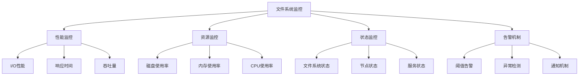

# 文件系统监控

## 📖 核心概念

**文件系统监控**是对文件系统运行状态、性能和资源使用情况进行实时监控的技术。通过监控指标收集、性能分析和告警机制，确保文件系统的稳定运行和优化。

### 🏗️ 文件系统监控分类



## 🔧 文件系统监控实现

### 性能监控

```cpp
class PerformanceMonitor {
private:
    struct IOMetrics {
        long long readBytes;
        long long writeBytes;
        int readOperations;
        int writeOperations;
        double readLatency;
        double writeLatency;
        chrono::time_point<chrono::high_resolution_clock> lastUpdate;
        
        IOMetrics() : readBytes(0), writeBytes(0), readOperations(0), writeOperations(0), 
                     readLatency(0.0), writeLatency(0.0) {
            lastUpdate = chrono::high_resolution_clock::now();
        }
    };
    
    struct ThroughputMetrics {
        double readThroughput;    // MB/s
        double writeThroughput;   // MB/s
        double totalThroughput;   // MB/s
        int operationsPerSecond;
        
        ThroughputMetrics() : readThroughput(0.0), writeThroughput(0.0), 
                            totalThroughput(0.0), operationsPerSecond(0) {}
    };
    
    IOMetrics ioMetrics;
    ThroughputMetrics throughputMetrics;
    vector<double> responseTimeHistory;
    int maxHistorySize;
    
public:
    PerformanceMonitor(int historySize = 100) : maxHistorySize(historySize) {}
    
    // 记录读取操作
    void recordReadOperation(int bytes, double latency) {
        ioMetrics.readBytes += bytes;
        ioMetrics.readOperations++;
        ioMetrics.readLatency = (ioMetrics.readLatency * (ioMetrics.readOperations - 1) + latency) / ioMetrics.readOperations;
        
        responseTimeHistory.push_back(latency);
        if (responseTimeHistory.size() > maxHistorySize) {
            responseTimeHistory.erase(responseTimeHistory.begin());
        }
        
        updateThroughput();
        cout << "Recorded read operation: " << bytes << " bytes, latency: " << latency << "ms" << endl;
    }
    
    // 记录写入操作
    void recordWriteOperation(int bytes, double latency) {
        ioMetrics.writeBytes += bytes;
        ioMetrics.writeOperations++;
        ioMetrics.writeLatency = (ioMetrics.writeLatency * (ioMetrics.writeOperations - 1) + latency) / ioMetrics.writeOperations;
        
        responseTimeHistory.push_back(latency);
        if (responseTimeHistory.size() > maxHistorySize) {
            responseTimeHistory.erase(responseTimeHistory.begin());
        }
        
        updateThroughput();
        cout << "Recorded write operation: " << bytes << " bytes, latency: " << latency << "ms" << endl;
    }
    
    // 更新吞吐量
    void updateThroughput() {
        auto now = chrono::high_resolution_clock::now();
        auto elapsed = chrono::duration_cast<chrono::seconds>(now - ioMetrics.lastUpdate).count();
        
        if (elapsed > 0) {
            throughputMetrics.readThroughput = (double)ioMetrics.readBytes / (1024 * 1024) / elapsed;
            throughputMetrics.writeThroughput = (double)ioMetrics.writeBytes / (1024 * 1024) / elapsed;
            throughputMetrics.totalThroughput = throughputMetrics.readThroughput + throughputMetrics.writeThroughput;
            throughputMetrics.operationsPerSecond = (ioMetrics.readOperations + ioMetrics.writeOperations) / elapsed;
            
            ioMetrics.lastUpdate = now;
        }
    }
    
    // 获取平均响应时间
    double getAverageResponseTime() {
        if (responseTimeHistory.empty()) {
            return 0.0;
        }
        
        double sum = 0.0;
        for (double time : responseTimeHistory) {
            sum += time;
        }
        
        return sum / responseTimeHistory.size();
    }
    
    // 获取P95响应时间
    double getP95ResponseTime() {
        if (responseTimeHistory.empty()) {
            return 0.0;
        }
        
        vector<double> sortedTimes = responseTimeHistory;
        sort(sortedTimes.begin(), sortedTimes.end());
        
        int index = (int)(sortedTimes.size() * 0.95);
        return sortedTimes[index];
    }
    
    // 获取P99响应时间
    double getP99ResponseTime() {
        if (responseTimeHistory.empty()) {
            return 0.0;
        }
        
        vector<double> sortedTimes = responseTimeHistory;
        sort(sortedTimes.begin(), sortedTimes.end());
        
        int index = (int)(sortedTimes.size() * 0.99);
        return sortedTimes[index];
    }
    
    // 显示性能指标
    void displayPerformanceMetrics() {
        cout << "Performance Metrics:" << endl;
        cout << "===================" << endl;
        
        cout << "I/O Metrics:" << endl;
        cout << "  Read bytes: " << ioMetrics.readBytes << endl;
        cout << "  Write bytes: " << ioMetrics.writeBytes << endl;
        cout << "  Read operations: " << ioMetrics.readOperations << endl;
        cout << "  Write operations: " << ioMetrics.writeOperations << endl;
        cout << "  Average read latency: " << ioMetrics.readLatency << "ms" << endl;
        cout << "  Average write latency: " << ioMetrics.writeLatency << "ms" << endl;
        
        cout << "Throughput Metrics:" << endl;
        cout << "  Read throughput: " << throughputMetrics.readThroughput << " MB/s" << endl;
        cout << "  Write throughput: " << throughputMetrics.writeThroughput << " MB/s" << endl;
        cout << "  Total throughput: " << throughputMetrics.totalThroughput << " MB/s" << endl;
        cout << "  Operations per second: " << throughputMetrics.operationsPerSecond << endl;
        
        cout << "Response Time Metrics:" << endl;
        cout << "  Average response time: " << getAverageResponseTime() << "ms" << endl;
        cout << "  P95 response time: " << getP95ResponseTime() << "ms" << endl;
        cout << "  P99 response time: " << getP99ResponseTime() << "ms" << endl;
    }
};
```

### 资源监控

```cpp
class ResourceMonitor {
private:
    struct DiskUsage {
        string mountPoint;
        long long totalSpace;
        long long usedSpace;
        long long freeSpace;
        double usagePercentage;
        
        DiskUsage(const string& mount, long long total) : mountPoint(mount), totalSpace(total) {
            usedSpace = 0;
            freeSpace = total;
            usagePercentage = 0.0;
        }
    };
    
    struct MemoryUsage {
        long long totalMemory;
        long long usedMemory;
        long long freeMemory;
        long long cachedMemory;
        double usagePercentage;
        
        MemoryUsage(long long total) : totalMemory(total) {
            usedMemory = 0;
            freeMemory = total;
            cachedMemory = 0;
            usagePercentage = 0.0;
        }
    };
    
    struct CPUUsage {
        double userTime;
        double systemTime;
        double idleTime;
        double usagePercentage;
        
        CPUUsage() : userTime(0.0), systemTime(0.0), idleTime(0.0), usagePercentage(0.0) {}
    };
    
    map<string, DiskUsage> diskUsage;
    MemoryUsage memoryUsage;
    CPUUsage cpuUsage;
    
public:
    ResourceMonitor() : memoryUsage(8 * 1024 * 1024 * 1024) { // 8GB
        // 初始化磁盘使用情况
        diskUsage["/"] = DiskUsage("/", 100 * 1024 * 1024 * 1024); // 100GB
        diskUsage["/data"] = DiskUsage("/data", 500 * 1024 * 1024 * 1024); // 500GB
    }
    
    // 更新磁盘使用情况
    void updateDiskUsage(const string& mountPoint, long long usedSpace) {
        auto it = diskUsage.find(mountPoint);
        if (it != diskUsage.end()) {
            it->second.usedSpace = usedSpace;
            it->second.freeSpace = it->second.totalSpace - usedSpace;
            it->second.usagePercentage = (double)usedSpace / it->second.totalSpace * 100;
            
            cout << "Updated disk usage for " << mountPoint << ": " 
                 << it->second.usagePercentage << "%" << endl;
        }
    }
    
    // 更新内存使用情况
    void updateMemoryUsage(long long usedMemory, long long cachedMemory = 0) {
        memoryUsage.usedMemory = usedMemory;
        memoryUsage.cachedMemory = cachedMemory;
        memoryUsage.freeMemory = memoryUsage.totalMemory - usedMemory;
        memoryUsage.usagePercentage = (double)usedMemory / memoryUsage.totalMemory * 100;
        
        cout << "Updated memory usage: " << memoryUsage.usagePercentage << "%" << endl;
    }
    
    // 更新CPU使用情况
    void updateCPUUsage(double userTime, double systemTime, double idleTime) {
        cpuUsage.userTime = userTime;
        cpuUsage.systemTime = systemTime;
        cpuUsage.idleTime = idleTime;
        
        double totalTime = userTime + systemTime + idleTime;
        if (totalTime > 0) {
            cpuUsage.usagePercentage = (userTime + systemTime) / totalTime * 100;
        }
        
        cout << "Updated CPU usage: " << cpuUsage.usagePercentage << "%" << endl;
    }
    
    // 检查磁盘空间告警
    vector<string> checkDiskSpaceAlerts(double threshold = 80.0) {
        vector<string> alerts;
        
        for (const auto& pair : diskUsage) {
            if (pair.second.usagePercentage > threshold) {
                string alert = "Disk space alert: " + pair.first + " usage is " + 
                              to_string(pair.second.usagePercentage) + "%";
                alerts.push_back(alert);
            }
        }
        
        return alerts;
    }
    
    // 检查内存使用告警
    vector<string> checkMemoryAlerts(double threshold = 90.0) {
        vector<string> alerts;
        
        if (memoryUsage.usagePercentage > threshold) {
            string alert = "Memory usage alert: " + to_string(memoryUsage.usagePercentage) + "%";
            alerts.push_back(alert);
        }
        
        return alerts;
    }
    
    // 检查CPU使用告警
    vector<string> checkCPUAlerts(double threshold = 80.0) {
        vector<string> alerts;
        
        if (cpuUsage.usagePercentage > threshold) {
            string alert = "CPU usage alert: " + to_string(cpuUsage.usagePercentage) + "%";
            alerts.push_back(alert);
        }
        
        return alerts;
    }
    
    // 显示资源使用情况
    void displayResourceUsage() {
        cout << "Resource Usage:" << endl;
        cout << "==============" << endl;
        
        cout << "Disk Usage:" << endl;
        for (const auto& pair : diskUsage) {
            const DiskUsage& disk = pair.second;
            cout << "  " << disk.mountPoint << ": " << disk.usagePercentage << "% "
                 << "(" << disk.usedSpace / (1024 * 1024 * 1024) << "GB / "
                 << disk.totalSpace / (1024 * 1024 * 1024) << "GB)" << endl;
        }
        
        cout << "Memory Usage:" << endl;
        cout << "  Total: " << memoryUsage.totalMemory / (1024 * 1024 * 1024) << "GB" << endl;
        cout << "  Used: " << memoryUsage.usedMemory / (1024 * 1024 * 1024) << "GB" << endl;
        cout << "  Free: " << memoryUsage.freeMemory / (1024 * 1024 * 1024) << "GB" << endl;
        cout << "  Cached: " << memoryUsage.cachedMemory / (1024 * 1024 * 1024) << "GB" << endl;
        cout << "  Usage: " << memoryUsage.usagePercentage << "%" << endl;
        
        cout << "CPU Usage:" << endl;
        cout << "  User time: " << cpuUsage.userTime << "%" << endl;
        cout << "  System time: " << cpuUsage.systemTime << "%" << endl;
        cout << "  Idle time: " << cpuUsage.idleTime << "%" << endl;
        cout << "  Total usage: " << cpuUsage.usagePercentage << "%" << endl;
    }
};
```

### 状态监控

```cpp
class StatusMonitor {
private:
    enum ServiceStatus {
        RUNNING,
        STOPPED,
        ERROR,
        UNKNOWN
    };
    
    struct ServiceInfo {
        string serviceName;
        ServiceStatus status;
        string lastError;
        chrono::time_point<chrono::high_resolution_clock> lastCheck;
        
        ServiceInfo(const string& name) : serviceName(name), status(UNKNOWN) {
            lastCheck = chrono::high_resolution_clock::now();
        }
    };
    
    struct NodeStatus {
        string nodeId;
        bool isOnline;
        ServiceStatus status;
        string lastError;
        chrono::time_point<chrono::high_resolution_clock> lastHeartbeat;
        
        NodeStatus(const string& id) : nodeId(id), isOnline(false), status(UNKNOWN) {
            lastHeartbeat = chrono::high_resolution_clock::now();
        }
    };
    
    map<string, ServiceInfo> services;
    map<string, NodeStatus> nodes;
    
public:
    StatusMonitor() {
        // 初始化服务
        services["file-system"] = ServiceInfo("file-system");
        services["metadata-service"] = ServiceInfo("metadata-service");
        services["replication-service"] = ServiceInfo("replication-service");
        
        // 初始化节点
        nodes["node1"] = NodeStatus("node1");
        nodes["node2"] = NodeStatus("node2");
        nodes["node3"] = NodeStatus("node3");
    }
    
    // 更新服务状态
    void updateServiceStatus(const string& serviceName, ServiceStatus status, const string& error = "") {
        auto it = services.find(serviceName);
        if (it != services.end()) {
            it->second.status = status;
            it->second.lastError = error;
            it->second.lastCheck = chrono::high_resolution_clock::now();
            
            cout << "Updated service " << serviceName << " status to " << status << endl;
        }
    }
    
    // 更新节点状态
    void updateNodeStatus(const string& nodeId, bool isOnline, ServiceStatus status, const string& error = "") {
        auto it = nodes.find(nodeId);
        if (it != nodes.end()) {
            it->second.isOnline = isOnline;
            it->second.status = status;
            it->second.lastError = error;
            it->second.lastHeartbeat = chrono::high_resolution_clock::now();
            
            cout << "Updated node " << nodeId << " status: " << (isOnline ? "Online" : "Offline") << endl;
        }
    }
    
    // 检查服务健康状态
    vector<string> checkServiceHealth() {
        vector<string> healthIssues;
        
        for (const auto& pair : services) {
            const ServiceInfo& service = pair.second;
            
            if (service.status != RUNNING) {
                string issue = "Service " + service.serviceName + " is not running";
                if (!service.lastError.empty()) {
                    issue += ": " + service.lastError;
                }
                healthIssues.push_back(issue);
            }
        }
        
        return healthIssues;
    }
    
    // 检查节点健康状态
    vector<string> checkNodeHealth() {
        vector<string> healthIssues;
        
        for (const auto& pair : nodes) {
            const NodeStatus& node = pair.second;
            
            if (!node.isOnline) {
                string issue = "Node " + node.nodeId + " is offline";
                if (!node.lastError.empty()) {
                    issue += ": " + node.lastError;
                }
                healthIssues.push_back(issue);
            }
        }
        
        return healthIssues;
    }
    
    // 检查心跳超时
    vector<string> checkHeartbeatTimeout(int timeoutSeconds = 30) {
        vector<string> timeoutIssues;
        auto now = chrono::high_resolution_clock::now();
        
        for (const auto& pair : nodes) {
            const NodeStatus& node = pair.second;
            
            auto elapsed = chrono::duration_cast<chrono::seconds>(now - node.lastHeartbeat).count();
            
            if (elapsed > timeoutSeconds) {
                string issue = "Node " + node.nodeId + " heartbeat timeout (" + to_string(elapsed) + "s)";
                timeoutIssues.push_back(issue);
            }
        }
        
        return timeoutIssues;
    }
    
    // 获取系统整体状态
    ServiceStatus getOverallSystemStatus() {
        int runningServices = 0;
        int totalServices = services.size();
        
        for (const auto& pair : services) {
            if (pair.second.status == RUNNING) {
                runningServices++;
            }
        }
        
        int onlineNodes = 0;
        int totalNodes = nodes.size();
        
        for (const auto& pair : nodes) {
            if (pair.second.isOnline) {
                onlineNodes++;
            }
        }
        
        // 如果所有服务和节点都正常，系统状态为运行中
        if (runningServices == totalServices && onlineNodes == totalNodes) {
            return RUNNING;
        }
        
        // 如果有部分服务或节点异常，系统状态为错误
        if (runningServices > 0 && onlineNodes > 0) {
            return ERROR;
        }
        
        // 如果所有服务或节点都异常，系统状态为停止
        return STOPPED;
    }
    
    // 显示状态信息
    void displayStatus() {
        cout << "System Status:" << endl;
        cout << "=============" << endl;
        
        ServiceStatus overallStatus = getOverallSystemStatus();
        cout << "Overall system status: " << overallStatus << endl;
        
        cout << "Services:" << endl;
        for (const auto& pair : services) {
            const ServiceInfo& service = pair.second;
            cout << "  " << service.serviceName << ": " << service.status;
            if (!service.lastError.empty()) {
                cout << " (" << service.lastError << ")";
            }
            cout << endl;
        }
        
        cout << "Nodes:" << endl;
        for (const auto& pair : nodes) {
            const NodeStatus& node = pair.second;
            cout << "  " << node.nodeId << ": " << (node.isOnline ? "Online" : "Offline") 
                 << " (" << node.status << ")";
            if (!node.lastError.empty()) {
                cout << " [" << node.lastError << "]";
            }
            cout << endl;
        }
    }
};
```

### 告警机制

```cpp
class AlertMechanism {
private:
    enum AlertLevel {
        INFO,
        WARNING,
        ERROR,
        CRITICAL
    };
    
    struct Alert {
        string alertId;
        string message;
        AlertLevel level;
        chrono::time_point<chrono::high_resolution_clock> timestamp;
        bool isAcknowledged;
        
        Alert(const string& id, const string& msg, AlertLevel lvl) 
            : alertId(id), message(msg), level(lvl), isAcknowledged(false) {
            timestamp = chrono::high_resolution_clock::now();
        }
    };
    
    vector<Alert> alerts;
    map<string, double> thresholds;
    map<string, chrono::time_point<chrono::high_resolution_clock>> lastAlertTime;
    
public:
    AlertMechanism() {
        // 设置默认阈值
        thresholds["disk_usage"] = 80.0;
        thresholds["memory_usage"] = 90.0;
        thresholds["cpu_usage"] = 80.0;
        thresholds["response_time"] = 1000.0; // ms
        thresholds["error_rate"] = 5.0; // %
    }
    
    // 设置阈值
    void setThreshold(const string& metric, double threshold) {
        thresholds[metric] = threshold;
        cout << "Set threshold for " << metric << ": " << threshold << endl;
    }
    
    // 检查指标并生成告警
    void checkMetric(const string& metric, double value, const string& context = "") {
        auto it = thresholds.find(metric);
        if (it == thresholds.end()) {
            return;
        }
        
        double threshold = it->second;
        
        if (value > threshold) {
            // 检查是否在冷却期内
            auto lastTime = lastAlertTime.find(metric);
            if (lastTime != lastAlertTime.end()) {
                auto now = chrono::high_resolution_clock::now();
                auto elapsed = chrono::duration_cast<chrono::minutes>(now - lastTime->second).count();
                
                if (elapsed < 5) { // 5分钟冷却期
                    return;
                }
            }
            
            // 生成告警
            AlertLevel level = determineAlertLevel(metric, value, threshold);
            string message = generateAlertMessage(metric, value, threshold, context);
            
            Alert alert(metric + "_" + to_string(chrono::duration_cast<chrono::milliseconds>(chrono::high_resolution_clock::now().time_since_epoch()).count()), 
                       message, level);
            
            alerts.push_back(alert);
            lastAlertTime[metric] = chrono::high_resolution_clock::now();
            
            cout << "Generated alert: " << message << " (Level: " << level << ")" << endl;
        }
    }
    
    // 确定告警级别
    AlertLevel determineAlertLevel(const string& metric, double value, double threshold) {
        double ratio = value / threshold;
        
        if (ratio >= 2.0) {
            return CRITICAL;
        } else if (ratio >= 1.5) {
            return ERROR;
        } else if (ratio >= 1.2) {
            return WARNING;
        } else {
            return INFO;
        }
    }
    
    // 生成告警消息
    string generateAlertMessage(const string& metric, double value, double threshold, const string& context) {
        string message = "Alert: " + metric + " is " + to_string(value) + 
                        " (threshold: " + to_string(threshold) + ")";
        
        if (!context.empty()) {
            message += " - " + context;
        }
        
        return message;
    }
    
    // 确认告警
    void acknowledgeAlert(const string& alertId) {
        for (auto& alert : alerts) {
            if (alert.alertId == alertId) {
                alert.isAcknowledged = true;
                cout << "Acknowledged alert: " << alertId << endl;
                break;
            }
        }
    }
    
    // 获取未确认的告警
    vector<Alert> getUnacknowledgedAlerts() {
        vector<Alert> unacknowledged;
        
        for (const Alert& alert : alerts) {
            if (!alert.isAcknowledged) {
                unacknowledged.push_back(alert);
            }
        }
        
        return unacknowledged;
    }
    
    // 获取严重告警
    vector<Alert> getCriticalAlerts() {
        vector<Alert> critical;
        
        for (const Alert& alert : alerts) {
            if (alert.level == CRITICAL) {
                critical.push_back(alert);
            }
        }
        
        return critical;
    }
    
    // 清理旧告警
    void cleanupOldAlerts(int daysToKeep = 7) {
        auto cutoffTime = chrono::high_resolution_clock::now() - chrono::hours(24 * daysToKeep);
        
        auto it = alerts.begin();
        while (it != alerts.end()) {
            if (it->timestamp < cutoffTime) {
                it = alerts.erase(it);
            } else {
                ++it;
            }
        }
        
        cout << "Cleaned up old alerts older than " << daysToKeep << " days" << endl;
    }
    
    // 显示告警统计
    void displayAlertStats() {
        cout << "Alert Statistics:" << endl;
        cout << "================" << endl;
        
        int totalAlerts = alerts.size();
        int unacknowledgedAlerts = 0;
        int criticalAlerts = 0;
        int errorAlerts = 0;
        int warningAlerts = 0;
        int infoAlerts = 0;
        
        for (const Alert& alert : alerts) {
            if (!alert.isAcknowledged) {
                unacknowledgedAlerts++;
            }
            
            switch (alert.level) {
                case CRITICAL:
                    criticalAlerts++;
                    break;
                case ERROR:
                    errorAlerts++;
                    break;
                case WARNING:
                    warningAlerts++;
                    break;
                case INFO:
                    infoAlerts++;
                    break;
            }
        }
        
        cout << "Total alerts: " << totalAlerts << endl;
        cout << "Unacknowledged alerts: " << unacknowledgedAlerts << endl;
        cout << "Critical alerts: " << criticalAlerts << endl;
        cout << "Error alerts: " << errorAlerts << endl;
        cout << "Warning alerts: " << warningAlerts << endl;
        cout << "Info alerts: " << infoAlerts << endl;
    }
    
    // 显示最近告警
    void displayRecentAlerts(int count = 10) {
        cout << "Recent Alerts:" << endl;
        cout << "=============" << endl;
        
        int displayed = 0;
        for (auto it = alerts.rbegin(); it != alerts.rend() && displayed < count; ++it) {
            const Alert& alert = *it;
            
            cout << "[" << alert.level << "] " << alert.message << endl;
            cout << "  Time: " << chrono::duration_cast<chrono::seconds>(alert.timestamp.time_since_epoch()).count() << endl;
            cout << "  Acknowledged: " << (alert.isAcknowledged ? "Yes" : "No") << endl;
            cout << endl;
            
            displayed++;
        }
    }
};
```

## 🎯 文件系统监控应用

### 实际应用场景

```cpp
class FileSystemMonitoringApplications {
public:
    static void demonstrateApplications() {
        cout << "File System Monitoring Applications:" << endl;
        cout << "=================================" << endl;
        
        cout << "1. 系统运维:" << endl;
        cout << "   - 性能监控" << endl;
        cout << "   - 资源监控" << endl;
        cout << "   - 故障诊断" << endl;
        
        cout << "2. 容量规划:" << endl;
        cout << "   - 存储容量预测" << endl;
        cout << "   - 性能趋势分析" << endl;
        cout << "   - 资源优化建议" << endl;
        
        cout << "3. 安全监控:" << endl;
        cout << "   - 异常访问检测" << endl;
        cout << "   - 权限变更监控" << endl;
        cout << "   - 安全事件告警" << endl;
        
        cout << "4. 业务监控:" << endl;
        cout << "   - 服务可用性" << endl;
        cout << "   - 用户体验监控" << endl;
        cout << "   - SLA监控" << endl;
    }
    
    static void analyzePerformance() {
        cout << "File System Monitoring Performance Analysis:" << endl;
        cout << "=========================================" << endl;
        
        cout << "1. 监控开销:" << endl;
        cout << "   - 性能监控: 1-5% CPU开销" << endl;
        cout << "   - 资源监控: 0.1-1% CPU开销" << endl;
        cout << "   - 状态监控: 0.1-0.5% CPU开销" << endl;
        cout << endl;
        
        cout << "2. 存储开销:" << endl;
        cout << "   - 指标数据: 1-10MB/天" << endl;
        cout << "   - 告警数据: 0.1-1MB/天" << endl;
        cout << "   - 日志数据: 10-100MB/天" << endl;
        cout << endl;
        
        cout << "3. 网络开销:" << endl;
        cout << "   - 指标传输: 1-10KB/s" << endl;
        cout << "   - 告警通知: 0.1-1KB/s" << endl;
        cout << "   - 心跳消息: 0.1-0.5KB/s" << endl;
    }
    
    static void selectMonitoringStrategy(bool needsRealTime, bool needsHighAccuracy, bool needsLowOverhead) {
        cout << "Monitoring Strategy Selection:" << endl;
        cout << "============================" << endl;
        
        cout << "Needs real-time monitoring: " << (needsRealTime ? "Yes" : "No") << endl;
        cout << "Needs high accuracy: " << (needsHighAccuracy ? "Yes" : "No") << endl;
        cout << "Needs low overhead: " << (needsLowOverhead ? "Yes" : "No") << endl;
        
        cout << "Recommendation:" << endl;
        
        if (needsRealTime && needsHighAccuracy) {
            cout << "Use high-frequency sampling with detailed metrics" << endl;
        } else if (needsRealTime && needsLowOverhead) {
            cout << "Use event-driven monitoring with lightweight metrics" << endl;
        } else if (needsHighAccuracy && needsLowOverhead) {
            cout << "Use periodic sampling with aggregated metrics" << endl;
        } else if (needsRealTime) {
            cout << "Use real-time monitoring with standard metrics" << endl;
        } else if (needsHighAccuracy) {
            cout << "Use detailed monitoring with comprehensive metrics" << endl;
        } else if (needsLowOverhead) {
            cout << "Use lightweight monitoring with essential metrics" << endl;
        } else {
            cout << "Use balanced monitoring with standard metrics" << endl;
        }
    }
};
```

## 📊 文件系统监控分析

### 性能分析

```cpp
class FileSystemMonitoringAnalysis {
public:
    static void analyzePerformance() {
        cout << "File System Monitoring Performance Analysis:" << endl;
        cout << "=========================================" << endl;
        
        cout << "1. 监控性能:" << endl;
        cout << "   - 指标收集: O(1) 每次操作" << endl;
        cout << "   - 数据处理: O(n) 其中n是指标数量" << endl;
        cout << "   - 告警生成: O(1) 每次检查" << endl;
        
        cout << "2. 存储性能:" << endl;
        cout << "   - 指标存储: O(n) 其中n是数据量" << endl;
        cout << "   - 数据查询: O(log n) 索引查询" << endl;
        cout << "   - 数据压缩: O(n) 其中n是数据量" << endl;
        
        cout << "3. 网络性能:" << endl;
        cout << "   - 数据传输: O(n) 其中n是数据量" << endl;
        cout << "   - 心跳检测: O(1) 每次心跳" << endl;
        cout << "   - 告警通知: O(1) 每次告警" << endl;
    }
    
    static void analyzeSpaceComplexity() {
        cout << "File System Monitoring Space Complexity Analysis:" << endl;
        cout << "==============================================" << endl;
        
        cout << "1. 内存使用:" << endl;
        cout << "   - 指标缓存: O(n) 其中n是缓存大小" << endl;
        cout << "   - 告警队列: O(m) 其中m是告警数量" << endl;
        cout << "   - 状态信息: O(k) 其中k是服务数量" << endl;
        
        cout << "2. 磁盘使用:" << endl;
        cout << "   - 指标存储: O(t) 其中t是时间范围" << endl;
        cout << "   - 日志存储: O(l) 其中l是日志量" << endl;
        cout << "   - 配置存储: O(1) 固定大小" << endl;
        
        cout << "3. 网络使用:" << endl;
        cout << "   - 数据传输: O(d) 其中d是数据量" << endl;
        cout << "   - 连接维护: O(c) 其中c是连接数" << endl;
        cout << "   - 消息队列: O(q) 其中q是队列大小" << endl;
    }
    
    static void analyzeTimeComplexity() {
        cout << "File System Monitoring Time Complexity Analysis:" << endl;
        cout << "=============================================" << endl;
        
        cout << "1. 监控操作:" << endl;
        cout << "   - 指标收集: O(1)" << endl;
        cout << "   - 数据处理: O(n)" << endl;
        cout << "   - 告警检查: O(1)" << endl;
        
        cout << "2. 存储操作:" << endl;
        cout << "   - 数据写入: O(1)" << endl;
        cout << "   - 数据读取: O(log n)" << endl;
        cout << "   - 数据删除: O(1)" << endl;
        
        cout << "3. 网络操作:" << endl;
        cout << "   - 数据发送: O(n)" << endl;
        cout << "   - 数据接收: O(n)" << endl;
        cout << "   - 连接建立: O(1)" << endl;
    }
};
```

## 🎮 文件系统监控测试

### 1. 基础功能测试

```cpp
class FileSystemMonitoringTest {
public:
    static void testPerformanceMonitor() {
        cout << "Testing Performance Monitor:" << endl;
        cout << "==========================" << endl;
        
        PerformanceMonitor pm;
        
        // 模拟I/O操作
        pm.recordReadOperation(1024, 10.5);
        pm.recordWriteOperation(2048, 15.2);
        pm.recordReadOperation(512, 8.1);
        
        pm.displayPerformanceMetrics();
    }
    
    static void testResourceMonitor() {
        cout << "Testing Resource Monitor:" << endl;
        cout << "=======================" << endl;
        
        ResourceMonitor rm;
        
        // 更新资源使用情况
        rm.updateDiskUsage("/", 80 * 1024 * 1024 * 1024);
        rm.updateMemoryUsage(6 * 1024 * 1024 * 1024, 1 * 1024 * 1024 * 1024);
        rm.updateCPUUsage(30.0, 20.0, 50.0);
        
        // 检查告警
        vector<string> diskAlerts = rm.checkDiskSpaceAlerts();
        vector<string> memoryAlerts = rm.checkMemoryAlerts();
        vector<string> cpuAlerts = rm.checkCPUAlerts();
        
        for (const string& alert : diskAlerts) {
            cout << "Disk Alert: " << alert << endl;
        }
        
        rm.displayResourceUsage();
    }
    
    static void testStatusMonitor() {
        cout << "Testing Status Monitor:" << endl;
        cout << "=====================" << endl;
        
        StatusMonitor sm;
        
        // 更新服务状态
        sm.updateServiceStatus("file-system", StatusMonitor::RUNNING);
        sm.updateServiceStatus("metadata-service", StatusMonitor::RUNNING);
        sm.updateServiceStatus("replication-service", StatusMonitor::ERROR, "Connection failed");
        
        // 更新节点状态
        sm.updateNodeStatus("node1", true, StatusMonitor::RUNNING);
        sm.updateNodeStatus("node2", false, StatusMonitor::STOPPED, "Network timeout");
        sm.updateNodeStatus("node3", true, StatusMonitor::RUNNING);
        
        // 检查健康状态
        vector<string> serviceIssues = sm.checkServiceHealth();
        vector<string> nodeIssues = sm.checkNodeHealth();
        
        for (const string& issue : serviceIssues) {
            cout << "Service Issue: " << issue << endl;
        }
        
        sm.displayStatus();
    }
    
    static void testAlertMechanism() {
        cout << "Testing Alert Mechanism:" << endl;
        cout << "======================" << endl;
        
        AlertMechanism am;
        
        // 设置阈值
        am.setThreshold("disk_usage", 80.0);
        am.setThreshold("memory_usage", 90.0);
        am.setThreshold("response_time", 1000.0);
        
        // 检查指标
        am.checkMetric("disk_usage", 85.0, "/data partition");
        am.checkMetric("memory_usage", 95.0, "System memory");
        am.checkMetric("response_time", 1200.0, "File read operation");
        
        // 显示告警统计
        am.displayAlertStats();
        am.displayRecentAlerts(5);
    }
    
    static void testApplications() {
        cout << "Testing Applications:" << endl;
        cout << "==================" << endl;
        
        FileSystemMonitoringApplications::demonstrateApplications();
        FileSystemMonitoringApplications::analyzePerformance();
        FileSystemMonitoringApplications::selectMonitoringStrategy(true, false, true);
    }
    
    static void testAnalysis() {
        cout << "Testing Analysis:" << endl;
        cout << "===============" << endl;
        
        FileSystemMonitoringAnalysis::analyzePerformance();
        FileSystemMonitoringAnalysis::analyzeSpaceComplexity();
        FileSystemMonitoringAnalysis::analyzeTimeComplexity();
    }
};
```

## 🔗 相关链接

- [[01-文件系统结构|文件系统结构]]
- [[02-磁盘存储优化|磁盘存储优化]]
- [[03-分布式文件系统|分布式文件系统]]

## 💡 文件系统监控要点

1. **性能监控**: I/O性能、响应时间、吞吐量
2. **资源监控**: 磁盘、内存、CPU使用率
3. **状态监控**: 服务状态、节点状态、系统状态
4. **告警机制**: 阈值告警、异常检测、通知机制

---

*📝 文件系统监控提示：文件系统监控需要平衡监控精度和系统开销，选择合适的监控策略和告警机制*
