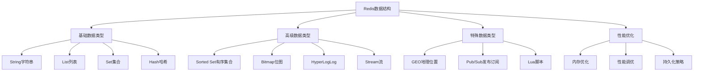

# Redis数据结构

## 📖 核心概念

**Redis数据结构**是Redis内存数据库的核心组件，提供了丰富的数据类型和操作。Redis支持字符串、列表、集合、有序集合、哈希表等多种数据结构，每种都有其特定的应用场景和性能特征。

### 🏗️ Redis数据结构分类



## 🔧 Redis数据结构实现

### 基础数据类型

```cpp
class RedisDataTypes {
private:
    // String类型
    map<string, string> stringStore;
    
    // List类型
    map<string, list<string>> listStore;
    
    // Set类型
    map<string, set<string>> setStore;
    
    // Hash类型
    map<string, map<string, string>> hashStore;
    
public:
    RedisDataTypes() {}
    
    // String操作
    void setString(const string& key, const string& value) {
        stringStore[key] = value;
        cout << "SET " << key << " = " << value << endl;
    }
    
    string getString(const string& key) {
        auto it = stringStore.find(key);
        if (it != stringStore.end()) {
            cout << "GET " << key << " = " << it->second << endl;
            return it->second;
        }
        cout << "GET " << key << " = (nil)" << endl;
        return "";
    }
    
    void incrString(const string& key) {
        auto it = stringStore.find(key);
        if (it != stringStore.end()) {
            int value = stoi(it->second);
            it->second = to_string(value + 1);
            cout << "INCR " << key << " = " << it->second << endl;
        } else {
            stringStore[key] = "1";
            cout << "INCR " << key << " = 1" << endl;
        }
    }
    
    void appendString(const string& key, const string& value) {
        auto it = stringStore.find(key);
        if (it != stringStore.end()) {
            it->second += value;
        } else {
            stringStore[key] = value;
        }
        cout << "APPEND " << key << " " << value << endl;
    }
    
    // List操作
    void lpushList(const string& key, const string& value) {
        listStore[key].push_front(value);
        cout << "LPUSH " << key << " " << value << endl;
    }
    
    void rpushList(const string& key, const string& value) {
        listStore[key].push_back(value);
        cout << "RPUSH " << key << " " << value << endl;
    }
    
    string lpopList(const string& key) {
        auto it = listStore.find(key);
        if (it != listStore.end() && !it->second.empty()) {
            string value = it->second.front();
            it->second.pop_front();
            cout << "LPOP " << key << " = " << value << endl;
            return value;
        }
        cout << "LPOP " << key << " = (nil)" << endl;
        return "";
    }
    
    string rpopList(const string& key) {
        auto it = listStore.find(key);
        if (it != listStore.end() && !it->second.empty()) {
            string value = it->second.back();
            it->second.pop_back();
            cout << "RPOP " << key << " = " << value << endl;
            return value;
        }
        cout << "RPOP " << key << " = (nil)" << endl;
        return "";
    }
    
    int llenList(const string& key) {
        auto it = listStore.find(key);
        int length = (it != listStore.end()) ? it->second.size() : 0;
        cout << "LLEN " << key << " = " << length << endl;
        return length;
    }
    
    // Set操作
    void saddSet(const string& key, const string& member) {
        setStore[key].insert(member);
        cout << "SADD " << key << " " << member << endl;
    }
    
    void sremSet(const string& key, const string& member) {
        auto it = setStore.find(key);
        if (it != setStore.end()) {
            it->second.erase(member);
        }
        cout << "SREM " << key << " " << member << endl;
    }
    
    bool sismemberSet(const string& key, const string& member) {
        auto it = setStore.find(key);
        bool isMember = (it != setStore.end()) && (it->second.find(member) != it->second.end());
        cout << "SISMEMBER " << key << " " << member << " = " << (isMember ? "1" : "0") << endl;
        return isMember;
    }
    
    int scardSet(const string& key) {
        auto it = setStore.find(key);
        int cardinality = (it != setStore.end()) ? it->second.size() : 0;
        cout << "SCARD " << key << " = " << cardinality << endl;
        return cardinality;
    }
    
    vector<string> smembersSet(const string& key) {
        vector<string> members;
        auto it = setStore.find(key);
        if (it != setStore.end()) {
            for (const string& member : it->second) {
                members.push_back(member);
            }
        }
        cout << "SMEMBERS " << key << " = " << members.size() << " members" << endl;
        return members;
    }
    
    // Hash操作
    void hsetHash(const string& key, const string& field, const string& value) {
        hashStore[key][field] = value;
        cout << "HSET " << key << " " << field << " " << value << endl;
    }
    
    string hgetHash(const string& key, const string& field) {
        auto it = hashStore.find(key);
        if (it != hashStore.end()) {
            auto fieldIt = it->second.find(field);
            if (fieldIt != it->second.end()) {
                cout << "HGET " << key << " " << field << " = " << fieldIt->second << endl;
                return fieldIt->second;
            }
        }
        cout << "HGET " << key << " " << field << " = (nil)" << endl;
        return "";
    }
    
    void hdelHash(const string& key, const string& field) {
        auto it = hashStore.find(key);
        if (it != hashStore.end()) {
            it->second.erase(field);
        }
        cout << "HDEL " << key << " " << field << endl;
    }
    
    int hlenHash(const string& key) {
        auto it = hashStore.find(key);
        int length = (it != hashStore.end()) ? it->second.size() : 0;
        cout << "HLEN " << key << " = " << length << endl;
        return length;
    }
    
    map<string, string> hgetallHash(const string& key) {
        map<string, string> result;
        auto it = hashStore.find(key);
        if (it != hashStore.end()) {
            result = it->second;
        }
        cout << "HGETALL " << key << " = " << result.size() << " fields" << endl;
        return result;
    }
    
    // 显示所有数据
    void displayAllData() {
        cout << "Redis Data Store:" << endl;
        cout << "================" << endl;
        
        cout << "Strings:" << endl;
        for (const auto& pair : stringStore) {
            cout << "  " << pair.first << " = " << pair.second << endl;
        }
        
        cout << "Lists:" << endl;
        for (const auto& pair : listStore) {
            cout << "  " << pair.first << ": ";
            for (const string& value : pair.second) {
                cout << value << " ";
            }
            cout << endl;
        }
        
        cout << "Sets:" << endl;
        for (const auto& pair : setStore) {
            cout << "  " << pair.first << ": ";
            for (const string& member : pair.second) {
                cout << member << " ";
            }
            cout << endl;
        }
        
        cout << "Hashes:" << endl;
        for (const auto& pair : hashStore) {
            cout << "  " << pair.first << ":" << endl;
            for (const auto& fieldPair : pair.second) {
                cout << "    " << fieldPair.first << " = " << fieldPair.second << endl;
            }
        }
    }
};
```

### 高级数据类型

```cpp
class RedisAdvancedTypes {
private:
    // Sorted Set类型
    struct SortedSetMember {
        string member;
        double score;
        
        SortedSetMember(const string& m, double s) : member(m), score(s) {}
        
        bool operator<(const SortedSetMember& other) const {
            if (score != other.score) {
                return score < other.score;
            }
            return member < other.member;
        }
    };
    
    map<string, set<SortedSetMember>> sortedSetStore;
    
    // Bitmap类型
    map<string, vector<bool>> bitmapStore;
    
    // HyperLogLog类型
    map<string, set<string>> hyperLogLogStore;
    
public:
    RedisAdvancedTypes() {}
    
    // Sorted Set操作
    void zaddSortedSet(const string& key, double score, const string& member) {
        SortedSetMember sm(member, score);
        sortedSetStore[key].insert(sm);
        cout << "ZADD " << key << " " << score << " " << member << endl;
    }
    
    void zremSortedSet(const string& key, const string& member) {
        auto it = sortedSetStore.find(key);
        if (it != sortedSetStore.end()) {
            // 找到并删除成员
            for (auto memberIt = it->second.begin(); memberIt != it->second.end(); ++memberIt) {
                if (memberIt->member == member) {
                    it->second.erase(memberIt);
                    break;
                }
            }
        }
        cout << "ZREM " << key << " " << member << endl;
    }
    
    double zscoreSortedSet(const string& key, const string& member) {
        auto it = sortedSetStore.find(key);
        if (it != sortedSetStore.end()) {
            for (const SortedSetMember& sm : it->second) {
                if (sm.member == member) {
                    cout << "ZSCORE " << key << " " << member << " = " << sm.score << endl;
                    return sm.score;
                }
            }
        }
        cout << "ZSCORE " << key << " " << member << " = (nil)" << endl;
        return 0.0;
    }
    
    int zrankSortedSet(const string& key, const string& member) {
        auto it = sortedSetStore.find(key);
        if (it != sortedSetStore.end()) {
            int rank = 0;
            for (const SortedSetMember& sm : it->second) {
                if (sm.member == member) {
                    cout << "ZRANK " << key << " " << member << " = " << rank << endl;
                    return rank;
                }
                rank++;
            }
        }
        cout << "ZRANK " << key << " " << member << " = (nil)" << endl;
        return -1;
    }
    
    vector<string> zrangeSortedSet(const string& key, int start, int stop) {
        vector<string> result;
        auto it = sortedSetStore.find(key);
        if (it != sortedSetStore.end()) {
            int index = 0;
            for (const SortedSetMember& sm : it->second) {
                if (index >= start && index <= stop) {
                    result.push_back(sm.member);
                }
                if (index > stop) break;
                index++;
            }
        }
        cout << "ZRANGE " << key << " " << start << " " << stop << " = " << result.size() << " members" << endl;
        return result;
    }
    
    int zcardSortedSet(const string& key) {
        auto it = sortedSetStore.find(key);
        int cardinality = (it != sortedSetStore.end()) ? it->second.size() : 0;
        cout << "ZCARD " << key << " = " << cardinality << endl;
        return cardinality;
    }
    
    // Bitmap操作
    void setbitBitmap(const string& key, int offset, bool value) {
        if (bitmapStore[key].size() <= offset) {
            bitmapStore[key].resize(offset + 1, false);
        }
        bitmapStore[key][offset] = value;
        cout << "SETBIT " << key << " " << offset << " " << (value ? "1" : "0") << endl;
    }
    
    bool getbitBitmap(const string& key, int offset) {
        auto it = bitmapStore.find(key);
        if (it != bitmapStore.end() && offset < it->second.size()) {
            bool value = it->second[offset];
            cout << "GETBIT " << key << " " << offset << " = " << (value ? "1" : "0") << endl;
            return value;
        }
        cout << "GETBIT " << key << " " << offset << " = 0" << endl;
        return false;
    }
    
    int bitcountBitmap(const string& key) {
        auto it = bitmapStore.find(key);
        int count = 0;
        if (it != bitmapStore.end()) {
            for (bool bit : it->second) {
                if (bit) count++;
            }
        }
        cout << "BITCOUNT " << key << " = " << count << endl;
        return count;
    }
    
    // HyperLogLog操作
    void pfaddHyperLogLog(const string& key, const string& element) {
        hyperLogLogStore[key].insert(element);
        cout << "PFADD " << key << " " << element << endl;
    }
    
    int pfcountHyperLogLog(const string& key) {
        auto it = hyperLogLogStore.find(key);
        int count = (it != hyperLogLogStore.end()) ? it->second.size() : 0;
        cout << "PFCOUNT " << key << " = " << count << endl;
        return count;
    }
    
    void pfmergeHyperLogLog(const string& destKey, const vector<string>& sourceKeys) {
        set<string> merged;
        
        // 合并所有源HyperLogLog
        for (const string& sourceKey : sourceKeys) {
            auto it = hyperLogLogStore.find(sourceKey);
            if (it != hyperLogLogStore.end()) {
                for (const string& element : it->second) {
                    merged.insert(element);
                }
            }
        }
        
        hyperLogLogStore[destKey] = merged;
        cout << "PFMERGE " << destKey << " " << sourceKeys.size() << " source keys" << endl;
    }
    
    // 显示高级数据类型
    void displayAdvancedData() {
        cout << "Redis Advanced Data Types:" << endl;
        cout << "========================" << endl;
        
        cout << "Sorted Sets:" << endl;
        for (const auto& pair : sortedSetStore) {
            cout << "  " << pair.first << ":" << endl;
            for (const SortedSetMember& sm : pair.second) {
                cout << "    " << sm.score << " " << sm.member << endl;
            }
        }
        
        cout << "Bitmaps:" << endl;
        for (const auto& pair : bitmapStore) {
            cout << "  " << pair.first << ": ";
            for (bool bit : pair.second) {
                cout << (bit ? "1" : "0");
            }
            cout << endl;
        }
        
        cout << "HyperLogLogs:" << endl;
        for (const auto& pair : hyperLogLogStore) {
            cout << "  " << pair.first << ": " << pair.second.size() << " unique elements" << endl;
        }
    }
};
```

### 性能优化

```cpp
class RedisPerformanceOptimizer {
private:
    struct MemoryUsage {
        long long stringMemory;
        long long listMemory;
        long long setMemory;
        long long hashMemory;
        long long sortedSetMemory;
        long long totalMemory;
        
        MemoryUsage() : stringMemory(0), listMemory(0), setMemory(0), 
                       hashMemory(0), sortedSetMemory(0), totalMemory(0) {}
    };
    
    MemoryUsage memoryUsage;
    map<string, int> keyAccessCount;
    map<string, chrono::time_point<chrono::high_resolution_clock>> keyLastAccess;
    
public:
    RedisPerformanceOptimizer() {}
    
    // 内存使用分析
    void analyzeMemoryUsage() {
        cout << "Memory Usage Analysis:" << endl;
        cout << "=====================" << endl;
        
        // 计算各类型内存使用
        calculateStringMemory();
        calculateListMemory();
        calculateSetMemory();
        calculateHashMemory();
        calculateSortedSetMemory();
        
        memoryUsage.totalMemory = memoryUsage.stringMemory + memoryUsage.listMemory + 
                                 memoryUsage.setMemory + memoryUsage.hashMemory + 
                                 memoryUsage.sortedSetMemory;
        
        cout << "String memory: " << memoryUsage.stringMemory << " bytes" << endl;
        cout << "List memory: " << memoryUsage.listMemory << " bytes" << endl;
        cout << "Set memory: " << memoryUsage.setMemory << " bytes" << endl;
        cout << "Hash memory: " << memoryUsage.hashMemory << " bytes" << endl;
        cout << "Sorted Set memory: " << memoryUsage.sortedSetMemory << " bytes" << endl;
        cout << "Total memory: " << memoryUsage.totalMemory << " bytes" << endl;
    }
    
    void calculateStringMemory() {
        // 简化的字符串内存计算
        memoryUsage.stringMemory = 0;
        // 实际实现中需要计算每个字符串的内存占用
    }
    
    void calculateListMemory() {
        // 简化的列表内存计算
        memoryUsage.listMemory = 0;
        // 实际实现中需要计算每个列表的内存占用
    }
    
    void calculateSetMemory() {
        // 简化的集合内存计算
        memoryUsage.setMemory = 0;
        // 实际实现中需要计算每个集合的内存占用
    }
    
    void calculateHashMemory() {
        // 简化的哈希内存计算
        memoryUsage.hashMemory = 0;
        // 实际实现中需要计算每个哈希的内存占用
    }
    
    void calculateSortedSetMemory() {
        // 简化的有序集合内存计算
        memoryUsage.sortedSetMemory = 0;
        // 实际实现中需要计算每个有序集合的内存占用
    }
    
    // 访问频率分析
    void recordKeyAccess(const string& key) {
        keyAccessCount[key]++;
        keyLastAccess[key] = chrono::high_resolution_clock::now();
    }
    
    void analyzeAccessPatterns() {
        cout << "Access Pattern Analysis:" << endl;
        cout << "=======================" << endl;
        
        if (keyAccessCount.empty()) {
            cout << "No access data available" << endl;
            return;
        }
        
        // 计算访问统计
        int totalAccesses = 0;
        int maxAccesses = 0;
        string mostAccessedKey = "";
        
        for (const auto& pair : keyAccessCount) {
            totalAccesses += pair.second;
            if (pair.second > maxAccesses) {
                maxAccesses = pair.second;
                mostAccessedKey = pair.first;
            }
        }
        
        double averageAccesses = (double)totalAccesses / keyAccessCount.size();
        
        cout << "Total keys: " << keyAccessCount.size() << endl;
        cout << "Total accesses: " << totalAccesses << endl;
        cout << "Average accesses per key: " << averageAccesses << endl;
        cout << "Most accessed key: " << mostAccessedKey << " (" << maxAccesses << " times)" << endl;
        
        // 识别热点键
        vector<string> hotKeys;
        for (const auto& pair : keyAccessCount) {
            if (pair.second > averageAccesses * 2) {
                hotKeys.push_back(pair.first);
            }
        }
        
        cout << "Hot keys (>2x average): " << hotKeys.size() << endl;
        for (const string& key : hotKeys) {
            cout << "  " << key << ": " << keyAccessCount[key] << " accesses" << endl;
        }
    }
    
    // 内存优化建议
    void provideMemoryOptimizationSuggestions() {
        cout << "Memory Optimization Suggestions:" << endl;
        cout << "===============================" << endl;
        
        // 基于内存使用情况提供建议
        if (memoryUsage.stringMemory > memoryUsage.totalMemory * 0.5) {
            cout << "1. String memory usage is high. Consider using Hash for related fields." << endl;
        }
        
        if (memoryUsage.listMemory > memoryUsage.totalMemory * 0.3) {
            cout << "2. List memory usage is high. Consider using smaller chunks or compression." << endl;
        }
        
        if (memoryUsage.setMemory > memoryUsage.totalMemory * 0.2) {
            cout << "3. Set memory usage is high. Consider using Bitmap for boolean flags." << endl;
        }
        
        cout << "4. Enable memory optimization features:" << endl;
        cout << "   - Use memory-efficient encodings" << endl;
        cout << "   - Enable compression for large values" << endl;
        cout << "   - Set appropriate expiration times" << endl;
        cout << "   - Use appropriate data types for your use case" << endl;
    }
    
    // 性能调优建议
    void providePerformanceTuningSuggestions() {
        cout << "Performance Tuning Suggestions:" << endl;
        cout << "==============================" << endl;
        
        cout << "1. Connection optimization:" << endl;
        cout << "   - Use connection pooling" << endl;
        cout << "   - Enable pipelining for batch operations" << endl;
        cout << "   - Use appropriate timeout settings" << endl;
        
        cout << "2. Memory optimization:" << endl;
        cout << "   - Set maxmemory policy" << endl;
        cout << "   - Use memory-efficient data types" << endl;
        cout << "   - Enable memory compression" << endl;
        
        cout << "3. Persistence optimization:" << endl;
        cout << "   - Choose appropriate persistence strategy" << endl;
        cout << "   - Optimize RDB and AOF settings" << endl;
        cout << "   - Schedule backups during low traffic" << endl;
        
        cout << "4. Network optimization:" << endl;
        cout << "   - Use appropriate buffer sizes" << endl;
        cout << "   - Enable TCP_NODELAY" << endl;
        cout << "   - Optimize network topology" << endl;
    }
    
    // 显示性能统计
    void displayPerformanceStats() {
        cout << "Performance Statistics:" << endl;
        cout << "=====================" << endl;
        
        cout << "Memory usage: " << memoryUsage.totalMemory << " bytes" << endl;
        cout << "Total keys: " << keyAccessCount.size() << endl;
        
        if (!keyAccessCount.empty()) {
            int totalAccesses = 0;
            for (const auto& pair : keyAccessCount) {
                totalAccesses += pair.second;
            }
            cout << "Total accesses: " << totalAccesses << endl;
            cout << "Average accesses per key: " << (double)totalAccesses / keyAccessCount.size() << endl;
        }
    }
};
```

## 🎯 Redis数据结构应用

### 实际应用场景

```cpp
class RedisDataStructureApplications {
public:
    static void demonstrateApplications() {
        cout << "Redis Data Structure Applications:" << endl;
        cout << "=================================" << endl;
        
        cout << "1. 缓存系统:" << endl;
        cout << "   - 页面缓存" << endl;
        cout << "   - 会话存储" << endl;
        cout << "   - 数据库查询缓存" << endl;
        
        cout << "2. 计数器系统:" << endl;
        cout << "   - 访问计数" << endl;
        cout << "   - 点赞计数" << endl;
        cout << "   - 实时统计" << endl;
        
        cout << "3. 消息队列:" << endl;
        cout << "   - 任务队列" << endl;
        cout << "   - 事件处理" << endl;
        cout << "   - 异步处理" << endl;
        
        cout << "4. 社交网络:" << endl;
        cout << "   - 用户关系" << endl;
        cout << "   - 动态时间线" << endl;
        cout << "   - 推荐系统" << endl;
    }
    
    static void analyzePerformance() {
        cout << "Redis Data Structure Performance Analysis:" << endl;
        cout << "=======================================" << endl;
        
        cout << "1. 时间复杂度:" << endl;
        cout << "   - String操作: O(1)" << endl;
        cout << "   - List操作: O(1) 到 O(n)" << endl;
        cout << "   - Set操作: O(1) 到 O(n)" << endl;
        cout << "   - Hash操作: O(1)" << endl;
        cout << "   - Sorted Set操作: O(log n)" << endl;
        cout << endl;
        
        cout << "2. 空间复杂度:" << endl;
        cout << "   - String: O(n)" << endl;
        cout << "   - List: O(n)" << endl;
        cout << "   - Set: O(n)" << endl;
        cout << "   - Hash: O(n)" << endl;
        cout << "   - Sorted Set: O(n)" << endl;
        cout << endl;
        
        cout << "3. 内存效率:" << endl;
        cout << "   - String: 高效" << endl;
        cout << "   - List: 中等" << endl;
        cout << "   - Set: 中等" << endl;
        cout << "   - Hash: 高效" << endl;
        cout << "   - Sorted Set: 较低" << endl;
    }
    
    static void selectDataType(bool needsOrdering, bool needsUniqueness, bool needsFastLookup, bool needsRangeQueries) {
        cout << "Data Type Selection:" << endl;
        cout << "==================" << endl;
        
        cout << "Needs ordering: " << (needsOrdering ? "Yes" : "No") << endl;
        cout << "Needs uniqueness: " << (needsUniqueness ? "Yes" : "No") << endl;
        cout << "Needs fast lookup: " << (needsFastLookup ? "Yes" : "No") << endl;
        cout << "Needs range queries: " << (needsRangeQueries ? "Yes" : "No") << endl;
        
        cout << "Recommendation:" << endl;
        
        if (needsOrdering && needsRangeQueries) {
            cout << "Use Sorted Set (ordered with range queries)" << endl;
        } else if (needsOrdering) {
            cout << "Use List (ordered but no range queries)" << endl;
        } else if (needsUniqueness) {
            cout << "Use Set (unique elements)" << endl;
        } else if (needsFastLookup) {
            cout << "Use Hash (fast field lookup)" << endl;
        } else {
            cout << "Use String (simple key-value)" << endl;
        }
    }
};
```

## 📊 Redis数据结构分析

### 性能分析

```cpp
class RedisDataStructureAnalysis {
public:
    static void analyzePerformance() {
        cout << "Redis Data Structure Performance Analysis:" << endl;
        cout << "=======================================" << endl;
        
        cout << "1. 操作性能:" << endl;
        cout << "   - String: 最快，O(1)操作" << endl;
        cout << "   - Hash: 很快，O(1)字段操作" << endl;
        cout << "   - List: 快，O(1)头尾操作" << endl;
        cout << "   - Set: 中等，O(1)成员操作" << endl;
        cout << "   - Sorted Set: 较慢，O(log n)操作" << endl;
        
        cout << "2. 内存使用:" << endl;
        cout << "   - String: 最低" << endl;
        cout << "   - Hash: 低" << endl;
        cout << "   - List: 中等" << endl;
        cout << "   - Set: 中等" << endl;
        cout << "   - Sorted Set: 高" << endl;
        
        cout << "3. 适用场景:" << endl;
        cout << "   - String: 缓存、计数器" << endl;
        cout << "   - Hash: 对象存储、字段缓存" << endl;
        cout << "   - List: 队列、栈、时间线" << endl;
        cout << "   - Set: 标签、好友关系" << endl;
        cout << "   - Sorted Set: 排行榜、范围查询" << endl;
    }
    
    static void analyzeSpaceComplexity() {
        cout << "Redis Data Structure Space Complexity Analysis:" << endl;
        cout << "===========================================" << endl;
        
        cout << "1. 存储开销:" << endl;
        cout << "   - String: O(n) 其中n是字符串长度" << endl;
        cout << "   - List: O(n) 其中n是元素数量" << endl;
        cout << "   - Set: O(n) 其中n是成员数量" << endl;
        cout << "   - Hash: O(n) 其中n是字段数量" << endl;
        cout << "   - Sorted Set: O(n) 其中n是成员数量" << endl;
        
        cout << "2. 内存效率:" << endl;
        cout << "   - String: 最高效" << endl;
        cout << "   - Hash: 高效" << endl;
        cout << "   - List: 中等" << endl;
        cout << "   - Set: 中等" << endl;
        cout << "   - Sorted Set: 较低" << endl;
        
        cout << "3. 优化建议:" << endl;
        cout << "   - 使用合适的数据类型" << endl;
        cout << "   - 避免存储大对象" << endl;
        cout << "   - 使用压缩和编码优化" << endl;
        cout << "   - 设置合理的过期时间" << endl;
    }
    
    static void analyzeTimeComplexity() {
        cout << "Redis Data Structure Time Complexity Analysis:" << endl;
        cout << "===========================================" << endl;
        
        cout << "1. 基本操作:" << endl;
        cout << "   - String GET/SET: O(1)" << endl;
        cout << "   - List LPUSH/RPOP: O(1)" << endl;
        cout << "   - Set SADD/SREM: O(1)" << endl;
        cout << "   - Hash HSET/HGET: O(1)" << endl;
        cout << "   - Sorted Set ZADD/ZREM: O(log n)" << endl;
        
        cout << "2. 批量操作:" << endl;
        cout << "   - String MGET/MSET: O(n)" << endl;
        cout << "   - List LRANGE: O(n)" << endl;
        cout << "   - Set SMEMBERS: O(n)" << endl;
        cout << "   - Hash HGETALL: O(n)" << endl;
        cout << "   - Sorted Set ZRANGE: O(log n + m)" << endl;
        
        cout << "3. 范围操作:" << endl;
        cout << "   - List LRANGE: O(n)" << endl;
        cout << "   - Sorted Set ZRANGE: O(log n + m)" << endl;
        cout << "   - Sorted Set ZRANGEBYSCORE: O(log n + m)" << endl;
    }
};
```

## 🎮 Redis数据结构测试

### 1. 基础功能测试

```cpp
class RedisDataStructureTest {
public:
    static void testBasicDataTypes() {
        cout << "Testing Basic Data Types:" << endl;
        cout << "========================" << endl;
        
        RedisDataTypes rdt;
        
        // 测试String
        rdt.setString("name", "Redis");
        rdt.getString("name");
        rdt.incrString("counter");
        rdt.appendString("name", " Database");
        
        // 测试List
        rdt.lpushList("queue", "task1");
        rdt.rpushList("queue", "task2");
        rdt.lpopList("queue");
        rdt.llenList("queue");
        
        // 测试Set
        rdt.saddSet("tags", "redis");
        rdt.saddSet("tags", "database");
        rdt.sismemberSet("tags", "redis");
        rdt.scardSet("tags");
        
        // 测试Hash
        rdt.hsetHash("user:1", "name", "John");
        rdt.hsetHash("user:1", "age", "25");
        rdt.hgetHash("user:1", "name");
        rdt.hlenHash("user:1");
        
        rdt.displayAllData();
    }
    
    static void testAdvancedDataTypes() {
        cout << "Testing Advanced Data Types:" << endl;
        cout << "==========================" << endl;
        
        RedisAdvancedTypes rat;
        
        // 测试Sorted Set
        rat.zaddSortedSet("leaderboard", 100, "player1");
        rat.zaddSortedSet("leaderboard", 200, "player2");
        rat.zaddSortedSet("leaderboard", 150, "player3");
        rat.zscoreSortedSet("leaderboard", "player2");
        rat.zrankSortedSet("leaderboard", "player2");
        rat.zrangeSortedSet("leaderboard", 0, 2);
        
        // 测试Bitmap
        rat.setbitBitmap("flags", 0, true);
        rat.setbitBitmap("flags", 1, false);
        rat.setbitBitmap("flags", 2, true);
        rat.getbitBitmap("flags", 0);
        rat.bitcountBitmap("flags");
        
        // 测试HyperLogLog
        rat.pfaddHyperLogLog("visitors", "user1");
        rat.pfaddHyperLogLog("visitors", "user2");
        rat.pfaddHyperLogLog("visitors", "user1");
        rat.pfcountHyperLogLog("visitors");
        
        rat.displayAdvancedData();
    }
    
    static void testPerformanceOptimizer() {
        cout << "Testing Performance Optimizer:" << endl;
        cout << "=============================" << endl;
        
        RedisPerformanceOptimizer rpo;
        
        // 分析内存使用
        rpo.analyzeMemoryUsage();
        
        // 记录键访问
        rpo.recordKeyAccess("key1");
        rpo.recordKeyAccess("key1");
        rpo.recordKeyAccess("key2");
        rpo.recordKeyAccess("key1");
        
        // 分析访问模式
        rpo.analyzeAccessPatterns();
        
        // 提供优化建议
        rpo.provideMemoryOptimizationSuggestions();
        rpo.providePerformanceTuningSuggestions();
        
        rpo.displayPerformanceStats();
    }
    
    static void testApplications() {
        cout << "Testing Applications:" << endl;
        cout << "==================" << endl;
        
        RedisDataStructureApplications::demonstrateApplications();
        RedisDataStructureApplications::analyzePerformance();
        RedisDataStructureApplications::selectDataType(false, true, true, false);
    }
    
    static void testAnalysis() {
        cout << "Testing Analysis:" << endl;
        cout << "===============" << endl;
        
        RedisDataStructureAnalysis::analyzePerformance();
        RedisDataStructureAnalysis::analyzeSpaceComplexity();
        RedisDataStructureAnalysis::analyzeTimeComplexity();
    }
};
```

## 🔗 相关链接

- [[01-缓存系统|缓存系统]]
- [[02-缓存淘汰策略|缓存淘汰策略]]
- [[03-分布式缓存|分布式缓存]]

## 💡 Redis数据结构要点

1. **基础类型**: String、List、Set、Hash各有特色
2. **高级类型**: Sorted Set、Bitmap、HyperLogLog功能强大
3. **性能优化**: 选择合适的数据类型和优化策略
4. **应用场景**: 根据需求选择最适合的数据结构

---

*📝 Redis数据结构提示：Redis提供了丰富的数据结构，需要根据具体应用场景选择合适的数据类型以获得最佳性能*
