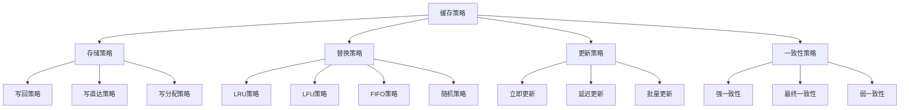

# 缓存策略

## 📖 核心概念

**缓存策略（Cache Strategy）**是计算机系统中用于管理缓存数据存储和替换的算法集合。它通过预测数据访问模式、优化存储空间利用率和减少缓存未命中率，将数据访问性能从O(n)提升到O(1)，是现代系统性能优化的核心技术。

### 🏗️ 缓存策略的组成要素



## 🔍 缓存策略分类

### 按替换算法分类

| 策略类型 | 特点 | 优点 | 缺点 | 适用场景 |
|----------|------|------|------|----------|
| **LRU** | 最近最少使用 | 时间局部性好 | 实现复杂 | 一般应用 |
| **LFU** | 最少频率使用 | 频率局部性好 | 历史依赖 | 稳定访问模式 |
| **FIFO** | 先进先出 | 实现简单 | 性能一般 | 简单应用 |
| **随机** | 随机替换 | 实现简单 | 性能不稳定 | 测试环境 |

### 按更新策略分类

| 更新策略 | 特点 | 优点 | 缺点 | 适用场景 |
|----------|------|------|------|----------|
| **写回** | 延迟写入 | 写入性能好 | 数据丢失风险 | 写密集型 |
| **写直达** | 立即写入 | 数据安全 | 写入性能差 | 数据安全要求高 |
| **写分配** | 分配缓存行 | 命中率高 | 空间开销 | 读密集型 |
| **写非分配** | 不分配缓存行 | 空间效率高 | 命中率低 | 空间受限 |

## 💻 LRU缓存实现

### LRU缓存类

```cpp
template<typename K, typename V>
class LRUCache {
private:
    struct Node {
        K key;
        V value;
        Node* prev;
        Node* next;
        
        Node(K k, V v) : key(k), value(v), prev(nullptr), next(nullptr) {}
    };
    
    unordered_map<K, Node*> cache;
    Node* head;
    Node* tail;
    int capacity;
    int size;
    
    // 添加节点到头部
    void addToHead(Node* node) {
        node->prev = head;
        node->next = head->next;
        head->next->prev = node;
        head->next = node;
    }
    
    // 移除节点
    void removeNode(Node* node) {
        node->prev->next = node->next;
        node->next->prev = node->prev;
    }
    
    // 移动节点到头部
    void moveToHead(Node* node) {
        removeNode(node);
        addToHead(node);
    }
    
    // 移除尾部节点
    Node* removeTail() {
        Node* lastNode = tail->prev;
        removeNode(lastNode);
        return lastNode;
    }
    
public:
    LRUCache(int cap) : capacity(cap), size(0) {
        head = new Node(K{}, V{});
        tail = new Node(K{}, V{});
        head->next = tail;
        tail->prev = head;
    }
    
    ~LRUCache() {
        Node* current = head;
        while (current != nullptr) {
            Node* next = current->next;
            delete current;
            current = next;
        }
    }
    
    // 获取值
    V get(K key) {
        if (cache.find(key) != cache.end()) {
            Node* node = cache[key];
            moveToHead(node);
            return node->value;
        }
        return V{}; // 返回默认值
    }
    
    // 设置值
    void put(K key, V value) {
        if (cache.find(key) != cache.end()) {
            Node* node = cache[key];
            node->value = value;
            moveToHead(node);
        } else {
            Node* newNode = new Node(key, value);
            
            if (size >= capacity) {
                Node* tail = removeTail();
                cache.erase(tail->key);
                delete tail;
                size--;
            }
            
            cache[key] = newNode;
            addToHead(newNode);
            size++;
        }
    }
    
    // 检查键是否存在
    bool contains(K key) const {
        return cache.find(key) != cache.end();
    }
    
    // 获取大小
    int getSize() const {
        return size;
    }
    
    // 获取容量
    int getCapacity() const {
        return capacity;
    }
    
    // 清空缓存
    void clear() {
        Node* current = head->next;
        while (current != tail) {
            Node* next = current->next;
            delete current;
            current = next;
        }
        head->next = tail;
        tail->prev = head;
        cache.clear();
        size = 0;
    }
    
    // 获取所有键
    vector<K> getAllKeys() const {
        vector<K> keys;
        Node* current = head->next;
        while (current != tail) {
            keys.push_back(current->key);
            current = current->next;
        }
        return keys;
    }
    
    // 获取缓存统计信息
    struct CacheStats {
        int hits;
        int misses;
        double hitRate;
        
        CacheStats() : hits(0), misses(0), hitRate(0) {}
    };
    
    mutable CacheStats stats;
    
    // 获取统计信息
    CacheStats getStats() const {
        if (stats.hits + stats.misses > 0) {
            stats.hitRate = static_cast<double>(stats.hits) / (stats.hits + stats.misses);
        }
        return stats;
    }
    
    // 重置统计信息
    void resetStats() {
        stats.hits = 0;
        stats.misses = 0;
        stats.hitRate = 0;
    }
};
```

## 💻 LFU缓存实现

### LFU缓存类

```cpp
template<typename K, typename V>
class LFUCache {
private:
    struct Node {
        K key;
        V value;
        int frequency;
        Node* prev;
        Node* next;
        
        Node(K k, V v) : key(k), value(v), frequency(1), prev(nullptr), next(nullptr) {}
    };
    
    struct FrequencyList {
        int freq;
        Node* head;
        Node* tail;
        
        FrequencyList(int f) : freq(f) {
            head = new Node(K{}, V{});
            tail = new Node(K{}, V{});
            head->next = tail;
            tail->prev = head;
        }
        
        ~FrequencyList() {
            Node* current = head;
            while (current != nullptr) {
                Node* next = current->next;
                delete current;
                current = next;
            }
        }
        
        void addNode(Node* node) {
            node->next = head->next;
            node->prev = head;
            head->next->prev = node;
            head->next = node;
        }
        
        void removeNode(Node* node) {
            node->prev->next = node->next;
            node->next->prev = node->prev;
        }
        
        bool isEmpty() const {
            return head->next == tail;
        }
        
        Node* getLastNode() const {
            return tail->prev;
        }
    };
    
    unordered_map<K, Node*> cache;
    unordered_map<int, FrequencyList*> frequencyLists;
    int capacity;
    int size;
    int minFrequency;
    
    // 更新节点频率
    void updateFrequency(Node* node) {
        int oldFreq = node->frequency;
        int newFreq = oldFreq + 1;
        
        // 从旧频率列表中移除
        frequencyLists[oldFreq]->removeNode(node);
        if (frequencyLists[oldFreq]->isEmpty()) {
            delete frequencyLists[oldFreq];
            frequencyLists.erase(oldFreq);
            if (minFrequency == oldFreq) {
                minFrequency = newFreq;
            }
        }
        
        // 添加到新频率列表
        if (frequencyLists.find(newFreq) == frequencyLists.end()) {
            frequencyLists[newFreq] = new FrequencyList(newFreq);
        }
        frequencyLists[newFreq]->addNode(node);
        node->frequency = newFreq;
    }
    
    // 移除最少频率的节点
    Node* removeLeastFrequent() {
        Node* lastNode = frequencyLists[minFrequency]->getLastNode();
        frequencyLists[minFrequency]->removeNode(lastNode);
        
        if (frequencyLists[minFrequency]->isEmpty()) {
            delete frequencyLists[minFrequency];
            frequencyLists.erase(minFrequency);
            minFrequency++;
        }
        
        return lastNode;
    }
    
public:
    LFUCache(int cap) : capacity(cap), size(0), minFrequency(1) {}
    
    ~LFUCache() {
        for (auto& [freq, list] : frequencyLists) {
            delete list;
        }
    }
    
    // 获取值
    V get(K key) {
        if (cache.find(key) != cache.end()) {
            Node* node = cache[key];
            updateFrequency(node);
            return node->value;
        }
        return V{}; // 返回默认值
    }
    
    // 设置值
    void put(K key, V value) {
        if (cache.find(key) != cache.end()) {
            Node* node = cache[key];
            node->value = value;
            updateFrequency(node);
        } else {
            Node* newNode = new Node(key, value);
            
            if (size >= capacity) {
                Node* removedNode = removeLeastFrequent();
                cache.erase(removedNode->key);
                delete removedNode;
                size--;
            }
            
            cache[key] = newNode;
            
            if (frequencyLists.find(1) == frequencyLists.end()) {
                frequencyLists[1] = new FrequencyList(1);
            }
            frequencyLists[1]->addNode(newNode);
            minFrequency = 1;
            size++;
        }
    }
    
    // 检查键是否存在
    bool contains(K key) const {
        return cache.find(key) != cache.end();
    }
    
    // 获取大小
    int getSize() const {
        return size;
    }
    
    // 获取容量
    int getCapacity() const {
        return capacity;
    }
    
    // 清空缓存
    void clear() {
        for (auto& [freq, list] : frequencyLists) {
            delete list;
        }
        frequencyLists.clear();
        cache.clear();
        size = 0;
        minFrequency = 1;
    }
    
    // 获取频率分布
    unordered_map<int, int> getFrequencyDistribution() const {
        unordered_map<int, int> distribution;
        for (const auto& [key, node] : cache) {
            distribution[node->frequency]++;
        }
        return distribution;
    }
};
```

## 🎯 多级缓存实现

### 多级缓存类

```cpp
template<typename K, typename V>
class MultiLevelCache {
private:
    struct CacheLevel {
        int level;
        int capacity;
        int size;
        unordered_map<K, V> data;
        vector<K> accessOrder;
        
        CacheLevel(int l, int cap) : level(l), capacity(cap), size(0) {}
        
        bool isFull() const {
            return size >= capacity;
        }
        
        void add(K key, V value) {
            if (data.find(key) == data.end()) {
                size++;
            }
            data[key] = value;
            accessOrder.push_back(key);
        }
        
        V* get(K key) {
            auto it = data.find(key);
            if (it != data.end()) {
                // 更新访问顺序
                accessOrder.erase(remove(accessOrder.begin(), accessOrder.end(), key), accessOrder.end());
                accessOrder.push_back(key);
                return &it->second;
            }
            return nullptr;
        }
        
        bool contains(K key) const {
            return data.find(key) != data.end();
        }
        
        K getLRUKey() const {
            return accessOrder[0];
        }
        
        void remove(K key) {
            auto it = data.find(key);
            if (it != data.end()) {
                data.erase(it);
                accessOrder.erase(remove(accessOrder.begin(), accessOrder.end(), key), accessOrder.end());
                size--;
            }
        }
    };
    
    vector<CacheLevel> levels;
    int totalLevels;
    
    // 从指定级别开始查找
    V* findInLevels(K key, int startLevel) {
        for (int i = startLevel; i < totalLevels; i++) {
            V* value = levels[i].get(key);
            if (value != nullptr) {
                // 提升到更高级别
                promoteToLevel(key, *value, i);
                return value;
            }
        }
        return nullptr;
    }
    
    // 提升数据到更高级别
    void promoteToLevel(K key, V value, int fromLevel) {
        for (int i = fromLevel - 1; i >= 0; i--) {
            if (levels[i].isFull()) {
                // 移除LRU数据
                K lruKey = levels[i].getLRUKey();
                levels[i].remove(lruKey);
                
                // 降级到下一级别
                if (i + 1 < totalLevels) {
                    levels[i + 1].add(lruKey, levels[i].data[lruKey]);
                }
            }
            
            levels[i].add(key, value);
        }
    }
    
    // 降级数据到下一级别
    void demoteFromLevel(K key, int fromLevel) {
        if (fromLevel + 1 < totalLevels) {
            V value = levels[fromLevel].data[key];
            levels[fromLevel].remove(key);
            levels[fromLevel + 1].add(key, value);
        }
    }
    
public:
    MultiLevelCache(const vector<int>& capacities) : totalLevels(capacities.size()) {
        for (int i = 0; i < totalLevels; i++) {
            levels.emplace_back(i, capacities[i]);
        }
    }
    
    // 获取值
    V* get(K key) {
        return findInLevels(key, 0);
    }
    
    // 设置值
    void put(K key, V value) {
        // 检查是否已存在
        for (int i = 0; i < totalLevels; i++) {
            if (levels[i].contains(key)) {
                levels[i].add(key, value);
                promoteToLevel(key, value, i);
                return;
            }
        }
        
        // 新数据，添加到最高级别
        if (levels[0].isFull()) {
            K lruKey = levels[0].getLRUKey();
            demoteFromLevel(lruKey, 0);
        }
        
        levels[0].add(key, value);
    }
    
    // 检查键是否存在
    bool contains(K key) const {
        for (const auto& level : levels) {
            if (level.contains(key)) {
                return true;
            }
        }
        return false;
    }
    
    // 获取总大小
    int getTotalSize() const {
        int total = 0;
        for (const auto& level : levels) {
            total += level.size;
        }
        return total;
    }
    
    // 获取各级别大小
    vector<int> getLevelSizes() const {
        vector<int> sizes;
        for (const auto& level : levels) {
            sizes.push_back(level.size);
        }
        return sizes;
    }
    
    // 清空所有级别
    void clear() {
        for (auto& level : levels) {
            level.data.clear();
            level.accessOrder.clear();
            level.size = 0;
        }
    }
    
    // 获取缓存统计信息
    struct MultiLevelStats {
        vector<int> levelSizes;
        vector<double> hitRates;
        int totalHits;
        int totalMisses;
        
        MultiLevelStats() : totalHits(0), totalMisses(0) {}
    };
    
    mutable MultiLevelStats stats;
    
    // 获取统计信息
    MultiLevelStats getStats() const {
        stats.levelSizes = getLevelSizes();
        return stats;
    }
    
    // 重置统计信息
    void resetStats() {
        stats.levelSizes.clear();
        stats.hitRates.clear();
        stats.totalHits = 0;
        stats.totalMisses = 0;
    }
};
```

## 🎯 缓存一致性实现

### 缓存一致性管理器

```cpp
template<typename K, typename V>
class CacheConsistencyManager {
private:
    struct CacheEntry {
        V value;
        int version;
        bool dirty;
        chrono::steady_clock::time_point lastAccess;
        
        CacheEntry(V v, int ver) : value(v), version(ver), dirty(false) {
            lastAccess = chrono::steady_clock::now();
        }
    };
    
    unordered_map<K, CacheEntry> cache;
    int capacity;
    int currentVersion;
    
    // 检查版本一致性
    bool isVersionConsistent(const K& key, int expectedVersion) const {
        auto it = cache.find(key);
        if (it != cache.end()) {
            return it->second.version == expectedVersion;
        }
        return false;
    }
    
    // 更新访问时间
    void updateAccessTime(const K& key) {
        auto it = cache.find(key);
        if (it != cache.end()) {
            it->second.lastAccess = chrono::steady_clock::now();
        }
    }
    
    // 获取最久未访问的键
    K getLeastRecentlyUsed() const {
        K lruKey = K{};
        auto oldestTime = chrono::steady_clock::now();
        
        for (const auto& [key, entry] : cache) {
            if (entry.lastAccess < oldestTime) {
                oldestTime = entry.lastAccess;
                lruKey = key;
            }
        }
        
        return lruKey;
    }
    
public:
    CacheConsistencyManager(int cap) : capacity(cap), currentVersion(0) {}
    
    // 获取值
    V* get(const K& key, int expectedVersion = -1) {
        auto it = cache.find(key);
        if (it != cache.end()) {
            if (expectedVersion == -1 || isVersionConsistent(key, expectedVersion)) {
                updateAccessTime(key);
                return &it->second.value;
            }
        }
        return nullptr;
    }
    
    // 设置值
    void put(const K& key, const V& value, bool markDirty = false) {
        if (cache.find(key) != cache.end()) {
            cache[key].value = value;
            cache[key].version = ++currentVersion;
            cache[key].dirty = markDirty;
            updateAccessTime(key);
        } else {
            if (cache.size() >= capacity) {
                K lruKey = getLeastRecentlyUsed();
                cache.erase(lruKey);
            }
            
            cache[key] = CacheEntry(value, ++currentVersion);
            cache[key].dirty = markDirty;
        }
    }
    
    // 标记为脏数据
    void markDirty(const K& key) {
        auto it = cache.find(key);
        if (it != cache.end()) {
            it->second.dirty = true;
        }
    }
    
    // 清除脏标记
    void clearDirty(const K& key) {
        auto it = cache.find(key);
        if (it != cache.end()) {
            it->second.dirty = false;
        }
    }
    
    // 获取脏数据
    vector<K> getDirtyKeys() const {
        vector<K> dirtyKeys;
        for (const auto& [key, entry] : cache) {
            if (entry.dirty) {
                dirtyKeys.push_back(key);
            }
        }
        return dirtyKeys;
    }
    
    // 同步数据
    void sync(const K& key, const V& value, int version) {
        auto it = cache.find(key);
        if (it != cache.end()) {
            if (version > it->second.version) {
                it->second.value = value;
                it->second.version = version;
                it->second.dirty = false;
            }
        } else {
            if (cache.size() >= capacity) {
                K lruKey = getLeastRecentlyUsed();
                cache.erase(lruKey);
            }
            
            cache[key] = CacheEntry(value, version);
        }
    }
    
    // 获取版本信息
    int getVersion(const K& key) const {
        auto it = cache.find(key);
        if (it != cache.end()) {
            return it->second.version;
        }
        return -1;
    }
    
    // 检查键是否存在
    bool contains(const K& key) const {
        return cache.find(key) != cache.end();
    }
    
    // 获取大小
    int getSize() const {
        return cache.size();
    }
    
    // 清空缓存
    void clear() {
        cache.clear();
        currentVersion = 0;
    }
};
```

## ⚡ 复杂度分析

### 时间复杂度

| 操作 | LRU | LFU | 多级缓存 | 一致性管理 |
|------|-----|-----|----------|------------|
| **获取** | O(1) | O(1) | O(L) | O(1) |
| **设置** | O(1) | O(1) | O(L) | O(1) |
| **替换** | O(1) | O(1) | O(L) | O(1) |
| **同步** | O(1) | O(1) | O(L) | O(1) |

### 空间复杂度

| 缓存类型 | 空间复杂度 | 说明 |
|----------|------------|------|
| **LRU缓存** | O(n) | 双向链表+哈希表 |
| **LFU缓存** | O(n) | 频率列表+哈希表 |
| **多级缓存** | O(n) | 多级存储结构 |
| **一致性管理** | O(n) | 版本信息开销 |

### 性能特点

| 特点 | LRU | LFU | 多级缓存 | 一致性管理 |
|------|-----|-----|----------|------------|
| **命中率** | 好 | 很好 | 优秀 | 好 |
| **实现复杂度** | 中等 | 高 | 高 | 中等 |
| **内存开销** | 中等 | 高 | 高 | 中等 |
| **一致性** | 弱 | 弱 | 弱 | 强 |

## 🎓 学习要点总结

### 核心理解

1. **缓存原理**：理解缓存的基本原理和作用
2. **替换策略**：掌握不同替换策略的优缺点
3. **一致性管理**：理解缓存一致性的重要性
4. **性能优化**：掌握缓存性能优化的方法

### 实践要点

1. **策略选择**：根据应用场景选择合适的缓存策略
2. **参数调优**：调整缓存参数以优化性能
3. **监控分析**：监控缓存命中率和性能
4. **问题诊断**：诊断和解决缓存相关问题

### 应用思维

1. **系统设计**：将缓存策略应用到系统设计
2. **性能优化**：使用缓存提升系统性能
3. **架构设计**：设计多级缓存架构
4. **最佳实践**：遵循缓存设计的最佳实践

---

**相关链接：**
- [[05-高级结构/01-哈希宇宙/01-哈希表HashTable详解|哈希表HashTable详解]] - 缓存的基础数据结构
- [[06-应用实战/03-缓存系统/02-缓存算法|缓存算法]] - 具体的缓存算法实现
- [[06-应用实战/04-网络应用/01-分布式系统|分布式系统]] - 分布式缓存的应用
- [[06-应用实战/04-网络应用/02-负载均衡|负载均衡]] - 缓存与负载均衡的结合
