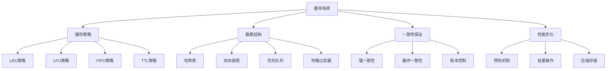

# 缓存系统设计

## 📖 核心概念

**缓存系统设计**是现代计算机系统性能优化的核心技术。通过合理的数据结构和算法设计，可以显著提高数据访问速度，减少后端存储压力。

### 🏗️ 缓存系统架构



## 🔧 LRU缓存实现

### 基础LRU缓存

```cpp
template<typename K, typename V>
class LRUCache {
private:
    struct Node {
        K key;
        V value;
        Node* prev;
        Node* next;
        
        Node(K k, V v) : key(k), value(v), prev(nullptr), next(nullptr) {}
    };
    
    unordered_map<K, Node*> cache;
    Node* head;
    Node* tail;
    int capacity;
    
    void addToHead(Node* node) {
        node->prev = head;
        node->next = head->next;
        head->next->prev = node;
        head->next = node;
    }
    
    void removeNode(Node* node) {
        node->prev->next = node->next;
        node->next->prev = node->prev;
    }
    
    void moveToHead(Node* node) {
        removeNode(node);
        addToHead(node);
    }
    
    Node* removeTail() {
        Node* lastNode = tail->prev;
        removeNode(lastNode);
        return lastNode;
    }
    
public:
    LRUCache(int cap) : capacity(cap) {
        head = new Node(K{}, V{});
        tail = new Node(K{}, V{});
        head->next = tail;
        tail->prev = head;
    }
    
    ~LRUCache() {
        Node* current = head;
        while (current) {
            Node* next = current->next;
            delete current;
            current = next;
        }
    }
    
    V get(K key) {
        if (cache.find(key) != cache.end()) {
            Node* node = cache[key];
            moveToHead(node);
            return node->value;
        }
        return V{};
    }
    
    void put(K key, V value) {
        if (cache.find(key) != cache.end()) {
            Node* node = cache[key];
            node->value = value;
            moveToHead(node);
        } else {
            Node* newNode = new Node(key, value);
            
            if (cache.size() >= capacity) {
                Node* tailNode = removeTail();
                cache.erase(tailNode->key);
                delete tailNode;
            }
            
            cache[key] = newNode;
            addToHead(newNode);
        }
    }
    
    bool contains(K key) {
        return cache.find(key) != cache.end();
    }
    
    void remove(K key) {
        if (cache.find(key) != cache.end()) {
            Node* node = cache[key];
            removeNode(node);
            cache.erase(key);
            delete node;
        }
    }
    
    int size() {
        return cache.size();
    }
    
    void clear() {
        Node* current = head->next;
        while (current != tail) {
            Node* next = current->next;
            delete current;
            current = next;
        }
        head->next = tail;
        tail->prev = head;
        cache.clear();
    }
};
```

## 🎯 LFU缓存实现

### 基础LFU缓存

```cpp
template<typename K, typename V>
class LFUCache {
private:
    struct Node {
        K key;
        V value;
        int frequency;
        Node* prev;
        Node* next;
        
        Node(K k, V v) : key(k), value(v), frequency(1), prev(nullptr), next(nullptr) {}
    };
    
    struct FrequencyList {
        int frequency;
        Node* head;
        Node* tail;
        
        FrequencyList(int freq) : frequency(freq) {
            head = new Node(K{}, V{});
            tail = new Node(K{}, V{});
            head->next = tail;
            tail->prev = head;
        }
        
        ~FrequencyList() {
            Node* current = head;
            while (current) {
                Node* next = current->next;
                delete current;
                current = next;
            }
        }
        
        void addNode(Node* node) {
            node->next = head->next;
            node->prev = head;
            head->next->prev = node;
            head->next = node;
        }
        
        void removeNode(Node* node) {
            node->prev->next = node->next;
            node->next->prev = node->prev;
        }
        
        bool isEmpty() {
            return head->next == tail;
        }
        
        Node* removeLast() {
            Node* lastNode = tail->prev;
            removeNode(lastNode);
            return lastNode;
        }
    };
    
    unordered_map<K, Node*> cache;
    unordered_map<int, FrequencyList*> frequencyMap;
    int capacity;
    int minFrequency;
    
public:
    LFUCache(int cap) : capacity(cap), minFrequency(0) {}
    
    ~LFUCache() {
        for (auto& pair : frequencyMap) {
            delete pair.second;
        }
    }
    
    V get(K key) {
        if (cache.find(key) != cache.end()) {
            Node* node = cache[key];
            updateFrequency(node);
            return node->value;
        }
        return V{};
    }
    
    void put(K key, V value) {
        if (cache.find(key) != cache.end()) {
            Node* node = cache[key];
            node->value = value;
            updateFrequency(node);
        } else {
            if (cache.size() >= capacity) {
                evictLFU();
            }
            
            Node* newNode = new Node(key, value);
            cache[key] = newNode;
            addToFrequencyList(newNode, 1);
            minFrequency = 1;
        }
    }
    
private:
    void updateFrequency(Node* node) {
        int oldFreq = node->frequency;
        int newFreq = oldFreq + 1;
        
        // 从旧频率列表移除
        frequencyMap[oldFreq]->removeNode(node);
        
        // 如果旧频率列表为空且是最小频率，更新最小频率
        if (frequencyMap[oldFreq]->isEmpty()) {
            if (oldFreq == minFrequency) {
                minFrequency = newFreq;
            }
            delete frequencyMap[oldFreq];
            frequencyMap.erase(oldFreq);
        }
        
        // 添加到新频率列表
        node->frequency = newFreq;
        addToFrequencyList(node, newFreq);
    }
    
    void addToFrequencyList(Node* node, int frequency) {
        if (frequencyMap.find(frequency) == frequencyMap.end()) {
            frequencyMap[frequency] = new FrequencyList(frequency);
        }
        frequencyMap[frequency]->addNode(node);
    }
    
    void evictLFU() {
        Node* lfuNode = frequencyMap[minFrequency]->removeLast();
        cache.erase(lfuNode->key);
        
        if (frequencyMap[minFrequency]->isEmpty()) {
            delete frequencyMap[minFrequency];
            frequencyMap.erase(minFrequency);
        }
        
        delete lfuNode;
    }
};
```

## 📊 缓存性能分析

### 性能对比

| 缓存策略 | 时间复杂度 | 空间复杂度 | 适用场景 | 优点 | 缺点 |
|----------|------------|------------|----------|------|------|
| **LRU** | O(1) | O(n) | 时间局部性 | 实现简单 | 可能误删热点数据 |
| **LFU** | O(1) | O(n) | 频率访问 | 命中率高 | 实现复杂 |
| **FIFO** | O(1) | O(n) | 简单场景 | 实现简单 | 性能较差 |
| **TTL** | O(1) | O(n) | 时效性数据 | 自动过期 | 需要定时清理 |

## 🎮 实际应用

### 1. Web缓存系统

```cpp
class WebCache {
private:
    struct CacheEntry {
        string url;
        string content;
        time_t timestamp;
        int accessCount;
        
        CacheEntry(const string& u, const string& c) 
            : url(u), content(c), timestamp(time(nullptr)), accessCount(1) {}
    };
    
    LRUCache<string, CacheEntry> lruCache;
    map<string, int> urlFrequency;
    
public:
    WebCache(int capacity = 1000) : lruCache(capacity) {}
    
    string getPage(const string& url) {
        CacheEntry entry = lruCache.get(url);
        
        if (!entry.url.empty()) {
            entry.accessCount++;
            urlFrequency[url]++;
            return entry.content;
        }
        
        // 模拟从服务器获取
        string content = fetchFromServer(url);
        
        // 添加到缓存
        CacheEntry newEntry(url, content);
        lruCache.put(url, newEntry);
        urlFrequency[url] = 1;
        
        return content;
    }
    
    void preloadPages(const vector<string>& urls) {
        for (const string& url : urls) {
            if (!lruCache.contains(url)) {
                string content = fetchFromServer(url);
                CacheEntry entry(url, content);
                lruCache.put(url, entry);
            }
        }
    }
    
    void getCacheStats() {
        cout << "Web Cache Statistics:" << endl;
        cout << "Cache size: " << lruCache.size() << endl;
        cout << "Total URLs: " << urlFrequency.size() << endl;
        
        // 找出最热门的URL
        vector<pair<string, int>> sortedUrls(urlFrequency.begin(), urlFrequency.end());
        sort(sortedUrls.begin(), sortedUrls.end(), 
             [](const pair<string, int>& a, const pair<string, int>& b) {
                 return a.second > b.second;
             });
        
        cout << "Top 5 popular URLs:" << endl;
        for (int i = 0; i < min(5, (int)sortedUrls.size()); ++i) {
            cout << sortedUrls[i].first << ": " << sortedUrls[i].second << " accesses" << endl;
        }
    }
    
private:
    string fetchFromServer(const string& url) {
        // 模拟网络请求
        return "Content for " + url;
    }
};
```

### 2. 数据库查询缓存

```cpp
class DatabaseQueryCache {
private:
    struct QueryResult {
        string sql;
        vector<map<string, string>> result;
        time_t timestamp;
        
        QueryResult(const string& s, const vector<map<string, string>>& r) 
            : sql(s), result(r), timestamp(time(nullptr)) {}
    };
    
    LRUCache<string, QueryResult> queryCache;
    int maxCacheTime;  // 最大缓存时间（秒）
    
public:
    DatabaseQueryCache(int capacity = 500, int maxTime = 3600) 
        : queryCache(capacity), maxCacheTime(maxTime) {}
    
    vector<map<string, string>> executeQuery(const string& sql) {
        // 检查缓存
        QueryResult cached = queryCache.get(sql);
        
        if (!cached.sql.empty()) {
            // 检查是否过期
            if (time(nullptr) - cached.timestamp < maxCacheTime) {
                return cached.result;
            } else {
                queryCache.remove(sql);
            }
        }
        
        // 执行查询
        vector<map<string, string>> result = executeDatabaseQuery(sql);
        
        // 添加到缓存
        QueryResult newResult(sql, result);
        queryCache.put(sql, newResult);
        
        return result;
    }
    
    void invalidateCache(const string& tableName) {
        // 清除与特定表相关的缓存
        // 简化实现：清除所有缓存
        queryCache.clear();
    }
    
    void warmupCache(const vector<string>& commonQueries) {
        for (const string& sql : commonQueries) {
            if (!queryCache.contains(sql)) {
                vector<map<string, string>> result = executeDatabaseQuery(sql);
                QueryResult entry(sql, result);
                queryCache.put(sql, entry);
            }
        }
    }
    
private:
    vector<map<string, string>> executeDatabaseQuery(const string& sql) {
        // 模拟数据库查询
        vector<map<string, string>> result;
        map<string, string> row;
        row["id"] = "1";
        row["name"] = "Sample";
        result.push_back(row);
        return result;
    }
};
```

## 🔗 相关链接

- [[02-缓存一致性|缓存一致性]]
- [[03-分布式缓存|分布式缓存]]
- [[04-缓存性能调优|性能调优]]

## 💡 缓存系统要点

1. **策略选择**：根据访问模式选择合适的缓存策略
2. **容量管理**：平衡命中率和内存使用
3. **一致性保证**：确保数据的一致性
4. **性能监控**：监控缓存命中率和性能指标

---

*📝 设计提示：缓存系统设计需要平衡性能、一致性和资源使用*
