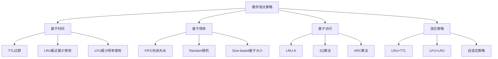

# 缓存淘汰策略

## 📖 核心概念

**缓存淘汰策略**是缓存系统中决定何时以及如何移除缓存数据的重要机制。当缓存空间不足时，需要选择合适的淘汰策略来保证缓存的高效性和命中率。

### 🏗️ 缓存淘汰策略分类



## 🔧 缓存淘汰策略实现

### LRU算法实现

```cpp
class LRUCache {
private:
    struct Node {
        int key;
        int value;
        Node* prev;
        Node* next;
        
        Node(int k, int v) : key(k), value(v), prev(nullptr), next(nullptr) {}
    };
    
    int capacity;
    map<int, Node*> cache;
    Node* head;
    Node* tail;
    
    // 添加节点到头部
    void addToHead(Node* node) {
        node->prev = head;
        node->next = head->next;
        head->next->prev = node;
        head->next = node;
    }
    
    // 移除节点
    void removeNode(Node* node) {
        node->prev->next = node->next;
        node->next->prev = node->prev;
    }
    
    // 移动节点到头部
    void moveToHead(Node* node) {
        removeNode(node);
        addToHead(node);
    }
    
    // 移除尾部节点
    Node* removeTail() {
        Node* lastNode = tail->prev;
        removeNode(lastNode);
        return lastNode;
    }
    
public:
    LRUCache(int cap) : capacity(cap) {
        head = new Node(0, 0);
        tail = new Node(0, 0);
        head->next = tail;
        tail->prev = head;
    }
    
    ~LRUCache() {
        Node* current = head;
        while (current) {
            Node* next = current->next;
            delete current;
            current = next;
        }
    }
    
    int get(int key) {
        auto it = cache.find(key);
        if (it != cache.end()) {
            Node* node = it->second;
            moveToHead(node);
            cout << "GET " << key << " = " << node->value << " (moved to head)" << endl;
            return node->value;
        }
        cout << "GET " << key << " = -1 (not found)" << endl;
        return -1;
    }
    
    void put(int key, int value) {
        auto it = cache.find(key);
        
        if (it != cache.end()) {
            // 更新现有节点
            Node* node = it->second;
            node->value = value;
            moveToHead(node);
            cout << "PUT " << key << " = " << value << " (updated)" << endl;
        } else {
            // 添加新节点
            Node* newNode = new Node(key, value);
            
            if (cache.size() >= capacity) {
                // 缓存已满，移除尾部节点
                Node* tailNode = removeTail();
                cache.erase(tailNode->key);
                cout << "Evicted key: " << tailNode->key << endl;
                delete tailNode;
            }
            
            cache[key] = newNode;
            addToHead(newNode);
            cout << "PUT " << key << " = " << value << " (added)" << endl;
        }
    }
    
    void displayCache() {
        cout << "LRU Cache Contents:" << endl;
        cout << "==================" << endl;
        cout << "Capacity: " << capacity << ", Size: " << cache.size() << endl;
        
        Node* current = head->next;
        cout << "Order (head to tail): ";
        while (current != tail) {
            cout << "(" << current->key << "," << current->value << ") ";
            current = current->next;
        }
        cout << endl;
    }
    
    void displayStats() {
        cout << "LRU Cache Statistics:" << endl;
        cout << "====================" << endl;
        cout << "Capacity: " << capacity << endl;
        cout << "Current size: " << cache.size() << endl;
        cout << "Usage: " << (double)cache.size() / capacity * 100 << "%" << endl;
    }
};
```

### LFU算法实现

```cpp
class LFUCache {
private:
    struct Node {
        int key;
        int value;
        int frequency;
        Node* prev;
        Node* next;
        
        Node(int k, int v) : key(k), value(v), frequency(1), prev(nullptr), next(nullptr) {}
    };
    
    struct FrequencyList {
        int freq;
        Node* head;
        Node* tail;
        
        FrequencyList(int f) : freq(f) {
            head = new Node(0, 0);
            tail = new Node(0, 0);
            head->next = tail;
            tail->prev = head;
        }
        
        ~FrequencyList() {
            Node* current = head;
            while (current) {
                Node* next = current->next;
                delete current;
                current = next;
            }
        }
        
        bool isEmpty() {
            return head->next == tail;
        }
        
        void addNode(Node* node) {
            node->prev = head;
            node->next = head->next;
            head->next->prev = node;
            head->next = node;
        }
        
        void removeNode(Node* node) {
            node->prev->next = node->next;
            node->next->prev = node->prev;
        }
        
        Node* removeTail() {
            Node* lastNode = tail->prev;
            removeNode(lastNode);
            return lastNode;
        }
    };
    
    int capacity;
    int minFrequency;
    map<int, Node*> cache;
    map<int, FrequencyList*> frequencyMap;
    
    void updateFrequency(Node* node) {
        int oldFreq = node->frequency;
        int newFreq = oldFreq + 1;
        
        // 从旧频率列表中移除
        frequencyMap[oldFreq]->removeNode(node);
        
        // 如果旧频率列表为空且是最小频率，更新最小频率
        if (frequencyMap[oldFreq]->isEmpty()) {
            if (oldFreq == minFrequency) {
                minFrequency++;
            }
        }
        
        // 添加到新频率列表
        if (frequencyMap.find(newFreq) == frequencyMap.end()) {
            frequencyMap[newFreq] = new FrequencyList(newFreq);
        }
        frequencyMap[newFreq]->addNode(node);
        node->frequency = newFreq;
    }
    
public:
    LFUCache(int cap) : capacity(cap), minFrequency(1) {}
    
    ~LFUCache() {
        for (auto& pair : frequencyMap) {
            delete pair.second;
        }
    }
    
    int get(int key) {
        auto it = cache.find(key);
        if (it != cache.end()) {
            Node* node = it->second;
            updateFrequency(node);
            cout << "GET " << key << " = " << node->value << " (freq: " << node->frequency << ")" << endl;
            return node->value;
        }
        cout << "GET " << key << " = -1 (not found)" << endl;
        return -1;
    }
    
    void put(int key, int value) {
        if (capacity <= 0) return;
        
        auto it = cache.find(key);
        
        if (it != cache.end()) {
            // 更新现有节点
            Node* node = it->second;
            node->value = value;
            updateFrequency(node);
            cout << "PUT " << key << " = " << value << " (updated, freq: " << node->frequency << ")" << endl;
        } else {
            // 添加新节点
            if (cache.size() >= capacity) {
                // 缓存已满，移除最小频率的尾部节点
                Node* tailNode = frequencyMap[minFrequency]->removeTail();
                cache.erase(tailNode->key);
                cout << "Evicted key: " << tailNode->key << " (freq: " << tailNode->frequency << ")" << endl;
                delete tailNode;
            }
            
            Node* newNode = new Node(key, value);
            cache[key] = newNode;
            
            if (frequencyMap.find(1) == frequencyMap.end()) {
                frequencyMap[1] = new FrequencyList(1);
            }
            frequencyMap[1]->addNode(newNode);
            minFrequency = 1;
            
            cout << "PUT " << key << " = " << value << " (added, freq: 1)" << endl;
        }
    }
    
    void displayCache() {
        cout << "LFU Cache Contents:" << endl;
        cout << "==================" << endl;
        cout << "Capacity: " << capacity << ", Size: " << cache.size() << endl;
        cout << "Min frequency: " << minFrequency << endl;
        
        for (auto& pair : frequencyMap) {
            if (!pair.second->isEmpty()) {
                cout << "Frequency " << pair.first << ": ";
                Node* current = pair.second->head->next;
                while (current != pair.second->tail) {
                    cout << "(" << current->key << "," << current->value << ") ";
                    current = current->next;
                }
                cout << endl;
            }
        }
    }
    
    void displayStats() {
        cout << "LFU Cache Statistics:" << endl;
        cout << "====================" << endl;
        cout << "Capacity: " << capacity << endl;
        cout << "Current size: " << cache.size() << endl;
        cout << "Min frequency: " << minFrequency << endl;
        cout << "Usage: " << (double)cache.size() / capacity * 100 << "%" << endl;
    }
};
```

### FIFO算法实现

```cpp
class FIFOCache {
private:
    struct Node {
        int key;
        int value;
        Node* next;
        
        Node(int k, int v) : key(k), value(v), next(nullptr) {}
    };
    
    int capacity;
    map<int, Node*> cache;
    Node* head;
    Node* tail;
    
public:
    FIFOCache(int cap) : capacity(cap), head(nullptr), tail(nullptr) {}
    
    ~FIFOCache() {
        Node* current = head;
        while (current) {
            Node* next = current->next;
            delete current;
            current = next;
        }
    }
    
    int get(int key) {
        auto it = cache.find(key);
        if (it != cache.end()) {
            cout << "GET " << key << " = " << it->second->value << endl;
            return it->second->value;
        }
        cout << "GET " << key << " = -1 (not found)" << endl;
        return -1;
    }
    
    void put(int key, int value) {
        auto it = cache.find(key);
        
        if (it != cache.end()) {
            // 更新现有节点
            it->second->value = value;
            cout << "PUT " << key << " = " << value << " (updated)" << endl;
        } else {
            // 添加新节点
            if (cache.size() >= capacity) {
                // 缓存已满，移除头部节点
                Node* headNode = head;
                cache.erase(headNode->key);
                head = head->next;
                if (head == nullptr) {
                    tail = nullptr;
                }
                cout << "Evicted key: " << headNode->key << endl;
                delete headNode;
            }
            
            Node* newNode = new Node(key, value);
            cache[key] = newNode;
            
            if (tail == nullptr) {
                head = tail = newNode;
            } else {
                tail->next = newNode;
                tail = newNode;
            }
            
            cout << "PUT " << key << " = " << value << " (added)" << endl;
        }
    }
    
    void displayCache() {
        cout << "FIFO Cache Contents:" << endl;
        cout << "===================" << endl;
        cout << "Capacity: " << capacity << ", Size: " << cache.size() << endl;
        
        cout << "Order (head to tail): ";
        Node* current = head;
        while (current) {
            cout << "(" << current->key << "," << current->value << ") ";
            current = current->next;
        }
        cout << endl;
    }
    
    void displayStats() {
        cout << "FIFO Cache Statistics:" << endl;
        cout << "=====================" << endl;
        cout << "Capacity: " << capacity << endl;
        cout << "Current size: " << cache.size() << endl;
        cout << "Usage: " << (double)cache.size() / capacity * 100 << "%" << endl;
    }
};
```

### 混合策略实现

```cpp
class HybridCache {
private:
    enum EvictionPolicy {
        LRU_POLICY,
        LFU_POLICY,
        FIFO_POLICY,
        RANDOM_POLICY
    };
    
    struct CacheEntry {
        int key;
        int value;
        chrono::time_point<chrono::high_resolution_clock> lastAccess;
        int accessCount;
        chrono::time_point<chrono::high_resolution_clock> createTime;
        
        CacheEntry(int k, int v) : key(k), value(v), accessCount(1) {
            lastAccess = chrono::high_resolution_clock::now();
            createTime = lastAccess;
        }
    };
    
    int capacity;
    EvictionPolicy policy;
    map<int, CacheEntry> cache;
    
    // 基于策略选择要淘汰的键
    int selectEvictionKey() {
        switch (policy) {
            case LRU_POLICY:
                return selectLRUKey();
            case LFU_POLICY:
                return selectLFUKey();
            case FIFO_POLICY:
                return selectFIFOKey();
            case RANDOM_POLICY:
                return selectRandomKey();
            default:
                return selectLRUKey();
        }
    }
    
    int selectLRUKey() {
        int lruKey = -1;
        auto oldestTime = chrono::high_resolution_clock::now();
        
        for (const auto& pair : cache) {
            if (pair.second.lastAccess < oldestTime) {
                oldestTime = pair.second.lastAccess;
                lruKey = pair.first;
            }
        }
        
        return lruKey;
    }
    
    int selectLFUKey() {
        int lfuKey = -1;
        int minAccessCount = INT_MAX;
        
        for (const auto& pair : cache) {
            if (pair.second.accessCount < minAccessCount) {
                minAccessCount = pair.second.accessCount;
                lfuKey = pair.first;
            }
        }
        
        return lfuKey;
    }
    
    int selectFIFOKey() {
        int fifoKey = -1;
        auto oldestTime = chrono::high_resolution_clock::now();
        
        for (const auto& pair : cache) {
            if (pair.second.createTime < oldestTime) {
                oldestTime = pair.second.createTime;
                fifoKey = pair.first;
            }
        }
        
        return fifoKey;
    }
    
    int selectRandomKey() {
        if (cache.empty()) return -1;
        
        auto it = cache.begin();
        int randomIndex = rand() % cache.size();
        
        for (int i = 0; i < randomIndex; i++) {
            ++it;
        }
        
        return it->first;
    }
    
public:
    HybridCache(int cap, EvictionPolicy p = LRU_POLICY) : capacity(cap), policy(p) {}
    
    int get(int key) {
        auto it = cache.find(key);
        if (it != cache.end()) {
            it->second.lastAccess = chrono::high_resolution_clock::now();
            it->second.accessCount++;
            cout << "GET " << key << " = " << it->second.value << endl;
            return it->second.value;
        }
        cout << "GET " << key << " = -1 (not found)" << endl;
        return -1;
    }
    
    void put(int key, int value) {
        auto it = cache.find(key);
        
        if (it != cache.end()) {
            // 更新现有节点
            it->second.value = value;
            it->second.lastAccess = chrono::high_resolution_clock::now();
            it->second.accessCount++;
            cout << "PUT " << key << " = " << value << " (updated)" << endl;
        } else {
            // 添加新节点
            if (cache.size() >= capacity) {
                // 缓存已满，根据策略选择要淘汰的键
                int evictKey = selectEvictionKey();
                if (evictKey != -1) {
                    cache.erase(evictKey);
                    cout << "Evicted key: " << evictKey << " (policy: " << policy << ")" << endl;
                }
            }
            
            cache[key] = CacheEntry(key, value);
            cout << "PUT " << key << " = " << value << " (added)" << endl;
        }
    }
    
    void setPolicy(EvictionPolicy newPolicy) {
        policy = newPolicy;
        cout << "Changed eviction policy to: " << policy << endl;
    }
    
    void displayCache() {
        cout << "Hybrid Cache Contents:" << endl;
        cout << "====================" << endl;
        cout << "Capacity: " << capacity << ", Size: " << cache.size() << endl;
        cout << "Policy: " << policy << endl;
        
        for (const auto& pair : cache) {
            const CacheEntry& entry = pair.second;
            cout << "Key: " << entry.key << ", Value: " << entry.value 
                 << ", Access Count: " << entry.accessCount << endl;
        }
    }
    
    void displayStats() {
        cout << "Hybrid Cache Statistics:" << endl;
        cout << "=======================" << endl;
        cout << "Capacity: " << capacity << endl;
        cout << "Current size: " << cache.size() << endl;
        cout << "Policy: " << policy << endl;
        cout << "Usage: " << (double)cache.size() / capacity * 100 << "%" << endl;
        
        if (!cache.empty()) {
            int totalAccesses = 0;
            for (const auto& pair : cache) {
                totalAccesses += pair.second.accessCount;
            }
            cout << "Average access count: " << (double)totalAccesses / cache.size() << endl;
        }
    }
};
```

## 🎯 缓存淘汰策略应用

### 实际应用场景

```cpp
class CacheEvictionApplications {
public:
    static void demonstrateApplications() {
        cout << "Cache Eviction Strategy Applications:" << endl;
        cout << "===================================" << endl;
        
        cout << "1. Web缓存:" << endl;
        cout << "   - 页面缓存使用LRU" << endl;
        cout << "   - 静态资源使用TTL" << endl;
        cout << "   - 用户会话使用FIFO" << endl;
        
        cout << "2. 数据库缓存:" << endl;
        cout << "   - 查询结果使用LRU" << endl;
        cout << "   - 热点数据使用LFU" << endl;
        cout << "   - 临时数据使用TTL" << endl;
        
        cout << "3. 内存缓存:" << endl;
        cout << "   - 对象缓存使用LRU" << endl;
        cout << "   - 计算缓存使用LFU" << endl;
        cout << "   - 临时缓存使用Random" << endl;
        
        cout << "4. 分布式缓存:" << endl;
        cout << "   - 一致性哈希使用LRU" << endl;
        cout << "   - 副本管理使用LFU" << endl;
        cout << "   - 负载均衡使用混合策略" << endl;
    }
    
    static void analyzePerformance() {
        cout << "Cache Eviction Strategy Performance Analysis:" << endl;
        cout << "==========================================" << endl;
        
        cout << "1. LRU策略:" << endl;
        cout << "   - 优点: 简单有效，适合时间局部性" << endl;
        cout << "   - 缺点: 实现复杂，内存开销大" << endl;
        cout << "   - 适用: 大多数缓存场景" << endl;
        cout << endl;
        
        cout << "2. LFU策略:" << endl;
        cout << "   - 优点: 适合频率局部性，长期效果好" << endl;
        cout << "   - 缺点: 实现复杂，内存开销大" << endl;
        cout << "   - 适用: 热点数据缓存" << endl;
        cout << endl;
        
        cout << "3. FIFO策略:" << endl;
        cout << "   - 优点: 实现简单，内存开销小" << endl;
        cout << "   - 缺点: 不考虑访问模式" << endl;
        cout << "   - 适用: 简单缓存场景" << endl;
        cout << endl;
        
        cout << "4. Random策略:" << endl;
        cout << "   - 优点: 实现简单，无额外开销" << endl;
        cout << "   - 缺点: 性能不稳定" << endl;
        cout << "   - 适用: 测试和简单场景" << endl;
    }
    
    static void selectEvictionStrategy(bool needsTimeLocality, bool needsFrequencyLocality, bool needsSimpleImplementation) {
        cout << "Eviction Strategy Selection:" << endl;
        cout << "=========================" << endl;
        
        cout << "Needs time locality: " << (needsTimeLocality ? "Yes" : "No") << endl;
        cout << "Needs frequency locality: " << (needsFrequencyLocality ? "Yes" : "No") << endl;
        cout << "Needs simple implementation: " << (needsSimpleImplementation ? "Yes" : "No") << endl;
        
        cout << "Recommendation:" << endl;
        
        if (needsFrequencyLocality) {
            cout << "Use LFU strategy (frequency locality)" << endl;
        } else if (needsTimeLocality) {
            cout << "Use LRU strategy (time locality)" << endl;
        } else if (needsSimpleImplementation) {
            cout << "Use FIFO or Random strategy (simple)" << endl;
        } else {
            cout << "Use LRU strategy (general purpose)" << endl;
        }
    }
};
```

## 📊 缓存淘汰策略分析

### 性能分析

```cpp
class CacheEvictionAnalysis {
public:
    static void analyzePerformance() {
        cout << "Cache Eviction Strategy Performance Analysis:" << endl;
        cout << "==========================================" << endl;
        
        cout << "1. 时间复杂度:" << endl;
        cout << "   - LRU: O(1) 访问，O(1) 更新" << endl;
        cout << "   - LFU: O(1) 访问，O(log n) 更新" << endl;
        cout << "   - FIFO: O(1) 访问，O(1) 更新" << endl;
        cout << "   - Random: O(1) 访问，O(1) 更新" << endl;
        
        cout << "2. 空间复杂度:" << endl;
        cout << "   - LRU: O(n) 额外空间" << endl;
        cout << "   - LFU: O(n) 额外空间" << endl;
        cout << "   - FIFO: O(n) 额外空间" << endl;
        cout << "   - Random: O(1) 额外空间" << endl;
        
        cout << "3. 命中率:" << endl;
        cout << "   - LRU: 高，适合时间局部性" << endl;
        cout << "   - LFU: 高，适合频率局部性" << endl;
        cout << "   - FIFO: 中等，不考虑访问模式" << endl;
        cout << "   - Random: 低，随机淘汰" << endl;
    }
    
    static void analyzeSpaceComplexity() {
        cout << "Cache Eviction Strategy Space Complexity Analysis:" << endl;
        cout << "===============================================" << endl;
        
        cout << "1. 额外存储:" << endl;
        cout << "   - LRU: 双向链表 + 哈希表" << endl;
        cout << "   - LFU: 频率表 + 双向链表" << endl;
        cout << "   - FIFO: 队列 + 哈希表" << endl;
        cout << "   - Random: 仅哈希表" << endl;
        
        cout << "2. 内存开销:" << endl;
        cout << "   - LRU: 中等" << endl;
        cout << "   - LFU: 高" << endl;
        cout << "   - FIFO: 低" << endl;
        cout << "   - Random: 最低" << endl;
        
        cout << "3. 实现复杂度:" << endl;
        cout << "   - LRU: 中等" << endl;
        cout << "   - LFU: 高" << endl;
        cout << "   - FIFO: 低" << endl;
        cout << "   - Random: 最低" << endl;
    }
    
    static void analyzeTimeComplexity() {
        cout << "Cache Eviction Strategy Time Complexity Analysis:" << endl;
        cout << "=============================================" << endl;
        
        cout << "1. 访问操作:" << endl;
        cout << "   - LRU: O(1)" << endl;
        cout << "   - LFU: O(1)" << endl;
        cout << "   - FIFO: O(1)" << endl;
        cout << "   - Random: O(1)" << endl;
        
        cout << "2. 更新操作:" << endl;
        cout << "   - LRU: O(1)" << endl;
        cout << "   - LFU: O(log n)" << endl;
        cout << "   - FIFO: O(1)" << endl;
        cout << "   - Random: O(1)" << endl;
        
        cout << "3. 淘汰操作:" << endl;
        cout << "   - LRU: O(1)" << endl;
        cout << "   - LFU: O(1)" << endl;
        cout << "   - FIFO: O(1)" << endl;
        cout << "   - Random: O(1)" << endl;
    }
};
```

## 🎮 缓存淘汰策略测试

### 1. 基础功能测试

```cpp
class CacheEvictionTest {
public:
    static void testLRUCache() {
        cout << "Testing LRU Cache:" << endl;
        cout << "================" << endl;
        
        LRUCache lru(3);
        
        lru.put(1, 10);
        lru.put(2, 20);
        lru.put(3, 30);
        lru.get(1);
        lru.put(4, 40);
        lru.get(2);
        
        lru.displayCache();
        lru.displayStats();
    }
    
    static void testLFUCache() {
        cout << "Testing LFU Cache:" << endl;
        cout << "================" << endl;
        
        LFUCache lfu(3);
        
        lfu.put(1, 10);
        lfu.put(2, 20);
        lfu.get(1);
        lfu.get(1);
        lfu.put(3, 30);
        lfu.put(4, 40);
        
        lfu.displayCache();
        lfu.displayStats();
    }
    
    static void testFIFOCache() {
        cout << "Testing FIFO Cache:" << endl;
        cout << "=================" << endl;
        
        FIFOCache fifo(3);
        
        fifo.put(1, 10);
        fifo.put(2, 20);
        fifo.put(3, 30);
        fifo.get(1);
        fifo.put(4, 40);
        fifo.get(2);
        
        fifo.displayCache();
        fifo.displayStats();
    }
    
    static void testHybridCache() {
        cout << "Testing Hybrid Cache:" << endl;
        cout << "===================" << endl;
        
        HybridCache hybrid(3, HybridCache::LRU_POLICY);
        
        hybrid.put(1, 10);
        hybrid.put(2, 20);
        hybrid.get(1);
        hybrid.put(3, 30);
        hybrid.put(4, 40);
        
        hybrid.setPolicy(HybridCache::LFU_POLICY);
        hybrid.put(5, 50);
        
        hybrid.displayCache();
        hybrid.displayStats();
    }
    
    static void testApplications() {
        cout << "Testing Applications:" << endl;
        cout << "==================" << endl;
        
        CacheEvictionApplications::demonstrateApplications();
        CacheEvictionApplications::analyzePerformance();
        CacheEvictionApplications::selectEvictionStrategy(true, false, false);
    }
    
    static void testAnalysis() {
        cout << "Testing Analysis:" << endl;
        cout << "===============" << endl;
        
        CacheEvictionAnalysis::analyzePerformance();
        CacheEvictionAnalysis::analyzeSpaceComplexity();
        CacheEvictionAnalysis::analyzeTimeComplexity();
    }
};
```

## 🔗 相关链接

- [[01-Redis数据结构|Redis数据结构]]
- [[02-分布式缓存|分布式缓存]]
- [[03-缓存性能优化|缓存性能优化]]

## 💡 缓存淘汰策略要点

1. **LRU**: 适合时间局部性，实现相对简单
2. **LFU**: 适合频率局部性，长期效果好
3. **FIFO**: 实现简单，不考虑访问模式
4. **混合策略**: 结合多种策略的优势

---

*📝 缓存淘汰策略提示：选择合适的淘汰策略需要根据应用场景的访问模式来决定，LRU适合大多数场景*
