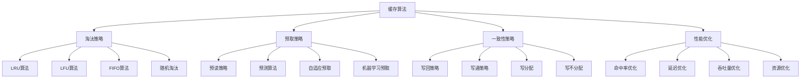

# 缓存算法

## 📖 核心概念

**缓存算法**是缓存系统中决定数据存储和淘汰策略的核心机制，通过智能的数据管理策略，平衡缓存命中率、存储成本和访问性能。缓存算法的选择直接影响系统的整体性能和用户体验。

### 🏗️ 缓存算法的组成要素



## 🔍 缓存算法分类

### 淘汰策略

| 算法 | 特点 | 优势 | 劣势 | 适用场景 |
|------|------|------|------|----------|
| **LRU** | 最近最少使用 | 时间局部性好 | 实现复杂 | 通用场景 |
| **LFU** | 最少使用频率 | 频率局部性好 | 冷启动问题 | 稳定访问模式 |
| **FIFO** | 先进先出 | 实现简单 | 性能一般 | 简单场景 |
| **随机** | 随机淘汰 | 实现简单 | 性能不稳定 | 测试场景 |

### 预取策略

| 策略 | 特点 | 优势 | 劣势 | 适用场景 |
|------|------|------|------|----------|
| **顺序预取** | 预取相邻数据 | 实现简单 | 命中率低 | 顺序访问 |
| **预测预取** | 基于访问模式 | 命中率高 | 实现复杂 | 模式化访问 |
| **自适应预取** | 动态调整策略 | 适应性强 | 复杂度高 | 变化访问模式 |
| **机器学习预取** | AI驱动预取 | 智能化高 | 资源消耗大 | 复杂场景 |

## 💻 缓存算法实现

### LRU缓存实现

```cpp
// LRU缓存实现
template<typename K, typename V>
class LRUCache {
private:
    struct Node {
        K key;
        V value;
        Node* prev;
        Node* next;
        
        Node(K k, V v) : key(k), value(v), prev(nullptr), next(nullptr) {}
    };
    
    int capacity;
    Node* head;
    Node* tail;
    unordered_map<K, Node*> cache;
    
    // 添加节点到头部
    void addToHead(Node* node) {
        node->prev = head;
        node->next = head->next;
        head->next->prev = node;
        head->next = node;
    }
    
    // 删除节点
    void removeNode(Node* node) {
        node->prev->next = node->next;
        node->next->prev = node->prev;
    }
    
    // 移动节点到头部
    void moveToHead(Node* node) {
        removeNode(node);
        addToHead(node);
    }
    
    // 删除尾部节点
    Node* removeTail() {
        Node* lastNode = tail->prev;
        removeNode(lastNode);
        return lastNode;
    }
    
public:
    LRUCache(int cap) : capacity(cap) {
        head = new Node(K{}, V{});
        tail = new Node(K{}, V{});
        head->next = tail;
        tail->prev = head;
    }
    
    ~LRUCache() {
        Node* current = head;
        while (current != nullptr) {
            Node* next = current->next;
            delete current;
            current = next;
        }
    }
    
    // 获取值
    V get(K key) {
        auto it = cache.find(key);
        if (it != cache.end()) {
            Node* node = it->second;
            moveToHead(node);
            return node->value;
        }
        return V{};
    }
    
    // 设置值
    void put(K key, V value) {
        auto it = cache.find(key);
        if (it != cache.end()) {
            Node* node = it->second;
            node->value = value;
            moveToHead(node);
        } else {
            Node* newNode = new Node(key, value);
            
            if (cache.size() >= capacity) {
                Node* tail = removeTail();
                cache.erase(tail->key);
                delete tail;
            }
            
            addToHead(newNode);
            cache[key] = newNode;
        }
    }
    
    // 删除键
    void erase(K key) {
        auto it = cache.find(key);
        if (it != cache.end()) {
            Node* node = it->second;
            removeNode(node);
            cache.erase(it);
            delete node;
        }
    }
    
    // 检查键是否存在
    bool contains(K key) {
        return cache.find(key) != cache.end();
    }
    
    // 获取大小
    size_t size() {
        return cache.size();
    }
    
    // 清空缓存
    void clear() {
        Node* current = head->next;
        while (current != tail) {
            Node* next = current->next;
            delete current;
            current = next;
        }
        head->next = tail;
        tail->prev = head;
        cache.clear();
    }
    
    // 获取统计信息
    struct CacheStatistics {
        size_t size;
        int capacity;
        double hitRate;
        double missRate;
        size_t totalAccesses;
        size_t hits;
        size_t misses;
    };
    
    CacheStatistics getStatistics() {
        CacheStatistics stats;
        stats.size = cache.size();
        stats.capacity = capacity;
        stats.totalAccesses = 0; // 需要在实际使用中统计
        stats.hits = 0;
        stats.misses = 0;
        stats.hitRate = 0;
        stats.missRate = 0;
        
        return stats;
    }
};
```

### LFU缓存实现

```cpp
// LFU缓存实现
template<typename K, typename V>
class LFUCache {
private:
    struct Node {
        K key;
        V value;
        int frequency;
        Node* prev;
        Node* next;
        
        Node(K k, V v) : key(k), value(v), frequency(1), prev(nullptr), next(nullptr) {}
    };
    
    struct FrequencyList {
        int frequency;
        Node* head;
        Node* tail;
        
        FrequencyList(int freq) : frequency(freq) {
            head = new Node(K{}, V{});
            tail = new Node(K{}, V{});
            head->next = tail;
            tail->prev = head;
        }
        
        ~FrequencyList() {
            Node* current = head;
            while (current != nullptr) {
                Node* next = current->next;
                delete current;
                current = next;
            }
        }
        
        void addNode(Node* node) {
            node->prev = head;
            node->next = head->next;
            head->next->prev = node;
            head->next = node;
        }
        
        void removeNode(Node* node) {
            node->prev->next = node->next;
            node->next->prev = node->prev;
        }
        
        bool isEmpty() {
            return head->next == tail;
        }
        
        Node* removeTail() {
            Node* lastNode = tail->prev;
            removeNode(lastNode);
            return lastNode;
        }
    };
    
    int capacity;
    unordered_map<K, Node*> cache;
    unordered_map<int, FrequencyList*> frequencyMap;
    int minFrequency;
    
    // 更新节点频率
    void updateFrequency(Node* node) {
        int oldFreq = node->frequency;
        int newFreq = oldFreq + 1;
        
        // 从旧频率列表中移除
        frequencyMap[oldFreq]->removeNode(node);
        
        // 如果旧频率列表为空，删除它
        if (frequencyMap[oldFreq]->isEmpty()) {
            delete frequencyMap[oldFreq];
            frequencyMap.erase(oldFreq);
            
            if (oldFreq == minFrequency) {
                minFrequency = newFreq;
            }
        }
        
        // 更新节点频率
        node->frequency = newFreq;
        
        // 添加到新频率列表
        if (frequencyMap.find(newFreq) == frequencyMap.end()) {
            frequencyMap[newFreq] = new FrequencyList(newFreq);
        }
        frequencyMap[newFreq]->addNode(node);
    }
    
public:
    LFUCache(int cap) : capacity(cap), minFrequency(1) {}
    
    ~LFUCache() {
        for (auto& [freq, freqList] : frequencyMap) {
            delete freqList;
        }
    }
    
    // 获取值
    V get(K key) {
        auto it = cache.find(key);
        if (it != cache.end()) {
            Node* node = it->second;
            updateFrequency(node);
            return node->value;
        }
        return V{};
    }
    
    // 设置值
    void put(K key, V value) {
        auto it = cache.find(key);
        if (it != cache.end()) {
            Node* node = it->second;
            node->value = value;
            updateFrequency(node);
        } else {
            if (cache.size() >= capacity) {
                // 删除最少使用的节点
                Node* leastUsed = frequencyMap[minFrequency]->removeTail();
                cache.erase(leastUsed->key);
                delete leastUsed;
            }
            
            Node* newNode = new Node(key, value);
            cache[key] = newNode;
            
            if (frequencyMap.find(1) == frequencyMap.end()) {
                frequencyMap[1] = new FrequencyList(1);
            }
            frequencyMap[1]->addNode(newNode);
            minFrequency = 1;
        }
    }
    
    // 删除键
    void erase(K key) {
        auto it = cache.find(key);
        if (it != cache.end()) {
            Node* node = it->second;
            int freq = node->frequency;
            
            frequencyMap[freq]->removeNode(node);
            if (frequencyMap[freq]->isEmpty()) {
                delete frequencyMap[freq];
                frequencyMap.erase(freq);
                
                if (freq == minFrequency) {
                    minFrequency = frequencyMap.empty() ? 1 : frequencyMap.begin()->first;
                }
            }
            
            cache.erase(it);
            delete node;
        }
    }
    
    // 检查键是否存在
    bool contains(K key) {
        return cache.find(key) != cache.end();
    }
    
    // 获取大小
    size_t size() {
        return cache.size();
    }
    
    // 清空缓存
    void clear() {
        for (auto& [key, node] : cache) {
            delete node;
        }
        cache.clear();
        
        for (auto& [freq, freqList] : frequencyMap) {
            delete freqList;
        }
        frequencyMap.clear();
        minFrequency = 1;
    }
    
    // 获取统计信息
    struct CacheStatistics {
        size_t size;
        int capacity;
        int minFrequency;
        int maxFrequency;
        double averageFrequency;
    };
    
    CacheStatistics getStatistics() {
        CacheStatistics stats;
        stats.size = cache.size();
        stats.capacity = capacity;
        stats.minFrequency = minFrequency;
        stats.maxFrequency = 0;
        stats.averageFrequency = 0;
        
        int totalFrequency = 0;
        for (const auto& [key, node] : cache) {
            totalFrequency += node->frequency;
            stats.maxFrequency = max(stats.maxFrequency, node->frequency);
        }
        
        if (stats.size > 0) {
            stats.averageFrequency = (double)totalFrequency / stats.size;
        }
        
        return stats;
    }
};
```

### 自适应缓存实现

```cpp
// 自适应缓存实现
template<typename K, typename V>
class AdaptiveCache {
private:
    struct CacheEntry {
        K key;
        V value;
        int accessCount;
        chrono::system_clock::time_point lastAccess;
        chrono::system_clock::time_point createdTime;
        
        CacheEntry(K k, V v) : key(k), value(v), accessCount(1) {
            lastAccess = chrono::system_clock::now();
            createdTime = lastAccess;
        }
    };
    
    int capacity;
    unordered_map<K, CacheEntry*> cache;
    chrono::system_clock::time_point lastCleanup;
    
    // 计算访问分数
    double calculateAccessScore(const CacheEntry* entry) {
        auto now = chrono::system_clock::now();
        auto age = chrono::duration_cast<chrono::seconds>(now - entry->createdTime).count();
        auto recency = chrono::duration_cast<chrono::seconds>(now - entry->lastAccess).count();
        
        // 基于访问频率、年龄和最近性的综合评分
        double frequencyScore = log(1 + entry->accessCount);
        double ageScore = 1.0 / (1.0 + age / 3600.0); // 1小时为基准
        double recencyScore = 1.0 / (1.0 + recency / 300.0); // 5分钟为基准
        
        return frequencyScore * ageScore * recencyScore;
    }
    
    // 选择淘汰候选
    K selectEvictionCandidate() {
        K candidate = cache.begin()->first;
        double minScore = calculateAccessScore(cache.begin()->second);
        
        for (const auto& [key, entry] : cache) {
            double score = calculateAccessScore(entry);
            if (score < minScore) {
                minScore = score;
                candidate = key;
            }
        }
        
        return candidate;
    }
    
    // 清理过期条目
    void cleanupExpiredEntries() {
        auto now = chrono::system_clock::now();
        auto cleanupInterval = chrono::minutes(5);
        
        if (now - lastCleanup < cleanupInterval) {
            return;
        }
        
        vector<K> expiredKeys;
        for (const auto& [key, entry] : cache) {
            auto age = chrono::duration_cast<chrono::hours>(now - entry->lastAccess).count();
            if (age > 24) { // 24小时未访问
                expiredKeys.push_back(key);
            }
        }
        
        for (const K& key : expiredKeys) {
            delete cache[key];
            cache.erase(key);
        }
        
        lastCleanup = now;
    }
    
public:
    AdaptiveCache(int cap) : capacity(cap) {
        lastCleanup = chrono::system_clock::now();
    }
    
    ~AdaptiveCache() {
        for (auto& [key, entry] : cache) {
            delete entry;
        }
    }
    
    // 获取值
    V get(K key) {
        auto it = cache.find(key);
        if (it != cache.end()) {
            CacheEntry* entry = it->second;
            entry->accessCount++;
            entry->lastAccess = chrono::system_clock::now();
            return entry->value;
        }
        return V{};
    }
    
    // 设置值
    void put(K key, V value) {
        auto it = cache.find(key);
        if (it != cache.end()) {
            CacheEntry* entry = it->second;
            entry->value = value;
            entry->accessCount++;
            entry->lastAccess = chrono::system_clock::now();
        } else {
            if (cache.size() >= capacity) {
                K candidate = selectEvictionCandidate();
                delete cache[candidate];
                cache.erase(candidate);
            }
            
            CacheEntry* newEntry = new CacheEntry(key, value);
            cache[key] = newEntry;
        }
        
        cleanupExpiredEntries();
    }
    
    // 删除键
    void erase(K key) {
        auto it = cache.find(key);
        if (it != cache.end()) {
            delete it->second;
            cache.erase(it);
        }
    }
    
    // 检查键是否存在
    bool contains(K key) {
        return cache.find(key) != cache.end();
    }
    
    // 获取大小
    size_t size() {
        return cache.size();
    }
    
    // 清空缓存
    void clear() {
        for (auto& [key, entry] : cache) {
            delete entry;
        }
        cache.clear();
    }
    
    // 获取统计信息
    struct CacheStatistics {
        size_t size;
        int capacity;
        int totalAccesses;
        double averageAccessCount;
        double averageAge;
        double averageRecency;
    };
    
    CacheStatistics getStatistics() {
        CacheStatistics stats;
        stats.size = cache.size();
        stats.capacity = capacity;
        stats.totalAccesses = 0;
        stats.averageAccessCount = 0;
        stats.averageAge = 0;
        stats.averageRecency = 0;
        
        auto now = chrono::system_clock::now();
        int totalAccessCount = 0;
        double totalAge = 0;
        double totalRecency = 0;
        
        for (const auto& [key, entry] : cache) {
            totalAccessCount += entry->accessCount;
            
            auto age = chrono::duration_cast<chrono::seconds>(now - entry->createdTime).count();
            auto recency = chrono::duration_cast<chrono::seconds>(now - entry->lastAccess).count();
            
            totalAge += age;
            totalRecency += recency;
        }
        
        if (stats.size > 0) {
            stats.totalAccesses = totalAccessCount;
            stats.averageAccessCount = (double)totalAccessCount / stats.size;
            stats.averageAge = totalAge / stats.size;
            stats.averageRecency = totalRecency / stats.size;
        }
        
        return stats;
    }
};
```

### 缓存性能测试

```cpp
// 缓存性能测试
class CachePerformanceTest {
public:
    static void testLRUCache(int capacity, int operations) {
        LRUCache<int, string> cache(capacity);
        auto start = chrono::high_resolution_clock::now();
        
        // 插入操作
        for (int i = 0; i < operations; i++) {
            cache.put(i, "value_" + to_string(i));
        }
        
        // 访问操作
        for (int i = 0; i < operations; i++) {
            cache.get(i);
        }
        
        auto end = chrono::high_resolution_clock::now();
        auto duration = chrono::duration_cast<chrono::microseconds>(end - start);
        
        cout << "LRU Cache test completed in " << duration.count() << " microseconds" << endl;
        
        auto stats = cache.getStatistics();
        cout << "Cache size: " << stats.size << "/" << stats.capacity << endl;
    }
    
    static void testLFUCache(int capacity, int operations) {
        LFUCache<int, string> cache(capacity);
        auto start = chrono::high_resolution_clock::now();
        
        // 插入操作
        for (int i = 0; i < operations; i++) {
            cache.put(i, "value_" + to_string(i));
        }
        
        // 访问操作
        for (int i = 0; i < operations; i++) {
            cache.get(i);
        }
        
        auto end = chrono::high_resolution_clock::now();
        auto duration = chrono::duration_cast<chrono::microseconds>(end - start);
        
        cout << "LFU Cache test completed in " << duration.count() << " microseconds" << endl;
        
        auto stats = cache.getStatistics();
        cout << "Cache size: " << stats.size << "/" << stats.capacity << endl;
        cout << "Average frequency: " << stats.averageFrequency << endl;
    }
    
    static void testAdaptiveCache(int capacity, int operations) {
        AdaptiveCache<int, string> cache(capacity);
        auto start = chrono::high_resolution_clock::now();
        
        // 插入操作
        for (int i = 0; i < operations; i++) {
            cache.put(i, "value_" + to_string(i));
        }
        
        // 访问操作
        for (int i = 0; i < operations; i++) {
            cache.get(i);
        }
        
        auto end = chrono::high_resolution_clock::now();
        auto duration = chrono::duration_cast<chrono::microseconds>(end - start);
        
        cout << "Adaptive Cache test completed in " << duration.count() << " microseconds" << endl;
        
        auto stats = cache.getStatistics();
        cout << "Cache size: " << stats.size << "/" << stats.capacity << endl;
        cout << "Average access count: " << stats.averageAccessCount << endl;
    }
    
    static void compareCacheAlgorithms(int capacity, int operations) {
        cout << "Comparing cache algorithms with capacity " << capacity << " and " << operations << " operations" << endl;
        
        cout << "\n=== LRU Cache ===" << endl;
        testLRUCache(capacity, operations);
        
        cout << "\n=== LFU Cache ===" << endl;
        testLFUCache(capacity, operations);
        
        cout << "\n=== Adaptive Cache ===" << endl;
        testAdaptiveCache(capacity, operations);
    }
};
```

## ⚡ 复杂度分析

### 缓存算法复杂度

| 算法 | 查找 | 插入 | 删除 | 空间复杂度 | 适用场景 |
|------|------|------|------|------------|----------|
| **LRU** | O(1) | O(1) | O(1) | O(n) | 通用场景 |
| **LFU** | O(1) | O(1) | O(1) | O(n) | 稳定访问模式 |
| **FIFO** | O(1) | O(1) | O(1) | O(n) | 简单场景 |
| **自适应** | O(1) | O(1) | O(1) | O(n) | 变化访问模式 |

### 性能优化策略

| 优化策略 | 适用场景 | 优化效果 | 实现难度 | 维护成本 |
|----------|----------|----------|----------|----------|
| **预取优化** | 顺序访问 | 显著 | 中等 | 中等 |
| **分区缓存** | 大容量 | 显著 | 困难 | 高 |
| **压缩存储** | 存储空间 | 明显 | 中等 | 中等 |
| **智能淘汰** | 复杂场景 | 显著 | 困难 | 高 |

## 🎓 学习要点总结

### 核心理解

1. **淘汰策略**：理解不同淘汰策略的特点
2. **预取机制**：掌握预取策略的实现
3. **一致性保证**：理解缓存一致性的重要性
4. **性能优化**：掌握缓存性能优化方法

### 实践要点

1. **算法选择**：选择合适的缓存算法
2. **参数调优**：调优缓存参数
3. **性能测试**：测试缓存性能
4. **监控分析**：监控缓存运行状态

### 应用思维

1. **系统设计**：设计高效的缓存系统
2. **性能权衡**：权衡缓存性能和成本
3. **问题诊断**：诊断缓存问题
4. **实际应用**：将缓存算法应用到实际问题中

---

**相关链接：**
- [[06-应用实战/03-缓存系统/01-缓存策略|缓存策略]] - 缓存系统设计
- [[05-高级结构/01-哈希宇宙/01-哈希表HashTable详解|哈希表HashTable详解]] - 哈希表基础
- [[05-高级结构/03-特殊结构/02-布隆过滤器|布隆过滤器]] - 概率数据结构
- [[06-应用实战/01-数据库王国/01-索引结构|索引结构]] - 数据库索引
