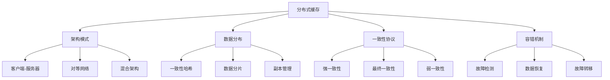

# 分布式缓存

## 📖 核心概念

**分布式缓存**是在多台服务器上分布存储缓存数据的系统，通过数据分片、副本管理和一致性协议来提供高可用性和高性能的缓存服务。

### 🏗️ 分布式缓存分类



## 🔧 分布式缓存实现

### 一致性哈希实现

```cpp
class ConsistentHash {
private:
    struct VirtualNode {
        string physicalNode;
        int replicaId;
        uint32_t hash;
        
        VirtualNode(const string& node, int replica, uint32_t h) 
            : physicalNode(node), replicaId(replica), hash(h) {}
    };
    
    map<uint32_t, VirtualNode> ring;
    map<string, int> nodeReplicaCount;
    int defaultReplicas;
    
    // 计算哈希值
    uint32_t hash(const string& key) {
        uint32_t h = 0;
        for (char c : key) {
            h = h * 31 + c;
        }
        return h;
    }
    
public:
    ConsistentHash(int replicas = 150) : defaultReplicas(replicas) {}
    
    // 添加节点
    void addNode(const string& nodeId) {
        addNode(nodeId, defaultReplicas);
    }
    
    void addNode(const string& nodeId, int replicas) {
        nodeReplicaCount[nodeId] = replicas;
        
        for (int i = 0; i < replicas; i++) {
            string virtualNodeId = nodeId + ":" + to_string(i);
            uint32_t hashValue = hash(virtualNodeId);
            
            VirtualNode vnode(nodeId, i, hashValue);
            ring[hashValue] = vnode;
            
            cout << "Added virtual node: " << virtualNodeId << " (hash: " << hashValue << ")" << endl;
        }
        
        cout << "Added physical node: " << nodeId << " with " << replicas << " replicas" << endl;
    }
    
    // 移除节点
    void removeNode(const string& nodeId) {
        auto it = nodeReplicaCount.find(nodeId);
        if (it == nodeReplicaCount.end()) {
            cout << "Node " << nodeId << " not found" << endl;
            return;
        }
        
        int replicas = it->second;
        
        for (int i = 0; i < replicas; i++) {
            string virtualNodeId = nodeId + ":" + to_string(i);
            uint32_t hashValue = hash(virtualNodeId);
            
            auto ringIt = ring.find(hashValue);
            if (ringIt != ring.end()) {
                ring.erase(ringIt);
                cout << "Removed virtual node: " << virtualNodeId << endl;
            }
        }
        
        nodeReplicaCount.erase(it);
        cout << "Removed physical node: " << nodeId << endl;
    }
    
    // 获取节点
    string getNode(const string& key) {
        if (ring.empty()) {
            cout << "No nodes available" << endl;
            return "";
        }
        
        uint32_t keyHash = hash(key);
        
        // 找到第一个大于等于keyHash的节点
        auto it = ring.lower_bound(keyHash);
        
        if (it == ring.end()) {
            // 如果没有找到，使用第一个节点（环形）
            it = ring.begin();
        }
        
        string nodeId = it->second.physicalNode;
        cout << "Key " << key << " (hash: " << keyHash << ") -> Node " << nodeId << endl;
        return nodeId;
    }
    
    // 获取多个节点（用于副本）
    vector<string> getNodes(const string& key, int count) {
        vector<string> nodes;
        if (ring.empty() || count <= 0) {
            return nodes;
        }
        
        uint32_t keyHash = hash(key);
        
        // 找到第一个大于等于keyHash的节点
        auto it = ring.lower_bound(keyHash);
        
        if (it == ring.end()) {
            it = ring.begin();
        }
        
        set<string> uniqueNodes;
        
        // 收集指定数量的不同节点
        while (uniqueNodes.size() < count && uniqueNodes.size() < ring.size()) {
            string nodeId = it->second.physicalNode;
            if (uniqueNodes.find(nodeId) == uniqueNodes.end()) {
                uniqueNodes.insert(nodeId);
                nodes.push_back(nodeId);
            }
            
            ++it;
            if (it == ring.end()) {
                it = ring.begin();
            }
        }
        
        cout << "Key " << key << " -> Nodes: ";
        for (const string& node : nodes) {
            cout << node << " ";
        }
        cout << endl;
        
        return nodes;
    }
    
    // 显示哈希环
    void displayRing() {
        cout << "Consistent Hash Ring:" << endl;
        cout << "===================" << endl;
        
        cout << "Physical nodes: " << nodeReplicaCount.size() << endl;
        for (const auto& pair : nodeReplicaCount) {
            cout << "  " << pair.first << ": " << pair.second << " replicas" << endl;
        }
        
        cout << "Virtual nodes: " << ring.size() << endl;
        for (const auto& pair : ring) {
            const VirtualNode& vnode = pair.second;
            cout << "  Hash " << pair.first << " -> " << vnode.physicalNode 
                 << ":" << vnode.replicaId << endl;
        }
    }
    
    // 分析负载均衡
    void analyzeLoadBalance() {
        cout << "Load Balance Analysis:" << endl;
        cout << "====================" << endl;
        
        if (ring.empty()) {
            cout << "No nodes available" << endl;
            return;
        }
        
        map<string, int> nodeLoad;
        
        // 计算每个节点的负载
        for (const auto& pair : ring) {
            const VirtualNode& vnode = pair.second;
            nodeLoad[vnode.physicalNode]++;
        }
        
        cout << "Node load distribution:" << endl;
        for (const auto& pair : nodeLoad) {
            cout << "  " << pair.first << ": " << pair.second << " virtual nodes" << endl;
        }
        
        // 计算负载均衡指标
        if (!nodeLoad.empty()) {
            int totalLoad = 0;
            int minLoad = INT_MAX;
            int maxLoad = 0;
            
            for (const auto& pair : nodeLoad) {
                totalLoad += pair.second;
                minLoad = min(minLoad, pair.second);
                maxLoad = max(maxLoad, pair.second);
            }
            
            double averageLoad = (double)totalLoad / nodeLoad.size();
            double loadVariance = 0.0;
            
            for (const auto& pair : nodeLoad) {
                double diff = pair.second - averageLoad;
                loadVariance += diff * diff;
            }
            loadVariance /= nodeLoad.size();
            
            cout << "Load statistics:" << endl;
            cout << "  Average load: " << averageLoad << endl;
            cout << "  Min load: " << minLoad << endl;
            cout << "  Max load: " << maxLoad << endl;
            cout << "  Load variance: " << loadVariance << endl;
            cout << "  Load balance ratio: " << (double)minLoad / maxLoad << endl;
        }
    }
};
```

### 分布式缓存实现

```cpp
class DistributedCache {
private:
    struct CacheNode {
        string nodeId;
        string address;
        int port;
        bool isHealthy;
        map<string, string> cache;
        chrono::time_point<chrono::high_resolution_clock> lastHeartbeat;
        
        CacheNode(const string& id, const string& addr, int p) 
            : nodeId(id), address(addr), port(p), isHealthy(true) {
            lastHeartbeat = chrono::high_resolution_clock::now();
        }
    };
    
    ConsistentHash hashRing;
    map<string, CacheNode> nodes;
    int replicationFactor;
    
public:
    DistributedCache(int replicas = 3) : hashRing(150), replicationFactor(replicas) {}
    
    // 添加缓存节点
    void addNode(const string& nodeId, const string& address, int port) {
        CacheNode node(nodeId, address, port);
        nodes[nodeId] = node;
        hashRing.addNode(nodeId);
        
        cout << "Added cache node: " << nodeId << " at " << address << ":" << port << endl;
    }
    
    // 移除缓存节点
    void removeNode(const string& nodeId) {
        auto it = nodes.find(nodeId);
        if (it != nodes.end()) {
            nodes.erase(it);
            hashRing.removeNode(nodeId);
            cout << "Removed cache node: " << nodeId << endl;
        }
    }
    
    // 设置缓存值
    bool set(const string& key, const string& value) {
        vector<string> targetNodes = hashRing.getNodes(key, replicationFactor);
        
        if (targetNodes.empty()) {
            cout << "No healthy nodes available for key: " << key << endl;
            return false;
        }
        
        bool success = true;
        for (const string& nodeId : targetNodes) {
            auto it = nodes.find(nodeId);
            if (it != nodes.end() && it->second.isHealthy) {
                it->second.cache[key] = value;
                cout << "Set " << key << " = " << value << " on node " << nodeId << endl;
            } else {
                success = false;
                cout << "Failed to set " << key << " on node " << nodeId << endl;
            }
        }
        
        return success;
    }
    
    // 获取缓存值
    string get(const string& key) {
        vector<string> targetNodes = hashRing.getNodes(key, replicationFactor);
        
        if (targetNodes.empty()) {
            cout << "No healthy nodes available for key: " << key << endl;
            return "";
        }
        
        // 尝试从第一个健康的节点获取
        for (const string& nodeId : targetNodes) {
            auto it = nodes.find(nodeId);
            if (it != nodes.end() && it->second.isHealthy) {
                auto cacheIt = it->second.cache.find(key);
                if (cacheIt != it->second.cache.end()) {
                    cout << "GET " << key << " = " << cacheIt->second << " from node " << nodeId << endl;
                    return cacheIt->second;
                }
            }
        }
        
        cout << "GET " << key << " = (not found)" << endl;
        return "";
    }
    
    // 删除缓存值
    bool del(const string& key) {
        vector<string> targetNodes = hashRing.getNodes(key, replicationFactor);
        
        if (targetNodes.empty()) {
            cout << "No healthy nodes available for key: " << key << endl;
            return false;
        }
        
        bool success = true;
        for (const string& nodeId : targetNodes) {
            auto it = nodes.find(nodeId);
            if (it != nodes.end() && it->second.isHealthy) {
                auto cacheIt = it->second.cache.find(key);
                if (cacheIt != it->second.cache.end()) {
                    it->second.cache.erase(cacheIt);
                    cout << "DEL " << key << " from node " << nodeId << endl;
                }
            } else {
                success = false;
            }
        }
        
        return success;
    }
    
    // 模拟节点故障
    void simulateNodeFailure(const string& nodeId) {
        auto it = nodes.find(nodeId);
        if (it != nodes.end()) {
            it->second.isHealthy = false;
            cout << "Node " << nodeId << " failed" << endl;
            
            // 检查受影响的键
            checkAffectedKeys(nodeId);
        }
    }
    
    // 检查受影响的键
    void checkAffectedKeys(const string& failedNodeId) {
        cout << "Checking keys affected by node " << failedNodeId << " failure:" << endl;
        
        vector<string> affectedKeys;
        
        // 检查所有节点的缓存
        for (const auto& nodePair : nodes) {
            const CacheNode& node = nodePair.second;
            if (node.isHealthy) {
                for (const auto& cachePair : node.cache) {
                    const string& key = cachePair.first;
                    
                    // 检查这个键是否应该存储在故障节点上
                    vector<string> targetNodes = hashRing.getNodes(key, replicationFactor);
                    if (find(targetNodes.begin(), targetNodes.end(), failedNodeId) != targetNodes.end()) {
                        affectedKeys.push_back(key);
                    }
                }
            }
        }
        
        cout << "Affected keys: " << affectedKeys.size() << endl;
        for (const string& key : affectedKeys) {
            cout << "  " << key << endl;
        }
    }
    
    // 数据恢复
    void recoverData(const string& failedNodeId) {
        cout << "Recovering data for node " << failedNodeId << endl;
        
        // 找到需要恢复的键
        vector<string> keysToRecover;
        
        for (const auto& nodePair : nodes) {
            const CacheNode& node = nodePair.second;
            if (node.isHealthy) {
                for (const auto& cachePair : node.cache) {
                    const string& key = cachePair.first;
                    
                    vector<string> targetNodes = hashRing.getNodes(key, replicationFactor);
                    if (find(targetNodes.begin(), targetNodes.end(), failedNodeId) != targetNodes.end()) {
                        keysToRecover.push_back(key);
                    }
                }
            }
        }
        
        // 恢复数据
        for (const string& key : keysToRecover) {
            string value = get(key);
            if (!value.empty()) {
                set(key, value);
                cout << "Recovered key: " << key << endl;
            }
        }
    }
    
    // 显示缓存状态
    void displayCacheStatus() {
        cout << "Distributed Cache Status:" << endl;
        cout << "=======================" << endl;
        
        cout << "Replication factor: " << replicationFactor << endl;
        cout << "Total nodes: " << nodes.size() << endl;
        
        int healthyNodes = 0;
        int totalKeys = 0;
        
        for (const auto& pair : nodes) {
            const CacheNode& node = pair.second;
            cout << "Node " << node.nodeId << ": " 
                 << (node.isHealthy ? "Healthy" : "Failed") 
                 << ", Keys: " << node.cache.size() << endl;
            
            if (node.isHealthy) {
                healthyNodes++;
                totalKeys += node.cache.size();
            }
        }
        
        cout << "Healthy nodes: " << healthyNodes << endl;
        cout << "Total keys: " << totalKeys << endl;
        cout << "Average keys per node: " << (healthyNodes > 0 ? (double)totalKeys / healthyNodes : 0) << endl;
    }
    
    // 显示哈希环状态
    void displayHashRing() {
        hashRing.displayRing();
        hashRing.analyzeLoadBalance();
    }
};
```

### 一致性协议实现

```cpp
class CacheConsistencyProtocol {
private:
    enum ConsistencyLevel {
        STRONG_CONSISTENCY,
        EVENTUAL_CONSISTENCY,
        WEAK_CONSISTENCY
    };
    
    struct CacheEntry {
        string value;
        int version;
        chrono::time_point<chrono::high_resolution_clock> timestamp;
        string nodeId;
        
        CacheEntry(const string& v, int ver, const string& node) 
            : value(v), version(ver), nodeId(node) {
            timestamp = chrono::high_resolution_clock::now();
        }
    };
    
    map<string, vector<CacheEntry>> cacheEntries;
    ConsistencyLevel consistencyLevel;
    
public:
    CacheConsistencyProtocol(ConsistencyLevel level = EVENTUAL_CONSISTENCY) 
        : consistencyLevel(level) {}
    
    // 强一致性写入
    bool writeWithStrongConsistency(const string& key, const string& value, const string& nodeId) {
        cout << "Strong consistency write for " << key << endl;
        
        // 获取写锁
        if (!acquireWriteLock(key)) {
            cout << "Failed to acquire write lock for " << key << endl;
            return false;
        }
        
        // 更新所有副本
        bool success = true;
        for (auto& pair : cacheEntries) {
            if (pair.first.find(key) != string::npos) {
                int newVersion = pair.second.empty() ? 1 : pair.second.back().version + 1;
                CacheEntry newEntry(value, newVersion, nodeId);
                pair.second.push_back(newEntry);
                cout << "Updated version " << newVersion << " on " << pair.first << endl;
            }
        }
        
        // 释放写锁
        releaseWriteLock(key);
        
        if (success) {
            cout << "Strong consistency write completed for " << key << endl;
        }
        
        return success;
    }
    
    // 最终一致性写入
    bool writeWithEventualConsistency(const string& key, const string& value, const string& nodeId) {
        cout << "Eventual consistency write for " << key << endl;
        
        // 写入本地副本
        int newVersion = cacheEntries[key].empty() ? 1 : cacheEntries[key].back().version + 1;
        CacheEntry newEntry(value, newVersion, nodeId);
        cacheEntries[key].push_back(newEntry);
        
        cout << "Written version " << newVersion << " to " << nodeId << endl;
        
        // 异步传播到其他副本
        propagateToOtherReplicas(key, newEntry);
        
        return true;
    }
    
    // 弱一致性写入
    bool writeWithWeakConsistency(const string& key, const string& value, const string& nodeId) {
        cout << "Weak consistency write for " << key << endl;
        
        // 只写入本地副本
        int newVersion = cacheEntries[key].empty() ? 1 : cacheEntries[key].back().version + 1;
        CacheEntry newEntry(value, newVersion, nodeId);
        cacheEntries[key].push_back(newEntry);
        
        cout << "Written version " << newVersion << " to " << nodeId << endl;
        
        return true;
    }
    
    // 读取数据
    string readWithConsistency(const string& key, const string& nodeId) {
        cout << "Reading " << key << " with " << consistencyLevel << " consistency" << endl;
        
        switch (consistencyLevel) {
            case STRONG_CONSISTENCY:
                return readWithStrongConsistency(key);
            case EVENTUAL_CONSISTENCY:
                return readWithEventualConsistency(key, nodeId);
            case WEAK_CONSISTENCY:
                return readWithWeakConsistency(key, nodeId);
            default:
                return "";
        }
    }
    
    // 强一致性读取
    string readWithStrongConsistency(const string& key) {
        cout << "Strong consistency read for " << key << endl;
        
        // 获取读锁
        if (!acquireReadLock(key)) {
            cout << "Failed to acquire read lock for " << key << endl;
            return "";
        }
        
        // 读取最新版本
        if (cacheEntries.find(key) != cacheEntries.end() && !cacheEntries[key].empty()) {
            CacheEntry latestEntry = cacheEntries[key].back();
            cout << "Read version " << latestEntry.version << endl;
            
            releaseReadLock(key);
            return latestEntry.value;
        }
        
        releaseReadLock(key);
        return "";
    }
    
    // 最终一致性读取
    string readWithEventualConsistency(const string& key, const string& nodeId) {
        cout << "Eventual consistency read for " << key << endl;
        
        // 读取本地最新版本
        if (cacheEntries.find(key) != cacheEntries.end() && !cacheEntries[key].empty()) {
            CacheEntry latestEntry = cacheEntries[key].back();
            cout << "Read local version " << latestEntry.version << endl;
            return latestEntry.value;
        }
        
        return "";
    }
    
    // 弱一致性读取
    string readWithWeakConsistency(const string& key, const string& nodeId) {
        cout << "Weak consistency read for " << key << endl;
        
        // 读取本地版本
        if (cacheEntries.find(key) != cacheEntries.end() && !cacheEntries[key].empty()) {
            CacheEntry localEntry = cacheEntries[key].back();
            cout << "Read local version " << localEntry.version << endl;
            return localEntry.value;
        }
        
        return "";
    }
    
    // 传播到其他副本
    void propagateToOtherReplicas(const string& key, const CacheEntry& entry) {
        cout << "Propagating version " << entry.version << " to other replicas" << endl;
        
        // 模拟异步传播
        for (auto& pair : cacheEntries) {
            if (pair.first != key) {
                // 检查版本冲突
                if (!pair.second.empty()) {
                    CacheEntry& localEntry = pair.second.back();
                    if (localEntry.version < entry.version) {
                        pair.second.push_back(entry);
                        cout << "Propagated to " << pair.first << endl;
                    }
                }
            }
        }
    }
    
    // 获取写锁
    bool acquireWriteLock(const string& key) {
        cout << "Acquiring write lock for " << key << endl;
        // 简化的锁实现
        return true;
    }
    
    // 释放写锁
    void releaseWriteLock(const string& key) {
        cout << "Releasing write lock for " << key << endl;
    }
    
    // 获取读锁
    bool acquireReadLock(const string& key) {
        cout << "Acquiring read lock for " << key << endl;
        // 简化的锁实现
        return true;
    }
    
    // 释放读锁
    void releaseReadLock(const string& key) {
        cout << "Releasing read lock for " << key << endl;
    }
    
    // 显示一致性状态
    void displayConsistencyStatus() {
        cout << "Cache Consistency Status:" << endl;
        cout << "=======================" << endl;
        
        cout << "Consistency level: " << consistencyLevel << endl;
        cout << "Total keys: " << cacheEntries.size() << endl;
        
        for (const auto& pair : cacheEntries) {
            cout << "Key: " << pair.first << endl;
            cout << "  Versions: " << pair.second.size() << endl;
            
            if (!pair.second.empty()) {
                const CacheEntry& latest = pair.second.back();
                cout << "  Latest version: " << latest.version << " from " << latest.nodeId << endl;
            }
        }
    }
};
```

## 🎯 分布式缓存应用

### 实际应用场景

```cpp
class DistributedCacheApplications {
public:
    static void demonstrateApplications() {
        cout << "Distributed Cache Applications:" << endl;
        cout << "=============================" << endl;
        
        cout << "1. Web应用缓存:" << endl;
        cout << "   - 页面缓存" << endl;
        cout << "   - 会话存储" << endl;
        cout << "   - 静态资源缓存" << endl;
        
        cout << "2. 数据库缓存:" << endl;
        cout << "   - 查询结果缓存" << endl;
        cout << "   - 热点数据缓存" << endl;
        cout << "   - 读写分离缓存" << endl;
        
        cout << "3. 微服务缓存:" << endl;
        cout << "   - 服务间数据共享" << endl;
        cout << "   - 配置信息缓存" << endl;
        cout << "   - 用户状态缓存" << endl;
        
        cout << "4. 大数据缓存:" << endl;
        cout << "   - 计算结果缓存" << endl;
        cout << "   - 中间数据缓存" << endl;
        cout << "   - 实时数据缓存" << endl;
    }
    
    static void analyzePerformance() {
        cout << "Distributed Cache Performance Analysis:" << endl;
        cout << "=====================================" << endl;
        
        cout << "1. 架构模式:" << endl;
        cout << "   - 客户端-服务器: 简单但单点故障" << endl;
        cout << "   - 对等网络: 高可用但复杂" << endl;
        cout << "   - 混合架构: 平衡性能和复杂度" << endl;
        cout << endl;
        
        cout << "2. 数据分布:" << endl;
        cout << "   - 一致性哈希: 负载均衡好" << endl;
        cout << "   - 数据分片: 扩展性好" << endl;
        cout << "   - 副本管理: 可用性高" << endl;
        cout << endl;
        
        cout << "3. 一致性协议:" << endl;
        cout << "   - 强一致性: 数据准确但性能低" << endl;
        cout << "   - 最终一致性: 性能高但可能不一致" << endl;
        cout << "   - 弱一致性: 最高性能但数据可能过时" << endl;
    }
    
    static void selectCacheStrategy(bool needsHighAvailability, bool needsStrongConsistency, bool needsHighPerformance) {
        cout << "Cache Strategy Selection:" << endl;
        cout << "======================" << endl;
        
        cout << "Needs high availability: " << (needsHighAvailability ? "Yes" : "No") << endl;
        cout << "Needs strong consistency: " << (needsStrongConsistency ? "Yes" : "No") << endl;
        cout << "Needs high performance: " << (needsHighPerformance ? "Yes" : "No") << endl;
        
        cout << "Recommendation:" << endl;
        
        if (needsHighAvailability && needsStrongConsistency) {
            cout << "Use client-server architecture with strong consistency" << endl;
        } else if (needsHighAvailability && needsHighPerformance) {
            cout << "Use peer-to-peer architecture with eventual consistency" << endl;
        } else if (needsStrongConsistency) {
            cout << "Use client-server architecture with strong consistency" << endl;
        } else if (needsHighPerformance) {
            cout << "Use peer-to-peer architecture with weak consistency" << endl;
        } else {
            cout << "Use hybrid architecture with eventual consistency" << endl;
        }
    }
};
```

## 📊 分布式缓存分析

### 性能分析

```cpp
class DistributedCacheAnalysis {
public:
    static void analyzePerformance() {
        cout << "Distributed Cache Performance Analysis:" << endl;
        cout << "=====================================" << endl;
        
        cout << "1. 读写性能:" << endl;
        cout << "   - 并行读取: O(n) 其中n是副本数" << endl;
        cout << "   - 并行写入: O(n) 其中n是副本数" << endl;
        cout << "   - 网络延迟: O(1) 本地访问" << endl;
        
        cout << "2. 一致性性能:" << endl;
        cout << "   - 强一致性: 延迟高，吞吐量低" << endl;
        cout << "   - 最终一致性: 延迟低，吞吐量高" << endl;
        cout << "   - 弱一致性: 延迟最低，吞吐量最高" << endl;
        
        cout << "3. 容错性能:" << endl;
        cout << "   - 故障检测: O(1) 心跳机制" << endl;
        cout << "   - 数据恢复: O(n) 其中n是数据量" << endl;
        cout << "   - 故障转移: O(1) 自动切换" << endl;
    }
    
    static void analyzeSpaceComplexity() {
        cout << "Distributed Cache Space Complexity Analysis:" << endl;
        cout << "=========================================" << endl;
        
        cout << "1. 存储开销:" << endl;
        cout << "   - 数据存储: O(n) 其中n是数据量" << endl;
        cout << "   - 副本存储: O(n*r) 其中r是副本数" << endl;
        cout << "   - 元数据存储: O(f) 其中f是文件数" << endl;
        
        cout << "2. 网络开销:" << endl;
        cout << "   - 心跳消息: O(n) 其中n是节点数" << endl;
        cout << "   - 数据同步: O(d) 其中d是数据量" << endl;
        cout << "   - 元数据同步: O(f) 其中f是文件数" << endl;
        
        cout << "3. 内存开销:" << endl;
        cout << "   - 缓存: O(c) 其中c是缓存大小" << endl;
        cout << "   - 元数据: O(f) 其中f是文件数" << endl;
        cout << "   - 连接: O(n) 其中n是节点数" << endl;
    }
    
    static void analyzeTimeComplexity() {
        cout << "Distributed Cache Time Complexity Analysis:" << endl;
        cout << "=========================================" << endl;
        
        cout << "1. 缓存操作:" << endl;
        cout << "   - 创建缓存: O(r) 其中r是副本数" << endl;
        cout << "   - 读取缓存: O(1) 本地访问" << endl;
        cout << "   - 更新缓存: O(r) 其中r是副本数" << endl;
        cout << "   - 删除缓存: O(r) 其中r是副本数" << endl;
        
        cout << "2. 系统操作:" << endl;
        cout << "   - 故障检测: O(1) 心跳机制" << endl;
        cout << "   - 数据恢复: O(d) 其中d是数据量" << endl;
        cout << "   - 负载均衡: O(n) 其中n是节点数" << endl;
        
        cout << "3. 一致性操作:" << endl;
        cout << "   - 强一致性: O(r) 同步更新" << endl;
        cout << "   - 最终一致性: O(1) 异步更新" << endl;
        cout << "   - 弱一致性: O(1) 本地更新" << endl;
    }
};
```

## 🎮 分布式缓存测试

### 1. 基础功能测试

```cpp
class DistributedCacheTest {
public:
    static void testConsistentHash() {
        cout << "Testing Consistent Hash:" << endl;
        cout << "======================" << endl;
        
        ConsistentHash ch(3);
        
        // 添加节点
        ch.addNode("node1");
        ch.addNode("node2");
        ch.addNode("node3");
        
        // 测试键分布
        ch.getNode("key1");
        ch.getNode("key2");
        ch.getNode("key3");
        
        // 显示哈希环
        ch.displayRing();
        ch.analyzeLoadBalance();
    }
    
    static void testDistributedCache() {
        cout << "Testing Distributed Cache:" << endl;
        cout << "=======================" << endl;
        
        DistributedCache dc(2);
        
        // 添加节点
        dc.addNode("node1", "192.168.1.1", 6379);
        dc.addNode("node2", "192.168.1.2", 6379);
        dc.addNode("node3", "192.168.1.3", 6379);
        
        // 测试缓存操作
        dc.set("key1", "value1");
        dc.set("key2", "value2");
        dc.get("key1");
        dc.get("key2");
        
        // 模拟节点故障
        dc.simulateNodeFailure("node1");
        
        dc.displayCacheStatus();
    }
    
    static void testConsistencyProtocol() {
        cout << "Testing Consistency Protocol:" << endl;
        cout << "==========================" << endl;
        
        CacheConsistencyProtocol ccp(CacheConsistencyProtocol::EVENTUAL_CONSISTENCY);
        
        // 测试写入
        ccp.writeWithEventualConsistency("key1", "value1", "node1");
        ccp.writeWithEventualConsistency("key1", "value2", "node2");
        
        // 测试读取
        string value = ccp.readWithConsistency("key1", "node1");
        cout << "Read value: " << value << endl;
        
        ccp.displayConsistencyStatus();
    }
    
    static void testApplications() {
        cout << "Testing Applications:" << endl;
        cout << "==================" << endl;
        
        DistributedCacheApplications::demonstrateApplications();
        DistributedCacheApplications::analyzePerformance();
        DistributedCacheApplications::selectCacheStrategy(true, false, true);
    }
    
    static void testAnalysis() {
        cout << "Testing Analysis:" << endl;
        cout << "===============" << endl;
        
        DistributedCacheAnalysis::analyzePerformance();
        DistributedCacheAnalysis::analyzeSpaceComplexity();
        DistributedCacheAnalysis::analyzeTimeComplexity();
    }
};
```

## 🔗 相关链接

- [[01-Redis数据结构|Redis数据结构]]
- [[02-缓存淘汰策略|缓存淘汰策略]]
- [[03-缓存性能优化|缓存性能优化]]

## 💡 分布式缓存要点

1. **一致性哈希**: 提供负载均衡和动态扩展
2. **数据分布**: 通过分片和副本提高可用性
3. **一致性协议**: 平衡数据一致性和性能
4. **容错机制**: 保证系统的高可用性

---

*📝 分布式缓存提示：分布式缓存需要在一致性、可用性和性能之间找到平衡，选择合适的架构和协议*
