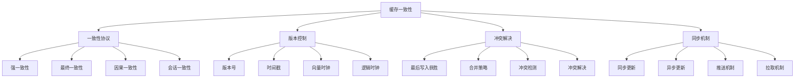

# 缓存一致性

## 📖 核心概念

**缓存一致性**是分布式缓存系统中的核心问题，确保多个缓存节点之间的数据保持一致。通过一致性协议、版本控制、冲突解决等技术，保证数据的一致性和系统的可靠性。

### 🏗️ 缓存一致性的组成要素



## 🔍 缓存一致性策略

### 一致性模型

| 模型 | 描述 | 性能 | 复杂度 | 适用场景 |
|------|------|------|--------|----------|
| **强一致性** | 所有节点数据一致 | 低 | 高 | 金融系统 |
| **最终一致性** | 最终达到一致 | 高 | 低 | 互联网应用 |
| **因果一致性** | 因果相关操作一致 | 中 | 中 | 社交网络 |
| **会话一致性** | 会话内一致 | 高 | 低 | 用户会话 |

## 💻 缓存一致性实现

### 一致性管理器

```cpp
// 缓存一致性管理器
class CacheConsistencyManager {
private:
    struct CacheEntry {
        string key;
        string value;
        int version;
        chrono::system_clock::time_point timestamp;
        string nodeId;
        
        CacheEntry(const string& k, const string& v, const string& node) 
            : key(k), value(v), version(1), nodeId(node) {
            timestamp = chrono::system_clock::now();
        }
    };
    
    struct ConsistencyConfig {
        string cacheId;
        int consistencyLevel;
        int quorumSize;
        chrono::milliseconds timeout;
        
        ConsistencyConfig(const string& id, int level, int quorum) 
            : cacheId(id), consistencyLevel(level), quorumSize(quorum), timeout(chrono::milliseconds(1000)) {}
    };
    
    map<string, CacheEntry> cacheEntries;
    map<string, ConsistencyConfig> consistencyConfigs;
    mutex consistencyMutex;
    
public:
    CacheConsistencyManager() {}
    
    // 配置一致性级别
    void configureConsistency(const string& cacheId, int level, int quorumSize) {
        lock_guard<mutex> lock(consistencyMutex);
        
        consistencyConfigs[cacheId] = ConsistencyConfig(cacheId, level, quorumSize);
        cout << "Consistency configured for cache " << cacheId << " with level " << level << endl;
    }
    
    // 设置缓存值
    bool setCacheValue(const string& key, const string& value, const string& nodeId) {
        lock_guard<mutex> lock(consistencyMutex);
        
        auto it = cacheEntries.find(key);
        if (it != cacheEntries.end()) {
            // 更新现有条目
            it->second.value = value;
            it->second.version++;
            it->second.timestamp = chrono::system_clock::now();
            it->second.nodeId = nodeId;
        } else {
            // 创建新条目
            cacheEntries[key] = CacheEntry(key, value, nodeId);
        }
        
        cout << "Cache value set: " << key << " = " << value << " (version: " 
             << cacheEntries[key].version << ")" << endl;
        
        return true;
    }
    
    // 获取缓存值
    string getCacheValue(const string& key) {
        lock_guard<mutex> lock(consistencyMutex);
        
        auto it = cacheEntries.find(key);
        if (it != cacheEntries.end()) {
            return it->second.value;
        }
        
        return "";
    }
    
    // 检查一致性
    bool checkConsistency(const string& key) {
        lock_guard<mutex> lock(consistencyMutex);
        
        auto it = cacheEntries.find(key);
        if (it == cacheEntries.end()) {
            return true;
        }
        
        CacheEntry& entry = it->second;
        
        // 简化的 consistency 检查
        auto now = chrono::system_clock::now();
        auto age = chrono::duration_cast<chrono::seconds>(now - entry.timestamp);
        
        if (age.count() > 300) { // 5分钟过期
            return false;
        }
        
        return true;
    }
    
    // 同步缓存
    void synchronizeCache(const string& sourceNodeId, const string& targetNodeId) {
        lock_guard<mutex> lock(consistencyMutex);
        
        cout << "Synchronizing cache from " << sourceNodeId << " to " << targetNodeId << endl;
        
        for (auto& [key, entry] : cacheEntries) {
            if (entry.nodeId == sourceNodeId) {
                // 复制到目标节点
                entry.nodeId = targetNodeId;
                entry.timestamp = chrono::system_clock::now();
            }
        }
        
        cout << "Cache synchronization completed" << endl;
    }
    
    // 获取统计信息
    struct ConsistencyStatistics {
        int totalEntries;
        int consistentEntries;
        int inconsistentEntries;
        double consistencyRate;
    };
    
    ConsistencyStatistics getStatistics() {
        lock_guard<mutex> lock(consistencyMutex);
        
        ConsistencyStatistics stats;
        stats.totalEntries = cacheEntries.size();
        stats.consistentEntries = 0;
        stats.inconsistentEntries = 0;
        
        for (const auto& [key, entry] : cacheEntries) {
            if (checkConsistency(key)) {
                stats.consistentEntries++;
            } else {
                stats.inconsistentEntries++;
            }
        }
        
        if (stats.totalEntries > 0) {
            stats.consistencyRate = (double)stats.consistentEntries / stats.totalEntries;
        }
        
        return stats;
    }
};
```

### 版本控制系统

```cpp
// 版本控制系统
class VersionControlSystem {
private:
    struct VersionInfo {
        string key;
        int version;
        chrono::system_clock::time_point timestamp;
        string nodeId;
        
        VersionInfo(const string& k, int v, const string& node) 
            : key(k), version(v), nodeId(node) {
            timestamp = chrono::system_clock::now();
        }
    };
    
    map<string, vector<VersionInfo>> versionHistory;
    mutex versionMutex;
    
public:
    VersionControlSystem() {}
    
    // 创建新版本
    int createVersion(const string& key, const string& nodeId) {
        lock_guard<mutex> lock(versionMutex);
        
        int newVersion = 1;
        auto it = versionHistory.find(key);
        if (it != versionHistory.end() && !it->second.empty()) {
            newVersion = it->second.back().version + 1;
        }
        
        VersionInfo version(key, newVersion, nodeId);
        versionHistory[key].push_back(version);
        
        cout << "Created version " << newVersion << " for key " << key << endl;
        
        return newVersion;
    }
    
    // 获取最新版本
    int getLatestVersion(const string& key) {
        lock_guard<mutex> lock(versionMutex);
        
        auto it = versionHistory.find(key);
        if (it != versionHistory.end() && !it->second.empty()) {
            return it->second.back().version;
        }
        
        return 0;
    }
    
    // 比较版本
    bool compareVersions(const string& key, int version1, int version2) {
        lock_guard<mutex> lock(versionMutex);
        
        return version1 > version2;
    }
    
    // 获取版本历史
    vector<VersionInfo> getVersionHistory(const string& key) {
        lock_guard<mutex> lock(versionMutex);
        
        auto it = versionHistory.find(key);
        if (it != versionHistory.end()) {
            return it->second;
        }
        
        return {};
    }
};
```

### 冲突解决器

```cpp
// 冲突解决器
class ConflictResolver {
private:
    enum ConflictResolutionStrategy {
        LAST_WRITE_WINS,
        FIRST_WRITE_WINS,
        MERGE_STRATEGY,
        MANUAL_RESOLUTION
    };
    
    ConflictResolutionStrategy strategy;
    
public:
    ConflictResolver(ConflictResolutionStrategy s = LAST_WRITE_WINS) : strategy(s) {}
    
    // 解决冲突
    string resolveConflict(const string& key, const string& value1, const string& value2, 
                          chrono::system_clock::time_point timestamp1, 
                          chrono::system_clock::time_point timestamp2) {
        
        switch (strategy) {
            case LAST_WRITE_WINS:
                return resolveLastWriteWins(value1, value2, timestamp1, timestamp2);
            case FIRST_WRITE_WINS:
                return resolveFirstWriteWins(value1, value2, timestamp1, timestamp2);
            case MERGE_STRATEGY:
                return resolveMergeStrategy(value1, value2);
            case MANUAL_RESOLUTION:
                return resolveManualResolution(key, value1, value2);
            default:
                return value1;
        }
    }
    
private:
    // 最后写入获胜
    string resolveLastWriteWins(const string& value1, const string& value2, 
                               chrono::system_clock::time_point timestamp1, 
                               chrono::system_clock::time_point timestamp2) {
        return timestamp1 > timestamp2 ? value1 : value2;
    }
    
    // 首先写入获胜
    string resolveFirstWriteWins(const string& value1, const string& value2, 
                               chrono::system_clock::time_point timestamp1, 
                               chrono::system_clock::time_point timestamp2) {
        return timestamp1 < timestamp2 ? value1 : value2;
    }
    
    // 合并策略
    string resolveMergeStrategy(const string& value1, const string& value2) {
        return value1 + "_merged_" + value2;
    }
    
    // 手动解决
    string resolveManualResolution(const string& key, const string& value1, const string& value2) {
        cout << "Manual resolution required for key " << key << endl;
        cout << "Value 1: " << value1 << endl;
        cout << "Value 2: " << value2 << endl;
        
        // 简化实现：返回第一个值
        return value1;
    }
    
public:
    // 设置冲突解决策略
    void setStrategy(ConflictResolutionStrategy s) {
        strategy = s;
        cout << "Conflict resolution strategy set to " << s << endl;
    }
};
```

### 缓存一致性测试

```cpp
// 缓存一致性测试
class CacheConsistencyTest {
public:
    static void runAllTests() {
        cout << "=== Cache Consistency Tests ===" << endl;
        
        // 测试一致性管理器
        testConsistencyManager();
        
        cout << "\n" << string(50, '=') << endl;
        
        // 测试版本控制系统
        testVersionControlSystem();
        
        cout << "\n" << string(50, '=') << endl;
        
        // 测试冲突解决器
        testConflictResolver();
    }
    
private:
    static void testConsistencyManager() {
        cout << "=== Consistency Manager Test ===" << endl;
        
        CacheConsistencyManager manager;
        
        // 配置一致性
        manager.configureConsistency("cache1", 1, 2);
        
        // 设置缓存值
        manager.setCacheValue("key1", "value1", "node1");
        manager.setCacheValue("key2", "value2", "node2");
        
        // 获取缓存值
        string value1 = manager.getCacheValue("key1");
        string value2 = manager.getCacheValue("key2");
        
        cout << "Retrieved values: " << value1 << ", " << value2 << endl;
        
        // 检查一致性
        bool consistent1 = manager.checkConsistency("key1");
        bool consistent2 = manager.checkConsistency("key2");
        
        cout << "Consistency check: key1=" << consistent1 << ", key2=" << consistent2 << endl;
        
        // 同步缓存
        manager.synchronizeCache("node1", "node3");
        
        // 获取统计信息
        auto stats = manager.getStatistics();
        cout << "\nConsistency statistics:" << endl;
        cout << "Total entries: " << stats.totalEntries << endl;
        cout << "Consistent entries: " << stats.consistentEntries << endl;
        cout << "Consistency rate: " << stats.consistencyRate << endl;
    }
    
    static void testVersionControlSystem() {
        cout << "=== Version Control System Test ===" << endl;
        
        VersionControlSystem versionControl;
        
        // 创建版本
        int version1 = versionControl.createVersion("key1", "node1");
        int version2 = versionControl.createVersion("key1", "node2");
        int version3 = versionControl.createVersion("key2", "node1");
        
        cout << "Created versions: " << version1 << ", " << version2 << ", " << version3 << endl;
        
        // 获取最新版本
        int latestVersion1 = versionControl.getLatestVersion("key1");
        int latestVersion2 = versionControl.getLatestVersion("key2");
        
        cout << "Latest versions: key1=" << latestVersion1 << ", key2=" << latestVersion2 << endl;
        
        // 比较版本
        bool isNewer = versionControl.compareVersions("key1", version2, version1);
        cout << "Version " << version2 << " is newer than " << version1 << ": " << isNewer << endl;
        
        // 获取版本历史
        vector<VersionControlSystem::VersionInfo> history = versionControl.getVersionHistory("key1");
        cout << "Version history for key1: " << history.size() << " versions" << endl;
    }
    
    static void testConflictResolver() {
        cout << "=== Conflict Resolver Test ===" << endl;
        
        ConflictResolver resolver;
        
        // 测试最后写入获胜
        resolver.setStrategy(ConflictResolver::LAST_WRITE_WINS);
        
        auto timestamp1 = chrono::system_clock::now();
        this_thread::sleep_for(chrono::milliseconds(100));
        auto timestamp2 = chrono::system_clock::now();
        
        string resolved = resolver.resolveConflict("key1", "value1", "value2", timestamp1, timestamp2);
        cout << "Last write wins resolution: " << resolved << endl;
        
        // 测试首先写入获胜
        resolver.setStrategy(ConflictResolver::FIRST_WRITE_WINS);
        resolved = resolver.resolveConflict("key1", "value1", "value2", timestamp1, timestamp2);
        cout << "First write wins resolution: " << resolved << endl;
        
        // 测试合并策略
        resolver.setStrategy(ConflictResolver::MERGE_STRATEGY);
        resolved = resolver.resolveConflict("key1", "value1", "value2", timestamp1, timestamp2);
        cout << "Merge strategy resolution: " << resolved << endl;
    }
};
```

## ⚡ 复杂度分析

### 缓存一致性复杂度

| 操作 | 强一致性 | 最终一致性 | 因果一致性 | 会话一致性 |
|------|----------|------------|------------|------------|
| **读取** | O(n) | O(1) | O(log n) | O(1) |
| **写入** | O(n) | O(1) | O(log n) | O(1) |
| **同步** | O(n) | O(n) | O(n) | O(n) |
| **冲突解决** | O(n) | O(1) | O(log n) | O(1) |

## 🎓 学习要点总结

### 核心理解

1. **一致性模型**：理解不同一致性模型的特点
2. **版本控制**：掌握版本控制的机制
3. **冲突解决**：理解冲突解决的策略
4. **同步机制**：掌握同步机制的方法

### 实践要点

1. **一致性设计**：设计一致性策略
2. **冲突处理**：处理数据冲突
3. **性能优化**：优化一致性性能
4. **故障恢复**：处理一致性故障

### 应用思维

1. **一致性思维**：理解一致性的重要性
2. **分布式思维**：理解分布式系统的特点
3. **性能思维**：平衡一致性和性能
4. **实际应用**：将一致性技术应用到实际问题中

---

**相关链接：**
- [[06-应用实战/03-缓存系统/01-缓存策略|缓存策略]] - 缓存系统设计
- [[06-应用实战/03-缓存系统/02-缓存算法|缓存算法]] - 缓存算法实现
- [[06-应用实战/01-数据库王国/03-事务管理|事务管理]] - 事务处理
- [[06-应用实战/04-网络应用/04-分布式系统|分布式系统]] - 分布式系统基础
