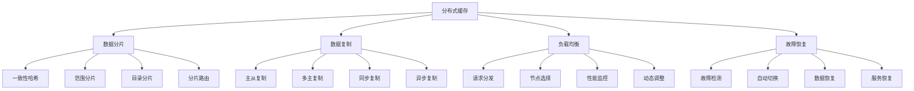

# 分布式缓存

## 📖 核心概念

**分布式缓存**是将缓存数据分布在多个物理节点上的缓存系统，通过分布式架构、数据分片、复制机制等技术，实现高可用性、高扩展性和高性能。分布式缓存是现代大规模应用的核心基础设施。

### 🏗️ 分布式缓存的组成要素



## 🔍 分布式缓存架构

### 架构类型

| 架构类型 | 特点 | 优势 | 劣势 | 适用场景 |
|----------|------|------|------|----------|
| **客户端分片** | 客户端负责分片 | 简单实现 | 客户端复杂 | 中小规模 |
| **代理分片** | 代理服务器分片 | 客户端简单 | 代理瓶颈 | 中等规模 |
| **服务端分片** | 服务端自动分片 | 自动管理 | 实现复杂 | 大规模 |
| **混合架构** | 多种架构结合 | 功能全面 | 复杂度高 | 复杂场景 |

## 💻 分布式缓存实现

### 分布式缓存管理器

```cpp
// 分布式缓存管理器
class DistributedCacheManager {
private:
    struct CacheNode {
        string nodeId;
        string host;
        int port;
        bool isActive;
        size_t totalMemory;
        size_t usedMemory;
        chrono::system_clock::time_point lastHeartbeat;
        
        CacheNode(const string& id, const string& h, int p, size_t memory) 
            : nodeId(id), host(h), port(p), isActive(true), totalMemory(memory), usedMemory(0) {
            lastHeartbeat = chrono::system_clock::now();
        }
        
        string getAddress() const {
            return host + ":" + to_string(port);
        }
    };
    
    struct CacheEntry {
        string key;
        string value;
        chrono::system_clock::time_point timestamp;
        chrono::seconds ttl;
        string nodeId;
        
        CacheEntry(const string& k, const string& v, const string& node) 
            : key(k), value(v), nodeId(node), ttl(chrono::seconds(3600)) {
            timestamp = chrono::system_clock::now();
        }
        
        bool isExpired() const {
            auto now = chrono::system_clock::now();
            return now - timestamp > ttl;
        }
    };
    
    vector<CacheNode> cacheNodes;
    map<string, CacheEntry> cacheEntries;
    map<string, vector<string>> keyToNodes;
    mutex managerMutex;
    
    int replicationFactor;
    
public:
    DistributedCacheManager(int replication = 2) : replicationFactor(replication) {}
    
    // 添加缓存节点
    void addCacheNode(const string& nodeId, const string& host, int port, size_t memory) {
        lock_guard<mutex> lock(managerMutex);
        
        cacheNodes.emplace_back(nodeId, host, port, memory);
        cout << "Cache node " << nodeId << " added at " << host << ":" << port << endl;
    }
    
    // 设置缓存值
    bool setCacheValue(const string& key, const string& value, chrono::seconds ttl = chrono::seconds(3600)) {
        lock_guard<mutex> lock(managerMutex);
        
        // 选择节点
        vector<string> targetNodes = selectNodesForKey(key);
        if (targetNodes.empty()) {
            return false;
        }
        
        // 创建缓存条目
        CacheEntry entry(key, value, targetNodes[0]);
        entry.ttl = ttl;
        cacheEntries[key] = entry;
        
        // 设置到多个节点
        for (const string& nodeId : targetNodes) {
            setValueOnNode(nodeId, key, value, ttl);
        }
        
        keyToNodes[key] = targetNodes;
        
        cout << "Cache value set: " << key << " = " << value << " on " << targetNodes.size() << " nodes" << endl;
        return true;
    }
    
    // 获取缓存值
    string getCacheValue(const string& key) {
        lock_guard<mutex> lock(managerMutex);
        
        auto it = cacheEntries.find(key);
        if (it == cacheEntries.end()) {
            return "";
        }
        
        CacheEntry& entry = it->second;
        
        // 检查是否过期
        if (entry.isExpired()) {
            cacheEntries.erase(it);
            return "";
        }
        
        // 选择最佳节点读取
        string bestNode = selectBestNodeForRead(key);
        if (bestNode.empty()) {
            return "";
        }
        
        cout << "Reading cache value: " << key << " from node " << bestNode << endl;
        
        return entry.value;
    }
    
    // 删除缓存值
    bool deleteCacheValue(const string& key) {
        lock_guard<mutex> lock(managerMutex);
        
        auto it = cacheEntries.find(key);
        if (it == cacheEntries.end()) {
            return false;
        }
        
        // 从所有节点删除
        auto nodeIt = keyToNodes.find(key);
        if (nodeIt != keyToNodes.end()) {
            for (const string& nodeId : nodeIt->second) {
                deleteValueFromNode(nodeId, key);
            }
            keyToNodes.erase(nodeIt);
        }
        
        cacheEntries.erase(it);
        cout << "Cache value deleted: " << key << endl;
        return true;
    }
    
private:
    // 选择节点
    vector<string> selectNodesForKey(const string& key) {
        vector<string> selectedNodes;
        
        // 过滤可用节点
        vector<CacheNode*> availableNodes;
        for (auto& node : cacheNodes) {
            if (node.isActive && node.usedMemory < node.totalMemory * 0.9) {
                availableNodes.push_back(&node);
            }
        }
        
        if (availableNodes.size() < replicationFactor) {
            return selectedNodes;
        }
        
        // 使用一致性哈希选择节点
        hash<string> hasher;
        size_t hashValue = hasher(key);
        
        // 简化的节点选择
        for (int i = 0; i < replicationFactor; i++) {
            int nodeIndex = (hashValue + i) % availableNodes.size();
            selectedNodes.push_back(availableNodes[nodeIndex]->nodeId);
        }
        
        return selectedNodes;
    }
    
    // 选择最佳读取节点
    string selectBestNodeForRead(const string& key) {
        auto it = keyToNodes.find(key);
        if (it == keyToNodes.end()) {
            return "";
        }
        
        for (const string& nodeId : it->second) {
            for (const auto& node : cacheNodes) {
                if (node.nodeId == nodeId && node.isActive) {
                    return nodeId;
                }
            }
        }
        
        return "";
    }
    
    // 在节点上设置值
    void setValueOnNode(const string& nodeId, const string& key, const string& value, chrono::seconds ttl) {
        cout << "Setting value on node " << nodeId << ": " << key << " = " << value << endl;
        // 模拟设置值
    }
    
    // 从节点删除值
    void deleteValueFromNode(const string& nodeId, const string& key) {
        cout << "Deleting value from node " << nodeId << ": " << key << endl;
        // 模拟删除值
    }
    
public:
    // 更新心跳
    void updateHeartbeat(const string& nodeId) {
        lock_guard<mutex> lock(managerMutex);
        
        for (auto& node : cacheNodes) {
            if (node.nodeId == nodeId) {
                node.lastHeartbeat = chrono::system_clock::now();
                node.isActive = true;
                break;
            }
        }
    }
    
    // 检查节点健康状态
    void checkNodeHealth() {
        lock_guard<mutex> lock(managerMutex);
        
        auto now = chrono::system_clock::now();
        auto timeout = chrono::seconds(30);
        
        for (auto& node : cacheNodes) {
            if (now - node.lastHeartbeat > timeout) {
                node.isActive = false;
                cout << "Cache node " << node.nodeId << " is inactive" << endl;
            }
        }
    }
    
    // 获取统计信息
    struct DistributedCacheStatistics {
        int totalNodes;
        int activeNodes;
        int totalEntries;
        size_t totalMemory;
        size_t usedMemory;
        double memoryUtilization;
    };
    
    DistributedCacheStatistics getStatistics() {
        lock_guard<mutex> lock(managerMutex);
        
        DistributedCacheStatistics stats;
        stats.totalNodes = cacheNodes.size();
        stats.activeNodes = 0;
        stats.totalEntries = cacheEntries.size();
        stats.totalMemory = 0;
        stats.usedMemory = 0;
        
        for (const auto& node : cacheNodes) {
            if (node.isActive) {
                stats.activeNodes++;
            }
            stats.totalMemory += node.totalMemory;
            stats.usedMemory += node.usedMemory;
        }
        
        if (stats.totalMemory > 0) {
            stats.memoryUtilization = (double)stats.usedMemory / stats.totalMemory;
        }
        
        return stats;
    }
};
```

### 一致性哈希实现

```cpp
// 一致性哈希
class ConsistentHash {
private:
    struct HashNode {
        string nodeId;
        uint32_t hash;
        
        HashNode(const string& id, uint32_t h) : nodeId(id), hash(h) {}
    };
    
    vector<HashNode> hashRing;
    int virtualNodes;
    
public:
    ConsistentHash(int vNodes = 150) : virtualNodes(vNodes) {}
    
    // 添加节点
    void addNode(const string& nodeId) {
        for (int i = 0; i < virtualNodes; i++) {
            string virtualKey = nodeId + ":" + to_string(i);
            uint32_t hash = hashFunction(virtualKey);
            hashRing.emplace_back(nodeId, hash);
        }
        
        sort(hashRing.begin(), hashRing.end(),
             [](const HashNode& a, const HashNode& b) {
                 return a.hash < b.hash;
             });
        
        cout << "Node " << nodeId << " added to hash ring" << endl;
    }
    
    // 移除节点
    void removeNode(const string& nodeId) {
        hashRing.erase(
            remove_if(hashRing.begin(), hashRing.end(),
                     [&nodeId](const HashNode& node) {
                         return node.nodeId == nodeId;
                     }),
            hashRing.end()
        );
        
        cout << "Node " << nodeId << " removed from hash ring" << endl;
    }
    
    // 获取节点
    string getNode(const string& key) {
        if (hashRing.empty()) {
            return "";
        }
        
        uint32_t hash = hashFunction(key);
        
        // 查找第一个大于等于hash的节点
        auto it = lower_bound(hashRing.begin(), hashRing.end(), hash,
                             [](const HashNode& node, uint32_t h) {
                                 return node.hash < h;
                             });
        
        if (it == hashRing.end()) {
            it = hashRing.begin();
        }
        
        return it->nodeId;
    }
    
    // 获取多个节点
    vector<string> getNodes(const string& key, int count) {
        vector<string> nodes;
        
        if (hashRing.empty()) {
            return nodes;
        }
        
        uint32_t hash = hashFunction(key);
        
        // 查找第一个大于等于hash的节点
        auto it = lower_bound(hashRing.begin(), hashRing.end(), hash,
                             [](const HashNode& node, uint32_t h) {
                                 return node.hash < h;
                             });
        
        if (it == hashRing.end()) {
            it = hashRing.begin();
        }
        
        // 收集指定数量的节点
        for (int i = 0; i < count; i++) {
            nodes.push_back(it->nodeId);
            it++;
            if (it == hashRing.end()) {
                it = hashRing.begin();
            }
        }
        
        return nodes;
    }
    
private:
    uint32_t hashFunction(const string& key) {
        hash<string> hasher;
        return hasher(key);
    }
    
public:
    // 获取统计信息
    struct HashStatistics {
        int totalNodes;
        int virtualNodes;
        double loadBalance;
    };
    
    HashStatistics getStatistics() {
        HashStatistics stats;
        stats.totalNodes = 0;
        stats.virtualNodes = hashRing.size();
        stats.loadBalance = 0;
        
        // 计算实际节点数量
        set<string> uniqueNodes;
        for (const auto& node : hashRing) {
            uniqueNodes.insert(node.nodeId);
        }
        stats.totalNodes = uniqueNodes.size();
        
        // 计算负载均衡度
        if (stats.totalNodes > 0) {
            map<string, int> nodeCounts;
            for (const auto& node : hashRing) {
                nodeCounts[node.nodeId]++;
            }
            
            int minCount = INT_MAX;
            int maxCount = 0;
            
            for (const auto& [nodeId, count] : nodeCounts) {
                minCount = min(minCount, count);
                maxCount = max(maxCount, count);
            }
            
            if (maxCount > 0) {
                stats.loadBalance = 1.0 - (double)(maxCount - minCount) / maxCount;
            }
        }
        
        return stats;
    }
};
```

### 分布式缓存测试

```cpp
// 分布式缓存测试
class DistributedCacheTest {
public:
    static void runAllTests() {
        cout << "=== Distributed Cache Tests ===" << endl;
        
        // 测试分布式缓存管理器
        testDistributedCacheManager();
        
        cout << "\n" << string(50, '=') << endl;
        
        // 测试一致性哈希
        testConsistentHash();
    }
    
private:
    static void testDistributedCacheManager() {
        cout << "=== Distributed Cache Manager Test ===" << endl;
        
        DistributedCacheManager manager;
        
        // 添加缓存节点
        manager.addCacheNode("node1", "192.168.1.1", 8080, 1024 * 1024 * 1024); // 1GB
        manager.addCacheNode("node2", "192.168.1.2", 8080, 1024 * 1024 * 1024); // 1GB
        manager.addCacheNode("node3", "192.168.1.3", 8080, 1024 * 1024 * 1024); // 1GB
        
        // 测试缓存操作
        manager.setCacheValue("key1", "value1", chrono::seconds(3600));
        manager.setCacheValue("key2", "value2", chrono::seconds(1800));
        
        string value1 = manager.getCacheValue("key1");
        string value2 = manager.getCacheValue("key2");
        
        cout << "Retrieved values: " << value1 << ", " << value2 << endl;
        
        manager.deleteCacheValue("key2");
        
        // 获取统计信息
        auto stats = manager.getStatistics();
        cout << "\nCache statistics:" << endl;
        cout << "Total nodes: " << stats.totalNodes << endl;
        cout << "Active nodes: " << stats.activeNodes << endl;
        cout << "Total entries: " << stats.totalEntries << endl;
        cout << "Memory utilization: " << stats.memoryUtilization << endl;
    }
    
    static void testConsistentHash() {
        cout << "=== Consistent Hash Test ===" << endl;
        
        ConsistentHash consistentHash;
        
        // 添加节点
        consistentHash.addNode("node1");
        consistentHash.addNode("node2");
        consistentHash.addNode("node3");
        
        // 测试节点选择
        string node1 = consistentHash.getNode("key1");
        string node2 = consistentHash.getNode("key2");
        string node3 = consistentHash.getNode("key3");
        
        cout << "Node selection: key1->" << node1 << ", key2->" << node2 << ", key3->" << node3 << endl;
        
        // 测试多节点选择
        vector<string> nodes = consistentHash.getNodes("key1", 2);
        cout << "Multiple nodes for key1: ";
        for (const string& node : nodes) {
            cout << node << " ";
        }
        cout << endl;
        
        // 获取统计信息
        auto stats = consistentHash.getStatistics();
        cout << "\nHash statistics:" << endl;
        cout << "Total nodes: " << stats.totalNodes << endl;
        cout << "Virtual nodes: " << stats.virtualNodes << endl;
        cout << "Load balance: " << stats.loadBalance << endl;
    }
};
```

## ⚡ 复杂度分析

### 分布式缓存复杂度

| 操作 | 单机复杂度 | 分布式复杂度 | 一致性影响 | 适用场景 |
|------|------------|--------------|------------|----------|
| **设置值** | O(1) | O(n) | 高 | 所有场景 |
| **获取值** | O(1) | O(1) | 低 | 所有场景 |
| **删除值** | O(1) | O(n) | 高 | 所有场景 |
| **节点管理** | O(1) | O(log n) | 中 | 节点管理 |

## 🎓 学习要点总结

### 核心理解

1. **分布式架构**：理解分布式缓存的架构设计
2. **数据分片**：掌握数据分片的策略和方法
3. **一致性哈希**：理解一致性哈希的原理
4. **故障恢复**：掌握故障恢复的策略

### 实践要点

1. **系统设计**：设计分布式缓存系统
2. **性能优化**：优化分布式缓存性能
3. **故障处理**：处理分布式系统故障
4. **监控管理**：监控和管理分布式系统

### 应用思维

1. **系统思维**：从系统角度思考问题
2. **分布式思维**：理解分布式系统的特点
3. **一致性思维**：平衡一致性和性能
4. **实际应用**：将分布式技术应用到实际问题中

---

**相关链接：**
- [[06-应用实战/03-缓存系统/01-缓存策略|缓存策略]] - 缓存系统设计
- [[06-应用实战/03-缓存系统/02-缓存算法|缓存算法]] - 缓存算法实现
- [[06-应用实战/03-缓存系统/03-缓存一致性|缓存一致性]] - 缓存一致性
- [[06-应用实战/04-网络应用/04-分布式系统|分布式系统]] - 分布式系统基础
