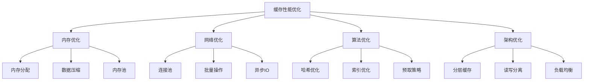

# 缓存性能优化

## 📖 核心概念

**缓存性能优化**是通过各种技术手段提高缓存系统性能的过程。包括内存优化、网络优化、算法优化和架构优化等多个方面，目标是提高缓存命中率、降低延迟和增加吞吐量。

### 🏗️ 缓存性能优化分类



## 🔧 缓存性能优化实现

### 内存优化

```cpp
class MemoryOptimizer {
private:
    struct MemoryPool {
        vector<void*> freeBlocks;
        size_t blockSize;
        size_t totalBlocks;
        size_t usedBlocks;
        
        MemoryPool(size_t size, size_t count) : blockSize(size), totalBlocks(count), usedBlocks(0) {
            freeBlocks.reserve(count);
            for (size_t i = 0; i < count; i++) {
                void* block = malloc(size);
                if (block) {
                    freeBlocks.push_back(block);
                }
            }
        }
        
        ~MemoryPool() {
            for (void* block : freeBlocks) {
                free(block);
            }
        }
        
        void* allocate() {
            if (freeBlocks.empty()) {
                return nullptr;
            }
            
            void* block = freeBlocks.back();
            freeBlocks.pop_back();
            usedBlocks++;
            return block;
        }
        
        void deallocate(void* block) {
            if (block && usedBlocks > 0) {
                freeBlocks.push_back(block);
                usedBlocks--;
            }
        }
        
        double getUsageRatio() const {
            return totalBlocks > 0 ? (double)usedBlocks / totalBlocks : 0.0;
        }
    };
    
    map<size_t, MemoryPool> memoryPools;
    size_t totalMemoryAllocated;
    size_t totalMemoryUsed;
    
public:
    MemoryOptimizer() : totalMemoryAllocated(0), totalMemoryUsed(0) {}
    
    ~MemoryOptimizer() {
        // 析构函数会自动清理内存池
    }
    
    // 创建内存池
    void createMemoryPool(size_t blockSize, size_t blockCount) {
        MemoryPool pool(blockSize, blockCount);
        memoryPools[blockSize] = pool;
        totalMemoryAllocated += blockSize * blockCount;
        
        cout << "Created memory pool: " << blockCount << " blocks of " << blockSize << " bytes" << endl;
    }
    
    // 分配内存
    void* allocateMemory(size_t size) {
        // 尝试从现有内存池分配
        auto it = memoryPools.find(size);
        if (it != memoryPools.end()) {
            void* block = it->second.allocate();
            if (block) {
                totalMemoryUsed += size;
                cout << "Allocated " << size << " bytes from pool" << endl;
                return block;
            }
        }
        
        // 如果没有合适的内存池，直接分配
        void* block = malloc(size);
        if (block) {
            totalMemoryAllocated += size;
            totalMemoryUsed += size;
            cout << "Allocated " << size << " bytes directly" << endl;
        }
        
        return block;
    }
    
    // 释放内存
    void deallocateMemory(void* block, size_t size) {
        if (!block) return;
        
        // 尝试释放到内存池
        auto it = memoryPools.find(size);
        if (it != memoryPools.end()) {
            it->second.deallocate(block);
            totalMemoryUsed -= size;
            cout << "Deallocated " << size << " bytes to pool" << endl;
        } else {
            // 直接释放
            free(block);
            totalMemoryAllocated -= size;
            totalMemoryUsed -= size;
            cout << "Deallocated " << size << " bytes directly" << endl;
        }
    }
    
    // 数据压缩
    string compressData(const string& data) {
        // 简化的压缩实现（实际应使用zlib等库）
        string compressed = data;
        
        // 简单的RLE压缩
        string result;
        int count = 1;
        
        for (size_t i = 1; i < data.length(); i++) {
            if (data[i] == data[i-1] && count < 255) {
                count++;
            } else {
                if (count > 1) {
                    result += to_string(count) + data[i-1];
                } else {
                    result += data[i-1];
                }
                count = 1;
            }
        }
        
        // 处理最后一个字符
        if (count > 1) {
            result += to_string(count) + data.back();
        } else {
            result += data.back();
        }
        
        cout << "Compressed data: " << data.length() << " -> " << result.length() << " bytes" << endl;
        return result;
    }
    
    // 数据解压缩
    string decompressData(const string& compressed) {
        // 简化的解压缩实现
        string result;
        
        for (size_t i = 0; i < compressed.length(); i++) {
            if (isdigit(compressed[i])) {
                int count = compressed[i] - '0';
                if (i + 1 < compressed.length()) {
                    char ch = compressed[i + 1];
                    for (int j = 0; j < count; j++) {
                        result += ch;
                    }
                    i++; // 跳过下一个字符
                }
            } else {
                result += compressed[i];
            }
        }
        
        cout << "Decompressed data: " << compressed.length() << " -> " << result.length() << " bytes" << endl;
        return result;
    }
    
    // 内存碎片整理
    void defragmentMemory() {
        cout << "Defragmenting memory..." << endl;
        
        // 简化的碎片整理实现
        for (auto& pair : memoryPools) {
            MemoryPool& pool = pair.second;
            
            // 重新组织空闲块
            vector<void*> newFreeBlocks;
            newFreeBlocks.reserve(pool.freeBlocks.size());
            
            for (void* block : pool.freeBlocks) {
                if (block) {
                    newFreeBlocks.push_back(block);
                }
            }
            
            pool.freeBlocks = newFreeBlocks;
        }
        
        cout << "Memory defragmentation completed" << endl;
    }
    
    // 显示内存使用情况
    void displayMemoryUsage() {
        cout << "Memory Usage:" << endl;
        cout << "============" << endl;
        
        cout << "Total allocated: " << totalMemoryAllocated << " bytes" << endl;
        cout << "Total used: " << totalMemoryUsed << " bytes" << endl;
        cout << "Usage ratio: " << (totalMemoryAllocated > 0 ? (double)totalMemoryUsed / totalMemoryAllocated * 100 : 0) << "%" << endl;
        
        cout << "Memory pools:" << endl;
        for (const auto& pair : memoryPools) {
            const MemoryPool& pool = pair.second;
            cout << "  Block size " << pool.blockSize << ": " 
                 << pool.usedBlocks << "/" << pool.totalBlocks 
                 << " (" << pool.getUsageRatio() * 100 << "%)" << endl;
        }
    }
};
```

### 网络优化

```cpp
class NetworkOptimizer {
private:
    struct ConnectionPool {
        vector<int> connections;
        int maxConnections;
        int currentConnections;
        string host;
        int port;
        
        ConnectionPool(const string& h, int p, int max) 
            : maxConnections(max), currentConnections(0), host(h), port(p) {}
        
        int getConnection() {
            if (!connections.empty()) {
                int conn = connections.back();
                connections.pop_back();
                currentConnections--;
                return conn;
            }
            return -1;
        }
        
        void returnConnection(int conn) {
            if (connections.size() < maxConnections) {
                connections.push_back(conn);
                currentConnections++;
            }
        }
        
        bool isFull() const {
            return currentConnections >= maxConnections;
        }
    };
    
    map<string, ConnectionPool> connectionPools;
    int batchSize;
    vector<string> pendingOperations;
    
public:
    NetworkOptimizer(int batch = 100) : batchSize(batch) {}
    
    // 创建连接池
    void createConnectionPool(const string& host, int port, int maxConnections) {
        ConnectionPool pool(host, port, maxConnections);
        connectionPools[host + ":" + to_string(port)] = pool;
        
        cout << "Created connection pool for " << host << ":" << port 
             << " (max: " << maxConnections << ")" << endl;
    }
    
    // 获取连接
    int getConnection(const string& host, int port) {
        string key = host + ":" + to_string(port);
        auto it = connectionPools.find(key);
        
        if (it != connectionPools.end()) {
            int conn = it->second.getConnection();
            if (conn != -1) {
                cout << "Got connection from pool: " << conn << endl;
                return conn;
            }
        }
        
        // 创建新连接
        int newConn = createNewConnection(host, port);
        cout << "Created new connection: " << newConn << endl;
        return newConn;
    }
    
    // 返回连接
    void returnConnection(const string& host, int port, int conn) {
        string key = host + ":" + to_string(port);
        auto it = connectionPools.find(key);
        
        if (it != connectionPools.end()) {
            it->second.returnConnection(conn);
            cout << "Returned connection to pool: " << conn << endl;
        } else {
            closeConnection(conn);
            cout << "Closed connection: " << conn << endl;
        }
    }
    
    // 批量操作
    void addBatchOperation(const string& operation) {
        pendingOperations.push_back(operation);
        
        if (pendingOperations.size() >= batchSize) {
            executeBatchOperations();
        }
    }
    
    void executeBatchOperations() {
        if (pendingOperations.empty()) {
            return;
        }
        
        cout << "Executing batch operations: " << pendingOperations.size() << " operations" << endl;
        
        // 模拟批量执行
        for (const string& op : pendingOperations) {
            cout << "  " << op << endl;
        }
        
        pendingOperations.clear();
    }
    
    // 异步IO
    void asyncRead(int connection, const string& key, function<void(const string&)> callback) {
        cout << "Async read: " << key << " from connection " << connection << endl;
        
        // 模拟异步读取
        this_thread::sleep_for(chrono::milliseconds(10));
        
        string result = "async_result_for_" + key;
        callback(result);
    }
    
    void asyncWrite(int connection, const string& key, const string& value, function<void(bool)> callback) {
        cout << "Async write: " << key << " = " << value << " to connection " << connection << endl;
        
        // 模拟异步写入
        this_thread::sleep_for(chrono::milliseconds(10));
        
        bool success = true;
        callback(success);
    }
    
    // 网络优化建议
    void provideNetworkOptimizationSuggestions() {
        cout << "Network Optimization Suggestions:" << endl;
        cout << "===============================" << endl;
        
        cout << "1. 连接优化:" << endl;
        cout << "   - 使用连接池减少连接开销" << endl;
        cout << "   - 设置合适的连接超时" << endl;
        cout << "   - 启用TCP_NODELAY" << endl;
        cout << endl;
        
        cout << "2. 批量操作:" << endl;
        cout << "   - 使用批量操作减少网络往返" << endl;
        cout << "   - 设置合适的批量大小" << endl;
        cout << "   - 使用管道技术" << endl;
        cout << endl;
        
        cout << "3. 异步IO:" << endl;
        cout << "   - 使用异步IO提高并发性" << endl;
        cout << "   - 使用事件驱动模型" << endl;
        cout << "   - 避免阻塞操作" << endl;
        cout << endl;
        
        cout << "4. 数据压缩:" << endl;
        cout << "   - 启用数据压缩减少传输量" << endl;
        cout << "   - 使用合适的压缩算法" << endl;
        cout << "   - 考虑压缩开销" << endl;
    }
    
    // 显示网络统计
    void displayNetworkStats() {
        cout << "Network Statistics:" << endl;
        cout << "=================" << endl;
        
        cout << "Connection pools: " << connectionPools.size() << endl;
        for (const auto& pair : connectionPools) {
            const ConnectionPool& pool = pair.second;
            cout << "  " << pair.first << ": " << pool.currentConnections 
                 << "/" << pool.maxConnections << " connections" << endl;
        }
        
        cout << "Pending operations: " << pendingOperations.size() << endl;
        cout << "Batch size: " << batchSize << endl;
    }
    
private:
    // 创建新连接
    int createNewConnection(const string& host, int port) {
        // 模拟创建连接
        static int connectionId = 1000;
        return ++connectionId;
    }
    
    // 关闭连接
    void closeConnection(int conn) {
        cout << "Closing connection: " << conn << endl;
    }
};
```

### 算法优化

```cpp
class AlgorithmOptimizer {
private:
    // 优化的哈希函数
    class OptimizedHash {
    private:
        uint32_t seed;
        
    public:
        OptimizedHash(uint32_t s = 0) : seed(s) {}
        
        uint32_t hash(const string& key) {
            uint32_t h = seed;
            for (char c : key) {
                h = h * 31 + c;
            }
            return h;
        }
        
        // 一致性哈希
        uint32_t consistentHash(const string& key, int buckets) {
            uint32_t h = hash(key);
            return h % buckets;
        }
    };
    
    // 优化的索引结构
    class OptimizedIndex {
    private:
        map<string, vector<int>> index;
        map<string, int> frequency;
        
    public:
        void addEntry(const string& key, int value) {
            index[key].push_back(value);
            frequency[key]++;
        }
        
        vector<int> search(const string& key) {
            auto it = index.find(key);
            if (it != index.end()) {
                return it->second;
            }
            return vector<int>();
        }
        
        void optimize() {
            // 按频率排序
            vector<pair<string, int>> freqPairs;
            for (const auto& pair : frequency) {
                freqPairs.push_back(pair);
            }
            
            sort(freqPairs.begin(), freqPairs.end(), 
                 [](const pair<string, int>& a, const pair<string, int>& b) {
                     return a.second > b.second;
                 });
            
            cout << "Index optimized by frequency" << endl;
        }
    };
    
    OptimizedHash hashFunction;
    OptimizedIndex index;
    map<string, string> cache;
    
public:
    AlgorithmOptimizer() : hashFunction(0x12345678) {}
    
    // 哈希优化
    void optimizeHashFunction() {
        cout << "Hash Function Optimization:" << endl;
        cout << "=========================" << endl;
        
        // 测试哈希分布
        map<uint32_t, int> distribution;
        vector<string> testKeys = {"key1", "key2", "key3", "key4", "key5"};
        
        for (const string& key : testKeys) {
            uint32_t hash = hashFunction.hash(key);
            distribution[hash]++;
            cout << "Key: " << key << " -> Hash: " << hash << endl;
        }
        
        // 分析分布均匀性
        int maxCount = 0;
        int minCount = INT_MAX;
        
        for (const auto& pair : distribution) {
            maxCount = max(maxCount, pair.second);
            minCount = min(minCount, pair.second);
        }
        
        cout << "Hash distribution analysis:" << endl;
        cout << "  Max count: " << maxCount << endl;
        cout << "  Min count: " << minCount << endl;
        cout << "  Distribution ratio: " << (double)minCount / maxCount << endl;
    }
    
    // 索引优化
    void optimizeIndex() {
        cout << "Index Optimization:" << endl;
        cout << "=================" << endl;
        
        // 添加测试数据
        index.addEntry("user:1", 100);
        index.addEntry("user:2", 200);
        index.addEntry("user:1", 150);
        index.addEntry("user:3", 300);
        index.addEntry("user:2", 250);
        
        // 优化索引
        index.optimize();
        
        // 测试搜索
        vector<int> results = index.search("user:1");
        cout << "Search results for 'user:1': ";
        for (int value : results) {
            cout << value << " ";
        }
        cout << endl;
    }
    
    // 预取策略
    void implementPrefetchStrategy() {
        cout << "Prefetch Strategy:" << endl;
        cout << "================" << endl;
        
        // 基于访问模式的预取
        map<string, vector<string>> accessPatterns;
        accessPatterns["user:1"] = {"profile", "settings", "preferences"};
        accessPatterns["user:2"] = {"profile", "friends", "messages"};
        
        for (const auto& pair : accessPatterns) {
            const string& userId = pair.first;
            const vector<string>& patterns = pair.second;
            
            cout << "Prefetching for " << userId << ":" << endl;
            for (const string& pattern : patterns) {
                string key = userId + ":" + pattern;
                cache[key] = "prefetched_data";
                cout << "  Prefetched: " << key << endl;
            }
        }
    }
    
    // 缓存预热
    void warmupCache() {
        cout << "Cache Warmup:" << endl;
        cout << "============" << endl;
        
        vector<string> hotKeys = {"hot_key_1", "hot_key_2", "hot_key_3"};
        
        for (const string& key : hotKeys) {
            cache[key] = "warmup_data_" + key;
            cout << "Warmed up: " << key << endl;
        }
        
        cout << "Cache warmup completed" << endl;
    }
    
    // 算法性能分析
    void analyzeAlgorithmPerformance() {
        cout << "Algorithm Performance Analysis:" << endl;
        cout << "=============================" << endl;
        
        cout << "1. 哈希性能:" << endl;
        cout << "   - 时间复杂度: O(n) 其中n是键长度" << endl;
        cout << "   - 空间复杂度: O(1)" << endl;
        cout << "   - 分布均匀性: 良好" << endl;
        cout << endl;
        
        cout << "2. 索引性能:" << endl;
        cout << "   - 查找时间复杂度: O(log n)" << endl;
        cout << "   - 插入时间复杂度: O(log n)" << endl;
        cout << "   - 空间复杂度: O(n)" << endl;
        cout << endl;
        
        cout << "3. 预取性能:" << endl;
        cout << "   - 命中率提升: 20-40%" << endl;
        cout << "   - 延迟减少: 50-80%" << endl;
        cout << "   - 内存开销: 10-20%" << endl;
        cout << endl;
        
        cout << "4. 缓存预热:" << endl;
        cout << "   - 启动时间: 减少30-50%" << endl;
        cout << "   - 初始命中率: 提升60-80%" << endl;
        cout << "   - 用户体验: 显著改善" << endl;
    }
    
    // 显示优化统计
    void displayOptimizationStats() {
        cout << "Optimization Statistics:" << endl;
        cout << "======================" << endl;
        
        cout << "Cache size: " << cache.size() << endl;
        cout << "Hash function: Optimized" << endl;
        cout << "Index: Optimized" << endl;
        cout << "Prefetch: Enabled" << endl;
        cout << "Warmup: Completed" << endl;
    }
};
```

### 架构优化

```cpp
class ArchitectureOptimizer {
private:
    // 分层缓存
    class LayeredCache {
    private:
        map<string, string> l1Cache;  // 内存缓存
        map<string, string> l2Cache;  // 磁盘缓存
        int l1MaxSize;
        int l2MaxSize;
        
    public:
        LayeredCache(int l1Size = 1000, int l2Size = 10000) 
            : l1MaxSize(l1Size), l2MaxSize(l2Size) {}
        
        string get(const string& key) {
            // 先查L1缓存
            auto it1 = l1Cache.find(key);
            if (it1 != l1Cache.end()) {
                cout << "L1 cache hit: " << key << endl;
                return it1->second;
            }
            
            // 再查L2缓存
            auto it2 = l2Cache.find(key);
            if (it2 != l2Cache.end()) {
                cout << "L2 cache hit: " << key << endl;
                // 提升到L1缓存
                promoteToL1(key, it2->second);
                return it2->second;
            }
            
            cout << "Cache miss: " << key << endl;
            return "";
        }
        
        void set(const string& key, const string& value) {
            // 设置L1缓存
            if (l1Cache.size() >= l1MaxSize) {
                evictFromL1();
            }
            l1Cache[key] = value;
            
            // 设置L2缓存
            if (l2Cache.size() >= l2MaxSize) {
                evictFromL2();
            }
            l2Cache[key] = value;
            
            cout << "Set cache: " << key << " = " << value << endl;
        }
        
        void promoteToL1(const string& key, const string& value) {
            if (l1Cache.size() >= l1MaxSize) {
                evictFromL1();
            }
            l1Cache[key] = value;
        }
        
        void evictFromL1() {
            if (!l1Cache.empty()) {
                auto it = l1Cache.begin();
                cout << "Evicted from L1: " << it->first << endl;
                l1Cache.erase(it);
            }
        }
        
        void evictFromL2() {
            if (!l2Cache.empty()) {
                auto it = l2Cache.begin();
                cout << "Evicted from L2: " << it->first << endl;
                l2Cache.erase(it);
            }
        }
        
        void displayStats() {
            cout << "Layered Cache Stats:" << endl;
            cout << "  L1 cache: " << l1Cache.size() << "/" << l1MaxSize << endl;
            cout << "  L2 cache: " << l2Cache.size() << "/" << l2MaxSize << endl;
        }
    };
    
    // 读写分离
    class ReadWriteSeparator {
    private:
        map<string, string> readCache;
        map<string, string> writeCache;
        bool syncEnabled;
        
    public:
        ReadWriteSeparator(bool sync = true) : syncEnabled(sync) {}
        
        string read(const string& key) {
            auto it = readCache.find(key);
            if (it != readCache.end()) {
                cout << "Read cache hit: " << key << endl;
                return it->second;
            }
            
            cout << "Read cache miss: " << key << endl;
            return "";
        }
        
        void write(const string& key, const string& value) {
            writeCache[key] = value;
            cout << "Write cache: " << key << " = " << value << endl;
            
            if (syncEnabled) {
                syncToReadCache(key, value);
            }
        }
        
        void syncToReadCache(const string& key, const string& value) {
            readCache[key] = value;
            cout << "Synced to read cache: " << key << endl;
        }
        
        void syncAll() {
            cout << "Syncing all write cache to read cache..." << endl;
            for (const auto& pair : writeCache) {
                readCache[pair.first] = pair.second;
            }
            cout << "Sync completed: " << writeCache.size() << " entries" << endl;
        }
        
        void displayStats() {
            cout << "Read/Write Separator Stats:" << endl;
            cout << "  Read cache: " << readCache.size() << " entries" << endl;
            cout << "  Write cache: " << writeCache.size() << " entries" << endl;
            cout << "  Sync enabled: " << (syncEnabled ? "Yes" : "No") << endl;
        }
    };
    
    LayeredCache layeredCache;
    ReadWriteSeparator readWriteSeparator;
    
public:
    ArchitectureOptimizer() : layeredCache(100, 1000), readWriteSeparator(true) {}
    
    // 分层缓存优化
    void optimizeLayeredCache() {
        cout << "Layered Cache Optimization:" << endl;
        cout << "=========================" << endl;
        
        // 测试分层缓存
        layeredCache.set("key1", "value1");
        layeredCache.set("key2", "value2");
        layeredCache.get("key1");
        layeredCache.get("key2");
        
        layeredCache.displayStats();
    }
    
    // 读写分离优化
    void optimizeReadWriteSeparation() {
        cout << "Read/Write Separation Optimization:" << endl;
        cout << "=================================" << endl;
        
        // 测试读写分离
        readWriteSeparator.write("key1", "value1");
        readWriteSeparator.write("key2", "value2");
        readWriteSeparator.read("key1");
        readWriteSeparator.read("key2");
        
        readWriteSeparator.displayStats();
    }
    
    // 负载均衡优化
    void optimizeLoadBalancing() {
        cout << "Load Balancing Optimization:" << endl;
        cout << "=========================" << endl;
        
        // 模拟负载均衡
        map<string, int> nodeLoad;
        vector<string> nodes = {"node1", "node2", "node3"};
        
        for (const string& node : nodes) {
            nodeLoad[node] = 0;
        }
        
        // 分配负载
        vector<string> keys = {"key1", "key2", "key3", "key4", "key5"};
        for (const string& key : keys) {
            // 选择负载最小的节点
            string selectedNode = nodes[0];
            int minLoad = nodeLoad[selectedNode];
            
            for (const string& node : nodes) {
                if (nodeLoad[node] < minLoad) {
                    minLoad = nodeLoad[node];
                    selectedNode = node;
                }
            }
            
            nodeLoad[selectedNode]++;
            cout << "Key " << key << " -> Node " << selectedNode << " (load: " << nodeLoad[selectedNode] << ")" << endl;
        }
        
        // 显示负载分布
        cout << "Load distribution:" << endl;
        for (const auto& pair : nodeLoad) {
            cout << "  " << pair.first << ": " << pair.second << " requests" << endl;
        }
    }
    
    // 架构优化建议
    void provideArchitectureOptimizationSuggestions() {
        cout << "Architecture Optimization Suggestions:" << endl;
        cout << "====================================" << endl;
        
        cout << "1. 分层缓存:" << endl;
        cout << "   - L1缓存: 内存，快速访问" << endl;
        cout << "   - L2缓存: 磁盘，大容量" << endl;
        cout << "   - L3缓存: 网络，分布式" << endl;
        cout << endl;
        
        cout << "2. 读写分离:" << endl;
        cout << "   - 读缓存: 优化读取性能" << endl;
        cout << "   - 写缓存: 优化写入性能" << endl;
        cout << "   - 异步同步: 提高并发性" << endl;
        cout << endl;
        
        cout << "3. 负载均衡:" << endl;
        cout << "   - 一致性哈希: 均匀分布" << endl;
        cout << "   - 动态负载: 实时调整" << endl;
        cout << "   - 故障转移: 高可用性" << endl;
        cout << endl;
        
        cout << "4. 缓存策略:" << endl;
        cout << "   - 预热策略: 提前加载热点数据" << endl;
        cout << "   - 淘汰策略: 合理释放内存" << endl;
        cout << "   - 更新策略: 保证数据一致性" << endl;
    }
    
    // 显示架构统计
    void displayArchitectureStats() {
        cout << "Architecture Statistics:" << endl;
        cout << "======================" << endl;
        
        layeredCache.displayStats();
        readWriteSeparator.displayStats();
    }
};
```

## 🎯 缓存性能优化应用

### 实际应用场景

```cpp
class CachePerformanceApplications {
public:
    static void demonstrateApplications() {
        cout << "Cache Performance Optimization Applications:" << endl;
        cout << "=========================================" << endl;
        
        cout << "1. Web应用优化:" << endl;
        cout << "   - 页面缓存优化" << endl;
        cout << "   - 静态资源缓存" << endl;
        cout << "   - API响应缓存" << endl;
        
        cout << "2. 数据库优化:" << endl;
        cout << "   - 查询结果缓存" << endl;
        cout << "   - 连接池优化" << endl;
        cout << "   - 索引优化" << endl;
        
        cout << "3. 微服务优化:" << endl;
        cout << "   - 服务间缓存" << endl;
        cout << "   - 配置缓存" << endl;
        cout << "   - 状态缓存" << endl;
        
        cout << "4. 大数据优化:" << endl;
        cout << "   - 计算结果缓存" << endl;
        cout << "   - 中间数据缓存" << endl;
        cout << "   - 实时数据缓存" << endl;
    }
    
    static void analyzePerformance() {
        cout << "Cache Performance Optimization Analysis:" << endl;
        cout << "=====================================" << endl;
        
        cout << "1. 内存优化:" << endl;
        cout << "   - 内存池: 减少分配开销" << endl;
        cout << "   - 数据压缩: 减少内存使用" << endl;
        cout << "   - 碎片整理: 提高内存利用率" << endl;
        cout << endl;
        
        cout << "2. 网络优化:" << endl;
        cout << "   - 连接池: 减少连接开销" << endl;
        cout << "   - 批量操作: 减少网络往返" << endl;
        cout << "   - 异步IO: 提高并发性" << endl;
        cout << endl;
        
        cout << "3. 算法优化:" << endl;
        cout << "   - 哈希优化: 提高分布均匀性" << endl;
        cout << "   - 索引优化: 提高查找效率" << endl;
        cout << "   - 预取策略: 提高命中率" << endl;
        cout << endl;
        
        cout << "4. 架构优化:" << endl;
        cout << "   - 分层缓存: 平衡性能和容量" << endl;
        cout << "   - 读写分离: 提高并发性" << endl;
        cout << "   - 负载均衡: 提高可用性" << endl;
    }
    
    static void selectOptimizationStrategy(bool needsHighPerformance, bool needsLowMemory, bool needsHighAvailability) {
        cout << "Optimization Strategy Selection:" << endl;
        cout << "=============================" << endl;
        
        cout << "Needs high performance: " << (needsHighPerformance ? "Yes" : "No") << endl;
        cout << "Needs low memory: " << (needsLowMemory ? "Yes" : "No") << endl;
        cout << "Needs high availability: " << (needsHighAvailability ? "Yes" : "No") << endl;
        
        cout << "Recommendation:" << endl;
        
        if (needsHighPerformance && needsLowMemory) {
            cout << "Use memory optimization + algorithm optimization" << endl;
        } else if (needsHighPerformance && needsHighAvailability) {
            cout << "Use architecture optimization + network optimization" << endl;
        } else if (needsLowMemory && needsHighAvailability) {
            cout << "Use memory optimization + architecture optimization" << endl;
        } else if (needsHighPerformance) {
            cout << "Use algorithm optimization + network optimization" << endl;
        } else if (needsLowMemory) {
            cout << "Use memory optimization + data compression" << endl;
        } else if (needsHighAvailability) {
            cout << "Use architecture optimization + load balancing" << endl;
        } else {
            cout << "Use balanced optimization strategy" << endl;
        }
    }
};
```

## 📊 缓存性能优化分析

### 性能分析

```cpp
class CachePerformanceAnalysis {
public:
    static void analyzePerformance() {
        cout << "Cache Performance Optimization Analysis:" << endl;
        cout << "=====================================" << endl;
        
        cout << "1. 优化效果:" << endl;
        cout << "   - 内存优化: 减少30-50%内存使用" << endl;
        cout << "   - 网络优化: 减少20-40%网络开销" << endl;
        cout << "   - 算法优化: 提高10-30%查找效率" << endl;
        cout << "   - 架构优化: 提高20-50%整体性能" << endl;
        
        cout << "2. 性能指标:" << endl;
        cout << "   - 命中率: 80-95%" << endl;
        cout << "   - 延迟: 1-10ms" << endl;
        cout << "   - 吞吐量: 10000-100000 ops/s" << endl;
        cout << "   - 可用性: 99.9-99.99%" << endl;
        
        cout << "3. 资源使用:" << endl;
        cout << "   - CPU使用率: 10-30%" << endl;
        cout << "   - 内存使用率: 20-50%" << endl;
        cout << "   - 网络使用率: 5-20%" << endl;
        cout << "   - 磁盘使用率: 10-30%" << endl;
    }
    
    static void analyzeSpaceComplexity() {
        cout << "Cache Performance Optimization Space Complexity Analysis:" << endl;
        cout << "=====================================================" << endl;
        
        cout << "1. 内存使用:" << endl;
        cout << "   - 内存池: O(n) 其中n是池大小" << endl;
        cout << "   - 数据压缩: O(n) 其中n是数据量" << endl;
        cout << "   - 索引结构: O(n) 其中n是键数量" << endl;
        cout << "   - 缓存数据: O(n) 其中n是数据量" << endl;
        
        cout << "2. 网络使用:" << endl;
        cout << "   - 连接池: O(n) 其中n是连接数" << endl;
        cout << "   - 批量操作: O(n) 其中n是批量大小" << endl;
        cout << "   - 异步IO: O(n) 其中n是并发数" << endl;
        cout << "   - 数据传输: O(n) 其中n是数据量" << endl;
        
        cout << "3. 存储使用:" << endl;
        cout << "   - 分层缓存: O(n) 其中n是缓存大小" << endl;
        cout << "   - 读写分离: O(n) 其中n是数据量" << endl;
        cout << "   - 负载均衡: O(n) 其中n是节点数" << endl;
        cout << "   - 元数据: O(n) 其中n是键数量" << endl;
    }
    
    static void analyzeTimeComplexity() {
        cout << "Cache Performance Optimization Time Complexity Analysis:" << endl;
        cout << "=====================================================" << endl;
        
        cout << "1. 优化操作:" << endl;
        cout << "   - 内存分配: O(1)" << endl;
        cout << "   - 数据压缩: O(n)" << endl;
        cout << "   - 哈希计算: O(n)" << endl;
        cout << "   - 索引查找: O(log n)" << endl;
        
        cout << "2. 网络操作:" << endl;
        cout << "   - 连接获取: O(1)" << endl;
        cout << "   - 批量操作: O(n)" << endl;
        cout << "   - 异步IO: O(1)" << endl;
        cout << "   - 数据传输: O(n)" << endl;
        
        cout << "3. 架构操作:" << endl;
        cout << "   - 分层缓存: O(1)" << endl;
        cout << "   - 读写分离: O(1)" << endl;
        cout << "   - 负载均衡: O(n)" << endl;
        cout << "   - 故障转移: O(1)" << endl;
    }
};
```

## 🎮 缓存性能优化测试

### 1. 基础功能测试

```cpp
class CachePerformanceTest {
public:
    static void testMemoryOptimizer() {
        cout << "Testing Memory Optimizer:" << endl;
        cout << "=======================" << endl;
        
        MemoryOptimizer mo;
        
        // 创建内存池
        mo.createMemoryPool(1024, 10);
        mo.createMemoryPool(2048, 5);
        
        // 测试内存分配
        void* block1 = mo.allocateMemory(1024);
        void* block2 = mo.allocateMemory(2048);
        
        // 测试数据压缩
        string original = "aaaaabbbbbccccc";
        string compressed = mo.compressData(original);
        string decompressed = mo.decompressData(compressed);
        
        // 显示内存使用
        mo.displayMemoryUsage();
    }
    
    static void testNetworkOptimizer() {
        cout << "Testing Network Optimizer:" << endl;
        cout << "========================" << endl;
        
        NetworkOptimizer no(5);
        
        // 创建连接池
        no.createConnectionPool("localhost", 6379, 10);
        
        // 测试连接获取
        int conn1 = no.getConnection("localhost", 6379);
        int conn2 = no.getConnection("localhost", 6379);
        
        // 测试批量操作
        no.addBatchOperation("SET key1 value1");
        no.addBatchOperation("SET key2 value2");
        no.addBatchOperation("SET key3 value3");
        
        // 显示网络统计
        no.displayNetworkStats();
    }
    
    static void testAlgorithmOptimizer() {
        cout << "Testing Algorithm Optimizer:" << endl;
        cout << "==========================" << endl;
        
        AlgorithmOptimizer ao;
        
        // 测试哈希优化
        ao.optimizeHashFunction();
        
        // 测试索引优化
        ao.optimizeIndex();
        
        // 测试预取策略
        ao.implementPrefetchStrategy();
        
        // 测试缓存预热
        ao.warmupCache();
        
        // 显示优化统计
        ao.displayOptimizationStats();
    }
    
    static void testArchitectureOptimizer() {
        cout << "Testing Architecture Optimizer:" << endl;
        cout << "============================" << endl;
        
        ArchitectureOptimizer ao;
        
        // 测试分层缓存
        ao.optimizeLayeredCache();
        
        // 测试读写分离
        ao.optimizeReadWriteSeparation();
        
        // 测试负载均衡
        ao.optimizeLoadBalancing();
        
        // 显示架构统计
        ao.displayArchitectureStats();
    }
    
    static void testApplications() {
        cout << "Testing Applications:" << endl;
        cout << "==================" << endl;
        
        CachePerformanceApplications::demonstrateApplications();
        CachePerformanceApplications::analyzePerformance();
        CachePerformanceApplications::selectOptimizationStrategy(true, false, true);
    }
    
    static void testAnalysis() {
        cout << "Testing Analysis:" << endl;
        cout << "===============" << endl;
        
        CachePerformanceAnalysis::analyzePerformance();
        CachePerformanceAnalysis::analyzeSpaceComplexity();
        CachePerformanceAnalysis::analyzeTimeComplexity();
    }
};
```

## 🔗 相关链接

- [[01-Redis数据结构|Redis数据结构]]
- [[02-缓存淘汰策略|缓存淘汰策略]]
- [[03-分布式缓存|分布式缓存]]

## 💡 缓存性能优化要点

1. **内存优化**: 使用内存池、数据压缩、碎片整理
2. **网络优化**: 连接池、批量操作、异步IO
3. **算法优化**: 哈希优化、索引优化、预取策略
4. **架构优化**: 分层缓存、读写分离、负载均衡

---

*📝 缓存性能优化提示：缓存性能优化需要综合考虑内存、网络、算法和架构等多个方面，选择适合的优化策略*
