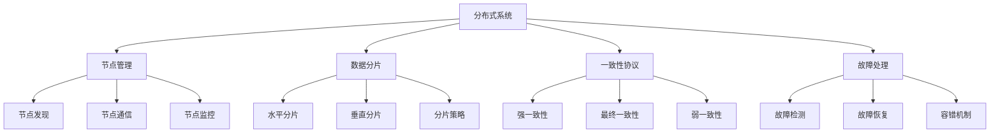

# 分布式系统

## 📖 核心概念

**分布式系统（Distributed System）**是由多个独立的计算机节点通过网络连接协同工作的系统。它通过数据分片、负载均衡、一致性协议等技术，将单机系统的性能瓶颈从O(n)扩展到O(n×m)，是现代大规模系统架构的核心技术。

### 🏗️ 分布式系统的组成要素



## 🔍 分布式系统分类

### 按架构模式分类

| 架构模式 | 特点 | 优点 | 缺点 | 适用场景 |
|----------|------|------|------|----------|
| **客户端-服务器** | 集中式服务 | 简单易用 | 单点故障 | 传统应用 |
| **对等网络** | 去中心化 | 高可用性 | 复杂管理 | 区块链 |
| **微服务** | 服务拆分 | 独立部署 | 网络开销 | 大型应用 |
| **事件驱动** | 异步通信 | 松耦合 | 调试困难 | 实时系统 |

### 按一致性模型分类

| 一致性模型 | 特点 | 优点 | 缺点 | 适用场景 |
|------------|------|------|------|----------|
| **强一致性** | 实时同步 | 数据准确 | 性能差 | 金融系统 |
| **最终一致性** | 异步同步 | 性能好 | 数据延迟 | 社交网络 |
| **弱一致性** | 不保证同步 | 性能最好 | 数据不一致 | 缓存系统 |
| **因果一致性** | 因果顺序 | 平衡性能 | 实现复杂 | 协作系统 |

## 💻 分布式哈希表实现

### 一致性哈希环

```cpp
template<typename K, typename V>
class ConsistentHashRing {
private:
    struct VirtualNode {
        string physicalNode;
        size_t hash;
        
        VirtualNode(const string& node, size_t h) : physicalNode(node), hash(h) {}
        
        bool operator<(const VirtualNode& other) const {
            return hash < other.hash;
        }
    };
    
    set<VirtualNode> virtualNodes;
    unordered_map<string, int> physicalNodes;
    int virtualNodeCount;
    
    // 哈希函数
    size_t hashFunction(const string& key) const {
        return std::hash<string>{}(key);
    }
    
public:
    ConsistentHashRing(int vnc = 150) : virtualNodeCount(vnc) {}
    
    // 添加物理节点
    void addPhysicalNode(const string& nodeId) {
        physicalNodes[nodeId]++;
        
        // 添加虚拟节点
        for (int i = 0; i < virtualNodeCount; i++) {
            string virtualKey = nodeId + "#" + to_string(i);
            size_t hash = hashFunction(virtualKey);
            virtualNodes.insert(VirtualNode(nodeId, hash));
        }
    }
    
    // 移除物理节点
    void removePhysicalNode(const string& nodeId) {
        if (physicalNodes.find(nodeId) == physicalNodes.end()) {
            return;
        }
        
        physicalNodes.erase(nodeId);
        
        // 移除虚拟节点
        auto it = virtualNodes.begin();
        while (it != virtualNodes.end()) {
            if (it->physicalNode == nodeId) {
                it = virtualNodes.erase(it);
            } else {
                ++it;
            }
        }
    }
    
    // 获取数据应该存储的节点
    string getNode(const string& key) const {
        if (virtualNodes.empty()) {
            return "";
        }
        
        size_t keyHash = hashFunction(key);
        
        // 找到第一个hash值大于等于keyHash的虚拟节点
        auto it = virtualNodes.lower_bound(VirtualNode("", keyHash));
        
        if (it == virtualNodes.end()) {
            // 如果没有找到，则使用第一个节点（环形）
            it = virtualNodes.begin();
        }
        
        return it->physicalNode;
    }
    
    // 获取数据分布
    unordered_map<string, int> getDataDistribution(const vector<string>& keys) const {
        unordered_map<string, int> distribution;
        
        for (const string& key : keys) {
            string node = getNode(key);
            distribution[node]++;
        }
        
        return distribution;
    }
    
    // 计算负载均衡度
    double getLoadBalance(const vector<string>& keys) const {
        auto distribution = getDataDistribution(keys);
        
        if (distribution.empty()) {
            return 0.0;
        }
        
        int minLoad = min_element(distribution.begin(), distribution.end(),
            [](const auto& a, const auto& b) { return a.second < b.second; })->second;
        int maxLoad = max_element(distribution.begin(), distribution.end(),
            [](const auto& a, const auto& b) { return a.second < b.second; })->second;
        
        return static_cast<double>(minLoad) / maxLoad;
    }
    
    // 获取节点数量
    int getNodeCount() const {
        return physicalNodes.size();
    }
    
    // 获取虚拟节点数量
    int getVirtualNodeCount() const {
        return virtualNodes.size();
    }
};
```

## 💻 分布式锁实现

### 分布式锁管理器

```cpp
class DistributedLockManager {
private:
    struct LockInfo {
        string lockId;
        string holder;
        chrono::steady_clock::time_point expireTime;
        int version;
        
        LockInfo(const string& id, const string& h, int ver) 
            : lockId(id), holder(h), version(ver) {
            expireTime = chrono::steady_clock::now() + chrono::seconds(30);
        }
        
        bool isExpired() const {
            return chrono::steady_clock::now() > expireTime;
        }
    };
    
    unordered_map<string, LockInfo> locks;
    mutex lockMutex;
    string nodeId;
    
    // 生成唯一锁ID
    string generateLockId() const {
        auto now = chrono::system_clock::now();
        auto time_t = chrono::system_clock::to_time_t(now);
        return to_string(time_t) + "_" + nodeId + "_" + to_string(rand());
    }
    
    // 检查锁是否存在且有效
    bool isLockValid(const string& resource, const string& lockId) const {
        auto it = locks.find(resource);
        if (it != locks.end()) {
            return it->second.lockId == lockId && !it->second.isExpired();
        }
        return false;
    }
    
public:
    DistributedLockManager(const string& id) : nodeId(id) {}
    
    // 尝试获取锁
    string tryLock(const string& resource, int timeoutSeconds = 30) {
        lock_guard<mutex> guard(lockMutex);
        
        auto it = locks.find(resource);
        if (it != locks.end()) {
            if (!it->second.isExpired()) {
                return ""; // 锁已被其他节点持有
            }
            // 锁已过期，移除
            locks.erase(it);
        }
        
        // 创建新锁
        string lockId = generateLockId();
        locks[resource] = LockInfo(lockId, nodeId, 1);
        
        return lockId;
    }
    
    // 释放锁
    bool releaseLock(const string& resource, const string& lockId) {
        lock_guard<mutex> guard(lockMutex);
        
        auto it = locks.find(resource);
        if (it != locks.end() && it->second.lockId == lockId) {
            locks.erase(it);
            return true;
        }
        
        return false;
    }
    
    // 续期锁
    bool renewLock(const string& resource, const string& lockId) {
        lock_guard<mutex> guard(lockMutex);
        
        auto it = locks.find(resource);
        if (it != locks.end() && it->second.lockId == lockId) {
            it->second.expireTime = chrono::steady_clock::now() + chrono::seconds(30);
            it->second.version++;
            return true;
        }
        
        return false;
    }
    
    // 检查锁状态
    bool isLocked(const string& resource) const {
        lock_guard<mutex> guard(lockMutex);
        
        auto it = locks.find(resource);
        if (it != locks.end()) {
            if (it->second.isExpired()) {
                return false;
            }
            return true;
        }
        
        return false;
    }
    
    // 获取锁信息
    string getLockHolder(const string& resource) const {
        lock_guard<mutex> guard(lockMutex);
        
        auto it = locks.find(resource);
        if (it != locks.end() && !it->second.isExpired()) {
            return it->second.holder;
        }
        
        return "";
    }
    
    // 清理过期锁
    void cleanupExpiredLocks() {
        lock_guard<mutex> guard(lockMutex);
        
        auto it = locks.begin();
        while (it != locks.end()) {
            if (it->second.isExpired()) {
                it = locks.erase(it);
            } else {
                ++it;
            }
        }
    }
    
    // 获取所有锁信息
    vector<string> getAllLocks() const {
        lock_guard<mutex> guard(lockMutex);
        
        vector<string> lockList;
        for (const auto& [resource, lockInfo] : locks) {
            if (!lockInfo.isExpired()) {
                lockList.push_back(resource + ":" + lockInfo.holder);
            }
        }
        
        return lockList;
    }
};
```

## 🎯 分布式事务实现

### 两阶段提交协议

```cpp
class TwoPhaseCommit {
private:
    enum class TransactionState {
        INITIAL,
        PREPARED,
        COMMITTED,
        ABORTED
    };
    
    struct Transaction {
        string transactionId;
        TransactionState state;
        vector<string> participants;
        chrono::steady_clock::time_point startTime;
        
        Transaction(const string& id) : transactionId(id), state(TransactionState::INITIAL) {
            startTime = chrono::steady_clock::now();
        }
    };
    
    unordered_map<string, Transaction> transactions;
    mutex transactionMutex;
    string coordinatorId;
    
    // 发送准备消息
    bool sendPrepare(const string& transactionId, const string& participant) {
        // 模拟网络通信
        cout << "Sending PREPARE to " << participant << " for transaction " << transactionId << endl;
        
        // 模拟参与者响应
        // 实际实现中这里会有网络通信
        return true; // 假设总是成功
    }
    
    // 发送提交消息
    bool sendCommit(const string& transactionId, const string& participant) {
        cout << "Sending COMMIT to " << participant << " for transaction " << transactionId << endl;
        return true;
    }
    
    // 发送中止消息
    bool sendAbort(const string& transactionId, const string& participant) {
        cout << "Sending ABORT to " << participant << " for transaction " << transactionId << endl;
        return true;
    }
    
public:
    TwoPhaseCommit(const string& coordinator) : coordinatorId(coordinator) {}
    
    // 开始事务
    string beginTransaction(const vector<string>& participants) {
        string transactionId = "txn_" + to_string(time(nullptr)) + "_" + coordinatorId;
        
        lock_guard<mutex> guard(transactionMutex);
        transactions[transactionId] = Transaction(transactionId);
        transactions[transactionId].participants = participants;
        
        cout << "Started transaction " << transactionId << " with " << participants.size() << " participants" << endl;
        
        return transactionId;
    }
    
    // 准备阶段
    bool prepare(const string& transactionId) {
        lock_guard<mutex> guard(transactionMutex);
        
        auto it = transactions.find(transactionId);
        if (it == transactions.end()) {
            return false;
        }
        
        Transaction& txn = it->second;
        txn.state = TransactionState::PREPARED;
        
        cout << "Phase 1: PREPARE phase for transaction " << transactionId << endl;
        
        // 向所有参与者发送准备消息
        bool allPrepared = true;
        for (const string& participant : txn.participants) {
            if (!sendPrepare(transactionId, participant)) {
                allPrepared = false;
                break;
            }
        }
        
        if (!allPrepared) {
            txn.state = TransactionState::ABORTED;
            cout << "Transaction " << transactionId << " aborted during PREPARE phase" << endl;
            return false;
        }
        
        cout << "All participants prepared for transaction " << transactionId << endl;
        return true;
    }
    
    // 提交阶段
    bool commit(const string& transactionId) {
        lock_guard<mutex> guard(transactionMutex);
        
        auto it = transactions.find(transactionId);
        if (it == transactions.end()) {
            return false;
        }
        
        Transaction& txn = it->second;
        
        if (txn.state != TransactionState::PREPARED) {
            return false;
        }
        
        cout << "Phase 2: COMMIT phase for transaction " << transactionId << endl;
        
        // 向所有参与者发送提交消息
        bool allCommitted = true;
        for (const string& participant : txn.participants) {
            if (!sendCommit(transactionId, participant)) {
                allCommitted = false;
                break;
            }
        }
        
        if (allCommitted) {
            txn.state = TransactionState::COMMITTED;
            cout << "Transaction " << transactionId << " committed successfully" << endl;
        } else {
            txn.state = TransactionState::ABORTED;
            cout << "Transaction " << transactionId << " aborted during COMMIT phase" << endl;
        }
        
        return allCommitted;
    }
    
    // 中止事务
    bool abort(const string& transactionId) {
        lock_guard<mutex> guard(transactionMutex);
        
        auto it = transactions.find(transactionId);
        if (it == transactions.end()) {
            return false;
        }
        
        Transaction& txn = it->second;
        txn.state = TransactionState::ABORTED;
        
        cout << "Aborting transaction " << transactionId << endl;
        
        // 向所有参与者发送中止消息
        for (const string& participant : txn.participants) {
            sendAbort(transactionId, participant);
        }
        
        cout << "Transaction " << transactionId << " aborted" << endl;
        return true;
    }
    
    // 获取事务状态
    TransactionState getTransactionState(const string& transactionId) const {
        lock_guard<mutex> guard(transactionMutex);
        
        auto it = transactions.find(transactionId);
        if (it != transactions.end()) {
            return it->second.state;
        }
        
        return TransactionState::INITIAL;
    }
    
    // 清理完成的事务
    void cleanupCompletedTransactions() {
        lock_guard<mutex> guard(transactionMutex);
        
        auto it = transactions.begin();
        while (it != transactions.end()) {
            if (it->second.state == TransactionState::COMMITTED || 
                it->second.state == TransactionState::ABORTED) {
                it = transactions.erase(it);
            } else {
                ++it;
            }
        }
    }
    
    // 获取活跃事务数量
    int getActiveTransactionCount() const {
        lock_guard<mutex> guard(transactionMutex);
        
        int count = 0;
        for (const auto& [id, txn] : transactions) {
            if (txn.state == TransactionState::INITIAL || txn.state == TransactionState::PREPARED) {
                count++;
            }
        }
        
        return count;
    }
};
```

## 🎯 分布式存储实现

### 分布式存储管理器

```cpp
template<typename K, typename V>
class DistributedStorage {
private:
    struct StorageNode {
        string nodeId;
        string address;
        int port;
        bool isActive;
        unordered_map<K, V> data;
        
        StorageNode(const string& id, const string& addr, int p) 
            : nodeId(id), address(addr), port(p), isActive(true) {}
    };
    
    vector<StorageNode> nodes;
    ConsistentHashRing<K, V> hashRing;
    mutex storageMutex;
    
    // 获取数据存储节点
    string getStorageNode(const K& key) const {
        return hashRing.getNode(to_string(std::hash<K>{}(key)));
    }
    
    // 查找节点
    StorageNode* findNode(const string& nodeId) {
        for (auto& node : nodes) {
            if (node.nodeId == nodeId) {
                return &node;
            }
        }
        return nullptr;
    }
    
    // 复制数据到其他节点
    void replicateData(const K& key, const V& value, const string& primaryNode) {
        // 简化的复制策略：复制到下一个节点
        for (auto& node : nodes) {
            if (node.nodeId != primaryNode && node.isActive) {
                node.data[key] = value;
                break;
            }
        }
    }
    
public:
    DistributedStorage() {}
    
    // 添加存储节点
    void addNode(const string& nodeId, const string& address, int port) {
        lock_guard<mutex> guard(storageMutex);
        
        nodes.emplace_back(nodeId, address, port);
        hashRing.addPhysicalNode(nodeId);
        
        cout << "Added storage node: " << nodeId << " at " << address << ":" << port << endl;
    }
    
    // 移除存储节点
    void removeNode(const string& nodeId) {
        lock_guard<mutex> guard(storageMutex);
        
        // 标记节点为非活跃
        StorageNode* node = findNode(nodeId);
        if (node) {
            node->isActive = false;
        }
        
        hashRing.removePhysicalNode(nodeId);
        
        cout << "Removed storage node: " << nodeId << endl;
    }
    
    // 存储数据
    bool put(const K& key, const V& value) {
        lock_guard<mutex> guard(storageMutex);
        
        string primaryNode = getStorageNode(key);
        StorageNode* node = findNode(primaryNode);
        
        if (!node || !node->isActive) {
            return false;
        }
        
        node->data[key] = value;
        
        // 复制数据到其他节点
        replicateData(key, value, primaryNode);
        
        cout << "Stored key " << key << " on node " << primaryNode << endl;
        return true;
    }
    
    // 获取数据
    V* get(const K& key) {
        lock_guard<mutex> guard(storageMutex);
        
        string primaryNode = getStorageNode(key);
        StorageNode* node = findNode(primaryNode);
        
        if (!node || !node->isActive) {
            return nullptr;
        }
        
        auto it = node->data.find(key);
        if (it != node->data.end()) {
            cout << "Retrieved key " << key << " from node " << primaryNode << endl;
            return &it->second;
        }
        
        return nullptr;
    }
    
    // 删除数据
    bool remove(const K& key) {
        lock_guard<mutex> guard(storageMutex);
        
        string primaryNode = getStorageNode(key);
        StorageNode* node = findNode(primaryNode);
        
        if (!node || !node->isActive) {
            return false;
        }
        
        auto it = node->data.find(key);
        if (it != node->data.end()) {
            node->data.erase(it);
            
            // 从其他节点也删除
            for (auto& otherNode : nodes) {
                if (otherNode.nodeId != primaryNode && otherNode.isActive) {
                    otherNode.data.erase(key);
                }
            }
            
            cout << "Removed key " << key << " from node " << primaryNode << endl;
            return true;
        }
        
        return false;
    }
    
    // 获取数据分布
    unordered_map<string, int> getDataDistribution() const {
        lock_guard<mutex> guard(storageMutex);
        
        unordered_map<string, int> distribution;
        for (const auto& node : nodes) {
            if (node.isActive) {
                distribution[node.nodeId] = node.data.size();
            }
        }
        
        return distribution;
    }
    
    // 获取节点状态
    vector<string> getNodeStatus() const {
        lock_guard<mutex> guard(storageMutex);
        
        vector<string> status;
        for (const auto& node : nodes) {
            string statusStr = node.nodeId + ": " + (node.isActive ? "ACTIVE" : "INACTIVE") + 
                              " (" + to_string(node.data.size()) + " items)";
            status.push_back(statusStr);
        }
        
        return status;
    }
    
    // 获取总数据量
    int getTotalDataCount() const {
        lock_guard<mutex> guard(storageMutex);
        
        int total = 0;
        for (const auto& node : nodes) {
            if (node.isActive) {
                total += node.data.size();
            }
        }
        
        return total;
    }
    
    // 检查数据一致性
    bool checkConsistency() const {
        lock_guard<mutex> guard(storageMutex);
        
        // 简化的一致性检查
        // 实际实现会更复杂
        for (const auto& node : nodes) {
            if (!node.isActive) {
                continue;
            }
            
            for (const auto& [key, value] : node.data) {
                // 检查数据是否在其他节点也存在
                bool foundInOther = false;
                for (const auto& otherNode : nodes) {
                    if (otherNode.nodeId != node.nodeId && otherNode.isActive) {
                        if (otherNode.data.find(key) != otherNode.data.end()) {
                            foundInOther = true;
                            break;
                        }
                    }
                }
                
                if (!foundInOther) {
                    return false;
                }
            }
        }
        
        return true;
    }
};
```

## ⚡ 复杂度分析

### 时间复杂度

| 操作 | 一致性哈希 | 分布式锁 | 两阶段提交 | 分布式存储 |
|------|------------|----------|------------|------------|
| **查找** | O(log n) | O(1) | O(1) | O(log n) |
| **插入** | O(log n) | O(1) | O(n) | O(log n) |
| **删除** | O(log n) | O(1) | O(n) | O(log n) |
| **同步** | O(n) | O(1) | O(n) | O(n) |

### 空间复杂度

| 组件 | 空间复杂度 | 说明 |
|------|------------|------|
| **一致性哈希** | O(n×m) | n个节点，m个虚拟节点 |
| **分布式锁** | O(k) | k个锁资源 |
| **两阶段提交** | O(t) | t个事务 |
| **分布式存储** | O(n×d) | n个节点，d个数据项 |

### 性能特点

| 特点 | 描述 | 影响 |
|------|------|------|
| **可扩展性** | 水平扩展能力 | 系统规模 |
| **一致性** | 数据一致性保证 | 系统可靠性 |
| **可用性** | 系统可用性 | 服务质量 |
| **分区容错** | 网络分区处理 | 系统稳定性 |

## 🎓 学习要点总结

### 核心理解

1. **分布式原理**：理解分布式系统的基本原理
2. **一致性协议**：掌握不同一致性协议的特点
3. **故障处理**：理解分布式系统的故障处理机制
4. **性能优化**：掌握分布式系统的性能优化方法

### 实践要点

1. **系统设计**：设计可扩展的分布式系统
2. **协议实现**：实现分布式一致性协议
3. **故障处理**：处理分布式系统的各种故障
4. **性能调优**：优化分布式系统的性能

### 应用思维

1. **架构设计**：将分布式技术应用到系统架构
2. **问题解决**：使用分布式技术解决大规模问题
3. **系统优化**：优化分布式系统的性能和可靠性
4. **最佳实践**：遵循分布式系统设计的最佳实践

---

**相关链接：**
- [[05-高级结构/01-哈希宇宙/01-哈希表HashTable详解|哈希表HashTable详解]] - 分布式哈希表的基础
- [[06-应用实战/03-缓存系统/01-缓存策略|缓存策略]] - 分布式缓存的应用
- [[06-应用实战/04-网络应用/02-负载均衡|负载均衡]] - 分布式系统的负载均衡
- [[06-应用实战/01-数据库王国/03-事务管理|事务管理]] - 分布式事务的管理
