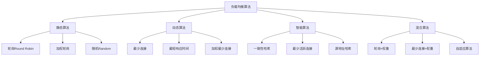

# 负载均衡算法

## 📖 核心概念

**负载均衡算法**是分布式系统中将请求分发到多个服务器节点的策略。通过合理的负载分配，可以提高系统的吞吐量、可用性和响应时间，确保系统的高效运行。

### 🏗️ 负载均衡算法分类



## 🔧 负载均衡算法实现

### 轮询算法

```cpp
class RoundRobinLoadBalancer {
private:
    vector<string> servers;
    int currentIndex;
    mutex mtx;
    
public:
    RoundRobinLoadBalancer() : currentIndex(0) {}
    
    // 添加服务器
    void addServer(const string& server) {
        lock_guard<mutex> lock(mtx);
        servers.push_back(server);
        cout << "Added server: " << server << endl;
    }
    
    // 移除服务器
    void removeServer(const string& server) {
        lock_guard<mutex> lock(mtx);
        auto it = find(servers.begin(), servers.end(), server);
        if (it != servers.end()) {
            servers.erase(it);
            cout << "Removed server: " << server << endl;
        }
    }
    
    // 获取下一个服务器
    string getNextServer() {
        lock_guard<mutex> lock(mtx);
        
        if (servers.empty()) {
            cout << "No servers available" << endl;
            return "";
        }
        
        string server = servers[currentIndex];
        currentIndex = (currentIndex + 1) % servers.size();
        
        cout << "Selected server: " << server << " (index: " << currentIndex << ")" << endl;
        return server;
    }
    
    // 显示服务器列表
    void displayServers() {
        lock_guard<mutex> lock(mtx);
        cout << "Round Robin Servers:" << endl;
        cout << "==================" << endl;
        for (size_t i = 0; i < servers.size(); i++) {
            cout << "  " << i << ": " << servers[i] << endl;
        }
        cout << "Current index: " << currentIndex << endl;
    }
};
```

### 加权轮询算法

```cpp
class WeightedRoundRobinLoadBalancer {
private:
    struct Server {
        string name;
        int weight;
        int currentWeight;
        int effectiveWeight;
        
        Server(const string& n, int w) : name(n), weight(w), currentWeight(0), effectiveWeight(w) {}
    };
    
    vector<Server> servers;
    mutex mtx;
    
public:
    WeightedRoundRobinLoadBalancer() {}
    
    // 添加服务器
    void addServer(const string& server, int weight) {
        lock_guard<mutex> lock(mtx);
        servers.push_back(Server(server, weight));
        cout << "Added server: " << server << " (weight: " << weight << ")" << endl;
    }
    
    // 移除服务器
    void removeServer(const string& server) {
        lock_guard<mutex> lock(mtx);
        auto it = find_if(servers.begin(), servers.end(), 
                         [&server](const Server& s) { return s.name == server; });
        if (it != servers.end()) {
            servers.erase(it);
            cout << "Removed server: " << server << endl;
        }
    }
    
    // 获取下一个服务器
    string getNextServer() {
        lock_guard<mutex> lock(mtx);
        
        if (servers.empty()) {
            cout << "No servers available" << endl;
            return "";
        }
        
        // 计算总权重
        int totalWeight = 0;
        for (const Server& server : servers) {
            totalWeight += server.effectiveWeight;
        }
        
        // 选择服务器
        Server* selectedServer = nullptr;
        int maxCurrentWeight = 0;
        
        for (Server& server : servers) {
            server.currentWeight += server.effectiveWeight;
            
            if (server.currentWeight > maxCurrentWeight) {
                maxCurrentWeight = server.currentWeight;
                selectedServer = &server;
            }
        }
        
        if (selectedServer) {
            selectedServer->currentWeight -= totalWeight;
            cout << "Selected server: " << selectedServer->name 
                 << " (weight: " << selectedServer->weight 
                 << ", current: " << selectedServer->currentWeight << ")" << endl;
            return selectedServer->name;
        }
        
        return "";
    }
    
    // 显示服务器列表
    void displayServers() {
        lock_guard<mutex> lock(mtx);
        cout << "Weighted Round Robin Servers:" << endl;
        cout << "============================" << endl;
        for (const Server& server : servers) {
            cout << "  " << server.name << ": weight=" << server.weight 
                 << ", current=" << server.currentWeight 
                 << ", effective=" << server.effectiveWeight << endl;
        }
    }
};
```

### 最少连接算法

```cpp
class LeastConnectionsLoadBalancer {
private:
    struct Server {
        string name;
        int connectionCount;
        int maxConnections;
        bool isHealthy;
        
        Server(const string& n, int max) : name(n), connectionCount(0), maxConnections(max), isHealthy(true) {}
    };
    
    vector<Server> servers;
    mutex mtx;
    
public:
    LeastConnectionsLoadBalancer() {}
    
    // 添加服务器
    void addServer(const string& server, int maxConnections = 100) {
        lock_guard<mutex> lock(mtx);
        servers.push_back(Server(server, maxConnections));
        cout << "Added server: " << server << " (max connections: " << maxConnections << ")" << endl;
    }
    
    // 移除服务器
    void removeServer(const string& server) {
        lock_guard<mutex> lock(mtx);
        auto it = find_if(servers.begin(), servers.end(), 
                         [&server](const Server& s) { return s.name == server; });
        if (it != servers.end()) {
            servers.erase(it);
            cout << "Removed server: " << server << endl;
        }
    }
    
    // 获取下一个服务器
    string getNextServer() {
        lock_guard<mutex> lock(mtx);
        
        if (servers.empty()) {
            cout << "No servers available" << endl;
            return "";
        }
        
        // 找到连接数最少的健康服务器
        Server* selectedServer = nullptr;
        int minConnections = INT_MAX;
        
        for (Server& server : servers) {
            if (server.isHealthy && server.connectionCount < server.maxConnections) {
                if (server.connectionCount < minConnections) {
                    minConnections = server.connectionCount;
                    selectedServer = &server;
                }
            }
        }
        
        if (selectedServer) {
            selectedServer->connectionCount++;
            cout << "Selected server: " << selectedServer->name 
                 << " (connections: " << selectedServer->connectionCount << ")" << endl;
            return selectedServer->name;
        }
        
        cout << "No healthy servers available" << endl;
        return "";
    }
    
    // 释放连接
    void releaseConnection(const string& server) {
        lock_guard<mutex> lock(mtx);
        auto it = find_if(servers.begin(), servers.end(), 
                         [&server](const Server& s) { return s.name == server; });
        if (it != servers.end() && it->connectionCount > 0) {
            it->connectionCount--;
            cout << "Released connection from server: " << server 
                 << " (remaining: " << it->connectionCount << ")" << endl;
        }
    }
    
    // 设置服务器健康状态
    void setServerHealth(const string& server, bool isHealthy) {
        lock_guard<mutex> lock(mtx);
        auto it = find_if(servers.begin(), servers.end(), 
                         [&server](const Server& s) { return s.name == server; });
        if (it != servers.end()) {
            it->isHealthy = isHealthy;
            cout << "Set server " << server << " health to: " << (isHealthy ? "healthy" : "unhealthy") << endl;
        }
    }
    
    // 显示服务器列表
    void displayServers() {
        lock_guard<mutex> lock(mtx);
        cout << "Least Connections Servers:" << endl;
        cout << "========================" << endl;
        for (const Server& server : servers) {
            cout << "  " << server.name << ": connections=" << server.connectionCount 
                 << "/" << server.maxConnections 
                 << ", healthy=" << (server.isHealthy ? "yes" : "no") << endl;
        }
    }
};
```

### 一致性哈希算法

```cpp
class ConsistentHashLoadBalancer {
private:
    struct VirtualNode {
        string physicalServer;
        int replicaId;
        uint32_t hash;
        
        VirtualNode(const string& server, int replica, uint32_t h) 
            : physicalServer(server), replicaId(replica), hash(h) {}
    };
    
    map<uint32_t, VirtualNode> ring;
    map<string, int> serverReplicaCount;
    int defaultReplicas;
    
    // 计算哈希值
    uint32_t hash(const string& key) {
        uint32_t h = 0;
        for (char c : key) {
            h = h * 31 + c;
        }
        return h;
    }
    
public:
    ConsistentHashLoadBalancer(int replicas = 150) : defaultReplicas(replicas) {}
    
    // 添加服务器
    void addServer(const string& server) {
        addServer(server, defaultReplicas);
    }
    
    void addServer(const string& server, int replicas) {
        serverReplicaCount[server] = replicas;
        
        for (int i = 0; i < replicas; i++) {
            string virtualNodeId = server + ":" + to_string(i);
            uint32_t hashValue = hash(virtualNodeId);
            
            VirtualNode vnode(server, i, hashValue);
            ring[hashValue] = vnode;
            
            cout << "Added virtual node: " << virtualNodeId << " (hash: " << hashValue << ")" << endl;
        }
        
        cout << "Added server: " << server << " with " << replicas << " replicas" << endl;
    }
    
    // 移除服务器
    void removeServer(const string& server) {
        auto it = serverReplicaCount.find(server);
        if (it == serverReplicaCount.end()) {
            cout << "Server " << server << " not found" << endl;
            return;
        }
        
        int replicas = it->second;
        
        for (int i = 0; i < replicas; i++) {
            string virtualNodeId = server + ":" + to_string(i);
            uint32_t hashValue = hash(virtualNodeId);
            
            auto ringIt = ring.find(hashValue);
            if (ringIt != ring.end()) {
                ring.erase(ringIt);
                cout << "Removed virtual node: " << virtualNodeId << endl;
            }
        }
        
        serverReplicaCount.erase(it);
        cout << "Removed server: " << server << endl;
    }
    
    // 获取服务器
    string getServer(const string& key) {
        if (ring.empty()) {
            cout << "No servers available" << endl;
            return "";
        }
        
        uint32_t keyHash = hash(key);
        
        // 找到第一个大于等于keyHash的节点
        auto it = ring.lower_bound(keyHash);
        
        if (it == ring.end()) {
            // 如果没有找到，使用第一个节点（环形）
            it = ring.begin();
        }
        
        string server = it->second.physicalServer;
        cout << "Key " << key << " (hash: " << keyHash << ") -> Server " << server << endl;
        return server;
    }
    
    // 显示哈希环
    void displayRing() {
        cout << "Consistent Hash Ring:" << endl;
        cout << "===================" << endl;
        
        cout << "Physical servers: " << serverReplicaCount.size() << endl;
        for (const auto& pair : serverReplicaCount) {
            cout << "  " << pair.first << ": " << pair.second << " replicas" << endl;
        }
        
        cout << "Virtual nodes: " << ring.size() << endl;
        for (const auto& pair : ring) {
            const VirtualNode& vnode = pair.second;
            cout << "  Hash " << pair.first << " -> " << vnode.physicalServer 
                 << ":" << vnode.replicaId << endl;
        }
    }
    
    // 分析负载均衡
    void analyzeLoadBalance() {
        cout << "Load Balance Analysis:" << endl;
        cout << "====================" << endl;
        
        if (ring.empty()) {
            cout << "No servers available" << endl;
            return;
        }
        
        map<string, int> serverLoad;
        
        // 计算每个服务器的负载
        for (const auto& pair : ring) {
            const VirtualNode& vnode = pair.second;
            serverLoad[vnode.physicalServer]++;
        }
        
        cout << "Server load distribution:" << endl;
        for (const auto& pair : serverLoad) {
            cout << "  " << pair.first << ": " << pair.second << " virtual nodes" << endl;
        }
        
        // 计算负载均衡指标
        if (!serverLoad.empty()) {
            int totalLoad = 0;
            int minLoad = INT_MAX;
            int maxLoad = 0;
            
            for (const auto& pair : serverLoad) {
                totalLoad += pair.second;
                minLoad = min(minLoad, pair.second);
                maxLoad = max(maxLoad, pair.second);
            }
            
            double averageLoad = (double)totalLoad / serverLoad.size();
            double loadVariance = 0.0;
            
            for (const auto& pair : serverLoad) {
                double diff = pair.second - averageLoad;
                loadVariance += diff * diff;
            }
            loadVariance /= serverLoad.size();
            
            cout << "Load statistics:" << endl;
            cout << "  Average load: " << averageLoad << endl;
            cout << "  Min load: " << minLoad << endl;
            cout << "  Max load: " << maxLoad << endl;
            cout << "  Load variance: " << loadVariance << endl;
            cout << "  Load balance ratio: " << (double)minLoad / maxLoad << endl;
        }
    }
};
```

### 自适应负载均衡算法

```cpp
class AdaptiveLoadBalancer {
private:
    struct ServerMetrics {
        string name;
        int connectionCount;
        double responseTime;
        int errorCount;
        int totalRequests;
        bool isHealthy;
        chrono::time_point<chrono::high_resolution_clock> lastUpdate;
        
        ServerMetrics(const string& n) : name(n), connectionCount(0), responseTime(0.0), 
                                         errorCount(0), totalRequests(0), isHealthy(true) {
            lastUpdate = chrono::high_resolution_clock::now();
        }
        
        double getSuccessRate() const {
            return totalRequests > 0 ? (double)(totalRequests - errorCount) / totalRequests : 1.0;
        }
        
        double getScore() const {
            // 综合评分：成功率 + 响应时间 + 连接数
            double successRate = getSuccessRate();
            double responseScore = max(0.0, 1.0 - responseTime / 1000.0); // 假设1秒为基准
            double connectionScore = max(0.0, 1.0 - (double)connectionCount / 100.0); // 假设100连接为基准
            
            return successRate * 0.5 + responseScore * 0.3 + connectionScore * 0.2;
        }
    };
    
    vector<ServerMetrics> servers;
    mutex mtx;
    
public:
    AdaptiveLoadBalancer() {}
    
    // 添加服务器
    void addServer(const string& server) {
        lock_guard<mutex> lock(mtx);
        servers.push_back(ServerMetrics(server));
        cout << "Added server: " << server << endl;
    }
    
    // 移除服务器
    void removeServer(const string& server) {
        lock_guard<mutex> lock(mtx);
        auto it = find_if(servers.begin(), servers.end(), 
                         [&server](const ServerMetrics& s) { return s.name == server; });
        if (it != servers.end()) {
            servers.erase(it);
            cout << "Removed server: " << server << endl;
        }
    }
    
    // 获取下一个服务器
    string getNextServer() {
        lock_guard<mutex> lock(mtx);
        
        if (servers.empty()) {
            cout << "No servers available" << endl;
            return "";
        }
        
        // 找到评分最高的健康服务器
        ServerMetrics* selectedServer = nullptr;
        double maxScore = -1.0;
        
        for (ServerMetrics& server : servers) {
            if (server.isHealthy) {
                double score = server.getScore();
                if (score > maxScore) {
                    maxScore = score;
                    selectedServer = &server;
                }
            }
        }
        
        if (selectedServer) {
            selectedServer->connectionCount++;
            selectedServer->totalRequests++;
            selectedServer->lastUpdate = chrono::high_resolution_clock::now();
            
            cout << "Selected server: " << selectedServer->name 
                 << " (score: " << selectedServer->getScore() 
                 << ", connections: " << selectedServer->connectionCount << ")" << endl;
            return selectedServer->name;
        }
        
        cout << "No healthy servers available" << endl;
        return "";
    }
    
    // 更新服务器指标
    void updateServerMetrics(const string& server, double responseTime, bool success) {
        lock_guard<mutex> lock(mtx);
        auto it = find_if(servers.begin(), servers.end(), 
                         [&server](const ServerMetrics& s) { return s.name == server; });
        if (it != servers.end()) {
            it->responseTime = responseTime;
            if (!success) {
                it->errorCount++;
            }
            it->lastUpdate = chrono::high_resolution_clock::now();
            
            cout << "Updated metrics for " << server << ": responseTime=" << responseTime 
                 << ", success=" << (success ? "yes" : "no") << endl;
        }
    }
    
    // 释放连接
    void releaseConnection(const string& server) {
        lock_guard<mutex> lock(mtx);
        auto it = find_if(servers.begin(), servers.end(), 
                         [&server](const ServerMetrics& s) { return s.name == server; });
        if (it != servers.end() && it->connectionCount > 0) {
            it->connectionCount--;
            cout << "Released connection from server: " << server 
                 << " (remaining: " << it->connectionCount << ")" << endl;
        }
    }
    
    // 设置服务器健康状态
    void setServerHealth(const string& server, bool isHealthy) {
        lock_guard<mutex> lock(mtx);
        auto it = find_if(servers.begin(), servers.end(), 
                         [&server](const ServerMetrics& s) { return s.name == server; });
        if (it != servers.end()) {
            it->isHealthy = isHealthy;
            cout << "Set server " << server << " health to: " << (isHealthy ? "healthy" : "unhealthy") << endl;
        }
    }
    
    // 显示服务器列表
    void displayServers() {
        lock_guard<mutex> lock(mtx);
        cout << "Adaptive Load Balancer Servers:" << endl;
        cout << "=============================" << endl;
        for (const ServerMetrics& server : servers) {
            cout << "  " << server.name << ": score=" << server.getScore() 
                 << ", connections=" << server.connectionCount 
                 << ", responseTime=" << server.responseTime 
                 << ", successRate=" << server.getSuccessRate() 
                 << ", healthy=" << (server.isHealthy ? "yes" : "no") << endl;
        }
    }
};
```

## 🎯 负载均衡算法应用

### 实际应用场景

```cpp
class LoadBalancerApplications {
public:
    static void demonstrateApplications() {
        cout << "Load Balancer Applications:" << endl;
        cout << "=========================" << endl;
        
        cout << "1. Web服务器集群:" << endl;
        cout << "   - 轮询算法: 简单均衡" << endl;
        cout << "   - 加权轮询: 考虑服务器性能" << endl;
        cout << "   - 最少连接: 动态负载均衡" << endl;
        
        cout << "2. 数据库集群:" << endl;
        cout << "   - 读写分离: 提高性能" << endl;
        cout << "   - 一致性哈希: 数据分布" << endl;
        cout << "   - 自适应算法: 智能调度" << endl;
        
        cout << "3. 微服务架构:" << endl;
        cout << "   - 服务发现: 动态注册" << endl;
        cout << "   - 健康检查: 故障转移" << endl;
        cout << "   - 熔断机制: 保护系统" << endl;
        
        cout << "4. CDN网络:" << endl;
        cout << "   - 地理位置: 就近访问" << endl;
        cout << "   - 内容分发: 缓存策略" << endl;
        cout << "   - 负载均衡: 流量分配" << endl;
    }
    
    static void analyzePerformance() {
        cout << "Load Balancer Performance Analysis:" << endl;
        cout << "=================================" << endl;
        
        cout << "1. 算法性能:" << endl;
        cout << "   - 轮询算法: 简单高效，O(1)" << endl;
        cout << "   - 加权轮询: 考虑权重，O(n)" << endl;
        cout << "   - 最少连接: 动态调整，O(n)" << endl;
        cout << "   - 一致性哈希: 分布均匀，O(log n)" << endl;
        cout << endl;
        
        cout << "2. 负载均衡效果:" << endl;
        cout << "   - 轮询算法: 均匀分布" << endl;
        cout << "   - 加权轮询: 按权重分布" << endl;
        cout << "   - 最少连接: 动态均衡" << endl;
        cout << "   - 一致性哈希: 稳定分布" << endl;
        cout << endl;
        
        cout << "3. 适用场景:" << endl;
        cout << "   - 轮询算法: 服务器性能相近" << endl;
        cout << "   - 加权轮询: 服务器性能不同" << endl;
        cout << "   - 最少连接: 连接密集型应用" << endl;
        cout << "   - 一致性哈希: 需要会话保持" << endl;
    }
    
    static void selectLoadBalancerAlgorithm(bool needsSessionAffinity, bool needsDynamicLoad, bool needsHighPerformance) {
        cout << "Load Balancer Algorithm Selection:" << endl;
        cout << "=================================" << endl;
        
        cout << "Needs session affinity: " << (needsSessionAffinity ? "Yes" : "No") << endl;
        cout << "Needs dynamic load balancing: " << (needsDynamicLoad ? "Yes" : "No") << endl;
        cout << "Needs high performance: " << (needsHighPerformance ? "Yes" : "No") << endl;
        
        cout << "Recommendation:" << endl;
        
        if (needsSessionAffinity) {
            cout << "Use consistent hash algorithm (session affinity)" << endl;
        } else if (needsDynamicLoad) {
            cout << "Use least connections or adaptive algorithm (dynamic load)" << endl;
        } else if (needsHighPerformance) {
            cout << "Use round robin algorithm (high performance)" << endl;
        } else {
            cout << "Use weighted round robin algorithm (balanced)" << endl;
        }
    }
};
```

## 📊 负载均衡算法分析

### 性能分析

```cpp
class LoadBalancerAnalysis {
public:
    static void analyzePerformance() {
        cout << "Load Balancer Performance Analysis:" << endl;
        cout << "=================================" << endl;
        
        cout << "1. 时间复杂度:" << endl;
        cout << "   - 轮询算法: O(1)" << endl;
        cout << "   - 加权轮询: O(n)" << endl;
        cout << "   - 最少连接: O(n)" << endl;
        cout << "   - 一致性哈希: O(log n)" << endl;
        cout << "   - 自适应算法: O(n)" << endl;
        
        cout << "2. 空间复杂度:" << endl;
        cout << "   - 轮询算法: O(n)" << endl;
        cout << "   - 加权轮询: O(n)" << endl;
        cout << "   - 最少连接: O(n)" << endl;
        cout << "   - 一致性哈希: O(n*r)" << endl;
        cout << "   - 自适应算法: O(n)" << endl;
        
        cout << "3. 负载均衡效果:" << endl;
        cout << "   - 轮询算法: 均匀分布" << endl;
        cout << "   - 加权轮询: 按权重分布" << endl;
        cout << "   - 最少连接: 动态均衡" << endl;
        cout << "   - 一致性哈希: 稳定分布" << endl;
        cout << "   - 自适应算法: 智能均衡" << endl;
    }
    
    static void analyzeSpaceComplexity() {
        cout << "Load Balancer Space Complexity Analysis:" << endl;
        cout << "=====================================" << endl;
        
        cout << "1. 存储开销:" << endl;
        cout << "   - 服务器列表: O(n)" << endl;
        cout << "   - 权重信息: O(n)" << endl;
        cout << "   - 连接计数: O(n)" << endl;
        cout << "   - 哈希环: O(n*r)" << endl;
        cout << "   - 指标数据: O(n)" << endl;
        
        cout << "2. 内存使用:" << endl;
        cout << "   - 轮询算法: 最低" << endl;
        cout << "   - 加权轮询: 低" << endl;
        cout << "   - 最少连接: 低" << endl;
        cout << "   - 一致性哈希: 中等" << endl;
        cout << "   - 自适应算法: 高" << endl;
        
        cout << "3. 扩展性:" << endl;
        cout << "   - 轮询算法: 好" << endl;
        cout << "   - 加权轮询: 好" << endl;
        cout << "   - 最少连接: 好" << endl;
        cout << "   - 一致性哈希: 很好" << endl;
        cout << "   - 自适应算法: 好" << endl;
    }
    
    static void analyzeTimeComplexity() {
        cout << "Load Balancer Time Complexity Analysis:" << endl;
        cout << "=====================================" << endl;
        
        cout << "1. 选择服务器:" << endl;
        cout << "   - 轮询算法: O(1)" << endl;
        cout << "   - 加权轮询: O(n)" << endl;
        cout << "   - 最少连接: O(n)" << endl;
        cout << "   - 一致性哈希: O(log n)" << endl;
        cout << "   - 自适应算法: O(n)" << endl;
        
        cout << "2. 更新指标:" << endl;
        cout << "   - 轮询算法: O(1)" << endl;
        cout << "   - 加权轮询: O(1)" << endl;
        cout << "   - 最少连接: O(1)" << endl;
        cout << "   - 一致性哈希: O(1)" << endl;
        cout << "   - 自适应算法: O(1)" << endl;
        
        cout << "3. 添加/移除服务器:" << endl;
        cout << "   - 轮询算法: O(1)" << endl;
        cout << "   - 加权轮询: O(1)" << endl;
        cout << "   - 最少连接: O(1)" << endl;
        cout << "   - 一致性哈希: O(r)" << endl;
        cout << "   - 自适应算法: O(1)" << endl;
    }
};
```

## 🎮 负载均衡算法测试

### 1. 基础功能测试

```cpp
class LoadBalancerTest {
public:
    static void testRoundRobin() {
        cout << "Testing Round Robin Load Balancer:" << endl;
        cout << "=================================" << endl;
        
        RoundRobinLoadBalancer lb;
        
        // 添加服务器
        lb.addServer("server1");
        lb.addServer("server2");
        lb.addServer("server3");
        
        // 测试负载均衡
        for (int i = 0; i < 10; i++) {
            lb.getNextServer();
        }
        
        lb.displayServers();
    }
    
    static void testWeightedRoundRobin() {
        cout << "Testing Weighted Round Robin Load Balancer:" << endl;
        cout << "=========================================" << endl;
        
        WeightedRoundRobinLoadBalancer lb;
        
        // 添加服务器
        lb.addServer("server1", 3);
        lb.addServer("server2", 2);
        lb.addServer("server3", 1);
        
        // 测试负载均衡
        for (int i = 0; i < 12; i++) {
            lb.getNextServer();
        }
        
        lb.displayServers();
    }
    
    static void testLeastConnections() {
        cout << "Testing Least Connections Load Balancer:" << endl;
        cout << "=====================================" << endl;
        
        LeastConnectionsLoadBalancer lb;
        
        // 添加服务器
        lb.addServer("server1", 5);
        lb.addServer("server2", 3);
        lb.addServer("server3", 2);
        
        // 测试负载均衡
        for (int i = 0; i < 8; i++) {
            lb.getNextServer();
        }
        
        // 释放一些连接
        lb.releaseConnection("server1");
        lb.releaseConnection("server2");
        
        lb.displayServers();
    }
    
    static void testConsistentHash() {
        cout << "Testing Consistent Hash Load Balancer:" << endl;
        cout << "====================================" << endl;
        
        ConsistentHashLoadBalancer lb(3);
        
        // 添加服务器
        lb.addServer("server1");
        lb.addServer("server2");
        lb.addServer("server3");
        
        // 测试负载均衡
        vector<string> keys = {"key1", "key2", "key3", "key4", "key5"};
        for (const string& key : keys) {
            lb.getServer(key);
        }
        
        lb.displayRing();
        lb.analyzeLoadBalance();
    }
    
    static void testAdaptiveLoadBalancer() {
        cout << "Testing Adaptive Load Balancer:" << endl;
        cout << "=============================" << endl;
        
        AdaptiveLoadBalancer lb;
        
        // 添加服务器
        lb.addServer("server1");
        lb.addServer("server2");
        lb.addServer("server3");
        
        // 测试负载均衡
        for (int i = 0; i < 5; i++) {
            lb.getNextServer();
        }
        
        // 更新服务器指标
        lb.updateServerMetrics("server1", 100.0, true);
        lb.updateServerMetrics("server2", 200.0, false);
        lb.updateServerMetrics("server3", 50.0, true);
        
        lb.displayServers();
    }
    
    static void testApplications() {
        cout << "Testing Applications:" << endl;
        cout << "==================" << endl;
        
        LoadBalancerApplications::demonstrateApplications();
        LoadBalancerApplications::analyzePerformance();
        LoadBalancerApplications::selectLoadBalancerAlgorithm(false, true, false);
    }
    
    static void testAnalysis() {
        cout << "Testing Analysis:" << endl;
        cout << "===============" << endl;
        
        LoadBalancerAnalysis::analyzePerformance();
        LoadBalancerAnalysis::analyzeSpaceComplexity();
        LoadBalancerAnalysis::analyzeTimeComplexity();
    }
};
```

## 🔗 相关链接

- [[01-网络应用|网络应用]]
- [[02-路由算法实现|路由算法实现]]
- [[03-CDN加速技术|CDN加速技术]]

## 💡 负载均衡算法要点

1. **轮询算法**: 简单高效，适合服务器性能相近
2. **加权轮询**: 考虑服务器性能差异
3. **最少连接**: 动态负载均衡，适合连接密集型应用
4. **一致性哈希**: 稳定分布，支持会话保持

---

*📝 负载均衡算法提示：选择合适的负载均衡算法需要根据应用场景的特点，考虑性能、稳定性和功能需求*
