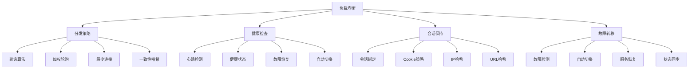

# 负载均衡

## 📖 核心概念

**负载均衡**是分布式系统中的核心技术，通过智能的请求分发策略，将用户请求均匀分配到多个服务器节点，提高系统的可用性、性能和扩展性。负载均衡算法和策略的选择直接影响系统的整体性能和用户体验。

### 🏗️ 负载均衡的组成要素



## 🔍 负载均衡策略

### 分发算法

| 算法 | 特点 | 优势 | 劣势 | 适用场景 |
|------|------|------|------|----------|
| **轮询** | 依次分发请求 | 实现简单 | 不考虑服务器状态 | 服务器性能相近 |
| **加权轮询** | 按权重分发 | 考虑服务器性能 | 权重设置复杂 | 服务器性能不同 |
| **最少连接** | 选择连接数最少的服务器 | 负载均衡好 | 实现复杂 | 长连接场景 |
| **一致性哈希** | 基于哈希值分发 | 扩展性好 | 实现复杂 | 分布式缓存 |

### 健康检查

| 检查方式 | 特点 | 优势 | 劣势 | 适用场景 |
|----------|------|------|------|----------|
| **HTTP检查** | 发送HTTP请求 | 检查应用层 | 开销较大 | Web应用 |
| **TCP检查** | 检查TCP连接 | 开销小 | 检查不全面 | 基础服务 |
| **ICMP检查** | 发送ping请求 | 开销最小 | 检查最基础 | 网络层检查 |
| **自定义检查** | 自定义检查逻辑 | 灵活性高 | 实现复杂 | 特殊需求 |

## 💻 负载均衡实现

### 负载均衡器

```cpp
// 负载均衡器
class LoadBalancer {
private:
    struct Server {
        string id;
        string host;
        int port;
        int weight;
        int currentConnections;
        int totalRequests;
        bool isHealthy;
        chrono::system_clock::time_point lastCheck;
        double responseTime;
        
        Server(const string& i, const string& h, int p, int w = 1) 
            : id(i), host(h), port(p), weight(w), currentConnections(0), 
              totalRequests(0), isHealthy(true), responseTime(0) {
            lastCheck = chrono::system_clock::now();
        }
        
        // 获取服务器地址
        string getAddress() const {
            return host + ":" + to_string(port);
        }
        
        // 更新健康状态
        void updateHealth(bool healthy) {
            isHealthy = healthy;
            lastCheck = chrono::system_clock::now();
        }
        
        // 增加连接
        void addConnection() {
            currentConnections++;
            totalRequests++;
        }
        
        // 减少连接
        void removeConnection() {
            if (currentConnections > 0) {
                currentConnections--;
            }
        }
    };
    
    enum LoadBalanceAlgorithm {
        ROUND_ROBIN,
        WEIGHTED_ROUND_ROBIN,
        LEAST_CONNECTIONS,
        CONSISTENT_HASH,
        RANDOM
    };
    
    vector<Server> servers;
    LoadBalanceAlgorithm algorithm;
    int currentIndex;
    mutex balancerMutex;
    
    // 健康检查
    class HealthChecker {
    private:
        LoadBalancer* loadBalancer;
        thread healthCheckThread;
        atomic<bool> running;
        int checkInterval; // 秒
        
    public:
        HealthChecker(LoadBalancer* lb, int interval = 30) 
            : loadBalancer(lb), checkInterval(interval), running(true) {
            healthCheckThread = thread(&HealthChecker::run, this);
        }
        
        ~HealthChecker() {
            stop();
        }
        
        void stop() {
            running = false;
            if (healthCheckThread.joinable()) {
                healthCheckThread.join();
            }
        }
        
    private:
        void run() {
            while (running) {
                loadBalancer->performHealthCheck();
                this_thread::sleep_for(chrono::seconds(checkInterval));
            }
        }
    };
    
    unique_ptr<HealthChecker> healthChecker;
    
    // 一致性哈希
    class ConsistentHash {
    private:
        map<uint32_t, string> hashRing;
        int virtualNodes;
        
    public:
        ConsistentHash(int vNodes = 150) : virtualNodes(vNodes) {}
        
        void addServer(const string& serverId) {
            for (int i = 0; i < virtualNodes; i++) {
                string virtualKey = serverId + ":" + to_string(i);
                uint32_t hash = hashFunction(virtualKey);
                hashRing[hash] = serverId;
            }
        }
        
        void removeServer(const string& serverId) {
            for (int i = 0; i < virtualNodes; i++) {
                string virtualKey = serverId + ":" + to_string(i);
                uint32_t hash = hashFunction(virtualKey);
                hashRing.erase(hash);
            }
        }
        
        string getServer(const string& key) {
            if (hashRing.empty()) {
                return "";
            }
            
            uint32_t hash = hashFunction(key);
            auto it = hashRing.lower_bound(hash);
            
            if (it == hashRing.end()) {
                it = hashRing.begin();
            }
            
            return it->second;
        }
        
    private:
        uint32_t hashFunction(const string& key) {
            hash<string> hasher;
            return hasher(key);
        }
    };
    
    unique_ptr<ConsistentHash> consistentHash;
    
public:
    LoadBalancer(LoadBalanceAlgorithm algo = ROUND_ROBIN) 
        : algorithm(algo), currentIndex(0) {
        consistentHash = make_unique<ConsistentHash>();
        healthChecker = make_unique<HealthChecker>(this);
    }
    
    ~LoadBalancer() {
        healthChecker->stop();
    }
    
    // 添加服务器
    void addServer(const string& id, const string& host, int port, int weight = 1) {
        lock_guard<mutex> lock(balancerMutex);
        
        servers.emplace_back(id, host, port, weight);
        consistentHash->addServer(id);
        
        cout << "Server " << id << " (" << host << ":" << port << ") added" << endl;
    }
    
    // 移除服务器
    void removeServer(const string& id) {
        lock_guard<mutex> lock(balancerMutex);
        
        auto it = find_if(servers.begin(), servers.end(),
                         [&id](const Server& server) { return server.id == id; });
        
        if (it != servers.end()) {
            consistentHash->removeServer(id);
            servers.erase(it);
            cout << "Server " << id << " removed" << endl;
        }
    }
    
    // 选择服务器
    string selectServer(const string& requestKey = "") {
        lock_guard<mutex> lock(balancerMutex);
        
        if (servers.empty()) {
            return "";
        }
        
        // 过滤健康服务器
        vector<Server*> healthyServers;
        for (Server& server : servers) {
            if (server.isHealthy) {
                healthyServers.push_back(&server);
            }
        }
        
        if (healthyServers.empty()) {
            return "";
        }
        
        Server* selectedServer = nullptr;
        
        switch (algorithm) {
            case ROUND_ROBIN:
                selectedServer = selectRoundRobin(healthyServers);
                break;
            case WEIGHTED_ROUND_ROBIN:
                selectedServer = selectWeightedRoundRobin(healthyServers);
                break;
            case LEAST_CONNECTIONS:
                selectedServer = selectLeastConnections(healthyServers);
                break;
            case CONSISTENT_HASH:
                selectedServer = selectConsistentHash(healthyServers, requestKey);
                break;
            case RANDOM:
                selectedServer = selectRandom(healthyServers);
                break;
        }
        
        if (selectedServer) {
            selectedServer->addConnection();
            return selectedServer->getAddress();
        }
        
        return "";
    }
    
    // 释放连接
    void releaseConnection(const string& serverAddress) {
        lock_guard<mutex> lock(balancerMutex);
        
        for (Server& server : servers) {
            if (server.getAddress() == serverAddress) {
                server.removeConnection();
                break;
            }
        }
    }
    
    // 更新服务器权重
    void updateServerWeight(const string& id, int weight) {
        lock_guard<mutex> lock(balancerMutex);
        
        for (Server& server : servers) {
            if (server.id == id) {
                server.weight = weight;
                cout << "Server " << id << " weight updated to " << weight << endl;
                break;
            }
        }
    }
    
    // 设置负载均衡算法
    void setAlgorithm(LoadBalanceAlgorithm algo) {
        lock_guard<mutex> lock(balancerMutex);
        algorithm = algo;
        cout << "Load balance algorithm changed to " << algo << endl;
    }
    
private:
    // 轮询选择
    Server* selectRoundRobin(const vector<Server*>& healthyServers) {
        if (healthyServers.empty()) return nullptr;
        
        Server* selected = healthyServers[currentIndex % healthyServers.size()];
        currentIndex = (currentIndex + 1) % healthyServers.size();
        return selected;
    }
    
    // 加权轮询选择
    Server* selectWeightedRoundRobin(const vector<Server*>& healthyServers) {
        if (healthyServers.empty()) return nullptr;
        
        int totalWeight = 0;
        for (Server* server : healthyServers) {
            totalWeight += server->weight;
        }
        
        if (totalWeight == 0) return nullptr;
        
        int randomWeight = rand() % totalWeight;
        int currentWeight = 0;
        
        for (Server* server : healthyServers) {
            currentWeight += server->weight;
            if (randomWeight < currentWeight) {
                return server;
            }
        }
        
        return healthyServers.back();
    }
    
    // 最少连接选择
    Server* selectLeastConnections(const vector<Server*>& healthyServers) {
        if (healthyServers.empty()) return nullptr;
        
        Server* selected = healthyServers[0];
        int minConnections = selected->currentConnections;
        
        for (Server* server : healthyServers) {
            if (server->currentConnections < minConnections) {
                minConnections = server->currentConnections;
                selected = server;
            }
        }
        
        return selected;
    }
    
    // 一致性哈希选择
    Server* selectConsistentHash(const vector<Server*>& healthyServers, const string& key) {
        if (healthyServers.empty()) return nullptr;
        
        string serverId = consistentHash->getServer(key);
        if (serverId.empty()) return nullptr;
        
        for (Server* server : healthyServers) {
            if (server->id == serverId) {
                return server;
            }
        }
        
        return healthyServers[0];
    }
    
    // 随机选择
    Server* selectRandom(const vector<Server*>& healthyServers) {
        if (healthyServers.empty()) return nullptr;
        
        int index = rand() % healthyServers.size();
        return healthyServers[index];
    }
    
public:
    // 健康检查
    void performHealthCheck() {
        lock_guard<mutex> lock(balancerMutex);
        
        for (Server& server : servers) {
            bool isHealthy = checkServerHealth(server);
            server.updateHealth(isHealthy);
            
            if (!isHealthy) {
                cout << "Server " << server.id << " is unhealthy" << endl;
            }
        }
    }
    
private:
    // 检查服务器健康状态
    bool checkServerHealth(Server& server) {
        // 模拟健康检查
        // 实际实现中应该发送HTTP请求或TCP连接测试
        
        // 简单的模拟：随机决定健康状态
        return (rand() % 10) < 8; // 80%的健康率
    }
    
public:
    // 获取统计信息
    struct LoadBalancerStatistics {
        int totalServers;
        int healthyServers;
        int totalConnections;
        int totalRequests;
        double averageResponseTime;
        LoadBalanceAlgorithm currentAlgorithm;
    };
    
    LoadBalancerStatistics getStatistics() {
        lock_guard<mutex> lock(balancerMutex);
        
        LoadBalancerStatistics stats;
        stats.totalServers = servers.size();
        stats.healthyServers = 0;
        stats.totalConnections = 0;
        stats.totalRequests = 0;
        stats.averageResponseTime = 0;
        stats.currentAlgorithm = algorithm;
        
        double totalResponseTime = 0;
        
        for (const Server& server : servers) {
            if (server.isHealthy) {
                stats.healthyServers++;
            }
            stats.totalConnections += server.currentConnections;
            stats.totalRequests += server.totalRequests;
            totalResponseTime += server.responseTime;
        }
        
        if (stats.totalServers > 0) {
            stats.averageResponseTime = totalResponseTime / stats.totalServers;
        }
        
        return stats;
    }
    
    // 获取服务器列表
    vector<Server> getServers() {
        lock_guard<mutex> lock(balancerMutex);
        return servers;
    }
    
    // 清空所有服务器
    void clearServers() {
        lock_guard<mutex> lock(balancerMutex);
        servers.clear();
        currentIndex = 0;
        cout << "All servers cleared" << endl;
    }
};
```

### 会话保持实现

```cpp
// 会话保持管理器
class SessionStickyManager {
private:
    struct Session {
        string sessionId;
        string serverAddress;
        chrono::system_clock::time_point createdTime;
        chrono::system_clock::time_point lastAccessTime;
        map<string, string> attributes;
        
        Session(const string& id, const string& server) 
            : sessionId(id), serverAddress(server) {
            createdTime = chrono::system_clock::now();
            lastAccessTime = createdTime;
        }
        
        void updateAccessTime() {
            lastAccessTime = chrono::system_clock::now();
        }
    };
    
    map<string, Session> sessions;
    mutex sessionMutex;
    int sessionTimeout; // 分钟
    
public:
    SessionStickyManager(int timeout = 30) : sessionTimeout(timeout) {}
    
    // 创建会话
    string createSession(const string& serverAddress) {
        lock_guard<mutex> lock(sessionMutex);
        
        string sessionId = generateSessionId();
        sessions[sessionId] = Session(sessionId, serverAddress);
        
        cout << "Session " << sessionId << " created for server " << serverAddress << endl;
        return sessionId;
    }
    
    // 获取会话服务器
    string getSessionServer(const string& sessionId) {
        lock_guard<mutex> lock(sessionMutex);
        
        auto it = sessions.find(sessionId);
        if (it != sessions.end()) {
            it->second.updateAccessTime();
            return it->second.serverAddress;
        }
        
        return "";
    }
    
    // 更新会话
    void updateSession(const string& sessionId, const string& serverAddress) {
        lock_guard<mutex> lock(sessionMutex);
        
        auto it = sessions.find(sessionId);
        if (it != sessions.end()) {
            it->second.serverAddress = serverAddress;
            it->second.updateAccessTime();
        }
    }
    
    // 删除会话
    void removeSession(const string& sessionId) {
        lock_guard<mutex> lock(sessionMutex);
        
        auto it = sessions.find(sessionId);
        if (it != sessions.end()) {
            sessions.erase(it);
            cout << "Session " << sessionId << " removed" << endl;
        }
    }
    
    // 设置会话属性
    void setSessionAttribute(const string& sessionId, const string& key, const string& value) {
        lock_guard<mutex> lock(sessionMutex);
        
        auto it = sessions.find(sessionId);
        if (it != sessions.end()) {
            it->second.attributes[key] = value;
            it->second.updateAccessTime();
        }
    }
    
    // 获取会话属性
    string getSessionAttribute(const string& sessionId, const string& key) {
        lock_guard<mutex> lock(sessionMutex);
        
        auto it = sessions.find(sessionId);
        if (it != sessions.end()) {
            auto attrIt = it->second.attributes.find(key);
            if (attrIt != it->second.attributes.end()) {
                it->second.updateAccessTime();
                return attrIt->second;
            }
        }
        
        return "";
    }
    
    // 清理过期会话
    void cleanupExpiredSessions() {
        lock_guard<mutex> lock(sessionMutex);
        
        auto now = chrono::system_clock::now();
        vector<string> expiredSessions;
        
        for (const auto& [sessionId, session] : sessions) {
            auto duration = chrono::duration_cast<chrono::minutes>(now - session.lastAccessTime);
            if (duration.count() > sessionTimeout) {
                expiredSessions.push_back(sessionId);
            }
        }
        
        for (const string& sessionId : expiredSessions) {
            sessions.erase(sessionId);
            cout << "Expired session " << sessionId << " cleaned up" << endl;
        }
    }
    
private:
    // 生成会话ID
    string generateSessionId() {
        auto now = chrono::system_clock::now();
        auto timestamp = chrono::duration_cast<chrono::milliseconds>(now.time_since_epoch()).count();
        return "session_" + to_string(timestamp) + "_" + to_string(rand());
    }
    
public:
    // 获取统计信息
    struct SessionStatistics {
        int totalSessions;
        int activeSessions;
        double averageSessionDuration;
        int expiredSessions;
    };
    
    SessionStatistics getStatistics() {
        lock_guard<mutex> lock(sessionMutex);
        
        SessionStatistics stats;
        stats.totalSessions = sessions.size();
        stats.activeSessions = 0;
        stats.averageSessionDuration = 0;
        stats.expiredSessions = 0;
        
        auto now = chrono::system_clock::now();
        double totalDuration = 0;
        
        for (const auto& [sessionId, session] : sessions) {
            auto duration = chrono::duration_cast<chrono::minutes>(now - session.createdTime);
            totalDuration += duration.count();
            
            if (duration.count() <= sessionTimeout) {
                stats.activeSessions++;
            } else {
                stats.expiredSessions++;
            }
        }
        
        if (stats.totalSessions > 0) {
            stats.averageSessionDuration = totalDuration / stats.totalSessions;
        }
        
        return stats;
    }
};
```

### 负载均衡性能测试

```cpp
// 负载均衡性能测试
class LoadBalancerPerformanceTest {
public:
    static void testLoadBalancer(int serverCount, int requestCount) {
        LoadBalancer lb(LoadBalancer::ROUND_ROBIN);
        
        // 添加服务器
        for (int i = 0; i < serverCount; i++) {
            lb.addServer("server_" + to_string(i), "192.168.1." + to_string(i + 1), 8080, 1);
        }
        
        auto start = chrono::high_resolution_clock::now();
        
        // 发送请求
        for (int i = 0; i < requestCount; i++) {
            string server = lb.selectServer("request_" + to_string(i));
            if (!server.empty()) {
                // 模拟请求处理
                this_thread::sleep_for(chrono::milliseconds(1));
                lb.releaseConnection(server);
            }
        }
        
        auto end = chrono::high_resolution_clock::now();
        auto duration = chrono::duration_cast<chrono::microseconds>(end - start);
        
        cout << "Load balancer test completed in " << duration.count() << " microseconds" << endl;
        
        auto stats = lb.getStatistics();
        cout << "Total servers: " << stats.totalServers << endl;
        cout << "Healthy servers: " << stats.healthyServers << endl;
        cout << "Total requests: " << stats.totalRequests << endl;
    }
    
    static void testSessionSticky(int sessionCount, int requestCount) {
        SessionStickyManager sessionManager;
        
        auto start = chrono::high_resolution_clock::now();
        
        // 创建会话
        for (int i = 0; i < sessionCount; i++) {
            string sessionId = sessionManager.createSession("server_" + to_string(i % 3));
            sessionManager.setSessionAttribute(sessionId, "user_id", to_string(i));
        }
        
        // 访问会话
        for (int i = 0; i < requestCount; i++) {
            string sessionId = "session_" + to_string(i % sessionCount);
            string server = sessionManager.getSessionServer(sessionId);
            if (!server.empty()) {
                // 模拟请求处理
                this_thread::sleep_for(chrono::milliseconds(1));
            }
        }
        
        auto end = chrono::high_resolution_clock::now();
        auto duration = chrono::duration_cast<chrono::microseconds>(end - start);
        
        cout << "Session sticky test completed in " << duration.count() << " microseconds" << endl;
        
        auto stats = sessionManager.getStatistics();
        cout << "Total sessions: " << stats.totalSessions << endl;
        cout << "Active sessions: " << stats.activeSessions << endl;
        cout << "Average session duration: " << stats.averageSessionDuration << " minutes" << endl;
    }
    
    static void compareAlgorithms(int serverCount, int requestCount) {
        cout << "Comparing load balance algorithms with " << serverCount << " servers and " << requestCount << " requests" << endl;
        
        vector<LoadBalancer::LoadBalanceAlgorithm> algorithms = {
            LoadBalancer::ROUND_ROBIN,
            LoadBalancer::WEIGHTED_ROUND_ROBIN,
            LoadBalancer::LEAST_CONNECTIONS,
            LoadBalancer::RANDOM
        };
        
        for (auto algo : algorithms) {
            cout << "\n=== Algorithm " << algo << " ===" << endl;
            
            LoadBalancer lb(algo);
            
            // 添加服务器
            for (int i = 0; i < serverCount; i++) {
                lb.addServer("server_" + to_string(i), "192.168.1." + to_string(i + 1), 8080, i + 1);
            }
            
            auto start = chrono::high_resolution_clock::now();
            
            // 发送请求
            for (int i = 0; i < requestCount; i++) {
                string server = lb.selectServer("request_" + to_string(i));
                if (!server.empty()) {
                    lb.releaseConnection(server);
                }
            }
            
            auto end = chrono::high_resolution_clock::now();
            auto duration = chrono::duration_cast<chrono::microseconds>(end - start);
            
            cout << "Algorithm " << algo << " completed in " << duration.count() << " microseconds" << endl;
            
            auto stats = lb.getStatistics();
            cout << "Total requests: " << stats.totalRequests << endl;
        }
    }
};
```

## ⚡ 复杂度分析

### 负载均衡复杂度

| 算法 | 选择复杂度 | 更新复杂度 | 空间复杂度 | 适用场景 |
|------|------------|------------|------------|----------|
| **轮询** | O(1) | O(1) | O(n) | 服务器性能相近 |
| **加权轮询** | O(n) | O(1) | O(n) | 服务器性能不同 |
| **最少连接** | O(n) | O(1) | O(n) | 长连接场景 |
| **一致性哈希** | O(log n) | O(n) | O(n) | 分布式缓存 |

### 性能优化策略

| 优化策略 | 适用场景 | 优化效果 | 实现难度 | 维护成本 |
|----------|----------|----------|----------|----------|
| **健康检查优化** | 高可用场景 | 显著 | 中等 | 中等 |
| **会话保持优化** | 有状态服务 | 显著 | 中等 | 中等 |
| **缓存优化** | 频繁访问 | 明显 | 简单 | 低 |
| **监控优化** | 运维场景 | 明显 | 中等 | 中等 |

## 🎓 学习要点总结

### 核心理解

1. **分发策略**：理解不同分发算法的特点
2. **健康检查**：掌握健康检查的机制
3. **会话保持**：理解会话保持的重要性
4. **故障转移**：掌握故障转移的策略

### 实践要点

1. **算法选择**：选择合适的负载均衡算法
2. **参数调优**：调优负载均衡参数
3. **性能测试**：测试负载均衡性能
4. **监控分析**：监控负载均衡运行状态

### 应用思维

1. **系统设计**：设计高效的负载均衡系统
2. **性能权衡**：权衡负载均衡性能和成本
3. **问题诊断**：诊断负载均衡问题
4. **实际应用**：将负载均衡应用到实际问题中

---

**相关链接：**
- [[06-应用实战/04-网络应用/01-分布式系统|分布式系统]] - 分布式系统基础
- [[05-高级结构/01-哈希宇宙/01-哈希表HashTable详解|哈希表HashTable详解]] - 哈希表基础
- [[05-高级结构/03-特殊结构/02-布隆过滤器|布隆过滤器]] - 概率数据结构
- [[06-应用实战/03-缓存系统/01-缓存策略|缓存策略]] - 缓存系统设计
