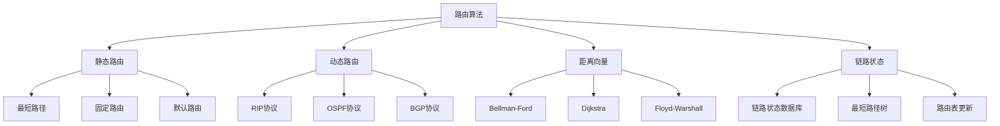

# 路由算法实现

## 📖 核心概念

**路由算法**是网络通信中决定数据包传输路径的核心技术。通过合理的路由选择，可以优化网络性能、提高传输效率、保证数据可靠性和实现负载均衡。

### 🏗️ 路由算法分类



## 🔧 路由算法实现

### 最短路径算法

```cpp
class ShortestPathRouter {
private:
    struct Edge {
        int destination;
        int weight;
        
        Edge(int dest, int w) : destination(dest), weight(w) {}
    };
    
    struct Node {
        int id;
        vector<Edge> edges;
        int distance;
        int previous;
        bool visited;
        
        Node(int i) : id(i), distance(INT_MAX), previous(-1), visited(false) {}
    };
    
    map<int, Node> nodes;
    
public:
    ShortestPathRouter() {}
    
    // 添加节点
    void addNode(int nodeId) {
        nodes[nodeId] = Node(nodeId);
        cout << "Added node: " << nodeId << endl;
    }
    
    // 添加边
    void addEdge(int from, int to, int weight) {
        if (nodes.find(from) != nodes.end() && nodes.find(to) != nodes.end()) {
            nodes[from].edges.push_back(Edge(to, weight));
            cout << "Added edge: " << from << " -> " << to << " (weight: " << weight << ")" << endl;
        }
    }
    
    // Dijkstra算法
    vector<int> dijkstra(int source, int destination) {
        cout << "Running Dijkstra algorithm from " << source << " to " << destination << endl;
        
        // 初始化
        for (auto& pair : nodes) {
            pair.second.distance = INT_MAX;
            pair.second.previous = -1;
            pair.second.visited = false;
        }
        
        nodes[source].distance = 0;
        
        // 优先队列：{距离, 节点ID}
        priority_queue<pair<int, int>, vector<pair<int, int>>, greater<pair<int, int>>> pq;
        pq.push({0, source});
        
        while (!pq.empty()) {
            int currentId = pq.top().second;
            int currentDist = pq.top().first;
            pq.pop();
            
            if (nodes[currentId].visited) {
                continue;
            }
            
            nodes[currentId].visited = true;
            
            // 更新邻居节点
            for (const Edge& edge : nodes[currentId].edges) {
                int neighborId = edge.destination;
                int newDist = currentDist + edge.weight;
                
                if (newDist < nodes[neighborId].distance) {
                    nodes[neighborId].distance = newDist;
                    nodes[neighborId].previous = currentId;
                    pq.push({newDist, neighborId});
                }
            }
        }
        
        // 构建路径
        vector<int> path;
        int current = destination;
        
        while (current != -1) {
            path.push_back(current);
            current = nodes[current].previous;
        }
        
        reverse(path.begin(), path.end());
        
        cout << "Shortest path from " << source << " to " << destination << ": ";
        for (int node : path) {
            cout << node << " ";
        }
        cout << "(distance: " << nodes[destination].distance << ")" << endl;
        
        return path;
    }
    
    // Bellman-Ford算法
    vector<int> bellmanFord(int source, int destination) {
        cout << "Running Bellman-Ford algorithm from " << source << " to " << destination << endl;
        
        // 初始化
        for (auto& pair : nodes) {
            pair.second.distance = INT_MAX;
            pair.second.previous = -1;
        }
        
        nodes[source].distance = 0;
        
        // 松弛操作
        for (int i = 0; i < nodes.size() - 1; i++) {
            for (auto& pair : nodes) {
                int currentId = pair.first;
                Node& currentNode = pair.second;
                
                if (currentNode.distance == INT_MAX) {
                    continue;
                }
                
                for (const Edge& edge : currentNode.edges) {
                    int neighborId = edge.destination;
                    int newDist = currentNode.distance + edge.weight;
                    
                    if (newDist < nodes[neighborId].distance) {
                        nodes[neighborId].distance = newDist;
                        nodes[neighborId].previous = currentId;
                    }
                }
            }
        }
        
        // 检查负权环
        for (auto& pair : nodes) {
            int currentId = pair.first;
            Node& currentNode = pair.second;
            
            if (currentNode.distance == INT_MAX) {
                continue;
            }
            
            for (const Edge& edge : currentNode.edges) {
                int neighborId = edge.destination;
                int newDist = currentNode.distance + edge.weight;
                
                if (newDist < nodes[neighborId].distance) {
                    cout << "Negative weight cycle detected!" << endl;
                    return vector<int>();
                }
            }
        }
        
        // 构建路径
        vector<int> path;
        int current = destination;
        
        while (current != -1) {
            path.push_back(current);
            current = nodes[current].previous;
        }
        
        reverse(path.begin(), path.end());
        
        cout << "Shortest path from " << source << " to " << destination << ": ";
        for (int node : path) {
            cout << node << " ";
        }
        cout << "(distance: " << nodes[destination].distance << ")" << endl;
        
        return path;
    }
    
    // Floyd-Warshall算法
    map<pair<int, int>, int> floydWarshall() {
        cout << "Running Floyd-Warshall algorithm" << endl;
        
        // 初始化距离矩阵
        map<pair<int, int>, int> dist;
        
        for (const auto& pair1 : nodes) {
            for (const auto& pair2 : nodes) {
                if (pair1.first == pair2.first) {
                    dist[{pair1.first, pair2.first}] = 0;
                } else {
                    dist[{pair1.first, pair2.first}] = INT_MAX;
                }
            }
        }
        
        // 设置边的距离
        for (const auto& pair : nodes) {
            int from = pair.first;
            for (const Edge& edge : pair.second.edges) {
                int to = edge.destination;
                dist[{from, to}] = edge.weight;
            }
        }
        
        // Floyd-Warshall主循环
        for (const auto& pair1 : nodes) {
            int k = pair1.first;
            for (const auto& pair2 : nodes) {
                int i = pair2.first;
                for (const auto& pair3 : nodes) {
                    int j = pair3.first;
                    
                    if (dist[{i, k}] != INT_MAX && dist[{k, j}] != INT_MAX) {
                        int newDist = dist[{i, k}] + dist[{k, j}];
                        if (newDist < dist[{i, j}]) {
                            dist[{i, j}] = newDist;
                        }
                    }
                }
            }
        }
        
        cout << "All-pairs shortest paths computed" << endl;
        return dist;
    }
    
    // 显示网络拓扑
    void displayTopology() {
        cout << "Network Topology:" << endl;
        cout << "===============" << endl;
        
        for (const auto& pair : nodes) {
            const Node& node = pair.second;
            cout << "Node " << node.id << ": ";
            
            if (node.edges.empty()) {
                cout << "no connections" << endl;
            } else {
                for (const Edge& edge : node.edges) {
                    cout << "-> " << edge.destination << "(" << edge.weight << ") ";
                }
                cout << endl;
            }
        }
    }
    
    // 显示路由表
    void displayRoutingTable(int source) {
        cout << "Routing Table for Node " << source << ":" << endl;
        cout << "=========================" << endl;
        
        cout << "Destination\tDistance\tNext Hop" << endl;
        cout << "----------\t--------\t--------" << endl;
        
        for (const auto& pair : nodes) {
            int dest = pair.first;
            if (dest != source) {
                cout << dest << "\t\t" << nodes[dest].distance << "\t\t" << nodes[dest].previous << endl;
            }
        }
    }
};
```

### 距离向量路由算法

```cpp
class DistanceVectorRouter {
private:
    struct RoutingEntry {
        int destination;
        int distance;
        int nextHop;
        chrono::time_point<chrono::high_resolution_clock> lastUpdate;
        
        RoutingEntry(int dest, int dist, int hop) : destination(dest), distance(dist), nextHop(hop) {
            lastUpdate = chrono::high_resolution_clock::now();
        }
    };
    
    struct Node {
        int id;
        map<int, RoutingEntry> routingTable;
        map<int, int> neighbors; // neighborId -> cost
        bool isActive;
        
        Node(int i) : id(i), isActive(true) {}
    };
    
    map<int, Node> nodes;
    int updateInterval; // 秒
    
public:
    DistanceVectorRouter(int interval = 30) : updateInterval(interval) {}
    
    // 添加节点
    void addNode(int nodeId) {
        nodes[nodeId] = Node(nodeId);
        cout << "Added node: " << nodeId << endl;
    }
    
    // 添加邻居
    void addNeighbor(int nodeId, int neighborId, int cost) {
        if (nodes.find(nodeId) != nodes.end() && nodes.find(neighborId) != nodes.end()) {
            nodes[nodeId].neighbors[neighborId] = cost;
            nodes[neighborId].neighbors[nodeId] = cost;
            
            // 初始化路由表
            nodes[nodeId].routingTable[neighborId] = RoutingEntry(neighborId, cost, neighborId);
            nodes[neighborId].routingTable[nodeId] = RoutingEntry(nodeId, cost, nodeId);
            
            cout << "Added neighbor: " << nodeId << " <-> " << neighborId << " (cost: " << cost << ")" << endl;
        }
    }
    
    // 距离向量更新
    void updateDistanceVector(int nodeId) {
        if (nodes.find(nodeId) == nodes.end()) {
            return;
        }
        
        Node& node = nodes[nodeId];
        bool updated = false;
        
        // 对每个邻居更新距离向量
        for (const auto& neighborPair : node.neighbors) {
            int neighborId = neighborPair.first;
            int costToNeighbor = neighborPair.second;
            
            if (nodes.find(neighborId) == nodes.end()) {
                continue;
            }
            
            Node& neighbor = nodes[neighborId];
            
            // 检查邻居的路由表
            for (const auto& entryPair : neighbor.routingTable) {
                int destination = entryPair.first;
                int distance = entryPair.second.distance;
                
                if (destination == nodeId) {
                    continue; // 跳过自己
                }
                
                int newDistance = costToNeighbor + distance;
                
                // 更新路由表
                if (node.routingTable.find(destination) == node.routingTable.end() ||
                    newDistance < node.routingTable[destination].distance) {
                    
                    node.routingTable[destination] = RoutingEntry(destination, newDistance, neighborId);
                    updated = true;
                    
                    cout << "Updated route: " << nodeId << " -> " << destination 
                         << " via " << neighborId << " (distance: " << newDistance << ")" << endl;
                }
            }
        }
        
        if (updated) {
            // 通知邻居
            notifyNeighbors(nodeId);
        }
    }
    
    // 通知邻居
    void notifyNeighbors(int nodeId) {
        if (nodes.find(nodeId) == nodes.end()) {
            return;
        }
        
        Node& node = nodes[nodeId];
        
        for (const auto& neighborPair : node.neighbors) {
            int neighborId = neighborPair.first;
            cout << "Notifying neighbor " << neighborId << " about updates from " << nodeId << endl;
            updateDistanceVector(neighborId);
        }
    }
    
    // 查找路由
    vector<int> findRoute(int source, int destination) {
        if (nodes.find(source) == nodes.end() || nodes.find(destination) == nodes.end()) {
            cout << "Source or destination node not found" << endl;
            return vector<int>();
        }
        
        vector<int> path;
        int current = source;
        
        while (current != destination) {
            path.push_back(current);
            
            if (nodes[current].routingTable.find(destination) == nodes[current].routingTable.end()) {
                cout << "No route found from " << source << " to " << destination << endl;
                return vector<int>();
            }
            
            int nextHop = nodes[current].routingTable[destination].nextHop;
            current = nextHop;
            
            // 防止循环
            if (find(path.begin(), path.end(), current) != path.end()) {
                cout << "Routing loop detected!" << endl;
                return vector<int>();
            }
        }
        
        path.push_back(destination);
        
        cout << "Route from " << source << " to " << destination << ": ";
        for (int node : path) {
            cout << node << " ";
        }
        cout << endl;
        
        return path;
    }
    
    // 模拟网络变化
    void simulateNetworkChange(int nodeId, int neighborId, int newCost) {
        if (nodes.find(nodeId) != nodes.end() && nodes.find(neighborId) != nodes.end()) {
            nodes[nodeId].neighbors[neighborId] = newCost;
            nodes[neighborId].neighbors[nodeId] = newCost;
            
            // 更新路由表
            nodes[nodeId].routingTable[neighborId] = RoutingEntry(neighborId, newCost, neighborId);
            nodes[neighborId].routingTable[nodeId] = RoutingEntry(nodeId, newCost, nodeId);
            
            cout << "Network change: " << nodeId << " <-> " << neighborId << " (new cost: " << newCost << ")" << endl;
            
            // 触发距离向量更新
            updateDistanceVector(nodeId);
            updateDistanceVector(neighborId);
        }
    }
    
    // 显示路由表
    void displayRoutingTable(int nodeId) {
        if (nodes.find(nodeId) == nodes.end()) {
            cout << "Node " << nodeId << " not found" << endl;
            return;
        }
        
        const Node& node = nodes[nodeId];
        
        cout << "Routing Table for Node " << nodeId << ":" << endl;
        cout << "=========================" << endl;
        cout << "Destination\tDistance\tNext Hop" << endl;
        cout << "----------\t--------\t--------" << endl;
        
        for (const auto& entryPair : node.routingTable) {
            const RoutingEntry& entry = entryPair.second;
            cout << entry.destination << "\t\t" << entry.distance << "\t\t" << entry.nextHop << endl;
        }
    }
    
    // 显示网络拓扑
    void displayTopology() {
        cout << "Distance Vector Network Topology:" << endl;
        cout << "===============================" << endl;
        
        for (const auto& pair : nodes) {
            const Node& node = pair.second;
            cout << "Node " << node.id << " neighbors: ";
            
            for (const auto& neighborPair : node.neighbors) {
                cout << neighborPair.first << "(" << neighborPair.second << ") ";
            }
            cout << endl;
        }
    }
};
```

### 链路状态路由算法

```cpp
class LinkStateRouter {
private:
    struct Link {
        int from;
        int to;
        int cost;
        bool isActive;
        chrono::time_point<chrono::high_resolution_clock> lastUpdate;
        
        Link(int f, int t, int c) : from(f), to(t), cost(c), isActive(true) {
            lastUpdate = chrono::high_resolution_clock::now();
        }
    };
    
    struct Node {
        int id;
        map<int, int> neighbors; // neighborId -> cost
        bool isActive;
        
        Node(int i) : id(i), isActive(true) {}
    };
    
    map<int, Node> nodes;
    vector<Link> links;
    map<pair<int, int>, int> shortestPaths;
    
public:
    LinkStateRouter() {}
    
    // 添加节点
    void addNode(int nodeId) {
        nodes[nodeId] = Node(nodeId);
        cout << "Added node: " << nodeId << endl;
    }
    
    // 添加链路
    void addLink(int from, int to, int cost) {
        if (nodes.find(from) != nodes.end() && nodes.find(to) != nodes.end()) {
            links.push_back(Link(from, to, cost));
            links.push_back(Link(to, from, cost)); // 双向链路
            
            nodes[from].neighbors[to] = cost;
            nodes[to].neighbors[from] = cost;
            
            cout << "Added link: " << from << " <-> " << to << " (cost: " << cost << ")" << endl;
        }
    }
    
    // 构建链路状态数据库
    map<int, vector<Link>> buildLinkStateDatabase() {
        cout << "Building Link State Database" << endl;
        
        map<int, vector<Link>> database;
        
        for (const auto& pair : nodes) {
            int nodeId = pair.first;
            vector<Link> nodeLinks;
            
            for (const Link& link : links) {
                if (link.from == nodeId && link.isActive) {
                    nodeLinks.push_back(link);
                }
            }
            
            database[nodeId] = nodeLinks;
            
            cout << "Node " << nodeId << " links: ";
            for (const Link& link : nodeLinks) {
                cout << link.to << "(" << link.cost << ") ";
            }
            cout << endl;
        }
        
        return database;
    }
    
    // Dijkstra算法计算最短路径
    map<int, int> dijkstra(int source) {
        cout << "Running Dijkstra algorithm from node " << source << endl;
        
        map<int, int> distances;
        map<int, int> previous;
        set<int> unvisited;
        
        // 初始化
        for (const auto& pair : nodes) {
            int nodeId = pair.first;
            distances[nodeId] = INT_MAX;
            previous[nodeId] = -1;
            unvisited.insert(nodeId);
        }
        
        distances[source] = 0;
        
        while (!unvisited.empty()) {
            // 找到未访问节点中距离最小的
            int current = -1;
            int minDist = INT_MAX;
            
            for (int nodeId : unvisited) {
                if (distances[nodeId] < minDist) {
                    minDist = distances[nodeId];
                    current = nodeId;
                }
            }
            
            if (current == -1) {
                break; // 没有可达节点
            }
            
            unvisited.erase(current);
            
            // 更新邻居节点
            for (const auto& neighborPair : nodes[current].neighbors) {
                int neighborId = neighborPair.first;
                int cost = neighborPair.second;
                
                if (unvisited.find(neighborId) != unvisited.end()) {
                    int newDist = distances[current] + cost;
                    
                    if (newDist < distances[neighborId]) {
                        distances[neighborId] = newDist;
                        previous[neighborId] = current;
                    }
                }
            }
        }
        
        // 存储最短路径
        for (const auto& pair : distances) {
            shortestPaths[{source, pair.first}] = pair.second;
        }
        
        cout << "Shortest paths from " << source << ":" << endl;
        for (const auto& pair : distances) {
            if (pair.second != INT_MAX) {
                cout << "  to " << pair.first << ": " << pair.second << endl;
            }
        }
        
        return distances;
    }
    
    // 计算所有节点对的最短路径
    void computeAllShortestPaths() {
        cout << "Computing all shortest paths" << endl;
        
        for (const auto& pair : nodes) {
            int source = pair.first;
            dijkstra(source);
        }
    }
    
    // 查找路由
    vector<int> findRoute(int source, int destination) {
        if (nodes.find(source) == nodes.end() || nodes.find(destination) == nodes.end()) {
            cout << "Source or destination node not found" << endl;
            return vector<int>();
        }
        
        // 如果还没有计算最短路径，先计算
        if (shortestPaths.find({source, destination}) == shortestPaths.end()) {
            dijkstra(source);
        }
        
        // 构建路径
        vector<int> path;
        int current = destination;
        
        while (current != source) {
            path.push_back(current);
            
            // 找到前一个节点
            bool found = false;
            for (const auto& pair : nodes) {
                int nodeId = pair.first;
                if (shortestPaths.find({source, nodeId}) != shortestPaths.end() &&
                    shortestPaths.find({source, current}) != shortestPaths.end()) {
                    
                    int distToNode = shortestPaths[{source, nodeId}];
                    int distToCurrent = shortestPaths[{source, current}];
                    
                    if (nodes[nodeId].neighbors.find(current) != nodes[nodeId].neighbors.end() &&
                        distToNode + nodes[nodeId].neighbors[current] == distToCurrent) {
                        current = nodeId;
                        found = true;
                        break;
                    }
                }
            }
            
            if (!found) {
                cout << "Cannot find route from " << source << " to " << destination << endl;
                return vector<int>();
            }
        }
        
        path.push_back(source);
        reverse(path.begin(), path.end());
        
        cout << "Route from " << source << " to " << destination << ": ";
        for (int node : path) {
            cout << node << " ";
        }
        cout << "(distance: " << shortestPaths[{source, destination}] << ")" << endl;
        
        return path;
    }
    
    // 模拟链路故障
    void simulateLinkFailure(int from, int to) {
        cout << "Simulating link failure: " << from << " <-> " << to << endl;
        
        // 标记链路为不活跃
        for (Link& link : links) {
            if ((link.from == from && link.to == to) || (link.from == to && link.to == from)) {
                link.isActive = false;
            }
        }
        
        // 从邻居列表中移除
        if (nodes.find(from) != nodes.end()) {
            nodes[from].neighbors.erase(to);
        }
        if (nodes.find(to) != nodes.end()) {
            nodes[to].neighbors.erase(from);
        }
        
        // 重新计算最短路径
        shortestPaths.clear();
        computeAllShortestPaths();
    }
    
    // 显示网络拓扑
    void displayTopology() {
        cout << "Link State Network Topology:" << endl;
        cout << "==========================" << endl;
        
        for (const auto& pair : nodes) {
            const Node& node = pair.second;
            cout << "Node " << node.id << " neighbors: ";
            
            for (const auto& neighborPair : node.neighbors) {
                cout << neighborPair.first << "(" << neighborPair.second << ") ";
            }
            cout << endl;
        }
    }
    
    // 显示链路状态数据库
    void displayLinkStateDatabase() {
        cout << "Link State Database:" << endl;
        cout << "==================" << endl;
        
        map<int, vector<Link>> database = buildLinkStateDatabase();
        
        for (const auto& pair : database) {
            int nodeId = pair.first;
            const vector<Link>& nodeLinks = pair.second;
            
            cout << "Node " << nodeId << " links:" << endl;
            for (const Link& link : nodeLinks) {
                cout << "  " << link.from << " -> " << link.to << " (cost: " << link.cost 
                     << ", active: " << (link.isActive ? "yes" : "no") << ")" << endl;
            }
        }
    }
};
```

## 🎯 路由算法应用

### 实际应用场景

```cpp
class RoutingAlgorithmApplications {
public:
    static void demonstrateApplications() {
        cout << "Routing Algorithm Applications:" << endl;
        cout << "=============================" << endl;
        
        cout << "1. 互联网路由:" << endl;
        cout << "   - BGP协议: 自治系统间路由" << endl;
        cout << "   - OSPF协议: 内部网关协议" << endl;
        cout << "   - RIP协议: 距离向量路由" << endl;
        
        cout << "2. 数据中心网络:" << endl;
        cout << "   - 最短路径: 最小延迟路由" << endl;
        cout << "   - 负载均衡: 流量分配" << endl;
        cout << "   - 故障恢复: 快速切换" << endl;
        
        cout << "3. 无线网络:" << endl;
        cout << "   - 移动路由: 动态路径更新" << endl;
        cout << "   - 能量感知: 节能路由" << endl;
        cout << "   - 多跳路由: 中继传输" << endl;
        
        cout << "4. 软件定义网络:" << endl;
        cout << "   - 集中控制: 全局优化" << endl;
        cout << "   - 动态配置: 灵活路由" << endl;
        cout << "   - 流量工程: 性能优化" << endl;
    }
    
    static void analyzePerformance() {
        cout << "Routing Algorithm Performance Analysis:" << endl;
        cout << "=====================================" << endl;
        
        cout << "1. 算法复杂度:" << endl;
        cout << "   - Dijkstra: O(V^2) 或 O(E log V)" << endl;
        cout << "   - Bellman-Ford: O(VE)" << endl;
        cout << "   - Floyd-Warshall: O(V^3)" << endl;
        cout << "   - 距离向量: O(VE)" << endl;
        cout << "   - 链路状态: O(V^2)" << endl;
        cout << endl;
        
        cout << "2. 收敛速度:" << endl;
        cout << "   - Dijkstra: 快速收敛" << endl;
        cout << "   - Bellman-Ford: 慢速收敛" << endl;
        cout << "   - Floyd-Warshall: 一次性计算" << endl;
        cout << "   - 距离向量: 慢速收敛" << endl;
        cout << "   - 链路状态: 快速收敛" << endl;
        cout << endl;
        
        cout << "3. 适用场景:" << endl;
        cout << "   - Dijkstra: 单源最短路径" << endl;
        cout << "   - Bellman-Ford: 负权边检测" << endl;
        cout << "   - Floyd-Warshall: 全对最短路径" << endl;
        cout << "   - 距离向量: 简单网络" << endl;
        cout << "   - 链路状态: 复杂网络" << endl;
    }
    
    static void selectRoutingAlgorithm(bool needsFastConvergence, bool needsNegativeWeights, bool needsAllPairs) {
        cout << "Routing Algorithm Selection:" << endl;
        cout << "==========================" << endl;
        
        cout << "Needs fast convergence: " << (needsFastConvergence ? "Yes" : "No") << endl;
        cout << "Needs negative weights: " << (needsNegativeWeights ? "Yes" : "No") << endl;
        cout << "Needs all pairs: " << (needsAllPairs ? "Yes" : "No") << endl;
        
        cout << "Recommendation:" << endl;
        
        if (needsAllPairs) {
            cout << "Use Floyd-Warshall algorithm (all pairs shortest paths)" << endl;
        } else if (needsNegativeWeights) {
            cout << "Use Bellman-Ford algorithm (handles negative weights)" << endl;
        } else if (needsFastConvergence) {
            cout << "Use Dijkstra algorithm (fast convergence)" << endl;
        } else {
            cout << "Use distance vector algorithm (simple implementation)" << endl;
        }
    }
};
```

## 📊 路由算法分析

### 性能分析

```cpp
class RoutingAlgorithmAnalysis {
public:
    static void analyzePerformance() {
        cout << "Routing Algorithm Performance Analysis:" << endl;
        cout << "=====================================" << endl;
        
        cout << "1. 时间复杂度:" << endl;
        cout << "   - Dijkstra: O(V^2) 或 O(E log V)" << endl;
        cout << "   - Bellman-Ford: O(VE)" << endl;
        cout << "   - Floyd-Warshall: O(V^3)" << endl;
        cout << "   - 距离向量: O(VE)" << endl;
        cout << "   - 链路状态: O(V^2)" << endl;
        
        cout << "2. 空间复杂度:" << endl;
        cout << "   - Dijkstra: O(V)" << endl;
        cout << "   - Bellman-Ford: O(V)" << endl;
        cout << "   - Floyd-Warshall: O(V^2)" << endl;
        cout << "   - 距离向量: O(V^2)" << endl;
        cout << "   - 链路状态: O(V^2)" << endl;
        
        cout << "3. 收敛特性:" << endl;
        cout << "   - Dijkstra: 快速收敛" << endl;
        cout << "   - Bellman-Ford: 慢速收敛" << endl;
        cout << "   - Floyd-Warshall: 一次性计算" << endl;
        cout << "   - 距离向量: 慢速收敛" << endl;
        cout << "   - 链路状态: 快速收敛" << endl;
    }
    
    static void analyzeSpaceComplexity() {
        cout << "Routing Algorithm Space Complexity Analysis:" << endl;
        cout << "=========================================" << endl;
        
        cout << "1. 存储需求:" << endl;
        cout << "   - 图结构: O(V + E)" << endl;
        cout << "   - 距离数组: O(V)" << endl;
        cout << "   - 前驱数组: O(V)" << endl;
        cout << "   - 路由表: O(V^2)" << endl;
        cout << "   - 链路状态数据库: O(E)" << endl;
        
        cout << "2. 内存使用:" << endl;
        cout << "   - Dijkstra: 低" << endl;
        cout << "   - Bellman-Ford: 低" << endl;
        cout << "   - Floyd-Warshall: 高" << endl;
        cout << "   - 距离向量: 中等" << endl;
        cout << "   - 链路状态: 中等" << endl;
        
        cout << "3. 扩展性:" << endl;
        cout << "   - Dijkstra: 好" << endl;
        cout << "   - Bellman-Ford: 好" << endl;
        cout << "   - Floyd-Warshall: 差" << endl;
        cout << "   - 距离向量: 中等" << endl;
        cout << "   - 链路状态: 好" << endl;
    }
    
    static void analyzeTimeComplexity() {
        cout << "Routing Algorithm Time Complexity Analysis:" << endl;
        cout << "=========================================" << endl;
        
        cout << "1. 计算复杂度:" << endl;
        cout << "   - Dijkstra: O(V^2) 或 O(E log V)" << endl;
        cout << "   - Bellman-Ford: O(VE)" << endl;
        cout << "   - Floyd-Warshall: O(V^3)" << endl;
        cout << "   - 距离向量: O(VE)" << endl;
        cout << "   - 链路状态: O(V^2)" << endl;
        
        cout << "2. 更新复杂度:" << endl;
        cout << "   - Dijkstra: O(E log V)" << endl;
        cout << "   - Bellman-Ford: O(VE)" << endl;
        cout << "   - Floyd-Warshall: O(V^3)" << endl;
        cout << "   - 距离向量: O(V)" << endl;
        cout << "   - 链路状态: O(V^2)" << endl;
        
        cout << "3. 查询复杂度:" << endl;
        cout << "   - Dijkstra: O(1)" << endl;
        cout << "   - Bellman-Ford: O(1)" << endl;
        cout << "   - Floyd-Warshall: O(1)" << endl;
        cout << "   - 距离向量: O(1)" << endl;
        cout << "   - 链路状态: O(1)" << endl;
    }
};
```

## 🎮 路由算法测试

### 1. 基础功能测试

```cpp
class RoutingAlgorithmTest {
public:
    static void testShortestPathRouter() {
        cout << "Testing Shortest Path Router:" << endl;
        cout << "==========================" << endl;
        
        ShortestPathRouter router;
        
        // 添加节点
        router.addNode(1);
        router.addNode(2);
        router.addNode(3);
        router.addNode(4);
        
        // 添加边
        router.addEdge(1, 2, 1);
        router.addEdge(1, 3, 4);
        router.addEdge(2, 3, 2);
        router.addEdge(2, 4, 3);
        router.addEdge(3, 4, 1);
        
        // 测试Dijkstra算法
        router.dijkstra(1, 4);
        
        // 测试Bellman-Ford算法
        router.bellmanFord(1, 4);
        
        // 测试Floyd-Warshall算法
        router.floydWarshall();
        
        router.displayTopology();
        router.displayRoutingTable(1);
    }
    
    static void testDistanceVectorRouter() {
        cout << "Testing Distance Vector Router:" << endl;
        cout << "=============================" << endl;
        
        DistanceVectorRouter router;
        
        // 添加节点
        router.addNode(1);
        router.addNode(2);
        router.addNode(3);
        router.addNode(4);
        
        // 添加邻居
        router.addNeighbor(1, 2, 1);
        router.addNeighbor(2, 3, 2);
        router.addNeighbor(3, 4, 1);
        router.addNeighbor(1, 4, 5);
        
        // 测试路由查找
        router.findRoute(1, 4);
        
        // 模拟网络变化
        router.simulateNetworkChange(1, 4, 3);
        
        router.displayTopology();
        router.displayRoutingTable(1);
    }
    
    static void testLinkStateRouter() {
        cout << "Testing Link State Router:" << endl;
        cout << "========================" << endl;
        
        LinkStateRouter router;
        
        // 添加节点
        router.addNode(1);
        router.addNode(2);
        router.addNode(3);
        router.addNode(4);
        
        // 添加链路
        router.addLink(1, 2, 1);
        router.addLink(2, 3, 2);
        router.addLink(3, 4, 1);
        router.addLink(1, 4, 5);
        
        // 计算最短路径
        router.computeAllShortestPaths();
        
        // 测试路由查找
        router.findRoute(1, 4);
        
        // 模拟链路故障
        router.simulateLinkFailure(1, 4);
        
        router.displayTopology();
        router.displayLinkStateDatabase();
    }
    
    static void testApplications() {
        cout << "Testing Applications:" << endl;
        cout << "==================" << endl;
        
        RoutingAlgorithmApplications::demonstrateApplications();
        RoutingAlgorithmApplications::analyzePerformance();
        RoutingAlgorithmApplications::selectRoutingAlgorithm(true, false, false);
    }
    
    static void testAnalysis() {
        cout << "Testing Analysis:" << endl;
        cout << "===============" << endl;
        
        RoutingAlgorithmAnalysis::analyzePerformance();
        RoutingAlgorithmAnalysis::analyzeSpaceComplexity();
        RoutingAlgorithmAnalysis::analyzeTimeComplexity();
    }
};
```

## 🔗 相关链接

- [[01-负载均衡算法|负载均衡算法]]
- [[02-CDN加速技术|CDN加速技术]]
- [[03-网络协议栈|网络协议栈]]

## 💡 路由算法要点

1. **最短路径算法**: Dijkstra、Bellman-Ford、Floyd-Warshall
2. **距离向量路由**: 简单实现，适合小型网络
3. **链路状态路由**: 快速收敛，适合大型网络
4. **算法选择**: 根据网络规模和需求选择合适算法

---

*📝 路由算法提示：路由算法的选择需要根据网络规模、收敛速度和实现复杂度来综合考虑*
