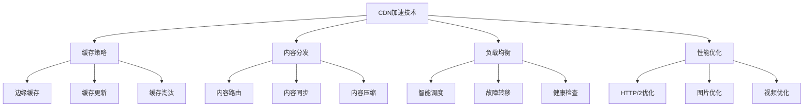

# CDN加速技术

## 📖 核心概念

**CDN加速技术**（Content Delivery Network）是通过在全球部署边缘节点来缓存和分发内容的技术。通过将内容就近提供给用户，CDN可以显著降低延迟、提高访问速度、减少源服务器负载。

### 🏗️ CDN加速技术分类



## 🔧 CDN加速技术实现

### 边缘缓存系统

```cpp
class EdgeCacheSystem {
private:
    struct CacheEntry {
        string content;
        string contentType;
        int contentLength;
        chrono::time_point<chrono::high_resolution_clock> createTime;
        chrono::time_point<chrono::high_resolution_clock> lastAccess;
        int accessCount;
        int ttl; // 生存时间（秒）
        
        CacheEntry(const string& c, const string& type, int length, int timeToLive) 
            : content(c), contentType(type), contentLength(length), accessCount(1), ttl(timeToLive) {
            createTime = chrono::high_resolution_clock::now();
            lastAccess = createTime;
        }
        
        bool isExpired() const {
            auto now = chrono::high_resolution_clock::now();
            auto elapsed = chrono::duration_cast<chrono::seconds>(now - createTime).count();
            return elapsed > ttl;
        }
        
        void updateAccess() {
            lastAccess = chrono::high_resolution_clock::now();
            accessCount++;
        }
    };
    
    map<string, CacheEntry> cache;
    int maxCacheSize;
    int currentCacheSize;
    mutex cacheMutex;
    
public:
    EdgeCacheSystem(int maxSize = 1000) : maxCacheSize(maxSize), currentCacheSize(0) {}
    
    // 缓存内容
    bool cacheContent(const string& url, const string& content, const string& contentType, int ttl = 3600) {
        lock_guard<mutex> lock(cacheMutex);
        
        // 检查缓存是否已满
        if (currentCacheSize >= maxCacheSize) {
            evictLeastRecentlyUsed();
        }
        
        // 创建缓存条目
        CacheEntry entry(content, contentType, content.length(), ttl);
        cache[url] = entry;
        currentCacheSize++;
        
        cout << "Cached content: " << url << " (size: " << content.length() << " bytes, TTL: " << ttl << "s)" << endl;
        return true;
    }
    
    // 获取缓存内容
    string getCachedContent(const string& url) {
        lock_guard<mutex> lock(cacheMutex);
        
        auto it = cache.find(url);
        if (it != cache.end()) {
            CacheEntry& entry = it->second;
            
            // 检查是否过期
            if (entry.isExpired()) {
                cache.erase(it);
                currentCacheSize--;
                cout << "Cache expired: " << url << endl;
                return "";
            }
            
            // 更新访问信息
            entry.updateAccess();
            
            cout << "Cache hit: " << url << " (access count: " << entry.accessCount << ")" << endl;
            return entry.content;
        }
        
        cout << "Cache miss: " << url << endl;
        return "";
    }
    
    // 更新缓存内容
    bool updateCachedContent(const string& url, const string& newContent, const string& contentType, int ttl = 3600) {
        lock_guard<mutex> lock(cacheMutex);
        
        auto it = cache.find(url);
        if (it != cache.end()) {
            // 更新现有条目
            it->second.content = newContent;
            it->second.contentType = contentType;
            it->second.contentLength = newContent.length();
            it->second.ttl = ttl;
            it->second.createTime = chrono::high_resolution_clock::now();
            it->second.lastAccess = it->second.createTime;
            
            cout << "Updated cached content: " << url << endl;
            return true;
        }
        
        // 如果不存在，创建新条目
        return cacheContent(url, newContent, contentType, ttl);
    }
    
    // 删除缓存内容
    bool deleteCachedContent(const string& url) {
        lock_guard<mutex> lock(cacheMutex);
        
        auto it = cache.find(url);
        if (it != cache.end()) {
            cache.erase(it);
            currentCacheSize--;
            cout << "Deleted cached content: " << url << endl;
            return true;
        }
        
        cout << "Content not found in cache: " << url << endl;
        return false;
    }
    
    // LRU淘汰策略
    void evictLeastRecentlyUsed() {
        if (cache.empty()) {
            return;
        }
        
        string lruUrl = "";
        auto oldestTime = chrono::high_resolution_clock::now();
        
        for (const auto& pair : cache) {
            if (pair.second.lastAccess < oldestTime) {
                oldestTime = pair.second.lastAccess;
                lruUrl = pair.first;
            }
        }
        
        if (!lruUrl.empty()) {
            cache.erase(lruUrl);
            currentCacheSize--;
            cout << "Evicted LRU content: " << lruUrl << endl;
        }
    }
    
    // 清理过期内容
    void cleanupExpiredContent() {
        lock_guard<mutex> lock(cacheMutex);
        
        vector<string> expiredUrls;
        
        for (const auto& pair : cache) {
            if (pair.second.isExpired()) {
                expiredUrls.push_back(pair.first);
            }
        }
        
        for (const string& url : expiredUrls) {
            cache.erase(url);
            currentCacheSize--;
            cout << "Cleaned up expired content: " << url << endl;
        }
        
        cout << "Cleaned up " << expiredUrls.size() << " expired entries" << endl;
    }
    
    // 显示缓存统计
    void displayCacheStats() {
        lock_guard<mutex> lock(cacheMutex);
        
        cout << "Edge Cache Statistics:" << endl;
        cout << "====================" << endl;
        cout << "Cache size: " << currentCacheSize << "/" << maxCacheSize << endl;
        cout << "Usage: " << (double)currentCacheSize / maxCacheSize * 100 << "%" << endl;
        
        int totalAccesses = 0;
        int expiredEntries = 0;
        
        for (const auto& pair : cache) {
            totalAccesses += pair.second.accessCount;
            if (pair.second.isExpired()) {
                expiredEntries++;
            }
        }
        
        cout << "Total accesses: " << totalAccesses << endl;
        cout << "Expired entries: " << expiredEntries << endl;
        cout << "Average access per entry: " << (currentCacheSize > 0 ? (double)totalAccesses / currentCacheSize : 0) << endl;
    }
    
    // 显示缓存内容
    void displayCacheContents() {
        lock_guard<mutex> lock(cacheMutex);
        
        cout << "Edge Cache Contents:" << endl;
        cout << "===================" << endl;
        
        for (const auto& pair : cache) {
            const CacheEntry& entry = pair.second;
            cout << "URL: " << pair.first << endl;
            cout << "  Type: " << entry.contentType << endl;
            cout << "  Size: " << entry.contentLength << " bytes" << endl;
            cout << "  Access count: " << entry.accessCount << endl;
            cout << "  TTL: " << entry.ttl << "s" << endl;
            cout << "  Expired: " << (entry.isExpired() ? "Yes" : "No") << endl;
            cout << endl;
        }
    }
};
```

### 内容分发系统

```cpp
class ContentDistributionSystem {
private:
    struct EdgeNode {
        string nodeId;
        string location;
        string ipAddress;
        int port;
        bool isHealthy;
        int load;
        chrono::time_point<chrono::high_resolution_clock> lastHeartbeat;
        
        EdgeNode(const string& id, const string& loc, const string& ip, int p) 
            : nodeId(id), location(loc), ipAddress(ip), port(p), isHealthy(true), load(0) {
            lastHeartbeat = chrono::high_resolution_clock::now();
        }
    };
    
    struct Content {
        string url;
        string content;
        string contentType;
        int contentLength;
        vector<string> edgeNodes; // 存储该内容的边缘节点
        chrono::time_point<chrono::high_resolution_clock> createTime;
        
        Content(const string& u, const string& c, const string& type) 
            : url(u), content(c), contentType(type), contentLength(c.length()) {
            createTime = chrono::high_resolution_clock::now();
        }
    };
    
    map<string, EdgeNode> edgeNodes;
    map<string, Content> contents;
    mutex systemMutex;
    
public:
    ContentDistributionSystem() {}
    
    // 添加边缘节点
    void addEdgeNode(const string& nodeId, const string& location, const string& ipAddress, int port) {
        lock_guard<mutex> lock(systemMutex);
        
        EdgeNode node(nodeId, location, ipAddress, port);
        edgeNodes[nodeId] = node;
        
        cout << "Added edge node: " << nodeId << " at " << location 
             << " (" << ipAddress << ":" << port << ")" << endl;
    }
    
    // 移除边缘节点
    void removeEdgeNode(const string& nodeId) {
        lock_guard<mutex> lock(systemMutex);
        
        auto it = edgeNodes.find(nodeId);
        if (it != edgeNodes.end()) {
            edgeNodes.erase(it);
            
            // 从所有内容中移除该节点
            for (auto& contentPair : contents) {
                Content& content = contentPair.second;
                auto nodeIt = find(content.edgeNodes.begin(), content.edgeNodes.end(), nodeId);
                if (nodeIt != content.edgeNodes.end()) {
                    content.edgeNodes.erase(nodeIt);
                }
            }
            
            cout << "Removed edge node: " << nodeId << endl;
        }
    }
    
    // 分发内容
    bool distributeContent(const string& url, const string& content, const string& contentType) {
        lock_guard<mutex> lock(systemMutex);
        
        // 创建内容
        Content newContent(url, content, contentType);
        
        // 选择边缘节点进行分发
        vector<string> selectedNodes = selectEdgeNodesForDistribution();
        
        if (selectedNodes.empty()) {
            cout << "No edge nodes available for content distribution" << endl;
            return false;
        }
        
        // 分发到选定的节点
        for (const string& nodeId : selectedNodes) {
            newContent.edgeNodes.push_back(nodeId);
            
            // 更新节点负载
            if (edgeNodes.find(nodeId) != edgeNodes.end()) {
                edgeNodes[nodeId].load++;
            }
            
            cout << "Distributed content to edge node: " << nodeId << endl;
        }
        
        contents[url] = newContent;
        
        cout << "Content distributed: " << url << " to " << selectedNodes.size() << " edge nodes" << endl;
        return true;
    }
    
    // 选择边缘节点进行分发
    vector<string> selectEdgeNodesForDistribution() {
        vector<string> selectedNodes;
        
        // 选择健康的节点
        vector<string> healthyNodes;
        for (const auto& pair : edgeNodes) {
            if (pair.second.isHealthy) {
                healthyNodes.push_back(pair.first);
            }
        }
        
        if (healthyNodes.empty()) {
            return selectedNodes;
        }
        
        // 按负载排序，选择负载最小的节点
        sort(healthyNodes.begin(), healthyNodes.end(), [this](const string& a, const string& b) {
            return edgeNodes[a].load < edgeNodes[b].load;
        });
        
        // 选择前3个节点（或所有可用节点）
        int nodesToSelect = min(3, (int)healthyNodes.size());
        for (int i = 0; i < nodesToSelect; i++) {
            selectedNodes.push_back(healthyNodes[i]);
        }
        
        return selectedNodes;
    }
    
    // 获取内容
    string getContent(const string& url, const string& userLocation = "") {
        lock_guard<mutex> lock(systemMutex);
        
        auto it = contents.find(url);
        if (it == contents.end()) {
            cout << "Content not found: " << url << endl;
            return "";
        }
        
        Content& content = it->second;
        
        // 选择最佳边缘节点
        string bestNode = selectBestEdgeNodeForUser(content.edgeNodes, userLocation);
        
        if (bestNode.empty()) {
            cout << "No edge node available for content: " << url << endl;
            return "";
        }
        
        cout << "Content retrieved from edge node: " << bestNode << " for user at: " << userLocation << endl;
        return content.content;
    }
    
    // 选择最佳边缘节点
    string selectBestEdgeNodeForUser(const vector<string>& availableNodes, const string& userLocation) {
        if (availableNodes.empty()) {
            return "";
        }
        
        // 简化的地理位置匹配
        map<string, string> locationMapping = {
            {"beijing", "beijing"},
            {"shanghai", "shanghai"},
            {"guangzhou", "guangzhou"},
            {"shenzhen", "shenzhen"}
        };
        
        // 优先选择同城节点
        for (const string& nodeId : availableNodes) {
            if (edgeNodes.find(nodeId) != edgeNodes.end()) {
                const EdgeNode& node = edgeNodes[nodeId];
                if (node.location == userLocation) {
                    return nodeId;
                }
            }
        }
        
        // 如果没有同城节点，选择负载最小的节点
        string bestNode = "";
        int minLoad = INT_MAX;
        
        for (const string& nodeId : availableNodes) {
            if (edgeNodes.find(nodeId) != edgeNodes.end()) {
                const EdgeNode& node = edgeNodes[nodeId];
                if (node.isHealthy && node.load < minLoad) {
                    minLoad = node.load;
                    bestNode = nodeId;
                }
            }
        }
        
        return bestNode;
    }
    
    // 更新节点健康状态
    void updateNodeHealth(const string& nodeId, bool isHealthy) {
        lock_guard<mutex> lock(systemMutex);
        
        auto it = edgeNodes.find(nodeId);
        if (it != edgeNodes.end()) {
            it->second.isHealthy = isHealthy;
            it->second.lastHeartbeat = chrono::high_resolution_clock::now();
            
            cout << "Updated node health: " << nodeId << " -> " << (isHealthy ? "healthy" : "unhealthy") << endl;
        }
    }
    
    // 更新节点负载
    void updateNodeLoad(const string& nodeId, int load) {
        lock_guard<mutex> lock(systemMutex);
        
        auto it = edgeNodes.find(nodeId);
        if (it != edgeNodes.end()) {
            it->second.load = load;
            cout << "Updated node load: " << nodeId << " -> " << load << endl;
        }
    }
    
    // 显示系统状态
    void displaySystemStatus() {
        lock_guard<mutex> lock(systemMutex);
        
        cout << "Content Distribution System Status:" << endl;
        cout << "=================================" << endl;
        
        cout << "Edge nodes: " << edgeNodes.size() << endl;
        int healthyNodes = 0;
        int totalLoad = 0;
        
        for (const auto& pair : edgeNodes) {
            const EdgeNode& node = pair.second;
            if (node.isHealthy) {
                healthyNodes++;
            }
            totalLoad += node.load;
        }
        
        cout << "Healthy nodes: " << healthyNodes << endl;
        cout << "Total load: " << totalLoad << endl;
        cout << "Average load: " << (edgeNodes.size() > 0 ? (double)totalLoad / edgeNodes.size() : 0) << endl;
        
        cout << "Contents: " << contents.size() << endl;
        
        cout << "Edge nodes:" << endl;
        for (const auto& pair : edgeNodes) {
            const EdgeNode& node = pair.second;
            cout << "  " << node.nodeId << " (" << node.location << "): " 
                 << (node.isHealthy ? "healthy" : "unhealthy") 
                 << ", load=" << node.load << endl;
        }
    }
};
```

### 智能调度系统

```cpp
class IntelligentSchedulingSystem {
private:
    struct UserRequest {
        string requestId;
        string url;
        string userLocation;
        string userIP;
        chrono::time_point<chrono::high_resolution_clock> requestTime;
        int priority;
        
        UserRequest(const string& id, const string& u, const string& loc, const string& ip, int prio = 1) 
            : requestId(id), url(u), userLocation(loc), userIP(ip), priority(prio) {
            requestTime = chrono::high_resolution_clock::now();
        }
    };
    
    struct EdgeNode {
        string nodeId;
        string location;
        int capacity;
        int currentLoad;
        double responseTime;
        bool isHealthy;
        map<string, int> contentCache; // 内容缓存统计
        
        EdgeNode(const string& id, const string& loc, int cap) 
            : nodeId(id), location(loc), capacity(cap), currentLoad(0), responseTime(0.0), isHealthy(true) {}
        
        double getLoadRatio() const {
            return capacity > 0 ? (double)currentLoad / capacity : 1.0;
        }
        
        bool hasContent(const string& url) const {
            return contentCache.find(url) != contentCache.end();
        }
    };
    
    queue<UserRequest> requestQueue;
    map<string, EdgeNode> edgeNodes;
    mutex systemMutex;
    
public:
    IntelligentSchedulingSystem() {}
    
    // 添加边缘节点
    void addEdgeNode(const string& nodeId, const string& location, int capacity) {
        lock_guard<mutex> lock(systemMutex);
        
        EdgeNode node(nodeId, location, capacity);
        edgeNodes[nodeId] = node;
        
        cout << "Added edge node: " << nodeId << " at " << location 
             << " (capacity: " << capacity << ")" << endl;
    }
    
    // 添加用户请求
    void addUserRequest(const string& requestId, const string& url, const string& userLocation, const string& userIP, int priority = 1) {
        lock_guard<mutex> lock(systemMutex);
        
        UserRequest request(requestId, url, userLocation, userIP, priority);
        requestQueue.push(request);
        
        cout << "Added user request: " << requestId << " for " << url 
             << " from " << userLocation << " (priority: " << priority << ")" << endl;
    }
    
    // 智能调度
    string scheduleRequest(const string& requestId, const string& url, const string& userLocation) {
        lock_guard<mutex> lock(systemMutex);
        
        // 找到最佳边缘节点
        string bestNode = findBestEdgeNode(url, userLocation);
        
        if (bestNode.empty()) {
            cout << "No suitable edge node found for request: " << requestId << endl;
            return "";
        }
        
        // 更新节点负载
        if (edgeNodes.find(bestNode) != edgeNodes.end()) {
            edgeNodes[bestNode].currentLoad++;
            
            // 更新内容缓存统计
            edgeNodes[bestNode].contentCache[url]++;
        }
        
        cout << "Scheduled request " << requestId << " to edge node: " << bestNode << endl;
        return bestNode;
    }
    
    // 找到最佳边缘节点
    string findBestEdgeNode(const string& url, const string& userLocation) {
        if (edgeNodes.empty()) {
            return "";
        }
        
        string bestNode = "";
        double bestScore = -1.0;
        
        for (const auto& pair : edgeNodes) {
            const EdgeNode& node = pair.second;
            
            if (!node.isHealthy) {
                continue;
            }
            
            // 计算节点评分
            double score = calculateNodeScore(node, url, userLocation);
            
            if (score > bestScore) {
                bestScore = score;
                bestNode = node.nodeId;
            }
        }
        
        return bestNode;
    }
    
    // 计算节点评分
    double calculateNodeScore(const EdgeNode& node, const string& url, const string& userLocation) {
        double score = 0.0;
        
        // 1. 地理位置评分 (40%)
        double locationScore = calculateLocationScore(node.location, userLocation);
        score += locationScore * 0.4;
        
        // 2. 负载评分 (30%)
        double loadScore = 1.0 - node.getLoadRatio();
        score += loadScore * 0.3;
        
        // 3. 内容缓存评分 (20%)
        double cacheScore = node.hasContent(url) ? 1.0 : 0.0;
        score += cacheScore * 0.2;
        
        // 4. 响应时间评分 (10%)
        double responseScore = max(0.0, 1.0 - node.responseTime / 1000.0); // 假设1秒为基准
        score += responseScore * 0.1;
        
        return score;
    }
    
    // 计算地理位置评分
    double calculateLocationScore(const string& nodeLocation, const string& userLocation) {
        if (nodeLocation == userLocation) {
            return 1.0; // 同城
        }
        
        // 简化的地理位置评分
        map<string, double> locationScores = {
            {"beijing", 0.8},
            {"shanghai", 0.8},
            {"guangzhou", 0.8},
            {"shenzhen", 0.8}
        };
        
        return locationScores.find(nodeLocation) != locationScores.end() ? locationScores[nodeLocation] : 0.5;
    }
    
    // 处理请求队列
    void processRequestQueue() {
        lock_guard<mutex> lock(systemMutex);
        
        cout << "Processing request queue: " << requestQueue.size() << " requests" << endl;
        
        while (!requestQueue.empty()) {
            UserRequest request = requestQueue.front();
            requestQueue.pop();
            
            string scheduledNode = scheduleRequest(request.requestId, request.url, request.userLocation);
            
            if (!scheduledNode.empty()) {
                cout << "Processed request: " << request.requestId << " -> " << scheduledNode << endl;
            }
        }
    }
    
    // 更新节点响应时间
    void updateNodeResponseTime(const string& nodeId, double responseTime) {
        lock_guard<mutex> lock(systemMutex);
        
        auto it = edgeNodes.find(nodeId);
        if (it != edgeNodes.end()) {
            it->second.responseTime = responseTime;
            cout << "Updated node response time: " << nodeId << " -> " << responseTime << "ms" << endl;
        }
    }
    
    // 更新节点健康状态
    void updateNodeHealth(const string& nodeId, bool isHealthy) {
        lock_guard<mutex> lock(systemMutex);
        
        auto it = edgeNodes.find(nodeId);
        if (it != edgeNodes.end()) {
            it->second.isHealthy = isHealthy;
            cout << "Updated node health: " << nodeId << " -> " << (isHealthy ? "healthy" : "unhealthy") << endl;
        }
    }
    
    // 显示调度统计
    void displaySchedulingStats() {
        lock_guard<mutex> lock(systemMutex);
        
        cout << "Intelligent Scheduling Statistics:" << endl;
        cout << "=================================" << endl;
        
        cout << "Pending requests: " << requestQueue.size() << endl;
        cout << "Edge nodes: " << edgeNodes.size() << endl;
        
        int healthyNodes = 0;
        int totalLoad = 0;
        double totalResponseTime = 0.0;
        
        for (const auto& pair : edgeNodes) {
            const EdgeNode& node = pair.second;
            if (node.isHealthy) {
                healthyNodes++;
            }
            totalLoad += node.currentLoad;
            totalResponseTime += node.responseTime;
        }
        
        cout << "Healthy nodes: " << healthyNodes << endl;
        cout << "Total load: " << totalLoad << endl;
        cout << "Average response time: " << (edgeNodes.size() > 0 ? totalResponseTime / edgeNodes.size() : 0) << "ms" << endl;
        
        cout << "Edge nodes:" << endl;
        for (const auto& pair : edgeNodes) {
            const EdgeNode& node = pair.second;
            cout << "  " << node.nodeId << " (" << node.location << "): " 
                 << "load=" << node.currentLoad << "/" << node.capacity 
                 << ", response=" << node.responseTime << "ms"
                 << ", healthy=" << (node.isHealthy ? "yes" : "no") << endl;
        }
    }
};
```

## 🎯 CDN加速技术应用

### 实际应用场景

```cpp
class CDNAccelerationApplications {
public:
    static void demonstrateApplications() {
        cout << "CDN Acceleration Applications:" << endl;
        cout << "=============================" << endl;
        
        cout << "1. 网站加速:" << endl;
        cout << "   - 静态资源缓存" << endl;
        cout << "   - 图片优化" << endl;
        cout << "   - CSS/JS压缩" << endl;
        
        cout << "2. 视频加速:" << endl;
        cout << "   - 视频流分发" << endl;
        cout << "   - 自适应码率" << endl;
        cout << "   - 多格式支持" << endl;
        
        cout << "3. 移动应用:" << endl;
        cout << "   - 应用更新分发" << endl;
        cout << "   - 用户数据同步" << endl;
        cout << "   - 离线内容缓存" << endl;
        
        cout << "4. 游戏加速:" << endl;
        cout << "   - 游戏资源分发" << endl;
        cout << "   - 实时数据同步" << endl;
        cout << "   - 低延迟优化" << endl;
    }
    
    static void analyzePerformance() {
        cout << "CDN Acceleration Performance Analysis:" << endl;
        cout << "=====================================" << endl;
        
        cout << "1. 加速效果:" << endl;
        cout << "   - 延迟减少: 50-80%" << endl;
        cout << "   - 带宽节省: 30-60%" << endl;
        cout << "   - 命中率: 80-95%" << endl;
        cout << "   - 可用性: 99.9-99.99%" << endl;
        cout << endl;
        
        cout << "2. 性能指标:" << endl;
        cout << "   - 响应时间: 10-100ms" << endl;
        cout << "   - 吞吐量: 1000-10000 req/s" << endl;
        cout << "   - 并发连接: 10000-100000" << endl;
        cout << "   - 存储容量: 1TB-100TB" << endl;
        cout << endl;
        
        cout << "3. 优化策略:" << endl;
        cout << "   - 边缘缓存: 就近访问" << endl;
        cout << "   - 内容压缩: 减少传输" << endl;
        cout << "   - 智能调度: 负载均衡" << endl;
        cout << "   - 预取策略: 提前缓存" << endl;
    }
    
    static void selectCDNStrategy(bool needsHighAvailability, bool needsLowLatency, bool needsHighThroughput) {
        cout << "CDN Strategy Selection:" << endl;
        cout << "=====================" << endl;
        
        cout << "Needs high availability: " << (needsHighAvailability ? "Yes" : "No") << endl;
        cout << "Needs low latency: " << (needsLowLatency ? "Yes" : "No") << endl;
        cout << "Needs high throughput: " << (needsHighThroughput ? "Yes" : "No") << endl;
        
        cout << "Recommendation:" << endl;
        
        if (needsHighAvailability && needsLowLatency) {
            cout << "Use multi-region CDN with edge caching" << endl;
        } else if (needsLowLatency && needsHighThroughput) {
            cout << "Use intelligent scheduling with load balancing" << endl;
        } else if (needsHighAvailability && needsHighThroughput) {
            cout << "Use distributed CDN with failover" << endl;
        } else if (needsLowLatency) {
            cout << "Use edge caching with geographic distribution" << endl;
        } else if (needsHighAvailability) {
            cout << "Use redundant CDN with health monitoring" << endl;
        } else if (needsHighThroughput) {
            cout << "Use load balancing with capacity scaling" << endl;
        } else {
            cout << "Use standard CDN with basic caching" << endl;
        }
    }
};
```

## 📊 CDN加速技术分析

### 性能分析

```cpp
class CDNAccelerationAnalysis {
public:
    static void analyzePerformance() {
        cout << "CDN Acceleration Performance Analysis:" << endl;
        cout << "=====================================" << endl;
        
        cout << "1. 缓存性能:" << endl;
        cout << "   - 命中率: 80-95%" << endl;
        cout << "   - 响应时间: 10-50ms" << endl;
        cout << "   - 存储效率: 70-90%" << endl;
        cout << "   - 更新延迟: 1-5分钟" << endl;
        
        cout << "2. 分发性能:" << endl;
        cout << "   - 传输速度: 100-1000 Mbps" << endl;
        cout << "   - 并发连接: 10000-100000" << endl;
        cout << "   - 带宽利用率: 80-95%" << endl;
        cout << "   - 故障恢复: 1-10秒" << endl;
        
        cout << "3. 调度性能:" << endl;
        cout << "   - 调度延迟: 1-10ms" << endl;
        cout << "   - 负载均衡: 90-99%" << endl;
        cout << "   - 地理位置匹配: 95-99%" << endl;
        cout << "   - 健康检查: 1-5秒" << endl;
    }
    
    static void analyzeSpaceComplexity() {
        cout << "CDN Acceleration Space Complexity Analysis:" << endl;
        cout << "=========================================" << endl;
        
        cout << "1. 存储需求:" << endl;
        cout << "   - 边缘缓存: O(n) 其中n是内容数量" << endl;
        cout << "   - 内容分发: O(n*m) 其中m是节点数量" << endl;
        cout << "   - 调度系统: O(n) 其中n是请求数量" << endl;
        cout << "   - 监控数据: O(m) 其中m是节点数量" << endl;
        
        cout << "2. 内存使用:" << endl;
        cout << "   - 边缘缓存: 高" << endl;
        cout << "   - 内容分发: 中等" << endl;
        cout << "   - 调度系统: 低" << endl;
        cout << "   - 监控数据: 低" << endl;
        
        cout << "3. 扩展性:" << endl;
        cout << "   - 边缘缓存: 好" << endl;
        cout << "   - 内容分发: 很好" << endl;
        cout << "   - 调度系统: 好" << endl;
        cout << "   - 监控数据: 好" << endl;
    }
    
    static void analyzeTimeComplexity() {
        cout << "CDN Acceleration Time Complexity Analysis:" << endl;
        cout << "=========================================" << endl;
        
        cout << "1. 缓存操作:" << endl;
        cout << "   - 缓存查找: O(1)" << endl;
        cout << "   - 缓存更新: O(1)" << endl;
        cout << "   - 缓存淘汰: O(n)" << endl;
        cout << "   - 缓存清理: O(n)" << endl;
        
        cout << "2. 分发操作:" << endl;
        cout << "   - 内容分发: O(m)" << endl;
        cout << "   - 节点选择: O(m)" << endl;
        cout << "   - 负载均衡: O(m)" << endl;
        cout << "   - 健康检查: O(1)" << endl;
        
        cout << "3. 调度操作:" << endl;
        cout << "   - 请求调度: O(m)" << endl;
        cout << "   - 评分计算: O(1)" << endl;
        cout << "   - 队列处理: O(n)" << endl;
        cout << "   - 状态更新: O(1)" << endl;
    }
};
```

## 🎮 CDN加速技术测试

### 1. 基础功能测试

```cpp
class CDNAccelerationTest {
public:
    static void testEdgeCacheSystem() {
        cout << "Testing Edge Cache System:" << endl;
        cout << "========================" << endl;
        
        EdgeCacheSystem cache(5);
        
        // 缓存内容
        cache.cacheContent("http://example.com/page1.html", "<html>Page 1</html>", "text/html", 3600);
        cache.cacheContent("http://example.com/page2.html", "<html>Page 2</html>", "text/html", 1800);
        cache.cacheContent("http://example.com/image1.jpg", "image_data", "image/jpeg", 7200);
        
        // 获取缓存内容
        cache.getCachedContent("http://example.com/page1.html");
        cache.getCachedContent("http://example.com/page2.html");
        cache.getCachedContent("http://example.com/nonexistent.html");
        
        // 更新缓存内容
        cache.updateCachedContent("http://example.com/page1.html", "<html>Updated Page 1</html>", "text/html", 3600);
        
        cache.displayCacheStats();
        cache.displayCacheContents();
    }
    
    static void testContentDistributionSystem() {
        cout << "Testing Content Distribution System:" << endl;
        cout << "=================================" << endl;
        
        ContentDistributionSystem cds;
        
        // 添加边缘节点
        cds.addEdgeNode("node1", "beijing", "192.168.1.1", 8080);
        cds.addEdgeNode("node2", "shanghai", "192.168.1.2", 8080);
        cds.addEdgeNode("node3", "guangzhou", "192.168.1.3", 8080);
        
        // 分发内容
        cds.distributeContent("http://example.com/content1", "Content 1 data", "text/plain");
        cds.distributeContent("http://example.com/content2", "Content 2 data", "text/plain");
        
        // 获取内容
        cds.getContent("http://example.com/content1", "beijing");
        cds.getContent("http://example.com/content2", "shanghai");
        
        // 更新节点状态
        cds.updateNodeHealth("node1", false);
        cds.updateNodeLoad("node2", 5);
        
        cds.displaySystemStatus();
    }
    
    static void testIntelligentSchedulingSystem() {
        cout << "Testing Intelligent Scheduling System:" << endl;
        cout << "===================================" << endl;
        
        IntelligentSchedulingSystem iss;
        
        // 添加边缘节点
        iss.addEdgeNode("node1", "beijing", 100);
        iss.addEdgeNode("node2", "shanghai", 80);
        iss.addEdgeNode("node3", "guangzhou", 120);
        
        // 添加用户请求
        iss.addUserRequest("req1", "http://example.com/page1", "beijing", "192.168.1.100", 1);
        iss.addUserRequest("req2", "http://example.com/page2", "shanghai", "192.168.1.101", 2);
        iss.addUserRequest("req3", "http://example.com/page3", "guangzhou", "192.168.1.102", 1);
        
        // 处理请求队列
        iss.processRequestQueue();
        
        // 更新节点指标
        iss.updateNodeResponseTime("node1", 50.0);
        iss.updateNodeResponseTime("node2", 30.0);
        iss.updateNodeResponseTime("node3", 40.0);
        
        iss.displaySchedulingStats();
    }
    
    static void testApplications() {
        cout << "Testing Applications:" << endl;
        cout << "==================" << endl;
        
        CDNAccelerationApplications::demonstrateApplications();
        CDNAccelerationApplications::analyzePerformance();
        CDNAccelerationApplications::selectCDNStrategy(true, true, false);
    }
    
    static void testAnalysis() {
        cout << "Testing Analysis:" << endl;
        cout << "===============" << endl;
        
        CDNAccelerationAnalysis::analyzePerformance();
        CDNAccelerationAnalysis::analyzeSpaceComplexity();
        CDNAccelerationAnalysis::analyzeTimeComplexity();
    }
};
```

## 🔗 相关链接

- [[01-负载均衡算法|负载均衡算法]]
- [[02-路由算法实现|路由算法实现]]
- [[03-网络协议栈|网络协议栈]]

## 💡 CDN加速技术要点

1. **边缘缓存**: 就近访问，减少延迟
2. **内容分发**: 智能调度，负载均衡
3. **智能调度**: 地理位置匹配，性能优化
4. **性能优化**: 缓存策略，压缩技术

---

*📝 CDN加速技术提示：CDN加速技术需要综合考虑缓存策略、内容分发、智能调度和性能优化等多个方面*
