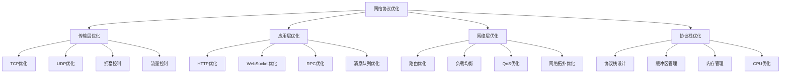

# 网络协议优化

## 📖 核心概念

**网络协议优化**是通过改进网络协议的设计和实现，提高网络传输效率、降低延迟、增强可靠性的技术。网络协议优化是现代网络系统性能提升的关键技术。

### 🏗️ 网络协议优化的组成要素



## 🔍 网络协议优化技术

### 传输层优化

| 优化技术 | 原理 | 优势 | 劣势 | 适用场景 |
|----------|------|------|------|----------|
| **TCP优化** | 改进TCP协议 | 提高传输效率 | 实现复杂 | 可靠传输 |
| **UDP优化** | 改进UDP协议 | 降低延迟 | 可靠性差 | 实时传输 |
| **拥塞控制** | 动态调整传输速率 | 避免网络拥塞 | 算法复杂 | 网络拥塞 |
| **流量控制** | 控制发送速率 | 避免接收方溢出 | 性能影响 | 流量控制 |

## 💻 网络协议优化实现

### TCP优化实现

```cpp
// TCP优化实现
class TCPOptimizer {
private:
    struct ConnectionState {
        int socketFd;
        string remoteAddress;
        int remotePort;
        size_t sendBufferSize;
        size_t receiveBufferSize;
        int tcpNoDelay;
        int keepAlive;
        int keepAliveIdle;
        int keepAliveInterval;
        int keepAliveProbes;
        
        ConnectionState(int fd, const string& addr, int port) 
            : socketFd(fd), remoteAddress(addr), remotePort(port),
              sendBufferSize(64 * 1024), receiveBufferSize(64 * 1024),
              tcpNoDelay(1), keepAlive(1), keepAliveIdle(600),
              keepAliveInterval(60), keepAliveProbes(3) {}
    };
    
    map<int, ConnectionState> connections;
    mutex connectionsMutex;
    
public:
    TCPOptimizer() {}
    
    // 创建优化的TCP连接
    int createOptimizedConnection(const string& host, int port) {
        int sockfd = socket(AF_INET, SOCK_STREAM, 0);
        if (sockfd < 0) {
            perror("socket creation failed");
            return -1;
        }
        
        // 设置socket选项
        if (!setSocketOptions(sockfd)) {
            close(sockfd);
            return -1;
        }
        
        // 连接服务器
        struct sockaddr_in serverAddr;
        serverAddr.sin_family = AF_INET;
        serverAddr.sin_port = htons(port);
        inet_pton(AF_INET, host.c_str(), &serverAddr.sin_addr);
        
        if (connect(sockfd, (struct sockaddr*)&serverAddr, sizeof(serverAddr)) < 0) {
            perror("connection failed");
            close(sockfd);
            return -1;
        }
        
        // 保存连接状态
        {
            lock_guard<mutex> lock(connectionsMutex);
            connections[sockfd] = ConnectionState(sockfd, host, port);
        }
        
        cout << "Optimized TCP connection created to " << host << ":" << port << endl;
        return sockfd;
    }
    
    // 设置socket选项
    bool setSocketOptions(int sockfd) {
        // 设置TCP_NODELAY
        int tcpNoDelay = 1;
        if (setsockopt(sockfd, IPPROTO_TCP, TCP_NODELAY, &tcpNoDelay, sizeof(tcpNoDelay)) < 0) {
            perror("setsockopt TCP_NODELAY failed");
            return false;
        }
        
        // 设置SO_KEEPALIVE
        int keepAlive = 1;
        if (setsockopt(sockfd, SOL_SOCKET, SO_KEEPALIVE, &keepAlive, sizeof(keepAlive)) < 0) {
            perror("setsockopt SO_KEEPALIVE failed");
            return false;
        }
        
        // 设置TCP_KEEPIDLE
        int keepIdle = 600;
        if (setsockopt(sockfd, IPPROTO_TCP, TCP_KEEPIDLE, &keepIdle, sizeof(keepIdle)) < 0) {
            perror("setsockopt TCP_KEEPIDLE failed");
            return false;
        }
        
        // 设置TCP_KEEPINTVL
        int keepInterval = 60;
        if (setsockopt(sockfd, IPPROTO_TCP, TCP_KEEPINTVL, &keepInterval, sizeof(keepInterval)) < 0) {
            perror("setsockopt TCP_KEEPINTVL failed");
            return false;
        }
        
        // 设置TCP_KEEPCNT
        int keepCount = 3;
        if (setsockopt(sockfd, IPPROTO_TCP, TCP_KEEPCNT, &keepCount, sizeof(keepCount)) < 0) {
            perror("setsockopt TCP_KEEPCNT failed");
            return false;
        }
        
        // 设置发送缓冲区大小
        int sendBufferSize = 64 * 1024;
        if (setsockopt(sockfd, SOL_SOCKET, SO_SNDBUF, &sendBufferSize, sizeof(sendBufferSize)) < 0) {
            perror("setsockopt SO_SNDBUF failed");
            return false;
        }
        
        // 设置接收缓冲区大小
        int receiveBufferSize = 64 * 1024;
        if (setsockopt(sockfd, SOL_SOCKET, SO_RCVBUF, &receiveBufferSize, sizeof(receiveBufferSize)) < 0) {
            perror("setsockopt SO_RCVBUF failed");
            return false;
        }
        
        return true;
    }
    
    // 发送数据
    ssize_t sendData(int sockfd, const void* data, size_t len) {
        lock_guard<mutex> lock(connectionsMutex);
        
        auto it = connections.find(sockfd);
        if (it == connections.end()) {
            return -1;
        }
        
        ssize_t bytesSent = send(sockfd, data, len, MSG_NOSIGNAL);
        if (bytesSent < 0) {
            perror("send failed");
            return -1;
        }
        
        cout << "Sent " << bytesSent << " bytes to " << it->second.remoteAddress << ":" << it->second.remotePort << endl;
        return bytesSent;
    }
    
    // 接收数据
    ssize_t receiveData(int sockfd, void* buffer, size_t len) {
        lock_guard<mutex> lock(connectionsMutex);
        
        auto it = connections.find(sockfd);
        if (it == connections.end()) {
            return -1;
        }
        
        ssize_t bytesReceived = recv(sockfd, buffer, len, 0);
        if (bytesReceived < 0) {
            perror("recv failed");
            return -1;
        }
        
        cout << "Received " << bytesReceived << " bytes from " << it->second.remoteAddress << ":" << it->second.remotePort << endl;
        return bytesReceived;
    }
    
    // 关闭连接
    void closeConnection(int sockfd) {
        lock_guard<mutex> lock(connectionsMutex);
        
        auto it = connections.find(sockfd);
        if (it != connections.end()) {
            close(sockfd);
            connections.erase(it);
            cout << "Connection closed: " << sockfd << endl;
        }
    }
    
    // 获取连接统计信息
    struct ConnectionStatistics {
        int totalConnections;
        size_t totalBytesSent;
        size_t totalBytesReceived;
        double averageLatency;
    };
    
    ConnectionStatistics getStatistics() {
        lock_guard<mutex> lock(connectionsMutex);
        
        ConnectionStatistics stats;
        stats.totalConnections = connections.size();
        stats.totalBytesSent = 0;
        stats.totalBytesReceived = 0;
        stats.averageLatency = 0;
        
        // 计算统计信息
        for (const auto& [sockfd, conn] : connections) {
            // 这里可以添加更详细的统计信息
        }
        
        return stats;
    }
};
```

### HTTP优化实现

```cpp
// HTTP优化实现
class HTTPOptimizer {
private:
    struct HTTPRequest {
        string method;
        string url;
        map<string, string> headers;
        string body;
        int timeout;
        
        HTTPRequest(const string& m, const string& u) 
            : method(m), url(u), timeout(30) {}
    };
    
    struct HTTPResponse {
        int statusCode;
        map<string, string> headers;
        string body;
        double responseTime;
        
        HTTPResponse() : statusCode(0), responseTime(0) {}
    };
    
    struct ConnectionPool {
        map<string, vector<int>> connections;
        mutex poolMutex;
        
        int getConnection(const string& host, int port) {
            lock_guard<mutex> lock(poolMutex);
            
            string key = host + ":" + to_string(port);
            auto it = connections.find(key);
            
            if (it != connections.end() && !it->second.empty()) {
                int sockfd = it->second.back();
                it->second.pop_back();
                return sockfd;
            }
            
            return -1;
        }
        
        void returnConnection(const string& host, int port, int sockfd) {
            lock_guard<mutex> lock(poolMutex);
            
            string key = host + ":" + to_string(port);
            connections[key].push_back(sockfd);
        }
    };
    
    ConnectionPool connectionPool;
    TCPOptimizer tcpOptimizer;
    
public:
    HTTPOptimizer() {}
    
    // 发送HTTP请求
    HTTPResponse sendRequest(const HTTPRequest& request) {
        HTTPResponse response;
        auto startTime = chrono::high_resolution_clock::now();
        
        // 解析URL
        string host, path;
        int port;
        if (!parseURL(request.url, host, path, port)) {
            response.statusCode = 400;
            return response;
        }
        
        // 获取连接
        int sockfd = connectionPool.getConnection(host, port);
        if (sockfd < 0) {
            sockfd = tcpOptimizer.createOptimizedConnection(host, port);
            if (sockfd < 0) {
                response.statusCode = 500;
                return response;
            }
        }
        
        // 构建HTTP请求
        string httpRequest = buildHTTPRequest(request, host, path);
        
        // 发送请求
        ssize_t bytesSent = tcpOptimizer.sendData(sockfd, httpRequest.c_str(), httpRequest.length());
        if (bytesSent < 0) {
            response.statusCode = 500;
            return response;
        }
        
        // 接收响应
        string httpResponse = receiveHTTPResponse(sockfd);
        if (httpResponse.empty()) {
            response.statusCode = 500;
            return response;
        }
        
        // 解析响应
        parseHTTPResponse(httpResponse, response);
        
        // 返回连接到池
        connectionPool.returnConnection(host, port, sockfd);
        
        // 计算响应时间
        auto endTime = chrono::high_resolution_clock::now();
        response.responseTime = chrono::duration<double, milli>(endTime - startTime).count();
        
        return response;
    }
    
    // 发送GET请求
    HTTPResponse get(const string& url, const map<string, string>& headers = {}) {
        HTTPRequest request("GET", url);
        request.headers = headers;
        return sendRequest(request);
    }
    
    // 发送POST请求
    HTTPResponse post(const string& url, const string& body, const map<string, string>& headers = {}) {
        HTTPRequest request("POST", url);
        request.headers = headers;
        request.body = body;
        return sendRequest(request);
    }
    
private:
    // 解析URL
    bool parseURL(const string& url, string& host, string& path, int& port) {
        // 简化的URL解析
        size_t protocolPos = url.find("://");
        if (protocolPos == string::npos) {
            return false;
        }
        
        size_t hostStart = protocolPos + 3;
        size_t pathPos = url.find("/", hostStart);
        
        if (pathPos == string::npos) {
            host = url.substr(hostStart);
            path = "/";
        } else {
            host = url.substr(hostStart, pathPos - hostStart);
            path = url.substr(pathPos);
        }
        
        // 解析端口
        size_t portPos = host.find(":");
        if (portPos != string::npos) {
            port = stoi(host.substr(portPos + 1));
            host = host.substr(0, portPos);
        } else {
            port = 80;
        }
        
        return true;
    }
    
    // 构建HTTP请求
    string buildHTTPRequest(const HTTPRequest& request, const string& host, const string& path) {
        stringstream ss;
        
        ss << request.method << " " << path << " HTTP/1.1\r\n";
        ss << "Host: " << host << "\r\n";
        ss << "Connection: keep-alive\r\n";
        ss << "User-Agent: HTTPOptimizer/1.0\r\n";
        
        // 添加自定义头部
        for (const auto& [key, value] : request.headers) {
            ss << key << ": " << value << "\r\n";
        }
        
        // 添加内容长度
        if (!request.body.empty()) {
            ss << "Content-Length: " << request.body.length() << "\r\n";
        }
        
        ss << "\r\n";
        
        // 添加请求体
        if (!request.body.empty()) {
            ss << request.body;
        }
        
        return ss.str();
    }
    
    // 接收HTTP响应
    string receiveHTTPResponse(int sockfd) {
        string response;
        char buffer[4096];
        
        while (true) {
            ssize_t bytesReceived = tcpOptimizer.receiveData(sockfd, buffer, sizeof(buffer));
            if (bytesReceived <= 0) {
                break;
            }
            
            response.append(buffer, bytesReceived);
            
            // 检查是否接收完整
            if (response.find("\r\n\r\n") != string::npos) {
                break;
            }
        }
        
        return response;
    }
    
    // 解析HTTP响应
    void parseHTTPResponse(const string& httpResponse, HTTPResponse& response) {
        stringstream ss(httpResponse);
        string line;
        
        // 解析状态行
        if (getline(ss, line)) {
            size_t spacePos1 = line.find(" ");
            size_t spacePos2 = line.find(" ", spacePos1 + 1);
            
            if (spacePos1 != string::npos && spacePos2 != string::npos) {
                response.statusCode = stoi(line.substr(spacePos1 + 1, spacePos2 - spacePos1 - 1));
            }
        }
        
        // 解析头部
        while (getline(ss, line) && line != "\r") {
            size_t colonPos = line.find(":");
            if (colonPos != string::npos) {
                string key = line.substr(0, colonPos);
                string value = line.substr(colonPos + 2);
                
                // 移除回车符
                if (!value.empty() && value.back() == '\r') {
                    value.pop_back();
                }
                
                response.headers[key] = value;
            }
        }
        
        // 解析响应体
        response.body = ss.str();
    }
    
public:
    // 获取统计信息
    struct HTTPStatistics {
        int totalRequests;
        int successfulRequests;
        int failedRequests;
        double averageResponseTime;
        double successRate;
    };
    
    HTTPStatistics getStatistics() {
        HTTPStatistics stats;
        stats.totalRequests = 0;
        stats.successfulRequests = 0;
        stats.failedRequests = 0;
        stats.averageResponseTime = 0;
        stats.successRate = 0;
        
        // 这里可以添加更详细的统计信息
        return stats;
    }
};
```

### 网络协议优化测试

```cpp
// 网络协议优化测试
class NetworkOptimizationTest {
public:
    static void runAllTests() {
        cout << "=== Network Optimization Tests ===" << endl;
        
        // 测试TCP优化
        testTCPOptimization();
        
        cout << "\n" << string(50, '=') << endl;
        
        // 测试HTTP优化
        testHTTPOptimization();
    }
    
private:
    static void testTCPOptimization() {
        cout << "=== TCP Optimization Test ===" << endl;
        
        TCPOptimizer tcpOptimizer;
        
        // 创建优化的TCP连接
        int sockfd = tcpOptimizer.createOptimizedConnection("127.0.0.1", 8080);
        if (sockfd < 0) {
            cout << "Failed to create TCP connection" << endl;
            return;
        }
        
        // 发送数据
        string message = "Hello, TCP Optimization!";
        ssize_t bytesSent = tcpOptimizer.sendData(sockfd, message.c_str(), message.length());
        cout << "Sent " << bytesSent << " bytes" << endl;
        
        // 接收数据
        char buffer[1024];
        ssize_t bytesReceived = tcpOptimizer.receiveData(sockfd, buffer, sizeof(buffer));
        if (bytesReceived > 0) {
            buffer[bytesReceived] = '\0';
            cout << "Received: " << buffer << endl;
        }
        
        // 关闭连接
        tcpOptimizer.closeConnection(sockfd);
        
        // 获取统计信息
        auto stats = tcpOptimizer.getStatistics();
        cout << "\nTCP statistics:" << endl;
        cout << "Total connections: " << stats.totalConnections << endl;
        cout << "Total bytes sent: " << stats.totalBytesSent << endl;
        cout << "Total bytes received: " << stats.totalBytesReceived << endl;
        cout << "Average latency: " << stats.averageLatency << " ms" << endl;
    }
    
    static void testHTTPOptimization() {
        cout << "=== HTTP Optimization Test ===" << endl;
        
        HTTPOptimizer httpOptimizer;
        
        // 发送GET请求
        auto response = httpOptimizer.get("http://httpbin.org/get");
        cout << "GET request status: " << response.statusCode << endl;
        cout << "Response time: " << response.responseTime << " ms" << endl;
        
        // 发送POST请求
        map<string, string> headers;
        headers["Content-Type"] = "application/json";
        
        string jsonBody = "{\"message\": \"Hello, HTTP Optimization!\"}";
        auto postResponse = httpOptimizer.post("http://httpbin.org/post", jsonBody, headers);
        cout << "POST request status: " << postResponse.statusCode << endl;
        cout << "Response time: " << postResponse.responseTime << " ms" << endl;
        
        // 获取统计信息
        auto stats = httpOptimizer.getStatistics();
        cout << "\nHTTP statistics:" << endl;
        cout << "Total requests: " << stats.totalRequests << endl;
        cout << "Successful requests: " << stats.successfulRequests << endl;
        cout << "Failed requests: " << stats.failedRequests << endl;
        cout << "Success rate: " << stats.successRate << "%" << endl;
        cout << "Average response time: " << stats.averageResponseTime << " ms" << endl;
    }
};
```

## ⚡ 复杂度分析

### 网络协议优化复杂度

| 优化技术 | 时间复杂度 | 空间复杂度 | 网络开销 | 适用场景 |
|----------|------------|------------|----------|----------|
| **TCP优化** | O(1) | O(1) | 低 | 可靠传输 |
| **UDP优化** | O(1) | O(1) | 极低 | 实时传输 |
| **HTTP优化** | O(1) | O(n) | 中 | Web应用 |
| **连接池** | O(1) | O(n) | 低 | 高并发 |

## 🎓 学习要点总结

### 核心理解

1. **协议栈**：理解网络协议栈的结构
2. **优化技术**：掌握各种优化技术
3. **性能分析**：学会分析网络性能
4. **实际应用**：将优化技术应用到实际场景

### 实践要点

1. **系统设计**：设计优化的网络系统
2. **性能测试**：测试网络性能
3. **问题诊断**：诊断网络问题
4. **持续优化**：持续优化网络性能

### 应用思维

1. **系统思维**：从系统角度思考问题
2. **性能思维**：关注性能优化
3. **问题思维**：解决实际问题
4. **实际应用**：将技术应用到实际问题中

---

**相关链接：**
- [[06-应用实战/04-网络应用/01-网络基础|网络基础]] - 网络基础知识
- [[06-应用实战/04-网络应用/02-负载均衡|负载均衡]] - 负载均衡技术
- [[06-应用实战/04-网络应用/04-分布式系统|分布式系统]] - 分布式系统基础
- [[07-练习战场/01-代码实现/06-系统编程|系统编程]] - 系统编程基础
