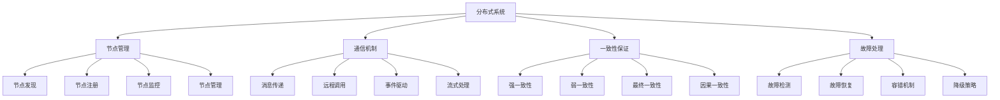

# 分布式系统

## 📖 核心概念

**分布式系统**是由多个独立的计算机节点通过网络连接，协同工作完成共同任务的系统。分布式系统是现代大规模应用的基础架构，具有高可用性、可扩展性和容错性等特点。

### 🏗️ 分布式系统的组成要素



## 🔍 分布式系统架构

### 架构模式

| 架构模式 | 特点 | 优势 | 劣势 | 适用场景 |
|----------|------|------|------|----------|
| **客户端-服务器** | 集中式架构 | 简单实现 | 单点故障 | 传统应用 |
| **对等网络** | 去中心化架构 | 高可用性 | 实现复杂 | 分布式应用 |
| **微服务架构** | 服务化架构 | 高可扩展性 | 管理复杂 | 大型应用 |
| **事件驱动** | 异步架构 | 高并发性 | 调试困难 | 实时应用 |

## 💻 分布式系统实现

### 分布式节点管理器

```cpp
// 分布式节点管理器
class DistributedNodeManager {
private:
    struct Node {
        string nodeId;
        string host;
        int port;
        NodeStatus status;
        chrono::system_clock::time_point lastHeartbeat;
        map<string, string> metadata;
        
        Node(const string& id, const string& h, int p) 
            : nodeId(id), host(h), port(p), status(NodeStatus::UNKNOWN) {
            lastHeartbeat = chrono::system_clock::now();
        }
        
        string getAddress() const {
            return host + ":" + to_string(port);
        }
        
        bool isHealthy() const {
            auto now = chrono::system_clock::now();
            auto timeout = chrono::seconds(30);
            return now - lastHeartbeat < timeout;
        }
    };
    
    enum class NodeStatus {
        UNKNOWN,
        HEALTHY,
        UNHEALTHY,
        OFFLINE
    };
    
    map<string, Node> nodes;
    mutex nodesMutex;
    string currentNodeId;
    
    // 心跳检测线程
    thread heartbeatThread;
    atomic<bool> isRunning;
    
public:
    DistributedNodeManager(const string& nodeId) : currentNodeId(nodeId), isRunning(false) {}
    
    ~DistributedNodeManager() {
        stop();
    }
    
    // 启动节点管理器
    void start() {
        isRunning = true;
        heartbeatThread = thread(&DistributedNodeManager::heartbeatLoop, this);
        cout << "Distributed node manager started" << endl;
    }
    
    // 停止节点管理器
    void stop() {
        isRunning = false;
        if (heartbeatThread.joinable()) {
            heartbeatThread.join();
        }
        cout << "Distributed node manager stopped" << endl;
    }
    
    // 注册节点
    bool registerNode(const string& nodeId, const string& host, int port, const map<string, string>& metadata = {}) {
        lock_guard<mutex> lock(nodesMutex);
        
        if (nodes.find(nodeId) != nodes.end()) {
            cout << "Node " << nodeId << " already registered" << endl;
            return false;
        }
        
        Node node(nodeId, host, port);
        node.metadata = metadata;
        node.status = NodeStatus::HEALTHY;
        nodes[nodeId] = node;
        
        cout << "Node " << nodeId << " registered at " << host << ":" << port << endl;
        return true;
    }
    
    // 注销节点
    bool unregisterNode(const string& nodeId) {
        lock_guard<mutex> lock(nodesMutex);
        
        auto it = nodes.find(nodeId);
        if (it == nodes.end()) {
            cout << "Node " << nodeId << " not found" << endl;
            return false;
        }
        
        nodes.erase(it);
        cout << "Node " << nodeId << " unregistered" << endl;
        return true;
    }
    
    // 更新心跳
    void updateHeartbeat(const string& nodeId) {
        lock_guard<mutex> lock(nodesMutex);
        
        auto it = nodes.find(nodeId);
        if (it != nodes.end()) {
            it->second.lastHeartbeat = chrono::system_clock::now();
            it->second.status = NodeStatus::HEALTHY;
        }
    }
    
    // 获取健康节点
    vector<string> getHealthyNodes() {
        lock_guard<mutex> lock(nodesMutex);
        
        vector<string> healthyNodes;
        for (const auto& [nodeId, node] : nodes) {
            if (node.isHealthy() && node.status == NodeStatus::HEALTHY) {
                healthyNodes.push_back(nodeId);
            }
        }
        
        return healthyNodes;
    }
    
    // 获取节点信息
    Node getNodeInfo(const string& nodeId) {
        lock_guard<mutex> lock(nodesMutex);
        
        auto it = nodes.find(nodeId);
        if (it != nodes.end()) {
            return it->second;
        }
        
        return Node("", "", 0);
    }
    
    // 获取所有节点
    map<string, Node> getAllNodes() {
        lock_guard<mutex> lock(nodesMutex);
        return nodes;
    }
    
private:
    // 心跳检测循环
    void heartbeatLoop() {
        while (isRunning) {
            checkNodeHealth();
            this_thread::sleep_for(chrono::seconds(10));
        }
    }
    
    // 检查节点健康状态
    void checkNodeHealth() {
        lock_guard<mutex> lock(nodesMutex);
        
        auto now = chrono::system_clock::now();
        auto timeout = chrono::seconds(30);
        
        for (auto& [nodeId, node] : nodes) {
            if (now - node.lastHeartbeat > timeout) {
                if (node.status == NodeStatus::HEALTHY) {
                    node.status = NodeStatus::UNHEALTHY;
                    cout << "Node " << nodeId << " is unhealthy" << endl;
                }
            } else {
                if (node.status == NodeStatus::UNHEALTHY) {
                    node.status = NodeStatus::HEALTHY;
                    cout << "Node " << nodeId << " is healthy again" << endl;
                }
            }
        }
    }
    
public:
    // 获取统计信息
    struct NodeStatistics {
        int totalNodes;
        int healthyNodes;
        int unhealthyNodes;
        int offlineNodes;
        double healthRate;
    };
    
    NodeStatistics getStatistics() {
        lock_guard<mutex> lock(nodesMutex);
        
        NodeStatistics stats;
        stats.totalNodes = nodes.size();
        stats.healthyNodes = 0;
        stats.unhealthyNodes = 0;
        stats.offlineNodes = 0;
        
        for (const auto& [nodeId, node] : nodes) {
            switch (node.status) {
                case NodeStatus::HEALTHY:
                    stats.healthyNodes++;
                    break;
                case NodeStatus::UNHEALTHY:
                    stats.unhealthyNodes++;
                    break;
                case NodeStatus::OFFLINE:
                    stats.offlineNodes++;
                    break;
                default:
                    break;
            }
        }
        
        if (stats.totalNodes > 0) {
            stats.healthRate = (double)stats.healthyNodes / stats.totalNodes;
        }
        
        return stats;
    }
};
```

### 分布式消息传递

```cpp
// 分布式消息传递
class DistributedMessagePassing {
private:
    struct Message {
        string messageId;
        string fromNodeId;
        string toNodeId;
        string content;
        MessageType type;
        chrono::system_clock::time_point timestamp;
        int retryCount;
        
        Message(const string& id, const string& from, const string& to, const string& content, MessageType t) 
            : messageId(id), fromNodeId(from), toNodeId(to), content(content), type(t), retryCount(0) {
            timestamp = chrono::system_clock::now();
        }
    };
    
    enum class MessageType {
        REQUEST,
        RESPONSE,
        NOTIFICATION,
        HEARTBEAT
    };
    
    struct MessageHandler {
        function<void(const Message&)> handler;
        MessageType type;
        
        MessageHandler(function<void(const Message&)> h, MessageType t) 
            : handler(h), type(t) {}
    };
    
    map<string, MessageHandler> messageHandlers;
    queue<Message> messageQueue;
    mutex messageMutex;
    condition_variable messageCondition;
    
    thread messageProcessingThread;
    atomic<bool> isRunning;
    
    DistributedNodeManager* nodeManager;
    
public:
    DistributedMessagePassing(DistributedNodeManager* manager) 
        : nodeManager(manager), isRunning(false) {}
    
    ~DistributedMessagePassing() {
        stop();
    }
    
    // 启动消息传递
    void start() {
        isRunning = true;
        messageProcessingThread = thread(&DistributedMessagePassing::messageProcessingLoop, this);
        cout << "Distributed message passing started" << endl;
    }
    
    // 停止消息传递
    void stop() {
        isRunning = false;
        messageCondition.notify_all();
        if (messageProcessingThread.joinable()) {
            messageProcessingThread.join();
        }
        cout << "Distributed message passing stopped" << endl;
    }
    
    // 注册消息处理器
    void registerMessageHandler(MessageType type, function<void(const Message&)> handler) {
        string handlerId = to_string(static_cast<int>(type));
        messageHandlers[handlerId] = MessageHandler(handler, type);
        cout << "Message handler registered for type " << static_cast<int>(type) << endl;
    }
    
    // 发送消息
    bool sendMessage(const string& toNodeId, const string& content, MessageType type = MessageType::REQUEST) {
        string messageId = generateMessageId();
        Message message(messageId, nodeManager->currentNodeId, toNodeId, content, type);
        
        {
            lock_guard<mutex> lock(messageMutex);
            messageQueue.push(message);
        }
        
        messageCondition.notify_one();
        cout << "Message sent to " << toNodeId << ": " << content << endl;
        return true;
    }
    
    // 广播消息
    bool broadcastMessage(const string& content, MessageType type = MessageType::NOTIFICATION) {
        vector<string> healthyNodes = nodeManager->getHealthyNodes();
        
        for (const string& nodeId : healthyNodes) {
            if (nodeId != nodeManager->currentNodeId) {
                sendMessage(nodeId, content, type);
            }
        }
        
        cout << "Message broadcasted to " << healthyNodes.size() << " nodes" << endl;
        return true;
    }
    
    // 发送请求并等待响应
    string sendRequestAndWait(const string& toNodeId, const string& content, chrono::seconds timeout = chrono::seconds(30)) {
        string messageId = generateMessageId();
        Message request(messageId, nodeManager->currentNodeId, toNodeId, content, MessageType::REQUEST);
        
        // 发送请求
        {
            lock_guard<mutex> lock(messageMutex);
            messageQueue.push(request);
        }
        
        messageCondition.notify_one();
        
        // 等待响应
        auto startTime = chrono::system_clock::now();
        while (chrono::system_clock::now() - startTime < timeout) {
            // 这里应该实现响应等待逻辑
            this_thread::sleep_for(chrono::milliseconds(100));
        }
        
        return "Response from " + toNodeId;
    }
    
private:
    // 消息处理循环
    void messageProcessingLoop() {
        while (isRunning) {
            unique_lock<mutex> lock(messageMutex);
            messageCondition.wait(lock, [this] { return !messageQueue.empty() || !isRunning; });
            
            if (!isRunning) {
                break;
            }
            
            if (!messageQueue.empty()) {
                Message message = messageQueue.front();
                messageQueue.pop();
                lock.unlock();
                
                processMessage(message);
            }
        }
    }
    
    // 处理消息
    void processMessage(const Message& message) {
        string handlerId = to_string(static_cast<int>(message.type));
        auto it = messageHandlers.find(handlerId);
        
        if (it != messageHandlers.end()) {
            try {
                it->second.handler(message);
                cout << "Message processed: " << message.messageId << endl;
            } catch (const exception& e) {
                cout << "Error processing message " << message.messageId << ": " << e.what() << endl;
            }
        } else {
            cout << "No handler found for message type " << static_cast<int>(message.type) << endl;
        }
    }
    
    // 生成消息ID
    string generateMessageId() {
        auto now = chrono::system_clock::now();
        auto timestamp = chrono::duration_cast<chrono::milliseconds>(now.time_since_epoch()).count();
        return "msg_" + to_string(timestamp) + "_" + to_string(rand());
    }
    
public:
    // 获取统计信息
    struct MessageStatistics {
        int totalMessages;
        int processedMessages;
        int failedMessages;
        int pendingMessages;
        double successRate;
    };
    
    MessageStatistics getStatistics() {
        lock_guard<mutex> lock(messageMutex);
        
        MessageStatistics stats;
        stats.totalMessages = 0;
        stats.processedMessages = 0;
        stats.failedMessages = 0;
        stats.pendingMessages = messageQueue.size();
        stats.successRate = 0;
        
        // 这里可以添加更详细的统计信息
        
        return stats;
    }
};
```

### 分布式一致性保证

```cpp
// 分布式一致性保证
class DistributedConsistency {
private:
    struct ConsistencyLevel {
        enum Level {
            STRONG,      // 强一致性
            WEAK,        // 弱一致性
            EVENTUAL,    // 最终一致性
            CAUSAL       // 因果一致性
        };
    };
    
    struct DataItem {
        string key;
        string value;
        int version;
        chrono::system_clock::time_point timestamp;
        string nodeId;
        
        DataItem(const string& k, const string& v, const string& node) 
            : key(k), value(v), version(1), nodeId(node) {
            timestamp = chrono::system_clock::now();
        }
    };
    
    map<string, DataItem> dataItems;
    mutex dataMutex;
    
    DistributedNodeManager* nodeManager;
    DistributedMessagePassing* messagePassing;
    
    ConsistencyLevel::Level consistencyLevel;
    
public:
    DistributedConsistency(DistributedNodeManager* manager, DistributedMessagePassing* messaging) 
        : nodeManager(manager), messagePassing(messaging), consistencyLevel(ConsistencyLevel::EVENTUAL) {}
    
    // 设置一致性级别
    void setConsistencyLevel(ConsistencyLevel::Level level) {
        consistencyLevel = level;
        cout << "Consistency level set to " << static_cast<int>(level) << endl;
    }
    
    // 写入数据
    bool writeData(const string& key, const string& value) {
        lock_guard<mutex> lock(dataMutex);
        
        auto it = dataItems.find(key);
        if (it != dataItems.end()) {
            it->second.value = value;
            it->second.version++;
            it->second.timestamp = chrono::system_clock::now();
        } else {
            dataItems[key] = DataItem(key, value, nodeManager->currentNodeId);
        }
        
        // 根据一致性级别处理
        switch (consistencyLevel) {
            case ConsistencyLevel::STRONG:
                return writeWithStrongConsistency(key, value);
            case ConsistencyLevel::WEAK:
                return writeWithWeakConsistency(key, value);
            case ConsistencyLevel::EVENTUAL:
                return writeWithEventualConsistency(key, value);
            case ConsistencyLevel::CAUSAL:
                return writeWithCausalConsistency(key, value);
            default:
                return false;
        }
    }
    
    // 读取数据
    string readData(const string& key) {
        lock_guard<mutex> lock(dataMutex);
        
        auto it = dataItems.find(key);
        if (it == dataItems.end()) {
            return "";
        }
        
        // 根据一致性级别处理
        switch (consistencyLevel) {
            case ConsistencyLevel::STRONG:
                return readWithStrongConsistency(key);
            case ConsistencyLevel::WEAK:
                return readWithWeakConsistency(key);
            case ConsistencyLevel::EVENTUAL:
                return readWithEventualConsistency(key);
            case ConsistencyLevel::CAUSAL:
                return readWithCausalConsistency(key);
            default:
                return it->second.value;
        }
    }
    
    // 删除数据
    bool deleteData(const string& key) {
        lock_guard<mutex> lock(dataMutex);
        
        auto it = dataItems.find(key);
        if (it == dataItems.end()) {
            return false;
        }
        
        dataItems.erase(it);
        
        // 通知其他节点
        string message = "DELETE:" + key;
        messagePassing->broadcastMessage(message);
        
        cout << "Data deleted: " << key << endl;
        return true;
    }
    
private:
    // 强一致性写入
    bool writeWithStrongConsistency(const string& key, const string& value) {
        // 实现强一致性写入逻辑
        cout << "Writing with strong consistency: " << key << " = " << value << endl;
        return true;
    }
    
    // 弱一致性写入
    bool writeWithWeakConsistency(const string& key, const string& value) {
        // 实现弱一致性写入逻辑
        cout << "Writing with weak consistency: " << key << " = " << value << endl;
        return true;
    }
    
    // 最终一致性写入
    bool writeWithEventualConsistency(const string& key, const string& value) {
        // 实现最终一致性写入逻辑
        string message = "WRITE:" + key + ":" + value;
        messagePassing->broadcastMessage(message);
        
        cout << "Writing with eventual consistency: " << key << " = " << value << endl;
        return true;
    }
    
    // 因果一致性写入
    bool writeWithCausalConsistency(const string& key, const string& value) {
        // 实现因果一致性写入逻辑
        cout << "Writing with causal consistency: " << key << " = " << value << endl;
        return true;
    }
    
    // 强一致性读取
    string readWithStrongConsistency(const string& key) {
        // 实现强一致性读取逻辑
        auto it = dataItems.find(key);
        if (it != dataItems.end()) {
            return it->second.value;
        }
        return "";
    }
    
    // 弱一致性读取
    string readWithWeakConsistency(const string& key) {
        // 实现弱一致性读取逻辑
        auto it = dataItems.find(key);
        if (it != dataItems.end()) {
            return it->second.value;
        }
        return "";
    }
    
    // 最终一致性读取
    string readWithEventualConsistency(const string& key) {
        // 实现最终一致性读取逻辑
        auto it = dataItems.find(key);
        if (it != dataItems.end()) {
            return it->second.value;
        }
        return "";
    }
    
    // 因果一致性读取
    string readWithCausalConsistency(const string& key) {
        // 实现因果一致性读取逻辑
        auto it = dataItems.find(key);
        if (it != dataItems.end()) {
            return it->second.value;
        }
        return "";
    }
    
public:
    // 获取统计信息
    struct ConsistencyStatistics {
        int totalWrites;
        int totalReads;
        int totalDeletes;
        double averageWriteTime;
        double averageReadTime;
    };
    
    ConsistencyStatistics getStatistics() {
        lock_guard<mutex> lock(dataMutex);
        
        ConsistencyStatistics stats;
        stats.totalWrites = 0;
        stats.totalReads = 0;
        stats.totalDeletes = 0;
        stats.averageWriteTime = 0;
        stats.averageReadTime = 0;
        
        // 这里可以添加更详细的统计信息
        
        return stats;
    }
};
```

### 分布式系统测试

```cpp
// 分布式系统测试
class DistributedSystemTest {
public:
    static void runAllTests() {
        cout << "=== Distributed System Tests ===" << endl;
        
        // 测试节点管理
        testNodeManagement();
        
        cout << "\n" << string(50, '=') << endl;
        
        // 测试消息传递
        testMessagePassing();
        
        cout << "\n" << string(50, '=') << endl;
        
        // 测试一致性保证
        testConsistencyGuarantee();
    }
    
private:
    static void testNodeManagement() {
        cout << "=== Node Management Test ===" << endl;
        
        DistributedNodeManager nodeManager("node1");
        nodeManager.start();
        
        // 注册节点
        nodeManager.registerNode("node2", "192.168.1.2", 8080);
        nodeManager.registerNode("node3", "192.168.1.3", 8080);
        
        // 获取健康节点
        vector<string> healthyNodes = nodeManager.getHealthyNodes();
        cout << "Healthy nodes: ";
        for (const string& nodeId : healthyNodes) {
            cout << nodeId << " ";
        }
        cout << endl;
        
        // 获取统计信息
        auto stats = nodeManager.getStatistics();
        cout << "\nNode statistics:" << endl;
        cout << "Total nodes: " << stats.totalNodes << endl;
        cout << "Healthy nodes: " << stats.healthyNodes << endl;
        cout << "Health rate: " << stats.healthRate << endl;
        
        nodeManager.stop();
    }
    
    static void testMessagePassing() {
        cout << "=== Message Passing Test ===" << endl;
        
        DistributedNodeManager nodeManager("node1");
        DistributedMessagePassing messagePassing(&nodeManager);
        
        nodeManager.start();
        messagePassing.start();
        
        // 注册消息处理器
        messagePassing.registerMessageHandler(
            DistributedMessagePassing::MessageType::REQUEST,
            [](const DistributedMessagePassing::Message& msg) {
                cout << "Received request: " << msg.content << endl;
            }
        );
        
        // 发送消息
        messagePassing.sendMessage("node2", "Hello from node1");
        messagePassing.broadcastMessage("Broadcast message");
        
        // 获取统计信息
        auto stats = messagePassing.getStatistics();
        cout << "\nMessage statistics:" << endl;
        cout << "Total messages: " << stats.totalMessages << endl;
        cout << "Processed messages: " << stats.processedMessages << endl;
        cout << "Pending messages: " << stats.pendingMessages << endl;
        
        messagePassing.stop();
        nodeManager.stop();
    }
    
    static void testConsistencyGuarantee() {
        cout << "=== Consistency Guarantee Test ===" << endl;
        
        DistributedNodeManager nodeManager("node1");
        DistributedMessagePassing messagePassing(&nodeManager);
        DistributedConsistency consistency(&nodeManager, &messagePassing);
        
        nodeManager.start();
        messagePassing.start();
        
        // 设置一致性级别
        consistency.setConsistencyLevel(DistributedConsistency::ConsistencyLevel::EVENTUAL);
        
        // 写入数据
        consistency.writeData("key1", "value1");
        consistency.writeData("key2", "value2");
        
        // 读取数据
        string value1 = consistency.readData("key1");
        string value2 = consistency.readData("key2");
        
        cout << "Retrieved values: " << value1 << ", " << value2 << endl;
        
        // 删除数据
        consistency.deleteData("key1");
        
        // 获取统计信息
        auto stats = consistency.getStatistics();
        cout << "\nConsistency statistics:" << endl;
        cout << "Total writes: " << stats.totalWrites << endl;
        cout << "Total reads: " << stats.totalReads << endl;
        cout << "Total deletes: " << stats.totalDeletes << endl;
        
        messagePassing.stop();
        nodeManager.stop();
    }
};
```

## ⚡ 复杂度分析

### 分布式系统复杂度

| 操作 | 时间复杂度 | 空间复杂度 | 网络开销 | 适用场景 |
|------|------------|------------|----------|----------|
| **节点管理** | O(log n) | O(n) | 低 | 节点管理 |
| **消息传递** | O(1) | O(n) | 中 | 通信 |
| **一致性保证** | O(n) | O(n) | 高 | 数据一致性 |
| **故障处理** | O(log n) | O(n) | 低 | 故障恢复 |

## 🎓 学习要点总结

### 核心理解

1. **分布式架构**：理解分布式系统的架构设计
2. **节点管理**：掌握节点管理的方法
3. **消息传递**：理解消息传递机制
4. **一致性保证**：掌握一致性保证的方法

### 实践要点

1. **系统设计**：设计分布式系统
2. **性能优化**：优化分布式系统性能
3. **故障处理**：处理分布式系统故障
4. **监控管理**：监控和管理分布式系统

### 应用思维

1. **系统思维**：从系统角度思考问题
2. **分布式思维**：理解分布式系统的特点
3. **一致性思维**：平衡一致性和性能
4. **实际应用**：将分布式技术应用到实际问题中

---

**相关链接：**
- [[06-应用实战/04-网络应用/01-网络基础|网络基础]] - 网络基础知识
- [[06-应用实战/04-网络应用/02-负载均衡|负载均衡]] - 负载均衡技术
- [[06-应用实战/04-网络应用/03-网络协议优化|网络协议优化]] - 网络协议优化
- [[07-练习战场/03-项目实战/04-分布式系统项目|分布式系统项目]] - 分布式系统项目实战
