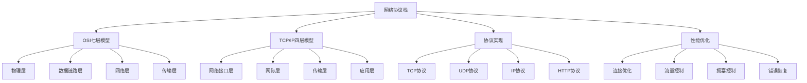

# 网络协议栈

## 📖 核心概念

**网络协议栈**是计算机网络中分层协议的总称，每一层都有特定的功能和协议。通过分层设计，网络协议栈实现了模块化、可扩展性和互操作性，是现代网络通信的基础。

### 🏗️ 网络协议栈分类



## 🔧 网络协议栈实现

### TCP协议实现

```cpp
class TCPProtocol {
private:
    struct TCPHeader {
        uint16_t sourcePort;
        uint16_t destPort;
        uint32_t sequenceNumber;
        uint32_t acknowledgmentNumber;
        uint8_t dataOffset;
        uint8_t flags;
        uint16_t windowSize;
        uint16_t checksum;
        uint16_t urgentPointer;
        
        TCPHeader() : sourcePort(0), destPort(0), sequenceNumber(0), acknowledgmentNumber(0),
                     dataOffset(5), flags(0), windowSize(0), checksum(0), urgentPointer(0) {}
    };
    
    struct TCPConnection {
        uint32_t localIP;
        uint32_t remoteIP;
        uint16_t localPort;
        uint16_t remotePort;
        uint32_t sequenceNumber;
        uint32_t acknowledgmentNumber;
        uint32_t windowSize;
        enum State { CLOSED, LISTEN, SYN_SENT, SYN_RECEIVED, ESTABLISHED, FIN_WAIT_1, FIN_WAIT_2, CLOSE_WAIT, CLOSING, LAST_ACK, TIME_WAIT } state;
        chrono::time_point<chrono::high_resolution_clock> lastActivity;
        
        TCPConnection(uint32_t local, uint32_t remote, uint16_t localP, uint16_t remoteP) 
            : localIP(local), remoteIP(remote), localPort(localP), remotePort(remoteP),
              sequenceNumber(0), acknowledgmentNumber(0), windowSize(65535), state(CLOSED) {
            lastActivity = chrono::high_resolution_clock::now();
        }
    };
    
    map<string, TCPConnection> connections;
    mutex protocolMutex;
    
public:
    TCPProtocol() {}
    
    // 创建TCP连接
    bool createConnection(uint32_t localIP, uint32_t remoteIP, uint16_t localPort, uint16_t remotePort) {
        lock_guard<mutex> lock(protocolMutex);
        
        string connectionKey = generateConnectionKey(localIP, remoteIP, localPort, remotePort);
        
        if (connections.find(connectionKey) != connections.end()) {
            cout << "Connection already exists: " << connectionKey << endl;
            return false;
        }
        
        TCPConnection conn(localIP, remoteIP, localPort, remotePort);
        connections[connectionKey] = conn;
        
        cout << "Created TCP connection: " << connectionKey << endl;
        return true;
    }
    
    // 发送SYN包
    bool sendSYN(const string& connectionKey) {
        lock_guard<mutex> lock(protocolMutex);
        
        auto it = connections.find(connectionKey);
        if (it == connections.end()) {
            cout << "Connection not found: " << connectionKey << endl;
            return false;
        }
        
        TCPConnection& conn = it->second;
        
        if (conn.state != TCPConnection::CLOSED && conn.state != TCPConnection::LISTEN) {
            cout << "Invalid state for SYN: " << conn.state << endl;
            return false;
        }
        
        // 创建SYN包
        TCPHeader synHeader;
        synHeader.sourcePort = conn.localPort;
        synHeader.destPort = conn.remotePort;
        synHeader.sequenceNumber = conn.sequenceNumber;
        synHeader.flags = 0x02; // SYN flag
        synHeader.windowSize = conn.windowSize;
        
        conn.state = TCPConnection::SYN_SENT;
        conn.lastActivity = chrono::high_resolution_clock::now();
        
        cout << "Sent SYN packet: " << connectionKey << " (seq: " << conn.sequenceNumber << ")" << endl;
        return true;
    }
    
    // 接收SYN-ACK包
    bool receiveSYNACK(const string& connectionKey, uint32_t ackNumber) {
        lock_guard<mutex> lock(protocolMutex);
        
        auto it = connections.find(connectionKey);
        if (it == connections.end()) {
            cout << "Connection not found: " << connectionKey << endl;
            return false;
        }
        
        TCPConnection& conn = it->second;
        
        if (conn.state != TCPConnection::SYN_SENT) {
            cout << "Invalid state for SYN-ACK: " << conn.state << endl;
            return false;
        }
        
        conn.acknowledgmentNumber = ackNumber;
        conn.state = TCPConnection::ESTABLISHED;
        conn.lastActivity = chrono::high_resolution_clock::now();
        
        cout << "Received SYN-ACK packet: " << connectionKey << " (ack: " << ackNumber << ")" << endl;
        return true;
    }
    
    // 发送数据
    bool sendData(const string& connectionKey, const string& data) {
        lock_guard<mutex> lock(protocolMutex);
        
        auto it = connections.find(connectionKey);
        if (it == connections.end()) {
            cout << "Connection not found: " << connectionKey << endl;
            return false;
        }
        
        TCPConnection& conn = it->second;
        
        if (conn.state != TCPConnection::ESTABLISHED) {
            cout << "Connection not established: " << conn.state << endl;
            return false;
        }
        
        // 创建数据包
        TCPHeader dataHeader;
        dataHeader.sourcePort = conn.localPort;
        dataHeader.destPort = conn.remotePort;
        dataHeader.sequenceNumber = conn.sequenceNumber;
        dataHeader.acknowledgmentNumber = conn.acknowledgmentNumber;
        dataHeader.flags = 0x10; // ACK flag
        dataHeader.windowSize = conn.windowSize;
        
        conn.sequenceNumber += data.length();
        conn.lastActivity = chrono::high_resolution_clock::now();
        
        cout << "Sent data packet: " << connectionKey << " (seq: " << conn.sequenceNumber 
             << ", data length: " << data.length() << ")" << endl;
        return true;
    }
    
    // 接收数据
    bool receiveData(const string& connectionKey, const string& data, uint32_t seqNumber) {
        lock_guard<mutex> lock(protocolMutex);
        
        auto it = connections.find(connectionKey);
        if (it == connections.end()) {
            cout << "Connection not found: " << connectionKey << endl;
            return false;
        }
        
        TCPConnection& conn = it->second;
        
        if (conn.state != TCPConnection::ESTABLISHED) {
            cout << "Connection not established: " << conn.state << endl;
            return false;
        }
        
        // 检查序列号
        if (seqNumber != conn.acknowledgmentNumber) {
            cout << "Sequence number mismatch: expected " << conn.acknowledgmentNumber 
                 << ", got " << seqNumber << endl;
            return false;
        }
        
        conn.acknowledgmentNumber += data.length();
        conn.lastActivity = chrono::high_resolution_clock::now();
        
        cout << "Received data packet: " << connectionKey << " (seq: " << seqNumber 
             << ", data length: " << data.length() << ")" << endl;
        return true;
    }
    
    // 发送FIN包
    bool sendFIN(const string& connectionKey) {
        lock_guard<mutex> lock(protocolMutex);
        
        auto it = connections.find(connectionKey);
        if (it == connections.end()) {
            cout << "Connection not found: " << connectionKey << endl;
            return false;
        }
        
        TCPConnection& conn = it->second;
        
        if (conn.state != TCPConnection::ESTABLISHED) {
            cout << "Invalid state for FIN: " << conn.state << endl;
            return false;
        }
        
        // 创建FIN包
        TCPHeader finHeader;
        finHeader.sourcePort = conn.localPort;
        finHeader.destPort = conn.remotePort;
        finHeader.sequenceNumber = conn.sequenceNumber;
        finHeader.acknowledgmentNumber = conn.acknowledgmentNumber;
        finHeader.flags = 0x01; // FIN flag
        finHeader.windowSize = conn.windowSize;
        
        conn.state = TCPConnection::FIN_WAIT_1;
        conn.lastActivity = chrono::high_resolution_clock::now();
        
        cout << "Sent FIN packet: " << connectionKey << " (seq: " << conn.sequenceNumber << ")" << endl;
        return true;
    }
    
    // 关闭连接
    bool closeConnection(const string& connectionKey) {
        lock_guard<mutex> lock(protocolMutex);
        
        auto it = connections.find(connectionKey);
        if (it == connections.end()) {
            cout << "Connection not found: " << connectionKey << endl;
            return false;
        }
        
        TCPConnection& conn = it->second;
        
        if (conn.state == TCPConnection::ESTABLISHED) {
            sendFIN(connectionKey);
        }
        
        conn.state = TCPConnection::CLOSED;
        conn.lastActivity = chrono::high_resolution_clock::now();
        
        cout << "Closed connection: " << connectionKey << endl;
        return true;
    }
    
    // 显示连接状态
    void displayConnections() {
        lock_guard<mutex> lock(protocolMutex);
        
        cout << "TCP Connections:" << endl;
        cout << "===============" << endl;
        
        for (const auto& pair : connections) {
            const TCPConnection& conn = pair.second;
            cout << "Connection: " << pair.first << endl;
            cout << "  State: " << conn.state << endl;
            cout << "  Local: " << conn.localIP << ":" << conn.localPort << endl;
            cout << "  Remote: " << conn.remoteIP << ":" << conn.remotePort << endl;
            cout << "  Seq: " << conn.sequenceNumber << ", Ack: " << conn.acknowledgmentNumber << endl;
            cout << "  Window: " << conn.windowSize << endl;
            cout << endl;
        }
    }
    
private:
    string generateConnectionKey(uint32_t localIP, uint32_t remoteIP, uint16_t localPort, uint16_t remotePort) {
        return to_string(localIP) + ":" + to_string(localPort) + "-" + 
               to_string(remoteIP) + ":" + to_string(remotePort);
    }
};
```

### UDP协议实现

```cpp
class UDPProtocol {
private:
    struct UDPHeader {
        uint16_t sourcePort;
        uint16_t destPort;
        uint16_t length;
        uint16_t checksum;
        
        UDPHeader() : sourcePort(0), destPort(0), length(0), checksum(0) {}
    };
    
    struct UDPConnection {
        uint32_t localIP;
        uint32_t remoteIP;
        uint16_t localPort;
        uint16_t remotePort;
        chrono::time_point<chrono::high_resolution_clock> lastActivity;
        
        UDPConnection(uint32_t local, uint32_t remote, uint16_t localP, uint16_t remoteP) 
            : localIP(local), remoteIP(remote), localPort(localP), remotePort(remoteP) {
            lastActivity = chrono::high_resolution_clock::now();
        }
    };
    
    map<string, UDPConnection> connections;
    mutex protocolMutex;
    
public:
    UDPProtocol() {}
    
    // 创建UDP连接
    bool createConnection(uint32_t localIP, uint32_t remoteIP, uint16_t localPort, uint16_t remotePort) {
        lock_guard<mutex> lock(protocolMutex);
        
        string connectionKey = generateConnectionKey(localIP, remoteIP, localPort, remotePort);
        
        if (connections.find(connectionKey) != connections.end()) {
            cout << "Connection already exists: " << connectionKey << endl;
            return false;
        }
        
        UDPConnection conn(localIP, remoteIP, localPort, remotePort);
        connections[connectionKey] = conn;
        
        cout << "Created UDP connection: " << connectionKey << endl;
        return true;
    }
    
    // 发送UDP数据包
    bool sendData(const string& connectionKey, const string& data) {
        lock_guard<mutex> lock(protocolMutex);
        
        auto it = connections.find(connectionKey);
        if (it == connections.end()) {
            cout << "Connection not found: " << connectionKey << endl;
            return false;
        }
        
        UDPConnection& conn = it->second;
        
        // 创建UDP包头
        UDPHeader udpHeader;
        udpHeader.sourcePort = conn.localPort;
        udpHeader.destPort = conn.remotePort;
        udpHeader.length = sizeof(UDPHeader) + data.length();
        udpHeader.checksum = calculateChecksum(udpHeader, data);
        
        conn.lastActivity = chrono::high_resolution_clock::now();
        
        cout << "Sent UDP packet: " << connectionKey << " (length: " << udpHeader.length << ")" << endl;
        return true;
    }
    
    // 接收UDP数据包
    bool receiveData(const string& connectionKey, const string& data) {
        lock_guard<mutex> lock(protocolMutex);
        
        auto it = connections.find(connectionKey);
        if (it == connections.end()) {
            cout << "Connection not found: " << connectionKey << endl;
            return false;
        }
        
        UDPConnection& conn = it->second;
        
        conn.lastActivity = chrono::high_resolution_clock::now();
        
        cout << "Received UDP packet: " << connectionKey << " (data length: " << data.length() << ")" << endl;
        return true;
    }
    
    // 关闭UDP连接
    bool closeConnection(const string& connectionKey) {
        lock_guard<mutex> lock(protocolMutex);
        
        auto it = connections.find(connectionKey);
        if (it == connections.end()) {
            cout << "Connection not found: " << connectionKey << endl;
            return false;
        }
        
        connections.erase(it);
        
        cout << "Closed UDP connection: " << connectionKey << endl;
        return true;
    }
    
    // 显示连接状态
    void displayConnections() {
        lock_guard<mutex> lock(protocolMutex);
        
        cout << "UDP Connections:" << endl;
        cout << "===============" << endl;
        
        for (const auto& pair : connections) {
            const UDPConnection& conn = pair.second;
            cout << "Connection: " << pair.first << endl;
            cout << "  Local: " << conn.localIP << ":" << conn.localPort << endl;
            cout << "  Remote: " << conn.remoteIP << ":" << conn.remotePort << endl;
            cout << endl;
        }
    }
    
private:
    string generateConnectionKey(uint32_t localIP, uint32_t remoteIP, uint16_t localPort, uint16_t remotePort) {
        return to_string(localIP) + ":" + to_string(localPort) + "-" + 
               to_string(remoteIP) + ":" + to_string(remotePort);
    }
    
    uint16_t calculateChecksum(const UDPHeader& header, const string& data) {
        // 简化的校验和计算
        uint32_t sum = 0;
        
        sum += header.sourcePort;
        sum += header.destPort;
        sum += header.length;
        
        for (char c : data) {
            sum += (uint8_t)c;
        }
        
        while (sum >> 16) {
            sum = (sum & 0xFFFF) + (sum >> 16);
        }
        
        return ~sum;
    }
};
```

### HTTP协议实现

```cpp
class HTTPProtocol {
private:
    struct HTTPRequest {
        string method;
        string uri;
        string version;
        map<string, string> headers;
        string body;
        
        HTTPRequest() : method("GET"), uri("/"), version("HTTP/1.1") {}
    };
    
    struct HTTPResponse {
        string version;
        int statusCode;
        string statusMessage;
        map<string, string> headers;
        string body;
        
        HTTPResponse() : version("HTTP/1.1"), statusCode(200), statusMessage("OK") {}
    };
    
    map<string, HTTPRequest> requests;
    map<string, HTTPResponse> responses;
    mutex protocolMutex;
    
public:
    HTTPProtocol() {}
    
    // 创建HTTP请求
    string createRequest(const string& method, const string& uri, const map<string, string>& headers = {}, const string& body = "") {
        lock_guard<mutex> lock(protocolMutex);
        
        HTTPRequest request;
        request.method = method;
        request.uri = uri;
        request.headers = headers;
        request.body = body;
        
        string requestId = generateRequestId();
        requests[requestId] = request;
        
        cout << "Created HTTP request: " << requestId << " " << method << " " << uri << endl;
        return requestId;
    }
    
    // 发送HTTP请求
    bool sendRequest(const string& requestId) {
        lock_guard<mutex> lock(protocolMutex);
        
        auto it = requests.find(requestId);
        if (it == requests.end()) {
            cout << "Request not found: " << requestId << endl;
            return false;
        }
        
        HTTPRequest& request = it->second;
        
        // 构建HTTP请求
        string httpRequest = buildHTTPRequest(request);
        
        cout << "Sent HTTP request: " << requestId << endl;
        cout << "Request content:" << endl;
        cout << httpRequest << endl;
        
        return true;
    }
    
    // 接收HTTP响应
    bool receiveResponse(const string& requestId, const string& responseData) {
        lock_guard<mutex> lock(protocolMutex);
        
        auto it = requests.find(requestId);
        if (it == requests.end()) {
            cout << "Request not found: " << requestId << endl;
            return false;
        }
        
        // 解析HTTP响应
        HTTPResponse response = parseHTTPResponse(responseData);
        
        responses[requestId] = response;
        
        cout << "Received HTTP response: " << requestId << " " << response.statusCode << " " << response.statusMessage << endl;
        return true;
    }
    
    // 构建HTTP请求
    string buildHTTPRequest(const HTTPRequest& request) {
        string httpRequest = request.method + " " + request.uri + " " + request.version + "\r\n";
        
        // 添加头部
        for (const auto& header : request.headers) {
            httpRequest += header.first + ": " + header.second + "\r\n";
        }
        
        // 添加Content-Length
        if (!request.body.empty()) {
            httpRequest += "Content-Length: " + to_string(request.body.length()) + "\r\n";
        }
        
        httpRequest += "\r\n";
        
        // 添加请求体
        if (!request.body.empty()) {
            httpRequest += request.body;
        }
        
        return httpRequest;
    }
    
    // 解析HTTP响应
    HTTPResponse parseHTTPResponse(const string& responseData) {
        HTTPResponse response;
        
        size_t pos = 0;
        
        // 解析状态行
        size_t lineEnd = responseData.find("\r\n", pos);
        if (lineEnd != string::npos) {
            string statusLine = responseData.substr(pos, lineEnd - pos);
            
            size_t firstSpace = statusLine.find(" ");
            size_t secondSpace = statusLine.find(" ", firstSpace + 1);
            
            if (firstSpace != string::npos && secondSpace != string::npos) {
                response.version = statusLine.substr(0, firstSpace);
                response.statusCode = stoi(statusLine.substr(firstSpace + 1, secondSpace - firstSpace - 1));
                response.statusMessage = statusLine.substr(secondSpace + 1);
            }
            
            pos = lineEnd + 2;
        }
        
        // 解析头部
        while (pos < responseData.length()) {
            lineEnd = responseData.find("\r\n", pos);
            if (lineEnd == string::npos) {
                break;
            }
            
            string line = responseData.substr(pos, lineEnd - pos);
            if (line.empty()) {
                pos = lineEnd + 2;
                break;
            }
            
            size_t colonPos = line.find(":");
            if (colonPos != string::npos) {
                string headerName = line.substr(0, colonPos);
                string headerValue = line.substr(colonPos + 1);
                
                // 去除前导空格
                if (!headerValue.empty() && headerValue[0] == ' ') {
                    headerValue = headerValue.substr(1);
                }
                
                response.headers[headerName] = headerValue;
            }
            
            pos = lineEnd + 2;
        }
        
        // 解析响应体
        if (pos < responseData.length()) {
            response.body = responseData.substr(pos);
        }
        
        return response;
    }
    
    // 显示请求状态
    void displayRequests() {
        lock_guard<mutex> lock(protocolMutex);
        
        cout << "HTTP Requests:" << endl;
        cout << "=============" << endl;
        
        for (const auto& pair : requests) {
            const HTTPRequest& request = pair.second;
            cout << "Request: " << pair.first << endl;
            cout << "  Method: " << request.method << endl;
            cout << "  URI: " << request.uri << endl;
            cout << "  Version: " << request.version << endl;
            cout << "  Headers: " << request.headers.size() << endl;
            cout << "  Body length: " << request.body.length() << endl;
            cout << endl;
        }
    }
    
    // 显示响应状态
    void displayResponses() {
        lock_guard<mutex> lock(protocolMutex);
        
        cout << "HTTP Responses:" << endl;
        cout << "==============" << endl;
        
        for (const auto& pair : responses) {
            const HTTPResponse& response = pair.second;
            cout << "Response: " << pair.first << endl;
            cout << "  Version: " << response.version << endl;
            cout << "  Status: " << response.statusCode << " " << response.statusMessage << endl;
            cout << "  Headers: " << response.headers.size() << endl;
            cout << "  Body length: " << response.body.length() << endl;
            cout << endl;
        }
    }
    
private:
    string generateRequestId() {
        static int requestCounter = 0;
        return "req_" + to_string(++requestCounter);
    }
};
```

### 网络协议栈管理

```cpp
class NetworkProtocolStack {
private:
    TCPProtocol tcpProtocol;
    UDPProtocol udpProtocol;
    HTTPProtocol httpProtocol;
    
    struct NetworkInterface {
        string name;
        string ipAddress;
        string subnetMask;
        string gateway;
        bool isActive;
        
        NetworkInterface(const string& n, const string& ip, const string& mask, const string& gw) 
            : name(n), ipAddress(ip), subnetMask(mask), gateway(gw), isActive(true) {}
    };
    
    map<string, NetworkInterface> interfaces;
    mutex stackMutex;
    
public:
    NetworkProtocolStack() {}
    
    // 添加网络接口
    void addInterface(const string& name, const string& ipAddress, const string& subnetMask, const string& gateway) {
        lock_guard<mutex> lock(stackMutex);
        
        NetworkInterface interface(name, ipAddress, subnetMask, gateway);
        interfaces[name] = interface;
        
        cout << "Added network interface: " << name << " (" << ipAddress << ")" << endl;
    }
    
    // 移除网络接口
    void removeInterface(const string& name) {
        lock_guard<mutex> lock(stackMutex);
        
        auto it = interfaces.find(name);
        if (it != interfaces.end()) {
            interfaces.erase(it);
            cout << "Removed network interface: " << name << endl;
        }
    }
    
    // 创建TCP连接
    bool createTCPConnection(const string& interfaceName, uint32_t remoteIP, uint16_t localPort, uint16_t remotePort) {
        lock_guard<mutex> lock(stackMutex);
        
        auto it = interfaces.find(interfaceName);
        if (it == interfaces.end()) {
            cout << "Interface not found: " << interfaceName << endl;
            return false;
        }
        
        NetworkInterface& interface = it->second;
        if (!interface.isActive) {
            cout << "Interface not active: " << interfaceName << endl;
            return false;
        }
        
        uint32_t localIP = ipStringToUint(interface.ipAddress);
        return tcpProtocol.createConnection(localIP, remoteIP, localPort, remotePort);
    }
    
    // 创建UDP连接
    bool createUDPConnection(const string& interfaceName, uint32_t remoteIP, uint16_t localPort, uint16_t remotePort) {
        lock_guard<mutex> lock(stackMutex);
        
        auto it = interfaces.find(interfaceName);
        if (it == interfaces.end()) {
            cout << "Interface not found: " << interfaceName << endl;
            return false;
        }
        
        NetworkInterface& interface = it->second;
        if (!interface.isActive) {
            cout << "Interface not active: " << interfaceName << endl;
            return false;
        }
        
        uint32_t localIP = ipStringToUint(interface.ipAddress);
        return udpProtocol.createConnection(localIP, remoteIP, localPort, remotePort);
    }
    
    // 发送HTTP请求
    string sendHTTPRequest(const string& method, const string& uri, const map<string, string>& headers = {}, const string& body = "") {
        string requestId = httpProtocol.createRequest(method, uri, headers, body);
        httpProtocol.sendRequest(requestId);
        return requestId;
    }
    
    // 显示协议栈状态
    void displayProtocolStackStatus() {
        lock_guard<mutex> lock(stackMutex);
        
        cout << "Network Protocol Stack Status:" << endl;
        cout << "=============================" << endl;
        
        cout << "Network Interfaces:" << endl;
        for (const auto& pair : interfaces) {
            const NetworkInterface& interface = pair.second;
            cout << "  " << interface.name << ": " << interface.ipAddress 
                 << " (active: " << (interface.isActive ? "yes" : "no") << ")" << endl;
        }
        
        cout << endl;
        tcpProtocol.displayConnections();
        cout << endl;
        udpProtocol.displayConnections();
        cout << endl;
        httpProtocol.displayRequests();
        cout << endl;
        httpProtocol.displayResponses();
    }
    
private:
    uint32_t ipStringToUint(const string& ip) {
        uint32_t result = 0;
        stringstream ss(ip);
        string segment;
        
        for (int i = 0; i < 4; i++) {
            getline(ss, segment, '.');
            result = (result << 8) + stoi(segment);
        }
        
        return result;
    }
};
```

## 🎯 网络协议栈应用

### 实际应用场景

```cpp
class NetworkProtocolStackApplications {
public:
    static void demonstrateApplications() {
        cout << "Network Protocol Stack Applications:" << endl;
        cout << "===================================" << endl;
        
        cout << "1. Web服务器:" << endl;
        cout << "   - HTTP协议处理" << endl;
        cout << "   - TCP连接管理" << endl;
        cout << "   - 请求响应处理" << endl;
        
        cout << "2. 数据库连接:" << endl;
        cout << "   - TCP连接池" << endl;
        cout << "   - 连接复用" << endl;
        cout << "   - 事务处理" << endl;
        
        cout << "3. 实时通信:" << endl;
        cout << "   - UDP数据传输" << endl;
        cout << "   - 低延迟优化" << endl;
        cout << "   - 错误处理" << endl;
        
        cout << "4. 网络监控:" << endl;
        cout << "   - 协议分析" << endl;
        cout << "   - 性能监控" << endl;
        cout << "   - 故障诊断" << endl;
    }
    
    static void analyzePerformance() {
        cout << "Network Protocol Stack Performance Analysis:" << endl;
        cout << "=========================================" << endl;
        
        cout << "1. TCP协议性能:" << endl;
        cout << "   - 连接建立: 3次握手" << endl;
        cout << "   - 数据传输: 可靠传输" << endl;
        cout << "   - 连接关闭: 4次挥手" << endl;
        cout << "   - 拥塞控制: 动态调整" << endl;
        cout << endl;
        
        cout << "2. UDP协议性能:" << endl;
        cout << "   - 连接建立: 无连接" << endl;
        cout << "   - 数据传输: 不可靠传输" << endl;
        cout << "   - 连接关闭: 无连接" << endl;
        cout << "   - 拥塞控制: 无" << endl;
        cout << endl;
        
        cout << "3. HTTP协议性能:" << endl;
        cout << "   - 请求处理: 请求-响应模式" << endl;
        cout << "   - 连接复用: Keep-Alive" << endl;
        cout << "   - 压缩传输: gzip压缩" << endl;
        cout << "   - 缓存机制: HTTP缓存" << endl;
    }
    
    static void selectProtocol(bool needsReliability, bool needsLowLatency, bool needsHighThroughput) {
        cout << "Protocol Selection:" << endl;
        cout << "=================" << endl;
        
        cout << "Needs reliability: " << (needsReliability ? "Yes" : "No") << endl;
        cout << "Needs low latency: " << (needsLowLatency ? "Yes" : "No") << endl;
        cout << "Needs high throughput: " << (needsHighThroughput ? "Yes" : "No") << endl;
        
        cout << "Recommendation:" << endl;
        
        if (needsReliability && needsLowLatency) {
            cout << "Use TCP with optimizations (reliability + low latency)" << endl;
        } else if (needsLowLatency && needsHighThroughput) {
            cout << "Use UDP with application-level reliability (low latency + high throughput)" << endl;
        } else if (needsReliability && needsHighThroughput) {
            cout << "Use TCP with connection pooling (reliability + high throughput)" << endl;
        } else if (needsReliability) {
            cout << "Use TCP protocol (reliability)" << endl;
        } else if (needsLowLatency) {
            cout << "Use UDP protocol (low latency)" << endl;
        } else if (needsHighThroughput) {
            cout << "Use UDP protocol (high throughput)" << endl;
        } else {
            cout << "Use TCP protocol (default)" << endl;
        }
    }
};
```

## 📊 网络协议栈分析

### 性能分析

```cpp
class NetworkProtocolStackAnalysis {
public:
    static void analyzePerformance() {
        cout << "Network Protocol Stack Performance Analysis:" << endl;
        cout << "=========================================" << endl;
        
        cout << "1. 协议性能:" << endl;
        cout << "   - TCP: 可靠传输，有连接开销" << endl;
        cout << "   - UDP: 不可靠传输，无连接开销" << endl;
        cout << "   - HTTP: 应用层协议，基于TCP" << endl;
        cout << "   - HTTPS: 加密传输，额外开销" << endl;
        
        cout << "2. 性能指标:" << endl;
        cout << "   - 延迟: TCP 10-100ms, UDP 1-10ms" << endl;
        cout << "   - 吞吐量: TCP 100-1000 Mbps, UDP 1000-10000 Mbps" << endl;
        cout << "   - 可靠性: TCP 99.9%, UDP 90-95%" << endl;
        cout << "   - 连接数: TCP 1000-10000, UDP 10000-100000" << endl;
        
        cout << "3. 优化策略:" << endl;
        cout << "   - 连接复用: 减少连接开销" << endl;
        cout << "   - 数据压缩: 减少传输量" << endl;
        cout << "   - 缓存机制: 减少重复传输" << endl;
        cout << "   - 负载均衡: 分散负载" << endl;
    }
    
    static void analyzeSpaceComplexity() {
        cout << "Network Protocol Stack Space Complexity Analysis:" << endl;
        cout << "==============================================" << endl;
        
        cout << "1. 内存使用:" << endl;
        cout << "   - TCP连接: O(n) 其中n是连接数" << endl;
        cout << "   - UDP连接: O(n) 其中n是连接数" << endl;
        cout << "   - HTTP请求: O(n) 其中n是请求数" << endl;
        cout << "   - 网络接口: O(m) 其中m是接口数" << endl;
        
        cout << "2. 存储需求:" << endl;
        cout << "   - 协议头: O(1)" << endl;
        cout << "   - 连接状态: O(n)" << endl;
        cout << "   - 缓冲区: O(n)" << endl;
        cout << "   - 路由表: O(m)" << endl;
        
        cout << "3. 扩展性:" << endl;
        cout << "   - TCP: 中等" << endl;
        cout << "   - UDP: 好" << endl;
        cout << "   - HTTP: 好" << endl;
        cout << "   - 网络接口: 好" << endl;
    }
    
    static void analyzeTimeComplexity() {
        cout << "Network Protocol Stack Time Complexity Analysis:" << endl;
        cout << "=============================================" << endl;
        
        cout << "1. 连接操作:" << endl;
        cout << "   - TCP连接: O(1)" << endl;
        cout << "   - UDP连接: O(1)" << endl;
        cout << "   - HTTP请求: O(1)" << endl;
        cout << "   - 网络接口: O(1)" << endl;
        
        cout << "2. 数据传输:" << endl;
        cout << "   - TCP发送: O(n)" << endl;
        cout << "   - UDP发送: O(n)" << endl;
        cout << "   - HTTP发送: O(n)" << endl;
        cout << "   - 数据接收: O(n)" << endl;
        
        cout << "3. 协议处理:" << endl;
        cout << "   - 协议解析: O(n)" << endl;
        cout << "   - 状态更新: O(1)" << endl;
        cout << "   - 错误处理: O(1)" << endl;
        cout << "   - 连接管理: O(1)" << endl;
    }
};
```

## 🎮 网络协议栈测试

### 1. 基础功能测试

```cpp
class NetworkProtocolStackTest {
public:
    static void testTCPProtocol() {
        cout << "Testing TCP Protocol:" << endl;
        cout << "===================" << endl;
        
        TCPProtocol tcp;
        
        // 创建TCP连接
        tcp.createConnection(0x7F000001, 0x7F000002, 8080, 9090);
        
        // 发送SYN
        tcp.sendSYN("127.0.0.1:8080-127.0.0.2:9090");
        
        // 接收SYN-ACK
        tcp.receiveSYNACK("127.0.0.1:8080-127.0.0.2:9090", 1000);
        
        // 发送数据
        tcp.sendData("127.0.0.1:8080-127.0.0.2:9090", "Hello World");
        
        // 接收数据
        tcp.receiveData("127.0.0.1:8080-127.0.0.2:9090", "Hello Back", 1000);
        
        // 发送FIN
        tcp.sendFIN("127.0.0.1:8080-127.0.0.2:9090");
        
        tcp.displayConnections();
    }
    
    static void testUDPProtocol() {
        cout << "Testing UDP Protocol:" << endl;
        cout << "===================" << endl;
        
        UDPProtocol udp;
        
        // 创建UDP连接
        udp.createConnection(0x7F000001, 0x7F000002, 8080, 9090);
        
        // 发送数据
        udp.sendData("127.0.0.1:8080-127.0.0.2:9090", "Hello UDP");
        
        // 接收数据
        udp.receiveData("127.0.0.1:8080-127.0.0.2:9090", "Hello UDP Back");
        
        udp.displayConnections();
    }
    
    static void testHTTPProtocol() {
        cout << "Testing HTTP Protocol:" << endl;
        cout << "====================" << endl;
        
        HTTPProtocol http;
        
        // 创建HTTP请求
        map<string, string> headers;
        headers["User-Agent"] = "Test Client";
        headers["Accept"] = "text/html";
        
        string requestId = http.createRequest("GET", "/index.html", headers);
        
        // 发送请求
        http.sendRequest(requestId);
        
        // 接收响应
        string responseData = "HTTP/1.1 200 OK\r\n"
                             "Content-Type: text/html\r\n"
                             "Content-Length: 13\r\n"
                             "\r\n"
                             "Hello World!";
        
        http.receiveResponse(requestId, responseData);
        
        http.displayRequests();
        http.displayResponses();
    }
    
    static void testNetworkProtocolStack() {
        cout << "Testing Network Protocol Stack:" << endl;
        cout << "=============================" << endl;
        
        NetworkProtocolStack stack;
        
        // 添加网络接口
        stack.addInterface("eth0", "192.168.1.100", "255.255.255.0", "192.168.1.1");
        stack.addInterface("eth1", "10.0.0.100", "255.0.0.0", "10.0.0.1");
        
        // 创建TCP连接
        stack.createTCPConnection("eth0", 0xC0A80101, 8080, 9090);
        
        // 创建UDP连接
        stack.createUDPConnection("eth1", 0x0A000001, 8080, 9090);
        
        // 发送HTTP请求
        string requestId = stack.sendHTTPRequest("GET", "/api/data");
        
        stack.displayProtocolStackStatus();
    }
    
    static void testApplications() {
        cout << "Testing Applications:" << endl;
        cout << "==================" << endl;
        
        NetworkProtocolStackApplications::demonstrateApplications();
        NetworkProtocolStackApplications::analyzePerformance();
        NetworkProtocolStackApplications::selectProtocol(true, false, false);
    }
    
    static void testAnalysis() {
        cout << "Testing Analysis:" << endl;
        cout << "===============" << endl;
        
        NetworkProtocolStackAnalysis::analyzePerformance();
        NetworkProtocolStackAnalysis::analyzeSpaceComplexity();
        NetworkProtocolStackAnalysis::analyzeTimeComplexity();
    }
};
```

## 🔗 相关链接

- [[01-负载均衡算法|负载均衡算法]]
- [[02-路由算法实现|路由算法实现]]
- [[03-CDN加速技术|CDN加速技术]]

## 💡 网络协议栈要点

1. **TCP协议**: 可靠传输，有连接开销
2. **UDP协议**: 不可靠传输，无连接开销
3. **HTTP协议**: 应用层协议，基于TCP
4. **协议选择**: 根据需求选择合适的协议

---

*📝 网络协议栈提示：网络协议栈的选择需要根据应用需求，考虑可靠性、延迟和吞吐量等因素*
