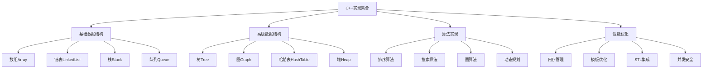

# C++实现集合

## 📖 核心概念

**C++实现集合**是使用C++语言实现各种数据结构和算法的实践。通过C++的面向对象特性、模板机制和STL库，可以高效地实现复杂的数据结构，并提供良好的性能和可维护性。

### 🏗️ C++实现集合分类



## 🔧 C++实现集合

### 基础数据结构实现

```cpp
#include <iostream>
#include <vector>
#include <memory>
#include <algorithm>
#include <stdexcept>
#include <queue>
#include <stack>
#include <unordered_map>
#include <unordered_set>

using namespace std;

// 动态数组实现
template<typename T>
class DynamicArray {
private:
    T* data;
    size_t capacity;
    size_t size;
    
    void resize() {
        capacity *= 2;
        T* newData = new T[capacity];
        for (size_t i = 0; i < size; i++) {
            newData[i] = data[i];
        }
        delete[] data;
        data = newData;
    }
    
public:
    DynamicArray() : capacity(4), size(0) {
        data = new T[capacity];
    }
    
    ~DynamicArray() {
        delete[] data;
    }
    
    void push_back(const T& value) {
        if (size >= capacity) {
            resize();
        }
        data[size++] = value;
    }
    
    void insert(size_t index, const T& value) {
        if (index > size) {
            throw out_of_range("Index out of range");
        }
        
        if (size >= capacity) {
            resize();
        }
        
        for (size_t i = size; i > index; i--) {
            data[i] = data[i - 1];
        }
        data[index] = value;
        size++;
    }
    
    void erase(size_t index) {
        if (index >= size) {
            throw out_of_range("Index out of range");
        }
        
        for (size_t i = index; i < size - 1; i++) {
            data[i] = data[i + 1];
        }
        size--;
    }
    
    T& operator[](size_t index) {
        if (index >= size) {
            throw out_of_range("Index out of range");
        }
        return data[index];
    }
    
    const T& operator[](size_t index) const {
        if (index >= size) {
            throw out_of_range("Index out of range");
        }
        return data[index];
    }
    
    size_t getSize() const { return size; }
    size_t getCapacity() const { return capacity; }
    
    void display() const {
        cout << "DynamicArray: [";
        for (size_t i = 0; i < size; i++) {
            cout << data[i];
            if (i < size - 1) cout << ", ";
        }
        cout << "] (size: " << size << ", capacity: " << capacity << ")" << endl;
    }
};

// 双向链表实现
template<typename T>
class DoublyLinkedList {
private:
    struct Node {
        T data;
        Node* prev;
        Node* next;
        
        Node(const T& value) : data(value), prev(nullptr), next(nullptr) {}
    };
    
    Node* head;
    Node* tail;
    size_t size;
    
public:
    DoublyLinkedList() : head(nullptr), tail(nullptr), size(0) {}
    
    ~DoublyLinkedList() {
        clear();
    }
    
    void push_front(const T& value) {
        Node* newNode = new Node(value);
        
        if (head == nullptr) {
            head = tail = newNode;
        } else {
            newNode->next = head;
            head->prev = newNode;
            head = newNode;
        }
        size++;
    }
    
    void push_back(const T& value) {
        Node* newNode = new Node(value);
        
        if (tail == nullptr) {
            head = tail = newNode;
        } else {
            tail->next = newNode;
            newNode->prev = tail;
            tail = newNode;
        }
        size++;
    }
    
    void pop_front() {
        if (head == nullptr) {
            throw runtime_error("List is empty");
        }
        
        Node* temp = head;
        head = head->next;
        
        if (head == nullptr) {
            tail = nullptr;
        } else {
            head->prev = nullptr;
        }
        
        delete temp;
        size--;
    }
    
    void pop_back() {
        if (tail == nullptr) {
            throw runtime_error("List is empty");
        }
        
        Node* temp = tail;
        tail = tail->prev;
        
        if (tail == nullptr) {
            head = nullptr;
        } else {
            tail->next = nullptr;
        }
        
        delete temp;
        size--;
    }
    
    void insert(size_t index, const T& value) {
        if (index > size) {
            throw out_of_range("Index out of range");
        }
        
        if (index == 0) {
            push_front(value);
            return;
        }
        
        if (index == size) {
            push_back(value);
            return;
        }
        
        Node* current = head;
        for (size_t i = 0; i < index; i++) {
            current = current->next;
        }
        
        Node* newNode = new Node(value);
        newNode->prev = current->prev;
        newNode->next = current;
        current->prev->next = newNode;
        current->prev = newNode;
        
        size++;
    }
    
    void erase(size_t index) {
        if (index >= size) {
            throw out_of_range("Index out of range");
        }
        
        if (index == 0) {
            pop_front();
            return;
        }
        
        if (index == size - 1) {
            pop_back();
            return;
        }
        
        Node* current = head;
        for (size_t i = 0; i < index; i++) {
            current = current->next;
        }
        
        current->prev->next = current->next;
        current->next->prev = current->prev;
        
        delete current;
        size--;
    }
    
    void clear() {
        while (head != nullptr) {
            Node* temp = head;
            head = head->next;
            delete temp;
        }
        tail = nullptr;
        size = 0;
    }
    
    size_t getSize() const { return size; }
    
    void display() const {
        cout << "DoublyLinkedList: [";
        Node* current = head;
        while (current != nullptr) {
            cout << current->data;
            if (current->next != nullptr) cout << ", ";
            current = current->next;
        }
        cout << "] (size: " << size << ")" << endl;
    }
};

// 栈实现
template<typename T>
class Stack {
private:
    vector<T> data;
    
public:
    void push(const T& value) {
        data.push_back(value);
    }
    
    void pop() {
        if (data.empty()) {
            throw runtime_error("Stack is empty");
        }
        data.pop_back();
    }
    
    T& top() {
        if (data.empty()) {
            throw runtime_error("Stack is empty");
        }
        return data.back();
    }
    
    const T& top() const {
        if (data.empty()) {
            throw runtime_error("Stack is empty");
        }
        return data.back();
    }
    
    bool empty() const {
        return data.empty();
    }
    
    size_t size() const {
        return data.size();
    }
    
    void display() const {
        cout << "Stack: [";
        for (size_t i = 0; i < data.size(); i++) {
            cout << data[i];
            if (i < data.size() - 1) cout << ", ";
        }
        cout << "] (size: " << data.size() << ")" << endl;
    }
};

// 队列实现
template<typename T>
class Queue {
private:
    struct Node {
        T data;
        Node* next;
        
        Node(const T& value) : data(value), next(nullptr) {}
    };
    
    Node* front;
    Node* rear;
    size_t size;
    
public:
    Queue() : front(nullptr), rear(nullptr), size(0) {}
    
    ~Queue() {
        while (front != nullptr) {
            Node* temp = front;
            front = front->next;
            delete temp;
        }
    }
    
    void enqueue(const T& value) {
        Node* newNode = new Node(value);
        
        if (rear == nullptr) {
            front = rear = newNode;
        } else {
            rear->next = newNode;
            rear = newNode;
        }
        size++;
    }
    
    void dequeue() {
        if (front == nullptr) {
            throw runtime_error("Queue is empty");
        }
        
        Node* temp = front;
        front = front->next;
        
        if (front == nullptr) {
            rear = nullptr;
        }
        
        delete temp;
        size--;
    }
    
    T& peek() {
        if (front == nullptr) {
            throw runtime_error("Queue is empty");
        }
        return front->data;
    }
    
    const T& peek() const {
        if (front == nullptr) {
            throw runtime_error("Queue is empty");
        }
        return front->data;
    }
    
    bool empty() const {
        return front == nullptr;
    }
    
    size_t getSize() const {
        return size;
    }
    
    void display() const {
        cout << "Queue: [";
        Node* current = front;
        while (current != nullptr) {
            cout << current->data;
            if (current->next != nullptr) cout << ", ";
            current = current->next;
        }
        cout << "] (size: " << size << ")" << endl;
    }
};
```

### 高级数据结构实现

```cpp
// 二叉搜索树实现
template<typename T>
class BinarySearchTree {
private:
    struct TreeNode {
        T data;
        TreeNode* left;
        TreeNode* right;
        
        TreeNode(const T& value) : data(value), left(nullptr), right(nullptr) {}
    };
    
    TreeNode* root;
    
    TreeNode* insertHelper(TreeNode* node, const T& value) {
        if (node == nullptr) {
            return new TreeNode(value);
        }
        
        if (value < node->data) {
            node->left = insertHelper(node->left, value);
        } else if (value > node->data) {
            node->right = insertHelper(node->right, value);
        }
        
        return node;
    }
    
    TreeNode* findMin(TreeNode* node) {
        while (node->left != nullptr) {
            node = node->left;
        }
        return node;
    }
    
    TreeNode* deleteHelper(TreeNode* node, const T& value) {
        if (node == nullptr) {
            return node;
        }
        
        if (value < node->data) {
            node->left = deleteHelper(node->left, value);
        } else if (value > node->data) {
            node->right = deleteHelper(node->right, value);
        } else {
            if (node->left == nullptr) {
                TreeNode* temp = node->right;
                delete node;
                return temp;
            } else if (node->right == nullptr) {
                TreeNode* temp = node->left;
                delete node;
                return temp;
            }
            
            TreeNode* temp = findMin(node->right);
            node->data = temp->data;
            node->right = deleteHelper(node->right, temp->data);
        }
        
        return node;
    }
    
    bool searchHelper(TreeNode* node, const T& value) const {
        if (node == nullptr) {
            return false;
        }
        
        if (value == node->data) {
            return true;
        } else if (value < node->data) {
            return searchHelper(node->left, value);
        } else {
            return searchHelper(node->right, value);
        }
    }
    
    void inorderHelper(TreeNode* node, vector<T>& result) const {
        if (node != nullptr) {
            inorderHelper(node->left, result);
            result.push_back(node->data);
            inorderHelper(node->right, result);
        }
    }
    
    void destroyTree(TreeNode* node) {
        if (node != nullptr) {
            destroyTree(node->left);
            destroyTree(node->right);
            delete node;
        }
    }
    
public:
    BinarySearchTree() : root(nullptr) {}
    
    ~BinarySearchTree() {
        destroyTree(root);
    }
    
    void insert(const T& value) {
        root = insertHelper(root, value);
    }
    
    void remove(const T& value) {
        root = deleteHelper(root, value);
    }
    
    bool search(const T& value) const {
        return searchHelper(root, value);
    }
    
    vector<T> inorder() const {
        vector<T> result;
        inorderHelper(root, result);
        return result;
    }
    
    void display() const {
        vector<T> elements = inorder();
        cout << "BinarySearchTree: [";
        for (size_t i = 0; i < elements.size(); i++) {
            cout << elements[i];
            if (i < elements.size() - 1) cout << ", ";
        }
        cout << "]" << endl;
    }
};

// 哈希表实现
template<typename K, typename V>
class HashTable {
private:
    struct HashNode {
        K key;
        V value;
        HashNode* next;
        
        HashNode(const K& k, const V& v) : key(k), value(v), next(nullptr) {}
    };
    
    vector<HashNode*> buckets;
    size_t bucketCount;
    size_t size;
    
    size_t hashFunction(const K& key) const {
        return hash<K>{}(key) % bucketCount;
    }
    
public:
    HashTable(size_t bucketCount = 16) : bucketCount(bucketCount), size(0) {
        buckets.resize(bucketCount, nullptr);
    }
    
    ~HashTable() {
        clear();
    }
    
    void insert(const K& key, const V& value) {
        size_t index = hashFunction(key);
        HashNode* node = buckets[index];
        
        // 检查是否已存在
        while (node != nullptr) {
            if (node->key == key) {
                node->value = value;
                return;
            }
            node = node->next;
        }
        
        // 插入新节点
        HashNode* newNode = new HashNode(key, value);
        newNode->next = buckets[index];
        buckets[index] = newNode;
        size++;
    }
    
    bool find(const K& key, V& value) const {
        size_t index = hashFunction(key);
        HashNode* node = buckets[index];
        
        while (node != nullptr) {
            if (node->key == key) {
                value = node->value;
                return true;
            }
            node = node->next;
        }
        
        return false;
    }
    
    bool remove(const K& key) {
        size_t index = hashFunction(key);
        HashNode* node = buckets[index];
        HashNode* prev = nullptr;
        
        while (node != nullptr) {
            if (node->key == key) {
                if (prev == nullptr) {
                    buckets[index] = node->next;
                } else {
                    prev->next = node->next;
                }
                delete node;
                size--;
                return true;
            }
            prev = node;
            node = node->next;
        }
        
        return false;
    }
    
    void clear() {
        for (size_t i = 0; i < bucketCount; i++) {
            HashNode* node = buckets[i];
            while (node != nullptr) {
                HashNode* temp = node;
                node = node->next;
                delete temp;
            }
            buckets[i] = nullptr;
        }
        size = 0;
    }
    
    size_t getSize() const { return size; }
    size_t getBucketCount() const { return bucketCount; }
    
    void display() const {
        cout << "HashTable: {";
        bool first = true;
        for (size_t i = 0; i < bucketCount; i++) {
            HashNode* node = buckets[i];
            while (node != nullptr) {
                if (!first) cout << ", ";
                cout << node->key << ":" << node->value;
                first = false;
                node = node->next;
            }
        }
        cout << "} (size: " << size << ", buckets: " << bucketCount << ")" << endl;
    }
};

// 最小堆实现
template<typename T>
class MinHeap {
private:
    vector<T> data;
    
    void heapifyUp(size_t index) {
        if (index == 0) return;
        
        size_t parent = (index - 1) / 2;
        if (data[index] < data[parent]) {
            swap(data[index], data[parent]);
            heapifyUp(parent);
        }
    }
    
    void heapifyDown(size_t index) {
        size_t left = 2 * index + 1;
        size_t right = 2 * index + 2;
        size_t smallest = index;
        
        if (left < data.size() && data[left] < data[smallest]) {
            smallest = left;
        }
        
        if (right < data.size() && data[right] < data[smallest]) {
            smallest = right;
        }
        
        if (smallest != index) {
            swap(data[index], data[smallest]);
            heapifyDown(smallest);
        }
    }
    
public:
    void push(const T& value) {
        data.push_back(value);
        heapifyUp(data.size() - 1);
    }
    
    void pop() {
        if (data.empty()) {
            throw runtime_error("Heap is empty");
        }
        
        data[0] = data.back();
        data.pop_back();
        
        if (!data.empty()) {
            heapifyDown(0);
        }
    }
    
    const T& top() const {
        if (data.empty()) {
            throw runtime_error("Heap is empty");
        }
        return data[0];
    }
    
    bool empty() const {
        return data.empty();
    }
    
    size_t size() const {
        return data.size();
    }
    
    void display() const {
        cout << "MinHeap: [";
        for (size_t i = 0; i < data.size(); i++) {
            cout << data[i];
            if (i < data.size() - 1) cout << ", ";
        }
        cout << "] (size: " << data.size() << ")" << endl;
    }
};
```

### 算法实现

```cpp
// 排序算法实现
class SortingAlgorithms {
public:
    // 快速排序
    template<typename T>
    static void quickSort(vector<T>& arr, int low, int high) {
        if (low < high) {
            int pivotIndex = partition(arr, low, high);
            quickSort(arr, low, pivotIndex - 1);
            quickSort(arr, pivotIndex + 1, high);
        }
    }
    
    template<typename T>
    static int partition(vector<T>& arr, int low, int high) {
        T pivot = arr[high];
        int i = low - 1;
        
        for (int j = low; j < high; j++) {
            if (arr[j] <= pivot) {
                i++;
                swap(arr[i], arr[j]);
            }
        }
        
        swap(arr[i + 1], arr[high]);
        return i + 1;
    }
    
    // 归并排序
    template<typename T>
    static void mergeSort(vector<T>& arr, int left, int right) {
        if (left < right) {
            int mid = left + (right - left) / 2;
            mergeSort(arr, left, mid);
            mergeSort(arr, mid + 1, right);
            merge(arr, left, mid, right);
        }
    }
    
    template<typename T>
    static void merge(vector<T>& arr, int left, int mid, int right) {
        int n1 = mid - left + 1;
        int n2 = right - mid;
        
        vector<T> leftArr(n1), rightArr(n2);
        
        for (int i = 0; i < n1; i++) {
            leftArr[i] = arr[left + i];
        }
        for (int j = 0; j < n2; j++) {
            rightArr[j] = arr[mid + 1 + j];
        }
        
        int i = 0, j = 0, k = left;
        
        while (i < n1 && j < n2) {
            if (leftArr[i] <= rightArr[j]) {
                arr[k] = leftArr[i];
                i++;
            } else {
                arr[k] = rightArr[j];
                j++;
            }
            k++;
        }
        
        while (i < n1) {
            arr[k] = leftArr[i];
            i++;
            k++;
        }
        
        while (j < n2) {
            arr[k] = rightArr[j];
            j++;
            k++;
        }
    }
    
    // 堆排序
    template<typename T>
    static void heapSort(vector<T>& arr) {
        int n = arr.size();
        
        // 构建最大堆
        for (int i = n / 2 - 1; i >= 0; i--) {
            heapify(arr, n, i);
        }
        
        // 逐个提取元素
        for (int i = n - 1; i > 0; i--) {
            swap(arr[0], arr[i]);
            heapify(arr, i, 0);
        }
    }
    
    template<typename T>
    static void heapify(vector<T>& arr, int n, int i) {
        int largest = i;
        int left = 2 * i + 1;
        int right = 2 * i + 2;
        
        if (left < n && arr[left] > arr[largest]) {
            largest = left;
        }
        
        if (right < n && arr[right] > arr[largest]) {
            largest = right;
        }
        
        if (largest != i) {
            swap(arr[i], arr[largest]);
            heapify(arr, n, largest);
        }
    }
};

// 搜索算法实现
class SearchAlgorithms {
public:
    // 二分搜索
    template<typename T>
    static int binarySearch(const vector<T>& arr, const T& target) {
        int left = 0;
        int right = arr.size() - 1;
        
        while (left <= right) {
            int mid = left + (right - left) / 2;
            
            if (arr[mid] == target) {
                return mid;
            } else if (arr[mid] < target) {
                left = mid + 1;
            } else {
                right = mid - 1;
            }
        }
        
        return -1;
    }
    
    // 深度优先搜索
    template<typename T>
    static void dfs(const vector<vector<T>>& graph, vector<bool>& visited, int node) {
        visited[node] = true;
        cout << node << " ";
        
        for (int neighbor : graph[node]) {
            if (!visited[neighbor]) {
                dfs(graph, visited, neighbor);
            }
        }
    }
    
    // 广度优先搜索
    template<typename T>
    static void bfs(const vector<vector<T>>& graph, int start) {
        vector<bool> visited(graph.size(), false);
        queue<int> q;
        
        visited[start] = true;
        q.push(start);
        
        while (!q.empty()) {
            int node = q.front();
            q.pop();
            cout << node << " ";
            
            for (int neighbor : graph[node]) {
                if (!visited[neighbor]) {
                    visited[neighbor] = true;
                    q.push(neighbor);
                }
            }
        }
    }
};
```

## 🎯 C++实现集合应用

### 实际应用场景

```cpp
class CppImplementationApplications {
public:
    static void demonstrateApplications() {
        cout << "C++ Implementation Applications:" << endl;
        cout << "==============================" << endl;
        
        cout << "1. 系统编程:" << endl;
        cout << "   - 操作系统内核" << endl;
        cout << "   - 设备驱动程序" << endl;
        cout << "   - 嵌入式系统" << endl;
        
        cout << "2. 游戏开发:" << endl;
        cout << "   - 游戏引擎" << endl;
        cout << "   - 物理引擎" << endl;
        cout << "   - 图形渲染" << endl;
        
        cout << "3. 高性能计算:" << endl;
        cout << "   - 科学计算" << endl;
        cout << "   - 数值分析" << endl;
        cout << "   - 并行计算" << endl;
        
        cout << "4. 金融系统:" << endl;
        cout << "   - 交易系统" << endl;
        cout << "   - 风险管理系统" << endl;
        cout << "   - 高频交易" << endl;
    }
    
    static void analyzePerformance() {
        cout << "C++ Implementation Performance Analysis:" << endl;
        cout << "======================================" << endl;
        
        cout << "1. 性能优势:" << endl;
        cout << "   - 编译型语言: 执行效率高" << endl;
        cout << "   - 内存管理: 手动控制内存" << endl;
        cout << "   - 模板机制: 零开销抽象" << endl;
        cout << "   - STL库: 高度优化的算法" << endl;
        cout << endl;
        
        cout << "2. 性能指标:" << endl;
        cout << "   - 执行速度: 接近汇编语言" << endl;
        cout << "   - 内存使用: 精确控制" << endl;
        cout << "   - 编译时间: 较长" << endl;
        cout << "   - 开发效率: 中等" << endl;
        cout << endl;
        
        cout << "3. 优化策略:" << endl;
        cout << "   - 编译器优化: -O2, -O3" << endl;
        cout << "   - 内存池: 减少分配开销" << endl;
        cout << "   - 内联函数: 减少函数调用" << endl;
        cout << "   - 模板特化: 特定类型优化" << endl;
    }
    
    static void selectImplementationStrategy(bool needsHighPerformance, bool needsMemoryControl, bool needsPortability) {
        cout << "Implementation Strategy Selection:" << endl;
        cout << "=================================" << endl;
        
        cout << "Needs high performance: " << (needsHighPerformance ? "Yes" : "No") << endl;
        cout << "Needs memory control: " << (needsMemoryControl ? "Yes" : "No") << endl;
        cout << "Needs portability: " << (needsPortability ? "Yes" : "No") << endl;
        
        cout << "Recommendation:" << endl;
        
        if (needsHighPerformance && needsMemoryControl) {
            cout << "Use C++ with manual memory management and templates" << endl;
        } else if (needsHighPerformance && needsPortability) {
            cout << "Use C++ with STL and cross-platform libraries" << endl;
        } else if (needsMemoryControl && needsPortability) {
            cout << "Use C++ with smart pointers and RAII" << endl;
        } else if (needsHighPerformance) {
            cout << "Use C++ with compiler optimizations" << endl;
        } else if (needsMemoryControl) {
            cout << "Use C++ with custom allocators" << endl;
        } else if (needsPortability) {
            cout << "Use C++ with standard library" << endl;
        } else {
            cout << "Use C++ with modern features" << endl;
        }
    }
};
```

## 📊 C++实现集合分析

### 性能分析

```cpp
class CppImplementationAnalysis {
public:
    static void analyzePerformance() {
        cout << "C++ Implementation Performance Analysis:" << endl;
        cout << "======================================" << endl;
        
        cout << "1. 时间复杂度:" << endl;
        cout << "   - 动态数组: O(1) 访问, O(n) 插入/删除" << endl;
        cout << "   - 双向链表: O(n) 访问, O(1) 插入/删除" << endl;
        cout << "   - 二叉搜索树: O(log n) 平均, O(n) 最坏" << endl;
        cout << "   - 哈希表: O(1) 平均, O(n) 最坏" << endl;
        cout << "   - 最小堆: O(log n) 插入/删除, O(1) 查找最小" << endl;
        
        cout << "2. 空间复杂度:" << endl;
        cout << "   - 动态数组: O(n)" << endl;
        cout << "   - 双向链表: O(n)" << endl;
        cout << "   - 二叉搜索树: O(n)" << endl;
        cout << "   - 哈希表: O(n)" << endl;
        cout << "   - 最小堆: O(n)" << endl;
        
        cout << "3. 内存使用:" << endl;
        cout << "   - 动态数组: 连续内存, 缓存友好" << endl;
        cout << "   - 双向链表: 分散内存, 缓存不友好" << endl;
        cout << "   - 二叉搜索树: 分散内存, 递归开销" << endl;
        cout << "   - 哈希表: 分散内存, 哈希冲突" << endl;
        cout << "   - 最小堆: 连续内存, 缓存友好" << endl;
    }
    
    static void analyzeSpaceComplexity() {
        cout << "C++ Implementation Space Complexity Analysis:" << endl;
        cout << "===========================================" << endl;
        
        cout << "1. 内存分配:" << endl;
        cout << "   - 栈内存: 自动管理, 速度快" << endl;
        cout << "   - 堆内存: 手动管理, 灵活" << endl;
        cout << "   - 静态内存: 程序生命周期" << endl;
        cout << "   - 常量内存: 只读数据" << endl;
        
        cout << "2. 内存优化:" << endl;
        cout << "   - 内存池: 减少分配开销" << endl;
        cout << "   - 对象池: 重用对象" << endl;
        cout << "   - 缓存对齐: 提高访问速度" << endl;
        cout << "   - 内存压缩: 减少内存使用" << endl;
        
        cout << "3. 内存管理:" << endl;
        cout << "   - RAII: 资源获取即初始化" << endl;
        cout << "   - 智能指针: 自动内存管理" << endl;
        cout << "   - 移动语义: 避免不必要拷贝" << endl;
        cout << "   - 完美转发: 保持参数类型" << endl;
    }
    
    static void analyzeTimeComplexity() {
        cout << "C++ Implementation Time Complexity Analysis:" << endl;
        cout << "==========================================" << endl;
        
        cout << "1. 算法复杂度:" << endl;
        cout << "   - 快速排序: O(n log n) 平均, O(n^2) 最坏" << endl;
        cout << "   - 归并排序: O(n log n) 稳定" << endl;
        cout << "   - 堆排序: O(n log n) 不稳定" << endl;
        cout << "   - 二分搜索: O(log n)" << endl;
        cout << "   - 深度优先搜索: O(V + E)" << endl;
        cout << "   - 广度优先搜索: O(V + E)" << endl;
        
        cout << "2. 数据结构操作:" << endl;
        cout << "   - 动态数组: O(1) 访问, O(n) 插入/删除" << endl;
        cout << "   - 双向链表: O(n) 访问, O(1) 插入/删除" << endl;
        cout << "   - 二叉搜索树: O(log n) 平均" << endl;
        cout << "   - 哈希表: O(1) 平均" << endl;
        cout << "   - 最小堆: O(log n) 插入/删除" << endl;
        
        cout << "3. 优化技术:" << endl;
        cout << "   - 内联函数: 减少函数调用开销" << endl;
        cout << "   - 模板特化: 特定类型优化" << endl;
        cout << "   - 编译器优化: 自动优化" << endl;
        cout << "   - 缓存优化: 提高内存访问效率" << endl;
    }
};
```

## 🎮 C++实现集合测试

### 1. 基础功能测试

```cpp
class CppImplementationTest {
public:
    static void testBasicDataStructures() {
        cout << "Testing Basic Data Structures:" << endl;
        cout << "============================" << endl;
        
        // 测试动态数组
        DynamicArray<int> arr;
        arr.push_back(1);
        arr.push_back(2);
        arr.push_back(3);
        arr.insert(1, 10);
        arr.display();
        
        // 测试双向链表
        DoublyLinkedList<int> list;
        list.push_back(1);
        list.push_back(2);
        list.push_front(0);
        list.insert(2, 5);
        list.display();
        
        // 测试栈
        Stack<int> stack;
        stack.push(1);
        stack.push(2);
        stack.push(3);
        stack.display();
        
        // 测试队列
        Queue<int> queue;
        queue.enqueue(1);
        queue.enqueue(2);
        queue.enqueue(3);
        queue.display();
    }
    
    static void testAdvancedDataStructures() {
        cout << "Testing Advanced Data Structures:" << endl;
        cout << "===============================" << endl;
        
        // 测试二叉搜索树
        BinarySearchTree<int> bst;
        bst.insert(5);
        bst.insert(3);
        bst.insert(7);
        bst.insert(1);
        bst.insert(9);
        bst.display();
        
        // 测试哈希表
        HashTable<string, int> hashTable;
        hashTable.insert("apple", 5);
        hashTable.insert("banana", 3);
        hashTable.insert("orange", 7);
        hashTable.display();
        
        // 测试最小堆
        MinHeap<int> heap;
        heap.push(5);
        heap.push(3);
        heap.push(7);
        heap.push(1);
        heap.push(9);
        heap.display();
    }
    
    static void testAlgorithms() {
        cout << "Testing Algorithms:" << endl;
        cout << "=================" << endl;
        
        // 测试排序算法
        vector<int> arr = {5, 2, 8, 1, 9, 3, 7, 4, 6};
        
        cout << "Original array: ";
        for (int val : arr) cout << val << " ";
        cout << endl;
        
        // 快速排序
        vector<int> arr1 = arr;
        SortingAlgorithms::quickSort(arr1, 0, arr1.size() - 1);
        cout << "Quick sort: ";
        for (int val : arr1) cout << val << " ";
        cout << endl;
        
        // 归并排序
        vector<int> arr2 = arr;
        SortingAlgorithms::mergeSort(arr2, 0, arr2.size() - 1);
        cout << "Merge sort: ";
        for (int val : arr2) cout << val << " ";
        cout << endl;
        
        // 堆排序
        vector<int> arr3 = arr;
        SortingAlgorithms::heapSort(arr3);
        cout << "Heap sort: ";
        for (int val : arr3) cout << val << " ";
        cout << endl;
        
        // 测试搜索算法
        vector<int> sortedArr = {1, 2, 3, 4, 5, 6, 7, 8, 9};
        int index = SearchAlgorithms::binarySearch(sortedArr, 5);
        cout << "Binary search for 5: index " << index << endl;
    }
    
    static void testApplications() {
        cout << "Testing Applications:" << endl;
        cout << "==================" << endl;
        
        CppImplementationApplications::demonstrateApplications();
        CppImplementationApplications::analyzePerformance();
        CppImplementationApplications::selectImplementationStrategy(true, true, false);
    }
    
    static void testAnalysis() {
        cout << "Testing Analysis:" << endl;
        cout << "===============" << endl;
        
        CppImplementationAnalysis::analyzePerformance();
        CppImplementationAnalysis::analyzeSpaceComplexity();
        CppImplementationAnalysis::analyzeTimeComplexity();
    }
};
```

## 🔗 相关链接

- [[01-Python实现集合|Python实现集合]]
- [[02-Java实现集合|Java实现集合]]
- [[03-算法挑战|算法挑战]]

## 💡 C++实现集合要点

1. **性能优势**: 编译型语言，执行效率高
2. **内存管理**: 手动控制内存，精确管理
3. **模板机制**: 零开销抽象，类型安全
4. **STL库**: 高度优化的标准库

---

*📝 C++实现集合提示：C++实现需要注重内存管理、性能优化和代码质量，充分利用C++的特性和STL库*
