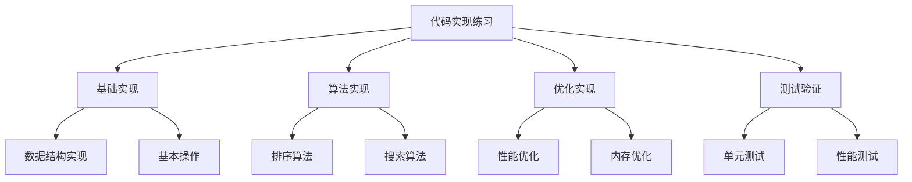

# 代码实现练习

## 📖 核心概念

**代码实现练习**是数据结构学习的重要环节，通过实际编程练习，可以深入理解数据结构的原理和应用。

### 🏗️ 练习类型



## 🔧 基础实现练习

### 1. 链表实现

```cpp
class LinkedList {
private:
    struct Node {
        int data;
        Node* next;
        
        Node(int value) : data(value), next(nullptr) {}
    };
    
    Node* head;
    int size;
    
public:
    LinkedList() : head(nullptr), size(0) {}
    
    ~LinkedList() {
        clear();
    }
    
    void insertAtHead(int value) {
        Node* newNode = new Node(value);
        newNode->next = head;
        head = newNode;
        size++;
    }
    
    void insertAtTail(int value) {
        Node* newNode = new Node(value);
        
        if (!head) {
            head = newNode;
        } else {
            Node* current = head;
            while (current->next) {
                current = current->next;
            }
            current->next = newNode;
        }
        size++;
    }
    
    void insertAtPosition(int value, int position) {
        if (position < 0 || position > size) {
            cout << "Invalid position" << endl;
            return;
        }
        
        if (position == 0) {
            insertAtHead(value);
            return;
        }
        
        Node* newNode = new Node(value);
        Node* current = head;
        
        for (int i = 0; i < position - 1; ++i) {
            current = current->next;
        }
        
        newNode->next = current->next;
        current->next = newNode;
        size++;
    }
    
    bool deleteValue(int value) {
        if (!head) return false;
        
        if (head->data == value) {
            Node* temp = head;
            head = head->next;
            delete temp;
            size--;
            return true;
        }
        
        Node* current = head;
        while (current->next && current->next->data != value) {
            current = current->next;
        }
        
        if (current->next) {
            Node* temp = current->next;
            current->next = temp->next;
            delete temp;
            size--;
            return true;
        }
        
        return false;
    }
    
    bool search(int value) {
        Node* current = head;
        while (current) {
            if (current->data == value) {
                return true;
            }
            current = current->next;
        }
        return false;
    }
    
    void display() {
        Node* current = head;
        cout << "List: ";
        while (current) {
            cout << current->data << " ";
            current = current->next;
        }
        cout << endl;
    }
    
    int getSize() {
        return size;
    }
    
    void clear() {
        while (head) {
            Node* temp = head;
            head = head->next;
            delete temp;
        }
        size = 0;
    }
    
    void reverse() {
        Node* prev = nullptr;
        Node* current = head;
        Node* next = nullptr;
        
        while (current) {
            next = current->next;
            current->next = prev;
            prev = current;
            current = next;
        }
        
        head = prev;
    }
    
    bool hasCycle() {
        if (!head || !head->next) return false;
        
        Node* slow = head;
        Node* fast = head->next;
        
        while (fast && fast->next) {
            if (slow == fast) return true;
            slow = slow->next;
            fast = fast->next->next;
        }
        
        return false;
    }
};
```

### 2. 栈实现

```cpp
class Stack {
private:
    vector<int> data;
    int capacity;
    
public:
    Stack(int cap = 100) : capacity(cap) {}
    
    void push(int value) {
        if (data.size() >= capacity) {
            cout << "Stack overflow" << endl;
            return;
        }
        data.push_back(value);
    }
    
    int pop() {
        if (data.empty()) {
            cout << "Stack underflow" << endl;
            return -1;
        }
        int value = data.back();
        data.pop_back();
        return value;
    }
    
    int peek() {
        if (data.empty()) {
            cout << "Stack is empty" << endl;
            return -1;
        }
        return data.back();
    }
    
    bool isEmpty() {
        return data.empty();
    }
    
    int size() {
        return data.size();
    }
    
    void display() {
        cout << "Stack: ";
        for (int i = data.size() - 1; i >= 0; --i) {
            cout << data[i] << " ";
        }
        cout << endl;
    }
    
    // 表达式求值
    int evaluatePostfix(const string& expression) {
        for (char c : expression) {
            if (isdigit(c)) {
                push(c - '0');
            } else if (c == '+' || c == '-' || c == '*' || c == '/') {
                int b = pop();
                int a = pop();
                
                switch (c) {
                    case '+': push(a + b); break;
                    case '-': push(a - b); break;
                    case '*': push(a * b); break;
                    case '/': push(a / b); break;
                }
            }
        }
        return pop();
    }
    
    // 括号匹配
    bool isValidParentheses(const string& s) {
        for (char c : s) {
            if (c == '(' || c == '[' || c == '{') {
                push(c);
            } else if (c == ')' || c == ']' || c == '}') {
                if (isEmpty()) return false;
                
                char top = pop();
                if ((c == ')' && top != '(') ||
                    (c == ']' && top != '[') ||
                    (c == '}' && top != '{')) {
                    return false;
                }
            }
        }
        return isEmpty();
    }
};
```

### 3. 队列实现

```cpp
class Queue {
private:
    vector<int> data;
    int front;
    int rear;
    int capacity;
    
public:
    Queue(int cap = 100) : front(0), rear(-1), capacity(cap) {
        data.resize(capacity);
    }
    
    void enqueue(int value) {
        if (isFull()) {
            cout << "Queue overflow" << endl;
            return;
        }
        rear = (rear + 1) % capacity;
        data[rear] = value;
    }
    
    int dequeue() {
        if (isEmpty()) {
            cout << "Queue underflow" << endl;
            return -1;
        }
        int value = data[front];
        front = (front + 1) % capacity;
        return value;
    }
    
    int peek() {
        if (isEmpty()) {
            cout << "Queue is empty" << endl;
            return -1;
        }
        return data[front];
    }
    
    bool isEmpty() {
        return front == (rear + 1) % capacity;
    }
    
    bool isFull() {
        return front == (rear + 2) % capacity;
    }
    
    int size() {
        return (rear - front + 1 + capacity) % capacity;
    }
    
    void display() {
        if (isEmpty()) {
            cout << "Queue is empty" << endl;
            return;
        }
        
        cout << "Queue: ";
        int i = front;
        do {
            cout << data[i] << " ";
            i = (i + 1) % capacity;
        } while (i != (rear + 1) % capacity);
        cout << endl;
    }
    
    // 循环队列实现
    void resize(int newCapacity) {
        vector<int> newData(newCapacity);
        int newSize = min(size(), newCapacity);
        
        for (int i = 0; i < newSize; ++i) {
            newData[i] = data[(front + i) % capacity];
        }
        
        data = newData;
        capacity = newCapacity;
        front = 0;
        rear = newSize - 1;
    }
};
```

## 🎯 算法实现练习

### 1. 排序算法

```cpp
class SortingAlgorithms {
public:
    // 冒泡排序
    static void bubbleSort(vector<int>& arr) {
        int n = arr.size();
        for (int i = 0; i < n - 1; ++i) {
            bool swapped = false;
            for (int j = 0; j < n - i - 1; ++j) {
                if (arr[j] > arr[j + 1]) {
                    swap(arr[j], arr[j + 1]);
                    swapped = true;
                }
            }
            if (!swapped) break;
        }
    }
    
    // 选择排序
    static void selectionSort(vector<int>& arr) {
        int n = arr.size();
        for (int i = 0; i < n - 1; ++i) {
            int minIdx = i;
            for (int j = i + 1; j < n; ++j) {
                if (arr[j] < arr[minIdx]) {
                    minIdx = j;
                }
            }
            swap(arr[i], arr[minIdx]);
        }
    }
    
    // 插入排序
    static void insertionSort(vector<int>& arr) {
        int n = arr.size();
        for (int i = 1; i < n; ++i) {
            int key = arr[i];
            int j = i - 1;
            
            while (j >= 0 && arr[j] > key) {
                arr[j + 1] = arr[j];
                j--;
            }
            arr[j + 1] = key;
        }
    }
    
    // 快速排序
    static void quickSort(vector<int>& arr, int low, int high) {
        if (low < high) {
            int pivot = partition(arr, low, high);
            quickSort(arr, low, pivot - 1);
            quickSort(arr, pivot + 1, high);
        }
    }
    
    static int partition(vector<int>& arr, int low, int high) {
        int pivot = arr[high];
        int i = low - 1;
        
        for (int j = low; j < high; ++j) {
            if (arr[j] < pivot) {
                i++;
                swap(arr[i], arr[j]);
            }
        }
        swap(arr[i + 1], arr[high]);
        return i + 1;
    }
    
    // 归并排序
    static void mergeSort(vector<int>& arr, int left, int right) {
        if (left < right) {
            int mid = left + (right - left) / 2;
            mergeSort(arr, left, mid);
            mergeSort(arr, mid + 1, right);
            merge(arr, left, mid, right);
        }
    }
    
    static void merge(vector<int>& arr, int left, int mid, int right) {
        int n1 = mid - left + 1;
        int n2 = right - mid;
        
        vector<int> leftArr(n1), rightArr(n2);
        
        for (int i = 0; i < n1; ++i) {
            leftArr[i] = arr[left + i];
        }
        for (int j = 0; j < n2; ++j) {
            rightArr[j] = arr[mid + 1 + j];
        }
        
        int i = 0, j = 0, k = left;
        
        while (i < n1 && j < n2) {
            if (leftArr[i] <= rightArr[j]) {
                arr[k] = leftArr[i];
                i++;
            } else {
                arr[k] = rightArr[j];
                j++;
            }
            k++;
        }
        
        while (i < n1) {
            arr[k] = leftArr[i];
            i++;
            k++;
        }
        
        while (j < n2) {
            arr[k] = rightArr[j];
            j++;
            k++;
        }
    }
    
    // 堆排序
    static void heapSort(vector<int>& arr) {
        int n = arr.size();
        
        // 构建最大堆
        for (int i = n / 2 - 1; i >= 0; --i) {
            heapify(arr, n, i);
        }
        
        // 逐个提取元素
        for (int i = n - 1; i > 0; --i) {
            swap(arr[0], arr[i]);
            heapify(arr, i, 0);
        }
    }
    
    static void heapify(vector<int>& arr, int n, int i) {
        int largest = i;
        int left = 2 * i + 1;
        int right = 2 * i + 2;
        
        if (left < n && arr[left] > arr[largest]) {
            largest = left;
        }
        
        if (right < n && arr[right] > arr[largest]) {
            largest = right;
        }
        
        if (largest != i) {
            swap(arr[i], arr[largest]);
            heapify(arr, n, largest);
        }
    }
};
```

### 2. 搜索算法

```cpp
class SearchAlgorithms {
public:
    // 线性搜索
    static int linearSearch(const vector<int>& arr, int target) {
        for (int i = 0; i < arr.size(); ++i) {
            if (arr[i] == target) {
                return i;
            }
        }
        return -1;
    }
    
    // 二分搜索
    static int binarySearch(const vector<int>& arr, int target) {
        int left = 0, right = arr.size() - 1;
        
        while (left <= right) {
            int mid = left + (right - left) / 2;
            
            if (arr[mid] == target) {
                return mid;
            } else if (arr[mid] < target) {
                left = mid + 1;
            } else {
                right = mid - 1;
            }
        }
        
        return -1;
    }
    
    // 插值搜索
    static int interpolationSearch(const vector<int>& arr, int target) {
        int left = 0, right = arr.size() - 1;
        
        while (left <= right && target >= arr[left] && target <= arr[right]) {
            if (left == right) {
                return (arr[left] == target) ? left : -1;
            }
            
            int pos = left + ((target - arr[left]) * (right - left)) / (arr[right] - arr[left]);
            
            if (arr[pos] == target) {
                return pos;
            } else if (arr[pos] < target) {
                left = pos + 1;
            } else {
                right = pos - 1;
            }
        }
        
        return -1;
    }
    
    // 深度优先搜索
    static void dfs(vector<vector<int>>& graph, int start, vector<bool>& visited) {
        visited[start] = true;
        cout << start << " ";
        
        for (int neighbor : graph[start]) {
            if (!visited[neighbor]) {
                dfs(graph, neighbor, visited);
            }
        }
    }
    
    // 广度优先搜索
    static void bfs(vector<vector<int>>& graph, int start) {
        vector<bool> visited(graph.size(), false);
        queue<int> q;
        
        visited[start] = true;
        q.push(start);
        
        while (!q.empty()) {
            int current = q.front();
            q.pop();
            cout << current << " ";
            
            for (int neighbor : graph[current]) {
                if (!visited[neighbor]) {
                    visited[neighbor] = true;
                    q.push(neighbor);
                }
            }
        }
    }
};
```

## 🎮 测试验证

### 1. 单元测试

```cpp
class UnitTests {
public:
    static void testLinkedList() {
        cout << "Testing LinkedList..." << endl;
        
        LinkedList list;
        
        // 测试插入
        list.insertAtHead(1);
        list.insertAtHead(2);
        list.insertAtTail(3);
        list.insertAtPosition(4, 1);
        
        list.display();
        assert(list.getSize() == 4);
        
        // 测试搜索
        assert(list.search(2) == true);
        assert(list.search(5) == false);
        
        // 测试删除
        assert(list.deleteValue(2) == true);
        assert(list.deleteValue(5) == false);
        
        list.display();
        assert(list.getSize() == 3);
        
        // 测试反转
        list.reverse();
        list.display();
        
        cout << "LinkedList tests passed!" << endl;
    }
    
    static void testStack() {
        cout << "Testing Stack..." << endl;
        
        Stack stack;
        
        // 测试基本操作
        stack.push(1);
        stack.push(2);
        stack.push(3);
        
        assert(stack.peek() == 3);
        assert(stack.pop() == 3);
        assert(stack.pop() == 2);
        assert(stack.pop() == 1);
        assert(stack.isEmpty() == true);
        
        // 测试表达式求值
        assert(stack.evaluatePostfix("23+4*") == 20);
        
        // 测试括号匹配
        assert(stack.isValidParentheses("()[]{}") == true);
        assert(stack.isValidParentheses("([)]") == false);
        
        cout << "Stack tests passed!" << endl;
    }
    
    static void testQueue() {
        cout << "Testing Queue..." << endl;
        
        Queue queue;
        
        // 测试基本操作
        queue.enqueue(1);
        queue.enqueue(2);
        queue.enqueue(3);
        
        assert(queue.peek() == 1);
        assert(queue.dequeue() == 1);
        assert(queue.dequeue() == 2);
        assert(queue.dequeue() == 3);
        assert(queue.isEmpty() == true);
        
        cout << "Queue tests passed!" << endl;
    }
    
    static void testSortingAlgorithms() {
        cout << "Testing Sorting Algorithms..." << endl;
        
        vector<int> arr = {64, 34, 25, 12, 22, 11, 90};
        vector<int> sorted = {11, 12, 22, 25, 34, 64, 90};
        
        // 测试冒泡排序
        vector<int> testArr = arr;
        SortingAlgorithms::bubbleSort(testArr);
        assert(testArr == sorted);
        
        // 测试选择排序
        testArr = arr;
        SortingAlgorithms::selectionSort(testArr);
        assert(testArr == sorted);
        
        // 测试插入排序
        testArr = arr;
        SortingAlgorithms::insertionSort(testArr);
        assert(testArr == sorted);
        
        // 测试快速排序
        testArr = arr;
        SortingAlgorithms::quickSort(testArr, 0, testArr.size() - 1);
        assert(testArr == sorted);
        
        // 测试归并排序
        testArr = arr;
        SortingAlgorithms::mergeSort(testArr, 0, testArr.size() - 1);
        assert(testArr == sorted);
        
        // 测试堆排序
        testArr = arr;
        SortingAlgorithms::heapSort(testArr);
        assert(testArr == sorted);
        
        cout << "Sorting algorithm tests passed!" << endl;
    }
    
    static void testSearchAlgorithms() {
        cout << "Testing Search Algorithms..." << endl;
        
        vector<int> arr = {1, 3, 5, 7, 9, 11, 13, 15};
        
        // 测试线性搜索
        assert(SearchAlgorithms::linearSearch(arr, 7) == 3);
        assert(SearchAlgorithms::linearSearch(arr, 6) == -1);
        
        // 测试二分搜索
        assert(SearchAlgorithms::binarySearch(arr, 7) == 3);
        assert(SearchAlgorithms::binarySearch(arr, 6) == -1);
        
        // 测试插值搜索
        assert(SearchAlgorithms::interpolationSearch(arr, 7) == 3);
        assert(SearchAlgorithms::interpolationSearch(arr, 6) == -1);
        
        cout << "Search algorithm tests passed!" << endl;
    }
    
    static void runAllTests() {
        testLinkedList();
        testStack();
        testQueue();
        testSortingAlgorithms();
        testSearchAlgorithms();
        
        cout << "All tests passed!" << endl;
    }
};
```

### 2. 性能测试

```cpp
class PerformanceTests {
public:
    static void testSortingPerformance() {
        cout << "Testing Sorting Performance..." << endl;
        
        vector<int> sizes = {1000, 5000, 10000};
        
        for (int size : sizes) {
            cout << "Testing with " << size << " elements:" << endl;
            
            vector<int> arr(size);
            for (int i = 0; i < size; ++i) {
                arr[i] = rand() % 1000;
            }
            
            // 测试冒泡排序
            vector<int> testArr = arr;
            auto start = chrono::high_resolution_clock::now();
            SortingAlgorithms::bubbleSort(testArr);
            auto end = chrono::high_resolution_clock::now();
            auto duration = chrono::duration_cast<chrono::milliseconds>(end - start);
            cout << "Bubble Sort: " << duration.count() << " ms" << endl;
            
            // 测试快速排序
            testArr = arr;
            start = chrono::high_resolution_clock::now();
            SortingAlgorithms::quickSort(testArr, 0, testArr.size() - 1);
            end = chrono::high_resolution_clock::now();
            duration = chrono::duration_cast<chrono::milliseconds>(end - start);
            cout << "Quick Sort: " << duration.count() << " ms" << endl;
            
            // 测试归并排序
            testArr = arr;
            start = chrono::high_resolution_clock::now();
            SortingAlgorithms::mergeSort(testArr, 0, testArr.size() - 1);
            end = chrono::high_resolution_clock::now();
            duration = chrono::duration_cast<chrono::milliseconds>(end - start);
            cout << "Merge Sort: " << duration.count() << " ms" << endl;
            
            cout << endl;
        }
    }
    
    static void testSearchPerformance() {
        cout << "Testing Search Performance..." << endl;
        
        vector<int> sizes = {1000, 10000, 100000};
        
        for (int size : sizes) {
            cout << "Testing with " << size << " elements:" << endl;
            
            vector<int> arr(size);
            for (int i = 0; i < size; ++i) {
                arr[i] = i;
            }
            
            // 测试线性搜索
            auto start = chrono::high_resolution_clock::now();
            for (int i = 0; i < 1000; ++i) {
                SearchAlgorithms::linearSearch(arr, rand() % size);
            }
            auto end = chrono::high_resolution_clock::now();
            auto duration = chrono::duration_cast<chrono::milliseconds>(end - start);
            cout << "Linear Search: " << duration.count() << " ms" << endl;
            
            // 测试二分搜索
            start = chrono::high_resolution_clock::now();
            for (int i = 0; i < 1000; ++i) {
                SearchAlgorithms::binarySearch(arr, rand() % size);
            }
            end = chrono::high_resolution_clock::now();
            duration = chrono::duration_cast<chrono::milliseconds>(end - start);
            cout << "Binary Search: " << duration.count() << " ms" << endl;
            
            cout << endl;
        }
    }
};
```

## 🔗 相关链接

- [[02-算法挑战练习|算法挑战练习]]
- [[03-项目实战练习|项目实战练习]]

## 💡 代码实现练习要点

1. **基础实现**：掌握数据结构的核心操作
2. **算法实现**：理解算法的实现细节
3. **测试验证**：确保代码的正确性
4. **性能优化**：提高代码的执行效率

---

*📝 练习提示：代码实现是学习数据结构的重要方法，通过实际编程加深理解*