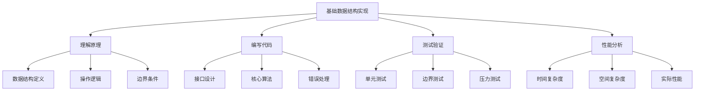

# 基础数据结构实现

## 📖 核心概念

**基础数据结构实现**是数据结构学习的实践基础，通过亲手实现各种数据结构，深入理解其内部机制、操作原理和性能特点。这是从理论到实践的关键桥梁，是掌握数据结构的必经之路。

### 🏗️ 实现学习的组成要素



## 🔍 实现策略分类

### 按学习阶段分类

| 阶段 | 目标 | 方法 | 重点 | 评估标准 |
|------|------|------|------|----------|
| **模仿实现** | 理解基本结构 | 参考标准实现 | 代码正确性 | 功能完整性 |
| **独立实现** | 掌握核心逻辑 | 自主编写代码 | 逻辑清晰性 | 代码质量 |
| **优化实现** | 提升性能 | 算法优化 | 性能表现 | 效率提升 |
| **创新实现** | 扩展功能 | 功能增强 | 创新思维 | 实用性 |

### 按实现方式分类

| 实现方式 | 特点 | 优点 | 缺点 | 适用场景 |
|----------|------|------|------|----------|
| **模板实现** | 泛型编程 | 类型安全 | 编译复杂 | 通用库 |
| **特化实现** | 特定类型 | 性能优化 | 代码重复 | 性能关键 |
| **接口实现** | 抽象设计 | 扩展性好 | 间接调用 | 框架设计 |
| **内联实现** | 直接嵌入 | 性能最佳 | 代码膨胀 | 热点代码 |

## 💻 数组实现练习

### 动态数组实现

```cpp
template<typename T>
class DynamicArray {
private:
    T* data;
    size_t capacity;
    size_t size;
    
    // 扩容策略
    void resize() {
        size_t newCapacity = capacity == 0 ? 1 : capacity * 2;
        T* newData = new T[newCapacity];
        
        // 复制现有数据
        for (size_t i = 0; i < size; i++) {
            newData[i] = std::move(data[i]);
        }
        
        delete[] data;
        data = newData;
        capacity = newCapacity;
    }
    
    // 缩容策略
    void shrink() {
        if (size > 0 && size <= capacity / 4) {
            size_t newCapacity = capacity / 2;
            T* newData = new T[newCapacity];
            
            for (size_t i = 0; i < size; i++) {
                newData[i] = std::move(data[i]);
            }
            
            delete[] data;
            data = newData;
            capacity = newCapacity;
        }
    }
    
public:
    // 构造函数
    DynamicArray() : data(nullptr), capacity(0), size(0) {}
    
    DynamicArray(size_t initialCapacity) : capacity(initialCapacity), size(0) {
        data = new T[capacity];
    }
    
    // 析构函数
    ~DynamicArray() {
        delete[] data;
    }
    
    // 拷贝构造函数
    DynamicArray(const DynamicArray& other) : capacity(other.capacity), size(other.size) {
        data = new T[capacity];
        for (size_t i = 0; i < size; i++) {
            data[i] = other.data[i];
        }
    }
    
    // 赋值操作符
    DynamicArray& operator=(const DynamicArray& other) {
        if (this != &other) {
            delete[] data;
            capacity = other.capacity;
            size = other.size;
            data = new T[capacity];
            for (size_t i = 0; i < size; i++) {
                data[i] = other.data[i];
            }
        }
        return *this;
    }
    
    // 移动构造函数
    DynamicArray(DynamicArray&& other) noexcept 
        : data(other.data), capacity(other.capacity), size(other.size) {
        other.data = nullptr;
        other.capacity = 0;
        other.size = 0;
    }
    
    // 移动赋值操作符
    DynamicArray& operator=(DynamicArray&& other) noexcept {
        if (this != &other) {
            delete[] data;
            data = other.data;
            capacity = other.capacity;
            size = other.size;
            other.data = nullptr;
            other.capacity = 0;
            other.size = 0;
        }
        return *this;
    }
    
    // 添加元素到末尾
    void push_back(const T& value) {
        if (size >= capacity) {
            resize();
        }
        data[size++] = value;
    }
    
    // 添加元素到末尾（移动语义）
    void push_back(T&& value) {
        if (size >= capacity) {
            resize();
        }
        data[size++] = std::move(value);
    }
    
    // 删除末尾元素
    void pop_back() {
        if (size > 0) {
            --size;
            shrink();
        }
    }
    
    // 在指定位置插入元素
    void insert(size_t index, const T& value) {
        if (index > size) {
            throw std::out_of_range("Index out of range");
        }
        
        if (size >= capacity) {
            resize();
        }
        
        // 移动元素
        for (size_t i = size; i > index; i--) {
            data[i] = std::move(data[i - 1]);
        }
        
        data[index] = value;
        ++size;
    }
    
    // 删除指定位置的元素
    void erase(size_t index) {
        if (index >= size) {
            throw std::out_of_range("Index out of range");
        }
        
        // 移动元素
        for (size_t i = index; i < size - 1; i++) {
            data[i] = std::move(data[i + 1]);
        }
        
        --size;
        shrink();
    }
    
    // 访问元素
    T& operator[](size_t index) {
        if (index >= size) {
            throw std::out_of_range("Index out of range");
        }
        return data[index];
    }
    
    const T& operator[](size_t index) const {
        if (index >= size) {
            throw std::out_of_range("Index out of range");
        }
        return data[index];
    }
    
    // 获取大小
    size_t getSize() const {
        return size;
    }
    
    // 获取容量
    size_t getCapacity() const {
        return capacity;
    }
    
    // 检查是否为空
    bool isEmpty() const {
        return size == 0;
    }
    
    // 清空数组
    void clear() {
        size = 0;
        shrink();
    }
    
    // 预留空间
    void reserve(size_t newCapacity) {
        if (newCapacity > capacity) {
            T* newData = new T[newCapacity];
            for (size_t i = 0; i < size; i++) {
                newData[i] = std::move(data[i]);
            }
            delete[] data;
            data = newData;
            capacity = newCapacity;
        }
    }
    
    // 迭代器支持
    T* begin() {
        return data;
    }
    
    const T* begin() const {
        return data;
    }
    
    T* end() {
        return data + size;
    }
    
    const T* end() const {
        return data + size;
    }
};
```

## 💻 链表实现练习

### 双向链表实现

```cpp
template<typename T>
class DoublyLinkedList {
private:
    struct Node {
        T data;
        Node* prev;
        Node* next;
        
        Node(const T& value) : data(value), prev(nullptr), next(nullptr) {}
        Node(T&& value) : data(std::move(value)), prev(nullptr), next(nullptr) {}
    };
    
    Node* head;
    Node* tail;
    size_t size;
    
    // 创建新节点
    Node* createNode(const T& value) {
        return new Node(value);
    }
    
    Node* createNode(T&& value) {
        return new Node(std::move(value));
    }
    
    // 删除节点
    void deleteNode(Node* node) {
        delete node;
    }
    
public:
    // 构造函数
    DoublyLinkedList() : head(nullptr), tail(nullptr), size(0) {}
    
    // 析构函数
    ~DoublyLinkedList() {
        clear();
    }
    
    // 拷贝构造函数
    DoublyLinkedList(const DoublyLinkedList& other) : head(nullptr), tail(nullptr), size(0) {
        for (const T& value : other) {
            push_back(value);
        }
    }
    
    // 赋值操作符
    DoublyLinkedList& operator=(const DoublyLinkedList& other) {
        if (this != &other) {
            clear();
            for (const T& value : other) {
                push_back(value);
            }
        }
        return *this;
    }
    
    // 移动构造函数
    DoublyLinkedList(DoublyLinkedList&& other) noexcept 
        : head(other.head), tail(other.tail), size(other.size) {
        other.head = nullptr;
        other.tail = nullptr;
        other.size = 0;
    }
    
    // 移动赋值操作符
    DoublyLinkedList& operator=(DoublyLinkedList&& other) noexcept {
        if (this != &other) {
            clear();
            head = other.head;
            tail = other.tail;
            size = other.size;
            other.head = nullptr;
            other.tail = nullptr;
            other.size = 0;
        }
        return *this;
    }
    
    // 在头部添加元素
    void push_front(const T& value) {
        Node* newNode = createNode(value);
        
        if (head == nullptr) {
            head = tail = newNode;
        } else {
            newNode->next = head;
            head->prev = newNode;
            head = newNode;
        }
        
        ++size;
    }
    
    // 在头部添加元素（移动语义）
    void push_front(T&& value) {
        Node* newNode = createNode(std::move(value));
        
        if (head == nullptr) {
            head = tail = newNode;
        } else {
            newNode->next = head;
            head->prev = newNode;
            head = newNode;
        }
        
        ++size;
    }
    
    // 在尾部添加元素
    void push_back(const T& value) {
        Node* newNode = createNode(value);
        
        if (tail == nullptr) {
            head = tail = newNode;
        } else {
            tail->next = newNode;
            newNode->prev = tail;
            tail = newNode;
        }
        
        ++size;
    }
    
    // 在尾部添加元素（移动语义）
    void push_back(T&& value) {
        Node* newNode = createNode(std::move(value));
        
        if (tail == nullptr) {
            head = tail = newNode;
        } else {
            tail->next = newNode;
            newNode->prev = tail;
            tail = newNode;
        }
        
        ++size;
    }
    
    // 删除头部元素
    void pop_front() {
        if (head == nullptr) {
            return;
        }
        
        Node* nodeToDelete = head;
        head = head->next;
        
        if (head == nullptr) {
            tail = nullptr;
        } else {
            head->prev = nullptr;
        }
        
        deleteNode(nodeToDelete);
        --size;
    }
    
    // 删除尾部元素
    void pop_back() {
        if (tail == nullptr) {
            return;
        }
        
        Node* nodeToDelete = tail;
        tail = tail->prev;
        
        if (tail == nullptr) {
            head = nullptr;
        } else {
            tail->next = nullptr;
        }
        
        deleteNode(nodeToDelete);
        --size;
    }
    
    // 在指定位置插入元素
    void insert(size_t index, const T& value) {
        if (index > size) {
            throw std::out_of_range("Index out of range");
        }
        
        if (index == 0) {
            push_front(value);
            return;
        }
        
        if (index == size) {
            push_back(value);
            return;
        }
        
        Node* current = head;
        for (size_t i = 0; i < index; i++) {
            current = current->next;
        }
        
        Node* newNode = createNode(value);
        newNode->prev = current->prev;
        newNode->next = current;
        current->prev->next = newNode;
        current->prev = newNode;
        
        ++size;
    }
    
    // 删除指定位置的元素
    void erase(size_t index) {
        if (index >= size) {
            throw std::out_of_range("Index out of range");
        }
        
        if (index == 0) {
            pop_front();
            return;
        }
        
        if (index == size - 1) {
            pop_back();
            return;
        }
        
        Node* current = head;
        for (size_t i = 0; i < index; i++) {
            current = current->next;
        }
        
        current->prev->next = current->next;
        current->next->prev = current->prev;
        
        deleteNode(current);
        --size;
    }
    
    // 访问元素
    T& operator[](size_t index) {
        if (index >= size) {
            throw std::out_of_range("Index out of range");
        }
        
        Node* current = head;
        for (size_t i = 0; i < index; i++) {
            current = current->next;
        }
        
        return current->data;
    }
    
    const T& operator[](size_t index) const {
        if (index >= size) {
            throw std::out_of_range("Index out of range");
        }
        
        Node* current = head;
        for (size_t i = 0; i < index; i++) {
            current = current->next;
        }
        
        return current->data;
    }
    
    // 获取大小
    size_t getSize() const {
        return size;
    }
    
    // 检查是否为空
    bool isEmpty() const {
        return size == 0;
    }
    
    // 清空链表
    void clear() {
        while (head != nullptr) {
            Node* nodeToDelete = head;
            head = head->next;
            deleteNode(nodeToDelete);
        }
        tail = nullptr;
        size = 0;
    }
    
    // 查找元素
    size_t find(const T& value) const {
        Node* current = head;
        size_t index = 0;
        
        while (current != nullptr) {
            if (current->data == value) {
                return index;
            }
            current = current->next;
            ++index;
        }
        
        return size; // 未找到
    }
    
    // 反转链表
    void reverse() {
        if (size <= 1) {
            return;
        }
        
        Node* current = head;
        Node* prev = nullptr;
        
        while (current != nullptr) {
            Node* next = current->next;
            current->next = prev;
            current->prev = next;
            prev = current;
            current = next;
        }
        
        std::swap(head, tail);
    }
    
    // 迭代器支持
    class Iterator {
    private:
        Node* current;
        
    public:
        Iterator(Node* node) : current(node) {}
        
        T& operator*() {
            return current->data;
        }
        
        Iterator& operator++() {
            current = current->next;
            return *this;
        }
        
        Iterator operator++(int) {
            Iterator temp = *this;
            current = current->next;
            return temp;
        }
        
        bool operator!=(const Iterator& other) const {
            return current != other.current;
        }
        
        bool operator==(const Iterator& other) const {
            return current == other.current;
        }
    };
    
    Iterator begin() {
        return Iterator(head);
    }
    
    Iterator end() {
        return Iterator(nullptr);
    }
};
```

## 🎯 栈和队列实现练习

### 栈实现

```cpp
template<typename T>
class Stack {
private:
    struct Node {
        T data;
        Node* next;
        
        Node(const T& value) : data(value), next(nullptr) {}
        Node(T&& value) : data(std::move(value)), next(nullptr) {}
    };
    
    Node* top;
    size_t size;
    
public:
    Stack() : top(nullptr), size(0) {}
    
    ~Stack() {
        while (!isEmpty()) {
            pop();
        }
    }
    
    // 入栈
    void push(const T& value) {
        Node* newNode = new Node(value);
        newNode->next = top;
        top = newNode;
        ++size;
    }
    
    // 入栈（移动语义）
    void push(T&& value) {
        Node* newNode = new Node(std::move(value));
        newNode->next = top;
        top = newNode;
        ++size;
    }
    
    // 出栈
    void pop() {
        if (isEmpty()) {
            throw std::runtime_error("Stack is empty");
        }
        
        Node* nodeToDelete = top;
        top = top->next;
        delete nodeToDelete;
        --size;
    }
    
    // 获取栈顶元素
    T& peek() {
        if (isEmpty()) {
            throw std::runtime_error("Stack is empty");
        }
        return top->data;
    }
    
    const T& peek() const {
        if (isEmpty()) {
            throw std::runtime_error("Stack is empty");
        }
        return top->data;
    }
    
    // 检查是否为空
    bool isEmpty() const {
        return size == 0;
    }
    
    // 获取大小
    size_t getSize() const {
        return size;
    }
    
    // 清空栈
    void clear() {
        while (!isEmpty()) {
            pop();
        }
    }
};
```

### 队列实现

```cpp
template<typename T>
class Queue {
private:
    struct Node {
        T data;
        Node* next;
        
        Node(const T& value) : data(value), next(nullptr) {}
        Node(T&& value) : data(std::move(value)), next(nullptr) {}
    };
    
    Node* front;
    Node* rear;
    size_t size;
    
public:
    Queue() : front(nullptr), rear(nullptr), size(0) {}
    
    ~Queue() {
        while (!isEmpty()) {
            dequeue();
        }
    }
    
    // 入队
    void enqueue(const T& value) {
        Node* newNode = new Node(value);
        
        if (isEmpty()) {
            front = rear = newNode;
        } else {
            rear->next = newNode;
            rear = newNode;
        }
        
        ++size;
    }
    
    // 入队（移动语义）
    void enqueue(T&& value) {
        Node* newNode = new Node(std::move(value));
        
        if (isEmpty()) {
            front = rear = newNode;
        } else {
            rear->next = newNode;
            rear = newNode;
        }
        
        ++size;
    }
    
    // 出队
    void dequeue() {
        if (isEmpty()) {
            throw std::runtime_error("Queue is empty");
        }
        
        Node* nodeToDelete = front;
        front = front->next;
        
        if (front == nullptr) {
            rear = nullptr;
        }
        
        delete nodeToDelete;
        --size;
    }
    
    // 获取队首元素
    T& peek() {
        if (isEmpty()) {
            throw std::runtime_error("Queue is empty");
        }
        return front->data;
    }
    
    const T& peek() const {
        if (isEmpty()) {
            throw std::runtime_error("Queue is empty");
        }
        return front->data;
    }
    
    // 检查是否为空
    bool isEmpty() const {
        return size == 0;
    }
    
    // 获取大小
    size_t getSize() const {
        return size;
    }
    
    // 清空队列
    void clear() {
        while (!isEmpty()) {
            dequeue();
        }
    }
};
```

## 🎯 测试框架实现

### 单元测试框架

```cpp
class TestFramework {
private:
    struct TestCase {
        string name;
        function<void()> testFunction;
        bool passed;
        string errorMessage;
        
        TestCase(const string& n, function<void()> func) 
            : name(n), testFunction(func), passed(false) {}
    };
    
    vector<TestCase> testCases;
    int passedTests;
    int totalTests;
    
public:
    TestFramework() : passedTests(0), totalTests(0) {}
    
    // 添加测试用例
    void addTest(const string& name, function<void()> testFunction) {
        testCases.emplace_back(name, testFunction);
    }
    
    // 运行所有测试
    void runAllTests() {
        cout << "Running " << testCases.size() << " tests..." << endl;
        cout << "==========================================" << endl;
        
        passedTests = 0;
        totalTests = testCases.size();
        
        for (auto& testCase : testCases) {
            try {
                testCase.testFunction();
                testCase.passed = true;
                passedTests++;
                cout << "✓ " << testCase.name << " PASSED" << endl;
            } catch (const exception& e) {
                testCase.passed = false;
                testCase.errorMessage = e.what();
                cout << "✗ " << testCase.name << " FAILED: " << e.what() << endl;
            }
        }
        
        cout << "==========================================" << endl;
        cout << "Test Results: " << passedTests << "/" << totalTests << " passed" << endl;
        
        if (passedTests == totalTests) {
            cout << "🎉 All tests passed!" << endl;
        } else {
            cout << "❌ Some tests failed!" << endl;
        }
    }
    
    // 断言函数
    static void assertTrue(bool condition, const string& message = "") {
        if (!condition) {
            throw runtime_error("Assertion failed: " + message);
        }
    }
    
    static void assertFalse(bool condition, const string& message = "") {
        if (condition) {
            throw runtime_error("Assertion failed: " + message);
        }
    }
    
    static void assertEquals(const auto& expected, const auto& actual, const string& message = "") {
        if (expected != actual) {
            throw runtime_error("Assertion failed: Expected " + to_string(expected) + 
                              ", but got " + to_string(actual) + ". " + message);
        }
    }
    
    static void assertNotEquals(const auto& expected, const auto& actual, const string& message = "") {
        if (expected == actual) {
            throw runtime_error("Assertion failed: Values should not be equal. " + message);
        }
    }
    
    static void assertThrows(function<void()> func, const string& message = "") {
        bool threw = false;
        try {
            func();
        } catch (...) {
            threw = true;
        }
        
        if (!threw) {
            throw runtime_error("Assertion failed: Expected exception was not thrown. " + message);
        }
    }
};
```

## ⚡ 复杂度分析

### 时间复杂度

| 数据结构 | 插入 | 删除 | 查找 | 访问 |
|----------|------|------|------|------|
| **动态数组** | O(1)* | O(n) | O(n) | O(1) |
| **双向链表** | O(1) | O(1) | O(n) | O(n) |
| **栈** | O(1) | O(1) | O(n) | O(1) |
| **队列** | O(1) | O(1) | O(n) | O(1) |

*动态数组的插入平均时间复杂度为O(1)，最坏情况为O(n)

### 空间复杂度

| 数据结构 | 空间复杂度 | 说明 |
|----------|------------|------|
| **动态数组** | O(n) | 连续内存存储 |
| **双向链表** | O(n) | 额外指针开销 |
| **栈** | O(n) | 链表实现 |
| **队列** | O(n) | 链表实现 |

### 性能特点

| 特点 | 动态数组 | 双向链表 | 栈 | 队列 |
|------|----------|----------|-----|------|
| **内存效率** | 高 | 低 | 中等 | 中等 |
| **访问速度** | 快 | 慢 | 快 | 快 |
| **插入删除** | 慢 | 快 | 快 | 快 |
| **缓存友好** | 是 | 否 | 是 | 是 |

## 🎓 学习要点总结

### 核心理解

1. **实现原理**：理解每种数据结构的内部实现机制
2. **操作逻辑**：掌握各种操作的具体实现步骤
3. **边界处理**：正确处理各种边界情况和异常
4. **内存管理**：合理管理内存分配和释放

### 实践要点

1. **代码质量**：编写清晰、可读、可维护的代码
2. **错误处理**：正确处理各种异常情况
3. **性能优化**：优化代码性能和内存使用
4. **测试验证**：编写全面的测试用例

### 应用思维

1. **问题分析**：分析问题选择合适的数据结构
2. **性能权衡**：在时间和空间复杂度间权衡
3. **实际应用**：将数据结构应用到实际问题中
4. **持续改进**：不断优化和改进实现

---

**相关链接：**
- [[02-线性世界/01-序列结构[数组]/01-数组基础|数组基础]] - 数组的理论基础
- [[02-线性世界/02-链式结构[链表]/01-链表基础|链表基础]] - 链表的理论基础
- [[02-线性世界/03-受限结构[栈队列]/01-栈Stack详解|栈Stack详解]] - 栈的理论基础
- [[07-练习战场/01-代码实现/02-算法实现练习|算法实现练习]] - 算法实现练习
