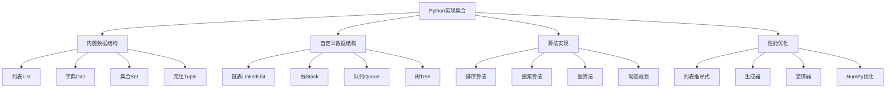

# Python实现集合

## 📖 核心概念

**Python实现集合**是使用Python语言实现各种数据结构和算法的实践。Python的简洁语法、丰富的内置数据类型和强大的第三方库，使得数据结构的实现更加直观和高效。

### 🏗️ Python实现集合分类



## 🔧 Python实现集合

### 基础数据结构实现

```python
# 动态数组实现
class DynamicArray:
    def __init__(self, capacity=4):
        self.capacity = capacity
        self.size = 0
        self.data = [None] * capacity
    
    def _resize(self):
        """扩容数组"""
        self.capacity *= 2
        new_data = [None] * self.capacity
        for i in range(self.size):
            new_data[i] = self.data[i]
        self.data = new_data
    
    def append(self, value):
        """在末尾添加元素"""
        if self.size >= self.capacity:
            self._resize()
        self.data[self.size] = value
        self.size += 1
    
    def insert(self, index, value):
        """在指定位置插入元素"""
        if index > self.size:
            raise IndexError("Index out of range")
        
        if self.size >= self.capacity:
            self._resize()
        
        # 向后移动元素
        for i in range(self.size, index, -1):
            self.data[i] = self.data[i - 1]
        
        self.data[index] = value
        self.size += 1
    
    def delete(self, index):
        """删除指定位置的元素"""
        if index >= self.size:
            raise IndexError("Index out of range")
        
        # 向前移动元素
        for i in range(index, self.size - 1):
            self.data[i] = self.data[i + 1]
        
        self.size -= 1
    
    def get(self, index):
        """获取指定位置的元素"""
        if index >= self.size:
            raise IndexError("Index out of range")
        return self.data[index]
    
    def set(self, index, value):
        """设置指定位置的元素"""
        if index >= self.size:
            raise IndexError("Index out of range")
        self.data[index] = value
    
    def __len__(self):
        return self.size
    
    def __getitem__(self, index):
        return self.get(index)
    
    def __setitem__(self, index, value):
        self.set(index, value)
    
    def __str__(self):
        return f"DynamicArray: {self.data[:self.size]} (size: {self.size}, capacity: {self.capacity})"

# 双向链表实现
class Node:
    def __init__(self, data):
        self.data = data
        self.prev = None
        self.next = None

class DoublyLinkedList:
    def __init__(self):
        self.head = None
        self.tail = None
        self.size = 0
    
    def append(self, data):
        """在末尾添加元素"""
        new_node = Node(data)
        
        if self.head is None:
            self.head = self.tail = new_node
        else:
            new_node.prev = self.tail
            self.tail.next = new_node
            self.tail = new_node
        
        self.size += 1
    
    def prepend(self, data):
        """在开头添加元素"""
        new_node = Node(data)
        
        if self.head is None:
            self.head = self.tail = new_node
        else:
            new_node.next = self.head
            self.head.prev = new_node
            self.head = new_node
        
        self.size += 1
    
    def insert(self, index, data):
        """在指定位置插入元素"""
        if index > self.size:
            raise IndexError("Index out of range")
        
        if index == 0:
            self.prepend(data)
            return
        
        if index == self.size:
            self.append(data)
            return
        
        new_node = Node(data)
        current = self.head
        
        for i in range(index):
            current = current.next
        
        new_node.prev = current.prev
        new_node.next = current
        current.prev.next = new_node
        current.prev = new_node
        
        self.size += 1
    
    def delete(self, index):
        """删除指定位置的元素"""
        if index >= self.size:
            raise IndexError("Index out of range")
        
        if self.size == 1:
            self.head = self.tail = None
        elif index == 0:
            self.head = self.head.next
            self.head.prev = None
        elif index == self.size - 1:
            self.tail = self.tail.prev
            self.tail.next = None
        else:
            current = self.head
            for i in range(index):
                current = current.next
            
            current.prev.next = current.next
            current.next.prev = current.prev
        
        self.size -= 1
    
    def get(self, index):
        """获取指定位置的元素"""
        if index >= self.size:
            raise IndexError("Index out of range")
        
        current = self.head
        for i in range(index):
            current = current.next
        
        return current.data
    
    def __len__(self):
        return self.size
    
    def __str__(self):
        elements = []
        current = self.head
        while current:
            elements.append(str(current.data))
            current = current.next
        return f"DoublyLinkedList: [{', '.join(elements)}] (size: {self.size})"

# 栈实现
class Stack:
    def __init__(self):
        self.items = []
    
    def push(self, item):
        """入栈"""
        self.items.append(item)
    
    def pop(self):
        """出栈"""
        if self.is_empty():
            raise IndexError("Stack is empty")
        return self.items.pop()
    
    def peek(self):
        """查看栈顶元素"""
        if self.is_empty():
            raise IndexError("Stack is empty")
        return self.items[-1]
    
    def is_empty(self):
        """检查栈是否为空"""
        return len(self.items) == 0
    
    def size(self):
        """获取栈的大小"""
        return len(self.items)
    
    def __str__(self):
        return f"Stack: {self.items} (size: {self.size()})"

# 队列实现
class Queue:
    def __init__(self):
        self.items = []
    
    def enqueue(self, item):
        """入队"""
        self.items.append(item)
    
    def dequeue(self):
        """出队"""
        if self.is_empty():
            raise IndexError("Queue is empty")
        return self.items.pop(0)
    
    def front(self):
        """查看队首元素"""
        if self.is_empty():
            raise IndexError("Queue is empty")
        return self.items[0]
    
    def is_empty(self):
        """检查队列是否为空"""
        return len(self.items) == 0
    
    def size(self):
        """获取队列的大小"""
        return len(self.items)
    
    def __str__(self):
        return f"Queue: {self.items} (size: {self.size()})"

# 优先队列实现
import heapq

class PriorityQueue:
    def __init__(self):
        self.heap = []
        self.index = 0
    
    def push(self, item, priority):
        """添加元素到优先队列"""
        heapq.heappush(self.heap, (priority, self.index, item))
        self.index += 1
    
    def pop(self):
        """弹出优先级最高的元素"""
        if self.is_empty():
            raise IndexError("PriorityQueue is empty")
        priority, index, item = heapq.heappop(self.heap)
        return item
    
    def peek(self):
        """查看优先级最高的元素"""
        if self.is_empty():
            raise IndexError("PriorityQueue is empty")
        priority, index, item = self.heap[0]
        return item
    
    def is_empty(self):
        """检查优先队列是否为空"""
        return len(self.heap) == 0
    
    def size(self):
        """获取优先队列的大小"""
        return len(self.heap)
    
    def __str__(self):
        items = [f"{item}({priority})" for priority, index, item in self.heap]
        return f"PriorityQueue: {items} (size: {self.size()})"
```

### 高级数据结构实现

```python
# 二叉搜索树实现
class TreeNode:
    def __init__(self, data):
        self.data = data
        self.left = None
        self.right = None

class BinarySearchTree:
    def __init__(self):
        self.root = None
        self.size = 0
    
    def insert(self, data):
        """插入元素"""
        self.root = self._insert(self.root, data)
        self.size += 1
    
    def _insert(self, node, data):
        """递归插入"""
        if node is None:
            return TreeNode(data)
        
        if data < node.data:
            node.left = self._insert(node.left, data)
        elif data > node.data:
            node.right = self._insert(node.right, data)
        
        return node
    
    def search(self, data):
        """搜索元素"""
        return self._search(self.root, data)
    
    def _search(self, node, data):
        """递归搜索"""
        if node is None:
            return False
        
        if data == node.data:
            return True
        elif data < node.data:
            return self._search(node.left, data)
        else:
            return self._search(node.right, data)
    
    def delete(self, data):
        """删除元素"""
        self.root = self._delete(self.root, data)
        self.size -= 1
    
    def _delete(self, node, data):
        """递归删除"""
        if node is None:
            return node
        
        if data < node.data:
            node.left = self._delete(node.left, data)
        elif data > node.data:
            node.right = self._delete(node.right, data)
        else:
            if node.left is None:
                return node.right
            elif node.right is None:
                return node.left
            
            # 找到右子树的最小值
            min_node = self._find_min(node.right)
            node.data = min_node.data
            node.right = self._delete(node.right, min_node.data)
        
        return node
    
    def _find_min(self, node):
        """找到最小节点"""
        while node.left is not None:
            node = node.left
        return node
    
    def inorder(self):
        """中序遍历"""
        result = []
        self._inorder(self.root, result)
        return result
    
    def _inorder(self, node, result):
        """递归中序遍历"""
        if node is not None:
            self._inorder(node.left, result)
            result.append(node.data)
            self._inorder(node.right, result)
    
    def preorder(self):
        """前序遍历"""
        result = []
        self._preorder(self.root, result)
        return result
    
    def _preorder(self, node, result):
        """递归前序遍历"""
        if node is not None:
            result.append(node.data)
            self._preorder(node.left, result)
            self._preorder(node.right, result)
    
    def postorder(self):
        """后序遍历"""
        result = []
        self._postorder(self.root, result)
        return result
    
    def _postorder(self, node, result):
        """递归后序遍历"""
        if node is not None:
            self._postorder(node.left, result)
            self._postorder(node.right, result)
            result.append(node.data)
    
    def __len__(self):
        return self.size
    
    def __str__(self):
        return f"BinarySearchTree: {self.inorder()} (size: {self.size})"

# 哈希表实现
class HashTable:
    def __init__(self, capacity=16):
        self.capacity = capacity
        self.size = 0
        self.buckets = [[] for _ in range(capacity)]
    
    def _hash(self, key):
        """哈希函数"""
        return hash(key) % self.capacity
    
    def put(self, key, value):
        """插入键值对"""
        index = self._hash(key)
        bucket = self.buckets[index]
        
        # 检查是否已存在
        for i, (k, v) in enumerate(bucket):
            if k == key:
                bucket[i] = (key, value)
                return
        
        # 添加新键值对
        bucket.append((key, value))
        self.size += 1
        
        # 检查是否需要扩容
        if self.size > self.capacity * 0.75:
            self._resize()
    
    def get(self, key):
        """获取值"""
        index = self._hash(key)
        bucket = self.buckets[index]
        
        for k, v in bucket:
            if k == key:
                return v
        
        raise KeyError(f"Key '{key}' not found")
    
    def delete(self, key):
        """删除键值对"""
        index = self._hash(key)
        bucket = self.buckets[index]
        
        for i, (k, v) in enumerate(bucket):
            if k == key:
                del bucket[i]
                self.size -= 1
                return
        
        raise KeyError(f"Key '{key}' not found")
    
    def contains(self, key):
        """检查是否包含键"""
        index = self._hash(key)
        bucket = self.buckets[index]
        
        for k, v in bucket:
            if k == key:
                return True
        
        return False
    
    def _resize(self):
        """扩容哈希表"""
        old_buckets = self.buckets
        self.capacity *= 2
        self.buckets = [[] for _ in range(self.capacity)]
        self.size = 0
        
        for bucket in old_buckets:
            for key, value in bucket:
                self.put(key, value)
    
    def __len__(self):
        return self.size
    
    def __str__(self):
        items = []
        for bucket in self.buckets:
            for key, value in bucket:
                items.append(f"{key}: {value}")
        return f"HashTable: {{{', '.join(items)}}} (size: {self.size}, capacity: {self.capacity})"

# 最小堆实现
class MinHeap:
    def __init__(self):
        self.heap = []
    
    def _parent(self, index):
        """获取父节点索引"""
        return (index - 1) // 2
    
    def _left_child(self, index):
        """获取左子节点索引"""
        return 2 * index + 1
    
    def _right_child(self, index):
        """获取右子节点索引"""
        return 2 * index + 2
    
    def _swap(self, i, j):
        """交换两个元素"""
        self.heap[i], self.heap[j] = self.heap[j], self.heap[i]
    
    def _heapify_up(self, index):
        """向上调整堆"""
        while index > 0:
            parent = self._parent(index)
            if self.heap[index] >= self.heap[parent]:
                break
            self._swap(index, parent)
            index = parent
    
    def _heapify_down(self, index):
        """向下调整堆"""
        while True:
            left = self._left_child(index)
            right = self._right_child(index)
            smallest = index
            
            if left < len(self.heap) and self.heap[left] < self.heap[smallest]:
                smallest = left
            
            if right < len(self.heap) and self.heap[right] < self.heap[smallest]:
                smallest = right
            
            if smallest == index:
                break
            
            self._swap(index, smallest)
            index = smallest
    
    def push(self, value):
        """添加元素"""
        self.heap.append(value)
        self._heapify_up(len(self.heap) - 1)
    
    def pop(self):
        """弹出最小元素"""
        if self.is_empty():
            raise IndexError("Heap is empty")
        
        if len(self.heap) == 1:
            return self.heap.pop()
        
        min_value = self.heap[0]
        self.heap[0] = self.heap[-1]
        self.heap.pop()
        self._heapify_down(0)
        
        return min_value
    
    def peek(self):
        """查看最小元素"""
        if self.is_empty():
            raise IndexError("Heap is empty")
        return self.heap[0]
    
    def is_empty(self):
        """检查堆是否为空"""
        return len(self.heap) == 0
    
    def size(self):
        """获取堆的大小"""
        return len(self.heap)
    
    def __str__(self):
        return f"MinHeap: {self.heap} (size: {self.size()})"
```

### 算法实现

```python
# 排序算法实现
class SortingAlgorithms:
    @staticmethod
    def quick_sort(arr):
        """快速排序"""
        if len(arr) <= 1:
            return arr
        
        pivot = arr[len(arr) // 2]
        left = [x for x in arr if x < pivot]
        middle = [x for x in arr if x == pivot]
        right = [x for x in arr if x > pivot]
        
        return SortingAlgorithms.quick_sort(left) + middle + SortingAlgorithms.quick_sort(right)
    
    @staticmethod
    def merge_sort(arr):
        """归并排序"""
        if len(arr) <= 1:
            return arr
        
        mid = len(arr) // 2
        left = SortingAlgorithms.merge_sort(arr[:mid])
        right = SortingAlgorithms.merge_sort(arr[mid:])
        
        return SortingAlgorithms._merge(left, right)
    
    @staticmethod
    def _merge(left, right):
        """合并两个有序数组"""
        result = []
        i = j = 0
        
        while i < len(left) and j < len(right):
            if left[i] <= right[j]:
                result.append(left[i])
                i += 1
            else:
                result.append(right[j])
                j += 1
        
        result.extend(left[i:])
        result.extend(right[j:])
        return result
    
    @staticmethod
    def heap_sort(arr):
        """堆排序"""
        heap = MinHeap()
        
        # 构建堆
        for item in arr:
            heap.push(item)
        
        # 提取元素
        result = []
        while not heap.is_empty():
            result.append(heap.pop())
        
        return result
    
    @staticmethod
    def bubble_sort(arr):
        """冒泡排序"""
        n = len(arr)
        for i in range(n):
            for j in range(0, n - i - 1):
                if arr[j] > arr[j + 1]:
                    arr[j], arr[j + 1] = arr[j + 1], arr[j]
        return arr
    
    @staticmethod
    def insertion_sort(arr):
        """插入排序"""
        for i in range(1, len(arr)):
            key = arr[i]
            j = i - 1
            while j >= 0 and arr[j] > key:
                arr[j + 1] = arr[j]
                j -= 1
            arr[j + 1] = key
        return arr

# 搜索算法实现
class SearchAlgorithms:
    @staticmethod
    def binary_search(arr, target):
        """二分搜索"""
        left, right = 0, len(arr) - 1
        
        while left <= right:
            mid = (left + right) // 2
            if arr[mid] == target:
                return mid
            elif arr[mid] < target:
                left = mid + 1
            else:
                right = mid - 1
        
        return -1
    
    @staticmethod
    def linear_search(arr, target):
        """线性搜索"""
        for i, item in enumerate(arr):
            if item == target:
                return i
        return -1
    
    @staticmethod
    def dfs(graph, start, visited=None):
        """深度优先搜索"""
        if visited is None:
            visited = set()
        
        visited.add(start)
        print(start, end=" ")
        
        for neighbor in graph.get(start, []):
            if neighbor not in visited:
                SearchAlgorithms.dfs(graph, neighbor, visited)
    
    @staticmethod
    def bfs(graph, start):
        """广度优先搜索"""
        visited = set()
        queue = [start]
        visited.add(start)
        
        while queue:
            node = queue.pop(0)
            print(node, end=" ")
            
            for neighbor in graph.get(node, []):
                if neighbor not in visited:
                    visited.add(neighbor)
                    queue.append(neighbor)

# 动态规划算法实现
class DynamicProgramming:
    @staticmethod
    def fibonacci(n):
        """斐波那契数列"""
        if n <= 1:
            return n
        
        dp = [0] * (n + 1)
        dp[1] = 1
        
        for i in range(2, n + 1):
            dp[i] = dp[i - 1] + dp[i - 2]
        
        return dp[n]
    
    @staticmethod
    def longest_common_subsequence(text1, text2):
        """最长公共子序列"""
        m, n = len(text1), len(text2)
        dp = [[0] * (n + 1) for _ in range(m + 1)]
        
        for i in range(1, m + 1):
            for j in range(1, n + 1):
                if text1[i - 1] == text2[j - 1]:
                    dp[i][j] = dp[i - 1][j - 1] + 1
                else:
                    dp[i][j] = max(dp[i - 1][j], dp[i][j - 1])
        
        return dp[m][n]
    
    @staticmethod
    def knapsack(weights, values, capacity):
        """0-1背包问题"""
        n = len(weights)
        dp = [[0] * (capacity + 1) for _ in range(n + 1)]
        
        for i in range(1, n + 1):
            for w in range(1, capacity + 1):
                if weights[i - 1] <= w:
                    dp[i][w] = max(
                        dp[i - 1][w],
                        dp[i - 1][w - weights[i - 1]] + values[i - 1]
                    )
                else:
                    dp[i][w] = dp[i - 1][w]
        
        return dp[n][capacity]
```

## 🎯 Python实现集合应用

### 实际应用场景

```python
class PythonImplementationApplications:
    @staticmethod
    def demonstrate_applications():
        print("Python Implementation Applications:")
        print("=================================")
        
        print("1. 数据科学:")
        print("   - 数据分析")
        print("   - 机器学习")
        print("   - 数据可视化")
        
        print("2. Web开发:")
        print("   - Django框架")
        print("   - Flask框架")
        print("   - FastAPI框架")
        
        print("3. 自动化脚本:")
        print("   - 系统管理")
        print("   - 文件处理")
        print("   - 网络爬虫")
        
        print("4. 科学计算:")
        print("   - 数值计算")
        print("   - 统计分析")
        print("   - 图像处理")
    
    @staticmethod
    def analyze_performance():
        print("Python Implementation Performance Analysis:")
        print("=========================================")
        
        print("1. 性能特点:")
        print("   - 解释型语言: 执行速度较慢")
        print("   - 动态类型: 运行时类型检查")
        print("   - 内存管理: 自动垃圾回收")
        print("   - 丰富的库: 快速开发")
        print()
        
        print("2. 性能指标:")
        print("   - 执行速度: 比C++慢10-100倍")
        print("   - 内存使用: 自动管理")
        print("   - 开发效率: 非常高")
        print("   - 可读性: 非常好")
        print()
        
        print("3. 优化策略:")
        print("   - NumPy: 数值计算优化")
        print("   - Cython: 编译优化")
        print("   - 列表推导式: 语法优化")
        print("   - 生成器: 内存优化")
    
    @staticmethod
    def select_implementation_strategy(needs_high_performance, needs_rapid_development, needs_data_science):
        print("Implementation Strategy Selection:")
        print("=================================")
        
        print(f"Needs high performance: {needs_high_performance}")
        print(f"Needs rapid development: {needs_rapid_development}")
        print(f"Needs data science: {needs_data_science}")
        
        print("Recommendation:")
        
        if needs_high_performance and needs_data_science:
            print("Use Python with NumPy and Cython for performance-critical data science")
        elif needs_rapid_development and needs_data_science:
            print("Use Python with pandas and scikit-learn for data science")
        elif needs_high_performance and needs_rapid_development:
            print("Use Python with optimized libraries and profiling")
        elif needs_high_performance:
            print("Use Python with C extensions or consider other languages")
        elif needs_rapid_development:
            print("Use Python with standard library and frameworks")
        elif needs_data_science:
            print("Use Python with scientific computing stack")
        else:
            print("Use Python with standard library")
```

## 📊 Python实现集合分析

### 性能分析

```python
class PythonImplementationAnalysis:
    @staticmethod
    def analyze_performance():
        print("Python Implementation Performance Analysis:")
        print("=========================================")
        
        print("1. 时间复杂度:")
        print("   - 列表: O(1) 访问, O(n) 插入/删除")
        print("   - 字典: O(1) 平均, O(n) 最坏")
        print("   - 集合: O(1) 平均, O(n) 最坏")
        print("   - 元组: O(1) 访问")
        print("   - 堆: O(log n) 插入/删除")
        print()
        
        print("2. 空间复杂度:")
        print("   - 列表: O(n)")
        print("   - 字典: O(n)")
        print("   - 集合: O(n)")
        print("   - 元组: O(n)")
        print("   - 堆: O(n)")
        print()
        
        print("3. 内存使用:")
        print("   - 列表: 动态数组, 缓存友好")
        print("   - 字典: 哈希表, 分散内存")
        print("   - 集合: 哈希表, 分散内存")
        print("   - 元组: 不可变, 内存优化")
        print("   - 堆: 数组实现, 缓存友好")
    
    @staticmethod
    def analyze_space_complexity():
        print("Python Implementation Space Complexity Analysis:")
        print("=============================================")
        
        print("1. 内存管理:")
        print("   - 引用计数: 自动内存管理")
        print("   - 垃圾回收: 循环引用检测")
        print("   - 内存池: 小对象优化")
        print("   - 内存碎片: 自动整理")
        print()
        
        print("2. 数据结构优化:")
        print("   - 列表推导式: 内存高效")
        print("   - 生成器: 惰性计算")
        print("   - 切片操作: 视图而非拷贝")
        print("   - 字符串优化: 不可变对象")
        print()
        
        print("3. 性能优化:")
        print("   - NumPy: 向量化操作")
        print("   - Cython: 编译优化")
        print("   - 装饰器: 函数优化")
        print("   - 缓存: 避免重复计算")
    
    @staticmethod
    def analyze_time_complexity():
        print("Python Implementation Time Complexity Analysis:")
        print("============================================")
        
        print("1. 算法复杂度:")
        print("   - 快速排序: O(n log n) 平均, O(n^2) 最坏")
        print("   - 归并排序: O(n log n) 稳定")
        print("   - 堆排序: O(n log n) 不稳定")
        print("   - 二分搜索: O(log n)")
        print("   - 深度优先搜索: O(V + E)")
        print("   - 广度优先搜索: O(V + E)")
        print()
        
        print("2. 数据结构操作:")
        print("   - 列表: O(1) 访问, O(n) 插入/删除")
        print("   - 字典: O(1) 平均")
        print("   - 集合: O(1) 平均")
        print("   - 元组: O(1) 访问")
        print("   - 堆: O(log n) 插入/删除")
        print()
        
        print("3. 优化技术:")
        print("   - 列表推导式: 语法优化")
        print("   - 生成器: 内存优化")
        print("   - 装饰器: 函数优化")
        print("   - 缓存: 避免重复计算")
```

## 🎮 Python实现集合测试

### 1. 基础功能测试

```python
def test_basic_data_structures():
    print("Testing Basic Data Structures:")
    print("============================")
    
    # 测试动态数组
    arr = DynamicArray()
    arr.append(1)
    arr.append(2)
    arr.append(3)
    arr.insert(1, 10)
    print(arr)
    
    # 测试双向链表
    dll = DoublyLinkedList()
    dll.append(1)
    dll.append(2)
    dll.prepend(0)
    dll.insert(2, 5)
    print(dll)
    
    # 测试栈
    stack = Stack()
    stack.push(1)
    stack.push(2)
    stack.push(3)
    print(stack)
    
    # 测试队列
    queue = Queue()
    queue.enqueue(1)
    queue.enqueue(2)
    queue.enqueue(3)
    print(queue)
    
    # 测试优先队列
    pq = PriorityQueue()
    pq.push("task1", 3)
    pq.push("task2", 1)
    pq.push("task3", 2)
    print(pq)

def test_advanced_data_structures():
    print("Testing Advanced Data Structures:")
    print("===============================")
    
    # 测试二叉搜索树
    bst = BinarySearchTree()
    bst.insert(5)
    bst.insert(3)
    bst.insert(7)
    bst.insert(1)
    bst.insert(9)
    print(bst)
    print(f"Inorder: {bst.inorder()}")
    print(f"Preorder: {bst.preorder()}")
    print(f"Postorder: {bst.postorder()}")
    
    # 测试哈希表
    ht = HashTable()
    ht.put("apple", 5)
    ht.put("banana", 3)
    ht.put("orange", 7)
    print(ht)
    print(f"Get apple: {ht.get('apple')}")
    
    # 测试最小堆
    heap = MinHeap()
    heap.push(5)
    heap.push(3)
    heap.push(7)
    heap.push(1)
    heap.push(9)
    print(heap)

def test_algorithms():
    print("Testing Algorithms:")
    print("=================")
    
    # 测试排序算法
    arr = [5, 2, 8, 1, 9, 3, 7, 4, 6]
    print(f"Original array: {arr}")
    
    # 快速排序
    sorted_arr = SortingAlgorithms.quick_sort(arr.copy())
    print(f"Quick sort: {sorted_arr}")
    
    # 归并排序
    sorted_arr = SortingAlgorithms.merge_sort(arr.copy())
    print(f"Merge sort: {sorted_arr}")
    
    # 堆排序
    sorted_arr = SortingAlgorithms.heap_sort(arr.copy())
    print(f"Heap sort: {sorted_arr}")
    
    # 测试搜索算法
    sorted_arr = [1, 2, 3, 4, 5, 6, 7, 8, 9]
    index = SearchAlgorithms.binary_search(sorted_arr, 5)
    print(f"Binary search for 5: index {index}")
    
    # 测试动态规划
    fib = DynamicProgramming.fibonacci(10)
    print(f"Fibonacci(10): {fib}")
    
    lcs = DynamicProgramming.longest_common_subsequence("ABCDGH", "AEDFHR")
    print(f"LCS of 'ABCDGH' and 'AEDFHR': {lcs}")

def test_applications():
    print("Testing Applications:")
    print("==================")
    
    PythonImplementationApplications.demonstrate_applications()
    PythonImplementationApplications.analyze_performance()
    PythonImplementationApplications.select_implementation_strategy(False, True, True)

def test_analysis():
    print("Testing Analysis:")
    print("===============")
    
    PythonImplementationAnalysis.analyze_performance()
    PythonImplementationAnalysis.analyze_space_complexity()
    PythonImplementationAnalysis.analyze_time_complexity()

# 主测试函数
def main():
    test_basic_data_structures()
    print()
    test_advanced_data_structures()
    print()
    test_algorithms()
    print()
    test_applications()
    print()
    test_analysis()

if __name__ == "__main__":
    main()
```

## 🔗 相关链接

- [[01-C++实现集合|C++实现集合]]
- [[02-Java实现集合|Java实现集合]]
- [[03-算法挑战|算法挑战]]

## 💡 Python实现集合要点

1. **简洁语法**: 代码简洁易读，开发效率高
2. **丰富库**: 标准库和第三方库功能强大
3. **动态类型**: 灵活的类型系统
4. **内存管理**: 自动垃圾回收

---

*📝 Python实现集合提示：Python实现注重代码简洁性和可读性，充分利用Python的特性和丰富的库生态系统*
