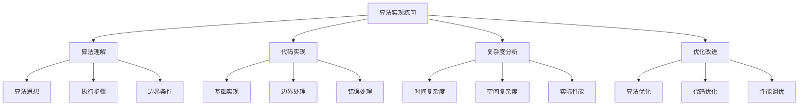

# 算法实现练习

## 📖 核心概念

**算法实现练习**是数据结构学习的核心实践环节，通过亲手实现各种经典算法，深入理解算法的设计思想、实现技巧和优化方法。这是从理论到实践的关键桥梁，是掌握算法思维的重要途径。

### 🏗️ 算法练习的组成要素



## 🔍 算法练习分类

### 按算法类型分类

| 算法类型 | 特点 | 重点 | 难度 | 应用场景 |
|----------|------|------|------|----------|
| **排序算法** | 数据重排 | 比较交换 | 中等 | 数据处理 |
| **搜索算法** | 数据查找 | 遍历策略 | 简单 | 信息检索 |
| **图算法** | 图遍历 | 路径查找 | 困难 | 网络分析 |
| **动态规划** | 最优解 | 状态转移 | 困难 | 优化问题 |

### 按实现方式分类

| 实现方式 | 特点 | 优点 | 缺点 | 适用场景 |
|----------|------|------|------|----------|
| **递归实现** | 函数调用 | 代码简洁 | 栈溢出 | 分治算法 |
| **迭代实现** | 循环控制 | 性能好 | 代码复杂 | 性能关键 |
| **混合实现** | 递归+迭代 | 平衡性能 | 实现复杂 | 复杂算法 |
| **模板实现** | 泛型编程 | 类型安全 | 编译复杂 | 通用库 |

## 💻 排序算法实现

### 快速排序实现

```cpp
class QuickSort {
private:
    // 分区函数
    template<typename T>
    static int partition(vector<T>& arr, int low, int high) {
        T pivot = arr[high]; // 选择最后一个元素作为基准
        int i = low - 1; // 小于基准的元素的索引
        
        for (int j = low; j < high; j++) {
            if (arr[j] < pivot) {
                i++;
                swap(arr[i], arr[j]);
            }
        }
        
        swap(arr[i + 1], arr[high]);
        return i + 1;
    }
    
    // 随机分区函数
    template<typename T>
    static int randomizedPartition(vector<T>& arr, int low, int high) {
        int randomIndex = low + rand() % (high - low + 1);
        swap(arr[randomIndex], arr[high]);
        return partition(arr, low, high);
    }
    
    // 三路快排分区
    template<typename T>
    static pair<int, int> threeWayPartition(vector<T>& arr, int low, int high) {
        T pivot = arr[low];
        int lt = low; // arr[low..lt-1] < pivot
        int gt = high; // arr[gt+1..high] > pivot
        int i = low + 1; // arr[lt..i-1] == pivot
        
        while (i <= gt) {
            if (arr[i] < pivot) {
                swap(arr[lt++], arr[i++]);
            } else if (arr[i] > pivot) {
                swap(arr[i], arr[gt--]);
            } else {
                i++;
            }
        }
        
        return {lt, gt};
    }
    
public:
    // 基础快速排序
    template<typename T>
    static void quickSort(vector<T>& arr, int low, int high) {
        if (low < high) {
            int pi = partition(arr, low, high);
            quickSort(arr, low, pi - 1);
            quickSort(arr, pi + 1, high);
        }
    }
    
    // 随机化快速排序
    template<typename T>
    static void randomizedQuickSort(vector<T>& arr, int low, int high) {
        if (low < high) {
            int pi = randomizedPartition(arr, low, high);
            randomizedQuickSort(arr, low, pi - 1);
            randomizedQuickSort(arr, pi + 1, high);
        }
    }
    
    // 三路快速排序
    template<typename T>
    static void threeWayQuickSort(vector<T>& arr, int low, int high) {
        if (low < high) {
            auto [lt, gt] = threeWayPartition(arr, low, high);
            threeWayQuickSort(arr, low, lt - 1);
            threeWayQuickSort(arr, gt + 1, high);
        }
    }
    
    // 迭代快速排序
    template<typename T>
    static void iterativeQuickSort(vector<T>& arr) {
        stack<pair<int, int>> st;
        st.push({0, arr.size() - 1});
        
        while (!st.empty()) {
            auto [low, high] = st.top();
            st.pop();
            
            if (low < high) {
                int pi = partition(arr, low, high);
                st.push({low, pi - 1});
                st.push({pi + 1, high});
            }
        }
    }
    
    // 混合排序（小数组使用插入排序）
    template<typename T>
    static void hybridQuickSort(vector<T>& arr, int low, int high, int threshold = 10) {
        if (low < high) {
            if (high - low + 1 <= threshold) {
                insertionSort(arr, low, high);
            } else {
                int pi = partition(arr, low, high);
                hybridQuickSort(arr, low, pi - 1, threshold);
                hybridQuickSort(arr, pi + 1, high, threshold);
            }
        }
    }
    
private:
    // 插入排序辅助函数
    template<typename T>
    static void insertionSort(vector<T>& arr, int low, int high) {
        for (int i = low + 1; i <= high; i++) {
            T key = arr[i];
            int j = i - 1;
            
            while (j >= low && arr[j] > key) {
                arr[j + 1] = arr[j];
                j--;
            }
            
            arr[j + 1] = key;
        }
    }
};
```

### 归并排序实现

```cpp
class MergeSort {
private:
    // 合并函数
    template<typename T>
    static void merge(vector<T>& arr, int left, int mid, int right) {
        int n1 = mid - left + 1;
        int n2 = right - mid;
        
        vector<T> L(n1), R(n2);
        
        // 复制数据到临时数组
        for (int i = 0; i < n1; i++) {
            L[i] = arr[left + i];
        }
        for (int j = 0; j < n2; j++) {
            R[j] = arr[mid + 1 + j];
        }
        
        // 合并临时数组
        int i = 0, j = 0, k = left;
        
        while (i < n1 && j < n2) {
            if (L[i] <= R[j]) {
                arr[k] = L[i];
                i++;
            } else {
                arr[k] = R[j];
                j++;
            }
            k++;
        }
        
        // 复制剩余元素
        while (i < n1) {
            arr[k] = L[i];
            i++;
            k++;
        }
        
        while (j < n2) {
            arr[k] = R[j];
            j++;
            k++;
        }
    }
    
    // 原地合并（空间优化）
    template<typename T>
    static void inPlaceMerge(vector<T>& arr, int left, int mid, int right) {
        int i = left, j = mid + 1;
        
        while (i <= mid && j <= right) {
            if (arr[i] <= arr[j]) {
                i++;
            } else {
                T value = arr[j];
                int index = j;
                
                // 向右移动元素
                while (index > i) {
                    arr[index] = arr[index - 1];
                    index--;
                }
                
                arr[i] = value;
                i++;
                mid++;
                j++;
            }
        }
    }
    
public:
    // 递归归并排序
    template<typename T>
    static void mergeSort(vector<T>& arr, int left, int right) {
        if (left < right) {
            int mid = left + (right - left) / 2;
            
            mergeSort(arr, left, mid);
            mergeSort(arr, mid + 1, right);
            
            merge(arr, left, mid, right);
        }
    }
    
    // 迭代归并排序
    template<typename T>
    static void iterativeMergeSort(vector<T>& arr) {
        int n = arr.size();
        
        for (int currSize = 1; currSize < n; currSize *= 2) {
            for (int leftStart = 0; leftStart < n - 1; leftStart += 2 * currSize) {
                int mid = min(leftStart + currSize - 1, n - 1);
                int rightEnd = min(leftStart + 2 * currSize - 1, n - 1);
                
                merge(arr, leftStart, mid, rightEnd);
            }
        }
    }
    
    // 原地归并排序
    template<typename T>
    static void inPlaceMergeSort(vector<T>& arr, int left, int right) {
        if (left < right) {
            int mid = left + (right - left) / 2;
            
            inPlaceMergeSort(arr, left, mid);
            inPlaceMergeSort(arr, mid + 1, right);
            
            inPlaceMerge(arr, left, mid, right);
        }
    }
    
    // 自然归并排序
    template<typename T>
    static void naturalMergeSort(vector<T>& arr) {
        int n = arr.size();
        vector<int> runs;
        
        // 找到所有有序子序列
        int start = 0;
        for (int i = 1; i < n; i++) {
            if (arr[i] < arr[i - 1]) {
                runs.push_back(i - start);
                start = i;
            }
        }
        runs.push_back(n - start);
        
        // 合并有序子序列
        while (runs.size() > 1) {
            vector<int> newRuns;
            
            for (int i = 0; i < runs.size(); i += 2) {
                if (i + 1 < runs.size()) {
                    int leftStart = (i == 0) ? 0 : accumulate(runs.begin(), runs.begin() + i, 0);
                    int mid = leftStart + runs[i] - 1;
                    int rightEnd = mid + runs[i + 1];
                    
                    merge(arr, leftStart, mid, rightEnd);
                    newRuns.push_back(runs[i] + runs[i + 1]);
                } else {
                    newRuns.push_back(runs[i]);
                }
            }
            
            runs = newRuns;
        }
    }
};
```

## 💻 搜索算法实现

### 二分搜索实现

```cpp
class BinarySearch {
public:
    // 基础二分搜索
    template<typename T>
    static int binarySearch(const vector<T>& arr, const T& target) {
        int left = 0;
        int right = arr.size() - 1;
        
        while (left <= right) {
            int mid = left + (right - left) / 2;
            
            if (arr[mid] == target) {
                return mid;
            } else if (arr[mid] < target) {
                left = mid + 1;
            } else {
                right = mid - 1;
            }
        }
        
        return -1; // 未找到
    }
    
    // 递归二分搜索
    template<typename T>
    static int recursiveBinarySearch(const vector<T>& arr, const T& target, int left, int right) {
        if (left > right) {
            return -1;
        }
        
        int mid = left + (right - left) / 2;
        
        if (arr[mid] == target) {
            return mid;
        } else if (arr[mid] < target) {
            return recursiveBinarySearch(arr, target, mid + 1, right);
        } else {
            return recursiveBinarySearch(arr, target, left, mid - 1);
        }
    }
    
    // 查找第一个出现的位置
    template<typename T>
    static int findFirst(const vector<T>& arr, const T& target) {
        int left = 0;
        int right = arr.size() - 1;
        int result = -1;
        
        while (left <= right) {
            int mid = left + (right - left) / 2;
            
            if (arr[mid] == target) {
                result = mid;
                right = mid - 1; // 继续在左半部分查找
            } else if (arr[mid] < target) {
                left = mid + 1;
            } else {
                right = mid - 1;
            }
        }
        
        return result;
    }
    
    // 查找最后一个出现的位置
    template<typename T>
    static int findLast(const vector<T>& arr, const T& target) {
        int left = 0;
        int right = arr.size() - 1;
        int result = -1;
        
        while (left <= right) {
            int mid = left + (right - left) / 2;
            
            if (arr[mid] == target) {
                result = mid;
                left = mid + 1; // 继续在右半部分查找
            } else if (arr[mid] < target) {
                left = mid + 1;
            } else {
                right = mid - 1;
            }
        }
        
        return result;
    }
    
    // 查找插入位置
    template<typename T>
    static int findInsertPosition(const vector<T>& arr, const T& target) {
        int left = 0;
        int right = arr.size();
        
        while (left < right) {
            int mid = left + (right - left) / 2;
            
            if (arr[mid] < target) {
                left = mid + 1;
            } else {
                right = mid;
            }
        }
        
        return left;
    }
    
    // 查找最接近的元素
    template<typename T>
    static int findClosest(const vector<T>& arr, const T& target) {
        int left = 0;
        int right = arr.size() - 1;
        
        while (left < right) {
            int mid = left + (right - left) / 2;
            
            if (arr[mid] < target) {
                left = mid + 1;
            } else {
                right = mid;
            }
        }
        
        // 检查左右两个元素
        if (left > 0 && abs(arr[left - 1] - target) < abs(arr[left] - target)) {
            return left - 1;
        }
        
        return left;
    }
};
```

### 深度优先搜索实现

```cpp
class DepthFirstSearch {
private:
    // 递归DFS辅助函数
    template<typename T>
    static void dfsRecursiveHelper(const unordered_map<T, vector<T>>& graph, 
                                 T current, 
                                 unordered_set<T>& visited, 
                                 vector<T>& result) {
        visited.insert(current);
        result.push_back(current);
        
        for (const T& neighbor : graph.at(current)) {
            if (visited.find(neighbor) == visited.end()) {
                dfsRecursiveHelper(graph, neighbor, visited, result);
            }
        }
    }
    
    // 迭代DFS辅助函数
    template<typename T>
    static void dfsIterativeHelper(const unordered_map<T, vector<T>>& graph, 
                                 T start, 
                                 unordered_set<T>& visited, 
                                 vector<T>& result) {
        stack<T> st;
        st.push(start);
        
        while (!st.empty()) {
            T current = st.top();
            st.pop();
            
            if (visited.find(current) == visited.end()) {
                visited.insert(current);
                result.push_back(current);
                
                for (const T& neighbor : graph.at(current)) {
                    if (visited.find(neighbor) == visited.end()) {
                        st.push(neighbor);
                    }
                }
            }
        }
    }
    
public:
    // 递归DFS
    template<typename T>
    static vector<T> dfsRecursive(const unordered_map<T, vector<T>>& graph, T start) {
        vector<T> result;
        unordered_set<T> visited;
        
        if (graph.find(start) != graph.end()) {
            dfsRecursiveHelper(graph, start, visited, result);
        }
        
        return result;
    }
    
    // 迭代DFS
    template<typename T>
    static vector<T> dfsIterative(const unordered_map<T, vector<T>>& graph, T start) {
        vector<T> result;
        unordered_set<T> visited;
        
        if (graph.find(start) != graph.end()) {
            dfsIterativeHelper(graph, start, visited, result);
        }
        
        return result;
    }
    
    // 查找路径
    template<typename T>
    static vector<T> findPath(const unordered_map<T, vector<T>>& graph, 
                            T start, T end) {
        unordered_map<T, T> parent;
        unordered_set<T> visited;
        stack<T> st;
        
        st.push(start);
        visited.insert(start);
        
        while (!st.empty()) {
            T current = st.top();
            st.pop();
            
            if (current == end) {
                // 重构路径
                vector<T> path;
                T node = end;
                while (node != start) {
                    path.push_back(node);
                    node = parent[node];
                }
                path.push_back(start);
                reverse(path.begin(), path.end());
                return path;
            }
            
            for (const T& neighbor : graph.at(current)) {
                if (visited.find(neighbor) == visited.end()) {
                    visited.insert(neighbor);
                    parent[neighbor] = current;
                    st.push(neighbor);
                }
            }
        }
        
        return {}; // 未找到路径
    }
    
    // 检测环
    template<typename T>
    static bool hasCycle(const unordered_map<T, vector<T>>& graph) {
        unordered_set<T> visited;
        unordered_set<T> recursionStack;
        
        for (const auto& [node, neighbors] : graph) {
            if (visited.find(node) == visited.end()) {
                if (hasCycleHelper(graph, node, visited, recursionStack)) {
                    return true;
                }
            }
        }
        
        return false;
    }
    
private:
    // 检测环辅助函数
    template<typename T>
    static bool hasCycleHelper(const unordered_map<T, vector<T>>& graph, 
                             T current, 
                             unordered_set<T>& visited, 
                             unordered_set<T>& recursionStack) {
        visited.insert(current);
        recursionStack.insert(current);
        
        for (const T& neighbor : graph.at(current)) {
            if (visited.find(neighbor) == visited.end()) {
                if (hasCycleHelper(graph, neighbor, visited, recursionStack)) {
                    return true;
                }
            } else if (recursionStack.find(neighbor) != recursionStack.end()) {
                return true;
            }
        }
        
        recursionStack.erase(current);
        return false;
    }
};
```

## 🎯 动态规划实现

### 背包问题实现

```cpp
class KnapsackDP {
public:
    // 0/1背包问题
    static int knapsack01(int W, const vector<int>& weights, const vector<int>& values) {
        int n = weights.size();
        vector<vector<int>> dp(n + 1, vector<int>(W + 1, 0));
        
        for (int i = 1; i <= n; i++) {
            for (int w = 1; w <= W; w++) {
                if (weights[i - 1] <= w) {
                    dp[i][w] = max(dp[i - 1][w], 
                                  values[i - 1] + dp[i - 1][w - weights[i - 1]]);
                } else {
                    dp[i][w] = dp[i - 1][w];
                }
            }
        }
        
        return dp[n][W];
    }
    
    // 0/1背包问题（空间优化）
    static int knapsack01Optimized(int W, const vector<int>& weights, const vector<int>& values) {
        int n = weights.size();
        vector<int> dp(W + 1, 0);
        
        for (int i = 0; i < n; i++) {
            for (int w = W; w >= weights[i]; w--) {
                dp[w] = max(dp[w], dp[w - weights[i]] + values[i]);
            }
        }
        
        return dp[W];
    }
    
    // 完全背包问题
    static int knapsackUnbounded(int W, const vector<int>& weights, const vector<int>& values) {
        int n = weights.size();
        vector<int> dp(W + 1, 0);
        
        for (int w = 1; w <= W; w++) {
            for (int i = 0; i < n; i++) {
                if (weights[i] <= w) {
                    dp[w] = max(dp[w], dp[w - weights[i]] + values[i]);
                }
            }
        }
        
        return dp[W];
    }
    
    // 多重背包问题
    static int knapsackMultiple(int W, const vector<int>& weights, 
                               const vector<int>& values, const vector<int>& counts) {
        int n = weights.size();
        vector<int> dp(W + 1, 0);
        
        for (int i = 0; i < n; i++) {
            for (int w = W; w >= weights[i]; w--) {
                for (int k = 1; k <= counts[i] && k * weights[i] <= w; k++) {
                    dp[w] = max(dp[w], dp[w - k * weights[i]] + k * values[i]);
                }
            }
        }
        
        return dp[W];
    }
    
    // 获取最优解的具体物品
    static vector<int> getKnapsackItems(int W, const vector<int>& weights, const vector<int>& values) {
        int n = weights.size();
        vector<vector<int>> dp(n + 1, vector<int>(W + 1, 0));
        
        // 计算DP表
        for (int i = 1; i <= n; i++) {
            for (int w = 1; w <= W; w++) {
                if (weights[i - 1] <= w) {
                    dp[i][w] = max(dp[i - 1][w], 
                                  values[i - 1] + dp[i - 1][w - weights[i - 1]]);
                } else {
                    dp[i][w] = dp[i - 1][w];
                }
            }
        }
        
        // 回溯找到具体物品
        vector<int> items;
        int w = W;
        for (int i = n; i > 0 && w > 0; i--) {
            if (dp[i][w] != dp[i - 1][w]) {
                items.push_back(i - 1);
                w -= weights[i - 1];
            }
        }
        
        return items;
    }
};
```

### 最长公共子序列实现

```cpp
class LongestCommonSubsequence {
public:
    // 基础LCS实现
    static int lcs(const string& str1, const string& str2) {
        int m = str1.length();
        int n = str2.length();
        vector<vector<int>> dp(m + 1, vector<int>(n + 1, 0));
        
        for (int i = 1; i <= m; i++) {
            for (int j = 1; j <= n; j++) {
                if (str1[i - 1] == str2[j - 1]) {
                    dp[i][j] = dp[i - 1][j - 1] + 1;
                } else {
                    dp[i][j] = max(dp[i - 1][j], dp[i][j - 1]);
                }
            }
        }
        
        return dp[m][n];
    }
    
    // 空间优化的LCS实现
    static int lcsOptimized(const string& str1, const string& str2) {
        int m = str1.length();
        int n = str2.length();
        
        if (m < n) {
            return lcsOptimized(str2, str1);
        }
        
        vector<int> prev(n + 1, 0);
        vector<int> curr(n + 1, 0);
        
        for (int i = 1; i <= m; i++) {
            for (int j = 1; j <= n; j++) {
                if (str1[i - 1] == str2[j - 1]) {
                    curr[j] = prev[j - 1] + 1;
                } else {
                    curr[j] = max(prev[j], curr[j - 1]);
                }
            }
            prev = curr;
        }
        
        return curr[n];
    }
    
    // 获取LCS的具体序列
    static string getLCS(const string& str1, const string& str2) {
        int m = str1.length();
        int n = str2.length();
        vector<vector<int>> dp(m + 1, vector<int>(n + 1, 0));
        
        // 计算DP表
        for (int i = 1; i <= m; i++) {
            for (int j = 1; j <= n; j++) {
                if (str1[i - 1] == str2[j - 1]) {
                    dp[i][j] = dp[i - 1][j - 1] + 1;
                } else {
                    dp[i][j] = max(dp[i - 1][j], dp[i][j - 1]);
                }
            }
        }
        
        // 回溯构建LCS
        string lcs;
        int i = m, j = n;
        
        while (i > 0 && j > 0) {
            if (str1[i - 1] == str2[j - 1]) {
                lcs = str1[i - 1] + lcs;
                i--;
                j--;
            } else if (dp[i - 1][j] > dp[i][j - 1]) {
                i--;
            } else {
                j--;
            }
        }
        
        return lcs;
    }
    
    // 最长公共子串（连续）
    static int longestCommonSubstring(const string& str1, const string& str2) {
        int m = str1.length();
        int n = str2.length();
        vector<vector<int>> dp(m + 1, vector<int>(n + 1, 0));
        int maxLength = 0;
        
        for (int i = 1; i <= m; i++) {
            for (int j = 1; j <= n; j++) {
                if (str1[i - 1] == str2[j - 1]) {
                    dp[i][j] = dp[i - 1][j - 1] + 1;
                    maxLength = max(maxLength, dp[i][j]);
                } else {
                    dp[i][j] = 0;
                }
            }
        }
        
        return maxLength;
    }
    
    // 最长递增子序列
    static int longestIncreasingSubsequence(const vector<int>& nums) {
        int n = nums.size();
        vector<int> dp(n, 1);
        int maxLength = 1;
        
        for (int i = 1; i < n; i++) {
            for (int j = 0; j < i; j++) {
                if (nums[j] < nums[i]) {
                    dp[i] = max(dp[i], dp[j] + 1);
                }
            }
            maxLength = max(maxLength, dp[i]);
        }
        
        return maxLength;
    }
    
    // 最长递增子序列（二分优化）
    static int longestIncreasingSubsequenceOptimized(const vector<int>& nums) {
        vector<int> tails;
        
        for (int num : nums) {
            auto it = lower_bound(tails.begin(), tails.end(), num);
            if (it == tails.end()) {
                tails.push_back(num);
            } else {
                *it = num;
            }
        }
        
        return tails.size();
    }
};
```

## ⚡ 复杂度分析

### 时间复杂度

| 算法类型 | 算法 | 时间复杂度 | 空间复杂度 | 说明 |
|----------|------|------------|------------|------|
| **排序算法** | 快速排序 | O(n log n) | O(log n) | 平均情况 |
| **排序算法** | 归并排序 | O(n log n) | O(n) | 稳定排序 |
| **搜索算法** | 二分搜索 | O(log n) | O(1) | 有序数组 |
| **搜索算法** | DFS | O(V + E) | O(V) | 图遍历 |
| **动态规划** | 背包问题 | O(nW) | O(nW) | n个物品，容量W |
| **动态规划** | LCS | O(mn) | O(mn) | 两个字符串 |

### 性能特点

| 特点 | 快速排序 | 归并排序 | 二分搜索 | DFS | 动态规划 |
|------|----------|----------|----------|-----|----------|
| **稳定性** | 不稳定 | 稳定 | 稳定 | 稳定 | 稳定 |
| **原地性** | 是 | 否 | 是 | 否 | 否 |
| **适应性** | 是 | 否 | 否 | 是 | 否 |
| **最坏情况** | O(n²) | O(n log n) | O(log n) | O(V + E) | 不变 |

## 🎓 学习要点总结

### 核心理解

1. **算法思想**：理解每种算法的核心设计思想
2. **实现技巧**：掌握算法的具体实现技巧
3. **优化方法**：学会算法的各种优化方法
4. **复杂度分析**：准确分析算法的时间和空间复杂度

### 实践要点

1. **代码实现**：从基础实现到优化实现
2. **边界处理**：正确处理各种边界情况
3. **测试验证**：编写全面的测试用例
4. **性能调优**：优化算法性能

### 应用思维

1. **问题分析**：分析问题选择合适的算法
2. **算法选择**：根据需求选择最优算法
3. **实际应用**：将算法应用到实际问题中
4. **持续改进**：不断优化和改进算法

---

**相关链接：**
- [[04-算法武器库/02-排序艺术/02-快速排序算法|快速排序算法]] - 快速排序的理论基础
- [[04-算法武器库/02-排序艺术/03-归并排序算法|归并排序算法]] - 归并排序的理论基础
- [[04-算法武器库/01-搜索技术/01-深度优先搜索|深度优先搜索]] - DFS的理论基础
- [[04-算法武器库/04-动态规划/02-背包问题|背包问题]] - 动态规划的理论基础
