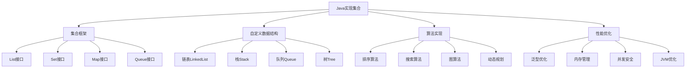

# Java实现集合

## 📖 核心概念

**Java实现集合**是使用Java语言实现各种数据结构和算法的实践。Java的面向对象特性、泛型机制、集合框架和垃圾回收机制，使得数据结构的实现更加安全、可靠和高效。

### 🏗️ Java实现集合分类



## 🔧 Java实现集合

### 基础数据结构实现

```java
import java.util.*;

// 动态数组实现
class DynamicArray<T> {
    private Object[] data;
    private int capacity;
    private int size;
    
    public DynamicArray() {
        this.capacity = 4;
        this.size = 0;
        this.data = new Object[capacity];
    }
    
    private void resize() {
        capacity *= 2;
        Object[] newData = new Object[capacity];
        System.arraycopy(data, 0, newData, 0, size);
        data = newData;
    }
    
    public void add(T value) {
        if (size >= capacity) {
            resize();
        }
        data[size++] = value;
    }
    
    public void add(int index, T value) {
        if (index > size || index < 0) {
            throw new IndexOutOfBoundsException("Index out of range");
        }
        
        if (size >= capacity) {
            resize();
        }
        
        System.arraycopy(data, index, data, index + 1, size - index);
        data[index] = value;
        size++;
    }
    
    public T remove(int index) {
        if (index >= size || index < 0) {
            throw new IndexOutOfBoundsException("Index out of range");
        }
        
        @SuppressWarnings("unchecked")
        T removed = (T) data[index];
        System.arraycopy(data, index + 1, data, index, size - index - 1);
        size--;
        return removed;
    }
    
    @SuppressWarnings("unchecked")
    public T get(int index) {
        if (index >= size || index < 0) {
            throw new IndexOutOfBoundsException("Index out of range");
        }
        return (T) data[index];
    }
    
    public void set(int index, T value) {
        if (index >= size || index < 0) {
            throw new IndexOutOfBoundsException("Index out of range");
        }
        data[index] = value;
    }
    
    public int size() {
        return size;
    }
    
    public boolean isEmpty() {
        return size == 0;
    }
    
    @Override
    public String toString() {
        StringBuilder sb = new StringBuilder();
        sb.append("DynamicArray: [");
        for (int i = 0; i < size; i++) {
            sb.append(data[i]);
            if (i < size - 1) sb.append(", ");
        }
        sb.append("] (size: ").append(size).append(", capacity: ").append(capacity).append(")");
        return sb.toString();
    }
}

// 双向链表实现
class DoublyLinkedList<T> {
    private Node<T> head;
    private Node<T> tail;
    private int size;
    
    private static class Node<T> {
        T data;
        Node<T> prev;
        Node<T> next;
        
        Node(T data) {
            this.data = data;
        }
    }
    
    public DoublyLinkedList() {
        head = null;
        tail = null;
        size = 0;
    }
    
    public void addFirst(T data) {
        Node<T> newNode = new Node<>(data);
        
        if (head == null) {
            head = tail = newNode;
        } else {
            newNode.next = head;
            head.prev = newNode;
            head = newNode;
        }
        size++;
    }
    
    public void addLast(T data) {
        Node<T> newNode = new Node<>(data);
        
        if (tail == null) {
            head = tail = newNode;
        } else {
            tail.next = newNode;
            newNode.prev = tail;
            tail = newNode;
        }
        size++;
    }
    
    public void add(int index, T data) {
        if (index > size || index < 0) {
            throw new IndexOutOfBoundsException("Index out of range");
        }
        
        if (index == 0) {
            addFirst(data);
            return;
        }
        
        if (index == size) {
            addLast(data);
            return;
        }
        
        Node<T> current = head;
        for (int i = 0; i < index; i++) {
            current = current.next;
        }
        
        Node<T> newNode = new Node<>(data);
        newNode.prev = current.prev;
        newNode.next = current;
        current.prev.next = newNode;
        current.prev = newNode;
        size++;
    }
    
    public T removeFirst() {
        if (head == null) {
            throw new NoSuchElementException("List is empty");
        }
        
        T data = head.data;
        head = head.next;
        
        if (head == null) {
            tail = null;
        } else {
            head.prev = null;
        }
        
        size--;
        return data;
    }
    
    public T removeLast() {
        if (tail == null) {
            throw new NoSuchElementException("List is empty");
        }
        
        T data = tail.data;
        tail = tail.prev;
        
        if (tail == null) {
            head = null;
        } else {
            tail.next = null;
        }
        
        size--;
        return data;
    }
    
    public T remove(int index) {
        if (index >= size || index < 0) {
            throw new IndexOutOfBoundsException("Index out of range");
        }
        
        if (index == 0) {
            return removeFirst();
        }
        
        if (index == size - 1) {
            return removeLast();
        }
        
        Node<T> current = head;
        for (int i = 0; i < index; i++) {
            current = current.next;
        }
        
        current.prev.next = current.next;
        current.next.prev = current.prev;
        size--;
        
        return current.data;
    }
    
    public T get(int index) {
        if (index >= size || index < 0) {
            throw new IndexOutOfBoundsException("Index out of range");
        }
        
        Node<T> current = head;
        for (int i = 0; i < index; i++) {
            current = current.next;
        }
        
        return current.data;
    }
    
    public int size() {
        return size;
    }
    
    public boolean isEmpty() {
        return size == 0;
    }
    
    @Override
    public String toString() {
        StringBuilder sb = new StringBuilder();
        sb.append("DoublyLinkedList: [");
        Node<T> current = head;
        while (current != null) {
            sb.append(current.data);
            if (current.next != null) sb.append(", ");
            current = current.next;
        }
        sb.append("] (size: ").append(size).append(")");
        return sb.toString();
    }
}

// 栈实现
class Stack<T> {
    private List<T> items;
    
    public Stack() {
        items = new ArrayList<>();
    }
    
    public void push(T item) {
        items.add(item);
    }
    
    public T pop() {
        if (isEmpty()) {
            throw new NoSuchElementException("Stack is empty");
        }
        return items.remove(items.size() - 1);
    }
    
    public T peek() {
        if (isEmpty()) {
            throw new NoSuchElementException("Stack is empty");
        }
        return items.get(items.size() - 1);
    }
    
    public boolean isEmpty() {
        return items.isEmpty();
    }
    
    public int size() {
        return items.size();
    }
    
    @Override
    public String toString() {
        return "Stack: " + items + " (size: " + size() + ")";
    }
}

// 队列实现
class Queue<T> {
    private List<T> items;
    
    public Queue() {
        items = new ArrayList<>();
    }
    
    public void enqueue(T item) {
        items.add(item);
    }
    
    public T dequeue() {
        if (isEmpty()) {
            throw new NoSuchElementException("Queue is empty");
        }
        return items.remove(0);
    }
    
    public T front() {
        if (isEmpty()) {
            throw new NoSuchElementException("Queue is empty");
        }
        return items.get(0);
    }
    
    public boolean isEmpty() {
        return items.isEmpty();
    }
    
    public int size() {
        return items.size();
    }
    
    @Override
    public String toString() {
        return "Queue: " + items + " (size: " + size() + ")";
    }
}

// 优先队列实现
class PriorityQueue<T> {
    private List<PriorityItem<T>> items;
    
    private static class PriorityItem<T> {
        T item;
        int priority;
        
        PriorityItem(T item, int priority) {
            this.item = item;
            this.priority = priority;
        }
    }
    
    public PriorityQueue() {
        items = new ArrayList<>();
    }
    
    public void enqueue(T item, int priority) {
        PriorityItem<T> priorityItem = new PriorityItem<>(item, priority);
        items.add(priorityItem);
        items.sort((a, b) -> Integer.compare(a.priority, b.priority));
    }
    
    public T dequeue() {
        if (isEmpty()) {
            throw new NoSuchElementException("PriorityQueue is empty");
        }
        return items.remove(0).item;
    }
    
    public T peek() {
        if (isEmpty()) {
            throw new NoSuchElementException("PriorityQueue is empty");
        }
        return items.get(0).item;
    }
    
    public boolean isEmpty() {
        return items.isEmpty();
    }
    
    public int size() {
        return items.size();
    }
    
    @Override
    public String toString() {
        StringBuilder sb = new StringBuilder();
        sb.append("PriorityQueue: [");
        for (int i = 0; i < items.size(); i++) {
            PriorityItem<T> item = items.get(i);
            sb.append(item.item).append("(").append(item.priority).append(")");
            if (i < items.size() - 1) sb.append(", ");
        }
        sb.append("] (size: ").append(size()).append(")");
        return sb.toString();
    }
}
```

### 高级数据结构实现

```java
// 二叉搜索树实现
class BinarySearchTree<T extends Comparable<T>> {
    private Node<T> root;
    private int size;
    
    private static class Node<T> {
        T data;
        Node<T> left;
        Node<T> right;
        
        Node(T data) {
            this.data = data;
        }
    }
    
    public BinarySearchTree() {
        root = null;
        size = 0;
    }
    
    public void insert(T data) {
        root = insert(root, data);
        size++;
    }
    
    private Node<T> insert(Node<T> node, T data) {
        if (node == null) {
            return new Node<>(data);
        }
        
        if (data.compareTo(node.data) < 0) {
            node.left = insert(node.left, data);
        } else if (data.compareTo(node.data) > 0) {
            node.right = insert(node.right, data);
        }
        
        return node;
    }
    
    public boolean search(T data) {
        return search(root, data);
    }
    
    private boolean search(Node<T> node, T data) {
        if (node == null) {
            return false;
        }
        
        if (data.equals(node.data)) {
            return true;
        } else if (data.compareTo(node.data) < 0) {
            return search(node.left, data);
        } else {
            return search(node.right, data);
        }
    }
    
    public void delete(T data) {
        root = delete(root, data);
        size--;
    }
    
    private Node<T> delete(Node<T> node, T data) {
        if (node == null) {
            return node;
        }
        
        if (data.compareTo(node.data) < 0) {
            node.left = delete(node.left, data);
        } else if (data.compareTo(node.data) > 0) {
            node.right = delete(node.right, data);
        } else {
            if (node.left == null) {
                return node.right;
            } else if (node.right == null) {
                return node.left;
            }
            
            Node<T> minNode = findMin(node.right);
            node.data = minNode.data;
            node.right = delete(node.right, minNode.data);
        }
        
        return node;
    }
    
    private Node<T> findMin(Node<T> node) {
        while (node.left != null) {
            node = node.left;
        }
        return node;
    }
    
    public List<T> inorder() {
        List<T> result = new ArrayList<>();
        inorder(root, result);
        return result;
    }
    
    private void inorder(Node<T> node, List<T> result) {
        if (node != null) {
            inorder(node.left, result);
            result.add(node.data);
            inorder(node.right, result);
        }
    }
    
    public List<T> preorder() {
        List<T> result = new ArrayList<>();
        preorder(root, result);
        return result;
    }
    
    private void preorder(Node<T> node, List<T> result) {
        if (node != null) {
            result.add(node.data);
            preorder(node.left, result);
            preorder(node.right, result);
        }
    }
    
    public List<T> postorder() {
        List<T> result = new ArrayList<>();
        postorder(root, result);
        return result;
    }
    
    private void postorder(Node<T> node, List<T> result) {
        if (node != null) {
            postorder(node.left, result);
            postorder(node.right, result);
            result.add(node.data);
        }
    }
    
    public int size() {
        return size;
    }
    
    public boolean isEmpty() {
        return size == 0;
    }
    
    @Override
    public String toString() {
        return "BinarySearchTree: " + inorder() + " (size: " + size + ")";
    }
}

// 哈希表实现
class HashTable<K, V> {
    private List<Entry<K, V>>[] buckets;
    private int capacity;
    private int size;
    
    private static class Entry<K, V> {
        K key;
        V value;
        
        Entry(K key, V value) {
            this.key = key;
            this.value = value;
        }
    }
    
    @SuppressWarnings("unchecked")
    public HashTable(int capacity) {
        this.capacity = capacity;
        this.size = 0;
        this.buckets = new List[capacity];
        for (int i = 0; i < capacity; i++) {
            buckets[i] = new ArrayList<>();
        }
    }
    
    public HashTable() {
        this(16);
    }
    
    private int hash(K key) {
        return Math.abs(key.hashCode()) % capacity;
    }
    
    public void put(K key, V value) {
        int index = hash(key);
        List<Entry<K, V>> bucket = buckets[index];
        
        // 检查是否已存在
        for (Entry<K, V> entry : bucket) {
            if (entry.key.equals(key)) {
                entry.value = value;
                return;
            }
        }
        
        // 添加新条目
        bucket.add(new Entry<>(key, value));
        size++;
        
        // 检查是否需要扩容
        if (size > capacity * 0.75) {
            resize();
        }
    }
    
    public V get(K key) {
        int index = hash(key);
        List<Entry<K, V>> bucket = buckets[index];
        
        for (Entry<K, V> entry : bucket) {
            if (entry.key.equals(key)) {
                return entry.value;
            }
        }
        
        return null;
    }
    
    public V remove(K key) {
        int index = hash(key);
        List<Entry<K, V>> bucket = buckets[index];
        
        for (int i = 0; i < bucket.size(); i++) {
            Entry<K, V> entry = bucket.get(i);
            if (entry.key.equals(key)) {
                bucket.remove(i);
                size--;
                return entry.value;
            }
        }
        
        return null;
    }
    
    public boolean containsKey(K key) {
        return get(key) != null;
    }
    
    @SuppressWarnings("unchecked")
    private void resize() {
        List<Entry<K, V>>[] oldBuckets = buckets;
        capacity *= 2;
        buckets = new List[capacity];
        size = 0;
        
        for (int i = 0; i < capacity; i++) {
            buckets[i] = new ArrayList<>();
        }
        
        for (List<Entry<K, V>> bucket : oldBuckets) {
            for (Entry<K, V> entry : bucket) {
                put(entry.key, entry.value);
            }
        }
    }
    
    public int size() {
        return size;
    }
    
    public boolean isEmpty() {
        return size == 0;
    }
    
    @Override
    public String toString() {
        StringBuilder sb = new StringBuilder();
        sb.append("HashTable: {");
        boolean first = true;
        for (List<Entry<K, V>> bucket : buckets) {
            for (Entry<K, V> entry : bucket) {
                if (!first) sb.append(", ");
                sb.append(entry.key).append(": ").append(entry.value);
                first = false;
            }
        }
        sb.append("} (size: ").append(size).append(", capacity: ").append(capacity).append(")");
        return sb.toString();
    }
}

// 最小堆实现
class MinHeap<T extends Comparable<T>> {
    private List<T> heap;
    
    public MinHeap() {
        heap = new ArrayList<>();
    }
    
    private int parent(int index) {
        return (index - 1) / 2;
    }
    
    private int leftChild(int index) {
        return 2 * index + 1;
    }
    
    private int rightChild(int index) {
        return 2 * index + 2;
    }
    
    private void swap(int i, int j) {
        T temp = heap.get(i);
        heap.set(i, heap.get(j));
        heap.set(j, temp);
    }
    
    private void heapifyUp(int index) {
        while (index > 0) {
            int parent = parent(index);
            if (heap.get(index).compareTo(heap.get(parent)) >= 0) {
                break;
            }
            swap(index, parent);
            index = parent;
        }
    }
    
    private void heapifyDown(int index) {
        while (true) {
            int left = leftChild(index);
            int right = rightChild(index);
            int smallest = index;
            
            if (left < heap.size() && heap.get(left).compareTo(heap.get(smallest)) < 0) {
                smallest = left;
            }
            
            if (right < heap.size() && heap.get(right).compareTo(heap.get(smallest)) < 0) {
                smallest = right;
            }
            
            if (smallest == index) {
                break;
            }
            
            swap(index, smallest);
            index = smallest;
        }
    }
    
    public void push(T value) {
        heap.add(value);
        heapifyUp(heap.size() - 1);
    }
    
    public T pop() {
        if (isEmpty()) {
            throw new NoSuchElementException("Heap is empty");
        }
        
        if (heap.size() == 1) {
            return heap.remove(0);
        }
        
        T min = heap.get(0);
        heap.set(0, heap.get(heap.size() - 1));
        heap.remove(heap.size() - 1);
        heapifyDown(0);
        
        return min;
    }
    
    public T peek() {
        if (isEmpty()) {
            throw new NoSuchElementException("Heap is empty");
        }
        return heap.get(0);
    }
    
    public boolean isEmpty() {
        return heap.isEmpty();
    }
    
    public int size() {
        return heap.size();
    }
    
    @Override
    public String toString() {
        return "MinHeap: " + heap + " (size: " + size() + ")";
    }
}
```

### 算法实现

```java
// 排序算法实现
class SortingAlgorithms {
    public static <T extends Comparable<T>> void quickSort(List<T> list) {
        if (list.size() <= 1) return;
        quickSort(list, 0, list.size() - 1);
    }
    
    private static <T extends Comparable<T>> void quickSort(List<T> list, int low, int high) {
        if (low < high) {
            int pivotIndex = partition(list, low, high);
            quickSort(list, low, pivotIndex - 1);
            quickSort(list, pivotIndex + 1, high);
        }
    }
    
    private static <T extends Comparable<T>> int partition(List<T> list, int low, int high) {
        T pivot = list.get(high);
        int i = low - 1;
        
        for (int j = low; j < high; j++) {
            if (list.get(j).compareTo(pivot) <= 0) {
                i++;
                swap(list, i, j);
            }
        }
        
        swap(list, i + 1, high);
        return i + 1;
    }
    
    public static <T extends Comparable<T>> void mergeSort(List<T> list) {
        if (list.size() <= 1) return;
        mergeSort(list, 0, list.size() - 1);
    }
    
    private static <T extends Comparable<T>> void mergeSort(List<T> list, int left, int right) {
        if (left < right) {
            int mid = left + (right - left) / 2;
            mergeSort(list, left, mid);
            mergeSort(list, mid + 1, right);
            merge(list, left, mid, right);
        }
    }
    
    @SuppressWarnings("unchecked")
    private static <T extends Comparable<T>> void merge(List<T> list, int left, int mid, int right) {
        int n1 = mid - left + 1;
        int n2 = right - mid;
        
        List<T> leftList = new ArrayList<>();
        List<T> rightList = new ArrayList<>();
        
        for (int i = 0; i < n1; i++) {
            leftList.add(list.get(left + i));
        }
        for (int j = 0; j < n2; j++) {
            rightList.add(list.get(mid + 1 + j));
        }
        
        int i = 0, j = 0, k = left;
        
        while (i < n1 && j < n2) {
            if (leftList.get(i).compareTo(rightList.get(j)) <= 0) {
                list.set(k, leftList.get(i));
                i++;
            } else {
                list.set(k, rightList.get(j));
                j++;
            }
            k++;
        }
        
        while (i < n1) {
            list.set(k, leftList.get(i));
            i++;
            k++;
        }
        
        while (j < n2) {
            list.set(k, rightList.get(j));
            j++;
            k++;
        }
    }
    
    public static <T extends Comparable<T>> void heapSort(List<T> list) {
        MinHeap<T> heap = new MinHeap<>();
        for (T item : list) {
            heap.push(item);
        }
        
        list.clear();
        while (!heap.isEmpty()) {
            list.add(heap.pop());
        }
    }
    
    private static <T> void swap(List<T> list, int i, int j) {
        T temp = list.get(i);
        list.set(i, list.get(j));
        list.set(j, temp);
    }
}

// 搜索算法实现
class SearchAlgorithms {
    public static <T extends Comparable<T>> int binarySearch(List<T> list, T target) {
        int left = 0;
        int right = list.size() - 1;
        
        while (left <= right) {
            int mid = left + (right - left) / 2;
            int comparison = list.get(mid).compareTo(target);
            
            if (comparison == 0) {
                return mid;
            } else if (comparison < 0) {
                left = mid + 1;
            } else {
                right = mid - 1;
            }
        }
        
        return -1;
    }
    
    public static <T> int linearSearch(List<T> list, T target) {
        for (int i = 0; i < list.size(); i++) {
            if (list.get(i).equals(target)) {
                return i;
            }
        }
        return -1;
    }
    
    public static void dfs(Map<Integer, List<Integer>> graph, int start, Set<Integer> visited) {
        visited.add(start);
        System.out.print(start + " ");
        
        for (int neighbor : graph.getOrDefault(start, new ArrayList<>())) {
            if (!visited.contains(neighbor)) {
                dfs(graph, neighbor, visited);
            }
        }
    }
    
    public static void bfs(Map<Integer, List<Integer>> graph, int start) {
        Set<Integer> visited = new HashSet<>();
        Queue<Integer> queue = new LinkedList<>();
        
        visited.add(start);
        queue.offer(start);
        
        while (!queue.isEmpty()) {
            int node = queue.poll();
            System.out.print(node + " ");
            
            for (int neighbor : graph.getOrDefault(node, new ArrayList<>())) {
                if (!visited.contains(neighbor)) {
                    visited.add(neighbor);
                    queue.offer(neighbor);
                }
            }
        }
    }
}

// 动态规划算法实现
class DynamicProgramming {
    public static long fibonacci(int n) {
        if (n <= 1) return n;
        
        long[] dp = new long[n + 1];
        dp[1] = 1;
        
        for (int i = 2; i <= n; i++) {
            dp[i] = dp[i - 1] + dp[i - 2];
        }
        
        return dp[n];
    }
    
    public static int longestCommonSubsequence(String text1, String text2) {
        int m = text1.length();
        int n = text2.length();
        int[][] dp = new int[m + 1][n + 1];
        
        for (int i = 1; i <= m; i++) {
            for (int j = 1; j <= n; j++) {
                if (text1.charAt(i - 1) == text2.charAt(j - 1)) {
                    dp[i][j] = dp[i - 1][j - 1] + 1;
                } else {
                    dp[i][j] = Math.max(dp[i - 1][j], dp[i][j - 1]);
                }
            }
        }
        
        return dp[m][n];
    }
    
    public static int knapsack(int[] weights, int[] values, int capacity) {
        int n = weights.length;
        int[][] dp = new int[n + 1][capacity + 1];
        
        for (int i = 1; i <= n; i++) {
            for (int w = 1; w <= capacity; w++) {
                if (weights[i - 1] <= w) {
                    dp[i][w] = Math.max(
                        dp[i - 1][w],
                        dp[i - 1][w - weights[i - 1]] + values[i - 1]
                    );
                } else {
                    dp[i][w] = dp[i - 1][w];
                }
            }
        }
        
        return dp[n][capacity];
    }
}
```

## 🎯 Java实现集合应用

### 实际应用场景

```java
class JavaImplementationApplications {
    public static void demonstrateApplications() {
        System.out.println("Java Implementation Applications:");
        System.out.println("=================================");
        
        System.out.println("1. 企业级应用:");
        System.out.println("   - Spring框架");
        System.out.println("   - 微服务架构");
        System.out.println("   - 分布式系统");
        
        System.out.println("2. Android开发:");
        System.out.println("   - 移动应用");
        System.out.println("   - 游戏开发");
        System.out.println("   - 系统应用");
        
        System.out.println("3. 大数据处理:");
        System.out.println("   - Hadoop生态");
        System.out.println("   - Spark计算");
        System.out.println("   - 流处理");
        
        System.out.println("4. 金融系统:");
        System.out.println("   - 交易系统");
        System.out.println("   - 风险控制");
        System.out.println("   - 支付系统");
    }
    
    public static void analyzePerformance() {
        System.out.println("Java Implementation Performance Analysis:");
        System.out.println("=======================================");
        
        System.out.println("1. 性能特点:");
        System.out.println("   - JVM优化: 即时编译优化");
        System.out.println("   - 垃圾回收: 自动内存管理");
        System.out.println("   - 多线程: 内置并发支持");
        System.out.println("   - 类型安全: 编译时类型检查");
        System.out.println();
        
        System.out.println("2. 性能指标:");
        System.out.println("   - 执行速度: 接近C++");
        System.out.println("   - 内存使用: 自动管理");
        System.out.println("   - 开发效率: 高");
        System.out.println("   - 可维护性: 好");
        System.out.println();
        
        System.out.println("3. 优化策略:");
        System.out.println("   - JVM调优: 堆内存设置");
        System.out.println("   - 垃圾回收: GC策略选择");
        System.out.println("   - 并发优化: 线程池管理");
        System.out.println("   - 代码优化: 算法选择");
    }
    
    public static void selectImplementationStrategy(boolean needsHighPerformance, boolean needsConcurrency, boolean needsEnterprise) {
        System.out.println("Implementation Strategy Selection:");
        System.out.println("=================================");
        
        System.out.println("Needs high performance: " + needsHighPerformance);
        System.out.println("Needs concurrency: " + needsConcurrency);
        System.out.println("Needs enterprise features: " + needsEnterprise);
        
        System.out.println("Recommendation:");
        
        if (needsHighPerformance && needsConcurrency) {
            System.out.println("Use Java with concurrent collections and JVM optimization");
        } else if (needsConcurrency && needsEnterprise) {
            System.out.println("Use Java with Spring framework and enterprise patterns");
        } else if (needsHighPerformance && needsEnterprise) {
            System.out.println("Use Java with performance monitoring and enterprise tools");
        } else if (needsHighPerformance) {
            System.out.println("Use Java with JVM tuning and performance profiling");
        } else if (needsConcurrency) {
            System.out.println("Use Java with concurrent programming and thread pools");
        } else if (needsEnterprise) {
            System.out.println("Use Java with enterprise frameworks and design patterns");
        } else {
            System.out.println("Use Java with standard library and best practices");
        }
    }
}
```

## 📊 Java实现集合分析

### 性能分析

```java
class JavaImplementationAnalysis {
    public static void analyzePerformance() {
        System.out.println("Java Implementation Performance Analysis:");
        System.out.println("=======================================");
        
        System.out.println("1. 时间复杂度:");
        System.out.println("   - ArrayList: O(1) 访问, O(n) 插入/删除");
        System.out.println("   - LinkedList: O(n) 访问, O(1) 插入/删除");
        System.out.println("   - HashMap: O(1) 平均, O(n) 最坏");
        System.out.println("   - TreeMap: O(log n) 所有操作");
        System.out.println("   - PriorityQueue: O(log n) 插入/删除");
        System.out.println();
        
        System.out.println("2. 空间复杂度:");
        System.out.println("   - ArrayList: O(n)");
        System.out.println("   - LinkedList: O(n)");
        System.out.println("   - HashMap: O(n)");
        System.out.println("   - TreeMap: O(n)");
        System.out.println("   - PriorityQueue: O(n)");
        System.out.println();
        
        System.out.println("3. 内存使用:");
        System.out.println("   - ArrayList: 连续内存, 缓存友好");
        System.out.println("   - LinkedList: 分散内存, 缓存不友好");
        System.out.println("   - HashMap: 分散内存, 哈希冲突");
        System.out.println("   - TreeMap: 分散内存, 平衡树");
        System.out.println("   - PriorityQueue: 连续内存, 缓存友好");
    }
    
    public static void analyzeSpaceComplexity() {
        System.out.println("Java Implementation Space Complexity Analysis:");
        System.out.println("===========================================");
        
        System.out.println("1. 内存管理:");
        System.out.println("   - 堆内存: 对象存储");
        System.out.println("   - 栈内存: 方法调用");
        System.out.println("   - 方法区: 类信息存储");
        System.out.println("   - 程序计数器: 指令执行");
        System.out.println();
        
        System.out.println("2. 垃圾回收:");
        System.out.println("   - 标记清除: 内存碎片");
        System.out.println("   - 复制算法: 内存浪费");
        System.out.println("   - 标记整理: 内存整理");
        System.out.println("   - 分代收集: 性能优化");
        System.out.println();
        
        System.out.println("3. 内存优化:");
        System.out.println("   - 对象池: 重用对象");
        System.out.println("   - 弱引用: 避免内存泄漏");
        System.out.println("   - 软引用: 内存不足时回收");
        System.out.println("   - 虚引用: 对象回收通知");
    }
    
    public static void analyzeTimeComplexity() {
        System.out.println("Java Implementation Time Complexity Analysis:");
        System.out.println("==========================================");
        
        System.out.println("1. 算法复杂度:");
        System.out.println("   - 快速排序: O(n log n) 平均, O(n^2) 最坏");
        System.out.println("   - 归并排序: O(n log n) 稳定");
        System.out.println("   - 堆排序: O(n log n) 不稳定");
        System.out.println("   - 二分搜索: O(log n)");
        System.out.println("   - 深度优先搜索: O(V + E)");
        System.out.println("   - 广度优先搜索: O(V + E)");
        System.out.println();
        
        System.out.println("2. 数据结构操作:");
        System.out.println("   - ArrayList: O(1) 访问, O(n) 插入/删除");
        System.out.println("   - LinkedList: O(n) 访问, O(1) 插入/删除");
        System.out.println("   - HashMap: O(1) 平均");
        System.out.println("   - TreeMap: O(log n) 所有操作");
        System.out.println("   - PriorityQueue: O(log n) 插入/删除");
        System.out.println();
        
        System.out.println("3. 优化技术:");
        System.out.println("   - JIT编译: 运行时优化");
        System.out.println("   - 内联优化: 方法调用优化");
        System.out.println("   - 循环优化: 循环展开");
        System.out.println("   - 分支预测: CPU优化");
    }
}
```

## 🎮 Java实现集合测试

### 1. 基础功能测试

```java
public class JavaImplementationTest {
    public static void testBasicDataStructures() {
        System.out.println("Testing Basic Data Structures:");
        System.out.println("============================");
        
        // 测试动态数组
        DynamicArray<Integer> arr = new DynamicArray<>();
        arr.add(1);
        arr.add(2);
        arr.add(3);
        arr.add(1, 10);
        System.out.println(arr);
        
        // 测试双向链表
        DoublyLinkedList<Integer> list = new DoublyLinkedList<>();
        list.addLast(1);
        list.addLast(2);
        list.addFirst(0);
        list.add(2, 5);
        System.out.println(list);
        
        // 测试栈
        Stack<Integer> stack = new Stack<>();
        stack.push(1);
        stack.push(2);
        stack.push(3);
        System.out.println(stack);
        
        // 测试队列
        Queue<Integer> queue = new Queue<>();
        queue.enqueue(1);
        queue.enqueue(2);
        queue.enqueue(3);
        System.out.println(queue);
        
        // 测试优先队列
        PriorityQueue<String> pq = new PriorityQueue<>();
        pq.enqueue("task1", 3);
        pq.enqueue("task2", 1);
        pq.enqueue("task3", 2);
        System.out.println(pq);
    }
    
    public static void testAdvancedDataStructures() {
        System.out.println("Testing Advanced Data Structures:");
        System.out.println("===============================");
        
        // 测试二叉搜索树
        BinarySearchTree<Integer> bst = new BinarySearchTree<>();
        bst.insert(5);
        bst.insert(3);
        bst.insert(7);
        bst.insert(1);
        bst.insert(9);
        System.out.println(bst);
        System.out.println("Inorder: " + bst.inorder());
        System.out.println("Preorder: " + bst.preorder());
        System.out.println("Postorder: " + bst.postorder());
        
        // 测试哈希表
        HashTable<String, Integer> ht = new HashTable<>();
        ht.put("apple", 5);
        ht.put("banana", 3);
        ht.put("orange", 7);
        System.out.println(ht);
        System.out.println("Get apple: " + ht.get("apple"));
        
        // 测试最小堆
        MinHeap<Integer> heap = new MinHeap<>();
        heap.push(5);
        heap.push(3);
        heap.push(7);
        heap.push(1);
        heap.push(9);
        System.out.println(heap);
    }
    
    public static void testAlgorithms() {
        System.out.println("Testing Algorithms:");
        System.out.println("=================");
        
        // 测试排序算法
        List<Integer> list = new ArrayList<>(Arrays.asList(5, 2, 8, 1, 9, 3, 7, 4, 6));
        System.out.println("Original list: " + list);
        
        // 快速排序
        List<Integer> list1 = new ArrayList<>(list);
        SortingAlgorithms.quickSort(list1);
        System.out.println("Quick sort: " + list1);
        
        // 归并排序
        List<Integer> list2 = new ArrayList<>(list);
        SortingAlgorithms.mergeSort(list2);
        System.out.println("Merge sort: " + list2);
        
        // 堆排序
        List<Integer> list3 = new ArrayList<>(list);
        SortingAlgorithms.heapSort(list3);
        System.out.println("Heap sort: " + list3);
        
        // 测试搜索算法
        List<Integer> sortedList = Arrays.asList(1, 2, 3, 4, 5, 6, 7, 8, 9);
        int index = SearchAlgorithms.binarySearch(sortedList, 5);
        System.out.println("Binary search for 5: index " + index);
        
        // 测试动态规划
        long fib = DynamicProgramming.fibonacci(10);
        System.out.println("Fibonacci(10): " + fib);
        
        int lcs = DynamicProgramming.longest_common_subsequence("ABCDGH", "AEDFHR");
        System.out.println("LCS of 'ABCDGH' and 'AEDFHR': " + lcs);
    }
    
    public static void testApplications() {
        System.out.println("Testing Applications:");
        System.out.println("==================");
        
        JavaImplementationApplications.demonstrateApplications();
        JavaImplementationApplications.analyzePerformance();
        JavaImplementationApplications.selectImplementationStrategy(true, true, false);
    }
    
    public static void testAnalysis() {
        System.out.println("Testing Analysis:");
        System.out.println("===============");
        
        JavaImplementationAnalysis.analyzePerformance();
        JavaImplementationAnalysis.analyzeSpaceComplexity();
        JavaImplementationAnalysis.analyzeTimeComplexity();
    }
    
    public static void main(String[] args) {
        testBasicDataStructures();
        System.out.println();
        testAdvancedDataStructures();
        System.out.println();
        testAlgorithms();
        System.out.println();
        testApplications();
        System.out.println();
        testAnalysis();
    }
}
```

## 🔗 相关链接

- [[01-C++实现集合|C++实现集合]]
- [[02-Python实现集合|Python实现集合]]
- [[03-算法挑战|算法挑战]]

## 💡 Java实现集合要点

1. **类型安全**: 泛型机制提供编译时类型检查
2. **内存管理**: 自动垃圾回收，避免内存泄漏
3. **并发支持**: 内置多线程和并发集合
4. **企业级**: 丰富的框架和工具支持

---

*📝 Java实现集合提示：Java实现注重类型安全、内存管理和企业级特性，充分利用Java的面向对象特性和丰富的生态系统*
