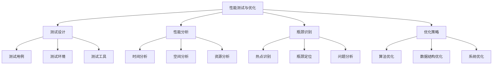

# 性能测试与优化

## 📖 核心概念

**性能测试与优化**是数据结构学习的高级实践环节，通过系统性的性能测试、分析和优化，深入理解数据结构的性能特征、瓶颈识别和优化策略。这是从理论到实践的关键桥梁，是提升系统性能的重要技能。

### 🏗️ 性能测试的组成要素



## 🔍 性能测试分类

### 按测试类型分类

| 测试类型 | 特点 | 目标 | 方法 | 工具 |
|----------|------|------|------|------|
| **基准测试** | 标准化测试 | 性能对比 | 固定数据集 | Google Benchmark |
| **压力测试** | 极限测试 | 性能上限 | 大数据量 | 自定义工具 |
| **回归测试** | 版本对比 | 性能保持 | 历史数据 | CI/CD集成 |
| **微基准测试** | 精确测试 | 细节分析 | 单一操作 | 高精度计时器 |

### 按优化层次分类

| 优化层次 | 特点 | 影响范围 | 优化难度 | 效果 |
|----------|------|----------|----------|------|
| **算法优化** | 根本性改进 | 全局性能 | 困难 | 显著 |
| **数据结构优化** | 结构改进 | 局部性能 | 中等 | 明显 |
| **代码优化** | 实现改进 | 微观性能 | 简单 | 有限 |
| **系统优化** | 环境优化 | 整体性能 | 复杂 | 显著 |

## 💻 性能测试框架

### 基准测试框架

```cpp
#include <chrono>
#include <vector>
#include <string>
#include <iostream>
#include <fstream>
#include <iomanip>

class PerformanceBenchmark {
private:
    struct TestResult {
        std::string testName;
        size_t dataSize;
        double executionTime; // 微秒
        size_t memoryUsage;   // 字节
        double throughput;    // 操作/秒
        std::string notes;
        
        TestResult(const std::string& name, size_t size, double time, 
                  size_t memory = 0, const std::string& note = "")
            : testName(name), dataSize(size), executionTime(time), 
              memoryUsage(memory), throughput(size / (time / 1000000.0)), notes(note) {}
    };
    
    std::vector<TestResult> results;
    std::string outputFile;
    
    // 获取当前时间（微秒）
    double getCurrentTime() const {
        auto now = std::chrono::high_resolution_clock::now();
        auto duration = now.time_since_epoch();
        return std::chrono::duration_cast<std::chrono::microseconds>(duration).count();
    }
    
    // 获取内存使用量（简化实现）
    size_t getMemoryUsage() const {
        // 实际实现中可以使用系统API获取真实内存使用量
        return 0;
    }
    
public:
    PerformanceBenchmark(const std::string& output = "benchmark_results.txt") 
        : outputFile(output) {}
    
    // 运行基准测试
    template<typename Func>
    void runBenchmark(const std::string& testName, size_t dataSize, 
                     Func testFunction, const std::string& notes = "") {
        // 预热
        for (int i = 0; i < 3; i++) {
            testFunction();
        }
        
        // 正式测试
        double startTime = getCurrentTime();
        testFunction();
        double endTime = getCurrentTime();
        
        double executionTime = endTime - startTime;
        size_t memoryUsage = getMemoryUsage();
        
        results.emplace_back(testName, dataSize, executionTime, memoryUsage, notes);
        
        std::cout << "Test: " << testName 
                  << ", Size: " << dataSize
                  << ", Time: " << std::fixed << std::setprecision(2) << executionTime << "μs"
                  << ", Throughput: " << std::fixed << std::setprecision(0) 
                  << (dataSize / (executionTime / 1000000.0)) << " ops/sec"
                  << std::endl;
    }
    
    // 运行多次测试取平均值
    template<typename Func>
    void runBenchmarkMultiple(const std::string& testName, size_t dataSize, 
                            Func testFunction, int iterations = 10, 
                            const std::string& notes = "") {
        std::vector<double> times;
        
        // 预热
        for (int i = 0; i < 3; i++) {
            testFunction();
        }
        
        // 多次测试
        for (int i = 0; i < iterations; i++) {
            double startTime = getCurrentTime();
            testFunction();
            double endTime = getCurrentTime();
            times.push_back(endTime - startTime);
        }
        
        // 计算统计信息
        double avgTime = 0;
        for (double time : times) {
            avgTime += time;
        }
        avgTime /= times.size();
        
        double minTime = *std::min_element(times.begin(), times.end());
        double maxTime = *std::max_element(times.begin(), times.end());
        
        // 计算标准差
        double variance = 0;
        for (double time : times) {
            variance += (time - avgTime) * (time - avgTime);
        }
        variance /= times.size();
        double stdDev = std::sqrt(variance);
        
        results.emplace_back(testName, dataSize, avgTime, getMemoryUsage(), 
                           notes + " (min:" + std::to_string(minTime) + 
                           "μs, max:" + std::to_string(maxTime) + 
                           "μs, std:" + std::to_string(stdDev) + "μs)");
        
        std::cout << "Test: " << testName 
                  << ", Size: " << dataSize
                  << ", Avg Time: " << std::fixed << std::setprecision(2) << avgTime << "μs"
                  << ", Min: " << minTime << "μs"
                  << ", Max: " << maxTime << "μs"
                  << ", StdDev: " << std::fixed << std::setprecision(2) << stdDev << "μs"
                  << std::endl;
    }
    
    // 生成性能报告
    void generateReport() const {
        std::ofstream file(outputFile);
        if (!file.is_open()) {
            std::cerr << "Failed to open output file: " << outputFile << std::endl;
            return;
        }
        
        file << "Performance Benchmark Report\n";
        file << "==========================\n\n";
        
        file << std::left << std::setw(20) << "Test Name"
             << std::setw(12) << "Data Size"
             << std::setw(15) << "Time (μs)"
             << std::setw(15) << "Throughput"
             << std::setw(12) << "Memory (B)"
             << "Notes\n";
        file << std::string(80, '-') << "\n";
        
        for (const auto& result : results) {
            file << std::left << std::setw(20) << result.testName
                 << std::setw(12) << result.dataSize
                 << std::setw(15) << std::fixed << std::setprecision(2) << result.executionTime
                 << std::setw(15) << std::fixed << std::setprecision(0) << result.throughput
                 << std::setw(12) << result.memoryUsage
                 << result.notes << "\n";
        }
        
        file.close();
        std::cout << "Report saved to: " << outputFile << std::endl;
    }
    
    // 比较测试结果
    void compareResults(const std::string& test1, const std::string& test2) const {
        auto findResult = [this](const std::string& name) -> const TestResult* {
            for (const auto& result : results) {
                if (result.testName == name) {
                    return &result;
                }
            }
            return nullptr;
        };
        
        const TestResult* r1 = findResult(test1);
        const TestResult* r2 = findResult(test2);
        
        if (!r1 || !r2) {
            std::cerr << "Test results not found" << std::endl;
            return;
        }
        
        double speedup = r1->executionTime / r2->executionTime;
        double throughputRatio = r2->throughput / r1->throughput;
        
        std::cout << "\nComparison: " << test1 << " vs " << test2 << "\n";
        std::cout << "Speedup: " << std::fixed << std::setprecision(2) << speedup << "x\n";
        std::cout << "Throughput ratio: " << std::fixed << std::setprecision(2) << throughputRatio << "x\n";
        
        if (speedup > 1) {
            std::cout << test2 << " is " << speedup << "x faster than " << test1 << std::endl;
        } else {
            std::cout << test1 << " is " << (1.0 / speedup) << "x faster than " << test2 << std::endl;
        }
    }
    
    // 清空结果
    void clear() {
        results.clear();
    }
};
```

### 内存分析工具

```cpp
class MemoryProfiler {
private:
    struct MemoryBlock {
        void* ptr;
        size_t size;
        std::string location;
        std::chrono::steady_clock::time_point timestamp;
        
        MemoryBlock(void* p, size_t s, const std::string& loc) 
            : ptr(p), size(s), location(loc) {
            timestamp = std::chrono::steady_clock::now();
        }
    };
    
    std::unordered_map<void*, MemoryBlock> allocatedBlocks;
    size_t totalAllocated;
    size_t peakAllocated;
    bool profilingEnabled;
    
public:
    MemoryProfiler() : totalAllocated(0), peakAllocated(0), profilingEnabled(false) {}
    
    // 开始内存分析
    void startProfiling() {
        profilingEnabled = true;
        totalAllocated = 0;
        peakAllocated = 0;
        allocatedBlocks.clear();
    }
    
    // 停止内存分析
    void stopProfiling() {
        profilingEnabled = false;
    }
    
    // 记录内存分配
    void recordAllocation(void* ptr, size_t size, const std::string& location = "") {
        if (!profilingEnabled) return;
        
        allocatedBlocks[ptr] = MemoryBlock(ptr, size, location);
        totalAllocated += size;
        peakAllocated = std::max(peakAllocated, totalAllocated);
    }
    
    // 记录内存释放
    void recordDeallocation(void* ptr) {
        if (!profilingEnabled) return;
        
        auto it = allocatedBlocks.find(ptr);
        if (it != allocatedBlocks.end()) {
            totalAllocated -= it->second.size;
            allocatedBlocks.erase(it);
        }
    }
    
    // 获取内存统计信息
    struct MemoryStats {
        size_t currentAllocated;
        size_t peakAllocated;
        size_t totalBlocks;
        std::unordered_map<std::string, size_t> allocationByLocation;
    };
    
    MemoryStats getStats() const {
        MemoryStats stats;
        stats.currentAllocated = totalAllocated;
        stats.peakAllocated = peakAllocated;
        stats.totalBlocks = allocatedBlocks.size();
        
        for (const auto& [ptr, block] : allocatedBlocks) {
            stats.allocationByLocation[block.location] += block.size;
        }
        
        return stats;
    }
    
    // 生成内存报告
    void generateMemoryReport() const {
        auto stats = getStats();
        
        std::cout << "\nMemory Profiling Report\n";
        std::cout << "======================\n";
        std::cout << "Current allocated: " << stats.currentAllocated << " bytes\n";
        std::cout << "Peak allocated: " << stats.peakAllocated << " bytes\n";
        std::cout << "Total blocks: " << stats.totalBlocks << "\n\n";
        
        std::cout << "Allocation by location:\n";
        for (const auto& [location, size] : stats.allocationByLocation) {
            std::cout << "  " << location << ": " << size << " bytes\n";
        }
    }
    
    // 检测内存泄漏
    void detectMemoryLeaks() const {
        if (allocatedBlocks.empty()) {
            std::cout << "No memory leaks detected.\n";
            return;
        }
        
        std::cout << "\nPotential memory leaks detected:\n";
        for (const auto& [ptr, block] : allocatedBlocks) {
            std::cout << "  Address: " << ptr 
                      << ", Size: " << block.size 
                      << " bytes, Location: " << block.location << "\n";
        }
    }
};

// 全局内存分析器实例
MemoryProfiler g_memoryProfiler;

// 重载new和delete操作符进行内存跟踪
void* operator new(size_t size) {
    void* ptr = std::malloc(size);
    g_memoryProfiler.recordAllocation(ptr, size, "operator new");
    return ptr;
}

void operator delete(void* ptr) noexcept {
    g_memoryProfiler.recordDeallocation(ptr);
    std::free(ptr);
}
```

## 💻 性能分析工具

### 性能分析器

```cpp
class PerformanceAnalyzer {
private:
    struct PerformanceMetric {
        std::string operation;
        double totalTime;
        size_t callCount;
        double averageTime;
        double minTime;
        double maxTime;
        
        PerformanceMetric(const std::string& op) 
            : operation(op), totalTime(0), callCount(0), 
              averageTime(0), minTime(std::numeric_limits<double>::max()), 
              maxTime(0) {}
        
        void addMeasurement(double time) {
            totalTime += time;
            callCount++;
            averageTime = totalTime / callCount;
            minTime = std::min(minTime, time);
            maxTime = std::max(maxTime, time);
        }
    };
    
    std::unordered_map<std::string, PerformanceMetric> metrics;
    bool profilingEnabled;
    
public:
    PerformanceAnalyzer() : profilingEnabled(false) {}
    
    // 开始性能分析
    void startProfiling() {
        profilingEnabled = true;
        metrics.clear();
    }
    
    // 停止性能分析
    void stopProfiling() {
        profilingEnabled = false;
    }
    
    // 记录操作时间
    void recordOperation(const std::string& operation, double time) {
        if (!profilingEnabled) return;
        
        auto it = metrics.find(operation);
        if (it == metrics.end()) {
            metrics[operation] = PerformanceMetric(operation);
        }
        
        metrics[operation].addMeasurement(time);
    }
    
    // 性能分析装饰器
    class ProfilerScope {
    private:
        std::string operation;
        std::chrono::high_resolution_clock::time_point startTime;
        PerformanceAnalyzer* analyzer;
        
    public:
        ProfilerScope(const std::string& op, PerformanceAnalyzer* profiler) 
            : operation(op), analyzer(profiler) {
            startTime = std::chrono::high_resolution_clock::now();
        }
        
        ~ProfilerScope() {
            auto endTime = std::chrono::high_resolution_clock::now();
            auto duration = std::chrono::duration_cast<std::chrono::microseconds>(
                endTime - startTime).count();
            
            if (analyzer) {
                analyzer->recordOperation(operation, duration);
            }
        }
    };
    
    // 创建性能分析作用域
    ProfilerScope profile(const std::string& operation) {
        return ProfilerScope(operation, this);
    }
    
    // 获取性能报告
    void generateReport() const {
        std::cout << "\nPerformance Analysis Report\n";
        std::cout << "==========================\n";
        
        std::cout << std::left << std::setw(20) << "Operation"
                  << std::setw(12) << "Calls"
                  << std::setw(15) << "Total (μs)"
                  << std::setw(15) << "Avg (μs)"
                  << std::setw(15) << "Min (μs)"
                  << std::setw(15) << "Max (μs)" << "\n";
        std::cout << std::string(90, '-') << "\n";
        
        for (const auto& [name, metric] : metrics) {
            std::cout << std::left << std::setw(20) << name
                      << std::setw(12) << metric.callCount
                      << std::setw(15) << std::fixed << std::setprecision(2) << metric.totalTime
                      << std::setw(15) << std::fixed << std::setprecision(2) << metric.averageTime
                      << std::setw(15) << std::fixed << std::setprecision(2) << metric.minTime
                      << std::setw(15) << std::fixed << std::setprecision(2) << metric.maxTime << "\n";
        }
    }
    
    // 识别性能热点
    std::vector<std::string> identifyHotspots(double threshold = 0.1) const {
        std::vector<std::string> hotspots;
        
        // 计算总时间
        double totalTime = 0;
        for (const auto& [name, metric] : metrics) {
            totalTime += metric.totalTime;
        }
        
        // 找出占用时间超过阈值的操作
        for (const auto& [name, metric] : metrics) {
            double percentage = metric.totalTime / totalTime;
            if (percentage > threshold) {
                hotspots.push_back(name);
            }
        }
        
        return hotspots;
    }
};
```

### 缓存性能分析

```cpp
class CachePerformanceAnalyzer {
private:
    struct CacheMetrics {
        size_t cacheHits;
        size_t cacheMisses;
        size_t totalAccesses;
        double hitRate;
        double missRate;
        
        CacheMetrics() : cacheHits(0), cacheMisses(0), totalAccesses(0), 
                        hitRate(0), missRate(0) {}
        
        void updateRates() {
            totalAccesses = cacheHits + cacheMisses;
            if (totalAccesses > 0) {
                hitRate = static_cast<double>(cacheHits) / totalAccesses;
                missRate = static_cast<double>(cacheMisses) / totalAccesses;
            }
        }
    };
    
    std::unordered_map<std::string, CacheMetrics> cacheMetrics;
    
public:
    // 记录缓存命中
    void recordCacheHit(const std::string& cacheName) {
        cacheMetrics[cacheName].cacheHits++;
        cacheMetrics[cacheName].updateRates();
    }
    
    // 记录缓存未命中
    void recordCacheMiss(const std::string& cacheName) {
        cacheMetrics[cacheName].cacheMisses++;
        cacheMetrics[cacheName].updateRates();
    }
    
    // 获取缓存性能报告
    void generateCacheReport() const {
        std::cout << "\nCache Performance Report\n";
        std::cout << "=======================\n";
        
        std::cout << std::left << std::setw(15) << "Cache Name"
                  << std::setw(12) << "Hits"
                  << std::setw(12) << "Misses"
                  << std::setw(15) << "Total"
                  << std::setw(12) << "Hit Rate"
                  << std::setw(12) << "Miss Rate" << "\n";
        std::cout << std::string(80, '-') << "\n";
        
        for (const auto& [name, metrics] : cacheMetrics) {
            std::cout << std::left << std::setw(15) << name
                      << std::setw(12) << metrics.cacheHits
                      << std::setw(12) << metrics.cacheMisses
                      << std::setw(15) << metrics.totalAccesses
                      << std::setw(12) << std::fixed << std::setprecision(2) 
                      << (metrics.hitRate * 100) << "%"
                      << std::setw(12) << std::fixed << std::setprecision(2) 
                      << (metrics.missRate * 100) << "%" << "\n";
        }
    }
    
    // 分析缓存效率
    void analyzeCacheEfficiency() const {
        std::cout << "\nCache Efficiency Analysis\n";
        std::cout << "========================\n";
        
        for (const auto& [name, metrics] : cacheMetrics) {
            std::cout << "Cache: " << name << "\n";
            
            if (metrics.hitRate > 0.8) {
                std::cout << "  Status: Excellent (Hit rate > 80%)\n";
            } else if (metrics.hitRate > 0.6) {
                std::cout << "  Status: Good (Hit rate > 60%)\n";
            } else if (metrics.hitRate > 0.4) {
                std::cout << "  Status: Fair (Hit rate > 40%)\n";
            } else {
                std::cout << "  Status: Poor (Hit rate < 40%)\n";
            }
            
            std::cout << "  Recommendation: ";
            if (metrics.hitRate < 0.5) {
                std::cout << "Consider increasing cache size or improving access pattern\n";
            } else {
                std::cout << "Cache performance is acceptable\n";
            }
            std::cout << "\n";
        }
    }
};
```

## 🎯 优化策略实现

### 算法优化示例

```cpp
class AlgorithmOptimizer {
public:
    // 优化冒泡排序
    static void optimizedBubbleSort(std::vector<int>& arr) {
        int n = arr.size();
        bool swapped;
        
        for (int i = 0; i < n - 1; i++) {
            swapped = false;
            
            // 内层循环优化：每次减少比较次数
            for (int j = 0; j < n - i - 1; j++) {
                if (arr[j] > arr[j + 1]) {
                    std::swap(arr[j], arr[j + 1]);
                    swapped = true;
                }
            }
            
            // 如果没有交换，说明已经有序
            if (!swapped) {
                break;
            }
        }
    }
    
    // 优化快速排序
    static void optimizedQuickSort(std::vector<int>& arr, int low, int high) {
        if (low < high) {
            // 小数组使用插入排序
            if (high - low + 1 < 10) {
                insertionSort(arr, low, high);
                return;
            }
            
            // 三数取中法选择基准
            int mid = low + (high - low) / 2;
            if (arr[mid] < arr[low]) std::swap(arr[low], arr[mid]);
            if (arr[high] < arr[low]) std::swap(arr[low], arr[high]);
            if (arr[high] < arr[mid]) std::swap(arr[mid], arr[high]);
            
            int pivotIndex = partition(arr, low, high);
            optimizedQuickSort(arr, low, pivotIndex - 1);
            optimizedQuickSort(arr, pivotIndex + 1, high);
        }
    }
    
private:
    static int partition(std::vector<int>& arr, int low, int high) {
        int pivot = arr[high];
        int i = low - 1;
        
        for (int j = low; j < high; j++) {
            if (arr[j] < pivot) {
                i++;
                std::swap(arr[i], arr[j]);
            }
        }
        
        std::swap(arr[i + 1], arr[high]);
        return i + 1;
    }
    
    static void insertionSort(std::vector<int>& arr, int low, int high) {
        for (int i = low + 1; i <= high; i++) {
            int key = arr[i];
            int j = i - 1;
            
            while (j >= low && arr[j] > key) {
                arr[j + 1] = arr[j];
                j--;
            }
            
            arr[j + 1] = key;
        }
    }
    
public:
    // 优化二分搜索
    static int optimizedBinarySearch(const std::vector<int>& arr, int target) {
        int left = 0;
        int right = arr.size() - 1;
        
        while (left <= right) {
            // 避免整数溢出
            int mid = left + (right - left) / 2;
            
            if (arr[mid] == target) {
                return mid;
            } else if (arr[mid] < target) {
                left = mid + 1;
            } else {
                right = mid - 1;
            }
        }
        
        return -1;
    }
    
    // 优化矩阵乘法
    static std::vector<std::vector<int>> optimizedMatrixMultiply(
        const std::vector<std::vector<int>>& A,
        const std::vector<std::vector<int>>& B) {
        
        int m = A.size();
        int n = A[0].size();
        int p = B[0].size();
        
        std::vector<std::vector<int>> C(m, std::vector<int>(p, 0));
        
        // 循环重排序优化
        for (int i = 0; i < m; i++) {
            for (int k = 0; k < n; k++) {
                for (int j = 0; j < p; j++) {
                    C[i][j] += A[i][k] * B[k][j];
                }
            }
        }
        
        return C;
    }
};
```

### 数据结构优化示例

```cpp
class DataStructureOptimizer {
public:
    // 优化动态数组
    template<typename T>
    class OptimizedDynamicArray {
    private:
        T* data;
        size_t size;
        size_t capacity;
        float growthFactor;
        
        void resize() {
            size_t newCapacity = static_cast<size_t>(capacity * growthFactor);
            T* newData = new T[newCapacity];
            
            // 使用移动语义
            for (size_t i = 0; i < size; i++) {
                newData[i] = std::move(data[i]);
            }
            
            delete[] data;
            data = newData;
            capacity = newCapacity;
        }
        
    public:
        OptimizedDynamicArray(size_t initialCapacity = 16, float growth = 1.5f) 
            : size(0), capacity(initialCapacity), growthFactor(growth) {
            data = new T[capacity];
        }
        
        ~OptimizedDynamicArray() {
            delete[] data;
        }
        
        void push_back(const T& value) {
            if (size >= capacity) {
                resize();
            }
            data[size++] = value;
        }
        
        void push_back(T&& value) {
            if (size >= capacity) {
                resize();
            }
            data[size++] = std::move(value);
        }
        
        T& operator[](size_t index) {
            return data[index];
        }
        
        const T& operator[](size_t index) const {
            return data[index];
        }
        
        size_t getSize() const { return size; }
        size_t getCapacity() const { return capacity; }
    };
    
    // 优化哈希表
    template<typename K, typename V>
    class OptimizedHashTable {
    private:
        struct HashNode {
            K key;
            V value;
            HashNode* next;
            
            HashNode(const K& k, const V& v) : key(k), value(v), next(nullptr) {}
        };
        
        std::vector<HashNode*> buckets;
        size_t size;
        size_t capacity;
        float loadFactor;
        
        size_t hashFunction(const K& key) const {
            return std::hash<K>{}(key) % capacity;
        }
        
        void resize() {
            size_t oldCapacity = capacity;
            std::vector<HashNode*> oldBuckets = buckets;
            
            capacity *= 2;
            buckets.clear();
            buckets.resize(capacity, nullptr);
            size = 0;
            
            // 重新哈希所有元素
            for (size_t i = 0; i < oldCapacity; i++) {
                HashNode* current = oldBuckets[i];
                while (current != nullptr) {
                    HashNode* next = current->next;
                    size_t newIndex = hashFunction(current->key);
                    
                    current->next = buckets[newIndex];
                    buckets[newIndex] = current;
                    
                    current = next;
                }
            }
        }
        
    public:
        OptimizedHashTable(size_t cap = 16, float lf = 0.75f) 
            : capacity(cap), size(0), loadFactor(lf) {
            buckets.resize(capacity, nullptr);
        }
        
        ~OptimizedHashTable() {
            clear();
        }
        
        void insert(const K& key, const V& value) {
            if (size >= capacity * loadFactor) {
                resize();
            }
            
            size_t index = hashFunction(key);
            HashNode* current = buckets[index];
            
            // 检查键是否已存在
            while (current != nullptr) {
                if (current->key == key) {
                    current->value = value;
                    return;
                }
                current = current->next;
            }
            
            // 插入新节点
            HashNode* newNode = new HashNode(key, value);
            newNode->next = buckets[index];
            buckets[index] = newNode;
            size++;
        }
        
        V* find(const K& key) {
            size_t index = hashFunction(key);
            HashNode* current = buckets[index];
            
            while (current != nullptr) {
                if (current->key == key) {
                    return &current->value;
                }
                current = current->next;
            }
            
            return nullptr;
        }
        
        void clear() {
            for (size_t i = 0; i < capacity; i++) {
                HashNode* current = buckets[i];
                while (current != nullptr) {
                    HashNode* next = current->next;
                    delete current;
                    current = next;
                }
                buckets[i] = nullptr;
            }
            size = 0;
        }
        
        size_t getSize() const { return size; }
        size_t getCapacity() const { return capacity; }
    };
};
```

## ⚡ 复杂度分析

### 性能测试复杂度

| 测试类型 | 时间复杂度 | 空间复杂度 | 精度 | 适用场景 |
|----------|------------|------------|------|----------|
| **基准测试** | O(n) | O(1) | 高 | 性能对比 |
| **压力测试** | O(n) | O(n) | 中等 | 极限测试 |
| **回归测试** | O(n) | O(1) | 高 | 版本对比 |
| **微基准测试** | O(1) | O(1) | 极高 | 细节分析 |

### 优化效果分析

| 优化类型 | 性能提升 | 实现难度 | 维护成本 | 适用场景 |
|----------|----------|----------|----------|----------|
| **算法优化** | 显著 | 困难 | 低 | 性能瓶颈 |
| **数据结构优化** | 明显 | 中等 | 中等 | 结构问题 |
| **代码优化** | 有限 | 简单 | 低 | 局部优化 |
| **系统优化** | 显著 | 复杂 | 高 | 整体优化 |

## 🎓 学习要点总结

### 核心理解

1. **测试设计**：理解性能测试的设计原则和方法
2. **分析工具**：掌握性能分析工具的使用
3. **瓶颈识别**：学会识别和分析性能瓶颈
4. **优化策略**：掌握各种优化策略的应用

### 实践要点

1. **测试实施**：正确实施性能测试
2. **数据分析**：准确分析性能数据
3. **优化实施**：有效实施性能优化
4. **效果验证**：验证优化效果

### 应用思维

1. **问题诊断**：诊断性能问题
2. **优化选择**：选择合适的优化策略
3. **系统调优**：进行系统性能调优
4. **持续改进**：持续改进系统性能

---

**相关链接：**
- [[07-练习战场/01-代码实现/01-基础数据结构实现|基础数据结构实现]] - 数据结构实现基础
- [[07-练习战场/01-代码实现/02-算法实现练习|算法实现练习]] - 算法实现基础
- [[07-练习战场/02-算法挑战/01-LeetCode经典题目|LeetCode经典题目]] - 算法挑战
- [[07-练习战场/03-项目实战/01-数据结构项目|数据结构项目]] - 实际项目应用
