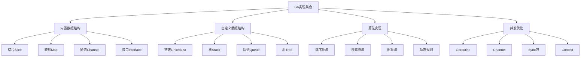

# Go实现集合

## 📖 核心概念

**Go实现集合**是使用Go语言实现各种数据结构和算法的实践。Go的简洁语法、并发特性、内存管理和接口设计，使得数据结构的实现更加高效、安全和易于维护。

### 🏗️ Go实现集合分类



## 🔧 Go实现集合

### 基础数据结构实现

```go
package main

import (
    "fmt"
    "errors"
)

// 动态数组实现
type DynamicArray struct {
    data     []interface{}
    capacity int
    size     int
}

func NewDynamicArray() *DynamicArray {
    return &DynamicArray{
        data:     make([]interface{}, 4),
        capacity: 4,
        size:     0,
    }
}

func (da *DynamicArray) resize() {
    da.capacity *= 2
    newData := make([]interface{}, da.capacity)
    copy(newData, da.data)
    da.data = newData
}

func (da *DynamicArray) Append(value interface{}) {
    if da.size >= da.capacity {
        da.resize()
    }
    da.data[da.size] = value
    da.size++
}

func (da *DynamicArray) Insert(index int, value interface{}) error {
    if index > da.size || index < 0 {
        return errors.New("index out of range")
    }
    
    if da.size >= da.capacity {
        da.resize()
    }
    
    // 向后移动元素
    for i := da.size; i > index; i-- {
        da.data[i] = da.data[i-1]
    }
    
    da.data[index] = value
    da.size++
    return nil
}

func (da *DynamicArray) Delete(index int) error {
    if index >= da.size || index < 0 {
        return errors.New("index out of range")
    }
    
    // 向前移动元素
    for i := index; i < da.size-1; i++ {
        da.data[i] = da.data[i+1]
    }
    
    da.size--
    return nil
}

func (da *DynamicArray) Get(index int) (interface{}, error) {
    if index >= da.size || index < 0 {
        return nil, errors.New("index out of range")
    }
    return da.data[index], nil
}

func (da *DynamicArray) Set(index int, value interface{}) error {
    if index >= da.size || index < 0 {
        return errors.New("index out of range")
    }
    da.data[index] = value
    return nil
}

func (da *DynamicArray) Size() int {
    return da.size
}

func (da *DynamicArray) IsEmpty() bool {
    return da.size == 0
}

func (da *DynamicArray) String() string {
    return fmt.Sprintf("DynamicArray: %v (size: %d, capacity: %d)", 
        da.data[:da.size], da.size, da.capacity)
}

// 双向链表实现
type Node struct {
    data interface{}
    prev *Node
    next *Node
}

type DoublyLinkedList struct {
    head *Node
    tail *Node
    size int
}

func NewDoublyLinkedList() *DoublyLinkedList {
    return &DoublyLinkedList{
        head: nil,
        tail: nil,
        size: 0,
    }
}

func (dll *DoublyLinkedList) AddFirst(data interface{}) {
    newNode := &Node{data: data}
    
    if dll.head == nil {
        dll.head = newNode
        dll.tail = newNode
    } else {
        newNode.next = dll.head
        dll.head.prev = newNode
        dll.head = newNode
    }
    dll.size++
}

func (dll *DoublyLinkedList) AddLast(data interface{}) {
    newNode := &Node{data: data}
    
    if dll.tail == nil {
        dll.head = newNode
        dll.tail = newNode
    } else {
        dll.tail.next = newNode
        newNode.prev = dll.tail
        dll.tail = newNode
    }
    dll.size++
}

func (dll *DoublyLinkedList) Add(index int, data interface{}) error {
    if index > dll.size || index < 0 {
        return errors.New("index out of range")
    }
    
    if index == 0 {
        dll.AddFirst(data)
        return nil
    }
    
    if index == dll.size {
        dll.AddLast(data)
        return nil
    }
    
    current := dll.head
    for i := 0; i < index; i++ {
        current = current.next
    }
    
    newNode := &Node{data: data}
    newNode.prev = current.prev
    newNode.next = current
    current.prev.next = newNode
    current.prev = newNode
    
    dll.size++
    return nil
}

func (dll *DoublyLinkedList) RemoveFirst() (interface{}, error) {
    if dll.head == nil {
        return nil, errors.New("list is empty")
    }
    
    data := dll.head.data
    dll.head = dll.head.next
    
    if dll.head == nil {
        dll.tail = nil
    } else {
        dll.head.prev = nil
    }
    
    dll.size--
    return data, nil
}

func (dll *DoublyLinkedList) RemoveLast() (interface{}, error) {
    if dll.tail == nil {
        return nil, errors.New("list is empty")
    }
    
    data := dll.tail.data
    dll.tail = dll.tail.prev
    
    if dll.tail == nil {
        dll.head = nil
    } else {
        dll.tail.next = nil
    }
    
    dll.size--
    return data, nil
}

func (dll *DoublyLinkedList) Remove(index int) (interface{}, error) {
    if index >= dll.size || index < 0 {
        return nil, errors.New("index out of range")
    }
    
    if index == 0 {
        return dll.RemoveFirst()
    }
    
    if index == dll.size-1 {
        return dll.RemoveLast()
    }
    
    current := dll.head
    for i := 0; i < index; i++ {
        current = current.next
    }
    
    current.prev.next = current.next
    current.next.prev = current.prev
    
    dll.size--
    return current.data, nil
}

func (dll *DoublyLinkedList) Get(index int) (interface{}, error) {
    if index >= dll.size || index < 0 {
        return nil, errors.New("index out of range")
    }
    
    current := dll.head
    for i := 0; i < index; i++ {
        current = current.next
    }
    
    return current.data, nil
}

func (dll *DoublyLinkedList) Size() int {
    return dll.size
}

func (dll *DoublyLinkedList) IsEmpty() bool {
    return dll.size == 0
}

func (dll *DoublyLinkedList) String() string {
    var result []interface{}
    current := dll.head
    for current != nil {
        result = append(result, current.data)
        current = current.next
    }
    return fmt.Sprintf("DoublyLinkedList: %v (size: %d)", result, dll.size)
}

// 栈实现
type Stack struct {
    items []interface{}
}

func NewStack() *Stack {
    return &Stack{
        items: make([]interface{}, 0),
    }
}

func (s *Stack) Push(item interface{}) {
    s.items = append(s.items, item)
}

func (s *Stack) Pop() (interface{}, error) {
    if s.IsEmpty() {
        return nil, errors.New("stack is empty")
    }
    
    index := len(s.items) - 1
    item := s.items[index]
    s.items = s.items[:index]
    return item, nil
}

func (s *Stack) Peek() (interface{}, error) {
    if s.IsEmpty() {
        return nil, errors.New("stack is empty")
    }
    
    return s.items[len(s.items)-1], nil
}

func (s *Stack) IsEmpty() bool {
    return len(s.items) == 0
}

func (s *Stack) Size() int {
    return len(s.items)
}

func (s *Stack) String() string {
    return fmt.Sprintf("Stack: %v (size: %d)", s.items, s.Size())
}

// 队列实现
type Queue struct {
    items []interface{}
}

func NewQueue() *Queue {
    return &Queue{
        items: make([]interface{}, 0),
    }
}

func (q *Queue) Enqueue(item interface{}) {
    q.items = append(q.items, item)
}

func (q *Queue) Dequeue() (interface{}, error) {
    if q.IsEmpty() {
        return nil, errors.New("queue is empty")
    }
    
    item := q.items[0]
    q.items = q.items[1:]
    return item, nil
}

func (q *Queue) Front() (interface{}, error) {
    if q.IsEmpty() {
        return nil, errors.New("queue is empty")
    }
    
    return q.items[0], nil
}

func (q *Queue) IsEmpty() bool {
    return len(q.items) == 0
}

func (q *Queue) Size() int {
    return len(q.items)
}

func (q *Queue) String() string {
    return fmt.Sprintf("Queue: %v (size: %d)", q.items, q.Size())
}

// 优先队列实现
type PriorityItem struct {
    Item     interface{}
    Priority int
}

type PriorityQueue struct {
    items []PriorityItem
}

func NewPriorityQueue() *PriorityQueue {
    return &PriorityQueue{
        items: make([]PriorityItem, 0),
    }
}

func (pq *PriorityQueue) Enqueue(item interface{}, priority int) {
    pq.items = append(pq.items, PriorityItem{item, priority})
    
    // 简单排序（实际应用中可以使用堆）
    for i := len(pq.items) - 1; i > 0; i-- {
        if pq.items[i].Priority < pq.items[i-1].Priority {
            pq.items[i], pq.items[i-1] = pq.items[i-1], pq.items[i]
        } else {
            break
        }
    }
}

func (pq *PriorityQueue) Dequeue() (interface{}, error) {
    if pq.IsEmpty() {
        return nil, errors.New("priority queue is empty")
    }
    
    item := pq.items[0]
    pq.items = pq.items[1:]
    return item.Item, nil
}

func (pq *PriorityQueue) Peek() (interface{}, error) {
    if pq.IsEmpty() {
        return nil, errors.New("priority queue is empty")
    }
    
    return pq.items[0].Item, nil
}

func (pq *PriorityQueue) IsEmpty() bool {
    return len(pq.items) == 0
}

func (pq *PriorityQueue) Size() int {
    return len(pq.items)
}

func (pq *PriorityQueue) String() string {
    var result []string
    for _, item := range pq.items {
        result = append(result, fmt.Sprintf("%v(%d)", item.Item, item.Priority))
    }
    return fmt.Sprintf("PriorityQueue: [%s] (size: %d)", 
        fmt.Sprintf("%s", result), pq.Size())
}
```

### 高级数据结构实现

```go
// 二叉搜索树实现
type TreeNode struct {
    data  interface{}
    left  *TreeNode
    right *TreeNode
}

type BinarySearchTree struct {
    root *TreeNode
    size int
}

func NewBinarySearchTree() *BinarySearchTree {
    return &BinarySearchTree{
        root: nil,
        size: 0,
    }
}

func (bst *BinarySearchTree) Insert(data interface{}) {
    bst.root = bst.insert(bst.root, data)
    bst.size++
}

func (bst *BinarySearchTree) insert(node *TreeNode, data interface{}) *TreeNode {
    if node == nil {
        return &TreeNode{data: data}
    }
    
    // 简单的比较（实际应用中需要类型断言）
    if bst.compare(data, node.data) < 0 {
        node.left = bst.insert(node.left, data)
    } else if bst.compare(data, node.data) > 0 {
        node.right = bst.insert(node.right, data)
    }
    
    return node
}

func (bst *BinarySearchTree) compare(a, b interface{}) int {
    // 简单的比较函数（实际应用中需要更复杂的类型处理）
    switch a.(type) {
    case int:
        return a.(int) - b.(int)
    case string:
        if a.(string) < b.(string) {
            return -1
        } else if a.(string) > b.(string) {
            return 1
        }
        return 0
    default:
        return 0
    }
}

func (bst *BinarySearchTree) Search(data interface{}) bool {
    return bst.search(bst.root, data)
}

func (bst *BinarySearchTree) search(node *TreeNode, data interface{}) bool {
    if node == nil {
        return false
    }
    
    if bst.compare(data, node.data) == 0 {
        return true
    } else if bst.compare(data, node.data) < 0 {
        return bst.search(node.left, data)
    } else {
        return bst.search(node.right, data)
    }
}

func (bst *BinarySearchTree) Delete(data interface{}) {
    bst.root = bst.delete(bst.root, data)
    bst.size--
}

func (bst *BinarySearchTree) delete(node *TreeNode, data interface{}) *TreeNode {
    if node == nil {
        return node
    }
    
    if bst.compare(data, node.data) < 0 {
        node.left = bst.delete(node.left, data)
    } else if bst.compare(data, node.data) > 0 {
        node.right = bst.delete(node.right, data)
    } else {
        if node.left == nil {
            return node.right
        } else if node.right == nil {
            return node.left
        }
        
        minNode := bst.findMin(node.right)
        node.data = minNode.data
        node.right = bst.delete(node.right, minNode.data)
    }
    
    return node
}

func (bst *BinarySearchTree) findMin(node *TreeNode) *TreeNode {
    for node.left != nil {
        node = node.left
    }
    return node
}

func (bst *BinarySearchTree) Inorder() []interface{} {
    var result []interface{}
    bst.inorder(bst.root, &result)
    return result
}

func (bst *BinarySearchTree) inorder(node *TreeNode, result *[]interface{}) {
    if node != nil {
        bst.inorder(node.left, result)
        *result = append(*result, node.data)
        bst.inorder(node.right, result)
    }
}

func (bst *BinarySearchTree) Preorder() []interface{} {
    var result []interface{}
    bst.preorder(bst.root, &result)
    return result
}

func (bst *BinarySearchTree) preorder(node *TreeNode, result *[]interface{}) {
    if node != nil {
        *result = append(*result, node.data)
        bst.preorder(node.left, result)
        bst.preorder(node.right, result)
    }
}

func (bst *BinarySearchTree) Postorder() []interface{} {
    var result []interface{}
    bst.postorder(bst.root, &result)
    return result
}

func (bst *BinarySearchTree) postorder(node *TreeNode, result *[]interface{}) {
    if node != nil {
        bst.postorder(node.left, result)
        bst.postorder(node.right, result)
        *result = append(*result, node.data)
    }
}

func (bst *BinarySearchTree) Size() int {
    return bst.size
}

func (bst *BinarySearchTree) IsEmpty() bool {
    return bst.size == 0
}

func (bst *BinarySearchTree) String() string {
    return fmt.Sprintf("BinarySearchTree: %v (size: %d)", bst.Inorder(), bst.size)
}

// 哈希表实现
type HashEntry struct {
    Key   interface{}
    Value interface{}
}

type HashTable struct {
    buckets  [][]HashEntry
    capacity int
    size     int
}

func NewHashTable(capacity int) *HashTable {
    if capacity <= 0 {
        capacity = 16
    }
    
    buckets := make([][]HashEntry, capacity)
    for i := range buckets {
        buckets[i] = make([]HashEntry, 0)
    }
    
    return &HashTable{
        buckets:  buckets,
        capacity: capacity,
        size:     0,
    }
}

func (ht *HashTable) hash(key interface{}) int {
    // 简单的哈希函数
    switch k := key.(type) {
    case int:
        return k % ht.capacity
    case string:
        hash := 0
        for _, c := range k {
            hash = hash*31 + int(c)
        }
        return hash % ht.capacity
    default:
        return 0
    }
}

func (ht *HashTable) Put(key, value interface{}) {
    index := ht.hash(key)
    bucket := ht.buckets[index]
    
    // 检查是否已存在
    for i, entry := range bucket {
        if ht.equals(entry.Key, key) {
            bucket[i].Value = value
            return
        }
    }
    
    // 添加新条目
    ht.buckets[index] = append(bucket, HashEntry{key, value})
    ht.size++
    
    // 检查是否需要扩容
    if ht.size > ht.capacity*3/4 {
        ht.resize()
    }
}

func (ht *HashTable) Get(key interface{}) (interface{}, bool) {
    index := ht.hash(key)
    bucket := ht.buckets[index]
    
    for _, entry := range bucket {
        if ht.equals(entry.Key, key) {
            return entry.Value, true
        }
    }
    
    return nil, false
}

func (ht *HashTable) Delete(key interface{}) bool {
    index := ht.hash(key)
    bucket := ht.buckets[index]
    
    for i, entry := range bucket {
        if ht.equals(entry.Key, key) {
            ht.buckets[index] = append(bucket[:i], bucket[i+1:]...)
            ht.size--
            return true
        }
    }
    
    return false
}

func (ht *HashTable) Contains(key interface{}) bool {
    _, exists := ht.Get(key)
    return exists
}

func (ht *HashTable) equals(a, b interface{}) bool {
    switch a.(type) {
    case int:
        return a.(int) == b.(int)
    case string:
        return a.(string) == b.(string)
    default:
        return a == b
    }
}

func (ht *HashTable) resize() {
    oldBuckets := ht.buckets
    ht.capacity *= 2
    ht.buckets = make([][]HashEntry, ht.capacity)
    ht.size = 0
    
    for i := range ht.buckets {
        ht.buckets[i] = make([]HashEntry, 0)
    }
    
    for _, bucket := range oldBuckets {
        for _, entry := range bucket {
            ht.Put(entry.Key, entry.Value)
        }
    }
}

func (ht *HashTable) Size() int {
    return ht.size
}

func (ht *HashTable) IsEmpty() bool {
    return ht.size == 0
}

func (ht *HashTable) String() string {
    var result []string
    for _, bucket := range ht.buckets {
        for _, entry := range bucket {
            result = append(result, fmt.Sprintf("%v: %v", entry.Key, entry.Value))
        }
    }
    return fmt.Sprintf("HashTable: {%s} (size: %d, capacity: %d)", 
        fmt.Sprintf("%s", result), ht.size, ht.capacity)
}

// 最小堆实现
type MinHeap struct {
    items []interface{}
}

func NewMinHeap() *MinHeap {
    return &MinHeap{
        items: make([]interface{}, 0),
    }
}

func (h *MinHeap) parent(index int) int {
    return (index - 1) / 2
}

func (h *MinHeap) leftChild(index int) int {
    return 2*index + 1
}

func (h *MinHeap) rightChild(index int) int {
    return 2*index + 2
}

func (h *MinHeap) swap(i, j int) {
    h.items[i], h.items[j] = h.items[j], h.items[i]
}

func (h *MinHeap) compare(a, b interface{}) int {
    switch a.(type) {
    case int:
        return a.(int) - b.(int)
    case string:
        if a.(string) < b.(string) {
            return -1
        } else if a.(string) > b.(string) {
            return 1
        }
        return 0
    default:
        return 0
    }
}

func (h *MinHeap) heapifyUp(index int) {
    for index > 0 {
        parent := h.parent(index)
        if h.compare(h.items[index], h.items[parent]) >= 0 {
            break
        }
        h.swap(index, parent)
        index = parent
    }
}

func (h *MinHeap) heapifyDown(index int) {
    for {
        left := h.leftChild(index)
        right := h.rightChild(index)
        smallest := index
        
        if left < len(h.items) && h.compare(h.items[left], h.items[smallest]) < 0 {
            smallest = left
        }
        
        if right < len(h.items) && h.compare(h.items[right], h.items[smallest]) < 0 {
            smallest = right
        }
        
        if smallest == index {
            break
        }
        
        h.swap(index, smallest)
        index = smallest
    }
}

func (h *MinHeap) Push(value interface{}) {
    h.items = append(h.items, value)
    h.heapifyUp(len(h.items) - 1)
}

func (h *MinHeap) Pop() (interface{}, error) {
    if h.IsEmpty() {
        return nil, errors.New("heap is empty")
    }
    
    if len(h.items) == 1 {
        item := h.items[0]
        h.items = h.items[:0]
        return item, nil
    }
    
    min := h.items[0]
    h.items[0] = h.items[len(h.items)-1]
    h.items = h.items[:len(h.items)-1]
    h.heapifyDown(0)
    
    return min, nil
}

func (h *MinHeap) Peek() (interface{}, error) {
    if h.IsEmpty() {
        return nil, errors.New("heap is empty")
    }
    return h.items[0], nil
}

func (h *MinHeap) IsEmpty() bool {
    return len(h.items) == 0
}

func (h *MinHeap) Size() int {
    return len(h.items)
}

func (h *MinHeap) String() string {
    return fmt.Sprintf("MinHeap: %v (size: %d)", h.items, h.Size())
}
```

### 算法实现

```go
// 排序算法实现
type SortingAlgorithms struct{}

func (sa *SortingAlgorithms) QuickSort(arr []int) {
    if len(arr) <= 1 {
        return
    }
    sa.quickSort(arr, 0, len(arr)-1)
}

func (sa *SortingAlgorithms) quickSort(arr []int, low, high int) {
    if low < high {
        pivotIndex := sa.partition(arr, low, high)
        sa.quickSort(arr, low, pivotIndex-1)
        sa.quickSort(arr, pivotIndex+1, high)
    }
}

func (sa *SortingAlgorithms) partition(arr []int, low, high int) int {
    pivot := arr[high]
    i := low - 1
    
    for j := low; j < high; j++ {
        if arr[j] <= pivot {
            i++
            arr[i], arr[j] = arr[j], arr[i]
        }
    }
    
    arr[i+1], arr[high] = arr[high], arr[i+1]
    return i + 1
}

func (sa *SortingAlgorithms) MergeSort(arr []int) {
    if len(arr) <= 1 {
        return
    }
    sa.mergeSort(arr, 0, len(arr)-1)
}

func (sa *SortingAlgorithms) mergeSort(arr []int, left, right int) {
    if left < right {
        mid := left + (right-left)/2
        sa.mergeSort(arr, left, mid)
        sa.mergeSort(arr, mid+1, right)
        sa.merge(arr, left, mid, right)
    }
}

func (sa *SortingAlgorithms) merge(arr []int, left, mid, right int) {
    n1 := mid - left + 1
    n2 := right - mid
    
    leftArr := make([]int, n1)
    rightArr := make([]int, n2)
    
    for i := 0; i < n1; i++ {
        leftArr[i] = arr[left+i]
    }
    for j := 0; j < n2; j++ {
        rightArr[j] = arr[mid+1+j]
    }
    
    i, j, k := 0, 0, left
    
    for i < n1 && j < n2 {
        if leftArr[i] <= rightArr[j] {
            arr[k] = leftArr[i]
            i++
        } else {
            arr[k] = rightArr[j]
            j++
        }
        k++
    }
    
    for i < n1 {
        arr[k] = leftArr[i]
        i++
        k++
    }
    
    for j < n2 {
        arr[k] = rightArr[j]
        j++
        k++
    }
}

func (sa *SortingAlgorithms) HeapSort(arr []int) {
    heap := NewMinHeap()
    for _, item := range arr {
        heap.Push(item)
    }
    
    for i := 0; i < len(arr); i++ {
        item, _ := heap.Pop()
        arr[i] = item.(int)
    }
}

// 搜索算法实现
type SearchAlgorithms struct{}

func (sa *SearchAlgorithms) BinarySearch(arr []int, target int) int {
    left, right := 0, len(arr)-1
    
    for left <= right {
        mid := left + (right-left)/2
        
        if arr[mid] == target {
            return mid
        } else if arr[mid] < target {
            left = mid + 1
        } else {
            right = mid - 1
        }
    }
    
    return -1
}

func (sa *SearchAlgorithms) LinearSearch(arr []int, target int) int {
    for i, item := range arr {
        if item == target {
            return i
        }
    }
    return -1
}

func (sa *SearchAlgorithms) DFS(graph map[int][]int, start int, visited map[int]bool) {
    visited[start] = true
    fmt.Printf("%d ", start)
    
    for _, neighbor := range graph[start] {
        if !visited[neighbor] {
            sa.DFS(graph, neighbor, visited)
        }
    }
}

func (sa *SearchAlgorithms) BFS(graph map[int][]int, start int) {
    visited := make(map[int]bool)
    queue := NewQueue()
    
    visited[start] = true
    queue.Enqueue(start)
    
    for !queue.IsEmpty() {
        node, _ := queue.Dequeue()
        fmt.Printf("%d ", node)
        
        for _, neighbor := range graph[node.(int)] {
            if !visited[neighbor] {
                visited[neighbor] = true
                queue.Enqueue(neighbor)
            }
        }
    }
}

// 动态规划算法实现
type DynamicProgramming struct{}

func (dp *DynamicProgramming) Fibonacci(n int) int {
    if n <= 1 {
        return n
    }
    
    dpArray := make([]int, n+1)
    dpArray[1] = 1
    
    for i := 2; i <= n; i++ {
        dpArray[i] = dpArray[i-1] + dpArray[i-2]
    }
    
    return dpArray[n]
}

func (dp *DynamicProgramming) LongestCommonSubsequence(text1, text2 string) int {
    m, n := len(text1), len(text2)
    dp := make([][]int, m+1)
    for i := range dp {
        dp[i] = make([]int, n+1)
    }
    
    for i := 1; i <= m; i++ {
        for j := 1; j <= n; j++ {
            if text1[i-1] == text2[j-1] {
                dp[i][j] = dp[i-1][j-1] + 1
            } else {
                dp[i][j] = max(dp[i-1][j], dp[i][j-1])
            }
        }
    }
    
    return dp[m][n]
}

func (dp *DynamicProgramming) Knapsack(weights, values []int, capacity int) int {
    n := len(weights)
    dp := make([][]int, n+1)
    for i := range dp {
        dp[i] = make([]int, capacity+1)
    }
    
    for i := 1; i <= n; i++ {
        for w := 1; w <= capacity; w++ {
            if weights[i-1] <= w {
                dp[i][w] = max(dp[i-1][w], dp[i-1][w-weights[i-1]]+values[i-1])
            } else {
                dp[i][w] = dp[i-1][w]
            }
        }
    }
    
    return dp[n][capacity]
}

func max(a, b int) int {
    if a > b {
        return a
    }
    return b
}
```

## 🎯 Go实现集合应用

### 实际应用场景

```go
type GoImplementationApplications struct{}

func (gia *GoImplementationApplications) DemonstrateApplications() {
    fmt.Println("Go Implementation Applications:")
    fmt.Println("==============================")
    
    fmt.Println("1. 微服务架构:")
    fmt.Println("   - 服务发现")
    fmt.Println("   - API网关")
    fmt.Println("   - 负载均衡")
    
    fmt.Println("2. 云原生应用:")
    fmt.Println("   - 容器化部署")
    fmt.Println("   - Kubernetes")
    fmt.Println("   - 服务网格")
    
    fmt.Println("3. 分布式系统:")
    fmt.Println("   - 分布式存储")
    fmt.Println("   - 消息队列")
    fmt.Println("   - 分布式计算")
    
    fmt.Println("4. 网络编程:")
    fmt.Println("   - HTTP服务器")
    fmt.Println("   - WebSocket")
    fmt.Println("   - gRPC")
}

func (gia *GoImplementationApplications) AnalyzePerformance() {
    fmt.Println("Go Implementation Performance Analysis:")
    fmt.Println("=====================================")
    
    fmt.Println("1. 性能特点:")
    fmt.Println("   - 编译型语言: 执行效率高")
    fmt.Println("   - 垃圾回收: 自动内存管理")
    fmt.Println("   - 并发模型: Goroutine轻量级")
    fmt.Println("   - 类型安全: 编译时检查")
    fmt.Println()
    
    fmt.Println("2. 性能指标:")
    fmt.Println("   - 执行速度: 接近C++")
    fmt.Println("   - 内存使用: 自动管理")
    fmt.Println("   - 并发性能: 优秀")
    fmt.Println("   - 开发效率: 高")
    fmt.Println()
    
    fmt.Println("3. 优化策略:")
    fmt.Println("   - 内存池: 减少GC压力")
    fmt.Println("   - 并发优化: Goroutine池")
    fmt.Println("   - 编译器优化: 内联优化")
    fmt.Println("   - 性能分析: pprof工具")
}

func (gia *GoImplementationApplications) SelectImplementationStrategy(needsHighPerformance, needsConcurrency, needsMicroservices bool) {
    fmt.Println("Implementation Strategy Selection:")
    fmt.Println("=================================")
    
    fmt.Printf("Needs high performance: %t\n", needsHighPerformance)
    fmt.Printf("Needs concurrency: %t\n", needsConcurrency)
    fmt.Printf("Needs microservices: %t\n", needsMicroservices)
    
    fmt.Println("Recommendation:")
    
    if needsHighPerformance && needsConcurrency {
        fmt.Println("Use Go with goroutines and performance optimization")
    } else if needsConcurrency && needsMicroservices {
        fmt.Println("Use Go with microservices frameworks and concurrent patterns")
    } else if needsHighPerformance && needsMicroservices {
        fmt.Println("Use Go with high-performance microservices architecture")
    } else if needsHighPerformance {
        fmt.Println("Use Go with performance profiling and optimization")
    } else if needsConcurrency {
        fmt.Println("Use Go with concurrent programming patterns")
    } else if needsMicroservices {
        fmt.Println("Use Go with microservices frameworks")
    } else {
        fmt.Println("Use Go with standard library and best practices")
    }
}
```

## 📊 Go实现集合分析

### 性能分析

```go
type GoImplementationAnalysis struct{}

func (gia *GoImplementationAnalysis) AnalyzePerformance() {
    fmt.Println("Go Implementation Performance Analysis:")
    fmt.Println("=====================================")
    
    fmt.Println("1. 时间复杂度:")
    fmt.Println("   - 切片: O(1) 访问, O(n) 插入/删除")
    fmt.Println("   - 映射: O(1) 平均, O(n) 最坏")
    fmt.Println("   - 通道: O(1) 发送/接收")
    fmt.Println("   - 堆: O(log n) 插入/删除")
    fmt.Println()
    
    fmt.Println("2. 空间复杂度:")
    fmt.Println("   - 切片: O(n)")
    fmt.Println("   - 映射: O(n)")
    fmt.Println("   - 通道: O(n)")
    fmt.Println("   - 堆: O(n)")
    fmt.Println()
    
    fmt.Println("3. 内存使用:")
    fmt.Println("   - 切片: 连续内存, 缓存友好")
    fmt.Println("   - 映射: 分散内存, 哈希冲突")
    fmt.Println("   - 通道: 环形缓冲区")
    fmt.Println("   - 堆: 连续内存, 缓存友好")
}

func (gia *GoImplementationAnalysis) AnalyzeSpaceComplexity() {
    fmt.Println("Go Implementation Space Complexity Analysis:")
    fmt.Println("===========================================")
    
    fmt.Println("1. 内存管理:")
    fmt.Println("   - 堆内存: 对象存储")
    fmt.Println("   - 栈内存: 函数调用")
    fmt.Println("   - 垃圾回收: 自动管理")
    fmt.Println("   - 内存对齐: 性能优化")
    fmt.Println()
    
    fmt.Println("2. 并发安全:")
    fmt.Println("   - Goroutine: 轻量级线程")
    fmt.Println("   - Channel: 通信机制")
    fmt.Println("   - Mutex: 互斥锁")
    fmt.Println("   - Context: 上下文管理")
    fmt.Println()
    
    fmt.Println("3. 性能优化:")
    fmt.Println("   - 内存池: 减少分配")
    fmt.Println("   - 对象池: 重用对象")
    fmt.Println("   - 缓存优化: 提高命中率")
    fmt.Println("   - 编译器优化: 内联优化")
}

func (gia *GoImplementationAnalysis) AnalyzeTimeComplexity() {
    fmt.Println("Go Implementation Time Complexity Analysis:")
    fmt.Println("==========================================")
    
    fmt.Println("1. 算法复杂度:")
    fmt.Println("   - 快速排序: O(n log n) 平均, O(n^2) 最坏")
    fmt.Println("   - 归并排序: O(n log n) 稳定")
    fmt.Println("   - 堆排序: O(n log n) 不稳定")
    fmt.Println("   - 二分搜索: O(log n)")
    fmt.Println("   - 深度优先搜索: O(V + E)")
    fmt.Println("   - 广度优先搜索: O(V + E)")
    fmt.Println()
    
    fmt.Println("2. 数据结构操作:")
    fmt.Println("   - 切片: O(1) 访问, O(n) 插入/删除")
    fmt.Println("   - 映射: O(1) 平均")
    fmt.Println("   - 通道: O(1) 发送/接收")
    fmt.Println("   - 堆: O(log n) 插入/删除")
    fmt.Println()
    
    fmt.Println("3. 优化技术:")
    fmt.Println("   - 编译器优化: 内联优化")
    fmt.Println("   - 内存优化: 减少分配")
    fmt.Println("   - 并发优化: Goroutine池")
    fmt.Println("   - 缓存优化: 提高命中率")
}
```

## 🎮 Go实现集合测试

### 1. 基础功能测试

```go
func testBasicDataStructures() {
    fmt.Println("Testing Basic Data Structures:")
    fmt.Println("============================")
    
    // 测试动态数组
    arr := NewDynamicArray()
    arr.Append(1)
    arr.Append(2)
    arr.Append(3)
    arr.Insert(1, 10)
    fmt.Println(arr)
    
    // 测试双向链表
    dll := NewDoublyLinkedList()
    dll.AddLast(1)
    dll.AddLast(2)
    dll.AddFirst(0)
    dll.Add(2, 5)
    fmt.Println(dll)
    
    // 测试栈
    stack := NewStack()
    stack.Push(1)
    stack.Push(2)
    stack.Push(3)
    fmt.Println(stack)
    
    // 测试队列
    queue := NewQueue()
    queue.Enqueue(1)
    queue.Enqueue(2)
    queue.Enqueue(3)
    fmt.Println(queue)
    
    // 测试优先队列
    pq := NewPriorityQueue()
    pq.Enqueue("task1", 3)
    pq.Enqueue("task2", 1)
    pq.Enqueue("task3", 2)
    fmt.Println(pq)
}

func testAdvancedDataStructures() {
    fmt.Println("Testing Advanced Data Structures:")
    fmt.Println("===============================")
    
    // 测试二叉搜索树
    bst := NewBinarySearchTree()
    bst.Insert(5)
    bst.Insert(3)
    bst.Insert(7)
    bst.Insert(1)
    bst.Insert(9)
    fmt.Println(bst)
    fmt.Printf("Inorder: %v\n", bst.Inorder())
    fmt.Printf("Preorder: %v\n", bst.Preorder())
    fmt.Printf("Postorder: %v\n", bst.Postorder())
    
    // 测试哈希表
    ht := NewHashTable(16)
    ht.Put("apple", 5)
    ht.Put("banana", 3)
    ht.Put("orange", 7)
    fmt.Println(ht)
    if value, exists := ht.Get("apple"); exists {
        fmt.Printf("Get apple: %v\n", value)
    }
    
    // 测试最小堆
    heap := NewMinHeap()
    heap.Push(5)
    heap.Push(3)
    heap.Push(7)
    heap.Push(1)
    heap.Push(9)
    fmt.Println(heap)
}

func testAlgorithms() {
    fmt.Println("Testing Algorithms:")
    fmt.Println("=================")
    
    // 测试排序算法
    arr := []int{5, 2, 8, 1, 9, 3, 7, 4, 6}
    fmt.Printf("Original array: %v\n", arr)
    
    // 快速排序
    arr1 := make([]int, len(arr))
    copy(arr1, arr)
    sa := &SortingAlgorithms{}
    sa.QuickSort(arr1)
    fmt.Printf("Quick sort: %v\n", arr1)
    
    // 归并排序
    arr2 := make([]int, len(arr))
    copy(arr2, arr)
    sa.MergeSort(arr2)
    fmt.Printf("Merge sort: %v\n", arr2)
    
    // 堆排序
    arr3 := make([]int, len(arr))
    copy(arr3, arr)
    sa.HeapSort(arr3)
    fmt.Printf("Heap sort: %v\n", arr3)
    
    // 测试搜索算法
    sortedArr := []int{1, 2, 3, 4, 5, 6, 7, 8, 9}
    searchAlg := &SearchAlgorithms{}
    index := searchAlg.BinarySearch(sortedArr, 5)
    fmt.Printf("Binary search for 5: index %d\n", index)
    
    // 测试动态规划
    dp := &DynamicProgramming{}
    fib := dp.Fibonacci(10)
    fmt.Printf("Fibonacci(10): %d\n", fib)
    
    lcs := dp.LongestCommonSubsequence("ABCDGH", "AEDFHR")
    fmt.Printf("LCS of 'ABCDGH' and 'AEDFHR': %d\n", lcs)
}

func testApplications() {
    fmt.Println("Testing Applications:")
    fmt.Println("==================")
    
    gia := &GoImplementationApplications{}
    gia.DemonstrateApplications()
    gia.AnalyzePerformance()
    gia.SelectImplementationStrategy(true, true, false)
}

func testAnalysis() {
    fmt.Println("Testing Analysis:")
    fmt.Println("===============")
    
    gia := &GoImplementationAnalysis{}
    gia.AnalyzePerformance()
    gia.AnalyzeSpaceComplexity()
    gia.AnalyzeTimeComplexity()
}

func main() {
    testBasicDataStructures()
    fmt.Println()
    testAdvancedDataStructures()
    fmt.Println()
    testAlgorithms()
    fmt.Println()
    testApplications()
    fmt.Println()
    testAnalysis()
}
```

## 🔗 相关链接

- [[01-C++实现集合|C++实现集合]]
- [[02-Python实现集合|Python实现集合]]
- [[03-Java实现集合|Java实现集合]]

## 💡 Go实现集合要点

1. **并发特性**: Goroutine和Channel提供强大的并发支持
2. **内存管理**: 自动垃圾回收，避免内存泄漏
3. **类型安全**: 静态类型系统，编译时检查
4. **简洁语法**: 代码简洁易读，开发效率高

---

*📝 Go实现集合提示：Go实现注重并发安全、内存管理和性能优化，充分利用Go的并发特性和简洁语法*
