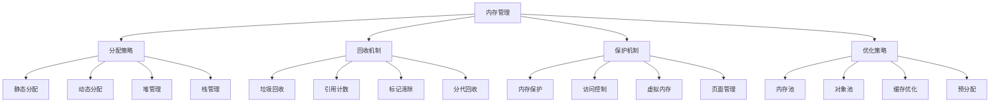

# 内存管理

## 📖 核心概念

**内存管理**是计算机系统中的核心机制，负责内存的分配、回收、保护和优化。通过智能的内存管理策略，提高内存利用率、减少内存碎片、保证程序稳定运行。内存管理直接影响系统的性能、稳定性和可扩展性。

### 🏗️ 内存管理的组成要素



## 🔍 内存管理策略

### 分配策略

| 策略 | 特点 | 优势 | 劣势 | 适用场景 |
|------|------|------|------|----------|
| **首次适应** | 分配第一个足够大的块 | 实现简单 | 碎片较多 | 简单场景 |
| **最佳适应** | 分配最小的足够大的块 | 碎片较少 | 查找慢 | 内存紧张 |
| **最坏适应** | 分配最大的块 | 剩余块大 | 碎片多 | 大块分配 |
| **伙伴系统** | 2的幂次分配 | 合并容易 | 内部碎片 | 系统内核 |

### 回收机制

| 机制 | 特点 | 优势 | 劣势 | 适用场景 |
|------|------|------|------|----------|
| **手动回收** | 程序员控制 | 性能高 | 易出错 | 系统编程 |
| **引用计数** | 计数为0时回收 | 实时回收 | 循环引用 | 简单对象 |
| **标记清除** | 标记可达对象 | 无循环引用问题 | 暂停时间长 | 通用场景 |
| **分代回收** | 分代管理 | 性能好 | 实现复杂 | 现代语言 |

## 💻 内存管理实现

### 内存分配器

```cpp
// 内存分配器
class MemoryAllocator {
private:
    struct MemoryBlock {
        size_t size;
        bool isFree;
        MemoryBlock* next;
        MemoryBlock* prev;
        
        MemoryBlock(size_t s, bool free = true) 
            : size(s), isFree(free), next(nullptr), prev(nullptr) {}
        
        // 获取数据指针
        void* getData() {
            return reinterpret_cast<void*>(this + 1);
        }
        
        // 从数据指针获取块指针
        static MemoryBlock* fromData(void* data) {
            return reinterpret_cast<MemoryBlock*>(data) - 1;
        }
    };
    
    void* memoryPool;
    size_t poolSize;
    MemoryBlock* freeList;
    MemoryBlock* allocatedList;
    mutex allocatorMutex;
    
    // 分配策略
    enum AllocationStrategy {
        FIRST_FIT,
        BEST_FIT,
        WORST_FIT
    };
    
    AllocationStrategy strategy;
    
    // 合并相邻的空闲块
    void mergeFreeBlocks(MemoryBlock* block) {
        // 合并后面的块
        if (block->next && block->next->isFree) {
            MemoryBlock* nextBlock = block->next;
            block->size += nextBlock->size + sizeof(MemoryBlock);
            block->next = nextBlock->next;
            if (block->next) {
                block->next->prev = block;
            }
        }
        
        // 合并前面的块
        if (block->prev && block->prev->isFree) {
            MemoryBlock* prevBlock = block->prev;
            prevBlock->size += block->size + sizeof(MemoryBlock);
            prevBlock->next = block->next;
            if (block->next) {
                block->next->prev = prevBlock;
            }
        }
    }
    
    // 分割块
    MemoryBlock* splitBlock(MemoryBlock* block, size_t requestedSize) {
        size_t remainingSize = block->size - requestedSize - sizeof(MemoryBlock);
        
        if (remainingSize < sizeof(MemoryBlock)) {
            // 剩余空间太小，不分割
            return block;
        }
        
        // 创建新块
        MemoryBlock* newBlock = reinterpret_cast<MemoryBlock*>(
            reinterpret_cast<char*>(block) + sizeof(MemoryBlock) + requestedSize);
        newBlock->size = remainingSize;
        newBlock->isFree = true;
        newBlock->next = block->next;
        newBlock->prev = block;
        
        // 更新原块
        block->size = requestedSize;
        block->next = newBlock;
        
        // 更新后续块
        if (newBlock->next) {
            newBlock->next->prev = newBlock;
        }
        
        return block;
    }
    
    // 首次适应分配
    MemoryBlock* allocateFirstFit(size_t size) {
        MemoryBlock* current = freeList;
        
        while (current) {
            if (current->isFree && current->size >= size) {
                current->isFree = false;
                return splitBlock(current, size);
            }
            current = current->next;
        }
        
        return nullptr;
    }
    
    // 最佳适应分配
    MemoryBlock* allocateBestFit(size_t size) {
        MemoryBlock* current = freeList;
        MemoryBlock* bestBlock = nullptr;
        size_t bestSize = SIZE_MAX;
        
        while (current) {
            if (current->isFree && current->size >= size) {
                if (current->size < bestSize) {
                    bestSize = current->size;
                    bestBlock = current;
                }
            }
            current = current->next;
        }
        
        if (bestBlock) {
            bestBlock->isFree = false;
            return splitBlock(bestBlock, size);
        }
        
        return nullptr;
    }
    
    // 最坏适应分配
    MemoryBlock* allocateWorstFit(size_t size) {
        MemoryBlock* current = freeList;
        MemoryBlock* worstBlock = nullptr;
        size_t worstSize = 0;
        
        while (current) {
            if (current->isFree && current->size >= size) {
                if (current->size > worstSize) {
                    worstSize = current->size;
                    worstBlock = current;
                }
            }
            current = current->next;
        }
        
        if (worstBlock) {
            worstBlock->isFree = false;
            return splitBlock(worstBlock, size);
        }
        
        return nullptr;
    }
    
public:
    MemoryAllocator(size_t size, AllocationStrategy strat = FIRST_FIT) 
        : poolSize(size), strategy(strat) {
        // 分配内存池
        memoryPool = malloc(poolSize);
        if (!memoryPool) {
            throw runtime_error("Failed to allocate memory pool");
        }
        
        // 初始化第一个块
        freeList = new (memoryPool) MemoryBlock(poolSize - sizeof(MemoryBlock));
        allocatedList = nullptr;
    }
    
    ~MemoryAllocator() {
        free(memoryPool);
    }
    
    // 分配内存
    void* allocate(size_t size) {
        lock_guard<mutex> lock(allocatorMutex);
        
        if (size == 0) {
            return nullptr;
        }
        
        // 对齐到8字节边界
        size = (size + 7) & ~7;
        
        MemoryBlock* block = nullptr;
        
        switch (strategy) {
            case FIRST_FIT:
                block = allocateFirstFit(size);
                break;
            case BEST_FIT:
                block = allocateBestFit(size);
                break;
            case WORST_FIT:
                block = allocateWorstFit(size);
                break;
        }
        
        if (block) {
            // 添加到已分配列表
            block->next = allocatedList;
            if (allocatedList) {
                allocatedList->prev = block;
            }
            allocatedList = block;
            
            return block->getData();
        }
        
        return nullptr;
    }
    
    // 释放内存
    void deallocate(void* ptr) {
        if (!ptr) {
            return;
        }
        
        lock_guard<mutex> lock(allocatorMutex);
        
        MemoryBlock* block = MemoryBlock::fromData(ptr);
        
        // 从已分配列表中移除
        if (block->prev) {
            block->prev->next = block->next;
        } else {
            allocatedList = block->next;
        }
        
        if (block->next) {
            block->next->prev = block->prev;
        }
        
        // 标记为空闲
        block->isFree = true;
        
        // 合并相邻的空闲块
        mergeFreeBlocks(block);
        
        // 添加到空闲列表
        block->next = freeList;
        if (freeList) {
            freeList->prev = block;
        }
        freeList = block;
    }
    
    // 重新分配内存
    void* reallocate(void* ptr, size_t newSize) {
        if (!ptr) {
            return allocate(newSize);
        }
        
        if (newSize == 0) {
            deallocate(ptr);
            return nullptr;
        }
        
        MemoryBlock* block = MemoryBlock::fromData(ptr);
        
        if (newSize <= block->size) {
            // 缩小分配
            splitBlock(block, newSize);
            return ptr;
        } else {
            // 扩大分配
            void* newPtr = allocate(newSize);
            if (newPtr) {
                memcpy(newPtr, ptr, block->size);
                deallocate(ptr);
            }
            return newPtr;
        }
    }
    
    // 设置分配策略
    void setStrategy(AllocationStrategy strat) {
        lock_guard<mutex> lock(allocatorMutex);
        strategy = strat;
    }
    
    // 获取统计信息
    struct AllocatorStatistics {
        size_t totalSize;
        size_t freeSize;
        size_t allocatedSize;
        size_t freeBlocks;
        size_t allocatedBlocks;
        double fragmentation;
    };
    
    AllocatorStatistics getStatistics() {
        lock_guard<mutex> lock(allocatorMutex);
        
        AllocatorStatistics stats;
        stats.totalSize = poolSize;
        stats.freeSize = 0;
        stats.allocatedSize = 0;
        stats.freeBlocks = 0;
        stats.allocatedBlocks = 0;
        stats.fragmentation = 0;
        
        // 统计空闲块
        MemoryBlock* current = freeList;
        while (current) {
            stats.freeSize += current->size;
            stats.freeBlocks++;
            current = current->next;
        }
        
        // 统计已分配块
        current = allocatedList;
        while (current) {
            stats.allocatedSize += current->size;
            stats.allocatedBlocks++;
            current = current->next;
        }
        
        // 计算碎片率
        if (stats.freeSize > 0) {
            stats.fragmentation = (double)stats.freeBlocks / stats.freeSize;
        }
        
        return stats;
    }
    
    // 检查内存完整性
    bool checkIntegrity() {
        lock_guard<mutex> lock(allocatorMutex);
        
        // 检查空闲列表
        MemoryBlock* current = freeList;
        while (current) {
            if (!current->isFree) {
                cout << "Integrity check failed: Free list contains allocated block" << endl;
                return false;
            }
            current = current->next;
        }
        
        // 检查已分配列表
        current = allocatedList;
        while (current) {
            if (current->isFree) {
                cout << "Integrity check failed: Allocated list contains free block" << endl;
                return false;
            }
            current = current->next;
        }
        
        return true;
    }
};
```

### 内存池实现

```cpp
// 内存池
template<typename T>
class MemoryPool {
private:
    struct PoolBlock {
        char data[sizeof(T)];
        PoolBlock* next;
        bool isFree;
        
        PoolBlock() : next(nullptr), isFree(true) {}
    };
    
    vector<PoolBlock> blocks;
    PoolBlock* freeList;
    mutex poolMutex;
    size_t blockCount;
    size_t usedBlocks;
    
public:
    MemoryPool(size_t count = 1000) : blockCount(count), usedBlocks(0) {
        blocks.reserve(blockCount);
        
        // 初始化块
        for (size_t i = 0; i < blockCount; i++) {
            blocks.emplace_back();
        }
        
        // 构建空闲列表
        freeList = &blocks[0];
        for (size_t i = 0; i < blockCount - 1; i++) {
            blocks[i].next = &blocks[i + 1];
        }
        blocks[blockCount - 1].next = nullptr;
    }
    
    // 分配对象
    T* allocate() {
        lock_guard<mutex> lock(poolMutex);
        
        if (!freeList) {
            return nullptr;
        }
        
        PoolBlock* block = freeList;
        freeList = freeList->next;
        block->isFree = false;
        usedBlocks++;
        
        return reinterpret_cast<T*>(block->data);
    }
    
    // 释放对象
    void deallocate(T* ptr) {
        if (!ptr) {
            return;
        }
        
        lock_guard<mutex> lock(poolMutex);
        
        PoolBlock* block = reinterpret_cast<PoolBlock*>(ptr);
        block->isFree = true;
        block->next = freeList;
        freeList = block;
        usedBlocks--;
    }
    
    // 获取统计信息
    struct PoolStatistics {
        size_t totalBlocks;
        size_t usedBlocks;
        size_t freeBlocks;
        double utilization;
    };
    
    PoolStatistics getStatistics() {
        lock_guard<mutex> lock(poolMutex);
        
        PoolStatistics stats;
        stats.totalBlocks = blockCount;
        stats.usedBlocks = usedBlocks;
        stats.freeBlocks = blockCount - usedBlocks;
        stats.utilization = (double)usedBlocks / blockCount;
        
        return stats;
    }
    
    // 检查池完整性
    bool checkIntegrity() {
        lock_guard<mutex> lock(poolMutex);
        
        size_t freeCount = 0;
        PoolBlock* current = freeList;
        
        while (current) {
            if (!current->isFree) {
                cout << "Integrity check failed: Free list contains used block" << endl;
                return false;
            }
            freeCount++;
            current = current->next;
        }
        
        if (freeCount != blockCount - usedBlocks) {
            cout << "Integrity check failed: Free count mismatch" << endl;
            return false;
        }
        
        return true;
    }
};
```

### 垃圾回收器

```cpp
// 垃圾回收器
class GarbageCollector {
private:
    struct GCObject {
        void* data;
        size_t size;
        bool isMarked;
        GCObject* next;
        
        GCObject(void* d, size_t s) : data(d), size(s), isMarked(false), next(nullptr) {}
    };
    
    vector<GCObject*> objects;
    mutex gcMutex;
    size_t totalAllocated;
    size_t threshold;
    double growthFactor;
    
    // 标记阶段
    void markPhase() {
        // 从根对象开始标记
        for (GCObject* obj : objects) {
            if (isRootObject(obj)) {
                markObject(obj);
            }
        }
    }
    
    // 标记对象
    void markObject(GCObject* obj) {
        if (!obj || obj->isMarked) {
            return;
        }
        
        obj->isMarked = true;
        
        // 递归标记引用的对象
        markReferencedObjects(obj);
    }
    
    // 标记引用的对象
    void markReferencedObjects(GCObject* obj) {
        // 简化实现：扫描对象数据中的指针
        char* data = static_cast<char*>(obj->data);
        for (size_t i = 0; i < obj->size - sizeof(void*); i++) {
            void* potentialPtr = *reinterpret_cast<void**>(data + i);
            
            // 检查是否是有效的对象指针
            GCObject* referencedObj = findObject(potentialPtr);
            if (referencedObj) {
                markObject(referencedObj);
            }
        }
    }
    
    // 清除阶段
    void sweepPhase() {
        auto it = objects.begin();
        while (it != objects.end()) {
            GCObject* obj = *it;
            
            if (!obj->isMarked) {
                // 释放未标记的对象
                free(obj->data);
                delete obj;
                it = objects.erase(it);
            } else {
                // 清除标记
                obj->isMarked = false;
                ++it;
            }
        }
    }
    
    // 查找对象
    GCObject* findObject(void* ptr) {
        for (GCObject* obj : objects) {
            if (obj->data == ptr) {
                return obj;
            }
        }
        return nullptr;
    }
    
    // 检查是否是根对象
    bool isRootObject(GCObject* obj) {
        // 简化实现：假设所有对象都是根对象
        return true;
    }
    
public:
    GarbageCollector(size_t thresh = 1024 * 1024, double growth = 1.5) 
        : totalAllocated(0), threshold(thresh), growthFactor(growth) {}
    
    ~GarbageCollector() {
        // 清理所有对象
        for (GCObject* obj : objects) {
            free(obj->data);
            delete obj;
        }
    }
    
    // 分配内存
    void* allocate(size_t size) {
        lock_guard<mutex> lock(gcMutex);
        
        void* data = malloc(size);
        if (!data) {
            // 尝试垃圾回收
            collect();
            data = malloc(size);
            if (!data) {
                return nullptr;
            }
        }
        
        GCObject* obj = new GCObject(data, size);
        objects.push_back(obj);
        totalAllocated += size;
        
        // 检查是否需要垃圾回收
        if (totalAllocated > threshold) {
            collect();
        }
        
        return data;
    }
    
    // 垃圾回收
    void collect() {
        lock_guard<mutex> lock(gcMutex);
        
        cout << "Starting garbage collection..." << endl;
        
        size_t beforeSize = totalAllocated;
        
        // 标记阶段
        markPhase();
        
        // 清除阶段
        sweepPhase();
        
        // 更新统计信息
        totalAllocated = 0;
        for (GCObject* obj : objects) {
            totalAllocated += obj->size;
        }
        
        size_t afterSize = totalAllocated;
        size_t freedSize = beforeSize - afterSize;
        
        cout << "Garbage collection completed. Freed " << freedSize << " bytes" << endl;
        
        // 调整阈值
        if (afterSize > 0) {
            threshold = static_cast<size_t>(afterSize * growthFactor);
        }
    }
    
    // 获取统计信息
    struct GCStatistics {
        size_t totalObjects;
        size_t totalAllocated;
        size_t threshold;
        double utilization;
    };
    
    GCStatistics getStatistics() {
        lock_guard<mutex> lock(gcMutex);
        
        GCStatistics stats;
        stats.totalObjects = objects.size();
        stats.totalAllocated = totalAllocated;
        stats.threshold = threshold;
        stats.utilization = (double)totalAllocated / threshold;
        
        return stats;
    }
    
    // 强制垃圾回收
    void forceCollect() {
        collect();
    }
    
    // 设置阈值
    void setThreshold(size_t thresh) {
        lock_guard<mutex> lock(gcMutex);
        threshold = thresh;
    }
};
```

### 内存管理性能测试

```cpp
// 内存管理性能测试
class MemoryManagementPerformanceTest {
public:
    static void testMemoryAllocator(int allocationCount, size_t allocationSize) {
        MemoryAllocator allocator(1024 * 1024); // 1MB池
        
        auto start = chrono::high_resolution_clock::now();
        
        vector<void*> pointers;
        
        // 分配内存
        for (int i = 0; i < allocationCount; i++) {
            void* ptr = allocator.allocate(allocationSize);
            if (ptr) {
                pointers.push_back(ptr);
            }
        }
        
        // 释放内存
        for (void* ptr : pointers) {
            allocator.deallocate(ptr);
        }
        
        auto end = chrono::high_resolution_clock::now();
        auto duration = chrono::duration_cast<chrono::microseconds>(end - start);
        
        cout << "Memory allocator test completed in " << duration.count() << " microseconds" << endl;
        
        auto stats = allocator.getStatistics();
        cout << "Total size: " << stats.totalSize << " bytes" << endl;
        cout << "Allocated size: " << stats.allocatedSize << " bytes" << endl;
        cout << "Free size: " << stats.freeSize << " bytes" << endl;
        cout << "Fragmentation: " << stats.fragmentation << endl;
    }
    
    static void testMemoryPool(int allocationCount) {
        MemoryPool<int> pool(1000);
        
        auto start = chrono::high_resolution_clock::now();
        
        vector<int*> pointers;
        
        // 分配对象
        for (int i = 0; i < allocationCount; i++) {
            int* ptr = pool.allocate();
            if (ptr) {
                *ptr = i;
                pointers.push_back(ptr);
            }
        }
        
        // 释放对象
        for (int* ptr : pointers) {
            pool.deallocate(ptr);
        }
        
        auto end = chrono::high_resolution_clock::now();
        auto duration = chrono::duration_cast<chrono::microseconds>(end - start);
        
        cout << "Memory pool test completed in " << duration.count() << " microseconds" << endl;
        
        auto stats = pool.getStatistics();
        cout << "Total blocks: " << stats.totalBlocks << endl;
        cout << "Used blocks: " << stats.usedBlocks << endl;
        cout << "Free blocks: " << stats.freeBlocks << endl;
        cout << "Utilization: " << stats.utilization << endl;
    }
    
    static void testGarbageCollector(int allocationCount, size_t allocationSize) {
        GarbageCollector gc;
        
        auto start = chrono::high_resolution_clock::now();
        
        vector<void*> pointers;
        
        // 分配内存
        for (int i = 0; i < allocationCount; i++) {
            void* ptr = gc.allocate(allocationSize);
            if (ptr) {
                pointers.push_back(ptr);
            }
        }
        
        // 释放部分内存
        for (size_t i = 0; i < pointers.size() / 2; i++) {
            pointers[i] = nullptr;
        }
        
        // 强制垃圾回收
        gc.forceCollect();
        
        auto end = chrono::high_resolution_clock::now();
        auto duration = chrono::duration_cast<chrono::microseconds>(end - start);
        
        cout << "Garbage collector test completed in " << duration.count() << " microseconds" << endl;
        
        auto stats = gc.getStatistics();
        cout << "Total objects: " << stats.totalObjects << endl;
        cout << "Total allocated: " << stats.totalAllocated << " bytes" << endl;
        cout << "Threshold: " << stats.threshold << " bytes" << endl;
        cout << "Utilization: " << stats.utilization << endl;
    }
    
    static void compareAllocationStrategies(int allocationCount, size_t allocationSize) {
        cout << "Comparing allocation strategies with " << allocationCount << " allocations of " << allocationSize << " bytes" << endl;
        
        vector<MemoryAllocator::AllocationStrategy> strategies = {
            MemoryAllocator::FIRST_FIT,
            MemoryAllocator::BEST_FIT,
            MemoryAllocator::WORST_FIT
        };
        
        for (auto strategy : strategies) {
            cout << "\n=== Strategy " << strategy << " ===" << endl;
            
            MemoryAllocator allocator(1024 * 1024, strategy);
            
            auto start = chrono::high_resolution_clock::now();
            
            vector<void*> pointers;
            
            // 分配内存
            for (int i = 0; i < allocationCount; i++) {
                void* ptr = allocator.allocate(allocationSize);
                if (ptr) {
                    pointers.push_back(ptr);
                }
            }
            
            // 释放内存
            for (void* ptr : pointers) {
                allocator.deallocate(ptr);
            }
            
            auto end = chrono::high_resolution_clock::now();
            auto duration = chrono::duration_cast<chrono::microseconds>(end - start);
            
            cout << "Strategy " << strategy << " completed in " << duration.count() << " microseconds" << endl;
            
            auto stats = allocator.getStatistics();
            cout << "Fragmentation: " << stats.fragmentation << endl;
        }
    }
};
```

## ⚡ 复杂度分析

### 内存管理复杂度

| 操作 | 首次适应 | 最佳适应 | 最坏适应 | 适用场景 |
|------|----------|----------|----------|----------|
| **分配** | O(n) | O(n) | O(n) | 内存分配 |
| **释放** | O(1) | O(1) | O(1) | 内存释放 |
| **合并** | O(1) | O(1) | O(1) | 碎片整理 |
| **查找** | O(n) | O(n) | O(n) | 块查找 |

### 性能优化策略

| 优化策略 | 适用场景 | 优化效果 | 实现难度 | 维护成本 |
|----------|----------|----------|----------|----------|
| **内存池** | 频繁分配 | 显著 | 中等 | 中等 |
| **预分配** | 已知大小 | 显著 | 简单 | 低 |
| **缓存优化** | 频繁访问 | 明显 | 中等 | 中等 |
| **垃圾回收** | 自动管理 | 显著 | 困难 | 高 |

## 🎓 学习要点总结

### 核心理解

1. **分配策略**：理解不同分配策略的特点
2. **回收机制**：掌握内存回收的方法
3. **保护机制**：理解内存保护的重要性
4. **优化策略**：掌握内存优化的方法

### 实践要点

1. **策略选择**：选择合适的分配策略
2. **参数调优**：调优内存管理参数
3. **性能测试**：测试内存管理性能
4. **问题诊断**：诊断内存问题

### 应用思维

1. **系统设计**：设计高效的内存管理系统
2. **性能权衡**：权衡内存性能和成本
3. **问题诊断**：诊断内存相关问题
4. **实际应用**：将内存管理应用到实际问题中

---

**相关链接：**
- [[07-练习战场/01-代码实现/01-基础实现练习|基础实现练习]] - 基础编程练习
- [[07-练习战场/01-代码实现/02-算法练习|算法练习]] - 算法实现练习
- [[07-练习战场/01-代码实现/03-性能测试与优化|性能测试与优化]] - 性能优化
- [[05-高级结构/04-并发结构/01-线程安全数据结构|线程安全数据结构]] - 并发内存管理
