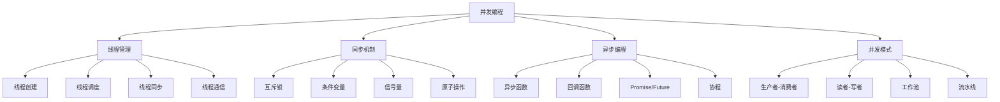

# 并发编程

## 📖 核心概念

**并发编程**是指同时执行多个任务或操作的编程技术。在现代计算机系统中，并发编程是提高程序性能和响应性的关键技术，通过多线程、多进程、异步编程等方式实现。

### 🏗️ 并发编程的组成要素



## 🔍 并发编程技术

### 同步机制

| 同步机制 | 原理 | 优势 | 劣势 | 适用场景 |
|----------|------|------|------|----------|
| **互斥锁** | 互斥访问 | 简单易用 | 性能开销 | 临界区保护 |
| **条件变量** | 条件等待 | 高效等待 | 复杂使用 | 条件同步 |
| **信号量** | 计数控制 | 灵活控制 | 容易死锁 | 资源控制 |
| **原子操作** | 原子性 | 高性能 | 功能有限 | 简单同步 |

## 💻 并发编程实现

### 线程池实现

```cpp
// 线程池实现
class ThreadPool {
private:
    struct Task {
        function<void()> function;
        chrono::system_clock::time_point submitTime;
        
        Task(function<void()> f) : function(f) {
            submitTime = chrono::system_clock::now();
        }
    };
    
    vector<thread> workers;
    queue<Task> tasks;
    mutex queueMutex;
    condition_variable condition;
    atomic<bool> stop;
    
    int maxThreads;
    int activeThreads;
    atomic<int> completedTasks;
    
public:
    ThreadPool(int maxThreads = thread::hardware_concurrency()) 
        : maxThreads(maxThreads), activeThreads(0), completedTasks(0), stop(false) {
        
        // 创建工作线程
        for (int i = 0; i < maxThreads; i++) {
            workers.emplace_back([this] { workerLoop(); });
        }
        
        cout << "Thread pool created with " << maxThreads << " threads" << endl;
    }
    
    ~ThreadPool() {
        {
            unique_lock<mutex> lock(queueMutex);
            stop = true;
        }
        
        condition.notify_all();
        
        for (thread& worker : workers) {
            if (worker.joinable()) {
                worker.join();
            }
        }
        
        cout << "Thread pool destroyed" << endl;
    }
    
    // 提交任务
    template<typename F, typename... Args>
    auto submit(F&& f, Args&&... args) -> future<decltype(f(args...))> {
        using ReturnType = decltype(f(args...));
        
        auto task = make_shared<packaged_task<ReturnType()>>(
            bind(forward<F>(f), forward<Args>(args)...)
        );
        
        future<ReturnType> result = task->get_future();
        
        {
            unique_lock<mutex> lock(queueMutex);
            
            if (stop) {
                throw runtime_error("Thread pool is stopped");
            }
            
            tasks.emplace([task] { (*task)(); });
        }
        
        condition.notify_one();
        return result;
    }
    
    // 提交任务（无返回值）
    void submitTask(function<void()> task) {
        {
            unique_lock<mutex> lock(queueMutex);
            
            if (stop) {
                throw runtime_error("Thread pool is stopped");
            }
            
            tasks.emplace(task);
        }
        
        condition.notify_one();
    }
    
    // 等待所有任务完成
    void waitForAll() {
        unique_lock<mutex> lock(queueMutex);
        condition.wait(lock, [this] { return tasks.empty() && activeThreads == 0; });
    }
    
    // 获取统计信息
    struct ThreadPoolStatistics {
        int maxThreads;
        int activeThreads;
        int queuedTasks;
        int completedTasks;
        double utilization;
    };
    
    ThreadPoolStatistics getStatistics() {
        lock_guard<mutex> lock(queueMutex);
        
        ThreadPoolStatistics stats;
        stats.maxThreads = maxThreads;
        stats.activeThreads = activeThreads;
        stats.queuedTasks = tasks.size();
        stats.completedTasks = completedTasks.load();
        
        if (maxThreads > 0) {
            stats.utilization = (double)activeThreads / maxThreads;
        }
        
        return stats;
    }
    
private:
    // 工作线程循环
    void workerLoop() {
        while (true) {
            Task task;
            
            {
                unique_lock<mutex> lock(queueMutex);
                
                condition.wait(lock, [this] { return stop || !tasks.empty(); });
                
                if (stop && tasks.empty()) {
                    return;
                }
                
                task = move(tasks.front());
                tasks.pop();
                activeThreads++;
            }
            
            try {
                task.function();
                completedTasks++;
            } catch (const exception& e) {
                cout << "Task execution error: " << e.what() << endl;
            }
            
            {
                lock_guard<mutex> lock(queueMutex);
                activeThreads--;
            }
        }
    }
};
```

### 生产者-消费者模式

```cpp
// 生产者-消费者模式
template<typename T>
class ProducerConsumer {
private:
    queue<T> buffer;
    mutex bufferMutex;
    condition_variable notEmpty;
    condition_variable notFull;
    
    size_t maxSize;
    atomic<bool> stop;
    
public:
    ProducerConsumer(size_t maxSize = 100) : maxSize(maxSize), stop(false) {}
    
    // 生产者：添加数据
    bool produce(const T& item) {
        unique_lock<mutex> lock(bufferMutex);
        
        notFull.wait(lock, [this] { return buffer.size() < maxSize || stop; });
        
        if (stop) {
            return false;
        }
        
        buffer.push(item);
        notEmpty.notify_one();
        
        cout << "Produced item: " << item << ", buffer size: " << buffer.size() << endl;
        return true;
    }
    
    // 消费者：消费数据
    bool consume(T& item) {
        unique_lock<mutex> lock(bufferMutex);
        
        notEmpty.wait(lock, [this] { return !buffer.empty() || stop; });
        
        if (stop && buffer.empty()) {
            return false;
        }
        
        item = buffer.front();
        buffer.pop();
        notFull.notify_one();
        
        cout << "Consumed item: " << item << ", buffer size: " << buffer.size() << endl;
        return true;
    }
    
    // 停止生产消费
    void stop() {
        stop = true;
        notEmpty.notify_all();
        notFull.notify_all();
    }
    
    // 获取缓冲区大小
    size_t size() const {
        lock_guard<mutex> lock(bufferMutex);
        return buffer.size();
    }
    
    // 是否为空
    bool empty() const {
        lock_guard<mutex> lock(bufferMutex);
        return buffer.empty();
    }
    
    // 是否已满
    bool full() const {
        lock_guard<mutex> lock(bufferMutex);
        return buffer.size() >= maxSize;
    }
};
```

### 读者-写者模式

```cpp
// 读者-写者模式
class ReaderWriter {
private:
    mutex readMutex;
    mutex writeMutex;
    condition_variable readCondition;
    condition_variable writeCondition;
    
    int readers;
    int writers;
    int waitingReaders;
    int waitingWriters;
    
    atomic<bool> stop;
    
public:
    ReaderWriter() : readers(0), writers(0), waitingReaders(0), waitingWriters(0), stop(false) {}
    
    // 读者：获取读锁
    void acquireReadLock() {
        unique_lock<mutex> lock(readMutex);
        
        waitingReaders++;
        
        readCondition.wait(lock, [this] { 
            return writers == 0 && waitingWriters == 0 || stop; 
        });
        
        waitingReaders--;
        readers++;
        
        cout << "Reader acquired lock, readers: " << readers << endl;
    }
    
    // 读者：释放读锁
    void releaseReadLock() {
        lock_guard<mutex> lock(readMutex);
        
        readers--;
        
        if (readers == 0) {
            writeCondition.notify_one();
        }
        
        cout << "Reader released lock, readers: " << readers << endl;
    }
    
    // 写者：获取写锁
    void acquireWriteLock() {
        unique_lock<mutex> lock(writeMutex);
        
        waitingWriters++;
        
        writeCondition.wait(lock, [this] { 
            return readers == 0 && writers == 0 || stop; 
        });
        
        waitingWriters--;
        writers++;
        
        cout << "Writer acquired lock, writers: " << writers << endl;
    }
    
    // 写者：释放写锁
    void releaseWriteLock() {
        lock_guard<mutex> lock(writeMutex);
        
        writers--;
        
        if (waitingWriters > 0) {
            writeCondition.notify_one();
        } else if (waitingReaders > 0) {
            readCondition.notify_all();
        }
        
        cout << "Writer released lock, writers: " << writers << endl;
    }
    
    // 停止读写
    void stop() {
        stop = true;
        readCondition.notify_all();
        writeCondition.notify_all();
    }
    
    // 获取统计信息
    struct ReaderWriterStatistics {
        int readers;
        int writers;
        int waitingReaders;
        int waitingWriters;
    };
    
    ReaderWriterStatistics getStatistics() {
        lock_guard<mutex> readLock(readMutex);
        lock_guard<mutex> writeLock(writeMutex);
        
        ReaderWriterStatistics stats;
        stats.readers = readers;
        stats.writers = writers;
        stats.waitingReaders = waitingReaders;
        stats.waitingWriters = waitingWriters;
        
        return stats;
    }
};
```

### 异步编程实现

```cpp
// 异步编程实现
class AsyncExecutor {
private:
    ThreadPool threadPool;
    map<string, future<void>> asyncTasks;
    mutex tasksMutex;
    
public:
    AsyncExecutor(int maxThreads = thread::hardware_concurrency()) 
        : threadPool(maxThreads) {}
    
    // 异步执行任务
    template<typename F, typename... Args>
    string executeAsync(const string& taskId, F&& f, Args&&... args) {
        lock_guard<mutex> lock(tasksMutex);
        
        auto task = threadPool.submit(forward<F>(f), forward<Args>(args)...);
        asyncTasks[taskId] = move(task);
        
        cout << "Async task " << taskId << " submitted" << endl;
        return taskId;
    }
    
    // 等待任务完成
    bool waitForTask(const string& taskId, chrono::seconds timeout = chrono::seconds(30)) {
        unique_lock<mutex> lock(tasksMutex);
        
        auto it = asyncTasks.find(taskId);
        if (it == asyncTasks.end()) {
            return false;
        }
        
        lock.unlock();
        
        auto status = it->second.wait_for(timeout);
        return status == future_status::ready;
    }
    
    // 获取任务结果
    template<typename T>
    T getTaskResult(const string& taskId) {
        lock_guard<mutex> lock(tasksMutex);
        
        auto it = asyncTasks.find(taskId);
        if (it == asyncTasks.end()) {
            throw runtime_error("Task not found: " + taskId);
        }
        
        return it->second.get();
    }
    
    // 取消任务
    bool cancelTask(const string& taskId) {
        lock_guard<mutex> lock(tasksMutex);
        
        auto it = asyncTasks.find(taskId);
        if (it == asyncTasks.end()) {
            return false;
        }
        
        asyncTasks.erase(it);
        cout << "Task " << taskId << " cancelled" << endl;
        return true;
    }
    
    // 获取所有任务状态
    vector<string> getAllTaskIds() {
        lock_guard<mutex> lock(tasksMutex);
        
        vector<string> taskIds;
        for (const auto& [taskId, task] : asyncTasks) {
            taskIds.push_back(taskId);
        }
        
        return taskIds;
    }
    
    // 清理已完成的任务
    void cleanupCompletedTasks() {
        lock_guard<mutex> lock(tasksMutex);
        
        auto it = asyncTasks.begin();
        while (it != asyncTasks.end()) {
            if (it->second.wait_for(chrono::seconds(0)) == future_status::ready) {
                it = asyncTasks.erase(it);
            } else {
                it++;
            }
        }
    }
    
    // 获取统计信息
    struct AsyncStatistics {
        int totalTasks;
        int activeTasks;
        int completedTasks;
        double completionRate;
    };
    
    AsyncStatistics getStatistics() {
        lock_guard<mutex> lock(tasksMutex);
        
        AsyncStatistics stats;
        stats.totalTasks = asyncTasks.size();
        stats.activeTasks = 0;
        stats.completedTasks = 0;
        
        for (const auto& [taskId, task] : asyncTasks) {
            if (task.wait_for(chrono::seconds(0)) == future_status::ready) {
                stats.completedTasks++;
            } else {
                stats.activeTasks++;
            }
        }
        
        if (stats.totalTasks > 0) {
            stats.completionRate = (double)stats.completedTasks / stats.totalTasks;
        }
        
        return stats;
    }
};
```

### 并发编程测试

```cpp
// 并发编程测试
class ConcurrencyTest {
public:
    static void runAllTests() {
        cout << "=== Concurrency Tests ===" << endl;
        
        // 测试线程池
        testThreadPool();
        
        cout << "\n" << string(50, '=') << endl;
        
        // 测试生产者-消费者
        testProducerConsumer();
        
        cout << "\n" << string(50, '=') << endl;
        
        // 测试读者-写者
        testReaderWriter();
        
        cout << "\n" << string(50, '=') << endl;
        
        // 测试异步编程
        testAsyncProgramming();
    }
    
private:
    static void testThreadPool() {
        cout << "=== Thread Pool Test ===" << endl;
        
        ThreadPool pool(4);
        
        // 提交任务
        vector<future<int>> futures;
        for (int i = 0; i < 10; i++) {
            auto future = pool.submit([](int x) {
                this_thread::sleep_for(chrono::milliseconds(100));
                return x * x;
            }, i);
            futures.push_back(move(future));
        }
        
        // 获取结果
        for (int i = 0; i < futures.size(); i++) {
            int result = futures[i].get();
            cout << "Task " << i << " result: " << result << endl;
        }
        
        // 获取统计信息
        auto stats = pool.getStatistics();
        cout << "\nThread pool statistics:" << endl;
        cout << "Max threads: " << stats.maxThreads << endl;
        cout << "Active threads: " << stats.activeThreads << endl;
        cout << "Completed tasks: " << stats.completedTasks << endl;
        cout << "Utilization: " << stats.utilization << endl;
    }
    
    static void testProducerConsumer() {
        cout << "=== Producer-Consumer Test ===" << endl;
        
        ProducerConsumer<int> pc(5);
        
        // 生产者线程
        thread producer([&pc]() {
            for (int i = 0; i < 10; i++) {
                pc.produce(i);
                this_thread::sleep_for(chrono::milliseconds(50));
            }
        });
        
        // 消费者线程
        thread consumer([&pc]() {
            for (int i = 0; i < 10; i++) {
                int item;
                if (pc.consume(item)) {
                    cout << "Consumed: " << item << endl;
                }
                this_thread::sleep_for(chrono::milliseconds(100));
            }
        });
        
        producer.join();
        consumer.join();
        
        cout << "Producer-Consumer test completed" << endl;
    }
    
    static void testReaderWriter() {
        cout << "=== Reader-Writer Test ===" << endl;
        
        ReaderWriter rw;
        atomic<int> sharedData(0);
        
        // 读者线程
        vector<thread> readers;
        for (int i = 0; i < 3; i++) {
            readers.emplace_back([&rw, &sharedData, i]() {
                for (int j = 0; j < 5; j++) {
                    rw.acquireReadLock();
                    cout << "Reader " << i << " reading: " << sharedData.load() << endl;
                    this_thread::sleep_for(chrono::milliseconds(100));
                    rw.releaseReadLock();
                    this_thread::sleep_for(chrono::milliseconds(50));
                }
            });
        }
        
        // 写者线程
        vector<thread> writers;
        for (int i = 0; i < 2; i++) {
            writers.emplace_back([&rw, &sharedData, i]() {
                for (int j = 0; j < 3; j++) {
                    rw.acquireWriteLock();
                    int newValue = sharedData.load() + 1;
                    sharedData.store(newValue);
                    cout << "Writer " << i << " writing: " << newValue << endl;
                    this_thread::sleep_for(chrono::milliseconds(200));
                    rw.releaseWriteLock();
                    this_thread::sleep_for(chrono::milliseconds(100));
                }
            });
        }
        
        // 等待所有线程完成
        for (auto& reader : readers) {
            reader.join();
        }
        for (auto& writer : writers) {
            writer.join();
        }
        
        cout << "Final shared data: " << sharedData.load() << endl;
    }
    
    static void testAsyncProgramming() {
        cout << "=== Async Programming Test ===" << endl;
        
        AsyncExecutor executor(4);
        
        // 提交异步任务
        vector<string> taskIds;
        for (int i = 0; i < 5; i++) {
            string taskId = "task_" + to_string(i);
            executor.executeAsync(taskId, [i]() {
                this_thread::sleep_for(chrono::milliseconds(200));
                cout << "Async task " << i << " completed" << endl;
            });
            taskIds.push_back(taskId);
        }
        
        // 等待任务完成
        for (const string& taskId : taskIds) {
            if (executor.waitForTask(taskId)) {
                cout << "Task " << taskId << " completed successfully" << endl;
            } else {
                cout << "Task " << taskId << " timed out" << endl;
            }
        }
        
        // 获取统计信息
        auto stats = executor.getStatistics();
        cout << "\nAsync statistics:" << endl;
        cout << "Total tasks: " << stats.totalTasks << endl;
        cout << "Active tasks: " << stats.activeTasks << endl;
        cout << "Completed tasks: " << stats.completedTasks << endl;
        cout << "Completion rate: " << stats.completionRate << endl;
    }
};
```

## ⚡ 复杂度分析

### 并发编程复杂度

| 操作 | 时间复杂度 | 空间复杂度 | 线程开销 | 适用场景 |
|------|------------|------------|----------|----------|
| **线程创建** | O(1) | O(1) | 高 | 任务并行 |
| **线程同步** | O(1) | O(1) | 中 | 数据同步 |
| **异步执行** | O(1) | O(n) | 低 | 异步任务 |
| **并发控制** | O(log n) | O(n) | 中 | 资源控制 |

## 🎓 学习要点总结

### 核心理解

1. **并发概念**：理解并发编程的基本概念
2. **线程管理**：掌握线程的创建和管理
3. **同步机制**：理解各种同步机制
4. **并发模式**：掌握常见的并发模式

### 实践要点

1. **线程安全**：确保线程安全
2. **性能优化**：优化并发性能
3. **死锁避免**：避免死锁问题
4. **资源管理**：合理管理资源

### 应用思维

1. **并发思维**：从并发角度思考问题
2. **性能思维**：关注性能优化
3. **安全思维**：确保线程安全
4. **实际应用**：将并发技术应用到实际问题中

---

**相关链接：**
- [[07-练习战场/01-代码实现/01-基础实现|基础实现]] - 基础代码实现
- [[07-练习战场/01-代码实现/02-高级实现|高级实现]] - 高级代码实现
- [[07-练习战场/01-代码实现/03-设计模式|设计模式]] - 设计模式应用
- [[07-练习战场/01-代码实现/04-内存管理|内存管理]] - 内存管理技术
