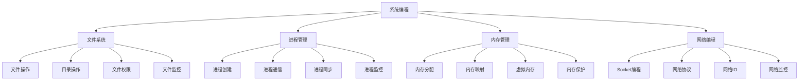

# 系统编程

## 📖 核心概念

**系统编程**是指直接与操作系统交互，进行底层系统操作的编程技术。系统编程涉及文件操作、进程管理、内存管理、网络编程等底层系统功能，是构建高性能系统软件的基础。

### 🏗️ 系统编程的组成要素



## 🔍 系统编程技术

### 文件系统操作

| 操作类型 | 功能 | 优势 | 劣势 | 适用场景 |
|----------|------|------|------|----------|
| **文件操作** | 读写文件 | 直接控制 | 复杂实现 | 文件处理 |
| **目录操作** | 目录管理 | 灵活管理 | 权限复杂 | 目录管理 |
| **文件监控** | 实时监控 | 实时响应 | 资源消耗 | 文件监控 |
| **权限管理** | 访问控制 | 安全控制 | 复杂配置 | 安全系统 |

## 💻 系统编程实现

### 文件系统操作

```cpp
// 文件系统操作
class FileSystemOperations {
private:
    struct FileInfo {
        string path;
        size_t size;
        time_t lastModified;
        mode_t permissions;
        bool isDirectory;
        
        FileInfo(const string& p) : path(p), size(0), lastModified(0), permissions(0), isDirectory(false) {}
    };
    
public:
    // 创建文件
    bool createFile(const string& filePath, const string& content = "") {
        ofstream file(filePath);
        if (!file.is_open()) {
            cout << "Failed to create file: " << filePath << endl;
            return false;
        }
        
        file << content;
        file.close();
        
        cout << "File created: " << filePath << endl;
        return true;
    }
    
    // 读取文件
    string readFile(const string& filePath) {
        ifstream file(filePath);
        if (!file.is_open()) {
            cout << "Failed to open file: " << filePath << endl;
            return "";
        }
        
        string content((istreambuf_iterator<char>(file)), istreambuf_iterator<char>());
        file.close();
        
        cout << "File read: " << filePath << " (" << content.length() << " bytes)" << endl;
        return content;
    }
    
    // 写入文件
    bool writeFile(const string& filePath, const string& content) {
        ofstream file(filePath);
        if (!file.is_open()) {
            cout << "Failed to open file for writing: " << filePath << endl;
            return false;
        }
        
        file << content;
        file.close();
        
        cout << "File written: " << filePath << " (" << content.length() << " bytes)" << endl;
        return true;
    }
    
    // 删除文件
    bool deleteFile(const string& filePath) {
        if (remove(filePath.c_str()) != 0) {
            cout << "Failed to delete file: " << filePath << endl;
            return false;
        }
        
        cout << "File deleted: " << filePath << endl;
        return true;
    }
    
    // 创建目录
    bool createDirectory(const string& dirPath) {
        if (mkdir(dirPath.c_str(), 0755) != 0) {
            cout << "Failed to create directory: " << dirPath << endl;
            return false;
        }
        
        cout << "Directory created: " << dirPath << endl;
        return true;
    }
    
    // 删除目录
    bool deleteDirectory(const string& dirPath) {
        if (rmdir(dirPath.c_str()) != 0) {
            cout << "Failed to delete directory: " << dirPath << endl;
            return false;
        }
        
        cout << "Directory deleted: " << dirPath << endl;
        return true;
    }
    
    // 获取文件信息
    FileInfo getFileInfo(const string& filePath) {
        FileInfo info(filePath);
        
        struct stat fileStat;
        if (stat(filePath.c_str(), &fileStat) == 0) {
            info.size = fileStat.st_size;
            info.lastModified = fileStat.st_mtime;
            info.permissions = fileStat.st_mode;
            info.isDirectory = S_ISDIR(fileStat.st_mode);
        }
        
        return info;
    }
    
    // 列出目录内容
    vector<string> listDirectory(const string& dirPath) {
        vector<string> contents;
        
        DIR* dir = opendir(dirPath.c_str());
        if (dir == nullptr) {
            cout << "Failed to open directory: " << dirPath << endl;
            return contents;
        }
        
        struct dirent* entry;
        while ((entry = readdir(dir)) != nullptr) {
            if (strcmp(entry->d_name, ".") != 0 && strcmp(entry->d_name, "..") != 0) {
                contents.push_back(entry->d_name);
            }
        }
        
        closedir(dir);
        
        cout << "Directory contents of " << dirPath << ": " << contents.size() << " items" << endl;
        return contents;
    }
    
    // 复制文件
    bool copyFile(const string& sourcePath, const string& destPath) {
        ifstream source(sourcePath, ios::binary);
        ofstream dest(destPath, ios::binary);
        
        if (!source.is_open() || !dest.is_open()) {
            cout << "Failed to copy file from " << sourcePath << " to " << destPath << endl;
            return false;
        }
        
        dest << source.rdbuf();
        
        source.close();
        dest.close();
        
        cout << "File copied from " << sourcePath << " to " << destPath << endl;
        return true;
    }
    
    // 移动文件
    bool moveFile(const string& sourcePath, const string& destPath) {
        if (rename(sourcePath.c_str(), destPath.c_str()) != 0) {
            cout << "Failed to move file from " << sourcePath << " to " << destPath << endl;
            return false;
        }
        
        cout << "File moved from " << sourcePath << " to " << destPath << endl;
        return true;
    }
    
    // 设置文件权限
    bool setFilePermissions(const string& filePath, mode_t permissions) {
        if (chmod(filePath.c_str(), permissions) != 0) {
            cout << "Failed to set permissions for " << filePath << endl;
            return false;
        }
        
        cout << "Permissions set for " << filePath << ": " << oct << permissions << endl;
        return true;
    }
    
    // 获取文件权限
    mode_t getFilePermissions(const string& filePath) {
        struct stat fileStat;
        if (stat(filePath.c_str(), &fileStat) != 0) {
            cout << "Failed to get permissions for " << filePath << endl;
            return 0;
        }
        
        return fileStat.st_mode;
    }
};
```

### 进程管理

```cpp
// 进程管理
class ProcessManager {
private:
    struct ProcessInfo {
        pid_t pid;
        string name;
        string command;
        ProcessStatus status;
        time_t startTime;
        int exitCode;
        
        ProcessInfo(pid_t p, const string& n, const string& cmd) 
            : pid(p), name(n), command(cmd), status(ProcessStatus::RUNNING), exitCode(0) {
            startTime = time(nullptr);
        }
    };
    
    enum class ProcessStatus {
        RUNNING,
        STOPPED,
        TERMINATED,
        ZOMBIE
    };
    
    map<pid_t, ProcessInfo> processes;
    mutex processesMutex;
    
public:
    ProcessManager() {}
    
    // 创建进程
    pid_t createProcess(const string& command, const vector<string>& args = {}) {
        pid_t pid = fork();
        
        if (pid == 0) {
            // 子进程
            vector<char*> cArgs;
            cArgs.push_back(const_cast<char*>(command.c_str()));
            
            for (const string& arg : args) {
                cArgs.push_back(const_cast<char*>(arg.c_str()));
            }
            cArgs.push_back(nullptr);
            
            execvp(command.c_str(), cArgs.data());
            exit(1);
        } else if (pid > 0) {
            // 父进程
            lock_guard<mutex> lock(processesMutex);
            processes[pid] = ProcessInfo(pid, command, command);
            
            cout << "Process created: PID " << pid << ", Command: " << command << endl;
        } else {
            cout << "Failed to create process: " << command << endl;
        }
        
        return pid;
    }
    
    // 终止进程
    bool terminateProcess(pid_t pid) {
        if (kill(pid, SIGTERM) != 0) {
            cout << "Failed to terminate process: " << pid << endl;
            return false;
        }
        
        cout << "Process terminated: " << pid << endl;
        return true;
    }
    
    // 强制终止进程
    bool killProcess(pid_t pid) {
        if (kill(pid, SIGKILL) != 0) {
            cout << "Failed to kill process: " << pid << endl;
            return false;
        }
        
        cout << "Process killed: " << pid << endl;
        return true;
    }
    
    // 暂停进程
    bool pauseProcess(pid_t pid) {
        if (kill(pid, SIGSTOP) != 0) {
            cout << "Failed to pause process: " << pid << endl;
            return false;
        }
        
        cout << "Process paused: " << pid << endl;
        return true;
    }
    
    // 恢复进程
    bool resumeProcess(pid_t pid) {
        if (kill(pid, SIGCONT) != 0) {
            cout << "Failed to resume process: " << pid << endl;
            return false;
        }
        
        cout << "Process resumed: " << pid << endl;
        return true;
    }
    
    // 等待进程结束
    int waitForProcess(pid_t pid) {
        int status;
        pid_t result = waitpid(pid, &status, 0);
        
        if (result == pid) {
            int exitCode = WEXITSTATUS(status);
            cout << "Process " << pid << " exited with code: " << exitCode << endl;
            
            lock_guard<mutex> lock(processesMutex);
            auto it = processes.find(pid);
            if (it != processes.end()) {
                it->second.status = ProcessStatus::TERMINATED;
                it->second.exitCode = exitCode;
            }
            
            return exitCode;
        }
        
        return -1;
    }
    
    // 获取进程信息
    ProcessInfo getProcessInfo(pid_t pid) {
        lock_guard<mutex> lock(processesMutex);
        
        auto it = processes.find(pid);
        if (it != processes.end()) {
            return it->second;
        }
        
        return ProcessInfo(0, "", "");
    }
    
    // 获取所有进程
    map<pid_t, ProcessInfo> getAllProcesses() {
        lock_guard<mutex> lock(processesMutex);
        return processes;
    }
    
    // 清理已终止的进程
    void cleanupTerminatedProcesses() {
        lock_guard<mutex> lock(processesMutex);
        
        auto it = processes.begin();
        while (it != processes.end()) {
            if (it->second.status == ProcessStatus::TERMINATED) {
                it = processes.erase(it);
            } else {
                it++;
            }
        }
    }
    
    // 获取统计信息
    struct ProcessStatistics {
        int totalProcesses;
        int runningProcesses;
        int terminatedProcesses;
        double averageLifetime;
    };
    
    ProcessStatistics getStatistics() {
        lock_guard<mutex> lock(processesMutex);
        
        ProcessStatistics stats;
        stats.totalProcesses = processes.size();
        stats.runningProcesses = 0;
        stats.terminatedProcesses = 0;
        stats.averageLifetime = 0;
        
        double totalLifetime = 0;
        
        for (const auto& [pid, process] : processes) {
            if (process.status == ProcessStatus::RUNNING) {
                stats.runningProcesses++;
            } else if (process.status == ProcessStatus::TERMINATED) {
                stats.terminatedProcesses++;
            }
            
            totalLifetime += time(nullptr) - process.startTime;
        }
        
        if (stats.totalProcesses > 0) {
            stats.averageLifetime = totalLifetime / stats.totalProcesses;
        }
        
        return stats;
    }
};
```

### 内存管理

```cpp
// 内存管理
class MemoryManager {
private:
    struct MemoryBlock {
        void* address;
        size_t size;
        bool isAllocated;
        chrono::system_clock::time_point allocationTime;
        
        MemoryBlock(void* addr, size_t s) 
            : address(addr), size(s), isAllocated(true) {
            allocationTime = chrono::system_clock::now();
        }
    };
    
    map<void*, MemoryBlock> allocatedBlocks;
    mutex memoryMutex;
    
    size_t totalAllocated;
    size_t peakAllocated;
    
public:
    MemoryManager() : totalAllocated(0), peakAllocated(0) {}
    
    // 分配内存
    void* allocateMemory(size_t size) {
        void* ptr = malloc(size);
        if (ptr == nullptr) {
            cout << "Failed to allocate memory: " << size << " bytes" << endl;
            return nullptr;
        }
        
        lock_guard<mutex> lock(memoryMutex);
        allocatedBlocks[ptr] = MemoryBlock(ptr, size);
        totalAllocated += size;
        
        if (totalAllocated > peakAllocated) {
            peakAllocated = totalAllocated;
        }
        
        cout << "Memory allocated: " << size << " bytes at " << ptr << endl;
        return ptr;
    }
    
    // 释放内存
    bool freeMemory(void* ptr) {
        if (ptr == nullptr) {
            return true;
        }
        
        lock_guard<mutex> lock(memoryMutex);
        
        auto it = allocatedBlocks.find(ptr);
        if (it == allocatedBlocks.end()) {
            cout << "Attempted to free unallocated memory: " << ptr << endl;
            return false;
        }
        
        size_t size = it->second.size;
        allocatedBlocks.erase(it);
        totalAllocated -= size;
        
        free(ptr);
        
        cout << "Memory freed: " << size << " bytes at " << ptr << endl;
        return true;
    }
    
    // 重新分配内存
    void* reallocateMemory(void* ptr, size_t newSize) {
        if (ptr == nullptr) {
            return allocateMemory(newSize);
        }
        
        lock_guard<mutex> lock(memoryMutex);
        
        auto it = allocatedBlocks.find(ptr);
        if (it == allocatedBlocks.end()) {
            cout << "Attempted to reallocate unallocated memory: " << ptr << endl;
            return nullptr;
        }
        
        size_t oldSize = it->second.size;
        void* newPtr = realloc(ptr, newSize);
        
        if (newPtr == nullptr) {
            cout << "Failed to reallocate memory: " << newSize << " bytes" << endl;
            return nullptr;
        }
        
        allocatedBlocks.erase(it);
        allocatedBlocks[newPtr] = MemoryBlock(newPtr, newSize);
        
        totalAllocated = totalAllocated - oldSize + newSize;
        
        if (totalAllocated > peakAllocated) {
            peakAllocated = totalAllocated;
        }
        
        cout << "Memory reallocated: " << oldSize << " -> " << newSize << " bytes" << endl;
        return newPtr;
    }
    
    // 内存映射
    void* mapMemory(const string& filePath, size_t size) {
        int fd = open(filePath.c_str(), O_RDWR | O_CREAT, 0644);
        if (fd == -1) {
            cout << "Failed to open file for mapping: " << filePath << endl;
            return nullptr;
        }
        
        if (ftruncate(fd, size) == -1) {
            cout << "Failed to set file size: " << filePath << endl;
            close(fd);
            return nullptr;
        }
        
        void* ptr = mmap(nullptr, size, PROT_READ | PROT_WRITE, MAP_SHARED, fd, 0);
        if (ptr == MAP_FAILED) {
            cout << "Failed to map memory: " << filePath << endl;
            close(fd);
            return nullptr;
        }
        
        close(fd);
        
        lock_guard<mutex> lock(memoryMutex);
        allocatedBlocks[ptr] = MemoryBlock(ptr, size);
        totalAllocated += size;
        
        cout << "Memory mapped: " << size << " bytes from " << filePath << endl;
        return ptr;
    }
    
    // 取消内存映射
    bool unmapMemory(void* ptr, size_t size) {
        if (munmap(ptr, size) == -1) {
            cout << "Failed to unmap memory: " << ptr << endl;
            return false;
        }
        
        lock_guard<mutex> lock(memoryMutex);
        
        auto it = allocatedBlocks.find(ptr);
        if (it != allocatedBlocks.end()) {
            allocatedBlocks.erase(it);
            totalAllocated -= size;
        }
        
        cout << "Memory unmapped: " << size << " bytes at " << ptr << endl;
        return true;
    }
    
    // 获取内存统计信息
    struct MemoryStatistics {
        size_t totalAllocated;
        size_t peakAllocated;
        int allocatedBlocks;
        double averageBlockSize;
    };
    
    MemoryStatistics getStatistics() {
        lock_guard<mutex> lock(memoryMutex);
        
        MemoryStatistics stats;
        stats.totalAllocated = totalAllocated;
        stats.peakAllocated = peakAllocated;
        stats.allocatedBlocks = allocatedBlocks.size();
        
        if (stats.allocatedBlocks > 0) {
            stats.averageBlockSize = (double)totalAllocated / stats.allocatedBlocks;
        }
        
        return stats;
    }
    
    // 检查内存泄漏
    bool checkMemoryLeaks() {
        lock_guard<mutex> lock(memoryMutex);
        
        if (allocatedBlocks.empty()) {
            cout << "No memory leaks detected" << endl;
            return true;
        }
        
        cout << "Memory leaks detected:" << endl;
        for (const auto& [ptr, block] : allocatedBlocks) {
            cout << "  Leaked block: " << ptr << " (" << block.size << " bytes)" << endl;
        }
        
        return false;
    }
};
```

### 系统编程测试

```cpp
// 系统编程测试
class SystemProgrammingTest {
public:
    static void runAllTests() {
        cout << "=== System Programming Tests ===" << endl;
        
        // 测试文件系统操作
        testFileSystemOperations();
        
        cout << "\n" << string(50, '=') << endl;
        
        // 测试进程管理
        testProcessManagement();
        
        cout << "\n" << string(50, '=') << endl;
        
        // 测试内存管理
        testMemoryManagement();
    }
    
private:
    static void testFileSystemOperations() {
        cout << "=== File System Operations Test ===" << endl;
        
        FileSystemOperations fs;
        
        // 创建文件
        fs.createFile("test.txt", "Hello, System Programming!");
        
        // 读取文件
        string content = fs.readFile("test.txt");
        cout << "File content: " << content << endl;
        
        // 获取文件信息
        auto info = fs.getFileInfo("test.txt");
        cout << "File size: " << info.size << " bytes" << endl;
        cout << "Is directory: " << (info.isDirectory ? "Yes" : "No") << endl;
        
        // 创建目录
        fs.createDirectory("test_dir");
        
        // 列出目录内容
        auto contents = fs.listDirectory(".");
        cout << "Current directory contents: " << contents.size() << " items" << endl;
        
        // 复制文件
        fs.copyFile("test.txt", "test_copy.txt");
        
        // 删除文件
        fs.deleteFile("test.txt");
        fs.deleteFile("test_copy.txt");
        fs.deleteDirectory("test_dir");
        
        cout << "File system operations test completed" << endl;
    }
    
    static void testProcessManagement() {
        cout << "=== Process Management Test ===" << endl;
        
        ProcessManager pm;
        
        // 创建进程
        pid_t pid = pm.createProcess("sleep", {"5"});
        if (pid > 0) {
            cout << "Process created with PID: " << pid << endl;
            
            // 获取进程信息
            auto info = pm.getProcessInfo(pid);
            cout << "Process name: " << info.name << endl;
            
            // 等待进程结束
            int exitCode = pm.waitForProcess(pid);
            cout << "Process exited with code: " << exitCode << endl;
        }
        
        // 获取统计信息
        auto stats = pm.getStatistics();
        cout << "\nProcess statistics:" << endl;
        cout << "Total processes: " << stats.totalProcesses << endl;
        cout << "Running processes: " << stats.runningProcesses << endl;
        cout << "Terminated processes: " << stats.terminatedProcesses << endl;
        cout << "Average lifetime: " << stats.averageLifetime << " seconds" << endl;
        
        cout << "Process management test completed" << endl;
    }
    
    static void testMemoryManagement() {
        cout << "=== Memory Management Test ===" << endl;
        
        MemoryManager mm;
        
        // 分配内存
        void* ptr1 = mm.allocateMemory(1024);
        void* ptr2 = mm.allocateMemory(2048);
        
        // 重新分配内存
        void* ptr3 = mm.reallocateMemory(ptr1, 4096);
        
        // 获取统计信息
        auto stats = mm.getStatistics();
        cout << "\nMemory statistics:" << endl;
        cout << "Total allocated: " << stats.totalAllocated << " bytes" << endl;
        cout << "Peak allocated: " << stats.peakAllocated << " bytes" << endl;
        cout << "Allocated blocks: " << stats.allocatedBlocks << endl;
        cout << "Average block size: " << stats.averageBlockSize << " bytes" << endl;
        
        // 释放内存
        mm.freeMemory(ptr2);
        mm.freeMemory(ptr3);
        
        // 检查内存泄漏
        mm.checkMemoryLeaks();
        
        cout << "Memory management test completed" << endl;
    }
};
```

## ⚡ 复杂度分析

### 系统编程复杂度

| 操作 | 时间复杂度 | 空间复杂度 | 系统开销 | 适用场景 |
|------|------------|------------|----------|----------|
| **文件操作** | O(1) | O(1) | 低 | 文件处理 |
| **进程管理** | O(1) | O(n) | 高 | 进程控制 |
| **内存管理** | O(1) | O(n) | 中 | 内存控制 |
| **网络编程** | O(1) | O(1) | 中 | 网络通信 |

## 🎓 学习要点总结

### 核心理解

1. **系统调用**：理解系统调用的原理
2. **文件系统**：掌握文件系统操作
3. **进程管理**：理解进程管理机制
4. **内存管理**：掌握内存管理技术

### 实践要点

1. **错误处理**：正确处理系统错误
2. **资源管理**：合理管理系统资源
3. **性能优化**：优化系统性能
4. **安全考虑**：考虑系统安全

### 应用思维

1. **系统思维**：从系统角度思考问题
2. **底层思维**：理解底层实现
3. **性能思维**：关注系统性能
4. **实际应用**：将系统技术应用到实际问题中

---

**相关链接：**
- [[07-练习战场/01-代码实现/01-基础实现|基础实现]] - 基础代码实现
- [[07-练习战场/01-代码实现/02-高级实现|高级代码实现]] - 高级代码实现
- [[07-练习战场/01-代码实现/03-设计模式|设计模式]] - 设计模式应用
- [[07-练习战场/01-代码实现/04-内存管理|内存管理]] - 内存管理技术
