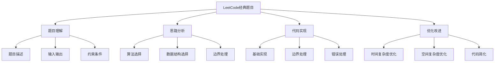

# LeetCode经典题目

## 📖 核心概念

**LeetCode经典题目**是数据结构与算法学习的实战检验，通过解决精心设计的编程题目，深入理解数据结构的应用场景、算法的设计思路和问题的解决策略。这是从理论到实践的关键桥梁，是提升编程能力的有效途径。

### 🏗️ 题目练习的组成要素



## 🔍 题目分类

### 按数据结构分类

| 数据结构 | 经典题目 | 难度 | 核心考点 | 解题思路 |
|----------|----------|------|----------|----------|
| **数组** | 两数之和 | 简单 | 哈希表 | 空间换时间 |
| **链表** | 反转链表 | 简单 | 指针操作 | 迭代/递归 |
| **栈** | 有效的括号 | 简单 | 栈应用 | 匹配问题 |
| **队列** | 滑动窗口最大值 | 困难 | 双端队列 | 单调队列 |
| **树** | 二叉树的最大深度 | 简单 | 递归/DFS | 深度优先 |
| **图** | 课程表 | 中等 | 拓扑排序 | 环检测 |
| **哈希表** | 字母异位词分组 | 中等 | 哈希应用 | 分组问题 |

### 按算法类型分类

| 算法类型 | 经典题目 | 难度 | 核心考点 | 解题思路 |
|----------|----------|------|----------|----------|
| **双指针** | 三数之和 | 中等 | 排序+双指针 | 去重处理 |
| **滑动窗口** | 无重复字符的最长子串 | 中等 | 窗口维护 | 哈希表 |
| **动态规划** | 最长递增子序列 | 中等 | 状态转移 | 最优子结构 |
| **贪心算法** | 跳跃游戏 | 中等 | 贪心选择 | 局部最优 |
| **回溯算法** | 全排列 | 中等 | 状态回溯 | 递归+剪枝 |
| **分治算法** | 合并K个升序链表 | 困难 | 分治合并 | 递归分治 |

## 💻 数组类题目

### 两数之和

```cpp
class TwoSum {
public:
    // 方法1：暴力解法 O(n²)
    vector<int> twoSumBruteForce(vector<int>& nums, int target) {
        for (int i = 0; i < nums.size(); i++) {
            for (int j = i + 1; j < nums.size(); j++) {
                if (nums[i] + nums[j] == target) {
                    return {i, j};
                }
            }
        }
        return {};
    }
    
    // 方法2：哈希表 O(n)
    vector<int> twoSumHash(vector<int>& nums, int target) {
        unordered_map<int, int> numToIndex;
        
        for (int i = 0; i < nums.size(); i++) {
            int complement = target - nums[i];
            if (numToIndex.find(complement) != numToIndex.end()) {
                return {numToIndex[complement], i};
            }
            numToIndex[nums[i]] = i;
        }
        
        return {};
    }
    
    // 方法3：排序+双指针 O(n log n)
    vector<int> twoSumTwoPointers(vector<int>& nums, int target) {
        vector<pair<int, int>> indexedNums;
        for (int i = 0; i < nums.size(); i++) {
            indexedNums.push_back({nums[i], i});
        }
        
        sort(indexedNums.begin(), indexedNums.end());
        
        int left = 0, right = indexedNums.size() - 1;
        while (left < right) {
            int sum = indexedNums[left].first + indexedNums[right].first;
            if (sum == target) {
                return {indexedNums[left].second, indexedNums[right].second};
            } else if (sum < target) {
                left++;
            } else {
                right--;
            }
        }
        
        return {};
    }
};
```

### 三数之和

```cpp
class ThreeSum {
public:
    // 排序+双指针 O(n²)
    vector<vector<int>> threeSum(vector<int>& nums) {
        vector<vector<int>> result;
        int n = nums.size();
        
        if (n < 3) return result;
        
        sort(nums.begin(), nums.end());
        
        for (int i = 0; i < n - 2; i++) {
            // 跳过重复元素
            if (i > 0 && nums[i] == nums[i - 1]) continue;
            
            int left = i + 1, right = n - 1;
            int target = -nums[i];
            
            while (left < right) {
                int sum = nums[left] + nums[right];
                
                if (sum == target) {
                    result.push_back({nums[i], nums[left], nums[right]});
                    
                    // 跳过重复元素
                    while (left < right && nums[left] == nums[left + 1]) left++;
                    while (left < right && nums[right] == nums[right - 1]) right--;
                    
                    left++;
                    right--;
                } else if (sum < target) {
                    left++;
                } else {
                    right--;
                }
            }
        }
        
        return result;
    }
    
    // 四数之和 O(n³)
    vector<vector<int>> fourSum(vector<int>& nums, int target) {
        vector<vector<int>> result;
        int n = nums.size();
        
        if (n < 4) return result;
        
        sort(nums.begin(), nums.end());
        
        for (int i = 0; i < n - 3; i++) {
            if (i > 0 && nums[i] == nums[i - 1]) continue;
            
            for (int j = i + 1; j < n - 2; j++) {
                if (j > i + 1 && nums[j] == nums[j - 1]) continue;
                
                int left = j + 1, right = n - 1;
                long long targetSum = (long long)target - nums[i] - nums[j];
                
                while (left < right) {
                    long long sum = (long long)nums[left] + nums[right];
                    
                    if (sum == targetSum) {
                        result.push_back({nums[i], nums[j], nums[left], nums[right]});
                        
                        while (left < right && nums[left] == nums[left + 1]) left++;
                        while (left < right && nums[right] == nums[right - 1]) right--;
                        
                        left++;
                        right--;
                    } else if (sum < targetSum) {
                        left++;
                    } else {
                        right--;
                    }
                }
            }
        }
        
        return result;
    }
};
```

## 💻 链表类题目

### 反转链表

```cpp
class ReverseLinkedList {
public:
    struct ListNode {
        int val;
        ListNode* next;
        ListNode(int x) : val(x), next(nullptr) {}
    };
    
    // 方法1：迭代反转 O(n)
    ListNode* reverseListIterative(ListNode* head) {
        ListNode* prev = nullptr;
        ListNode* current = head;
        
        while (current != nullptr) {
            ListNode* next = current->next;
            current->next = prev;
            prev = current;
            current = next;
        }
        
        return prev;
    }
    
    // 方法2：递归反转 O(n)
    ListNode* reverseListRecursive(ListNode* head) {
        if (head == nullptr || head->next == nullptr) {
            return head;
        }
        
        ListNode* newHead = reverseListRecursive(head->next);
        head->next->next = head;
        head->next = nullptr;
        
        return newHead;
    }
    
    // 反转链表II（指定区间）
    ListNode* reverseBetween(ListNode* head, int left, int right) {
        if (head == nullptr || left == right) return head;
        
        ListNode* dummy = new ListNode(0);
        dummy->next = head;
        ListNode* prev = dummy;
        
        // 找到反转区间的前一个节点
        for (int i = 1; i < left; i++) {
            prev = prev->next;
        }
        
        ListNode* start = prev->next;
        ListNode* then = start->next;
        
        // 反转区间内的节点
        for (int i = 0; i < right - left; i++) {
            start->next = then->next;
            then->next = prev->next;
            prev->next = then;
            then = start->next;
        }
        
        return dummy->next;
    }
    
    // K个一组反转链表
    ListNode* reverseKGroup(ListNode* head, int k) {
        if (head == nullptr || k == 1) return head;
        
        ListNode* dummy = new ListNode(0);
        dummy->next = head;
        ListNode* prev = dummy;
        
        while (prev != nullptr) {
            ListNode* start = prev->next;
            ListNode* end = prev;
            
            // 检查是否有k个节点
            for (int i = 0; i < k && end != nullptr; i++) {
                end = end->next;
            }
            
            if (end == nullptr) break;
            
            ListNode* next = end->next;
            end->next = nullptr;
            
            // 反转k个节点
            prev->next = reverseListIterative(start);
            start->next = next;
            prev = start;
        }
        
        return dummy->next;
    }
};
```

### 合并两个有序链表

```cpp
class MergeSortedLists {
public:
    struct ListNode {
        int val;
        ListNode* next;
        ListNode(int x) : val(x), next(nullptr) {}
    };
    
    // 合并两个有序链表
    ListNode* mergeTwoLists(ListNode* list1, ListNode* list2) {
        ListNode* dummy = new ListNode(0);
        ListNode* current = dummy;
        
        while (list1 != nullptr && list2 != nullptr) {
            if (list1->val <= list2->val) {
                current->next = list1;
                list1 = list1->next;
            } else {
                current->next = list2;
                list2 = list2->next;
            }
            current = current->next;
        }
        
        // 连接剩余节点
        current->next = (list1 != nullptr) ? list1 : list2;
        
        return dummy->next;
    }
    
    // 合并K个有序链表（分治法）
    ListNode* mergeKLists(vector<ListNode*>& lists) {
        if (lists.empty()) return nullptr;
        
        return mergeKListsHelper(lists, 0, lists.size() - 1);
    }
    
private:
    ListNode* mergeKListsHelper(vector<ListNode*>& lists, int left, int right) {
        if (left == right) return lists[left];
        if (left > right) return nullptr;
        
        int mid = left + (right - left) / 2;
        ListNode* leftList = mergeKListsHelper(lists, left, mid);
        ListNode* rightList = mergeKListsHelper(lists, mid + 1, right);
        
        return mergeTwoLists(leftList, rightList);
    }
    
public:
    // 合并K个有序链表（优先队列）
    ListNode* mergeKListsPriorityQueue(vector<ListNode*>& lists) {
        auto cmp = [](ListNode* a, ListNode* b) {
            return a->val > b->val;
        };
        
        priority_queue<ListNode*, vector<ListNode*>, decltype(cmp)> pq(cmp);
        
        // 将所有链表的头节点加入优先队列
        for (ListNode* list : lists) {
            if (list != nullptr) {
                pq.push(list);
            }
        }
        
        ListNode* dummy = new ListNode(0);
        ListNode* current = dummy;
        
        while (!pq.empty()) {
            ListNode* node = pq.top();
            pq.pop();
            
            current->next = node;
            current = current->next;
            
            if (node->next != nullptr) {
                pq.push(node->next);
            }
        }
        
        return dummy->next;
    }
};
```

## 💻 树类题目

### 二叉树的最大深度

```cpp
class BinaryTreeMaxDepth {
public:
    struct TreeNode {
        int val;
        TreeNode* left;
        TreeNode* right;
        TreeNode(int x) : val(x), left(nullptr), right(nullptr) {}
    };
    
    // 方法1：递归DFS O(n)
    int maxDepthRecursive(TreeNode* root) {
        if (root == nullptr) return 0;
        
        int leftDepth = maxDepthRecursive(root->left);
        int rightDepth = maxDepthRecursive(root->right);
        
        return max(leftDepth, rightDepth) + 1;
    }
    
    // 方法2：迭代BFS O(n)
    int maxDepthIterative(TreeNode* root) {
        if (root == nullptr) return 0;
        
        queue<TreeNode*> q;
        q.push(root);
        int depth = 0;
        
        while (!q.empty()) {
            int size = q.size();
            depth++;
            
            for (int i = 0; i < size; i++) {
                TreeNode* node = q.front();
                q.pop();
                
                if (node->left != nullptr) q.push(node->left);
                if (node->right != nullptr) q.push(node->right);
            }
        }
        
        return depth;
    }
    
    // 方法3：迭代DFS O(n)
    int maxDepthIterativeDFS(TreeNode* root) {
        if (root == nullptr) return 0;
        
        stack<pair<TreeNode*, int>> st;
        st.push({root, 1});
        int maxDepth = 0;
        
        while (!st.empty()) {
            auto [node, depth] = st.top();
            st.pop();
            
            maxDepth = max(maxDepth, depth);
            
            if (node->left != nullptr) {
                st.push({node->left, depth + 1});
            }
            if (node->right != nullptr) {
                st.push({node->right, depth + 1});
            }
        }
        
        return maxDepth;
    }
    
    // 二叉树的最小深度
    int minDepth(TreeNode* root) {
        if (root == nullptr) return 0;
        
        if (root->left == nullptr && root->right == nullptr) {
            return 1;
        }
        
        int minDep = INT_MAX;
        if (root->left != nullptr) {
            minDep = min(minDep, minDepth(root->left));
        }
        if (root->right != nullptr) {
            minDep = min(minDep, minDepth(root->right));
        }
        
        return minDep + 1;
    }
    
    // 平衡二叉树检查
    bool isBalanced(TreeNode* root) {
        return getHeight(root) != -1;
    }
    
private:
    int getHeight(TreeNode* root) {
        if (root == nullptr) return 0;
        
        int leftHeight = getHeight(root->left);
        if (leftHeight == -1) return -1;
        
        int rightHeight = getHeight(root->right);
        if (rightHeight == -1) return -1;
        
        if (abs(leftHeight - rightHeight) > 1) return -1;
        
        return max(leftHeight, rightHeight) + 1;
    }
};
```

### 路径总和

```cpp
class PathSum {
public:
    struct TreeNode {
        int val;
        TreeNode* left;
        TreeNode* right;
        TreeNode(int x) : val(x), left(nullptr), right(nullptr) {}
    };
    
    // 路径总和（是否存在路径）
    bool hasPathSum(TreeNode* root, int targetSum) {
        if (root == nullptr) return false;
        
        if (root->left == nullptr && root->right == nullptr) {
            return root->val == targetSum;
        }
        
        int remainingSum = targetSum - root->val;
        return hasPathSum(root->left, remainingSum) || 
               hasPathSum(root->right, remainingSum);
    }
    
    // 路径总和II（返回所有路径）
    vector<vector<int>> pathSum(TreeNode* root, int targetSum) {
        vector<vector<int>> result;
        vector<int> currentPath;
        pathSumHelper(root, targetSum, currentPath, result);
        return result;
    }
    
private:
    void pathSumHelper(TreeNode* root, int targetSum, 
                      vector<int>& currentPath, 
                      vector<vector<int>>& result) {
        if (root == nullptr) return;
        
        currentPath.push_back(root->val);
        
        if (root->left == nullptr && root->right == nullptr) {
            if (root->val == targetSum) {
                result.push_back(currentPath);
            }
        } else {
            int remainingSum = targetSum - root->val;
            pathSumHelper(root->left, remainingSum, currentPath, result);
            pathSumHelper(root->right, remainingSum, currentPath, result);
        }
        
        currentPath.pop_back();
    }
    
public:
    // 路径总和III（路径不需要从根节点开始）
    int pathSumIII(TreeNode* root, int targetSum) {
        if (root == nullptr) return 0;
        
        return pathSumFromRoot(root, targetSum) +
               pathSumIII(root->left, targetSum) +
               pathSumIII(root->right, targetSum);
    }
    
private:
    int pathSumFromRoot(TreeNode* root, int targetSum) {
        if (root == nullptr) return 0;
        
        int count = 0;
        if (root->val == targetSum) count++;
        
        int remainingSum = targetSum - root->val;
        count += pathSumFromRoot(root->left, remainingSum);
        count += pathSumFromRoot(root->right, remainingSum);
        
        return count;
    }
    
public:
    // 路径总和III（前缀和优化）
    int pathSumIIIOptimized(TreeNode* root, int targetSum) {
        unordered_map<int, int> prefixSum;
        prefixSum[0] = 1; // 空路径的和为0
        return pathSumHelperOptimized(root, targetSum, 0, prefixSum);
    }
    
private:
    int pathSumHelperOptimized(TreeNode* root, int targetSum, 
                              int currentSum, 
                              unordered_map<int, int>& prefixSum) {
        if (root == nullptr) return 0;
        
        currentSum += root->val;
        int count = prefixSum[currentSum - targetSum];
        
        prefixSum[currentSum]++;
        
        count += pathSumHelperOptimized(root->left, targetSum, currentSum, prefixSum);
        count += pathSumHelperOptimized(root->right, targetSum, currentSum, prefixSum);
        
        prefixSum[currentSum]--;
        
        return count;
    }
};
```

## 🎯 动态规划题目

### 最长递增子序列

```cpp
class LongestIncreasingSubsequence {
public:
    // 方法1：动态规划 O(n²)
    int lengthOfLIS(vector<int>& nums) {
        int n = nums.size();
        vector<int> dp(n, 1);
        int maxLength = 1;
        
        for (int i = 1; i < n; i++) {
            for (int j = 0; j < i; j++) {
                if (nums[j] < nums[i]) {
                    dp[i] = max(dp[i], dp[j] + 1);
                }
            }
            maxLength = max(maxLength, dp[i]);
        }
        
        return maxLength;
    }
    
    // 方法2：二分查找优化 O(n log n)
    int lengthOfLISOptimized(vector<int>& nums) {
        vector<int> tails;
        
        for (int num : nums) {
            auto it = lower_bound(tails.begin(), tails.end(), num);
            if (it == tails.end()) {
                tails.push_back(num);
            } else {
                *it = num;
            }
        }
        
        return tails.size();
    }
    
    // 最长递增子序列的个数
    int findNumberOfLIS(vector<int>& nums) {
        int n = nums.size();
        vector<int> lengths(n, 1);
        vector<int> counts(n, 1);
        
        for (int i = 1; i < n; i++) {
            for (int j = 0; j < i; j++) {
                if (nums[j] < nums[i]) {
                    if (lengths[j] + 1 > lengths[i]) {
                        lengths[i] = lengths[j] + 1;
                        counts[i] = counts[j];
                    } else if (lengths[j] + 1 == lengths[i]) {
                        counts[i] += counts[j];
                    }
                }
            }
        }
        
        int maxLength = *max_element(lengths.begin(), lengths.end());
        int result = 0;
        
        for (int i = 0; i < n; i++) {
            if (lengths[i] == maxLength) {
                result += counts[i];
            }
        }
        
        return result;
    }
    
    // 最长递增子序列（返回具体序列）
    vector<int> getLIS(vector<int>& nums) {
        int n = nums.size();
        vector<int> dp(n, 1);
        vector<int> prev(n, -1);
        int maxLength = 1;
        int maxIndex = 0;
        
        for (int i = 1; i < n; i++) {
            for (int j = 0; j < i; j++) {
                if (nums[j] < nums[i] && dp[j] + 1 > dp[i]) {
                    dp[i] = dp[j] + 1;
                    prev[i] = j;
                }
            }
            if (dp[i] > maxLength) {
                maxLength = dp[i];
                maxIndex = i;
            }
        }
        
        vector<int> result;
        int current = maxIndex;
        while (current != -1) {
            result.push_back(nums[current]);
            current = prev[current];
        }
        
        reverse(result.begin(), result.end());
        return result;
    }
};
```

### 零钱兑换

```cpp
class CoinChange {
public:
    // 零钱兑换（最少硬币数）
    int coinChange(vector<int>& coins, int amount) {
        vector<int> dp(amount + 1, amount + 1);
        dp[0] = 0;
        
        for (int i = 1; i <= amount; i++) {
            for (int coin : coins) {
                if (coin <= i) {
                    dp[i] = min(dp[i], dp[i - coin] + 1);
                }
            }
        }
        
        return dp[amount] > amount ? -1 : dp[amount];
    }
    
    // 零钱兑换II（组合数）
    int change(int amount, vector<int>& coins) {
        vector<int> dp(amount + 1, 0);
        dp[0] = 1;
        
        for (int coin : coins) {
            for (int i = coin; i <= amount; i++) {
                dp[i] += dp[i - coin];
            }
        }
        
        return dp[amount];
    }
    
    // 零钱兑换（返回具体方案）
    vector<vector<int>> coinChangeWithSolution(vector<int>& coins, int amount) {
        vector<vector<int>> dp(amount + 1);
        dp[0] = {};
        
        for (int i = 1; i <= amount; i++) {
            for (int coin : coins) {
                if (coin <= i && !dp[i - coin].empty()) {
                    vector<int> newSolution = dp[i - coin];
                    newSolution.push_back(coin);
                    
                    if (dp[i].empty() || newSolution.size() < dp[i].size()) {
                        dp[i] = newSolution;
                    }
                }
            }
        }
        
        return dp[amount].empty() ? vector<vector<int>>{} : vector<vector<int>>{dp[amount]};
    }
    
    // 零钱兑换（所有可能方案）
    vector<vector<int>> coinChangeAllSolutions(vector<int>& coins, int amount) {
        vector<vector<int>> result;
        vector<int> currentSolution;
        
        coinChangeAllSolutionsHelper(coins, amount, 0, currentSolution, result);
        return result;
    }
    
private:
    void coinChangeAllSolutionsHelper(vector<int>& coins, int amount, 
                                    int startIndex, 
                                    vector<int>& currentSolution, 
                                    vector<vector<int>>& result) {
        if (amount == 0) {
            result.push_back(currentSolution);
            return;
        }
        
        for (int i = startIndex; i < coins.size(); i++) {
            if (coins[i] <= amount) {
                currentSolution.push_back(coins[i]);
                coinChangeAllSolutionsHelper(coins, amount - coins[i], 
                                           i, currentSolution, result);
                currentSolution.pop_back();
            }
        }
    }
};
```

## ⚡ 复杂度分析

### 时间复杂度

| 题目类型 | 算法 | 时间复杂度 | 空间复杂度 | 优化方法 |
|----------|------|------------|------------|----------|
| **两数之和** | 哈希表 | O(n) | O(n) | 空间换时间 |
| **三数之和** | 双指针 | O(n²) | O(1) | 排序+去重 |
| **反转链表** | 迭代 | O(n) | O(1) | 原地反转 |
| **二叉树深度** | 递归 | O(n) | O(h) | 深度优先 |
| **最长递增子序列** | 二分查找 | O(n log n) | O(n) | 二分优化 |
| **零钱兑换** | 动态规划 | O(amount×coins) | O(amount) | 状态压缩 |

### 解题策略

| 策略 | 适用场景 | 优点 | 缺点 | 经典题目 |
|------|----------|------|------|----------|
| **双指针** | 有序数组 | 空间效率高 | 需要排序 | 三数之和 |
| **滑动窗口** | 子串问题 | 时间复杂度好 | 实现复杂 | 无重复字符 |
| **哈希表** | 查找问题 | 查找快速 | 空间开销 | 两数之和 |
| **动态规划** | 最优化问题 | 避免重复计算 | 空间开销 | 零钱兑换 |
| **贪心算法** | 局部最优 | 实现简单 | 不保证全局最优 | 跳跃游戏 |

## 🎓 学习要点总结

### 核心理解

1. **题目分析**：深入理解题目要求和约束条件
2. **算法选择**：根据问题特点选择合适的算法
3. **数据结构**：选择合适的数据结构支持算法
4. **边界处理**：正确处理各种边界情况

### 实践要点

1. **代码实现**：从暴力解法到优化解法
2. **测试验证**：编写全面的测试用例
3. **性能优化**：优化时间和空间复杂度
4. **代码质量**：编写清晰可读的代码

### 应用思维

1. **问题建模**：将实际问题转化为算法问题
2. **模式识别**：识别常见的问题模式
3. **算法组合**：组合多种算法解决问题
4. **持续练习**：通过大量练习提升解题能力

---

**相关链接：**
- [[07-练习战场/01-代码实现/01-基础数据结构实现|基础数据结构实现]] - 数据结构实现基础
- [[07-练习战场/01-代码实现/02-算法实现练习|算法实现练习]] - 算法实现基础
- [[07-练习战场/02-算法挑战/02-算法竞赛题目|算法竞赛题目]] - 更高级的算法挑战
- [[07-练习战场/03-项目实战/01-数据结构项目|数据结构项目]] - 实际项目应用
