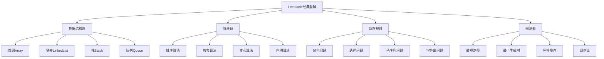

# LeetCode经典题解

## 📖 核心概念

**LeetCode经典题解**是数据结构与算法学习的重要实践环节。通过系统性地解决LeetCode上的经典题目，可以深入理解各种数据结构和算法的应用场景，提高编程能力和问题解决能力。

### 🏗️ LeetCode经典题解分类



## 🔧 LeetCode经典题解

### 数组类题目

```python
# 1. 两数之和 (Two Sum)
class Solution:
    def twoSum(self, nums, target):
        """
        时间复杂度: O(n)
        空间复杂度: O(n)
        """
        hash_map = {}
        for i, num in enumerate(nums):
            complement = target - num
            if complement in hash_map:
                return [hash_map[complement], i]
            hash_map[num] = i
        return []

# 2. 盛最多水的容器 (Container With Most Water)
class Solution:
    def maxArea(self, height):
        """
        双指针法
        时间复杂度: O(n)
        空间复杂度: O(1)
        """
        left, right = 0, len(height) - 1
        max_area = 0
        
        while left < right:
            # 计算当前面积
            current_area = min(height[left], height[right]) * (right - left)
            max_area = max(max_area, current_area)
            
            # 移动指针
            if height[left] < height[right]:
                left += 1
            else:
                right -= 1
        
        return max_area

# 3. 三数之和 (3Sum)
class Solution:
    def threeSum(self, nums):
        """
        排序 + 双指针
        时间复杂度: O(n^2)
        空间复杂度: O(1)
        """
        nums.sort()
        result = []
        
        for i in range(len(nums) - 2):
            # 跳过重复元素
            if i > 0 and nums[i] == nums[i - 1]:
                continue
            
            left, right = i + 1, len(nums) - 1
            
            while left < right:
                current_sum = nums[i] + nums[left] + nums[right]
                
                if current_sum == 0:
                    result.append([nums[i], nums[left], nums[right]])
                    
                    # 跳过重复元素
                    while left < right and nums[left] == nums[left + 1]:
                        left += 1
                    while left < right and nums[right] == nums[right - 1]:
                        right -= 1
                    
                    left += 1
                    right -= 1
                elif current_sum < 0:
                    left += 1
                else:
                    right -= 1
        
        return result

# 4. 最长无重复子串 (Longest Substring Without Repeating Characters)
class Solution:
    def lengthOfLongestSubstring(self, s):
        """
        滑动窗口
        时间复杂度: O(n)
        空间复杂度: O(min(m, n))
        """
        char_set = set()
        left = 0
        max_length = 0
        
        for right in range(len(s)):
            # 如果字符已存在，移动左指针
            while s[right] in char_set:
                char_set.remove(s[left])
                left += 1
            
            char_set.add(s[right])
            max_length = max(max_length, right - left + 1)
        
        return max_length

# 5. 寻找两个正序数组的中位数 (Median of Two Sorted Arrays)
class Solution:
    def findMedianSortedArrays(self, nums1, nums2):
        """
        二分查找
        时间复杂度: O(log(min(m, n)))
        空间复杂度: O(1)
        """
        # 确保nums1是较短的数组
        if len(nums1) > len(nums2):
            nums1, nums2 = nums2, nums1
        
        m, n = len(nums1), len(nums2)
        left, right = 0, m
        
        while left <= right:
            partition1 = (left + right) // 2
            partition2 = (m + n + 1) // 2 - partition1
            
            # 处理边界情况
            max_left1 = float('-inf') if partition1 == 0 else nums1[partition1 - 1]
            min_right1 = float('inf') if partition1 == m else nums1[partition1]
            
            max_left2 = float('-inf') if partition2 == 0 else nums2[partition2 - 1]
            min_right2 = float('inf') if partition2 == n else nums2[partition2]
            
            if max_left1 <= min_right2 and max_left2 <= min_right1:
                # 找到正确分割
                if (m + n) % 2 == 0:
                    return (max(max_left1, max_left2) + min(min_right1, min_right2)) / 2
                else:
                    return max(max_left1, max_left2)
            elif max_left1 > min_right2:
                right = partition1 - 1
            else:
                left = partition1 + 1
```

### 链表类题目

```python
# 6. 反转链表 (Reverse Linked List)
class ListNode:
    def __init__(self, val=0, next=None):
        self.val = val
        self.next = next

class Solution:
    def reverseList(self, head):
        """
        迭代法
        时间复杂度: O(n)
        空间复杂度: O(1)
        """
        prev = None
        current = head
        
        while current:
            next_temp = current.next
            current.next = prev
            prev = current
            current = next_temp
        
        return prev
    
    def reverseListRecursive(self, head):
        """
        递归法
        时间复杂度: O(n)
        空间复杂度: O(n)
        """
        if not head or not head.next:
            return head
        
        reversed_head = self.reverseListRecursive(head.next)
        head.next.next = head
        head.next = None
        
        return reversed_head

# 7. 合并两个有序链表 (Merge Two Sorted Lists)
class Solution:
    def mergeTwoLists(self, l1, l2):
        """
        时间复杂度: O(n + m)
        空间复杂度: O(1)
        """
        dummy = ListNode(0)
        current = dummy
        
        while l1 and l2:
            if l1.val <= l2.val:
                current.next = l1
                l1 = l1.next
            else:
                current.next = l2
                l2 = l2.next
            current = current.next
        
        # 连接剩余节点
        current.next = l1 if l1 else l2
        
        return dummy.next

# 8. 环形链表 (Linked List Cycle)
class Solution:
    def hasCycle(self, head):
        """
        快慢指针法
        时间复杂度: O(n)
        空间复杂度: O(1)
        """
        if not head or not head.next:
            return False
        
        slow = head
        fast = head.next
        
        while slow != fast:
            if not fast or not fast.next:
                return False
            slow = slow.next
            fast = fast.next.next
        
        return True
    
    def detectCycle(self, head):
        """
        检测环的起始位置
        时间复杂度: O(n)
        空间复杂度: O(1)
        """
        if not head or not head.next:
            return None
        
        # 第一阶段：检测是否有环
        slow = fast = head
        while fast and fast.next:
            slow = slow.next
            fast = fast.next.next
            if slow == fast:
                break
        else:
            return None
        
        # 第二阶段：找到环的起始位置
        slow = head
        while slow != fast:
            slow = slow.next
            fast = fast.next
        
        return slow

# 9. 删除链表的倒数第N个节点 (Remove Nth Node From End of List)
class Solution:
    def removeNthFromEnd(self, head, n):
        """
        双指针法
        时间复杂度: O(n)
        空间复杂度: O(1)
        """
        dummy = ListNode(0)
        dummy.next = head
        
        first = dummy
        second = dummy
        
        # 移动first指针n+1步
        for _ in range(n + 1):
            first = first.next
        
        # 同时移动两个指针
        while first:
            first = first.next
            second = second.next
        
        # 删除节点
        second.next = second.next.next
        
        return dummy.next

# 10. 两两交换链表中的节点 (Swap Nodes in Pairs)
class Solution:
    def swapPairs(self, head):
        """
        递归法
        时间复杂度: O(n)
        空间复杂度: O(n)
        """
        if not head or not head.next:
            return head
        
        # 保存第二个节点
        second = head.next
        
        # 递归处理剩余部分
        head.next = self.swapPairs(second.next)
        
        # 交换当前两个节点
        second.next = head
        
        return second
```

### 栈和队列类题目

```python
# 11. 有效的括号 (Valid Parentheses)
class Solution:
    def isValid(self, s):
        """
        栈的应用
        时间复杂度: O(n)
        空间复杂度: O(n)
        """
        stack = []
        mapping = {')': '(', '}': '{', ']': '['}
        
        for char in s:
            if char in mapping:
                # 右括号
                if not stack or stack.pop() != mapping[char]:
                    return False
            else:
                # 左括号
                stack.append(char)
        
        return not stack

# 12. 最小栈 (Min Stack)
class MinStack:
    def __init__(self):
        self.stack = []
        self.min_stack = []
    
    def push(self, val):
        self.stack.append(val)
        if not self.min_stack or val <= self.min_stack[-1]:
            self.min_stack.append(val)
    
    def pop(self):
        if self.stack:
            val = self.stack.pop()
            if self.min_stack and val == self.min_stack[-1]:
                self.min_stack.pop()
    
    def top(self):
        return self.stack[-1] if self.stack else None
    
    def getMin(self):
        return self.min_stack[-1] if self.min_stack else None

# 13. 柱状图中最大的矩形 (Largest Rectangle in Histogram)
class Solution:
    def largestRectangleArea(self, heights):
        """
        单调栈
        时间复杂度: O(n)
        空间复杂度: O(n)
        """
        stack = []
        max_area = 0
        
        for i, height in enumerate(heights):
            while stack and heights[stack[-1]] > height:
                h = heights[stack.pop()]
                w = i if not stack else i - stack[-1] - 1
                max_area = max(max_area, h * w)
            stack.append(i)
        
        # 处理剩余元素
        while stack:
            h = heights[stack.pop()]
            w = len(heights) if not stack else len(heights) - stack[-1] - 1
            max_area = max(max_area, h * w)
        
        return max_area

# 14. 滑动窗口最大值 (Sliding Window Maximum)
class Solution:
    def maxSlidingWindow(self, nums, k):
        """
        双端队列
        时间复杂度: O(n)
        空间复杂度: O(k)
        """
        from collections import deque
        
        dq = deque()
        result = []
        
        for i in range(len(nums)):
            # 移除超出窗口的元素
            while dq and dq[0] <= i - k:
                dq.popleft()
            
            # 移除比当前元素小的元素
            while dq and nums[dq[-1]] < nums[i]:
                dq.pop()
            
            dq.append(i)
            
            # 当窗口大小达到k时，记录最大值
            if i >= k - 1:
                result.append(nums[dq[0]])
        
        return result
```

### 动态规划类题目

```python
# 15. 爬楼梯 (Climbing Stairs)
class Solution:
    def climbStairs(self, n):
        """
        斐波那契数列
        时间复杂度: O(n)
        空间复杂度: O(1)
        """
        if n <= 2:
            return n
        
        prev2, prev1 = 1, 2
        
        for i in range(3, n + 1):
            current = prev1 + prev2
            prev2 = prev1
            prev1 = current
        
        return prev1

# 16. 最长递增子序列 (Longest Increasing Subsequence)
class Solution:
    def lengthOfLIS(self, nums):
        """
        动态规划
        时间复杂度: O(n^2)
        空间复杂度: O(n)
        """
        if not nums:
            return 0
        
        dp = [1] * len(nums)
        
        for i in range(1, len(nums)):
            for j in range(i):
                if nums[j] < nums[i]:
                    dp[i] = max(dp[i], dp[j] + 1)
        
        return max(dp)
    
    def lengthOfLISBinarySearch(self, nums):
        """
        二分查找优化
        时间复杂度: O(n log n)
        空间复杂度: O(n)
        """
        if not nums:
            return 0
        
        tails = []
        
        for num in nums:
            left, right = 0, len(tails)
            
            while left < right:
                mid = (left + right) // 2
                if tails[mid] < num:
                    left = mid + 1
                else:
                    right = mid
            
            if left == len(tails):
                tails.append(num)
            else:
                tails[left] = num
        
        return len(tails)

# 17. 最长公共子序列 (Longest Common Subsequence)
class Solution:
    def longestCommonSubsequence(self, text1, text2):
        """
        动态规划
        时间复杂度: O(m * n)
        空间复杂度: O(m * n)
        """
        m, n = len(text1), len(text2)
        dp = [[0] * (n + 1) for _ in range(m + 1)]
        
        for i in range(1, m + 1):
            for j in range(1, n + 1):
                if text1[i - 1] == text2[j - 1]:
                    dp[i][j] = dp[i - 1][j - 1] + 1
                else:
                    dp[i][j] = max(dp[i - 1][j], dp[i][j - 1])
        
        return dp[m][n]

# 18. 编辑距离 (Edit Distance)
class Solution:
    def minDistance(self, word1, word2):
        """
        动态规划
        时间复杂度: O(m * n)
        空间复杂度: O(m * n)
        """
        m, n = len(word1), len(word2)
        dp = [[0] * (n + 1) for _ in range(m + 1)]
        
        # 初始化
        for i in range(m + 1):
            dp[i][0] = i
        for j in range(n + 1):
            dp[0][j] = j
        
        for i in range(1, m + 1):
            for j in range(1, n + 1):
                if word1[i - 1] == word2[j - 1]:
                    dp[i][j] = dp[i - 1][j - 1]
                else:
                    dp[i][j] = min(
                        dp[i - 1][j] + 1,      # 删除
                        dp[i][j - 1] + 1,      # 插入
                        dp[i - 1][j - 1] + 1   # 替换
                    )
        
        return dp[m][n]

# 19. 零钱兑换 (Coin Change)
class Solution:
    def coinChange(self, coins, amount):
        """
        动态规划
        时间复杂度: O(amount * len(coins))
        空间复杂度: O(amount)
        """
        dp = [float('inf')] * (amount + 1)
        dp[0] = 0
        
        for i in range(1, amount + 1):
            for coin in coins:
                if coin <= i:
                    dp[i] = min(dp[i], dp[i - coin] + 1)
        
        return dp[amount] if dp[amount] != float('inf') else -1

# 20. 打家劫舍 (House Robber)
class Solution:
    def rob(self, nums):
        """
        动态规划
        时间复杂度: O(n)
        空间复杂度: O(1)
        """
        if not nums:
            return 0
        if len(nums) == 1:
            return nums[0]
        
        prev2 = nums[0]
        prev1 = max(nums[0], nums[1])
        
        for i in range(2, len(nums)):
            current = max(prev1, prev2 + nums[i])
            prev2 = prev1
            prev1 = current
        
        return prev1
```

### 图论类题目

```python
# 21. 岛屿数量 (Number of Islands)
class Solution:
    def numIslands(self, grid):
        """
        DFS
        时间复杂度: O(m * n)
        空间复杂度: O(m * n)
        """
        if not grid or not grid[0]:
            return 0
        
        m, n = len(grid), len(grid[0])
        count = 0
        
        def dfs(i, j):
            if (i < 0 or i >= m or j < 0 or j >= n or 
                grid[i][j] != '1'):
                return
            
            grid[i][j] = '0'  # 标记为已访问
            
            # 四个方向DFS
            dfs(i + 1, j)
            dfs(i - 1, j)
            dfs(i, j + 1)
            dfs(i, j - 1)
        
        for i in range(m):
            for j in range(n):
                if grid[i][j] == '1':
                    dfs(i, j)
                    count += 1
        
        return count

# 22. 课程表 (Course Schedule)
class Solution:
    def canFinish(self, numCourses, prerequisites):
        """
        拓扑排序
        时间复杂度: O(V + E)
        空间复杂度: O(V + E)
        """
        # 构建邻接表和入度数组
        graph = [[] for _ in range(numCourses)]
        in_degree = [0] * numCourses
        
        for course, prereq in prerequisites:
            graph[prereq].append(course)
            in_degree[course] += 1
        
        # 找到所有入度为0的节点
        queue = []
        for i in range(numCourses):
            if in_degree[i] == 0:
                queue.append(i)
        
        completed = 0
        
        while queue:
            course = queue.pop(0)
            completed += 1
            
            # 更新相邻节点的入度
            for next_course in graph[course]:
                in_degree[next_course] -= 1
                if in_degree[next_course] == 0:
                    queue.append(next_course)
        
        return completed == numCourses

# 23. 单词接龙 (Word Ladder)
class Solution:
    def ladderLength(self, beginWord, endWord, wordList):
        """
        BFS
        时间复杂度: O(M^2 * N)
        空间复杂度: O(M^2 * N)
        """
        if endWord not in wordList:
            return 0
        
        wordSet = set(wordList)
        queue = [(beginWord, 1)]
        visited = {beginWord}
        
        while queue:
            word, length = queue.pop(0)
            
            if word == endWord:
                return length
            
            # 尝试改变每个字符
            for i in range(len(word)):
                for c in 'abcdefghijklmnopqrstuvwxyz':
                    if c != word[i]:
                        new_word = word[:i] + c + word[i+1:]
                        
                        if new_word in wordSet and new_word not in visited:
                            visited.add(new_word)
                            queue.append((new_word, length + 1))
        
        return 0

# 24. 克隆图 (Clone Graph)
class Node:
    def __init__(self, val=0, neighbors=None):
        self.val = val
        self.neighbors = neighbors if neighbors is not None else []

class Solution:
    def cloneGraph(self, node):
        """
        DFS + 哈希表
        时间复杂度: O(V + E)
        空间复杂度: O(V)
        """
        if not node:
            return None
        
        visited = {}
        
        def dfs(node):
            if node in visited:
                return visited[node]
            
            clone = Node(node.val)
            visited[node] = clone
            
            for neighbor in node.neighbors:
                clone.neighbors.append(dfs(neighbor))
            
            return clone
        
        return dfs(node)
```

## 🎯 LeetCode经典题解应用

### 实际应用场景

```python
class LeetCodeApplications:
    @staticmethod
    def demonstrate_applications():
        print("LeetCode Applications:")
        print("===================")
        
        print("1. 面试准备:")
        print("   - 算法思维训练")
        print("   - 编程能力提升")
        print("   - 问题解决能力")
        
        print("2. 实际开发:")
        print("   - 数据处理算法")
        print("   - 系统设计基础")
        print("   - 性能优化")
        
        print("3. 竞赛编程:")
        print("   - ACM竞赛")
        print("   - 算法竞赛")
        print("   - 编程挑战")
        
        print("4. 学习成长:")
        print("   - 数据结构理解")
        print("   - 算法设计")
        print("   - 代码质量")
    
    @staticmethod
    def analyze_performance():
        print("LeetCode Performance Analysis:")
        print("============================")
        
        print("1. 解题策略:")
        print("   - 理解题目要求")
        print("   - 分析时间复杂度")
        print("   - 考虑边界情况")
        print("   - 优化空间复杂度")
        print()
        
        print("2. 常见模式:")
        print("   - 双指针")
        print("   - 滑动窗口")
        print("   - 动态规划")
        print("   - 回溯算法")
        print()
        
        print("3. 优化技巧:")
        print("   - 空间换时间")
        print("   - 时间换空间")
        print("   - 数据结构选择")
        print("   - 算法选择")
    
    @staticmethod
    def select_solution_strategy(problem_type, constraints, optimization_target):
        print("Solution Strategy Selection:")
        print("==========================")
        
        print(f"Problem type: {problem_type}")
        print(f"Constraints: {constraints}")
        print(f"Optimization target: {optimization_target}")
        
        print("Recommendation:")
        
        if problem_type == "array" and constraints == "sorted":
            print("Use binary search or two pointers")
        elif problem_type == "array" and constraints == "unsorted":
            print("Use hash table or sorting")
        elif problem_type == "linked_list":
            print("Use pointers manipulation")
        elif problem_type == "tree":
            print("Use DFS or BFS")
        elif problem_type == "graph":
            print("Use DFS, BFS, or topological sort")
        elif problem_type == "dp":
            print("Use dynamic programming with optimal substructure")
        else:
            print("Analyze problem characteristics and choose appropriate algorithm")
```

## 📊 LeetCode经典题解分析

### 性能分析

```python
class LeetCodeAnalysis:
    @staticmethod
    def analyze_performance():
        print("LeetCode Performance Analysis:")
        print("============================")
        
        print("1. 时间复杂度:")
        print("   - 数组遍历: O(n)")
        print("   - 二分查找: O(log n)")
        print("   - 排序算法: O(n log n)")
        print("   - 动态规划: O(n^2)")
        print("   - 图遍历: O(V + E)")
        print()
        
        print("2. 空间复杂度:")
        print("   - 原地算法: O(1)")
        print("   - 递归算法: O(n)")
        print("   - 动态规划: O(n)")
        print("   - 图算法: O(V + E)")
        print()
        
        print("3. 优化策略:")
        print("   - 时间优化: 算法选择")
        print("   - 空间优化: 数据结构选择")
        print("   - 代码优化: 减少操作")
        print("   - 边界优化: 特殊情况处理")
    
    @staticmethod
    def analyze_space_complexity():
        print("LeetCode Space Complexity Analysis:")
        print("=================================")
        
        print("1. 空间使用:")
        print("   - 输入空间: 题目给定")
        print("   - 辅助空间: 算法需要")
        print("   - 输出空间: 结果存储")
        print("   - 递归空间: 调用栈")
        print()
        
        print("2. 空间优化:")
        print("   - 原地修改: 减少空间")
        print("   - 迭代替代: 避免递归")
        print("   - 数据结构: 选择合适")
        print("   - 空间复用: 重复使用")
        print()
        
        print("3. 空间分析:")
        print("   - 最坏情况: 最大空间")
        print("   - 平均情况: 期望空间")
        print("   - 最好情况: 最小空间")
        print("   - 实际使用: 真实空间")
    
    @staticmethod
    def analyze_time_complexity():
        print("LeetCode Time Complexity Analysis:")
        print("================================")
        
        print("1. 算法复杂度:")
        print("   - 线性时间: O(n)")
        print("   - 对数时间: O(log n)")
        print("   - 平方时间: O(n^2)")
        print("   - 指数时间: O(2^n)")
        print("   - 阶乘时间: O(n!)")
        print()
        
        print("2. 复杂度分析:")
        print("   - 最坏情况: 最大时间")
        print("   - 平均情况: 期望时间")
        print("   - 最好情况: 最小时间")
        print("   - 实际运行: 真实时间")
        print()
        
        print("3. 优化方法:")
        print("   - 算法选择: 合适算法")
        print("   - 数据结构: 高效结构")
        print("   - 预处理: 提前计算")
        print("   - 缓存: 避免重复")
```

## 🎮 LeetCode经典题解测试

### 1. 基础功能测试

```python
def test_array_problems():
    print("Testing Array Problems:")
    print("=====================")
    
    # 测试两数之和
    solution = Solution()
    result = solution.twoSum([2, 7, 11, 15], 9)
    print(f"Two Sum: {result}")
    
    # 测试盛最多水的容器
    result = solution.maxArea([1, 8, 6, 2, 5, 4, 8, 3, 7])
    print(f"Max Area: {result}")
    
    # 测试三数之和
    result = solution.threeSum([-1, 0, 1, 2, -1, -4])
    print(f"Three Sum: {result}")

def test_linked_list_problems():
    print("Testing Linked List Problems:")
    print("===========================")
    
    # 创建测试链表
    head = ListNode(1)
    head.next = ListNode(2)
    head.next.next = ListNode(3)
    head.next.next.next = ListNode(4)
    
    solution = Solution()
    
    # 测试反转链表
    reversed_head = solution.reverseList(head)
    print("Reversed List:")
    current = reversed_head
    while current:
        print(current.val, end=" -> ")
        current = current.next
    print("None")

def test_stack_queue_problems():
    print("Testing Stack/Queue Problems:")
    print("============================")
    
    solution = Solution()
    
    # 测试有效的括号
    result = solution.isValid("()[]{}")
    print(f"Valid Parentheses: {result}")
    
    # 测试最小栈
    min_stack = MinStack()
    min_stack.push(-2)
    min_stack.push(0)
    min_stack.push(-3)
    print(f"Min Stack Min: {min_stack.getMin()}")
    min_stack.pop()
    print(f"Min Stack Top: {min_stack.top()}")
    print(f"Min Stack Min: {min_stack.getMin()}")

def test_dp_problems():
    print("Testing Dynamic Programming Problems:")
    print("==================================")
    
    solution = Solution()
    
    # 测试爬楼梯
    result = solution.climbStairs(5)
    print(f"Climb Stairs: {result}")
    
    # 测试最长递增子序列
    result = solution.lengthOfLIS([10, 9, 2, 5, 3, 7, 101, 18])
    print(f"Longest Increasing Subsequence: {result}")
    
    # 测试零钱兑换
    result = solution.coinChange([1, 3, 4], 6)
    print(f"Coin Change: {result}")

def test_graph_problems():
    print("Testing Graph Problems:")
    print("=====================")
    
    solution = Solution()
    
    # 测试岛屿数量
    grid = [
        ["1", "1", "1", "1", "0"],
        ["1", "1", "0", "1", "0"],
        ["1", "1", "0", "0", "0"],
        ["0", "0", "0", "0", "0"]
    ]
    result = solution.numIslands(grid)
    print(f"Number of Islands: {result}")
    
    # 测试课程表
    result = solution.canFinish(2, [[1, 0]])
    print(f"Course Schedule: {result}")

def test_applications():
    print("Testing Applications:")
    print("==================")
    
    LeetCodeApplications.demonstrate_applications()
    LeetCodeApplications.analyze_performance()
    LeetCodeApplications.select_solution_strategy("array", "sorted", "time")

def test_analysis():
    print("Testing Analysis:")
    print("===============")
    
    LeetCodeAnalysis.analyze_performance()
    LeetCodeAnalysis.analyze_space_complexity()
    LeetCodeAnalysis.analyze_time_complexity()

# 主测试函数
def main():
    test_array_problems()
    print()
    test_linked_list_problems()
    print()
    test_stack_queue_problems()
    print()
    test_dp_problems()
    print()
    test_graph_problems()
    print()
    test_applications()
    print()
    test_analysis()

if __name__ == "__main__":
    main()
```

## 🔗 相关链接

- [[01-剑指Offer题集|剑指Offer题集]]
- [[02-牛客网刷题|牛客网刷题]]
- [[03-算法模板总结|算法模板总结]]

## 💡 LeetCode经典题解要点

1. **理解题意**: 仔细分析题目要求和约束条件
2. **选择算法**: 根据问题特点选择合适的算法
3. **优化性能**: 考虑时间和空间复杂度的平衡
4. **边界处理**: 注意特殊情况和边界条件

---

*📝 LeetCode经典题解提示：LeetCode刷题需要系统性的方法，从基础题目开始，逐步提高难度，注重算法思维和编程能力的培养*
