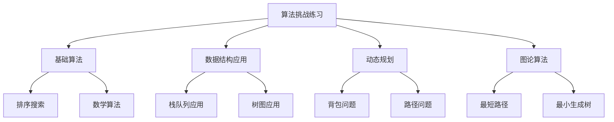

# 算法挑战练习

## 📖 核心概念

**算法挑战练习**是提升算法思维和编程能力的重要途径，通过解决各种算法问题，可以深入理解数据结构的应用和算法的设计思想。

### 🏗️ 挑战类型



## 🔧 基础算法挑战

### 1. 数组问题

```cpp
class ArrayChallenges {
public:
    // 两数之和
    static vector<int> twoSum(vector<int>& nums, int target) {
        unordered_map<int, int> map;
        
        for (int i = 0; i < nums.size(); ++i) {
            int complement = target - nums[i];
            
            if (map.find(complement) != map.end()) {
                return {map[complement], i};
            }
            
            map[nums[i]] = i;
        }
        
        return {};
    }
    
    // 三数之和
    static vector<vector<int>> threeSum(vector<int>& nums) {
        vector<vector<int>> result;
        sort(nums.begin(), nums.end());
        
        for (int i = 0; i < nums.size() - 2; ++i) {
            if (i > 0 && nums[i] == nums[i - 1]) continue;
            
            int left = i + 1, right = nums.size() - 1;
            
            while (left < right) {
                int sum = nums[i] + nums[left] + nums[right];
                
                if (sum == 0) {
                    result.push_back({nums[i], nums[left], nums[right]});
                    
                    while (left < right && nums[left] == nums[left + 1]) left++;
                    while (left < right && nums[right] == nums[right - 1]) right--;
                    
                    left++;
                    right--;
                } else if (sum < 0) {
                    left++;
                } else {
                    right--;
                }
            }
        }
        
        return result;
    }
    
    // 最大子数组和
    static int maxSubArray(vector<int>& nums) {
        int maxSum = nums[0];
        int currentSum = nums[0];
        
        for (int i = 1; i < nums.size(); ++i) {
            currentSum = max(nums[i], currentSum + nums[i]);
            maxSum = max(maxSum, currentSum);
        }
        
        return maxSum;
    }
    
    // 旋转数组
    static void rotate(vector<int>& nums, int k) {
        int n = nums.size();
        k = k % n;
        
        reverse(nums.begin(), nums.end());
        reverse(nums.begin(), nums.begin() + k);
        reverse(nums.begin() + k, nums.end());
    }
    
    // 合并两个有序数组
    static void merge(vector<int>& nums1, int m, vector<int>& nums2, int n) {
        int i = m - 1, j = n - 1, k = m + n - 1;
        
        while (i >= 0 && j >= 0) {
            if (nums1[i] > nums2[j]) {
                nums1[k--] = nums1[i--];
            } else {
                nums1[k--] = nums2[j--];
            }
        }
        
        while (j >= 0) {
            nums1[k--] = nums2[j--];
        }
    }
    
    // 寻找重复数
    static int findDuplicate(vector<int>& nums) {
        int slow = nums[0];
        int fast = nums[0];
        
        // 找到相遇点
        do {
            slow = nums[slow];
            fast = nums[nums[fast]];
        } while (slow != fast);
        
        // 找到环的起点
        slow = nums[0];
        while (slow != fast) {
            slow = nums[slow];
            fast = nums[fast];
        }
        
        return slow;
    }
};
```

### 2. 链表问题

```cpp
class LinkedListChallenges {
public:
    struct ListNode {
        int val;
        ListNode* next;
        ListNode(int x) : val(x), next(nullptr) {}
    };
    
    // 反转链表
    static ListNode* reverseList(ListNode* head) {
        ListNode* prev = nullptr;
        ListNode* current = head;
        
        while (current) {
            ListNode* next = current->next;
            current->next = prev;
            prev = current;
            current = next;
        }
        
        return prev;
    }
    
    // 合并两个有序链表
    static ListNode* mergeTwoLists(ListNode* l1, ListNode* l2) {
        ListNode dummy(0);
        ListNode* current = &dummy;
        
        while (l1 && l2) {
            if (l1->val <= l2->val) {
                current->next = l1;
                l1 = l1->next;
            } else {
                current->next = l2;
                l2 = l2->next;
            }
            current = current->next;
        }
        
        current->next = l1 ? l1 : l2;
        return dummy.next;
    }
    
    // 删除链表的倒数第N个节点
    static ListNode* removeNthFromEnd(ListNode* head, int n) {
        ListNode dummy(0);
        dummy.next = head;
        
        ListNode* first = &dummy;
        ListNode* second = &dummy;
        
        // 移动first指针n+1步
        for (int i = 0; i <= n; ++i) {
            first = first->next;
        }
        
        // 同时移动两个指针
        while (first) {
            first = first->next;
            second = second->next;
        }
        
        // 删除节点
        second->next = second->next->next;
        
        return dummy.next;
    }
    
    // 检测链表中的环
    static bool hasCycle(ListNode* head) {
        if (!head || !head->next) return false;
        
        ListNode* slow = head;
        ListNode* fast = head->next;
        
        while (fast && fast->next) {
            if (slow == fast) return true;
            slow = slow->next;
            fast = fast->next->next;
        }
        
        return false;
    }
    
    // 找到链表的中间节点
    static ListNode* findMiddle(ListNode* head) {
        ListNode* slow = head;
        ListNode* fast = head;
        
        while (fast && fast->next) {
            slow = slow->next;
            fast = fast->next->next;
        }
        
        return slow;
    }
    
    // 回文链表
    static bool isPalindrome(ListNode* head) {
        if (!head || !head->next) return true;
        
        // 找到中间节点
        ListNode* slow = head;
        ListNode* fast = head;
        
        while (fast && fast->next) {
            slow = slow->next;
            fast = fast->next->next;
        }
        
        // 反转后半部分
        ListNode* secondHalf = reverseList(slow);
        
        // 比较两部分
        ListNode* firstHalf = head;
        while (secondHalf) {
            if (firstHalf->val != secondHalf->val) {
                return false;
            }
            firstHalf = firstHalf->next;
            secondHalf = secondHalf->next;
        }
        
        return true;
    }
};
```

### 3. 栈和队列问题

```cpp
class StackQueueChallenges {
public:
    // 有效的括号
    static bool isValidParentheses(string s) {
        stack<char> st;
        
        for (char c : s) {
            if (c == '(' || c == '[' || c == '{') {
                st.push(c);
            } else if (c == ')' || c == ']' || c == '}') {
                if (st.empty()) return false;
                
                char top = st.top();
                st.pop();
                
                if ((c == ')' && top != '(') ||
                    (c == ']' && top != '[') ||
                    (c == '}' && top != '{')) {
                    return false;
                }
            }
        }
        
        return st.empty();
    }
    
    // 每日温度
    static vector<int> dailyTemperatures(vector<int>& temperatures) {
        int n = temperatures.size();
        vector<int> result(n, 0);
        stack<int> st;
        
        for (int i = 0; i < n; ++i) {
            while (!st.empty() && temperatures[i] > temperatures[st.top()]) {
                int prevIndex = st.top();
                st.pop();
                result[prevIndex] = i - prevIndex;
            }
            st.push(i);
        }
        
        return result;
    }
    
    // 柱状图中最大的矩形
    static int largestRectangleArea(vector<int>& heights) {
        stack<int> st;
        int maxArea = 0;
        
        for (int i = 0; i <= heights.size(); ++i) {
            int h = (i == heights.size()) ? 0 : heights[i];
            
            while (!st.empty() && h < heights[st.top()]) {
                int height = heights[st.top()];
                st.pop();
                int width = st.empty() ? i : i - st.top() - 1;
                maxArea = max(maxArea, height * width);
            }
            
            st.push(i);
        }
        
        return maxArea;
    }
    
    // 滑动窗口最大值
    static vector<int> maxSlidingWindow(vector<int>& nums, int k) {
        deque<int> dq;
        vector<int> result;
        
        for (int i = 0; i < nums.size(); ++i) {
            // 移除超出窗口的元素
            while (!dq.empty() && dq.front() <= i - k) {
                dq.pop_front();
            }
            
            // 移除比当前元素小的元素
            while (!dq.empty() && nums[dq.back()] < nums[i]) {
                dq.pop_back();
            }
            
            dq.push_back(i);
            
            // 窗口形成后记录最大值
            if (i >= k - 1) {
                result.push_back(nums[dq.front()]);
            }
        }
        
        return result;
    }
    
    // 设计循环队列
    class MyCircularQueue {
    private:
        vector<int> data;
        int head, tail, size, capacity;
        
    public:
        MyCircularQueue(int k) : capacity(k), head(0), tail(-1), size(0) {
            data.resize(k);
        }
        
        bool enQueue(int value) {
            if (isFull()) return false;
            
            tail = (tail + 1) % capacity;
            data[tail] = value;
            size++;
            return true;
        }
        
        bool deQueue() {
            if (isEmpty()) return false;
            
            head = (head + 1) % capacity;
            size--;
            return true;
        }
        
        int Front() {
            return isEmpty() ? -1 : data[head];
        }
        
        int Rear() {
            return isEmpty() ? -1 : data[tail];
        }
        
        bool isEmpty() {
            return size == 0;
        }
        
        bool isFull() {
            return size == capacity;
        }
    };
};
```

## 🎯 动态规划挑战

### 1. 经典DP问题

```cpp
class DynamicProgrammingChallenges {
public:
    // 爬楼梯
    static int climbStairs(int n) {
        if (n <= 2) return n;
        
        int prev2 = 1, prev1 = 2;
        for (int i = 3; i <= n; ++i) {
            int current = prev1 + prev2;
            prev2 = prev1;
            prev1 = current;
        }
        
        return prev1;
    }
    
    // 最长递增子序列
    static int lengthOfLIS(vector<int>& nums) {
        vector<int> dp(nums.size(), 1);
        int maxLength = 1;
        
        for (int i = 1; i < nums.size(); ++i) {
            for (int j = 0; j < i; ++j) {
                if (nums[j] < nums[i]) {
                    dp[i] = max(dp[i], dp[j] + 1);
                }
            }
            maxLength = max(maxLength, dp[i]);
        }
        
        return maxLength;
    }
    
    // 最长公共子序列
    static int longestCommonSubsequence(string text1, string text2) {
        int m = text1.length(), n = text2.length();
        vector<vector<int>> dp(m + 1, vector<int>(n + 1, 0));
        
        for (int i = 1; i <= m; ++i) {
            for (int j = 1; j <= n; ++j) {
                if (text1[i - 1] == text2[j - 1]) {
                    dp[i][j] = dp[i - 1][j - 1] + 1;
                } else {
                    dp[i][j] = max(dp[i - 1][j], dp[i][j - 1]);
                }
            }
        }
        
        return dp[m][n];
    }
    
    // 编辑距离
    static int minDistance(string word1, string word2) {
        int m = word1.length(), n = word2.length();
        vector<vector<int>> dp(m + 1, vector<int>(n + 1, 0));
        
        // 初始化
        for (int i = 0; i <= m; ++i) dp[i][0] = i;
        for (int j = 0; j <= n; ++j) dp[0][j] = j;
        
        for (int i = 1; i <= m; ++i) {
            for (int j = 1; j <= n; ++j) {
                if (word1[i - 1] == word2[j - 1]) {
                    dp[i][j] = dp[i - 1][j - 1];
                } else {
                    dp[i][j] = min({dp[i - 1][j], dp[i][j - 1], dp[i - 1][j - 1]}) + 1;
                }
            }
        }
        
        return dp[m][n];
    }
    
    // 零钱兑换
    static int coinChange(vector<int>& coins, int amount) {
        vector<int> dp(amount + 1, amount + 1);
        dp[0] = 0;
        
        for (int i = 1; i <= amount; ++i) {
            for (int coin : coins) {
                if (coin <= i) {
                    dp[i] = min(dp[i], dp[i - coin] + 1);
                }
            }
        }
        
        return dp[amount] > amount ? -1 : dp[amount];
    }
    
    // 最长回文子序列
    static int longestPalindromeSubseq(string s) {
        int n = s.length();
        vector<vector<int>> dp(n, vector<int>(n, 0));
        
        for (int i = 0; i < n; ++i) {
            dp[i][i] = 1;
        }
        
        for (int len = 2; len <= n; ++len) {
            for (int i = 0; i <= n - len; ++i) {
                int j = i + len - 1;
                
                if (s[i] == s[j]) {
                    dp[i][j] = dp[i + 1][j - 1] + 2;
                } else {
                    dp[i][j] = max(dp[i + 1][j], dp[i][j - 1]);
                }
            }
        }
        
        return dp[0][n - 1];
    }
};
```

### 2. 图论算法挑战

```cpp
class GraphChallenges {
public:
    // 岛屿数量
    static int numIslands(vector<vector<char>>& grid) {
        if (grid.empty() || grid[0].empty()) return 0;
        
        int m = grid.size(), n = grid[0].size();
        int count = 0;
        
        for (int i = 0; i < m; ++i) {
            for (int j = 0; j < n; ++j) {
                if (grid[i][j] == '1') {
                    dfs(grid, i, j);
                    count++;
                }
            }
        }
        
        return count;
    }
    
    static void dfs(vector<vector<char>>& grid, int i, int j) {
        if (i < 0 || i >= grid.size() || j < 0 || j >= grid[0].size() || grid[i][j] != '1') {
            return;
        }
        
        grid[i][j] = '0';
        dfs(grid, i + 1, j);
        dfs(grid, i - 1, j);
        dfs(grid, i, j + 1);
        dfs(grid, i, j - 1);
    }
    
    // 课程表
    static bool canFinish(int numCourses, vector<vector<int>>& prerequisites) {
        vector<vector<int>> graph(numCourses);
        vector<int> indegree(numCourses, 0);
        
        for (auto& edge : prerequisites) {
            graph[edge[1]].push_back(edge[0]);
            indegree[edge[0]]++;
        }
        
        queue<int> q;
        for (int i = 0; i < numCourses; ++i) {
            if (indegree[i] == 0) {
                q.push(i);
            }
        }
        
        int count = 0;
        while (!q.empty()) {
            int course = q.front();
            q.pop();
            count++;
            
            for (int next : graph[course]) {
                indegree[next]--;
                if (indegree[next] == 0) {
                    q.push(next);
                }
            }
        }
        
        return count == numCourses;
    }
    
    // 最短路径
    static int shortestPath(vector<vector<int>>& grid, int k) {
        int m = grid.size(), n = grid[0].size();
        vector<vector<int>> visited(m, vector<int>(n, -1));
        
        queue<vector<int>> q;
        q.push({0, 0, 0, k}); // {row, col, steps, remaining_k}
        
        while (!q.empty()) {
            auto curr = q.front();
            q.pop();
            
            int row = curr[0], col = curr[1], steps = curr[2], remaining_k = curr[3];
            
            if (row == m - 1 && col == n - 1) {
                return steps;
            }
            
            if (visited[row][col] >= remaining_k) continue;
            visited[row][col] = remaining_k;
            
            vector<vector<int>> directions = {{0, 1}, {1, 0}, {0, -1}, {-1, 0}};
            
            for (auto& dir : directions) {
                int newRow = row + dir[0];
                int newCol = col + dir[1];
                
                if (newRow >= 0 && newRow < m && newCol >= 0 && newCol < n) {
                    if (grid[newRow][newCol] == 1) {
                        if (remaining_k > 0) {
                            q.push({newRow, newCol, steps + 1, remaining_k - 1});
                        }
                    } else {
                        q.push({newRow, newCol, steps + 1, remaining_k});
                    }
                }
            }
        }
        
        return -1;
    }
};
```

## 🎮 挑战练习应用

### 1. 算法竞赛模拟

```cpp
class AlgorithmContest {
public:
    static void simulateContest() {
        cout << "=== Algorithm Contest Simulation ===" << endl;
        
        // 问题1: 两数之和
        vector<int> nums1 = {2, 7, 11, 15};
        int target1 = 9;
        auto result1 = ArrayChallenges::twoSum(nums1, target1);
        cout << "Problem 1 - Two Sum: [" << result1[0] << ", " << result1[1] << "]" << endl;
        
        // 问题2: 反转链表
        LinkedListChallenges::ListNode* head = new LinkedListChallenges::ListNode(1);
        head->next = new LinkedListChallenges::ListNode(2);
        head->next->next = new LinkedListChallenges::ListNode(3);
        
        auto reversed = LinkedListChallenges::reverseList(head);
        cout << "Problem 2 - Reverse List: ";
        while (reversed) {
            cout << reversed->val << " ";
            reversed = reversed->next;
        }
        cout << endl;
        
        // 问题3: 爬楼梯
        int stairs = 5;
        int ways = DynamicProgrammingChallenges::climbStairs(stairs);
        cout << "Problem 3 - Climb Stairs: " << ways << " ways" << endl;
        
        // 问题4: 岛屿数量
        vector<vector<char>> grid = {
            {'1','1','1','1','0'},
            {'1','1','0','1','0'},
            {'1','1','0','0','0'},
            {'0','0','0','0','0'}
        };
        int islands = GraphChallenges::numIslands(grid);
        cout << "Problem 4 - Number of Islands: " << islands << endl;
        
        cout << "Contest completed!" << endl;
    }
    
    static void performanceBenchmark() {
        cout << "=== Performance Benchmark ===" << endl;
        
        // 测试数组算法性能
        vector<int> largeArray(10000);
        for (int i = 0; i < 10000; ++i) {
            largeArray[i] = rand() % 1000;
        }
        
        auto start = chrono::high_resolution_clock::now();
        int maxSum = ArrayChallenges::maxSubArray(largeArray);
        auto end = chrono::high_resolution_clock::now();
        auto duration = chrono::duration_cast<chrono::microseconds>(end - start);
        
        cout << "Max Subarray Sum: " << maxSum << endl;
        cout << "Execution time: " << duration.count() << " microseconds" << endl;
        
        // 测试动态规划性能
        start = chrono::high_resolution_clock::now();
        int lis = DynamicProgrammingChallenges::lengthOfLIS(largeArray);
        end = chrono::high_resolution_clock::now();
        duration = chrono::duration_cast<chrono::microseconds>(end - start);
        
        cout << "Longest Increasing Subsequence: " << lis << endl;
        cout << "Execution time: " << duration.count() << " microseconds" << endl;
    }
};
```

### 2. 解题策略

```cpp
class ProblemSolvingStrategies {
public:
    static void displayStrategies() {
        cout << "=== Problem Solving Strategies ===" << endl;
        
        cout << "1. 数组问题:" << endl;
        cout << "   - 双指针技术" << endl;
        cout << "   - 滑动窗口" << endl;
        cout << "   - 前缀和" << endl;
        cout << "   - 哈希表优化" << endl;
        
        cout << "2. 链表问题:" << endl;
        cout << "   - 快慢指针" << endl;
        cout << "   - 反转链表" << endl;
        cout << "   - 合并链表" << endl;
        cout << "   - 环检测" << endl;
        
        cout << "3. 栈队列问题:" << endl;
        cout << "   - 单调栈" << endl;
        cout << "   - 双端队列" << endl;
        cout << "   - 括号匹配" << endl;
        cout << "   - 表达式求值" << endl;
        
        cout << "4. 动态规划:" << endl;
        cout << "   - 状态定义" << endl;
        cout << "   - 状态转移" << endl;
        cout << "   - 空间优化" << endl;
        cout << "   - 滚动数组" << endl;
        
        cout << "5. 图论算法:" << endl;
        cout << "   - DFS/BFS" << endl;
        cout << "   - 拓扑排序" << endl;
        cout << "   - 最短路径" << endl;
        cout << "   - 最小生成树" << endl;
    }
    
    static void practiceRecommendations() {
        cout << "=== Practice Recommendations ===" << endl;
        
        cout << "初级练习:" << endl;
        cout << "  - 两数之和" << endl;
        cout << "  - 反转链表" << endl;
        cout << "  - 有效的括号" << endl;
        cout << "  - 爬楼梯" << endl;
        
        cout << "中级练习:" << endl;
        cout << "  - 三数之和" << endl;
        cout << "  - 合并两个有序链表" << endl;
        cout << "  - 每日温度" << endl;
        cout << "  - 最长递增子序列" << endl;
        
        cout << "高级练习:" << endl;
        cout << "  - 柱状图中最大的矩形" << endl;
        cout << "  - 滑动窗口最大值" << endl;
        cout << "  - 编辑距离" << endl;
        cout << "  - 岛屿数量" << endl;
    }
};
```

## 🔗 相关链接

- [[01-代码实现练习|代码实现练习]]
- [[03-项目实战练习|项目实战练习]]

## 💡 算法挑战练习要点

1. **基础算法**：掌握常见算法的实现
2. **数据结构应用**：理解数据结构在算法中的应用
3. **动态规划**：掌握状态转移和优化技巧
4. **图论算法**：理解图的基本操作和算法

---

*📝 挑战提示：算法挑战是提升编程能力的重要途径，通过大量练习掌握算法思维*