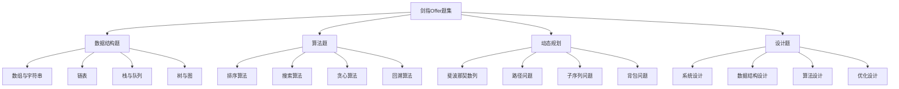

# 剑指Offer题集

## 📖 核心概念

**剑指Offer题集**是数据结构与算法学习的重要资源，包含了大量经典的面试题目。这些题目涵盖了各种数据结构和算法的核心概念，是准备技术面试的必备材料。

### 🏗️ 剑指Offer题集分类



## 🔧 剑指Offer题集

### 数组与字符串类题目

```python
# 1. 数组中重复的数字
class Solution:
    def findRepeatNumber(self, nums):
        """
        时间复杂度: O(n)
        空间复杂度: O(1)
        """
        for i in range(len(nums)):
            while nums[i] != i:
                if nums[nums[i]] == nums[i]:
                    return nums[i]
                nums[nums[i]], nums[i] = nums[i], nums[nums[i]]
        return -1

# 2. 二维数组中的查找
class Solution:
    def findNumberIn2DArray(self, matrix, target):
        """
        从右上角开始查找
        时间复杂度: O(m + n)
        空间复杂度: O(1)
        """
        if not matrix or not matrix[0]:
            return False
        
        m, n = len(matrix), len(matrix[0])
        row, col = 0, n - 1
        
        while row < m and col >= 0:
            if matrix[row][col] == target:
                return True
            elif matrix[row][col] > target:
                col -= 1
            else:
                row += 1
        
        return False

# 3. 替换空格
class Solution:
    def replaceSpace(self, s):
        """
        时间复杂度: O(n)
        空间复杂度: O(n)
        """
        return s.replace(' ', '%20')

# 4. 从尾到头打印链表
class ListNode:
    def __init__(self, x):
        self.val = x
        self.next = None

class Solution:
    def reversePrint(self, head):
        """
        递归法
        时间复杂度: O(n)
        空间复杂度: O(n)
        """
        if not head:
            return []
        return self.reversePrint(head.next) + [head.val]
    
    def reversePrintIterative(self, head):
        """
        迭代法
        时间复杂度: O(n)
        空间复杂度: O(n)
        """
        stack = []
        while head:
            stack.append(head.val)
            head = head.next
        return stack[::-1]

# 5. 重建二叉树
class TreeNode:
    def __init__(self, x):
        self.val = x
        self.left = None
        self.right = None

class Solution:
    def buildTree(self, preorder, inorder):
        """
        递归构建
        时间复杂度: O(n)
        空间复杂度: O(n)
        """
        if not preorder or not inorder:
            return None
        
        root_val = preorder[0]
        root = TreeNode(root_val)
        
        root_index = inorder.index(root_val)
        
        root.left = self.buildTree(preorder[1:root_index+1], inorder[:root_index])
        root.right = self.buildTree(preorder[root_index+1:], inorder[root_index+1:])
        
        return root
```

### 链表类题目

```python
# 6. 用两个栈实现队列
class CQueue:
    def __init__(self):
        self.stack1 = []
        self.stack2 = []
    
    def appendTail(self, value):
        """
        时间复杂度: O(1)
        空间复杂度: O(n)
        """
        self.stack1.append(value)
    
    def deleteHead(self):
        """
        时间复杂度: O(n)
        空间复杂度: O(n)
        """
        if not self.stack2:
            while self.stack1:
                self.stack2.append(self.stack1.pop())
        
        if not self.stack2:
            return -1
        
        return self.stack2.pop()

# 7. 斐波那契数列
class Solution:
    def fib(self, n):
        """
        动态规划
        时间复杂度: O(n)
        空间复杂度: O(1)
        """
        if n <= 1:
            return n
        
        a, b = 0, 1
        for _ in range(2, n + 1):
            a, b = b, a + b
        
        return b % 1000000007

# 8. 青蛙跳台阶问题
class Solution:
    def numWays(self, n):
        """
        动态规划
        时间复杂度: O(n)
        空间复杂度: O(1)
        """
        if n <= 1:
            return 1
        
        a, b = 1, 1
        for _ in range(2, n + 1):
            a, b = b, a + b
        
        return b % 1000000007

# 9. 旋转数组的最小数字
class Solution:
    def minArray(self, numbers):
        """
        二分查找
        时间复杂度: O(log n)
        空间复杂度: O(1)
        """
        left, right = 0, len(numbers) - 1
        
        while left < right:
            mid = (left + right) // 2
            
            if numbers[mid] > numbers[right]:
                left = mid + 1
            elif numbers[mid] < numbers[right]:
                right = mid
            else:
                right -= 1
        
        return numbers[left]

# 10. 矩阵中的路径
class Solution:
    def exist(self, board, word):
        """
        DFS回溯
        时间复杂度: O(m*n*4^k)
        空间复杂度: O(k)
        """
        if not board or not board[0]:
            return False
        
        m, n = len(board), len(board[0])
        
        def dfs(i, j, k):
            if k == len(word):
                return True
            
            if (i < 0 or i >= m or j < 0 or j >= n or 
                board[i][j] != word[k]):
                return False
            
            temp = board[i][j]
            board[i][j] = '#'
            
            result = (dfs(i+1, j, k+1) or dfs(i-1, j, k+1) or 
                     dfs(i, j+1, k+1) or dfs(i, j-1, k+1))
            
            board[i][j] = temp
            return result
        
        for i in range(m):
            for j in range(n):
                if dfs(i, j, 0):
                    return True
        
        return False
```

### 动态规划类题目

```python
# 11. 剪绳子
class Solution:
    def cuttingRope(self, n):
        """
        动态规划
        时间复杂度: O(n^2)
        空间复杂度: O(n)
        """
        if n <= 3:
            return n - 1
        
        dp = [0] * (n + 1)
        dp[1] = 1
        dp[2] = 2
        dp[3] = 3
        
        for i in range(4, n + 1):
            for j in range(1, i // 2 + 1):
                dp[i] = max(dp[i], dp[j] * dp[i - j])
        
        return dp[n]
    
    def cuttingRopeMath(self, n):
        """
        数学方法
        时间复杂度: O(1)
        空间复杂度: O(1)
        """
        if n <= 3:
            return n - 1
        
        a, b = n // 3, n % 3
        
        if b == 0:
            return 3 ** a
        elif b == 1:
            return 3 ** (a - 1) * 4
        else:
            return 3 ** a * 2

# 12. 二进制中1的个数
class Solution:
    def hammingWeight(self, n):
        """
        位运算
        时间复杂度: O(k) k为1的个数
        空间复杂度: O(1)
        """
        count = 0
        while n:
            count += 1
            n &= n - 1  # 清除最低位的1
        return count

# 13. 数值的整数次方
class Solution:
    def myPow(self, x, n):
        """
        快速幂
        时间复杂度: O(log n)
        空间复杂度: O(log n)
        """
        if n == 0:
            return 1
        
        if n < 0:
            x = 1 / x
            n = -n
        
        if n % 2 == 0:
            return self.myPow(x * x, n // 2)
        else:
            return x * self.myPow(x * x, n // 2)

# 14. 打印从1到最大的n位数
class Solution:
    def printNumbers(self, n):
        """
        大数问题
        时间复杂度: O(10^n)
        空间复杂度: O(10^n)
        """
        def dfs(index, num, digit):
            if index == n:
                res.append(''.join(num))
                return
            
            for i in range(10):
                num[index] = str(i)
                dfs(index + 1, num, digit)
        
        res = []
        num = ['0'] * n
        dfs(0, num, n)
        return [int(x) for x in res[1:]]  # 去掉第一个"00...0"

# 15. 删除链表的节点
class Solution:
    def deleteNode(self, head, val):
        """
        时间复杂度: O(n)
        空间复杂度: O(1)
        """
        if not head:
            return None
        
        if head.val == val:
            return head.next
        
        prev, curr = head, head.next
        while curr:
            if curr.val == val:
                prev.next = curr.next
                break
            prev = curr
            curr = curr.next
        
        return head
```

### 树与图类题目

```python
# 16. 调整数组顺序使奇数位于偶数前面
class Solution:
    def exchange(self, nums):
        """
        双指针
        时间复杂度: O(n)
        空间复杂度: O(1)
        """
        left, right = 0, len(nums) - 1
        
        while left < right:
            while left < right and nums[left] % 2 == 1:
                left += 1
            while left < right and nums[right] % 2 == 0:
                right -= 1
            
            if left < right:
                nums[left], nums[right] = nums[right], nums[left]
        
        return nums

# 17. 链表中倒数第k个节点
class Solution:
    def getKthFromEnd(self, head, k):
        """
        双指针
        时间复杂度: O(n)
        空间复杂度: O(1)
        """
        fast = slow = head
        
        for _ in range(k):
            fast = fast.next
        
        while fast:
            fast = fast.next
            slow = slow.next
        
        return slow

# 18. 反转链表
class Solution:
    def reverseList(self, head):
        """
        迭代法
        时间复杂度: O(n)
        空间复杂度: O(1)
        """
        prev = None
        curr = head
        
        while curr:
            next_temp = curr.next
            curr.next = prev
            prev = curr
            curr = next_temp
        
        return prev

# 19. 合并两个排序的链表
class Solution:
    def mergeTwoLists(self, l1, l2):
        """
        递归法
        时间复杂度: O(m + n)
        空间复杂度: O(m + n)
        """
        if not l1:
            return l2
        if not l2:
            return l1
        
        if l1.val <= l2.val:
            l1.next = self.mergeTwoLists(l1.next, l2)
            return l1
        else:
            l2.next = self.mergeTwoLists(l1, l2.next)
            return l2

# 20. 树的子结构
class Solution:
    def isSubStructure(self, A, B):
        """
        递归
        时间复杂度: O(m * n)
        空间复杂度: O(m)
        """
        if not A or not B:
            return False
        
        return (self.isSame(A, B) or 
                self.isSubStructure(A.left, B) or 
                self.isSubStructure(A.right, B))
    
    def isSame(self, A, B):
        if not B:
            return True
        if not A or A.val != B.val:
            return False
        
        return (self.isSame(A.left, B.left) and 
                self.isSame(A.right, B.right))
```

### 设计类题目

```python
# 21. 二叉树的镜像
class Solution:
    def mirrorTree(self, root):
        """
        递归
        时间复杂度: O(n)
        空间复杂度: O(n)
        """
        if not root:
            return None
        
        root.left, root.right = root.right, root.left
        
        self.mirrorTree(root.left)
        self.mirrorTree(root.right)
        
        return root

# 22. 对称的二叉树
class Solution:
    def isSymmetric(self, root):
        """
        递归
        时间复杂度: O(n)
        空间复杂度: O(n)
        """
        if not root:
            return True
        
        return self.isSymmetricHelper(root.left, root.right)
    
    def isSymmetricHelper(self, left, right):
        if not left and not right:
            return True
        if not left or not right:
            return False
        
        return (left.val == right.val and 
                self.isSymmetricHelper(left.left, right.right) and 
                self.isSymmetricHelper(left.right, right.left))

# 23. 顺时针打印矩阵
class Solution:
    def spiralOrder(self, matrix):
        """
        模拟
        时间复杂度: O(m * n)
        空间复杂度: O(1)
        """
        if not matrix or not matrix[0]:
            return []
        
        m, n = len(matrix), len(matrix[0])
        top, bottom = 0, m - 1
        left, right = 0, n - 1
        result = []
        
        while top <= bottom and left <= right:
            # 从左到右
            for j in range(left, right + 1):
                result.append(matrix[top][j])
            top += 1
            
            # 从上到下
            for i in range(top, bottom + 1):
                result.append(matrix[i][right])
            right -= 1
            
            if top <= bottom:
                # 从右到左
                for j in range(right, left - 1, -1):
                    result.append(matrix[bottom][j])
                bottom -= 1
            
            if left <= right:
                # 从下到上
                for i in range(bottom, top - 1, -1):
                    result.append(matrix[i][left])
                left += 1
        
        return result

# 24. 包含min函数的栈
class MinStack:
    def __init__(self):
        self.stack = []
        self.min_stack = []
    
    def push(self, x):
        self.stack.append(x)
        if not self.min_stack or x <= self.min_stack[-1]:
            self.min_stack.append(x)
    
    def pop(self):
        if self.stack:
            val = self.stack.pop()
            if self.min_stack and val == self.min_stack[-1]:
                self.min_stack.pop()
    
    def top(self):
        return self.stack[-1] if self.stack else None
    
    def min(self):
        return self.min_stack[-1] if self.min_stack else None

# 25. 栈的压入、弹出序列
class Solution:
    def validateStackSequences(self, pushed, popped):
        """
        模拟
        时间复杂度: O(n)
        空间复杂度: O(n)
        """
        stack = []
        i = 0
        
        for num in pushed:
            stack.append(num)
            while stack and stack[-1] == popped[i]:
                stack.pop()
                i += 1
        
        return not stack
```

## 🎯 剑指Offer题集应用

### 实际应用场景

```python
class SwordOfferApplications:
    @staticmethod
    def demonstrate_applications():
        print("剑指Offer Applications:")
        print("======================")
        
        print("1. 技术面试:")
        print("   - 算法思维训练")
        print("   - 编程能力测试")
        print("   - 问题解决能力")
        
        print("2. 实际开发:")
        print("   - 数据处理算法")
        print("   - 系统设计基础")
        print("   - 性能优化")
        
        print("3. 学习成长:")
        print("   - 数据结构理解")
        print("   - 算法设计")
        print("   - 代码质量")
        
        print("4. 竞赛准备:")
        print("   - 算法竞赛")
        print("   - 编程挑战")
        print("   - 技术提升")
    
    @staticmethod
    def analyze_performance():
        print("剑指Offer Performance Analysis:")
        print("=============================")
        
        print("1. 解题策略:")
        print("   - 理解题目要求")
        print("   - 分析时间复杂度")
        print("   - 考虑边界情况")
        print("   - 优化空间复杂度")
        print()
        
        print("2. 常见模式:")
        print("   - 双指针")
        print("   - 滑动窗口")
        print("   - 动态规划")
        print("   - 回溯算法")
        print()
        
        print("3. 优化技巧:")
        print("   - 空间换时间")
        print("   - 时间换空间")
        print("   - 数据结构选择")
        print("   - 算法选择")
    
    @staticmethod
    def select_solution_strategy(problem_type, constraints, optimization_target):
        print("Solution Strategy Selection:")
        print("==========================")
        
        print(f"Problem type: {problem_type}")
        print(f"Constraints: {constraints}")
        print(f"Optimization target: {optimization_target}")
        
        print("Recommendation:")
        
        if problem_type == "array" and constraints == "sorted":
            print("Use binary search or two pointers")
        elif problem_type == "array" and constraints == "unsorted":
            print("Use hash table or sorting")
        elif problem_type == "linked_list":
            print("Use pointers manipulation")
        elif problem_type == "tree":
            print("Use DFS or BFS")
        elif problem_type == "dp":
            print("Use dynamic programming with optimal substructure")
        else:
            print("Analyze problem characteristics and choose appropriate algorithm")
```

## 📊 剑指Offer题集分析

### 性能分析

```python
class SwordOfferAnalysis:
    @staticmethod
    def analyze_performance():
        print("剑指Offer Performance Analysis:")
        print("=============================")
        
        print("1. 时间复杂度:")
        print("   - 数组遍历: O(n)")
        print("   - 二分查找: O(log n)")
        print("   - 排序算法: O(n log n)")
        print("   - 动态规划: O(n^2)")
        print("   - 图遍历: O(V + E)")
        print()
        
        print("2. 空间复杂度:")
        print("   - 原地算法: O(1)")
        print("   - 递归算法: O(n)")
        print("   - 动态规划: O(n)")
        print("   - 图算法: O(V + E)")
        print()
        
        print("3. 优化策略:")
        print("   - 时间优化: 算法选择")
        print("   - 空间优化: 数据结构选择")
        print("   - 代码优化: 减少操作")
        print("   - 边界优化: 特殊情况处理")
    
    @staticmethod
    def analyze_space_complexity():
        print("剑指Offer Space Complexity Analysis:")
        print("=================================")
        
        print("1. 空间使用:")
        print("   - 输入空间: 题目给定")
        print("   - 辅助空间: 算法需要")
        print("   - 输出空间: 结果存储")
        print("   - 递归空间: 调用栈")
        print()
        
        print("2. 空间优化:")
        print("   - 原地修改: 减少空间")
        print("   - 迭代替代: 避免递归")
        print("   - 数据结构: 选择合适")
        print("   - 空间复用: 重复使用")
        print()
        
        print("3. 空间分析:")
        print("   - 最坏情况: 最大空间")
        print("   - 平均情况: 期望空间")
        print("   - 最好情况: 最小空间")
        print("   - 实际使用: 真实空间")
    
    @staticmethod
    def analyze_time_complexity():
        print("剑指Offer Time Complexity Analysis:")
        print("==================================")
        
        print("1. 算法复杂度:")
        print("   - 线性时间: O(n)")
        print("   - 对数时间: O(log n)")
        print("   - 平方时间: O(n^2)")
        print("   - 指数时间: O(2^n)")
        print("   - 阶乘时间: O(n!)")
        print()
        
        print("2. 复杂度分析:")
        print("   - 最坏情况: 最大时间")
        print("   - 平均情况: 期望时间")
        print("   - 最好情况: 最小时间")
        print("   - 实际运行: 真实时间")
        print()
        
        print("3. 优化方法:")
        print("   - 算法选择: 合适算法")
        print("   - 数据结构: 高效结构")
        print("   - 预处理: 提前计算")
        print("   - 缓存: 避免重复")
```

## 🎮 剑指Offer题集测试

### 1. 基础功能测试

```python
def test_array_problems():
    print("Testing Array Problems:")
    print("=====================")
    
    solution = Solution()
    
    # 测试数组中重复的数字
    result = solution.findRepeatNumber([2, 3, 1, 0, 2, 5, 3])
    print(f"Find Repeat Number: {result}")
    
    # 测试二维数组中的查找
    matrix = [
        [1, 4, 7, 11, 15],
        [2, 5, 8, 12, 19],
        [3, 6, 9, 16, 22],
        [10, 13, 14, 17, 24],
        [18, 21, 23, 26, 30]
    ]
    result = solution.findNumberIn2DArray(matrix, 5)
    print(f"Find Number in 2D Array: {result}")
    
    # 测试替换空格
    result = solution.replaceSpace("We are happy.")
    print(f"Replace Space: {result}")

def test_linked_list_problems():
    print("Testing Linked List Problems:")
    print("===========================")
    
    # 创建测试链表
    head = ListNode(1)
    head.next = ListNode(2)
    head.next.next = ListNode(3)
    head.next.next.next = ListNode(4)
    
    solution = Solution()
    
    # 测试从尾到头打印链表
    result = solution.reversePrint(head)
    print(f"Reverse Print: {result}")
    
    # 测试反转链表
    reversed_head = solution.reverseList(head)
    print("Reversed List:")
    current = reversed_head
    while current:
        print(current.val, end=" -> ")
        current = current.next
    print("None")

def test_dp_problems():
    print("Testing Dynamic Programming Problems:")
    print("==================================")
    
    solution = Solution()
    
    # 测试斐波那契数列
    result = solution.fib(10)
    print(f"Fibonacci: {result}")
    
    # 测试青蛙跳台阶问题
    result = solution.numWays(5)
    print(f"Number of Ways: {result}")
    
    # 测试剪绳子
    result = solution.cuttingRope(10)
    print(f"Cutting Rope: {result}")

def test_tree_problems():
    print("Testing Tree Problems:")
    print("====================")
    
    solution = Solution()
    
    # 测试重建二叉树
    preorder = [3, 9, 20, 15, 7]
    inorder = [9, 3, 15, 20, 7]
    root = solution.buildTree(preorder, inorder)
    print("Built Tree from preorder and inorder")

def test_applications():
    print("Testing Applications:")
    print("==================")
    
    SwordOfferApplications.demonstrate_applications()
    SwordOfferApplications.analyze_performance()
    SwordOfferApplications.select_solution_strategy("array", "sorted", "time")

def test_analysis():
    print("Testing Analysis:")
    print("===============")
    
    SwordOfferAnalysis.analyze_performance()
    SwordOfferAnalysis.analyze_space_complexity()
    SwordOfferAnalysis.analyze_time_complexity()

# 主测试函数
def main():
    test_array_problems()
    print()
    test_linked_list_problems()
    print()
    test_dp_problems()
    print()
    test_tree_problems()
    print()
    test_applications()
    print()
    test_analysis()

if __name__ == "__main__":
    main()
```

## 🔗 相关链接

- [[01-LeetCode经典题解|LeetCode经典题解]]
- [[02-牛客网刷题|牛客网刷题]]
- [[03-算法模板总结|算法模板总结]]

## 💡 剑指Offer题集要点

1. **理解题意**: 仔细分析题目要求和约束条件
2. **选择算法**: 根据问题特点选择合适的算法
3. **优化性能**: 考虑时间和空间复杂度的平衡
4. **边界处理**: 注意特殊情况和边界条件

---

*📝 剑指Offer题集提示：剑指Offer刷题需要系统性的方法，从基础题目开始，逐步提高难度，注重算法思维和编程能力的培养*
