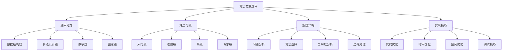

# 算法竞赛题目

## 📖 核心概念

**算法竞赛题目**是数据结构学习的高级实践环节，通过解决具有挑战性的算法问题，提升算法设计能力、代码实现技巧和问题解决思维。这些题目通常来自国际知名竞赛平台，涵盖了数据结构的各种应用场景和高级技巧。

### 🏗️ 竞赛题目的组成要素



## 🔍 题目分类

### 按数据结构分类

| 数据结构 | 典型题目 | 难度 | 核心技巧 | 学习重点 |
|----------|----------|------|----------|----------|
| **数组** | 最大子数组和 | 中等 | 动态规划 | 状态转移 |
| **链表** | 链表反转 | 简单 | 指针操作 | 链表遍历 |
| **栈** | 括号匹配 | 简单 | 栈应用 | 符号处理 |
| **队列** | 滑动窗口最大值 | 困难 | 单调队列 | 窗口维护 |
| **树** | 二叉树遍历 | 中等 | 递归/迭代 | 树遍历 |
| **图** | 最短路径 | 困难 | 图算法 | 路径搜索 |
| **哈希表** | 两数之和 | 简单 | 哈希查找 | 快速查找 |

### 按算法类型分类

| 算法类型 | 典型题目 | 时间复杂度 | 空间复杂度 | 应用场景 |
|----------|----------|------------|------------|----------|
| **排序** | 快速排序 | O(n log n) | O(log n) | 数据排序 |
| **搜索** | 二分搜索 | O(log n) | O(1) | 有序查找 |
| **动态规划** | 背包问题 | O(n×W) | O(n×W) | 最优化问题 |
| **贪心** | 活动选择 | O(n log n) | O(1) | 局部最优 |
| **分治** | 归并排序 | O(n log n) | O(n) | 分而治之 |
| **图论** | 最短路径 | O(V²) | O(V) | 路径优化 |

## 💻 经典竞赛题目

### 数据结构基础题

```cpp
// 题目1：最大子数组和 (Kadane算法)
class MaximumSubarraySum {
public:
    // 基础版本 - 时间复杂度O(n)，空间复杂度O(1)
    int maxSubArray(vector<int>& nums) {
        int maxSum = nums[0];
        int currentSum = nums[0];
        
        for (int i = 1; i < nums.size(); i++) {
            currentSum = max(nums[i], currentSum + nums[i]);
            maxSum = max(maxSum, currentSum);
        }
        
        return maxSum;
    }
    
    // 返回最大子数组的起始和结束位置
    pair<int, int> maxSubArrayWithIndices(vector<int>& nums) {
        int maxSum = nums[0];
        int currentSum = nums[0];
        int start = 0, end = 0, tempStart = 0;
        
        for (int i = 1; i < nums.size(); i++) {
            if (currentSum < 0) {
                currentSum = nums[i];
                tempStart = i;
            } else {
                currentSum += nums[i];
            }
            
            if (currentSum > maxSum) {
                maxSum = currentSum;
                start = tempStart;
                end = i;
            }
        }
        
        return {start, end};
    }
    
    // 分治法版本 - 时间复杂度O(n log n)
    int maxSubArrayDivideConquer(vector<int>& nums) {
        return maxSubArrayHelper(nums, 0, nums.size() - 1);
    }
    
private:
    int maxSubArrayHelper(vector<int>& nums, int left, int right) {
        if (left == right) {
            return nums[left];
        }
        
        int mid = left + (right - left) / 2;
        int leftMax = maxSubArrayHelper(nums, left, mid);
        int rightMax = maxSubArrayHelper(nums, mid + 1, right);
        int crossMax = maxCrossingSum(nums, left, mid, right);
        
        return max({leftMax, rightMax, crossMax});
    }
    
    int maxCrossingSum(vector<int>& nums, int left, int mid, int right) {
        int leftSum = INT_MIN;
        int sum = 0;
        
        for (int i = mid; i >= left; i--) {
            sum += nums[i];
            leftSum = max(leftSum, sum);
        }
        
        int rightSum = INT_MIN;
        sum = 0;
        
        for (int i = mid + 1; i <= right; i++) {
            sum += nums[i];
            rightSum = max(rightSum, sum);
        }
        
        return leftSum + rightSum;
    }
};
```

### 链表操作题

```cpp
// 题目2：链表反转
class LinkedListReversal {
public:
    struct ListNode {
        int val;
        ListNode* next;
        ListNode(int x) : val(x), next(nullptr) {}
    };
    
    // 迭代版本 - 时间复杂度O(n)，空间复杂度O(1)
    ListNode* reverseList(ListNode* head) {
        ListNode* prev = nullptr;
        ListNode* current = head;
        
        while (current != nullptr) {
            ListNode* next = current->next;
            current->next = prev;
            prev = current;
            current = next;
        }
        
        return prev;
    }
    
    // 递归版本 - 时间复杂度O(n)，空间复杂度O(n)
    ListNode* reverseListRecursive(ListNode* head) {
        if (head == nullptr || head->next == nullptr) {
            return head;
        }
        
        ListNode* newHead = reverseListRecursive(head->next);
        head->next->next = head;
        head->next = nullptr;
        
        return newHead;
    }
    
    // 反转链表的一部分 (从位置m到n)
    ListNode* reverseBetween(ListNode* head, int m, int n) {
        if (head == nullptr || m == n) {
            return head;
        }
        
        ListNode* dummy = new ListNode(0);
        dummy->next = head;
        ListNode* prev = dummy;
        
        // 移动到第m个节点的前一个节点
        for (int i = 1; i < m; i++) {
            prev = prev->next;
        }
        
        ListNode* current = prev->next;
        ListNode* next = current->next;
        
        // 反转从m到n的节点
        for (int i = m; i < n; i++) {
            current->next = next->next;
            next->next = prev->next;
            prev->next = next;
            next = current->next;
        }
        
        return dummy->next;
    }
    
    // 每k个节点反转一次
    ListNode* reverseKGroup(ListNode* head, int k) {
        if (head == nullptr || k == 1) {
            return head;
        }
        
        ListNode* dummy = new ListNode(0);
        dummy->next = head;
        ListNode* prev = dummy;
        ListNode* current = head;
        
        int count = 0;
        while (current != nullptr) {
            count++;
            if (count % k == 0) {
                prev = reverseGroup(prev, current->next);
                current = prev->next;
            } else {
                current = current->next;
            }
        }
        
        return dummy->next;
    }
    
private:
    ListNode* reverseGroup(ListNode* prev, ListNode* next) {
        ListNode* last = prev->next;
        ListNode* current = last->next;
        
        while (current != next) {
            last->next = current->next;
            current->next = prev->next;
            prev->next = current;
            current = last->next;
        }
        
        return last;
    }
};
```

### 栈和队列题

```cpp
// 题目3：滑动窗口最大值
class SlidingWindowMaximum {
public:
    // 使用双端队列 - 时间复杂度O(n)，空间复杂度O(k)
    vector<int> maxSlidingWindow(vector<int>& nums, int k) {
        vector<int> result;
        deque<int> dq; // 存储数组下标
        
        for (int i = 0; i < nums.size(); i++) {
            // 移除窗口外的元素
            while (!dq.empty() && dq.front() <= i - k) {
                dq.pop_front();
            }
            
            // 移除比当前元素小的元素
            while (!dq.empty() && nums[dq.back()] <= nums[i]) {
                dq.pop_back();
            }
            
            dq.push_back(i);
            
            // 当窗口大小达到k时，记录最大值
            if (i >= k - 1) {
                result.push_back(nums[dq.front()]);
            }
        }
        
        return result;
    }
    
    // 使用优先队列 - 时间复杂度O(n log n)，空间复杂度O(n)
    vector<int> maxSlidingWindowPQ(vector<int>& nums, int k) {
        vector<int> result;
        priority_queue<pair<int, int>> pq; // {value, index}
        
        for (int i = 0; i < nums.size(); i++) {
            pq.push({nums[i], i});
            
            if (i >= k - 1) {
                // 移除窗口外的元素
                while (!pq.empty() && pq.top().second <= i - k) {
                    pq.pop();
                }
                
                result.push_back(pq.top().first);
            }
        }
        
        return result;
    }
    
    // 使用单调栈 - 时间复杂度O(n)，空间复杂度O(n)
    vector<int> maxSlidingWindowMonotonic(vector<int>& nums, int k) {
        vector<int> result;
        stack<int> st;
        vector<int> nextGreater(nums.size(), -1);
        
        // 找到每个元素的下一个更大元素
        for (int i = 0; i < nums.size(); i++) {
            while (!st.empty() && nums[st.top()] < nums[i]) {
                nextGreater[st.top()] = i;
                st.pop();
            }
            st.push(i);
        }
        
        // 使用nextGreater数组计算滑动窗口最大值
        for (int i = 0; i <= nums.size() - k; i++) {
            int j = i;
            while (nextGreater[j] != -1 && nextGreater[j] < i + k) {
                j = nextGreater[j];
            }
            result.push_back(nums[j]);
        }
        
        return result;
    }
};
```

### 树和图题

```cpp
// 题目4：二叉树的最大路径和
class BinaryTreeMaximumPathSum {
public:
    struct TreeNode {
        int val;
        TreeNode* left;
        TreeNode* right;
        TreeNode(int x) : val(x), left(nullptr), right(nullptr) {}
    };
    
    int maxPathSum(TreeNode* root) {
        int maxSum = INT_MIN;
        maxPathSumHelper(root, maxSum);
        return maxSum;
    }
    
private:
    int maxPathSumHelper(TreeNode* node, int& maxSum) {
        if (node == nullptr) {
            return 0;
        }
        
        // 递归计算左右子树的最大路径和
        int leftSum = max(0, maxPathSumHelper(node->left, maxSum));
        int rightSum = max(0, maxPathSumHelper(node->right, maxSum));
        
        // 计算经过当前节点的最大路径和
        int currentSum = node->val + leftSum + rightSum;
        maxSum = max(maxSum, currentSum);
        
        // 返回从当前节点向下的最大路径和
        return node->val + max(leftSum, rightSum);
    }
};

// 题目5：最短路径算法
class ShortestPath {
public:
    // Dijkstra算法 - 单源最短路径
    vector<int> dijkstra(vector<vector<pair<int, int>>>& graph, int start) {
        int n = graph.size();
        vector<int> dist(n, INT_MAX);
        vector<bool> visited(n, false);
        priority_queue<pair<int, int>, vector<pair<int, int>>, greater<pair<int, int>>> pq;
        
        dist[start] = 0;
        pq.push({0, start});
        
        while (!pq.empty()) {
            int u = pq.top().second;
            pq.pop();
            
            if (visited[u]) continue;
            visited[u] = true;
            
            for (auto& edge : graph[u]) {
                int v = edge.first;
                int weight = edge.second;
                
                if (dist[u] + weight < dist[v]) {
                    dist[v] = dist[u] + weight;
                    pq.push({dist[v], v});
                }
            }
        }
        
        return dist;
    }
    
    // Floyd-Warshall算法 - 所有对最短路径
    vector<vector<int>> floydWarshall(vector<vector<int>>& graph) {
        int n = graph.size();
        vector<vector<int>> dist = graph;
        
        for (int k = 0; k < n; k++) {
            for (int i = 0; i < n; i++) {
                for (int j = 0; j < n; j++) {
                    if (dist[i][k] != INT_MAX && dist[k][j] != INT_MAX) {
                        dist[i][j] = min(dist[i][j], dist[i][k] + dist[k][j]);
                    }
                }
            }
        }
        
        return dist;
    }
    
    // Bellman-Ford算法 - 处理负权边
    vector<int> bellmanFord(vector<vector<pair<int, int>>>& graph, int start) {
        int n = graph.size();
        vector<int> dist(n, INT_MAX);
        dist[start] = 0;
        
        // 松弛操作
        for (int i = 0; i < n - 1; i++) {
            for (int u = 0; u < n; u++) {
                for (auto& edge : graph[u]) {
                    int v = edge.first;
                    int weight = edge.second;
                    
                    if (dist[u] != INT_MAX && dist[u] + weight < dist[v]) {
                        dist[v] = dist[u] + weight;
                    }
                }
            }
        }
        
        // 检测负权环
        for (int u = 0; u < n; u++) {
            for (auto& edge : graph[u]) {
                int v = edge.first;
                int weight = edge.second;
                
                if (dist[u] != INT_MAX && dist[u] + weight < dist[v]) {
                    // 存在负权环
                    return {};
                }
            }
        }
        
        return dist;
    }
};
```

### 动态规划题

```cpp
// 题目6：最长递增子序列
class LongestIncreasingSubsequence {
public:
    // 动态规划版本 - 时间复杂度O(n²)，空间复杂度O(n)
    int lengthOfLIS(vector<int>& nums) {
        int n = nums.size();
        vector<int> dp(n, 1);
        
        for (int i = 1; i < n; i++) {
            for (int j = 0; j < i; j++) {
                if (nums[j] < nums[i]) {
                    dp[i] = max(dp[i], dp[j] + 1);
                }
            }
        }
        
        return *max_element(dp.begin(), dp.end());
    }
    
    // 二分搜索优化版本 - 时间复杂度O(n log n)，空间复杂度O(n)
    int lengthOfLISOptimized(vector<int>& nums) {
        vector<int> tails;
        
        for (int num : nums) {
            auto it = lower_bound(tails.begin(), tails.end(), num);
            if (it == tails.end()) {
                tails.push_back(num);
            } else {
                *it = num;
            }
        }
        
        return tails.size();
    }
    
    // 返回最长递增子序列
    vector<int> getLIS(vector<int>& nums) {
        int n = nums.size();
        vector<int> dp(n, 1);
        vector<int> parent(n, -1);
        
        for (int i = 1; i < n; i++) {
            for (int j = 0; j < i; j++) {
                if (nums[j] < nums[i] && dp[j] + 1 > dp[i]) {
                    dp[i] = dp[j] + 1;
                    parent[i] = j;
                }
            }
        }
        
        int maxLen = *max_element(dp.begin(), dp.end());
        int maxIndex = max_element(dp.begin(), dp.end()) - dp.begin();
        
        vector<int> result;
        while (maxIndex != -1) {
            result.push_back(nums[maxIndex]);
            maxIndex = parent[maxIndex];
        }
        
        reverse(result.begin(), result.end());
        return result;
    }
};

// 题目7：背包问题
class KnapsackProblem {
public:
    // 0-1背包问题 - 时间复杂度O(n×W)，空间复杂度O(n×W)
    int knapsack01(vector<int>& weights, vector<int>& values, int capacity) {
        int n = weights.size();
        vector<vector<int>> dp(n + 1, vector<int>(capacity + 1, 0));
        
        for (int i = 1; i <= n; i++) {
            for (int w = 1; w <= capacity; w++) {
                if (weights[i - 1] <= w) {
                    dp[i][w] = max(dp[i - 1][w], 
                                  dp[i - 1][w - weights[i - 1]] + values[i - 1]);
                } else {
                    dp[i][w] = dp[i - 1][w];
                }
            }
        }
        
        return dp[n][capacity];
    }
    
    // 空间优化版本 - 时间复杂度O(n×W)，空间复杂度O(W)
    int knapsack01Optimized(vector<int>& weights, vector<int>& values, int capacity) {
        vector<int> dp(capacity + 1, 0);
        
        for (int i = 0; i < weights.size(); i++) {
            for (int w = capacity; w >= weights[i]; w--) {
                dp[w] = max(dp[w], dp[w - weights[i]] + values[i]);
            }
        }
        
        return dp[capacity];
    }
    
    // 完全背包问题 - 时间复杂度O(n×W)，空间复杂度O(W)
    int knapsackComplete(vector<int>& weights, vector<int>& values, int capacity) {
        vector<int> dp(capacity + 1, 0);
        
        for (int i = 0; i < weights.size(); i++) {
            for (int w = weights[i]; w <= capacity; w++) {
                dp[w] = max(dp[w], dp[w - weights[i]] + values[i]);
            }
        }
        
        return dp[capacity];
    }
    
    // 多重背包问题 - 时间复杂度O(n×W×k)，空间复杂度O(W)
    int knapsackMultiple(vector<int>& weights, vector<int>& values, 
                         vector<int>& counts, int capacity) {
        vector<int> dp(capacity + 1, 0);
        
        for (int i = 0; i < weights.size(); i++) {
            int weight = weights[i];
            int value = values[i];
            int count = counts[i];
            
            // 二进制优化
            for (int k = 1; k <= count; k *= 2) {
                int w = weight * k;
                int v = value * k;
                
                for (int j = capacity; j >= w; j--) {
                    dp[j] = max(dp[j], dp[j - w] + v);
                }
                
                count -= k;
            }
            
            if (count > 0) {
                int w = weight * count;
                int v = value * count;
                
                for (int j = capacity; j >= w; j--) {
                    dp[j] = max(dp[j], dp[j - w] + v);
                }
            }
        }
        
        return dp[capacity];
    }
};
```

## 🎯 解题策略

### 问题分析框架

```cpp
class ProblemAnalyzer {
public:
    struct ProblemAnalysis {
        string problemType;
        string dataStructure;
        string algorithm;
        int timeComplexity;
        int spaceComplexity;
        vector<string> keyInsights;
        vector<string> edgeCases;
        
        ProblemAnalysis() : timeComplexity(0), spaceComplexity(0) {}
    };
    
    // 分析问题类型
    ProblemAnalysis analyzeProblem(const string& problemDescription) {
        ProblemAnalysis analysis;
        
        // 识别问题类型
        if (problemDescription.find("最大") != string::npos || 
            problemDescription.find("最长") != string::npos) {
            analysis.problemType = "optimization";
        } else if (problemDescription.find("搜索") != string::npos ||
                   problemDescription.find("查找") != string::npos) {
            analysis.problemType = "search";
        } else if (problemDescription.find("排序") != string::npos) {
            analysis.problemType = "sorting";
        } else if (problemDescription.find("路径") != string::npos) {
            analysis.problemType = "pathfinding";
        }
        
        // 识别数据结构
        if (problemDescription.find("数组") != string::npos) {
            analysis.dataStructure = "array";
        } else if (problemDescription.find("链表") != string::npos) {
            analysis.dataStructure = "linkedlist";
        } else if (problemDescription.find("树") != string::npos) {
            analysis.dataStructure = "tree";
        } else if (problemDescription.find("图") != string::npos) {
            analysis.dataStructure = "graph";
        }
        
        // 识别算法
        if (problemDescription.find("动态规划") != string::npos) {
            analysis.algorithm = "dp";
        } else if (problemDescription.find("贪心") != string::npos) {
            analysis.algorithm = "greedy";
        } else if (problemDescription.find("分治") != string::npos) {
            analysis.algorithm = "divide_conquer";
        } else if (problemDescription.find("回溯") != string::npos) {
            analysis.algorithm = "backtracking";
        }
        
        return analysis;
    }
    
    // 生成解题思路
    vector<string> generateSolutionIdeas(const ProblemAnalysis& analysis) {
        vector<string> ideas;
        
        if (analysis.problemType == "optimization") {
            ideas.push_back("考虑动态规划或贪心算法");
            ideas.push_back("分析最优子结构");
            ideas.push_back("确定状态转移方程");
        } else if (analysis.problemType == "search") {
            ideas.push_back("考虑二分搜索或哈希表");
            ideas.push_back("分析搜索空间");
            ideas.push_back("优化搜索策略");
        } else if (analysis.problemType == "pathfinding") {
            ideas.push_back("考虑图算法");
            ideas.push_back("分析图的表示方法");
            ideas.push_back("选择合适的路径算法");
        }
        
        return ideas;
    }
    
    // 识别边界情况
    vector<string> identifyEdgeCases(const string& problemDescription) {
        vector<string> edgeCases;
        
        if (problemDescription.find("数组") != string::npos) {
            edgeCases.push_back("空数组");
            edgeCases.push_back("单元素数组");
            edgeCases.push_back("全相同元素");
        }
        
        if (problemDescription.find("树") != string::npos) {
            edgeCases.push_back("空树");
            edgeCases.push_back("单节点树");
            edgeCases.push_back("退化为链表");
        }
        
        if (problemDescription.find("图") != string::npos) {
            edgeCases.push_back("空图");
            edgeCases.push_back("单节点图");
            edgeCases.push_back("不连通图");
        }
        
        return edgeCases;
    }
};
```

### 代码优化技巧

```cpp
class CodeOptimizer {
public:
    // 时间优化技巧
    struct TimeOptimization {
        string technique;
        string description;
        int improvementFactor;
        
        TimeOptimization(const string& t, const string& d, int factor)
            : technique(t), description(d), improvementFactor(factor) {}
    };
    
    vector<TimeOptimization> getTimeOptimizations() {
        return {
            {"哈希表", "用哈希表替代线性搜索", 10},
            {"二分搜索", "在有序数据中使用二分搜索", 100},
            {"双指针", "使用双指针技术", 2},
            {"滑动窗口", "使用滑动窗口技术", 5},
            {"预处理", "预处理数据减少重复计算", 3},
            {"记忆化", "使用记忆化避免重复计算", 100}
        };
    }
    
    // 空间优化技巧
    struct SpaceOptimization {
        string technique;
        string description;
        int spaceReduction;
        
        SpaceOptimization(const string& t, const string& d, int reduction)
            : technique(t), description(d), spaceReduction(reduction) {}
    };
    
    vector<SpaceOptimization> getSpaceOptimizations() {
        return {
            {"原地算法", "在原数组上进行操作", 50},
            {"滚动数组", "使用滚动数组技术", 50},
            {"位运算", "使用位运算压缩状态", 75},
            {"压缩存储", "压缩数据存储格式", 60},
            {"延迟计算", "延迟计算减少存储", 40}
        };
    }
    
    // 代码优化建议
    vector<string> getOptimizationSuggestions(const string& problemType) {
        vector<string> suggestions;
        
        if (problemType == "array") {
            suggestions.push_back("考虑使用双指针技术");
            suggestions.push_back("利用数组的有序性");
            suggestions.push_back("考虑滑动窗口");
        } else if (problemType == "tree") {
            suggestions.push_back("考虑递归和迭代两种方法");
            suggestions.push_back("利用树的特性");
            suggestions.push_back("考虑Morris遍历");
        } else if (problemType == "graph") {
            suggestions.push_back("选择合适的图表示方法");
            suggestions.push_back("考虑图的连通性");
            suggestions.push_back("使用适当的图算法");
        }
        
        return suggestions;
    }
};
```

## ⚡ 复杂度分析

### 竞赛题目复杂度

| 题目类型 | 时间复杂度 | 空间复杂度 | 优化策略 | 常见陷阱 |
|----------|------------|------------|----------|----------|
| **数组题** | O(n) - O(n²) | O(1) - O(n) | 双指针、哈希表 | 边界处理 |
| **链表题** | O(n) | O(1) - O(n) | 快慢指针 | 指针操作 |
| **树题** | O(n) - O(n²) | O(log n) - O(n) | 递归优化 | 栈溢出 |
| **图题** | O(V+E) - O(V²) | O(V) - O(V²) | 算法选择 | 内存限制 |
| **DP题** | O(n×W) | O(n×W) | 空间优化 | 状态设计 |

### 性能优化策略

| 优化类型 | 适用场景 | 优化效果 | 实现难度 | 注意事项 |
|----------|----------|----------|----------|----------|
| **算法优化** | 所有场景 | 显著 | 困难 | 正确性验证 |
| **数据结构优化** | 特定场景 | 明显 | 中等 | 复杂度分析 |
| **代码优化** | 局部优化 | 有限 | 简单 | 可读性保持 |
| **系统优化** | 整体优化 | 显著 | 复杂 | 系统影响 |

## 🎓 学习要点总结

### 核心理解

1. **问题分析**：掌握问题分析的方法和技巧
2. **算法选择**：学会选择合适的算法解决问题
3. **代码实现**：掌握高效的代码实现技巧
4. **优化策略**：理解各种优化策略的应用

### 实践要点

1. **题目练习**：大量练习各种类型的题目
2. **代码优化**：不断优化代码的性能
3. **边界处理**：注意各种边界情况的处理
4. **调试技巧**：掌握高效的调试方法

### 应用思维

1. **问题分解**：将复杂问题分解为简单问题
2. **模式识别**：识别问题的模式和规律
3. **算法思维**：培养算法设计的思维方式
4. **持续改进**：不断改进解题方法和技巧

---

**相关链接：**
- [[07-练习战场/02-算法挑战/01-LeetCode经典题目|LeetCode经典题目]] - 经典算法题目
- [[07-练习战场/01-代码实现/02-算法实现练习|算法实现练习]] - 算法实现基础
- [[07-练习战场/01-代码实现/03-性能测试与优化|性能测试与优化]] - 性能优化技巧
- [[04-算法武器库/01-搜索技术|搜索技术]] - 搜索算法基础
