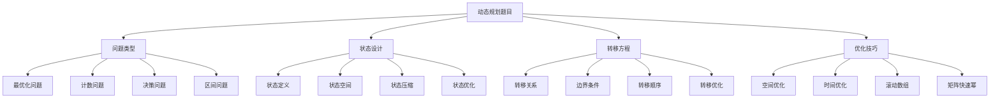

# 动态规划题目

## 📖 核心概念

**动态规划题目**是算法竞赛和面试中的重点题型，通过将复杂问题分解为子问题，利用最优子结构和重叠子问题的特性，实现高效的问题求解。动态规划题目涵盖了最优化、计数、决策等多个领域，是算法能力的重要体现。

### 🏗️ 动态规划题目的组成要素



## 🔍 动态规划题目分类

### 问题类型

| 类型 | 特点 | 典型题目 | 难度 | 适用场景 |
|------|------|----------|------|----------|
| **最优化** | 求最优解 | 背包问题、最长子序列 | 中等 | 决策问题 |
| **计数** | 求方案数 | 路径计数、组合计数 | 中等 | 组合数学 |
| **决策** | 求决策序列 | 游戏问题、博弈论 | 困难 | 策略问题 |
| **区间** | 区间DP | 矩阵链乘、回文串 | 困难 | 区间问题 |

### 难度分级

| 难度 | 特点 | 典型题目 | 学习重点 | 适用人群 |
|------|------|----------|----------|----------|
| **入门** | 基础DP | 斐波那契、爬楼梯 | 状态设计 | 初学者 |
| **进阶** | 复杂DP | 背包问题、LCS | 转移方程 | 有基础者 |
| **高级** | 高级DP | 区间DP、树形DP | 优化技巧 | 进阶者 |
| **专家** | 专家级DP | 数位DP、概率DP | 综合应用 | 专家级 |

## 💻 动态规划题目实现

### 基础动态规划题目

```cpp
// 基础动态规划题目
class BasicDPProblems {
public:
    // 1. 斐波那契数列
    static long long fibonacci(int n) {
        if (n <= 1) return n;
        
        vector<long long> dp(n + 1);
        dp[0] = 0;
        dp[1] = 1;
        
        for (int i = 2; i <= n; i++) {
            dp[i] = dp[i-1] + dp[i-2];
        }
        
        return dp[n];
    }
    
    // 2. 爬楼梯
    static int climbStairs(int n) {
        if (n <= 2) return n;
        
        vector<int> dp(n + 1);
        dp[1] = 1;
        dp[2] = 2;
        
        for (int i = 3; i <= n; i++) {
            dp[i] = dp[i-1] + dp[i-2];
        }
        
        return dp[n];
    }
    
    // 3. 最小路径和
    static int minPathSum(vector<vector<int>>& grid) {
        int m = grid.size();
        int n = grid[0].size();
        
        vector<vector<int>> dp(m, vector<int>(n));
        dp[0][0] = grid[0][0];
        
        // 初始化第一行
        for (int j = 1; j < n; j++) {
            dp[0][j] = dp[0][j-1] + grid[0][j];
        }
        
        // 初始化第一列
        for (int i = 1; i < m; i++) {
            dp[i][0] = dp[i-1][0] + grid[i][0];
        }
        
        // 填充DP表
        for (int i = 1; i < m; i++) {
            for (int j = 1; j < n; j++) {
                dp[i][j] = min(dp[i-1][j], dp[i][j-1]) + grid[i][j];
            }
        }
        
        return dp[m-1][n-1];
    }
    
    // 4. 最长递增子序列
    static int lengthOfLIS(vector<int>& nums) {
        int n = nums.size();
        vector<int> dp(n, 1);
        
        for (int i = 1; i < n; i++) {
            for (int j = 0; j < i; j++) {
                if (nums[j] < nums[i]) {
                    dp[i] = max(dp[i], dp[j] + 1);
                }
            }
        }
        
        return *max_element(dp.begin(), dp.end());
    }
    
    // 5. 最长公共子序列
    static int longestCommonSubsequence(string text1, string text2) {
        int m = text1.length();
        int n = text2.length();
        
        vector<vector<int>> dp(m + 1, vector<int>(n + 1, 0));
        
        for (int i = 1; i <= m; i++) {
            for (int j = 1; j <= n; j++) {
                if (text1[i-1] == text2[j-1]) {
                    dp[i][j] = dp[i-1][j-1] + 1;
                } else {
                    dp[i][j] = max(dp[i-1][j], dp[i][j-1]);
                }
            }
        }
        
        return dp[m][n];
    }
};
```

### 背包问题

```cpp
// 背包问题
class KnapsackProblems {
public:
    // 1. 0-1背包问题
    static int knapsack01(vector<int>& weights, vector<int>& values, int capacity) {
        int n = weights.size();
        vector<vector<int>> dp(n + 1, vector<int>(capacity + 1, 0));
        
        for (int i = 1; i <= n; i++) {
            for (int w = 1; w <= capacity; w++) {
                if (weights[i-1] <= w) {
                    dp[i][w] = max(dp[i-1][w], dp[i-1][w-weights[i-1]] + values[i-1]);
                } else {
                    dp[i][w] = dp[i-1][w];
                }
            }
        }
        
        return dp[n][capacity];
    }
    
    // 2. 完全背包问题
    static int knapsackComplete(vector<int>& weights, vector<int>& values, int capacity) {
        int n = weights.size();
        vector<vector<int>> dp(n + 1, vector<int>(capacity + 1, 0));
        
        for (int i = 1; i <= n; i++) {
            for (int w = 1; w <= capacity; w++) {
                if (weights[i-1] <= w) {
                    dp[i][w] = max(dp[i-1][w], dp[i][w-weights[i-1]] + values[i-1]);
                } else {
                    dp[i][w] = dp[i-1][w];
                }
            }
        }
        
        return dp[n][capacity];
    }
    
    // 3. 多重背包问题
    static int knapsackMultiple(vector<int>& weights, vector<int>& values, vector<int>& counts, int capacity) {
        int n = weights.size();
        vector<vector<int>> dp(n + 1, vector<int>(capacity + 1, 0));
        
        for (int i = 1; i <= n; i++) {
            for (int w = 1; w <= capacity; w++) {
                dp[i][w] = dp[i-1][w];
                
                for (int k = 1; k <= counts[i-1]; k++) {
                    if (k * weights[i-1] <= w) {
                        dp[i][w] = max(dp[i][w], dp[i-1][w-k*weights[i-1]] + k*values[i-1]);
                    }
                }
            }
        }
        
        return dp[n][capacity];
    }
    
    // 4. 分组背包问题
    static int knapsackGroup(vector<vector<int>>& weights, vector<vector<int>>& values, int capacity) {
        int groups = weights.size();
        vector<int> dp(capacity + 1, 0);
        
        for (int g = 0; g < groups; g++) {
            for (int w = capacity; w >= 0; w--) {
                for (int i = 0; i < weights[g].size(); i++) {
                    if (weights[g][i] <= w) {
                        dp[w] = max(dp[w], dp[w-weights[g][i]] + values[g][i]);
                    }
                }
            }
        }
        
        return dp[capacity];
    }
    
    // 5. 背包问题空间优化
    static int knapsack01Optimized(vector<int>& weights, vector<int>& values, int capacity) {
        int n = weights.size();
        vector<int> dp(capacity + 1, 0);
        
        for (int i = 0; i < n; i++) {
            for (int w = capacity; w >= weights[i]; w--) {
                dp[w] = max(dp[w], dp[w-weights[i]] + values[i]);
            }
        }
        
        return dp[capacity];
    }
};
```

### 区间动态规划

```cpp
// 区间动态规划
class IntervalDP {
public:
    // 1. 矩阵链乘法
    static int matrixChainMultiplication(vector<int>& dimensions) {
        int n = dimensions.size() - 1;
        vector<vector<int>> dp(n, vector<int>(n, 0));
        
        // 填充DP表
        for (int length = 2; length <= n; length++) {
            for (int i = 0; i <= n - length; i++) {
                int j = i + length - 1;
                dp[i][j] = INT_MAX;
                
                for (int k = i; k < j; k++) {
                    int cost = dp[i][k] + dp[k+1][j] + 
                              dimensions[i] * dimensions[k+1] * dimensions[j+1];
                    dp[i][j] = min(dp[i][j], cost);
                }
            }
        }
        
        return dp[0][n-1];
    }
    
    // 2. 最长回文子序列
    static int longestPalindromeSubsequence(string s) {
        int n = s.length();
        vector<vector<int>> dp(n, vector<int>(n, 0));
        
        // 单个字符
        for (int i = 0; i < n; i++) {
            dp[i][i] = 1;
        }
        
        // 填充DP表
        for (int length = 2; length <= n; length++) {
            for (int i = 0; i <= n - length; i++) {
                int j = i + length - 1;
                
                if (s[i] == s[j]) {
                    dp[i][j] = dp[i+1][j-1] + 2;
                } else {
                    dp[i][j] = max(dp[i+1][j], dp[i][j-1]);
                }
            }
        }
        
        return dp[0][n-1];
    }
    
    // 3. 最长回文子串
    static string longestPalindromeSubstring(string s) {
        int n = s.length();
        vector<vector<bool>> dp(n, vector<bool>(n, false));
        int start = 0, maxLen = 1;
        
        // 单个字符
        for (int i = 0; i < n; i++) {
            dp[i][i] = true;
        }
        
        // 两个字符
        for (int i = 0; i < n - 1; i++) {
            if (s[i] == s[i+1]) {
                dp[i][i+1] = true;
                start = i;
                maxLen = 2;
            }
        }
        
        // 填充DP表
        for (int length = 3; length <= n; length++) {
            for (int i = 0; i <= n - length; i++) {
                int j = i + length - 1;
                
                if (s[i] == s[j] && dp[i+1][j-1]) {
                    dp[i][j] = true;
                    start = i;
                    maxLen = length;
                }
            }
        }
        
        return s.substr(start, maxLen);
    }
    
    // 4. 石子合并
    static int stoneMerge(vector<int>& stones) {
        int n = stones.size();
        vector<int> prefixSum(n + 1, 0);
        
        // 计算前缀和
        for (int i = 0; i < n; i++) {
            prefixSum[i + 1] = prefixSum[i] + stones[i];
        }
        
        vector<vector<int>> dp(n, vector<int>(n, 0));
        
        // 填充DP表
        for (int length = 2; length <= n; length++) {
            for (int i = 0; i <= n - length; i++) {
                int j = i + length - 1;
                dp[i][j] = INT_MAX;
                
                for (int k = i; k < j; k++) {
                    int cost = dp[i][k] + dp[k+1][j] + 
                              prefixSum[j+1] - prefixSum[i];
                    dp[i][j] = min(dp[i][j], cost);
                }
            }
        }
        
        return dp[0][n-1];
    }
};
```

### 树形动态规划

```cpp
// 树形动态规划
class TreeDP {
private:
    struct TreeNode {
        int val;
        vector<TreeNode*> children;
        
        TreeNode(int v) : val(v) {}
    };
    
public:
    // 1. 树的最大独立集
    static int maxIndependentSet(TreeNode* root) {
        if (!root) return 0;
        
        // dp[0] 表示不选择当前节点
        // dp[1] 表示选择当前节点
        vector<int> dp = dfsIndependentSet(root);
        return max(dp[0], dp[1]);
    }
    
private:
    static vector<int> dfsIndependentSet(TreeNode* node) {
        vector<int> dp(2, 0);
        
        for (TreeNode* child : node->children) {
            vector<int> childDp = dfsIndependentSet(child);
            dp[0] += max(childDp[0], childDp[1]);
            dp[1] += childDp[0];
        }
        
        dp[1] += node->val;
        return dp;
    }
    
public:
    // 2. 树的最大路径和
    static int maxPathSum(TreeNode* root) {
        if (!root) return 0;
        
        int maxSum = INT_MIN;
        dfsMaxPathSum(root, maxSum);
        return maxSum;
    }
    
private:
    static int dfsMaxPathSum(TreeNode* node, int& maxSum) {
        if (!node) return 0;
        
        int leftSum = max(0, dfsMaxPathSum(node->children[0], maxSum));
        int rightSum = max(0, dfsMaxPathSum(node->children[1], maxSum));
        
        int currentSum = node->val + leftSum + rightSum;
        maxSum = max(maxSum, currentSum);
        
        return node->val + max(leftSum, rightSum);
    }
    
public:
    // 3. 树的最小路径覆盖
    static int minPathCover(TreeNode* root) {
        if (!root) return 0;
        
        vector<int> dp = dfsMinPathCover(root);
        return min(dp[0], dp[1]);
    }
    
private:
    static vector<int> dfsMinPathCover(TreeNode* node) {
        vector<int> dp(2, 0);
        
        for (TreeNode* child : node->children) {
            vector<int> childDp = dfsMinPathCover(child);
            dp[0] += childDp[1];
            dp[1] += min(childDp[0], childDp[1]);
        }
        
        dp[1] += 1;
        return dp;
    }
};
```

### 数位动态规划

```cpp
// 数位动态规划
class DigitDP {
public:
    // 1. 数字1的个数
    static int countDigitOne(int n) {
        string s = to_string(n);
        int len = s.length();
        vector<vector<int>> dp(len, vector<int>(2, -1));
        
        return dfsCountDigitOne(s, 0, 0, true, dp);
    }
    
private:
    static int dfsCountDigitOne(string& s, int pos, int count, bool isLimit, vector<vector<int>>& dp) {
        if (pos == s.length()) {
            return count;
        }
        
        if (!isLimit && dp[pos][count] != -1) {
            return dp[pos][count];
        }
        
        int limit = isLimit ? s[pos] - '0' : 9;
        int result = 0;
        
        for (int digit = 0; digit <= limit; digit++) {
            int newCount = count + (digit == 1 ? 1 : 0);
            result += dfsCountDigitOne(s, pos + 1, newCount, isLimit && digit == limit, dp);
        }
        
        if (!isLimit) {
            dp[pos][count] = result;
        }
        
        return result;
    }
    
public:
    // 2. 不含连续1的非负整数个数
    static int countNonConsecutiveOnes(int n) {
        string s = to_string(n);
        int len = s.length();
        vector<vector<vector<int>>> dp(len, vector<vector<int>>(2, vector<int>(2, -1)));
        
        return dfsCountNonConsecutiveOnes(s, 0, 0, true, true, dp);
    }
    
private:
    static int dfsCountNonConsecutiveOnes(string& s, int pos, int lastDigit, bool isLimit, bool isStart, vector<vector<vector<int>>>& dp) {
        if (pos == s.length()) {
            return 1;
        }
        
        if (!isLimit && !isStart && dp[pos][lastDigit][0] != -1) {
            return dp[pos][lastDigit][0];
        }
        
        int limit = isLimit ? s[pos] - '0' : 9;
        int result = 0;
        
        for (int digit = 0; digit <= limit; digit++) {
            if (isStart && digit == 0) {
                result += dfsCountNonConsecutiveOnes(s, pos + 1, 0, isLimit && digit == limit, true, dp);
            } else {
                if (lastDigit == 1 && digit == 1) {
                    continue;
                }
                result += dfsCountNonConsecutiveOnes(s, pos + 1, digit, isLimit && digit == limit, false, dp);
            }
        }
        
        if (!isLimit && !isStart) {
            dp[pos][lastDigit][0] = result;
        }
        
        return result;
    }
    
public:
    // 3. 数字和为K的个数
    static int countNumbersWithSum(int n, int k) {
        string s = to_string(n);
        int len = s.length();
        vector<vector<vector<int>>> dp(len, vector<vector<int>>(k + 1, vector<int>(2, -1)));
        
        return dfsCountNumbersWithSum(s, 0, k, true, true, dp);
    }
    
private:
    static int dfsCountNumbersWithSum(string& s, int pos, int remainingSum, bool isLimit, bool isStart, vector<vector<vector<int>>>& dp) {
        if (pos == s.length()) {
            return remainingSum == 0 ? 1 : 0;
        }
        
        if (remainingSum < 0) {
            return 0;
        }
        
        if (!isLimit && !isStart && dp[pos][remainingSum][0] != -1) {
            return dp[pos][remainingSum][0];
        }
        
        int limit = isLimit ? s[pos] - '0' : 9;
        int result = 0;
        
        for (int digit = 0; digit <= limit; digit++) {
            if (isStart && digit == 0) {
                result += dfsCountNumbersWithSum(s, pos + 1, remainingSum, isLimit && digit == limit, true, dp);
            } else {
                result += dfsCountNumbersWithSum(s, pos + 1, remainingSum - digit, isLimit && digit == limit, false, dp);
            }
        }
        
        if (!isLimit && !isStart) {
            dp[pos][remainingSum][0] = result;
        }
        
        return result;
    }
};
```

### 动态规划优化技巧

```cpp
// 动态规划优化技巧
class DPOptimization {
public:
    // 1. 滚动数组优化
    static int fibonacciOptimized(int n) {
        if (n <= 1) return n;
        
        int prev2 = 0, prev1 = 1;
        for (int i = 2; i <= n; i++) {
            int current = prev1 + prev2;
            prev2 = prev1;
            prev1 = current;
        }
        
        return prev1;
    }
    
    // 2. 矩阵快速幂优化
    static long long fibonacciMatrix(int n) {
        if (n <= 1) return n;
        
        vector<vector<long long>> base = {{1, 1}, {1, 0}};
        vector<vector<long long>> result = matrixPower(base, n - 1);
        
        return result[0][0];
    }
    
private:
    static vector<vector<long long>> matrixPower(vector<vector<long long>>& base, int power) {
        int n = base.size();
        vector<vector<long long>> result(n, vector<long long>(n, 0));
        
        // 初始化单位矩阵
        for (int i = 0; i < n; i++) {
            result[i][i] = 1;
        }
        
        while (power > 0) {
            if (power & 1) {
                result = matrixMultiply(result, base);
            }
            base = matrixMultiply(base, base);
            power >>= 1;
        }
        
        return result;
    }
    
    static vector<vector<long long>> matrixMultiply(vector<vector<long long>>& a, vector<vector<long long>>& b) {
        int n = a.size();
        vector<vector<long long>> result(n, vector<long long>(n, 0));
        
        for (int i = 0; i < n; i++) {
            for (int j = 0; j < n; j++) {
                for (int k = 0; k < n; k++) {
                    result[i][j] += a[i][k] * b[k][j];
                }
            }
        }
        
        return result;
    }
    
public:
    // 3. 状态压缩优化
    static int tspStateCompression(vector<vector<int>>& graph) {
        int n = graph.size();
        int stateCount = 1 << n;
        vector<vector<int>> dp(stateCount, vector<int>(n, INT_MAX));
        
        dp[1][0] = 0; // 从城市0开始
        
        for (int state = 1; state < stateCount; state++) {
            for (int u = 0; u < n; u++) {
                if (!(state & (1 << u))) continue;
                
                for (int v = 0; v < n; v++) {
                    if (state & (1 << v)) continue;
                    
                    int newState = state | (1 << v);
                    dp[newState][v] = min(dp[newState][v], dp[state][u] + graph[u][v]);
                }
            }
        }
        
        int result = INT_MAX;
        for (int i = 1; i < n; i++) {
            result = min(result, dp[stateCount - 1][i] + graph[i][0]);
        }
        
        return result;
    }
    
    // 4. 单调队列优化
    static int maxSlidingWindow(vector<int>& nums, int k) {
        deque<int> dq;
        vector<int> result;
        
        for (int i = 0; i < nums.size(); i++) {
            // 移除超出窗口的元素
            while (!dq.empty() && dq.front() <= i - k) {
                dq.pop_front();
            }
            
            // 移除比当前元素小的元素
            while (!dq.empty() && nums[dq.back()] < nums[i]) {
                dq.pop_back();
            }
            
            dq.push_back(i);
            
            if (i >= k - 1) {
                result.push_back(nums[dq.front()]);
            }
        }
        
        return result.size();
    }
};
```

### 动态规划题目测试

```cpp
// 动态规划题目测试
class DPProblemTest {
public:
    static void testBasicDP() {
        cout << "=== Testing Basic DP Problems ===" << endl;
        
        // 测试斐波那契
        cout << "Fibonacci(10): " << BasicDPProblems::fibonacci(10) << endl;
        
        // 测试爬楼梯
        cout << "Climb stairs(5): " << BasicDPProblems::climbStairs(5) << endl;
        
        // 测试最长递增子序列
        vector<int> nums = {10, 9, 2, 5, 3, 7, 101, 18};
        cout << "LIS length: " << BasicDPProblems::lengthOfLIS(nums) << endl;
        
        // 测试最长公共子序列
        string text1 = "abcde", text2 = "ace";
        cout << "LCS length: " << BasicDPProblems::longestCommonSubsequence(text1, text2) << endl;
    }
    
    static void testKnapsackProblems() {
        cout << "\n=== Testing Knapsack Problems ===" << endl;
        
        vector<int> weights = {2, 3, 4, 5};
        vector<int> values = {3, 4, 5, 6};
        int capacity = 8;
        
        cout << "0-1 Knapsack: " << KnapsackProblems::knapsack01(weights, values, capacity) << endl;
        cout << "Complete Knapsack: " << KnapsackProblems::knapsackComplete(weights, values, capacity) << endl;
        
        vector<int> counts = {1, 2, 1, 1};
        cout << "Multiple Knapsack: " << KnapsackProblems::knapsackMultiple(weights, values, counts, capacity) << endl;
    }
    
    static void testIntervalDP() {
        cout << "\n=== Testing Interval DP ===" << endl;
        
        // 测试矩阵链乘法
        vector<int> dimensions = {1, 2, 3, 4, 5};
        cout << "Matrix chain multiplication: " << IntervalDP::matrixChainMultiplication(dimensions) << endl;
        
        // 测试最长回文子序列
        string s = "bbbab";
        cout << "Longest palindrome subsequence: " << IntervalDP::longestPalindromeSubsequence(s) << endl;
        
        // 测试最长回文子串
        string s2 = "babad";
        cout << "Longest palindrome substring: " << IntervalDP::longestPalindromeSubstring(s2) << endl;
    }
    
    static void testDigitDP() {
        cout << "\n=== Testing Digit DP ===" << endl;
        
        cout << "Count digit one(13): " << DigitDP::countDigitOne(13) << endl;
        cout << "Count non-consecutive ones(5): " << DigitDP::countNonConsecutiveOnes(5) << endl;
        cout << "Count numbers with sum(20, 5): " << DigitDP::countNumbersWithSum(20, 5) << endl;
    }
    
    static void testOptimization() {
        cout << "\n=== Testing DP Optimization ===" << endl;
        
        cout << "Fibonacci optimized(40): " << DPOptimization::fibonacciOptimized(40) << endl;
        cout << "Fibonacci matrix(40): " << DPOptimization::fibonacciMatrix(40) << endl;
        
        vector<int> nums = {1, 3, -1, -3, 5, 3, 6, 7};
        cout << "Max sliding window: " << DPOptimization::maxSlidingWindow(nums, 3) << endl;
    }
    
    static void runAllTests() {
        testBasicDP();
        testKnapsackProblems();
        testIntervalDP();
        testDigitDP();
        testOptimization();
    }
};
```

## ⚡ 复杂度分析

### 动态规划复杂度

| 问题类型 | 时间复杂度 | 空间复杂度 | 优化后时间复杂度 | 优化后空间复杂度 |
|----------|------------|------------|------------------|------------------|
| **基础DP** | O(n) | O(n) | O(n) | O(1) |
| **背包问题** | O(n×W) | O(n×W) | O(n×W) | O(W) |
| **区间DP** | O(n³) | O(n²) | O(n³) | O(n²) |
| **树形DP** | O(n) | O(n) | O(n) | O(1) |

### 优化技巧效果

| 优化技巧 | 适用场景 | 优化效果 | 实现难度 | 维护成本 |
|----------|----------|----------|----------|----------|
| **滚动数组** | 线性DP | 显著 | 简单 | 低 |
| **矩阵快速幂** | 递推关系 | 显著 | 中等 | 中等 |
| **状态压缩** | 状态空间小 | 显著 | 困难 | 高 |
| **单调队列** | 滑动窗口 | 显著 | 困难 | 高 |

## 🎓 学习要点总结

### 核心理解

1. **状态设计**：理解状态的定义和设计
2. **转移方程**：掌握状态转移的规律
3. **边界条件**：理解边界条件的设置
4. **优化技巧**：掌握各种优化方法

### 实践要点

1. **问题分析**：分析问题的DP特性
2. **状态设计**：设计合适的状态
3. **转移方程**：推导转移方程
4. **代码实现**：实现DP算法

### 应用思维

1. **问题识别**：识别DP问题
2. **状态设计**：设计状态表示
3. **转移推导**：推导转移关系
4. **优化应用**：应用优化技巧

---

**相关链接：**
- [[04-算法武器库/04-动态规划|动态规划]] - 动态规划基础
- [[07-练习战场/02-算法挑战/01-LeetCode经典题目|LeetCode经典题目]] - 算法题目
- [[07-练习战场/02-算法挑战/02-算法竞赛题目|算法竞赛题目]] - 竞赛题目
- [[07-练习战场/03-项目实战/01-数据结构项目|数据结构项目]] - 项目实战
