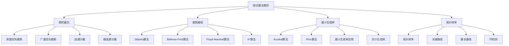

# 图论算法题目

## 📖 核心概念

**图论算法题目**是数据结构与算法学习中的重要组成部分，涉及图的遍历、最短路径、最小生成树、拓扑排序等经典算法。通过解决图论算法题目，可以深入理解图的结构和性质，掌握各种图算法的实现和应用。

### 🏗️ 图论算法题目的组成要素



## 🔍 图论算法题目分类

### 题目难度分类

| 难度等级 | 题目特点 | 算法要求 | 时间复杂度 | 适用场景 |
|----------|----------|----------|------------|----------|
| **简单** | 基础遍历 | DFS/BFS | O(V+E) | 入门练习 |
| **中等** | 路径问题 | 最短路径算法 | O(V²) | 实际应用 |
| **困难** | 复杂图论 | 高级算法 | O(V³) | 算法竞赛 |

## 💻 图论算法题目实现

### 图的遍历题目

```cpp
// 图的遍历题目
class GraphTraversalProblems {
public:
    // 题目1：岛屿数量
    // 给定一个由'1'（陆地）和'0'（水）组成的二维网格，计算岛屿的数量
    int numIslands(vector<vector<char>>& grid) {
        if (grid.empty() || grid[0].empty()) return 0;
        
        int m = grid.size();
        int n = grid[0].size();
        int count = 0;
        
        for (int i = 0; i < m; i++) {
            for (int j = 0; j < n; j++) {
                if (grid[i][j] == '1') {
                    dfs(grid, i, j);
                    count++;
                }
            }
        }
        
        return count;
    }
    
private:
    void dfs(vector<vector<char>>& grid, int i, int j) {
        if (i < 0 || i >= grid.size() || j < 0 || j >= grid[0].size() || grid[i][j] != '1') {
            return;
        }
        
        grid[i][j] = '0'; // 标记为已访问
        
        // 四个方向递归
        dfs(grid, i + 1, j);
        dfs(grid, i - 1, j);
        dfs(grid, i, j + 1);
        dfs(grid, i, j - 1);
    }
    
public:
    // 题目2：课程表
    // 判断是否可以完成所有课程的学习
    bool canFinish(int numCourses, vector<vector<int>>& prerequisites) {
        vector<vector<int>> graph(numCourses);
        vector<int> inDegree(numCourses, 0);
        
        // 构建图和入度
        for (const auto& edge : prerequisites) {
            graph[edge[1]].push_back(edge[0]);
            inDegree[edge[0]]++;
        }
        
        // 拓扑排序
        queue<int> q;
        for (int i = 0; i < numCourses; i++) {
            if (inDegree[i] == 0) {
                q.push(i);
            }
        }
        
        int count = 0;
        while (!q.empty()) {
            int course = q.front();
            q.pop();
            count++;
            
            for (int next : graph[course]) {
                inDegree[next]--;
                if (inDegree[next] == 0) {
                    q.push(next);
                }
            }
        }
        
        return count == numCourses;
    }
    
    // 题目3：克隆图
    // 深度复制一个无向连通图
    Node* cloneGraph(Node* node) {
        if (!node) return nullptr;
        
        unordered_map<Node*, Node*> visited;
        return dfsClone(node, visited);
    }
    
private:
    Node* dfsClone(Node* node, unordered_map<Node*, Node*>& visited) {
        if (visited.find(node) != visited.end()) {
            return visited[node];
        }
        
        Node* clone = new Node(node->val);
        visited[node] = clone;
        
        for (Node* neighbor : node->neighbors) {
            clone->neighbors.push_back(dfsClone(neighbor, visited));
        }
        
        return clone;
    }
    
public:
    // 题目4：单词接龙
    // 找到从beginWord到endWord的最短转换序列长度
    int ladderLength(string beginWord, string endWord, vector<string>& wordList) {
        unordered_set<string> wordSet(wordList.begin(), wordList.end());
        if (wordSet.find(endWord) == wordSet.end()) return 0;
        
        queue<string> q;
        q.push(beginWord);
        
        int level = 1;
        while (!q.empty()) {
            int size = q.size();
            for (int i = 0; i < size; i++) {
                string current = q.front();
                q.pop();
                
                if (current == endWord) {
                    return level;
                }
                
                // 尝试改变每个字符
                for (int j = 0; j < current.length(); j++) {
                    char original = current[j];
                    for (char c = 'a'; c <= 'z'; c++) {
                        if (c == original) continue;
                        
                        current[j] = c;
                        if (wordSet.find(current) != wordSet.end()) {
                            q.push(current);
                            wordSet.erase(current);
                        }
                    }
                    current[j] = original;
                }
            }
            level++;
        }
        
        return 0;
    }
};
```

### 最短路径题目

```cpp
// 最短路径题目
class ShortestPathProblems {
public:
    // 题目1：网络延迟时间
    // 使用Dijkstra算法找到从源点到所有点的最短路径
    int networkDelayTime(vector<vector<int>>& times, int n, int k) {
        vector<vector<pair<int, int>>> graph(n + 1);
        
        // 构建图
        for (const auto& time : times) {
            graph[time[0]].push_back({time[1], time[2]});
        }
        
        // Dijkstra算法
        priority_queue<pair<int, int>, vector<pair<int, int>>, greater<pair<int, int>>> pq;
        vector<int> dist(n + 1, INT_MAX);
        
        pq.push({0, k});
        dist[k] = 0;
        
        while (!pq.empty()) {
            int u = pq.top().second;
            int d = pq.top().first;
            pq.pop();
            
            if (d > dist[u]) continue;
            
            for (const auto& edge : graph[u]) {
                int v = edge.first;
                int w = edge.second;
                
                if (dist[u] + w < dist[v]) {
                    dist[v] = dist[u] + w;
                    pq.push({dist[v], v});
                }
            }
        }
        
        int maxTime = 0;
        for (int i = 1; i <= n; i++) {
            if (dist[i] == INT_MAX) return -1;
            maxTime = max(maxTime, dist[i]);
        }
        
        return maxTime;
    }
    
    // 题目2：最小路径和
    // 找到从左上角到右下角的最小路径和
    int minPathSum(vector<vector<int>>& grid) {
        int m = grid.size();
        int n = grid[0].size();
        
        vector<vector<int>> dp(m, vector<int>(n, 0));
        dp[0][0] = grid[0][0];
        
        // 初始化第一行
        for (int j = 1; j < n; j++) {
            dp[0][j] = dp[0][j-1] + grid[0][j];
        }
        
        // 初始化第一列
        for (int i = 1; i < m; i++) {
            dp[i][0] = dp[i-1][0] + grid[i][0];
        }
        
        // 填充dp表
        for (int i = 1; i < m; i++) {
            for (int j = 1; j < n; j++) {
                dp[i][j] = min(dp[i-1][j], dp[i][j-1]) + grid[i][j];
            }
        }
        
        return dp[m-1][n-1];
    }
    
    // 题目3：打开转盘锁
    // 找到从"0000"到target的最少步数
    int openLock(vector<string>& deadends, string target) {
        unordered_set<string> dead(deadends.begin(), deadends.end());
        if (dead.find("0000") != dead.end()) return -1;
        
        queue<string> q;
        q.push("0000");
        dead.insert("0000");
        
        int level = 0;
        while (!q.empty()) {
            int size = q.size();
            for (int i = 0; i < size; i++) {
                string current = q.front();
                q.pop();
                
                if (current == target) {
                    return level;
                }
                
                // 尝试每个位置的两个方向
                for (int j = 0; j < 4; j++) {
                    string next1 = current;
                    string next2 = current;
                    
                    next1[j] = (next1[j] - '0' + 1) % 10 + '0';
                    next2[j] = (next2[j] - '0' + 9) % 10 + '0';
                    
                    if (dead.find(next1) == dead.end()) {
                        dead.insert(next1);
                        q.push(next1);
                    }
                    
                    if (dead.find(next2) == dead.end()) {
                        dead.insert(next2);
                        q.push(next2);
                    }
                }
            }
            level++;
        }
        
        return -1;
    }
    
    // 题目4：蛇梯棋
    // 找到从1到n²的最少步数
    int snakesAndLadders(vector<vector<int>>& board) {
        int n = board.size();
        int target = n * n;
        
        queue<int> q;
        q.push(1);
        
        unordered_set<int> visited;
        visited.insert(1);
        
        int moves = 0;
        while (!q.empty()) {
            int size = q.size();
            for (int i = 0; i < size; i++) {
                int current = q.front();
                q.pop();
                
                if (current == target) {
                    return moves;
                }
                
                // 尝试1-6步
                for (int j = 1; j <= 6; j++) {
                    int next = current + j;
                    
                    if (next > target) break;
                    
                    // 转换为棋盘坐标
                    int row = (next - 1) / n;
                    int col = (next - 1) % n;
                    
                    if (row % 2 == 1) {
                        col = n - 1 - col;
                    }
                    
                    // 检查是否有蛇或梯子
                    if (board[row][col] != -1) {
                        next = board[row][col];
                    }
                    
                    if (visited.find(next) == visited.end()) {
                        visited.insert(next);
                        q.push(next);
                    }
                }
            }
            moves++;
        }
        
        return -1;
    }
};
```

### 最小生成树题目

```cpp
// 最小生成树题目
class MinimumSpanningTreeProblems {
public:
    // 题目1：连接所有点的最小费用
    // 使用Kruskal算法找到最小生成树
    int minCostConnectPoints(vector<vector<int>>& points) {
        int n = points.size();
        vector<Edge> edges;
        
        // 计算所有边的权重
        for (int i = 0; i < n; i++) {
            for (int j = i + 1; j < n; j++) {
                int weight = abs(points[i][0] - points[j][0]) + abs(points[i][1] - points[j][1]);
                edges.push_back({i, j, weight});
            }
        }
        
        // 按权重排序
        sort(edges.begin(), edges.end(), [](const Edge& a, const Edge& b) {
            return a.weight < b.weight;
        });
        
        // Kruskal算法
        UnionFind uf(n);
        int cost = 0;
        int edgesUsed = 0;
        
        for (const auto& edge : edges) {
            if (uf.unionNodes(edge.u, edge.v)) {
                cost += edge.weight;
                edgesUsed++;
                if (edgesUsed == n - 1) break;
            }
        }
        
        return cost;
    }
    
private:
    struct Edge {
        int u, v, weight;
    };
    
    class UnionFind {
    private:
        vector<int> parent;
        vector<int> rank;
        
    public:
        UnionFind(int n) : parent(n), rank(n, 0) {
            for (int i = 0; i < n; i++) {
                parent[i] = i;
            }
        }
        
        int find(int x) {
            if (parent[x] != x) {
                parent[x] = find(parent[x]);
            }
            return parent[x];
        }
        
        bool unionNodes(int x, int y) {
            int rootX = find(x);
            int rootY = find(y);
            
            if (rootX == rootY) return false;
            
            if (rank[rootX] < rank[rootY]) {
                parent[rootX] = rootY;
            } else if (rank[rootX] > rank[rootY]) {
                parent[rootY] = rootX;
            } else {
                parent[rootY] = rootX;
                rank[rootX]++;
            }
            
            return true;
        }
    };
    
public:
    // 题目2：最小生成树
    // 使用Prim算法找到最小生成树
    int minimumCost(int n, vector<vector<int>>& connections) {
        vector<vector<pair<int, int>>> graph(n + 1);
        
        // 构建图
        for (const auto& conn : connections) {
            graph[conn[0]].push_back({conn[1], conn[2]});
            graph[conn[1]].push_back({conn[0], conn[2]});
        }
        
        // Prim算法
        priority_queue<pair<int, int>, vector<pair<int, int>>, greater<pair<int, int>>> pq;
        vector<bool> visited(n + 1, false);
        
        pq.push({0, 1});
        int cost = 0;
        int edgesUsed = 0;
        
        while (!pq.empty() && edgesUsed < n) {
            int weight = pq.top().first;
            int u = pq.top().second;
            pq.pop();
            
            if (visited[u]) continue;
            
            visited[u] = true;
            cost += weight;
            edgesUsed++;
            
            for (const auto& edge : graph[u]) {
                int v = edge.first;
                int w = edge.second;
                
                if (!visited[v]) {
                    pq.push({w, v});
                }
            }
        }
        
        return edgesUsed == n ? cost : -1;
    }
    
    // 题目3：冗余连接
    // 找到可以删除的边，使图成为树
    vector<int> findRedundantConnection(vector<vector<int>>& edges) {
        int n = edges.size();
        UnionFind uf(n + 1);
        
        for (const auto& edge : edges) {
            if (!uf.unionNodes(edge[0], edge[1])) {
                return edge;
            }
        }
        
        return {};
    }
    
    // 题目4：最小生成树
    // 找到包含所有节点的最小生成树
    int minCostToSupplyWater(int n, vector<int>& wells, vector<vector<int>>& pipes) {
        vector<Edge> edges;
        
        // 添加虚拟水源到每个房子的边
        for (int i = 0; i < n; i++) {
            edges.push_back({0, i + 1, wells[i]});
        }
        
        // 添加管道边
        for (const auto& pipe : pipes) {
            edges.push_back({pipe[0], pipe[1], pipe[2]});
        }
        
        // 按权重排序
        sort(edges.begin(), edges.end(), [](const Edge& a, const Edge& b) {
            return a.weight < b.weight;
        });
        
        // Kruskal算法
        UnionFind uf(n + 1);
        int cost = 0;
        int edgesUsed = 0;
        
        for (const auto& edge : edges) {
            if (uf.unionNodes(edge.u, edge.v)) {
                cost += edge.weight;
                edgesUsed++;
                if (edgesUsed == n) break;
            }
        }
        
        return cost;
    }
};
```

### 拓扑排序题目

```cpp
// 拓扑排序题目
class TopologicalSortProblems {
public:
    // 题目1：课程表II
    // 返回完成所有课程的学习顺序
    vector<int> findOrder(int numCourses, vector<vector<int>>& prerequisites) {
        vector<vector<int>> graph(numCourses);
        vector<int> inDegree(numCourses, 0);
        
        // 构建图和入度
        for (const auto& edge : prerequisites) {
            graph[edge[1]].push_back(edge[0]);
            inDegree[edge[0]]++;
        }
        
        // 拓扑排序
        queue<int> q;
        for (int i = 0; i < numCourses; i++) {
            if (inDegree[i] == 0) {
                q.push(i);
            }
        }
        
        vector<int> result;
        while (!q.empty()) {
            int course = q.front();
            q.pop();
            result.push_back(course);
            
            for (int next : graph[course]) {
                inDegree[next]--;
                if (inDegree[next] == 0) {
                    q.push(next);
                }
            }
        }
        
        return result.size() == numCourses ? result : vector<int>();
    }
    
    // 题目2：课程表III
    // 找到最多可以完成的课程数
    int scheduleCourse(vector<vector<int>>& courses) {
        // 按截止时间排序
        sort(courses.begin(), courses.end(), [](const vector<int>& a, const vector<int>& b) {
            return a[1] < b[1];
        });
        
        priority_queue<int> pq; // 存储课程持续时间
        int time = 0;
        
        for (const auto& course : courses) {
            int duration = course[0];
            int deadline = course[1];
            
            time += duration;
            pq.push(duration);
            
            // 如果超过截止时间，移除最长的课程
            if (time > deadline) {
                time -= pq.top();
                pq.pop();
            }
        }
        
        return pq.size();
    }
    
    // 题目3：任务调度
    // 找到完成所有任务的最少时间
    int leastInterval(vector<char>& tasks, int n) {
        vector<int> count(26, 0);
        for (char task : tasks) {
            count[task - 'A']++;
        }
        
        sort(count.begin(), count.end(), greater<int>());
        
        int maxCount = count[0];
        int maxCountTasks = 0;
        
        for (int i = 0; i < 26; i++) {
            if (count[i] == maxCount) {
                maxCountTasks++;
            }
        }
        
        return max((int)tasks.size(), (maxCount - 1) * (n + 1) + maxCountTasks);
    }
    
    // 题目4：课程表IV
    // 判断课程之间的先修关系
    vector<bool> checkIfPrerequisite(int numCourses, vector<vector<int>>& prerequisites, vector<vector<int>>& queries) {
        vector<vector<bool>> isPrerequisite(numCourses, vector<bool>(numCourses, false));
        
        // 构建图
        vector<vector<int>> graph(numCourses);
        for (const auto& edge : prerequisites) {
            graph[edge[0]].push_back(edge[1]);
            isPrerequisite[edge[0]][edge[1]] = true;
        }
        
        // Floyd-Warshall算法
        for (int k = 0; k < numCourses; k++) {
            for (int i = 0; i < numCourses; i++) {
                for (int j = 0; j < numCourses; j++) {
                    if (isPrerequisite[i][k] && isPrerequisite[k][j]) {
                        isPrerequisite[i][j] = true;
                    }
                }
            }
        }
        
        vector<bool> result;
        for (const auto& query : queries) {
            result.push_back(isPrerequisite[query[0]][query[1]]);
        }
        
        return result;
    }
};
```

### 图论算法题目测试

```cpp
// 图论算法题目测试
class GraphAlgorithmTest {
public:
    static void runAllTests() {
        cout << "=== Graph Algorithm Tests ===" << endl;
        
        // 测试图的遍历
        testGraphTraversal();
        
        cout << "\n" << string(50, '=') << endl;
        
        // 测试最短路径
        testShortestPath();
        
        cout << "\n" << string(50, '=') << endl;
        
        // 测试最小生成树
        testMinimumSpanningTree();
        
        cout << "\n" << string(50, '=') << endl;
        
        // 测试拓扑排序
        testTopologicalSort();
    }
    
private:
    static void testGraphTraversal() {
        cout << "=== Graph Traversal Test ===" << endl;
        
        GraphTraversalProblems gtp;
        
        // 测试岛屿数量
        vector<vector<char>> grid = {
            {'1','1','1','1','0'},
            {'1','1','0','1','0'},
            {'1','1','0','0','0'},
            {'0','0','0','0','0'}
        };
        
        int islands = gtp.numIslands(grid);
        cout << "Number of islands: " << islands << endl;
        
        // 测试课程表
        vector<vector<int>> prerequisites = {{1,0},{0,1}};
        bool canFinish = gtp.canFinish(2, prerequisites);
        cout << "Can finish courses: " << (canFinish ? "Yes" : "No") << endl;
        
        cout << "Graph traversal test completed" << endl;
    }
    
    static void testShortestPath() {
        cout << "=== Shortest Path Test ===" << endl;
        
        ShortestPathProblems spp;
        
        // 测试网络延迟时间
        vector<vector<int>> times = {{2,1,1},{2,3,1},{3,4,1}};
        int delay = spp.networkDelayTime(times, 4, 2);
        cout << "Network delay time: " << delay << endl;
        
        // 测试最小路径和
        vector<vector<int>> grid = {{1,3,1},{1,5,1},{4,2,1}};
        int minSum = spp.minPathSum(grid);
        cout << "Minimum path sum: " << minSum << endl;
        
        cout << "Shortest path test completed" << endl;
    }
    
    static void testMinimumSpanningTree() {
        cout << "=== Minimum Spanning Tree Test ===" << endl;
        
        MinimumSpanningTreeProblems mstp;
        
        // 测试连接所有点的最小费用
        vector<vector<int>> points = {{0,0},{2,2},{3,10},{5,2},{7,0}};
        int cost = mstp.minCostConnectPoints(points);
        cout << "Minimum cost to connect points: " << cost << endl;
        
        // 测试最小生成树
        vector<vector<int>> connections = {{1,2,5},{1,3,6},{2,3,1}};
        int minCost = mstp.minimumCost(3, connections);
        cout << "Minimum cost: " << minCost << endl;
        
        cout << "Minimum spanning tree test completed" << endl;
    }
    
    static void testTopologicalSort() {
        cout << "=== Topological Sort Test ===" << endl;
        
        TopologicalSortProblems tsp;
        
        // 测试课程表II
        vector<vector<int>> prerequisites = {{1,0},{2,0},{3,1},{3,2}};
        vector<int> order = tsp.findOrder(4, prerequisites);
        cout << "Course order: ";
        for (int course : order) {
            cout << course << " ";
        }
        cout << endl;
        
        // 测试任务调度
        vector<char> tasks = {'A','A','A','B','B','B'};
        int interval = tsp.leastInterval(tasks, 2);
        cout << "Least interval: " << interval << endl;
        
        cout << "Topological sort test completed" << endl;
    }
};
```

## ⚡ 复杂度分析

### 图论算法复杂度

| 算法 | 时间复杂度 | 空间复杂度 | 适用场景 | 题目难度 |
|------|------------|------------|----------|----------|
| **DFS/BFS** | O(V+E) | O(V) | 图的遍历 | 简单 |
| **Dijkstra** | O((V+E)logV) | O(V) | 最短路径 | 中等 |
| **Floyd-Warshall** | O(V³) | O(V²) | 全源最短路径 | 困难 |
| **Kruskal** | O(ElogE) | O(V) | 最小生成树 | 中等 |

## 🎓 学习要点总结

### 核心理解

1. **图的结构**：理解图的基本结构
2. **遍历算法**：掌握DFS和BFS
3. **路径算法**：理解最短路径算法
4. **生成树**：掌握最小生成树算法

### 实践要点

1. **算法实现**：正确实现各种算法
2. **复杂度分析**：分析算法复杂度
3. **边界处理**：处理边界情况
4. **优化技巧**：优化算法性能

### 应用思维

1. **图论思维**：从图的角度思考问题
2. **算法思维**：选择合适的算法
3. **优化思维**：优化算法性能
4. **实际应用**：将图论算法应用到实际问题中

---

**相关链接：**
- [[03-层次宇宙/04-图论天地/01-图的基础|图的基础]] - 图的基础知识
- [[03-层次宇宙/04-图论天地/02-图的遍历|图的遍历]] - 图的遍历算法
- [[03-层次宇宙/04-图论天地/03-最短路径|最短路径]] - 最短路径算法
- [[03-层次宇宙/04-图论天地/04-最小生成树|最小生成树]] - 最小生成树算法
