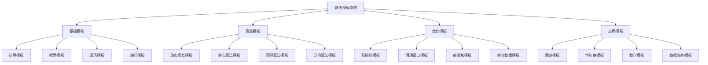

# 算法模板总结

## 📖 核心概念

**算法模板总结**是数据结构与算法学习的重要总结，包含了各种常用算法的标准模板和实现模式。通过掌握这些模板，可以快速解决类似问题，提高编程效率和代码质量。

### 🏗️ 算法模板总结分类



## 🔧 算法模板总结

### 基础模板

```python
# 1. 排序模板
class SortingTemplates:
    @staticmethod
    def quick_sort(arr, left, right):
        """快速排序模板"""
        if left < right:
            pivot_index = SortingTemplates.partition(arr, left, right)
            SortingTemplates.quick_sort(arr, left, pivot_index - 1)
            SortingTemplates.quick_sort(arr, pivot_index + 1, right)
    
    @staticmethod
    def partition(arr, left, right):
        """分区函数"""
        pivot = arr[right]
        i = left - 1
        
        for j in range(left, right):
            if arr[j] <= pivot:
                i += 1
                arr[i], arr[j] = arr[j], arr[i]
        
        arr[i + 1], arr[right] = arr[right], arr[i + 1]
        return i + 1
    
    @staticmethod
    def merge_sort(arr, left, right):
        """归并排序模板"""
        if left < right:
            mid = (left + right) // 2
            SortingTemplates.merge_sort(arr, left, mid)
            SortingTemplates.merge_sort(arr, mid + 1, right)
            SortingTemplates.merge(arr, left, mid, right)
    
    @staticmethod
    def merge(arr, left, mid, right):
        """合并函数"""
        n1 = mid - left + 1
        n2 = right - mid
        
        left_arr = arr[left:mid + 1]
        right_arr = arr[mid + 1:right + 1]
        
        i = j = 0
        k = left
        
        while i < n1 and j < n2:
            if left_arr[i] <= right_arr[j]:
                arr[k] = left_arr[i]
                i += 1
            else:
                arr[k] = right_arr[j]
                j += 1
            k += 1
        
        while i < n1:
            arr[k] = left_arr[i]
            i += 1
            k += 1
        
        while j < n2:
            arr[k] = right_arr[j]
            j += 1
            k += 1

# 2. 搜索模板
class SearchTemplates:
    @staticmethod
    def binary_search(arr, target):
        """二分查找模板"""
        left, right = 0, len(arr) - 1
        
        while left <= right:
            mid = (left + right) // 2
            
            if arr[mid] == target:
                return mid
            elif arr[mid] < target:
                left = mid + 1
            else:
                right = mid - 1
        
        return -1
    
    @staticmethod
    def binary_search_left_bound(arr, target):
        """二分查找左边界模板"""
        left, right = 0, len(arr)
        
        while left < right:
            mid = (left + right) // 2
            
            if arr[mid] < target:
                left = mid + 1
            else:
                right = mid
        
        return left if left < len(arr) and arr[left] == target else -1
    
    @staticmethod
    def binary_search_right_bound(arr, target):
        """二分查找右边界模板"""
        left, right = 0, len(arr)
        
        while left < right:
            mid = (left + right) // 2
            
            if arr[mid] <= target:
                left = mid + 1
            else:
                right = mid
        
        return left - 1 if left > 0 and arr[left - 1] == target else -1

# 3. 遍历模板
class TraversalTemplates:
    @staticmethod
    def dfs_recursive(graph, start, visited):
        """DFS递归模板"""
        visited.add(start)
        print(start)
        
        for neighbor in graph[start]:
            if neighbor not in visited:
                TraversalTemplates.dfs_recursive(graph, neighbor, visited)
    
    @staticmethod
    def dfs_iterative(graph, start):
        """DFS迭代模板"""
        visited = set()
        stack = [start]
        
        while stack:
            node = stack.pop()
            if node not in visited:
                visited.add(node)
                print(node)
                
                for neighbor in graph[node]:
                    if neighbor not in visited:
                        stack.append(neighbor)
    
    @staticmethod
    def bfs(graph, start):
        """BFS模板"""
        visited = set()
        queue = [start]
        visited.add(start)
        
        while queue:
            node = queue.pop(0)
            print(node)
            
            for neighbor in graph[node]:
                if neighbor not in visited:
                    visited.add(neighbor)
                    queue.append(neighbor)

# 4. 递归模板
class RecursionTemplates:
    @staticmethod
    def recursion_template(problem):
        """递归模板"""
        # 1. 递归终止条件
        if problem is None or problem is solved:
            return base_case
        
        # 2. 处理当前问题
        current_result = process_current(problem)
        
        # 3. 递归调用
        sub_result = RecursionTemplates.recursion_template(sub_problem)
        
        # 4. 合并结果
        return combine(current_result, sub_result)
    
    @staticmethod
    def backtrack_template(path, choices):
        """回溯模板"""
        # 1. 递归终止条件
        if is_valid_solution(path):
            result.append(path.copy())
            return
        
        # 2. 遍历选择
        for choice in choices:
            # 3. 做选择
            path.append(choice)
            
            # 4. 递归
            RecursionTemplates.backtrack_template(path, remaining_choices)
            
            # 5. 撤销选择
            path.pop()
```

### 高级模板

```python
# 5. 动态规划模板
class DynamicProgrammingTemplates:
    @staticmethod
    def dp_1d_template(n):
        """一维DP模板"""
        dp = [0] * (n + 1)
        dp[0] = base_case
        
        for i in range(1, n + 1):
            dp[i] = recurrence_relation(dp, i)
        
        return dp[n]
    
    @staticmethod
    def dp_2d_template(m, n):
        """二维DP模板"""
        dp = [[0] * (n + 1) for _ in range(m + 1)]
        
        # 初始化
        for i in range(m + 1):
            dp[i][0] = base_case_i
        for j in range(n + 1):
            dp[0][j] = base_case_j
        
        # 状态转移
        for i in range(1, m + 1):
            for j in range(1, n + 1):
                dp[i][j] = recurrence_relation(dp, i, j)
        
        return dp[m][n]
    
    @staticmethod
    def dp_optimized_template(n):
        """空间优化DP模板"""
        prev = base_case_prev
        curr = base_case_curr
        
        for i in range(2, n + 1):
            next_val = recurrence_relation(prev, curr, i)
            prev = curr
            curr = next_val
        
        return curr

# 6. 贪心算法模板
class GreedyTemplates:
    @staticmethod
    def greedy_template(choices):
        """贪心算法模板"""
        # 1. 排序选择
        choices.sort(key=greedy_criteria)
        
        result = []
        for choice in choices:
            # 2. 检查是否满足条件
            if is_valid_choice(choice, result):
                result.append(choice)
        
        return result
    
    @staticmethod
    def interval_scheduling(intervals):
        """区间调度模板"""
        # 按结束时间排序
        intervals.sort(key=lambda x: x[1])
        
        result = []
        last_end = 0
        
        for start, end in intervals:
            if start >= last_end:
                result.append((start, end))
                last_end = end
        
        return result

# 7. 回溯算法模板
class BacktrackTemplates:
    @staticmethod
    def backtrack_template(path, choices):
        """回溯算法模板"""
        # 1. 递归终止条件
        if is_valid_solution(path):
            result.append(path.copy())
            return
        
        # 2. 遍历选择
        for choice in choices:
            # 3. 做选择
            path.append(choice)
            
            # 4. 递归
            BacktrackTemplates.backtrack_template(path, remaining_choices)
            
            # 5. 撤销选择
            path.pop()
    
    @staticmethod
    def permutation_template(nums):
        """排列模板"""
        result = []
        
        def backtrack(path):
            if len(path) == len(nums):
                result.append(path.copy())
                return
            
            for num in nums:
                if num not in path:
                    path.append(num)
                    backtrack(path)
                    path.pop()
        
        backtrack([])
        return result
    
    @staticmethod
    def combination_template(nums, k):
        """组合模板"""
        result = []
        
        def backtrack(start, path):
            if len(path) == k:
                result.append(path.copy())
                return
            
            for i in range(start, len(nums)):
                path.append(nums[i])
                backtrack(i + 1, path)
                path.pop()
        
        backtrack(0, [])
        return result

# 8. 分治算法模板
class DivideConquerTemplates:
    @staticmethod
    def divide_conquer_template(problem):
        """分治算法模板"""
        # 1. 递归终止条件
        if problem is small enough:
            return solve_directly(problem)
        
        # 2. 分解问题
        sub_problems = divide(problem)
        
        # 3. 递归解决子问题
        sub_results = []
        for sub_problem in sub_problems:
            sub_results.append(DivideConquerTemplates.divide_conquer_template(sub_problem))
        
        # 4. 合并结果
        return combine(sub_results)
    
    @staticmethod
    def merge_sort_template(arr, left, right):
        """归并排序分治模板"""
        if left < right:
            mid = (left + right) // 2
            DivideConquerTemplates.merge_sort_template(arr, left, mid)
            DivideConquerTemplates.merge_sort_template(arr, mid + 1, right)
            DivideConquerTemplates.merge(arr, left, mid, right)
    
    @staticmethod
    def merge(arr, left, mid, right):
        """合并函数"""
        n1 = mid - left + 1
        n2 = right - mid
        
        left_arr = arr[left:mid + 1]
        right_arr = arr[mid + 1:right + 1]
        
        i = j = 0
        k = left
        
        while i < n1 and j < n2:
            if left_arr[i] <= right_arr[j]:
                arr[k] = left_arr[i]
                i += 1
            else:
                arr[k] = right_arr[j]
                j += 1
            k += 1
        
        while i < n1:
            arr[k] = left_arr[i]
            i += 1
            k += 1
        
        while j < n2:
            arr[k] = right_arr[j]
            j += 1
            k += 1
```

### 优化模板

```python
# 9. 双指针模板
class TwoPointerTemplates:
    @staticmethod
    def two_sum_template(nums, target):
        """两数之和双指针模板"""
        left, right = 0, len(nums) - 1
        
        while left < right:
            current_sum = nums[left] + nums[right]
            
            if current_sum == target:
                return [left, right]
            elif current_sum < target:
                left += 1
            else:
                right -= 1
        
        return []
    
    @staticmethod
    def remove_duplicates_template(nums):
        """去重双指针模板"""
        if not nums:
            return 0
        
        slow = 0
        for fast in range(1, len(nums)):
            if nums[fast] != nums[slow]:
                slow += 1
                nums[slow] = nums[fast]
        
        return slow + 1
    
    @staticmethod
    def container_with_most_water_template(height):
        """盛水容器双指针模板"""
        left, right = 0, len(height) - 1
        max_area = 0
        
        while left < right:
            current_area = min(height[left], height[right]) * (right - left)
            max_area = max(max_area, current_area)
            
            if height[left] < height[right]:
                left += 1
            else:
                right -= 1
        
        return max_area

# 10. 滑动窗口模板
class SlidingWindowTemplates:
    @staticmethod
    def sliding_window_template(s, target):
        """滑动窗口模板"""
        left = 0
        window = {}
        valid = 0
        
        for right in range(len(s)):
            # 扩大窗口
            c = s[right]
            window[c] = window.get(c, 0) + 1
            
            # 判断是否需要收缩窗口
            while window_needs_shrink(window):
                # 收缩窗口
                d = s[left]
                left += 1
                window[d] -= 1
                if window[d] == 0:
                    del window[d]
        
        return result
    
    @staticmethod
    def longest_substring_template(s):
        """最长无重复子串模板"""
        char_set = set()
        left = 0
        max_length = 0
        
        for right in range(len(s)):
            while s[right] in char_set:
                char_set.remove(s[left])
                left += 1
            
            char_set.add(s[right])
            max_length = max(max_length, right - left + 1)
        
        return max_length
    
    @staticmethod
    def min_window_template(s, t):
        """最小覆盖子串模板"""
        need = {}
        for c in t:
            need[c] = need.get(c, 0) + 1
        
        window = {}
        left = right = 0
        valid = 0
        start = 0
        min_len = float('inf')
        
        while right < len(s):
            c = s[right]
            right += 1
            
            if c in need:
                window[c] = window.get(c, 0) + 1
                if window[c] == need[c]:
                    valid += 1
            
            while valid == len(need):
                if right - left < min_len:
                    start = left
                    min_len = right - left
                
                d = s[left]
                left += 1
                
                if d in need:
                    if window[d] == need[d]:
                        valid -= 1
                    window[d] -= 1
        
        return "" if min_len == float('inf') else s[start:start + min_len]

# 11. 前缀和模板
class PrefixSumTemplates:
    @staticmethod
    def prefix_sum_template(nums):
        """前缀和模板"""
        n = len(nums)
        prefix_sum = [0] * (n + 1)
        
        for i in range(n):
            prefix_sum[i + 1] = prefix_sum[i] + nums[i]
        
        return prefix_sum
    
    @staticmethod
    def range_sum_query_template(nums, queries):
        """区间和查询模板"""
        prefix_sum = PrefixSumTemplates.prefix_sum_template(nums)
        results = []
        
        for left, right in queries:
            result = prefix_sum[right + 1] - prefix_sum[left]
            results.append(result)
        
        return results
    
    @staticmethod
    def subarray_sum_template(nums, target):
        """子数组和模板"""
        prefix_sum = 0
        sum_count = {0: 1}
        count = 0
        
        for num in nums:
            prefix_sum += num
            if prefix_sum - target in sum_count:
                count += sum_count[prefix_sum - target]
            sum_count[prefix_sum] = sum_count.get(prefix_sum, 0) + 1
        
        return count

# 12. 差分数组模板
class DifferenceArrayTemplates:
    @staticmethod
    def difference_array_template(nums):
        """差分数组模板"""
        n = len(nums)
        diff = [0] * (n + 1)
        
        for i in range(n):
            diff[i] = nums[i] - (nums[i - 1] if i > 0 else 0)
        
        return diff
    
    @staticmethod
    def range_update_template(nums, updates):
        """区间更新模板"""
        n = len(nums)
        diff = DifferenceArrayTemplates.difference_array_template(nums)
        
        for left, right, val in updates:
            diff[left] += val
            if right + 1 < n:
                diff[right + 1] -= val
        
        # 还原数组
        for i in range(1, n):
            diff[i] += diff[i - 1]
        
        return diff[:n]
```

### 应用模板

```python
# 13. 图论模板
class GraphTemplates:
    @staticmethod
    def dijkstra_template(graph, start):
        """Dijkstra算法模板"""
        import heapq
        
        n = len(graph)
        dist = [float('inf')] * n
        dist[start] = 0
        pq = [(0, start)]
        
        while pq:
            d, u = heapq.heappop(pq)
            
            if d > dist[u]:
                continue
            
            for v, weight in graph[u]:
                if dist[u] + weight < dist[v]:
                    dist[v] = dist[u] + weight
                    heapq.heappush(pq, (dist[v], v))
        
        return dist
    
    @staticmethod
    def topological_sort_template(graph):
        """拓扑排序模板"""
        n = len(graph)
        in_degree = [0] * n
        
        for u in range(n):
            for v in graph[u]:
                in_degree[v] += 1
        
        queue = []
        for i in range(n):
            if in_degree[i] == 0:
                queue.append(i)
        
        result = []
        while queue:
            u = queue.pop(0)
            result.append(u)
            
            for v in graph[u]:
                in_degree[v] -= 1
                if in_degree[v] == 0:
                    queue.append(v)
        
        return result if len(result) == n else []
    
    @staticmethod
    def union_find_template(n):
        """并查集模板"""
        parent = list(range(n))
        
        def find(x):
            if parent[x] != x:
                parent[x] = find(parent[x])
            return parent[x]
        
        def union(x, y):
            px, py = find(x), find(y)
            if px != py:
                parent[px] = py
        
        return find, union

# 14. 字符串模板
class StringTemplates:
    @staticmethod
    def kmp_template(text, pattern):
        """KMP算法模板"""
        def build_lps(pattern):
            lps = [0] * len(pattern)
            length = 0
            i = 1
            
            while i < len(pattern):
                if pattern[i] == pattern[length]:
                    length += 1
                    lps[i] = length
                    i += 1
                else:
                    if length != 0:
                        length = lps[length - 1]
                    else:
                        lps[i] = 0
                        i += 1
            
            return lps
        
        lps = build_lps(pattern)
        i = j = 0
        result = []
        
        while i < len(text):
            if pattern[j] == text[i]:
                i += 1
                j += 1
            
            if j == len(pattern):
                result.append(i - j)
                j = lps[j - 1]
            elif i < len(text) and pattern[j] != text[i]:
                if j != 0:
                    j = lps[j - 1]
                else:
                    i += 1
        
        return result
    
    @staticmethod
    def rabin_karp_template(text, pattern):
        """Rabin-Karp算法模板"""
        n, m = len(text), len(pattern)
        if m > n:
            return []
        
        base = 256
        mod = 10**9 + 7
        
        # 计算pattern的哈希值
        pattern_hash = 0
        for c in pattern:
            pattern_hash = (pattern_hash * base + ord(c)) % mod
        
        # 计算text前m个字符的哈希值
        text_hash = 0
        for i in range(m):
            text_hash = (text_hash * base + ord(text[i])) % mod
        
        result = []
        if text_hash == pattern_hash and text[:m] == pattern:
            result.append(0)
        
        # 计算base^(m-1)
        power = 1
        for i in range(m - 1):
            power = (power * base) % mod
        
        # 滑动窗口
        for i in range(m, n):
            text_hash = (text_hash - ord(text[i - m]) * power) % mod
            text_hash = (text_hash * base + ord(text[i])) % mod
            
            if text_hash == pattern_hash and text[i - m + 1:i + 1] == pattern:
                result.append(i - m + 1)
        
        return result

# 15. 数学模板
class MathTemplates:
    @staticmethod
    def gcd_template(a, b):
        """最大公约数模板"""
        while b:
            a, b = b, a % b
        return a
    
    @staticmethod
    def lcm_template(a, b):
        """最小公倍数模板"""
        return a * b // MathTemplates.gcd_template(a, b)
    
    @staticmethod
    def fast_power_template(base, exponent, mod):
        """快速幂模板"""
        result = 1
        base = base % mod
        
        while exponent > 0:
            if exponent % 2 == 1:
                result = (result * base) % mod
            exponent = exponent >> 1
            base = (base * base) % mod
        
        return result
    
    @staticmethod
    def prime_sieve_template(n):
        """素数筛模板"""
        is_prime = [True] * (n + 1)
        is_prime[0] = is_prime[1] = False
        
        for i in range(2, int(n**0.5) + 1):
            if is_prime[i]:
                for j in range(i * i, n + 1, i):
                    is_prime[j] = False
        
        return [i for i in range(2, n + 1) if is_prime[i]]
```

## 🎯 算法模板总结应用

### 实际应用场景

```python
class AlgorithmTemplateApplications:
    @staticmethod
    def demonstrate_applications():
        print("算法模板总结 Applications:")
        print("========================")
        
        print("1. 面试准备:")
        print("   - 快速解题")
        print("   - 标准实现")
        print("   - 代码质量")
        
        print("2. 竞赛编程:")
        print("   - 模板复用")
        print("   - 快速实现")
        print("   - 算法选择")
        
        print("3. 实际开发:")
        print("   - 算法库")
        print("   - 性能优化")
        print("   - 代码复用")
        
        print("4. 学习成长:")
        print("   - 模式识别")
        print("   - 算法理解")
        print("   - 编程技巧")
    
    @staticmethod
    def analyze_performance():
        print("算法模板总结 Performance Analysis:")
        print("================================")
        
        print("1. 模板优势:")
        print("   - 快速实现")
        print("   - 标准格式")
        print("   - 易于理解")
        print("   - 便于调试")
        print()
        
        print("2. 应用场景:")
        print("   - 面试题目")
        print("   - 竞赛编程")
        print("   - 实际开发")
        print("   - 算法学习")
        print()
        
        print("3. 优化技巧:")
        print("   - 模板选择")
        print("   - 参数调整")
        print("   - 边界处理")
        print("   - 性能优化")
    
    @staticmethod
    def select_template_strategy(problem_type, constraints, optimization_target):
        print("Template Strategy Selection:")
        print("==========================")
        
        print(f"Problem type: {problem_type}")
        print(f"Constraints: {constraints}")
        print(f"Optimization target: {optimization_target}")
        
        print("Recommendation:")
        
        if problem_type == "sorting":
            print("Use sorting templates (quick sort, merge sort)")
        elif problem_type == "searching":
            print("Use search templates (binary search, DFS, BFS)")
        elif problem_type == "dp":
            print("Use dynamic programming templates")
        elif problem_type == "greedy":
            print("Use greedy algorithm templates")
        elif problem_type == "backtrack":
            print("Use backtracking templates")
        elif problem_type == "graph":
            print("Use graph algorithm templates")
        else:
            print("Analyze problem characteristics and choose appropriate template")
```

## 📊 算法模板总结分析

### 性能分析

```python
class AlgorithmTemplateAnalysis:
    @staticmethod
    def analyze_performance():
        print("算法模板总结 Performance Analysis:")
        print("================================")
        
        print("1. 时间复杂度:")
        print("   - 排序模板: O(n log n)")
        print("   - 搜索模板: O(log n)")
        print("   - 遍历模板: O(V + E)")
        print("   - DP模板: O(n^2)")
        print("   - 贪心模板: O(n log n)")
        print()
        
        print("2. 空间复杂度:")
        print("   - 原地算法: O(1)")
        print("   - 递归算法: O(n)")
        print("   - DP算法: O(n)")
        print("   - 图算法: O(V + E)")
        print()
        
        print("3. 优化策略:")
        print("   - 模板选择: 合适模板")
        print("   - 参数优化: 调整参数")
        print("   - 空间优化: 减少空间")
        print("   - 时间优化: 提高效率")
    
    @staticmethod
    def analyze_space_complexity():
        print("算法模板总结 Space Complexity Analysis:")
        print("=====================================")
        
        print("1. 空间使用:")
        print("   - 输入空间: 题目给定")
        print("   - 辅助空间: 算法需要")
        print("   - 输出空间: 结果存储")
        print("   - 递归空间: 调用栈")
        print()
        
        print("2. 空间优化:")
        print("   - 原地修改: 减少空间")
        print("   - 迭代替代: 避免递归")
        print("   - 数据结构: 选择合适")
        print("   - 空间复用: 重复使用")
        print()
        
        print("3. 空间分析:")
        print("   - 最坏情况: 最大空间")
        print("   - 平均情况: 期望空间")
        print("   - 最好情况: 最小空间")
        print("   - 实际使用: 真实空间")
    
    @staticmethod
    def analyze_time_complexity():
        print("算法模板总结 Time Complexity Analysis:")
        print("===================================")
        
        print("1. 算法复杂度:")
        print("   - 线性时间: O(n)")
        print("   - 对数时间: O(log n)")
        print("   - 平方时间: O(n^2)")
        print("   - 指数时间: O(2^n)")
        print("   - 阶乘时间: O(n!)")
        print()
        
        print("2. 复杂度分析:")
        print("   - 最坏情况: 最大时间")
        print("   - 平均情况: 期望时间")
        print("   - 最好情况: 最小时间")
        print("   - 实际运行: 真实时间")
        print()
        
        print("3. 优化方法:")
        print("   - 算法选择: 合适算法")
        print("   - 数据结构: 高效结构")
        print("   - 预处理: 提前计算")
        print("   - 缓存: 避免重复")
```

## 🎮 算法模板总结测试

### 1. 基础功能测试

```python
def test_sorting_templates():
    print("Testing Sorting Templates:")
    print("========================")
    
    arr = [64, 34, 25, 12, 22, 11, 90]
    print(f"Original array: {arr}")
    
    # 测试快速排序
    arr_copy = arr.copy()
    SortingTemplates.quick_sort(arr_copy, 0, len(arr_copy) - 1)
    print(f"Quick sort: {arr_copy}")
    
    # 测试归并排序
    arr_copy = arr.copy()
    SortingTemplates.merge_sort(arr_copy, 0, len(arr_copy) - 1)
    print(f"Merge sort: {arr_copy}")

def test_search_templates():
    print("Testing Search Templates:")
    print("=======================")
    
    arr = [1, 2, 3, 4, 5, 6, 7, 8, 9]
    target = 5
    
    # 测试二分查找
    result = SearchTemplates.binary_search(arr, target)
    print(f"Binary search for {target}: index {result}")
    
    # 测试左边界查找
    result = SearchTemplates.binary_search_left_bound(arr, target)
    print(f"Left bound search for {target}: index {result}")
    
    # 测试右边界查找
    result = SearchTemplates.binary_search_right_bound(arr, target)
    print(f"Right bound search for {target}: index {result}")

def test_traversal_templates():
    print("Testing Traversal Templates:")
    print("==========================")
    
    graph = {
        0: [1, 2],
        1: [0, 3, 4],
        2: [0, 5],
        3: [1],
        4: [1],
        5: [2]
    }
    
    print("DFS Recursive:")
    TraversalTemplates.dfs_recursive(graph, 0, set())
    
    print("\nDFS Iterative:")
    TraversalTemplates.dfs_iterative(graph, 0)
    
    print("\nBFS:")
    TraversalTemplates.bfs(graph, 0)

def test_dp_templates():
    print("Testing Dynamic Programming Templates:")
    print("===================================")
    
    # 测试一维DP
    result = DynamicProgrammingTemplates.dp_1d_template(10)
    print(f"1D DP result: {result}")
    
    # 测试二维DP
    result = DynamicProgrammingTemplates.dp_2d_template(5, 5)
    print(f"2D DP result: {result}")

def test_applications():
    print("Testing Applications:")
    print("==================")
    
    AlgorithmTemplateApplications.demonstrate_applications()
    AlgorithmTemplateApplications.analyze_performance()
    AlgorithmTemplateApplications.select_template_strategy("sorting", "in-place", "time")

def test_analysis():
    print("Testing Analysis:")
    print("===============")
    
    AlgorithmTemplateAnalysis.analyze_performance()
    AlgorithmTemplateAnalysis.analyze_space_complexity()
    AlgorithmTemplateAnalysis.analyze_time_complexity()

# 主测试函数
def main():
    test_sorting_templates()
    print()
    test_search_templates()
    print()
    test_traversal_templates()
    print()
    test_dp_templates()
    print()
    test_applications()
    print()
    test_analysis()

if __name__ == "__main__":
    main()
```

## 🔗 相关链接

- [[01-LeetCode经典题解|LeetCode经典题解]]
- [[02-剑指Offer题集|剑指Offer题集]]
- [[03-牛客网刷题|牛客网刷题]]

## 💡 算法模板总结要点

1. **模板选择**: 根据问题特点选择合适的模板
2. **参数调整**: 根据具体需求调整模板参数
3. **边界处理**: 注意特殊情况和边界条件
4. **性能优化**: 考虑时间和空间复杂度的平衡

---

*📝 算法模板总结提示：算法模板是快速解题的重要工具，需要熟练掌握各种模板的使用场景和优化技巧*
