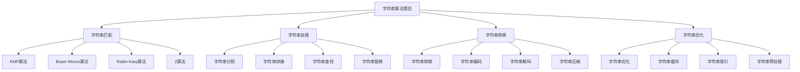

# 字符串算法题目

## 📖 核心概念

**字符串算法题目**是数据结构与算法学习中的重要组成部分，涉及字符串匹配、字符串处理、字符串转换等经典算法。通过解决字符串算法题目，可以深入理解字符串的结构和性质，掌握各种字符串算法的实现和应用。

### 🏗️ 字符串算法题目的组成要素



## 🔍 字符串算法题目分类

### 题目难度分类

| 难度等级 | 题目特点 | 算法要求 | 时间复杂度 | 适用场景 |
|----------|----------|----------|------------|----------|
| **简单** | 基础操作 | 字符串处理 | O(n) | 入门练习 |
| **中等** | 模式匹配 | KMP/Boyer-Moore | O(n+m) | 实际应用 |
| **困难** | 复杂算法 | 高级字符串算法 | O(n²) | 算法竞赛 |

## 💻 字符串算法题目实现

### 字符串匹配题目

```cpp
// 字符串匹配题目
class StringMatchingProblems {
public:
    // 题目1：实现strStr()
    // 使用KMP算法实现字符串匹配
    int strStr(string haystack, string needle) {
        if (needle.empty()) return 0;
        if (haystack.empty()) return -1;
        
        int m = haystack.length();
        int n = needle.length();
        
        // 构建next数组
        vector<int> next = buildNext(needle);
        
        int i = 0, j = 0;
        while (i < m && j < n) {
            if (j == -1 || haystack[i] == needle[j]) {
                i++;
                j++;
            } else {
                j = next[j];
            }
        }
        
        return j == n ? i - j : -1;
    }
    
private:
    vector<int> buildNext(string pattern) {
        int n = pattern.length();
        vector<int> next(n, -1);
        
        int j = 0, k = -1;
        while (j < n - 1) {
            if (k == -1 || pattern[j] == pattern[k]) {
                j++;
                k++;
                next[j] = k;
            } else {
                k = next[k];
            }
        }
        
        return next;
    }
    
public:
    // 题目2：最长公共前缀
    // 找到字符串数组中的最长公共前缀
    string longestCommonPrefix(vector<string>& strs) {
        if (strs.empty()) return "";
        
        string prefix = strs[0];
        for (int i = 1; i < strs.size(); i++) {
            while (strs[i].find(prefix) != 0) {
                prefix = prefix.substr(0, prefix.length() - 1);
                if (prefix.empty()) return "";
            }
        }
        
        return prefix;
    }
    
    // 题目3：字符串中的第一个唯一字符
    // 找到字符串中第一个不重复的字符
    int firstUniqChar(string s) {
        vector<int> count(26, 0);
        
        // 统计字符出现次数
        for (char c : s) {
            count[c - 'a']++;
        }
        
        // 找到第一个唯一字符
        for (int i = 0; i < s.length(); i++) {
            if (count[s[i] - 'a'] == 1) {
                return i;
            }
        }
        
        return -1;
    }
    
    // 题目4：有效的字母异位词
    // 判断两个字符串是否为字母异位词
    bool isAnagram(string s, string t) {
        if (s.length() != t.length()) return false;
        
        vector<int> count(26, 0);
        
        // 统计s中字符出现次数
        for (char c : s) {
            count[c - 'a']++;
        }
        
        // 减去t中字符出现次数
        for (char c : t) {
            count[c - 'a']--;
        }
        
        // 检查是否所有字符计数都为0
        for (int i = 0; i < 26; i++) {
            if (count[i] != 0) return false;
        }
        
        return true;
    }
    
    // 题目5：最长回文子串
    // 找到字符串中的最长回文子串
    string longestPalindrome(string s) {
        if (s.empty()) return "";
        
        int start = 0, maxLen = 1;
        
        for (int i = 0; i < s.length(); i++) {
            // 检查奇数长度回文
            int len1 = expandAroundCenter(s, i, i);
            // 检查偶数长度回文
            int len2 = expandAroundCenter(s, i, i + 1);
            
            int len = max(len1, len2);
            if (len > maxLen) {
                maxLen = len;
                start = i - (len - 1) / 2;
            }
        }
        
        return s.substr(start, maxLen);
    }
    
private:
    int expandAroundCenter(string s, int left, int right) {
        while (left >= 0 && right < s.length() && s[left] == s[right]) {
            left--;
            right++;
        }
        return right - left - 1;
    }
};
```

### 字符串处理题目

```cpp
// 字符串处理题目
class StringProcessingProblems {
public:
    // 题目1：反转字符串
    // 反转字符串中的字符
    void reverseString(vector<char>& s) {
        int left = 0, right = s.size() - 1;
        while (left < right) {
            swap(s[left], s[right]);
            left++;
            right--;
        }
    }
    
    // 题目2：反转字符串中的单词
    // 反转字符串中每个单词的字符顺序
    string reverseWords(string s) {
        string result;
        string word;
        
        for (int i = 0; i < s.length(); i++) {
            if (s[i] == ' ') {
                if (!word.empty()) {
                    reverse(word.begin(), word.end());
                    if (!result.empty()) result += ' ';
                    result += word;
                    word.clear();
                }
            } else {
                word += s[i];
            }
        }
        
        if (!word.empty()) {
            reverse(word.begin(), word.end());
            if (!result.empty()) result += ' ';
            result += word;
        }
        
        return result;
    }
    
    // 题目3：字符串转换整数
    // 将字符串转换为整数
    int myAtoi(string s) {
        int i = 0;
        int sign = 1;
        long result = 0;
        
        // 跳过空格
        while (i < s.length() && s[i] == ' ') {
            i++;
        }
        
        // 处理符号
        if (i < s.length() && (s[i] == '+' || s[i] == '-')) {
            sign = (s[i] == '-') ? -1 : 1;
            i++;
        }
        
        // 转换数字
        while (i < s.length() && isdigit(s[i])) {
            result = result * 10 + (s[i] - '0');
            
            // 检查溢出
            if (result * sign > INT_MAX) return INT_MAX;
            if (result * sign < INT_MIN) return INT_MIN;
            
            i++;
        }
        
        return result * sign;
    }
    
    // 题目4：字符串相乘
    // 计算两个字符串表示的数字的乘积
    string multiply(string num1, string num2) {
        if (num1 == "0" || num2 == "0") return "0";
        
        int m = num1.length();
        int n = num2.length();
        vector<int> result(m + n, 0);
        
        // 从右到左计算每一位
        for (int i = m - 1; i >= 0; i--) {
            for (int j = n - 1; j >= 0; j--) {
                int mul = (num1[i] - '0') * (num2[j] - '0');
                int p1 = i + j;
                int p2 = i + j + 1;
                
                int sum = mul + result[p2];
                result[p2] = sum % 10;
                result[p1] += sum / 10;
            }
        }
        
        // 构建结果字符串
        string res;
        for (int i = 0; i < result.size(); i++) {
            if (!(res.empty() && result[i] == 0)) {
                res += to_string(result[i]);
            }
        }
        
        return res.empty() ? "0" : res;
    }
    
    // 题目5：字符串解码
    // 解码编码的字符串
    string decodeString(string s) {
        stack<string> strStack;
        stack<int> numStack;
        string currentStr = "";
        int currentNum = 0;
        
        for (char c : s) {
            if (isdigit(c)) {
                currentNum = currentNum * 10 + (c - '0');
            } else if (c == '[') {
                strStack.push(currentStr);
                numStack.push(currentNum);
                currentStr = "";
                currentNum = 0;
            } else if (c == ']') {
                int repeatTimes = numStack.top();
                numStack.pop();
                string prevStr = strStack.top();
                strStack.pop();
                
                string repeatedStr = "";
                for (int i = 0; i < repeatTimes; i++) {
                    repeatedStr += currentStr;
                }
                
                currentStr = prevStr + repeatedStr;
            } else {
                currentStr += c;
            }
        }
        
        return currentStr;
    }
};
```

### 字符串转换题目

```cpp
// 字符串转换题目
class StringConversionProblems {
public:
    // 题目1：罗马数字转整数
    // 将罗马数字转换为整数
    int romanToInt(string s) {
        unordered_map<char, int> romanValues = {
            {'I', 1}, {'V', 5}, {'X', 10}, {'L', 50},
            {'C', 100}, {'D', 500}, {'M', 1000}
        };
        
        int result = 0;
        int prevValue = 0;
        
        for (int i = s.length() - 1; i >= 0; i--) {
            int currentValue = romanValues[s[i]];
            
            if (currentValue < prevValue) {
                result -= currentValue;
            } else {
                result += currentValue;
            }
            
            prevValue = currentValue;
        }
        
        return result;
    }
    
    // 题目2：整数转罗马数字
    // 将整数转换为罗马数字
    string intToRoman(int num) {
        vector<pair<int, string>> values = {
            {1000, "M"}, {900, "CM"}, {500, "D"}, {400, "CD"},
            {100, "C"}, {90, "XC"}, {50, "L"}, {40, "XL"},
            {10, "X"}, {9, "IX"}, {5, "V"}, {4, "IV"}, {1, "I"}
        };
        
        string result = "";
        
        for (const auto& [value, symbol] : values) {
            while (num >= value) {
                result += symbol;
                num -= value;
            }
        }
        
        return result;
    }
    
    // 题目3：字符串转换
    // 将字符串转换为Z字形排列
    string convert(string s, int numRows) {
        if (numRows == 1) return s;
        
        vector<string> rows(numRows);
        int currentRow = 0;
        bool goingDown = false;
        
        for (char c : s) {
            rows[currentRow] += c;
            
            if (currentRow == 0 || currentRow == numRows - 1) {
                goingDown = !goingDown;
            }
            
            currentRow += goingDown ? 1 : -1;
        }
        
        string result = "";
        for (const string& row : rows) {
            result += row;
        }
        
        return result;
    }
    
    // 题目4：字符串压缩
    // 压缩字符串
    int compress(vector<char>& chars) {
        int i = 0, j = 0;
        
        while (i < chars.size()) {
            char currentChar = chars[i];
            int count = 0;
            
            // 计算连续字符的数量
            while (i < chars.size() && chars[i] == currentChar) {
                i++;
                count++;
            }
            
            // 写入字符
            chars[j++] = currentChar;
            
            // 写入数量
            if (count > 1) {
                string countStr = to_string(count);
                for (char c : countStr) {
                    chars[j++] = c;
                }
            }
        }
        
        return j;
    }
    
    // 题目5：字符串编辑距离
    // 计算两个字符串之间的编辑距离
    int minDistance(string word1, string word2) {
        int m = word1.length();
        int n = word2.length();
        
        vector<vector<int>> dp(m + 1, vector<int>(n + 1, 0));
        
        // 初始化
        for (int i = 0; i <= m; i++) {
            dp[i][0] = i;
        }
        for (int j = 0; j <= n; j++) {
            dp[0][j] = j;
        }
        
        // 填充dp表
        for (int i = 1; i <= m; i++) {
            for (int j = 1; j <= n; j++) {
                if (word1[i-1] == word2[j-1]) {
                    dp[i][j] = dp[i-1][j-1];
                } else {
                    dp[i][j] = 1 + min({dp[i-1][j], dp[i][j-1], dp[i-1][j-1]});
                }
            }
        }
        
        return dp[m][n];
    }
};
```

### 字符串优化题目

```cpp
// 字符串优化题目
class StringOptimizationProblems {
public:
    // 题目1：最长无重复字符子串
    // 找到字符串中最长的无重复字符子串
    int lengthOfLongestSubstring(string s) {
        unordered_set<char> charSet;
        int left = 0, right = 0;
        int maxLen = 0;
        
        while (right < s.length()) {
            if (charSet.find(s[right]) == charSet.end()) {
                charSet.insert(s[right]);
                maxLen = max(maxLen, right - left + 1);
                right++;
            } else {
                charSet.erase(s[left]);
                left++;
            }
        }
        
        return maxLen;
    }
    
    // 题目2：最小覆盖子串
    // 找到包含目标字符串所有字符的最小子串
    string minWindow(string s, string t) {
        unordered_map<char, int> need, window;
        
        for (char c : t) {
            need[c]++;
        }
        
        int left = 0, right = 0;
        int valid = 0;
        int start = 0, len = INT_MAX;
        
        while (right < s.length()) {
            char c = s[right];
            right++;
            
            if (need.count(c)) {
                window[c]++;
                if (window[c] == need[c]) {
                    valid++;
                }
            }
            
            while (valid == need.size()) {
                if (right - left < len) {
                    start = left;
                    len = right - left;
                }
                
                char d = s[left];
                left++;
                
                if (need.count(d)) {
                    if (window[d] == need[d]) {
                        valid--;
                    }
                    window[d]--;
                }
            }
        }
        
        return len == INT_MAX ? "" : s.substr(start, len);
    }
    
    // 题目3：字符串排列
    // 判断字符串s2是否包含字符串s1的排列
    bool checkInclusion(string s1, string s2) {
        unordered_map<char, int> need, window;
        
        for (char c : s1) {
            need[c]++;
        }
        
        int left = 0, right = 0;
        int valid = 0;
        
        while (right < s2.length()) {
            char c = s2[right];
            right++;
            
            if (need.count(c)) {
                window[c]++;
                if (window[c] == need[c]) {
                    valid++;
                }
            }
            
            while (right - left >= s1.length()) {
                if (valid == need.size()) {
                    return true;
                }
                
                char d = s2[left];
                left++;
                
                if (need.count(d)) {
                    if (window[d] == need[d]) {
                        valid--;
                    }
                    window[d]--;
                }
            }
        }
        
        return false;
    }
    
    // 题目4：字符串中的变位词
    // 找到字符串中所有变位词的起始索引
    vector<int> findAnagrams(string s, string p) {
        vector<int> result;
        unordered_map<char, int> need, window;
        
        for (char c : p) {
            need[c]++;
        }
        
        int left = 0, right = 0;
        int valid = 0;
        
        while (right < s.length()) {
            char c = s[right];
            right++;
            
            if (need.count(c)) {
                window[c]++;
                if (window[c] == need[c]) {
                    valid++;
                }
            }
            
            while (right - left >= p.length()) {
                if (valid == need.size()) {
                    result.push_back(left);
                }
                
                char d = s[left];
                left++;
                
                if (need.count(d)) {
                    if (window[d] == need[d]) {
                        valid--;
                    }
                    window[d]--;
                }
            }
        }
        
        return result;
    }
    
    // 题目5：字符串匹配
    // 使用Rabin-Karp算法进行字符串匹配
    vector<int> rabinKarp(string text, string pattern) {
        vector<int> result;
        int n = text.length();
        int m = pattern.length();
        
        if (m > n) return result;
        
        const int base = 256;
        const int mod = 1000000007;
        
        // 计算pattern的哈希值
        long patternHash = 0;
        long textHash = 0;
        long power = 1;
        
        for (int i = 0; i < m; i++) {
            patternHash = (patternHash * base + pattern[i]) % mod;
            textHash = (textHash * base + text[i]) % mod;
            if (i < m - 1) {
                power = (power * base) % mod;
            }
        }
        
        // 滑动窗口
        for (int i = 0; i <= n - m; i++) {
            if (patternHash == textHash) {
                // 验证是否真的匹配
                bool match = true;
                for (int j = 0; j < m; j++) {
                    if (text[i + j] != pattern[j]) {
                        match = false;
                        break;
                    }
                }
                if (match) {
                    result.push_back(i);
                }
            }
            
            // 更新哈希值
            if (i < n - m) {
                textHash = (textHash - text[i] * power) % mod;
                textHash = (textHash * base + text[i + m]) % mod;
                if (textHash < 0) {
                    textHash += mod;
                }
            }
        }
        
        return result;
    }
};
```

### 字符串算法题目测试

```cpp
// 字符串算法题目测试
class StringAlgorithmTest {
public:
    static void runAllTests() {
        cout << "=== String Algorithm Tests ===" << endl;
        
        // 测试字符串匹配
        testStringMatching();
        
        cout << "\n" << string(50, '=') << endl;
        
        // 测试字符串处理
        testStringProcessing();
        
        cout << "\n" << string(50, '=') << endl;
        
        // 测试字符串转换
        testStringConversion();
        
        cout << "\n" << string(50, '=') << endl;
        
        // 测试字符串优化
        testStringOptimization();
    }
    
private:
    static void testStringMatching() {
        cout << "=== String Matching Test ===" << endl;
        
        StringMatchingProblems smp;
        
        // 测试strStr
        string haystack = "hello";
        string needle = "ll";
        int index = smp.strStr(haystack, needle);
        cout << "strStr result: " << index << endl;
        
        // 测试最长公共前缀
        vector<string> strs = {"flower", "flow", "flight"};
        string prefix = smp.longestCommonPrefix(strs);
        cout << "Longest common prefix: " << prefix << endl;
        
        // 测试第一个唯一字符
        string s = "leetcode";
        int firstUniq = smp.firstUniqChar(s);
        cout << "First unique character index: " << firstUniq << endl;
        
        cout << "String matching test completed" << endl;
    }
    
    static void testStringProcessing() {
        cout << "=== String Processing Test ===" << endl;
        
        StringProcessingProblems spp;
        
        // 测试反转字符串
        vector<char> chars = {'h', 'e', 'l', 'l', 'o'};
        spp.reverseString(chars);
        cout << "Reversed string: ";
        for (char c : chars) {
            cout << c;
        }
        cout << endl;
        
        // 测试反转单词
        string s = "the sky is blue";
        string reversed = spp.reverseWords(s);
        cout << "Reversed words: " << reversed << endl;
        
        // 测试字符串转换整数
        string numStr = "42";
        int num = spp.myAtoi(numStr);
        cout << "Converted number: " << num << endl;
        
        cout << "String processing test completed" << endl;
    }
    
    static void testStringConversion() {
        cout << "=== String Conversion Test ===" << endl;
        
        StringConversionProblems scp;
        
        // 测试罗马数字转整数
        string roman = "MCMXCIV";
        int romanInt = scp.romanToInt(roman);
        cout << "Roman to int: " << romanInt << endl;
        
        // 测试整数转罗马数字
        int num = 1994;
        string romanStr = scp.intToRoman(num);
        cout << "Int to roman: " << romanStr << endl;
        
        // 测试字符串转换
        string s = "PAYPALISHIRING";
        string converted = scp.convert(s, 3);
        cout << "Converted string: " << converted << endl;
        
        cout << "String conversion test completed" << endl;
    }
    
    static void testStringOptimization() {
        cout << "=== String Optimization Test ===" << endl;
        
        StringOptimizationProblems sop;
        
        // 测试最长无重复字符子串
        string s = "abcabcbb";
        int maxLen = sop.lengthOfLongestSubstring(s);
        cout << "Longest substring length: " << maxLen << endl;
        
        // 测试最小覆盖子串
        string s1 = "ADOBECODEBANC";
        string t1 = "ABC";
        string minWindow = sop.minWindow(s1, t1);
        cout << "Minimum window: " << minWindow << endl;
        
        // 测试字符串排列
        string s2 = "ab";
        string t2 = "eidbaooo";
        bool checkInclusion = sop.checkInclusion(s2, t2);
        cout << "Check inclusion: " << (checkInclusion ? "Yes" : "No") << endl;
        
        cout << "String optimization test completed" << endl;
    }
};
```

## ⚡ 复杂度分析

### 字符串算法复杂度

| 算法 | 时间复杂度 | 空间复杂度 | 适用场景 | 题目难度 |
|------|------------|------------|----------|----------|
| **KMP** | O(n+m) | O(m) | 字符串匹配 | 中等 |
| **Boyer-Moore** | O(n+m) | O(m) | 字符串匹配 | 中等 |
| **Rabin-Karp** | O(n+m) | O(1) | 字符串匹配 | 中等 |
| **滑动窗口** | O(n) | O(1) | 子串问题 | 中等 |

## 🎓 学习要点总结

### 核心理解

1. **字符串结构**：理解字符串的基本结构
2. **匹配算法**：掌握各种字符串匹配算法
3. **处理技巧**：掌握字符串处理技巧
4. **优化方法**：掌握字符串优化方法

### 实践要点

1. **算法实现**：正确实现各种算法
2. **复杂度分析**：分析算法复杂度
3. **边界处理**：处理边界情况
4. **优化技巧**：优化算法性能

### 应用思维

1. **字符串思维**：从字符串角度思考问题
2. **算法思维**：选择合适的算法
3. **优化思维**：优化算法性能
4. **实际应用**：将字符串算法应用到实际问题中

---

**相关链接：**
- [[02-线性世界/04-字符世界[字符串]/01-字符串基础|字符串基础]] - 字符串基础知识
- [[02-线性世界/04-字符世界[字符串]/02-字符串匹配|字符串匹配]] - 字符串匹配算法
- [[02-线性世界/04-字符世界[字符串]/03-字符串处理|字符串处理]] - 字符串处理技术
- [[02-线性世界/04-字符世界[字符串]/04-字符串优化|字符串优化]] - 字符串优化技术
