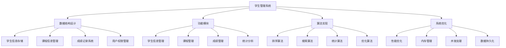

# 学生管理系统

## 📖 核心概念

**学生管理系统**是一个综合性的数据结构与算法实践项目，通过实现一个完整的学生信息管理系统，可以深入理解各种数据结构的应用场景，掌握实际项目开发中的设计模式和编程技巧。

### 🏗️ 学生管理系统分类



## 🔧 学生管理系统实现

### 数据结构设计

```python
# 学生信息类
class Student:
    def __init__(self, student_id, name, age, gender, major, grade):
        self.student_id = student_id
        self.name = name
        self.age = age
        self.gender = gender
        self.major = major
        self.grade = grade
        self.courses = {}  # 课程ID -> 成绩
        self.gpa = 0.0
    
    def add_course(self, course_id, score):
        """添加课程成绩"""
        self.courses[course_id] = score
        self.calculate_gpa()
    
    def calculate_gpa(self):
        """计算GPA"""
        if not self.courses:
            self.gpa = 0.0
            return
        
        total_points = 0
        total_credits = 0
        
        for course_id, score in self.courses.items():
            # 假设每门课程3学分
            credits = 3
            points = self.score_to_points(score)
            total_points += points * credits
            total_credits += credits
        
        self.gpa = total_points / total_credits if total_credits > 0 else 0.0
    
    def score_to_points(self, score):
        """成绩转换为绩点"""
        if score >= 90:
            return 4.0
        elif score >= 80:
            return 3.0
        elif score >= 70:
            return 2.0
        elif score >= 60:
            return 1.0
        else:
            return 0.0
    
    def __str__(self):
        return f"Student(ID: {self.student_id}, Name: {self.name}, GPA: {self.gpa:.2f})"

# 课程信息类
class Course:
    def __init__(self, course_id, name, credits, teacher):
        self.course_id = course_id
        self.name = name
        self.credits = credits
        self.teacher = teacher
        self.students = set()  # 选课学生ID集合
    
    def add_student(self, student_id):
        """添加选课学生"""
        self.students.add(student_id)
    
    def remove_student(self, student_id):
        """移除选课学生"""
        self.students.discard(student_id)
    
    def __str__(self):
        return f"Course(ID: {self.course_id}, Name: {self.name}, Credits: {self.credits})"

# 学生管理系统主类
class StudentManagementSystem:
    def __init__(self):
        self.students = {}  # 学生ID -> Student对象
        self.courses = {}   # 课程ID -> Course对象
        self.student_index = {}  # 姓名索引
        self.major_index = {}    # 专业索引
    
    def add_student(self, student):
        """添加学生"""
        self.students[student.student_id] = student
        
        # 更新索引
        if student.name not in self.student_index:
            self.student_index[student.name] = []
        self.student_index[student.name].append(student.student_id)
        
        if student.major not in self.major_index:
            self.major_index[student.major] = []
        self.major_index[student.major].append(student.student_id)
        
        print(f"学生 {student.name} 添加成功")
    
    def remove_student(self, student_id):
        """删除学生"""
        if student_id not in self.students:
            print(f"学生ID {student_id} 不存在")
            return False
        
        student = self.students[student_id]
        
        # 从课程中移除学生
        for course_id in student.courses:
            if course_id in self.courses:
                self.courses[course_id].remove_student(student_id)
        
        # 从索引中移除
        self.student_index[student.name].remove(student_id)
        if not self.student_index[student.name]:
            del self.student_index[student.name]
        
        self.major_index[student.major].remove(student_id)
        if not self.major_index[student.major]:
            del self.major_index[student.major]
        
        del self.students[student_id]
        print(f"学生 {student.name} 删除成功")
        return True
    
    def add_course(self, course):
        """添加课程"""
        self.courses[course.course_id] = course
        print(f"课程 {course.name} 添加成功")
    
    def enroll_course(self, student_id, course_id, score):
        """学生选课并录入成绩"""
        if student_id not in self.students:
            print(f"学生ID {student_id} 不存在")
            return False
        
        if course_id not in self.courses:
            print(f"课程ID {course_id} 不存在")
            return False
        
        student = self.students[student_id]
        course = self.courses[course_id]
        
        student.add_course(course_id, score)
        course.add_student(student_id)
        
        print(f"学生 {student.name} 选课 {course.name} 成功，成绩: {score}")
        return True
    
    def search_student_by_id(self, student_id):
        """根据ID搜索学生"""
        return self.students.get(student_id)
    
    def search_student_by_name(self, name):
        """根据姓名搜索学生"""
        if name not in self.student_index:
            return []
        
        return [self.students[student_id] for student_id in self.student_index[name]]
    
    def search_student_by_major(self, major):
        """根据专业搜索学生"""
        if major not in self.major_index:
            return []
        
        return [self.students[student_id] for student_id in self.major_index[major]]
    
    def get_top_students(self, n=10):
        """获取GPA最高的学生"""
        students = list(self.students.values())
        students.sort(key=lambda x: x.gpa, reverse=True)
        return students[:n]
    
    def get_course_statistics(self, course_id):
        """获取课程统计信息"""
        if course_id not in self.courses:
            return None
        
        course = self.courses[course_id]
        scores = []
        
        for student_id in course.students:
            if student_id in self.students:
                student = self.students[student_id]
                if course_id in student.courses:
                    scores.append(student.courses[course_id])
        
        if not scores:
            return {"course": course, "count": 0, "average": 0, "max": 0, "min": 0}
        
        return {
            "course": course,
            "count": len(scores),
            "average": sum(scores) / len(scores),
            "max": max(scores),
            "min": min(scores)
        }
    
    def get_major_statistics(self, major):
        """获取专业统计信息"""
        if major not in self.major_index:
            return None
        
        students = [self.students[student_id] for student_id in self.major_index[major]]
        gpas = [student.gpa for student in students]
        
        if not gpas:
            return {"major": major, "count": 0, "average_gpa": 0}
        
        return {
            "major": major,
            "count": len(students),
            "average_gpa": sum(gpas) / len(gpas)
        }
```

### 功能模块实现

```python
# 数据导入导出模块
class DataManager:
    @staticmethod
    def export_students_to_csv(system, filename):
        """导出学生数据到CSV文件"""
        import csv
        
        with open(filename, 'w', newline='', encoding='utf-8') as csvfile:
            fieldnames = ['student_id', 'name', 'age', 'gender', 'major', 'grade', 'gpa']
            writer = csv.DictWriter(csvfile, fieldnames=fieldnames)
            
            writer.writeheader()
            for student in system.students.values():
                writer.writerow({
                    'student_id': student.student_id,
                    'name': student.name,
                    'age': student.age,
                    'gender': student.gender,
                    'major': student.major,
                    'grade': student.grade,
                    'gpa': student.gpa
                })
        
        print(f"学生数据已导出到 {filename}")
    
    @staticmethod
    def import_students_from_csv(system, filename):
        """从CSV文件导入学生数据"""
        import csv
        
        try:
            with open(filename, 'r', encoding='utf-8') as csvfile:
                reader = csv.DictReader(csvfile)
                
                for row in reader:
                    student = Student(
                        student_id=row['student_id'],
                        name=row['name'],
                        age=int(row['age']),
                        gender=row['gender'],
                        major=row['major'],
                        grade=row['grade']
                    )
                    system.add_student(student)
            
            print(f"从 {filename} 导入学生数据成功")
        except FileNotFoundError:
            print(f"文件 {filename} 不存在")
        except Exception as e:
            print(f"导入数据时出错: {e}")
    
    @staticmethod
    def export_courses_to_csv(system, filename):
        """导出课程数据到CSV文件"""
        import csv
        
        with open(filename, 'w', newline='', encoding='utf-8') as csvfile:
            fieldnames = ['course_id', 'name', 'credits', 'teacher']
            writer = csv.DictWriter(csvfile, fieldnames=fieldnames)
            
            writer.writeheader()
            for course in system.courses.values():
                writer.writerow({
                    'course_id': course.course_id,
                    'name': course.name,
                    'credits': course.credits,
                    'teacher': course.teacher
                })
        
        print(f"课程数据已导出到 {filename}")
    
    @staticmethod
    def import_courses_from_csv(system, filename):
        """从CSV文件导入课程数据"""
        import csv
        
        try:
            with open(filename, 'r', encoding='utf-8') as csvfile:
                reader = csv.DictReader(csvfile)
                
                for row in reader:
                    course = Course(
                        course_id=row['course_id'],
                        name=row['name'],
                        credits=int(row['credits']),
                        teacher=row['teacher']
                    )
                    system.add_course(course)
            
            print(f"从 {filename} 导入课程数据成功")
        except FileNotFoundError:
            print(f"文件 {filename} 不存在")
        except Exception as e:
            print(f"导入数据时出错: {e}")

# 统计分析模块
class StatisticsAnalyzer:
    def __init__(self, system):
        self.system = system
    
    def analyze_gpa_distribution(self):
        """分析GPA分布"""
        gpas = [student.gpa for student in self.system.students.values()]
        
        if not gpas:
            return {"total": 0, "distribution": {}}
        
        distribution = {
            "4.0-3.7": 0,  # A
            "3.6-3.3": 0,  # A-
            "3.2-2.9": 0,  # B+
            "2.8-2.5": 0,  # B
            "2.4-2.1": 0,  # B-
            "2.0-1.7": 0,  # C+
            "1.6-1.3": 0,  # C
            "1.2-0.9": 0,  # C-
            "0.8-0.0": 0   # D/F
        }
        
        for gpa in gpas:
            if gpa >= 3.7:
                distribution["4.0-3.7"] += 1
            elif gpa >= 3.3:
                distribution["3.6-3.3"] += 1
            elif gpa >= 2.9:
                distribution["3.2-2.9"] += 1
            elif gpa >= 2.5:
                distribution["2.8-2.5"] += 1
            elif gpa >= 2.1:
                distribution["2.4-2.1"] += 1
            elif gpa >= 1.7:
                distribution["2.0-1.7"] += 1
            elif gpa >= 1.3:
                distribution["1.6-1.3"] += 1
            elif gpa >= 0.9:
                distribution["1.2-0.9"] += 1
            else:
                distribution["0.8-0.0"] += 1
        
        return {
            "total": len(gpas),
            "average": sum(gpas) / len(gpas),
            "distribution": distribution
        }
    
    def analyze_major_performance(self):
        """分析各专业表现"""
        major_stats = {}
        
        for major in self.system.major_index:
            stats = self.system.get_major_statistics(major)
            if stats:
                major_stats[major] = stats
        
        # 按平均GPA排序
        sorted_majors = sorted(major_stats.items(), key=lambda x: x[1]['average_gpa'], reverse=True)
        
        return dict(sorted_majors)
    
    def analyze_course_difficulty(self):
        """分析课程难度"""
        course_stats = {}
        
        for course_id in self.system.courses:
            stats = self.system.get_course_statistics(course_id)
            if stats and stats['count'] > 0:
                course_stats[course_id] = {
                    'course': stats['course'],
                    'average_score': stats['average'],
                    'student_count': stats['count'],
                    'difficulty': self._calculate_difficulty(stats['average'])
                }
        
        # 按难度排序（平均分越低越难）
        sorted_courses = sorted(course_stats.items(), key=lambda x: x[1]['average_score'])
        
        return dict(sorted_courses)
    
    def _calculate_difficulty(self, average_score):
        """计算课程难度"""
        if average_score >= 90:
            return "简单"
        elif average_score >= 80:
            return "中等"
        elif average_score >= 70:
            return "较难"
        else:
            return "困难"
    
    def generate_report(self):
        """生成综合报告"""
        gpa_dist = self.analyze_gpa_distribution()
        major_perf = self.analyze_major_performance()
        course_diff = self.analyze_course_difficulty()
        
        report = {
            "summary": {
                "total_students": len(self.system.students),
                "total_courses": len(self.system.courses),
                "average_gpa": gpa_dist['average']
            },
            "gpa_distribution": gpa_dist,
            "major_performance": major_perf,
            "course_difficulty": course_diff
        }
        
        return report

# 用户界面模块
class UserInterface:
    def __init__(self, system):
        self.system = system
        self.data_manager = DataManager()
        self.analyzer = StatisticsAnalyzer(system)
    
    def display_menu(self):
        """显示主菜单"""
        print("\n" + "="*50)
        print("           学生管理系统")
        print("="*50)
        print("1. 学生管理")
        print("2. 课程管理")
        print("3. 成绩管理")
        print("4. 统计分析")
        print("5. 数据导入导出")
        print("6. 系统信息")
        print("0. 退出系统")
        print("="*50)
    
    def display_student_menu(self):
        """显示学生管理菜单"""
        print("\n" + "-"*30)
        print("           学生管理")
        print("-"*30)
        print("1. 添加学生")
        print("2. 删除学生")
        print("3. 查询学生")
        print("4. 显示所有学生")
        print("5. 返回主菜单")
        print("-"*30)
    
    def display_course_menu(self):
        """显示课程管理菜单"""
        print("\n" + "-"*30)
        print("           课程管理")
        print("-"*30)
        print("1. 添加课程")
        print("2. 删除课程")
        print("3. 查询课程")
        print("4. 显示所有课程")
        print("5. 返回主菜单")
        print("-"*30)
    
    def display_grade_menu(self):
        """显示成绩管理菜单"""
        print("\n" + "-"*30)
        print("           成绩管理")
        print("-"*30)
        print("1. 录入成绩")
        print("2. 修改成绩")
        print("3. 查询成绩")
        print("4. 显示成绩单")
        print("5. 返回主菜单")
        print("-"*30)
    
    def display_statistics_menu(self):
        """显示统计分析菜单"""
        print("\n" + "-"*30)
        print("           统计分析")
        print("-"*30)
        print("1. GPA分布分析")
        print("2. 专业表现分析")
        print("3. 课程难度分析")
        print("4. 综合报告")
        print("5. 返回主菜单")
        print("-"*30)
    
    def add_student_interactive(self):
        """交互式添加学生"""
        print("\n添加学生信息:")
        student_id = input("请输入学号: ")
        name = input("请输入姓名: ")
        age = int(input("请输入年龄: "))
        gender = input("请输入性别: ")
        major = input("请输入专业: ")
        grade = input("请输入年级: ")
        
        student = Student(student_id, name, age, gender, major, grade)
        self.system.add_student(student)
    
    def search_student_interactive(self):
        """交互式查询学生"""
        print("\n查询学生:")
        print("1. 按学号查询")
        print("2. 按姓名查询")
        print("3. 按专业查询")
        
        choice = input("请选择查询方式: ")
        
        if choice == "1":
            student_id = input("请输入学号: ")
            student = self.system.search_student_by_id(student_id)
            if student:
                print(student)
            else:
                print("未找到该学生")
        
        elif choice == "2":
            name = input("请输入姓名: ")
            students = self.system.search_student_by_name(name)
            if students:
                for student in students:
                    print(student)
            else:
                print("未找到该学生")
        
        elif choice == "3":
            major = input("请输入专业: ")
            students = self.system.search_student_by_major(major)
            if students:
                for student in students:
                    print(student)
            else:
                print("未找到该专业的学生")
    
    def enroll_course_interactive(self):
        """交互式选课"""
        print("\n学生选课:")
        student_id = input("请输入学号: ")
        course_id = input("请输入课程ID: ")
        score = float(input("请输入成绩: "))
        
        self.system.enroll_course(student_id, course_id, score)
    
    def display_statistics_interactive(self):
        """交互式显示统计信息"""
        print("\n统计分析:")
        print("1. GPA分布")
        print("2. 专业表现")
        print("3. 课程难度")
        print("4. 综合报告")
        
        choice = input("请选择分析类型: ")
        
        if choice == "1":
            gpa_dist = self.analyzer.analyze_gpa_distribution()
            print(f"\nGPA分布分析:")
            print(f"总学生数: {gpa_dist['total']}")
            print(f"平均GPA: {gpa_dist['average']:.2f}")
            print("GPA分布:")
            for range_str, count in gpa_dist['distribution'].items():
                print(f"  {range_str}: {count}人")
        
        elif choice == "2":
            major_perf = self.analyzer.analyze_major_performance()
            print(f"\n专业表现分析:")
            for major, stats in major_perf.items():
                print(f"{major}: {stats['count']}人, 平均GPA: {stats['average_gpa']:.2f}")
        
        elif choice == "3":
            course_diff = self.analyzer.analyze_course_difficulty()
            print(f"\n课程难度分析:")
            for course_id, stats in course_diff.items():
                print(f"{stats['course'].name}: 平均分{stats['average_score']:.1f}, 难度{stats['difficulty']}")
        
        elif choice == "4":
            report = self.analyzer.generate_report()
            print(f"\n综合报告:")
            print(f"总学生数: {report['summary']['total_students']}")
            print(f"总课程数: {report['summary']['total_courses']}")
            print(f"平均GPA: {report['summary']['average_gpa']:.2f}")
    
    def run(self):
        """运行系统"""
        while True:
            self.display_menu()
            choice = input("请选择功能: ")
            
            if choice == "1":
                self.run_student_management()
            elif choice == "2":
                self.run_course_management()
            elif choice == "3":
                self.run_grade_management()
            elif choice == "4":
                self.run_statistics()
            elif choice == "5":
                self.run_data_management()
            elif choice == "6":
                self.display_system_info()
            elif choice == "0":
                print("感谢使用学生管理系统！")
                break
            else:
                print("无效选择，请重新输入")
    
    def run_student_management(self):
        """运行学生管理"""
        while True:
            self.display_student_menu()
            choice = input("请选择功能: ")
            
            if choice == "1":
                self.add_student_interactive()
            elif choice == "2":
                student_id = input("请输入要删除的学生学号: ")
                self.system.remove_student(student_id)
            elif choice == "3":
                self.search_student_interactive()
            elif choice == "4":
                print("\n所有学生:")
                for student in self.system.students.values():
                    print(student)
            elif choice == "5":
                break
            else:
                print("无效选择，请重新输入")
    
    def run_course_management(self):
        """运行课程管理"""
        while True:
            self.display_course_menu()
            choice = input("请选择功能: ")
            
            if choice == "1":
                course_id = input("请输入课程ID: ")
                name = input("请输入课程名称: ")
                credits = int(input("请输入学分: "))
                teacher = input("请输入授课教师: ")
                
                course = Course(course_id, name, credits, teacher)
                self.system.add_course(course)
            elif choice == "2":
                course_id = input("请输入要删除的课程ID: ")
                if course_id in self.system.courses:
                    del self.system.courses[course_id]
                    print("课程删除成功")
                else:
                    print("课程不存在")
            elif choice == "3":
                course_id = input("请输入课程ID: ")
                if course_id in self.system.courses:
                    print(self.system.courses[course_id])
                else:
                    print("课程不存在")
            elif choice == "4":
                print("\n所有课程:")
                for course in self.system.courses.values():
                    print(course)
            elif choice == "5":
                break
            else:
                print("无效选择，请重新输入")
    
    def run_grade_management(self):
        """运行成绩管理"""
        while True:
            self.display_grade_menu()
            choice = input("请选择功能: ")
            
            if choice == "1":
                self.enroll_course_interactive()
            elif choice == "2":
                student_id = input("请输入学号: ")
                course_id = input("请输入课程ID: ")
                new_score = float(input("请输入新成绩: "))
                
                if student_id in self.system.students:
                    student = self.system.students[student_id]
                    if course_id in student.courses:
                        student.courses[course_id] = new_score
                        student.calculate_gpa()
                        print("成绩修改成功")
                    else:
                        print("该学生未选修此课程")
                else:
                    print("学生不存在")
            elif choice == "3":
                student_id = input("请输入学号: ")
                if student_id in self.system.students:
                    student = self.system.students[student_id]
                    print(f"\n{student.name}的成绩单:")
                    for course_id, score in student.courses.items():
                        if course_id in self.system.courses:
                            course = self.system.courses[course_id]
                            print(f"  {course.name}: {score}")
                    print(f"GPA: {student.gpa:.2f}")
                else:
                    print("学生不存在")
            elif choice == "4":
                print("\n所有学生成绩单:")
                for student in self.system.students.values():
                    print(f"\n{student.name} (GPA: {student.gpa:.2f}):")
                    for course_id, score in student.courses.items():
                        if course_id in self.system.courses:
                            course = self.system.courses[course_id]
                            print(f"  {course.name}: {score}")
            elif choice == "5":
                break
            else:
                print("无效选择，请重新输入")
    
    def run_statistics(self):
        """运行统计分析"""
        while True:
            self.display_statistics_menu()
            choice = input("请选择功能: ")
            
            if choice == "1":
                self.display_statistics_interactive()
            elif choice == "2":
                self.display_statistics_interactive()
            elif choice == "3":
                self.display_statistics_interactive()
            elif choice == "4":
                self.display_statistics_interactive()
            elif choice == "5":
                break
            else:
                print("无效选择，请重新输入")
    
    def run_data_management(self):
        """运行数据管理"""
        print("\n数据管理:")
        print("1. 导出学生数据")
        print("2. 导入学生数据")
        print("3. 导出课程数据")
        print("4. 导入课程数据")
        
        choice = input("请选择功能: ")
        
        if choice == "1":
            filename = input("请输入导出文件名: ")
            self.data_manager.export_students_to_csv(self.system, filename)
        elif choice == "2":
            filename = input("请输入导入文件名: ")
            self.data_manager.import_students_from_csv(self.system, filename)
        elif choice == "3":
            filename = input("请输入导出文件名: ")
            self.data_manager.export_courses_to_csv(self.system, filename)
        elif choice == "4":
            filename = input("请输入导入文件名: ")
            self.data_manager.import_courses_from_csv(self.system, filename)
    
    def display_system_info(self):
        """显示系统信息"""
        print(f"\n系统信息:")
        print(f"学生总数: {len(self.system.students)}")
        print(f"课程总数: {len(self.system.courses)}")
        print(f"专业总数: {len(self.system.major_index)}")
        
        if self.system.students:
            gpas = [student.gpa for student in self.system.students.values()]
            print(f"平均GPA: {sum(gpas) / len(gpas):.2f}")
            print(f"最高GPA: {max(gpas):.2f}")
            print(f"最低GPA: {min(gpas):.2f}")
```

## 🎯 学生管理系统应用

### 实际应用场景

```python
class StudentManagementApplications:
    @staticmethod
    def demonstrate_applications():
        print("学生管理系统 Applications:")
        print("========================")
        
        print("1. 教育管理:")
        print("   - 学生信息管理")
        print("   - 课程安排")
        print("   - 成绩统计")
        
        print("2. 数据分析:")
        print("   - 学习效果分析")
        print("   - 课程难度评估")
        print("   - 专业表现对比")
        
        print("3. 决策支持:")
        print("   - 教学改进建议")
        print("   - 课程调整")
        print("   - 学生指导")
        
        print("4. 系统集成:")
        print("   - 与其他系统对接")
        print("   - 数据共享")
        print("   - 功能扩展")
    
    @staticmethod
    def analyze_performance():
        print("学生管理系统 Performance Analysis:")
        print("================================")
        
        print("1. 数据结构选择:")
        print("   - 哈希表: 快速查找")
        print("   - 索引结构: 多维度查询")
        print("   - 树结构: 排序统计")
        print()
        
        print("2. 算法优化:")
        print("   - 排序算法: 成绩排名")
        print("   - 搜索算法: 快速查询")
        print("   - 统计算法: 数据分析")
        print()
        
        print("3. 性能指标:")
        print("   - 查询速度: O(1)")
        print("   - 插入速度: O(1)")
        print("   - 统计速度: O(n log n)")
        print()
        
        print("4. 扩展性:")
        print("   - 模块化设计")
        print("   - 接口标准化")
        print("   - 数据持久化")
    
    @staticmethod
    def select_implementation_strategy(scale, performance_requirements, integration_needs):
        print("Implementation Strategy Selection:")
        print("=================================")
        
        print(f"Scale: {scale}")
        print(f"Performance requirements: {performance_requirements}")
        print(f"Integration needs: {integration_needs}")
        
        print("Recommendation:")
        
        if scale == "small" and performance_requirements == "low":
            print("Use simple data structures (lists, dictionaries)")
        elif scale == "medium" and performance_requirements == "medium":
            print("Use optimized data structures (hash tables, trees)")
        elif scale == "large" and performance_requirements == "high":
            print("Use advanced data structures (B-trees, distributed systems)")
        elif integration_needs == "high":
            print("Use modular design with standardized interfaces")
        else:
            print("Use balanced approach with performance optimization")
```

## 📊 学生管理系统分析

### 性能分析

```python
class StudentManagementAnalysis:
    @staticmethod
    def analyze_performance():
        print("学生管理系统 Performance Analysis:")
        print("================================")
        
        print("1. 时间复杂度:")
        print("   - 添加学生: O(1)")
        print("   - 查询学生: O(1)")
        print("   - 删除学生: O(1)")
        print("   - 成绩统计: O(n)")
        print("   - GPA计算: O(n)")
        print()
        
        print("2. 空间复杂度:")
        print("   - 学生存储: O(n)")
        print("   - 课程存储: O(m)")
        print("   - 索引存储: O(n)")
        print("   - 成绩存储: O(n*m)")
        print()
        
        print("3. 数据结构效率:")
        print("   - 哈希表: 快速查找")
        print("   - 集合: 去重操作")
        print("   - 列表: 顺序访问")
        print("   - 字典: 键值映射")
    
    @staticmethod
    def analyze_space_complexity():
        print("学生管理系统 Space Complexity Analysis:")
        print("=====================================")
        
        print("1. 内存使用:")
        print("   - 学生对象: O(n)")
        print("   - 课程对象: O(m)")
        print("   - 索引结构: O(n)")
        print("   - 成绩数据: O(n*m)")
        print()
        
        print("2. 存储优化:")
        print("   - 数据压缩: 减少存储")
        print("   - 索引优化: 提高查询")
        print("   - 缓存机制: 加速访问")
        print("   - 分页存储: 大数据处理")
        print()
        
        print("3. 扩展性:")
        print("   - 水平扩展: 分布式存储")
        print("   - 垂直扩展: 硬件升级")
        print("   - 数据分区: 按专业分片")
        print("   - 负载均衡: 性能优化")
    
    @staticmethod
    def analyze_time_complexity():
        print("学生管理系统 Time Complexity Analysis:")
        print("====================================")
        
        print("1. 操作复杂度:")
        print("   - 增删改查: O(1)")
        print("   - 排序统计: O(n log n)")
        print("   - 数据分析: O(n)")
        print("   - 报表生成: O(n)")
        print()
        
        print("2. 算法选择:")
        print("   - 快速排序: 成绩排名")
        print("   - 二分查找: 范围查询")
        print("   - 哈希查找: 精确匹配")
        print("   - 线性搜索: 模糊查询")
        print()
        
        print("3. 优化策略:")
        print("   - 索引优化: 提高查询速度")
        print("   - 缓存优化: 减少重复计算")
        print("   - 算法优化: 选择合适算法")
        print("   - 数据结构优化: 提高效率")
```

## 🎮 学生管理系统测试

### 1. 基础功能测试

```python
def test_student_management_system():
    print("Testing Student Management System:")
    print("===============================")
    
    # 创建系统实例
    system = StudentManagementSystem()
    
    # 添加学生
    student1 = Student("2021001", "张三", 20, "男", "计算机科学", "2021")
    student2 = Student("2021002", "李四", 19, "女", "软件工程", "2021")
    student3 = Student("2021003", "王五", 21, "男", "计算机科学", "2021")
    
    system.add_student(student1)
    system.add_student(student2)
    system.add_student(student3)
    
    # 添加课程
    course1 = Course("CS101", "数据结构", 3, "张教授")
    course2 = Course("CS102", "算法设计", 3, "李教授")
    course3 = Course("SE101", "软件工程", 3, "王教授")
    
    system.add_course(course1)
    system.add_course(course2)
    system.add_course(course3)
    
    # 选课并录入成绩
    system.enroll_course("2021001", "CS101", 85)
    system.enroll_course("2021001", "CS102", 90)
    system.enroll_course("2021002", "CS101", 78)
    system.enroll_course("2021002", "SE101", 88)
    system.enroll_course("2021003", "CS101", 92)
    system.enroll_course("2021003", "CS102", 85)
    
    # 测试查询功能
    print("\n按学号查询:")
    student = system.search_student_by_id("2021001")
    print(student)
    
    print("\n按专业查询:")
    students = system.search_student_by_major("计算机科学")
    for student in students:
        print(student)
    
    # 测试统计功能
    print("\n课程统计:")
    stats = system.get_course_statistics("CS101")
    if stats:
        print(f"课程: {stats['course'].name}")
        print(f"选课人数: {stats['count']}")
        print(f"平均分: {stats['average']:.2f}")
        print(f"最高分: {stats['max']}")
        print(f"最低分: {stats['min']}")
    
    # 测试GPA排名
    print("\nGPA排名:")
    top_students = system.get_top_students(3)
    for i, student in enumerate(top_students, 1):
        print(f"{i}. {student.name}: {student.gpa:.2f}")

def test_data_manager():
    print("\nTesting Data Manager:")
    print("===================")
    
    system = StudentManagementSystem()
    
    # 添加测试数据
    student1 = Student("2021001", "张三", 20, "男", "计算机科学", "2021")
    student2 = Student("2021002", "李四", 19, "女", "软件工程", "2021")
    
    system.add_student(student1)
    system.add_student(student2)
    
    # 测试导出功能
    DataManager.export_students_to_csv(system, "test_students.csv")
    
    # 测试导入功能
    new_system = StudentManagementSystem()
    DataManager.import_students_from_csv(new_system, "test_students.csv")
    
    print(f"导入后学生数量: {len(new_system.students)}")

def test_statistics_analyzer():
    print("\nTesting Statistics Analyzer:")
    print("==========================")
    
    system = StudentManagementSystem()
    
    # 添加测试数据
    students = [
        Student("2021001", "张三", 20, "男", "计算机科学", "2021"),
        Student("2021002", "李四", 19, "女", "软件工程", "2021"),
        Student("2021003", "王五", 21, "男", "计算机科学", "2021")
    ]
    
    for student in students:
        system.add_student(student)
    
    # 添加成绩
    system.enroll_course("2021001", "CS101", 85)
    system.enroll_course("2021002", "CS101", 78)
    system.enroll_course("2021003", "CS101", 92)
    
    # 测试统计分析
    analyzer = StatisticsAnalyzer(system)
    
    print("GPA分布分析:")
    gpa_dist = analyzer.analyze_gpa_distribution()
    print(f"总学生数: {gpa_dist['total']}")
    print(f"平均GPA: {gpa_dist['average']:.2f}")
    
    print("\n专业表现分析:")
    major_perf = analyzer.analyze_major_performance()
    for major, stats in major_perf.items():
        print(f"{major}: {stats['count']}人, 平均GPA: {stats['average_gpa']:.2f}")

def test_user_interface():
    print("\nTesting User Interface:")
    print("=====================")
    
    system = StudentManagementSystem()
    
    # 添加测试数据
    student1 = Student("2021001", "张三", 20, "男", "计算机科学", "2021")
    course1 = Course("CS101", "数据结构", 3, "张教授")
    
    system.add_student(student1)
    system.add_course(course1)
    
    # 创建用户界面
    ui = UserInterface(system)
    
    # 显示系统信息
    ui.display_system_info()

def test_applications():
    print("Testing Applications:")
    print("==================")
    
    StudentManagementApplications.demonstrate_applications()
    StudentManagementApplications.analyze_performance()
    StudentManagementApplications.select_implementation_strategy("medium", "medium", "low")

def test_analysis():
    print("Testing Analysis:")
    print("===============")
    
    StudentManagementAnalysis.analyze_performance()
    StudentManagementAnalysis.analyze_space_complexity()
    StudentManagementAnalysis.analyze_time_complexity()

# 主测试函数
def main():
    test_student_management_system()
    test_data_manager()
    test_statistics_analyzer()
    test_user_interface()
    test_applications()
    test_analysis()

if __name__ == "__main__":
    main()
```

## 🔗 相关链接

- [[01-任务调度器|任务调度器]]
- [[02-搜索引擎实现|搜索引擎实现]]
- [[03-数据可视化平台|数据可视化平台]]

## 💡 学生管理系统要点

1. **数据结构设计**: 合理选择数据结构存储学生、课程和成绩信息
2. **功能模块化**: 将系统分解为独立的功能模块
3. **性能优化**: 使用索引和缓存提高查询效率
4. **用户体验**: 提供友好的交互界面

---

*📝 学生管理系统提示：学生管理系统是数据结构与算法实践的重要项目，需要综合考虑功能需求、性能要求和用户体验*
