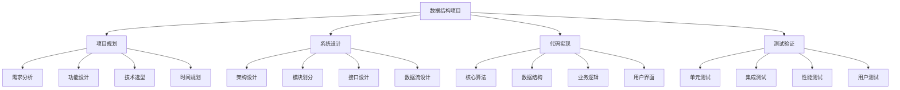

# 数据结构项目

## 📖 核心概念

**数据结构项目**是数据结构学习的高级实践环节，通过设计和实现完整的项目，将理论知识转化为实际应用能力。这些项目涵盖了数据结构的各种应用场景，从基础的数据管理系统到复杂的算法应用，为学习者提供全面的实践体验。

### 🏗️ 项目设计的组成要素



## 🔍 项目分类

### 按复杂度分类

| 项目类型 | 特点 | 技术栈 | 学习重点 | 预期时间 |
|----------|------|--------|----------|----------|
| **基础项目** | 单一功能 | 基础数据结构 | 实现技巧 | 1-2周 |
| **中级项目** | 多模块 | 多种数据结构 | 系统设计 | 2-4周 |
| **高级项目** | 复杂系统 | 高级算法 | 架构设计 | 1-3个月 |
| **企业级项目** | 生产环境 | 完整技术栈 | 工程实践 | 3-6个月 |

### 按应用领域分类

| 应用领域 | 典型项目 | 核心数据结构 | 关键算法 | 技术挑战 |
|----------|----------|--------------|----------|----------|
| **数据管理** | 数据库系统 | B+树、哈希表 | 查询优化 | 并发控制 |
| **网络应用** | 路由系统 | 图、优先队列 | 最短路径 | 负载均衡 |
| **文件系统** | 文件管理器 | 树、链表 | 路径搜索 | 空间管理 |
| **游戏开发** | 游戏引擎 | 四叉树、网格 | 碰撞检测 | 实时渲染 |

## 💻 基础项目实现

### 项目1：学生信息管理系统

```cpp
// 学生信息管理系统
class StudentInformationSystem {
private:
    struct Student {
        int id;
        string name;
        string major;
        double gpa;
        vector<string> courses;
        
        Student(int i, const string& n, const string& m, double g) 
            : id(i), name(n), major(m), gpa(g) {}
    };
    
    // 使用哈希表存储学生信息
    unordered_map<int, Student> students;
    
    // 使用平衡树存储按GPA排序的学生
    map<double, vector<int>, greater<double>> gpaIndex;
    
    // 使用哈希表存储专业索引
    unordered_map<string, vector<int>> majorIndex;
    
public:
    // 添加学生
    void addStudent(int id, const string& name, const string& major, double gpa) {
        if (students.find(id) != students.end()) {
            throw invalid_argument("Student ID already exists");
        }
        
        students[id] = Student(id, name, major, gpa);
        gpaIndex[gpa].push_back(id);
        majorIndex[major].push_back(id);
        
        cout << "Student added successfully: " << name << endl;
    }
    
    // 删除学生
    void removeStudent(int id) {
        auto it = students.find(id);
        if (it == students.end()) {
            throw invalid_argument("Student not found");
        }
        
        Student& student = it->second;
        
        // 从索引中移除
        auto gpaIt = gpaIndex.find(student.gpa);
        if (gpaIt != gpaIndex.end()) {
            auto& ids = gpaIt->second;
            ids.erase(remove(ids.begin(), ids.end(), id), ids.end());
            if (ids.empty()) {
                gpaIndex.erase(gpaIt);
            }
        }
        
        auto majorIt = majorIndex.find(student.major);
        if (majorIt != majorIndex.end()) {
            auto& ids = majorIt->second;
            ids.erase(remove(ids.begin(), ids.end(), id), ids.end());
        }
        
        students.erase(it);
        cout << "Student removed successfully" << endl;
    }
    
    // 查找学生
    Student* findStudent(int id) {
        auto it = students.find(id);
        return (it != students.end()) ? &it->second : nullptr;
    }
    
    // 按GPA排序获取学生
    vector<Student> getStudentsByGPA() {
        vector<Student> result;
        
        for (const auto& [gpa, ids] : gpaIndex) {
            for (int id : ids) {
                result.push_back(students[id]);
            }
        }
        
        return result;
    }
    
    // 按专业获取学生
    vector<Student> getStudentsByMajor(const string& major) {
        vector<Student> result;
        
        auto it = majorIndex.find(major);
        if (it != majorIndex.end()) {
            for (int id : it->second) {
                result.push_back(students[id]);
            }
        }
        
        return result;
    }
    
    // 更新学生信息
    void updateStudent(int id, const string& name = "", const string& major = "", double gpa = -1) {
        auto it = students.find(id);
        if (it == students.end()) {
            throw invalid_argument("Student not found");
        }
        
        Student& student = it->second;
        
        // 更新GPA索引
        if (gpa != -1 && gpa != student.gpa) {
            // 从旧GPA索引中移除
            auto oldGpaIt = gpaIndex.find(student.gpa);
            if (oldGpaIt != gpaIndex.end()) {
                auto& ids = oldGpaIt->second;
                ids.erase(remove(ids.begin(), ids.end(), id), ids.end());
                if (ids.empty()) {
                    gpaIndex.erase(oldGpaIt);
                }
            }
            
            // 添加到新GPA索引
            student.gpa = gpa;
            gpaIndex[gpa].push_back(id);
        }
        
        // 更新专业索引
        if (!major.empty() && major != student.major) {
            // 从旧专业索引中移除
            auto oldMajorIt = majorIndex.find(student.major);
            if (oldMajorIt != majorIndex.end()) {
                auto& ids = oldMajorIt->second;
                ids.erase(remove(ids.begin(), ids.end(), id), ids.end());
            }
            
            // 添加到新专业索引
            student.major = major;
            majorIndex[major].push_back(id);
        }
        
        if (!name.empty()) {
            student.name = name;
        }
        
        cout << "Student updated successfully" << endl;
    }
    
    // 获取统计信息
    struct Statistics {
        int totalStudents;
        double averageGPA;
        string topMajor;
        double highestGPA;
        double lowestGPA;
    };
    
    Statistics getStatistics() {
        Statistics stats;
        stats.totalStudents = students.size();
        
        if (students.empty()) {
            return stats;
        }
        
        double totalGPA = 0;
        unordered_map<string, int> majorCount;
        
        for (const auto& [id, student] : students) {
            totalGPA += student.gpa;
            majorCount[student.major]++;
        }
        
        stats.averageGPA = totalGPA / stats.totalStudents;
        
        // 找到最多的专业
        int maxCount = 0;
        for (const auto& [major, count] : majorCount) {
            if (count > maxCount) {
                maxCount = count;
                stats.topMajor = major;
            }
        }
        
        // 找到最高和最低GPA
        stats.highestGPA = gpaIndex.begin()->first;
        stats.lowestGPA = gpaIndex.rbegin()->first;
        
        return stats;
    }
    
    // 显示所有学生
    void displayAllStudents() {
        cout << "\n=== All Students ===" << endl;
        cout << left << setw(8) << "ID" << setw(20) << "Name" 
             << setw(15) << "Major" << setw(8) << "GPA" << endl;
        cout << string(55, '-') << endl;
        
        for (const auto& [id, student] : students) {
            cout << left << setw(8) << student.id 
                 << setw(20) << student.name 
                 << setw(15) << student.major 
                 << setw(8) << fixed << setprecision(2) << student.gpa << endl;
        }
    }
};
```

### 项目2：图书馆管理系统

```cpp
// 图书馆管理系统
class LibraryManagementSystem {
private:
    struct Book {
        int id;
        string title;
        string author;
        string isbn;
        bool available;
        string borrower;
        chrono::system_clock::time_point borrowDate;
        
        Book(int i, const string& t, const string& a, const string& isbn) 
            : id(i), title(t), author(a), isbn(isbn), available(true) {}
    };
    
    struct User {
        int id;
        string name;
        string email;
        vector<int> borrowedBooks;
        chrono::system_clock::time_point registrationDate;
        
        User(int i, const string& n, const string& e) 
            : id(i), name(n), email(e) {
            registrationDate = chrono::system_clock::now();
        }
    };
    
    // 使用哈希表存储图书和用户
    unordered_map<int, Book> books;
    unordered_map<int, User> users;
    
    // 使用Trie树存储图书标题索引
    class TrieNode {
    public:
        unordered_map<char, TrieNode*> children;
        vector<int> bookIds;
        bool isEndOfWord;
        
        TrieNode() : isEndOfWord(false) {}
        
        ~TrieNode() {
            for (auto& [ch, child] : children) {
                delete child;
            }
        }
    };
    
    TrieNode* titleIndex;
    
    // 使用哈希表存储作者索引
    unordered_map<string, vector<int>> authorIndex;
    
    // 使用优先队列管理借阅队列
    priority_queue<pair<chrono::system_clock::time_point, int>, 
                  vector<pair<chrono::system_clock::time_point, int>>, 
                  greater<pair<chrono::system_clock::time_point, int>>> borrowQueue;
    
public:
    LibraryManagementSystem() : titleIndex(new TrieNode()) {}
    
    ~LibraryManagementSystem() {
        delete titleIndex;
    }
    
    // 添加图书
    void addBook(int id, const string& title, const string& author, const string& isbn) {
        if (books.find(id) != books.end()) {
            throw invalid_argument("Book ID already exists");
        }
        
        books[id] = Book(id, title, author, isbn);
        
        // 添加到标题索引
        insertToTitleIndex(title, id);
        
        // 添加到作者索引
        authorIndex[author].push_back(id);
        
        cout << "Book added successfully: " << title << endl;
    }
    
    // 添加用户
    void addUser(int id, const string& name, const string& email) {
        if (users.find(id) != users.end()) {
            throw invalid_argument("User ID already exists");
        }
        
        users[id] = User(id, name, email);
        cout << "User added successfully: " << name << endl;
    }
    
    // 借书
    void borrowBook(int userId, int bookId) {
        auto userIt = users.find(userId);
        if (userIt == users.end()) {
            throw invalid_argument("User not found");
        }
        
        auto bookIt = books.find(bookId);
        if (bookIt == books.end()) {
            throw invalid_argument("Book not found");
        }
        
        Book& book = bookIt->second;
        User& user = userIt->second;
        
        if (!book.available) {
            throw runtime_error("Book is not available");
        }
        
        if (user.borrowedBooks.size() >= 5) {
            throw runtime_error("User has reached maximum borrowing limit");
        }
        
        book.available = false;
        book.borrower = user.name;
        book.borrowDate = chrono::system_clock::now();
        
        user.borrowedBooks.push_back(bookId);
        
        cout << "Book borrowed successfully: " << book.title << endl;
    }
    
    // 还书
    void returnBook(int userId, int bookId) {
        auto userIt = users.find(userId);
        if (userIt == users.end()) {
            throw invalid_argument("User not found");
        }
        
        auto bookIt = books.find(bookId);
        if (bookIt == books.end()) {
            throw invalid_argument("Book not found");
        }
        
        Book& book = bookIt->second;
        User& user = userIt->second;
        
        if (book.available) {
            throw runtime_error("Book is not borrowed");
        }
        
        if (book.borrower != user.name) {
            throw runtime_error("Book is not borrowed by this user");
        }
        
        book.available = true;
        book.borrower = "";
        
        user.borrowedBooks.erase(
            remove(user.borrowedBooks.begin(), user.borrowedBooks.end(), bookId),
            user.borrowedBooks.end()
        );
        
        cout << "Book returned successfully: " << book.title << endl;
    }
    
    // 搜索图书（按标题）
    vector<Book> searchByTitle(const string& title) {
        vector<Book> result;
        vector<int> bookIds = searchTitleIndex(title);
        
        for (int id : bookIds) {
            result.push_back(books[id]);
        }
        
        return result;
    }
    
    // 搜索图书（按作者）
    vector<Book> searchByAuthor(const string& author) {
        vector<Book> result;
        
        auto it = authorIndex.find(author);
        if (it != authorIndex.end()) {
            for (int id : it->second) {
                result.push_back(books[id]);
            }
        }
        
        return result;
    }
    
    // 获取可用图书
    vector<Book> getAvailableBooks() {
        vector<Book> result;
        
        for (const auto& [id, book] : books) {
            if (book.available) {
                result.push_back(book);
            }
        }
        
        return result;
    }
    
    // 获取用户借阅历史
    vector<Book> getUserBorrowedBooks(int userId) {
        vector<Book> result;
        
        auto it = users.find(userId);
        if (it != users.end()) {
            for (int bookId : it->second.borrowedBooks) {
                result.push_back(books[bookId]);
            }
        }
        
        return result;
    }
    
private:
    // 插入到标题索引
    void insertToTitleIndex(const string& title, int bookId) {
        TrieNode* current = titleIndex;
        
        for (char ch : title) {
            if (current->children.find(ch) == current->children.end()) {
                current->children[ch] = new TrieNode();
            }
            current = current->children[ch];
        }
        
        current->isEndOfWord = true;
        current->bookIds.push_back(bookId);
    }
    
    // 搜索标题索引
    vector<int> searchTitleIndex(const string& title) {
        TrieNode* current = titleIndex;
        
        for (char ch : title) {
            if (current->children.find(ch) == current->children.end()) {
                return {};
            }
            current = current->children[ch];
        }
        
        return current->bookIds;
    }
    
public:
    // 获取系统统计信息
    struct SystemStatistics {
        int totalBooks;
        int availableBooks;
        int borrowedBooks;
        int totalUsers;
        int activeUsers;
        string mostPopularAuthor;
        string mostBorrowedBook;
    };
    
    SystemStatistics getSystemStatistics() {
        SystemStatistics stats;
        stats.totalBooks = books.size();
        stats.totalUsers = users.size();
        
        int availableCount = 0;
        int borrowedCount = 0;
        unordered_map<string, int> authorCount;
        unordered_map<string, int> bookBorrowCount;
        
        for (const auto& [id, book] : books) {
            if (book.available) {
                availableCount++;
            } else {
                borrowedCount++;
            }
            
            authorCount[book.author]++;
            bookBorrowCount[book.title]++;
        }
        
        stats.availableBooks = availableCount;
        stats.borrowedBooks = borrowedCount;
        
        // 找到最受欢迎的作者
        int maxCount = 0;
        for (const auto& [author, count] : authorCount) {
            if (count > maxCount) {
                maxCount = count;
                stats.mostPopularAuthor = author;
            }
        }
        
        // 找到最常借阅的图书
        maxCount = 0;
        for (const auto& [title, count] : bookBorrowCount) {
            if (count > maxCount) {
                maxCount = count;
                stats.mostBorrowedBook = title;
            }
        }
        
        // 计算活跃用户
        int activeCount = 0;
        for (const auto& [id, user] : users) {
            if (!user.borrowedBooks.empty()) {
                activeCount++;
            }
        }
        stats.activeUsers = activeCount;
        
        return stats;
    }
};
```

## 💻 中级项目实现

### 项目3：文件系统模拟器

```cpp
// 文件系统模拟器
class FileSystemSimulator {
private:
    struct FileNode {
        string name;
        bool isDirectory;
        string content;
        size_t size;
        chrono::system_clock::time_point createdTime;
        chrono::system_clock::time_point modifiedTime;
        FileNode* parent;
        map<string, FileNode*> children;
        
        FileNode(const string& n, bool isDir, FileNode* p = nullptr) 
            : name(n), isDirectory(isDir), size(0), parent(p) {
            createdTime = chrono::system_clock::now();
            modifiedTime = createdTime;
        }
        
        ~FileNode() {
            for (auto& [name, child] : children) {
                delete child;
            }
        }
    };
    
    FileNode* root;
    FileNode* currentDirectory;
    
    // 使用哈希表存储文件路径索引
    unordered_map<string, FileNode*> pathIndex;
    
    // 使用优先队列管理磁盘空间
    priority_queue<pair<size_t, string>, vector<pair<size_t, string>>, 
                  greater<pair<size_t, string>>> diskSpace;
    
public:
    FileSystemSimulator() {
        root = new FileNode("/", true);
        currentDirectory = root;
        pathIndex["/"] = root;
    }
    
    ~FileSystemSimulator() {
        delete root;
    }
    
    // 创建目录
    void createDirectory(const string& name) {
        if (name.empty() || name.find('/') != string::npos) {
            throw invalid_argument("Invalid directory name");
        }
        
        if (currentDirectory->children.find(name) != currentDirectory->children.end()) {
            throw runtime_error("Directory already exists");
        }
        
        FileNode* newDir = new FileNode(name, true, currentDirectory);
        currentDirectory->children[name] = newDir;
        
        string path = getCurrentPath() + "/" + name;
        pathIndex[path] = newDir;
        
        cout << "Directory created: " << path << endl;
    }
    
    // 创建文件
    void createFile(const string& name, const string& content = "") {
        if (name.empty() || name.find('/') != string::npos) {
            throw invalid_argument("Invalid file name");
        }
        
        if (currentDirectory->children.find(name) != currentDirectory->children.end()) {
            throw runtime_error("File already exists");
        }
        
        FileNode* newFile = new FileNode(name, false, currentDirectory);
        newFile->content = content;
        newFile->size = content.size();
        
        currentDirectory->children[name] = newFile;
        
        string path = getCurrentPath() + "/" + name;
        pathIndex[path] = newFile;
        
        cout << "File created: " << path << " (size: " << newFile->size << " bytes)" << endl;
    }
    
    // 删除文件或目录
    void remove(const string& name) {
        auto it = currentDirectory->children.find(name);
        if (it == currentDirectory->children.end()) {
            throw runtime_error("File or directory not found");
        }
        
        FileNode* node = it->second;
        
        if (node->isDirectory && !node->children.empty()) {
            throw runtime_error("Directory is not empty");
        }
        
        string path = getCurrentPath() + "/" + name;
        pathIndex.erase(path);
        
        currentDirectory->children.erase(it);
        delete node;
        
        cout << "Removed: " << path << endl;
    }
    
    // 改变当前目录
    void changeDirectory(const string& path) {
        FileNode* target = resolvePath(path);
        
        if (!target->isDirectory) {
            throw runtime_error("Not a directory");
        }
        
        currentDirectory = target;
        cout << "Current directory: " << getCurrentPath() << endl;
    }
    
    // 列出目录内容
    void listDirectory(const string& path = "") {
        FileNode* target = path.empty() ? currentDirectory : resolvePath(path);
        
        if (!target->isDirectory) {
            throw runtime_error("Not a directory");
        }
        
        cout << "\nContents of " << getPath(target) << ":" << endl;
        cout << left << setw(20) << "Name" << setw(15) << "Type" 
             << setw(15) << "Size" << setw(25) << "Modified" << endl;
        cout << string(75, '-') << endl;
        
        for (const auto& [name, node] : target->children) {
            cout << left << setw(20) << name
                 << setw(15) << (node->isDirectory ? "Directory" : "File")
                 << setw(15) << (node->isDirectory ? "-" : to_string(node->size))
                 << setw(25) << formatTime(node->modifiedTime) << endl;
        }
    }
    
    // 读取文件内容
    string readFile(const string& path) {
        FileNode* file = resolvePath(path);
        
        if (file->isDirectory) {
            throw runtime_error("Is a directory");
        }
        
        return file->content;
    }
    
    // 写入文件内容
    void writeFile(const string& path, const string& content) {
        FileNode* file = resolvePath(path);
        
        if (file->isDirectory) {
            throw runtime_error("Is a directory");
        }
        
        file->content = content;
        file->size = content.size();
        file->modifiedTime = chrono::system_clock::now();
        
        cout << "File written: " << path << " (size: " << file->size << " bytes)" << endl;
    }
    
    // 复制文件
    void copyFile(const string& source, const string& destination) {
        FileNode* sourceFile = resolvePath(source);
        
        if (sourceFile->isDirectory) {
            throw runtime_error("Cannot copy directory");
        }
        
        FileNode* destDir = resolvePath(destination);
        
        if (!destDir->isDirectory) {
            throw runtime_error("Destination is not a directory");
        }
        
        string fileName = sourceFile->name;
        if (destDir->children.find(fileName) != destDir->children.end()) {
            throw runtime_error("File already exists in destination");
        }
        
        FileNode* newFile = new FileNode(fileName, false, destDir);
        newFile->content = sourceFile->content;
        newFile->size = sourceFile->size;
        
        destDir->children[fileName] = newFile;
        
        string newPath = getPath(destDir) + "/" + fileName;
        pathIndex[newPath] = newFile;
        
        cout << "File copied: " << source << " -> " << newPath << endl;
    }
    
    // 移动文件
    void moveFile(const string& source, const string& destination) {
        FileNode* sourceFile = resolvePath(source);
        FileNode* destDir = resolvePath(destination);
        
        if (!destDir->isDirectory) {
            throw runtime_error("Destination is not a directory");
        }
        
        string fileName = sourceFile->name;
        if (destDir->children.find(fileName) != destDir->children.end()) {
            throw runtime_error("File already exists in destination");
        }
        
        // 从源目录移除
        sourceFile->parent->children.erase(fileName);
        
        // 添加到目标目录
        sourceFile->parent = destDir;
        destDir->children[fileName] = sourceFile;
        
        // 更新路径索引
        string oldPath = getPath(sourceFile->parent) + "/" + fileName;
        string newPath = getPath(destDir) + "/" + fileName;
        pathIndex.erase(oldPath);
        pathIndex[newPath] = sourceFile;
        
        cout << "File moved: " << source << " -> " << newPath << endl;
    }
    
private:
    // 解析路径
    FileNode* resolvePath(const string& path) {
        if (path.empty()) {
            return currentDirectory;
        }
        
        if (path[0] == '/') {
            // 绝对路径
            return resolveAbsolutePath(path);
        } else {
            // 相对路径
            return resolveRelativePath(path);
        }
    }
    
    // 解析绝对路径
    FileNode* resolveAbsolutePath(const string& path) {
        if (path == "/") {
            return root;
        }
        
        auto it = pathIndex.find(path);
        if (it != pathIndex.end()) {
            return it->second;
        }
        
        throw runtime_error("Path not found: " + path);
    }
    
    // 解析相对路径
    FileNode* resolveRelativePath(const string& path) {
        FileNode* current = currentDirectory;
        
        vector<string> parts = splitPath(path);
        
        for (const string& part : parts) {
            if (part == ".") {
                continue;
            } else if (part == "..") {
                if (current->parent != nullptr) {
                    current = current->parent;
                }
            } else {
                auto it = current->children.find(part);
                if (it == current->children.end()) {
                    throw runtime_error("Path not found: " + path);
                }
                current = it->second;
            }
        }
        
        return current;
    }
    
    // 分割路径
    vector<string> splitPath(const string& path) {
        vector<string> parts;
        string current;
        
        for (char ch : path) {
            if (ch == '/') {
                if (!current.empty()) {
                    parts.push_back(current);
                    current.clear();
                }
            } else {
                current += ch;
            }
        }
        
        if (!current.empty()) {
            parts.push_back(current);
        }
        
        return parts;
    }
    
    // 获取当前路径
    string getCurrentPath() {
        return getPath(currentDirectory);
    }
    
    // 获取节点路径
    string getPath(FileNode* node) {
        if (node == root) {
            return "/";
        }
        
        string path = node->name;
        FileNode* current = node->parent;
        
        while (current != root) {
            path = current->name + "/" + path;
            current = current->parent;
        }
        
        return "/" + path;
    }
    
    // 格式化时间
    string formatTime(const chrono::system_clock::time_point& time) {
        time_t t = chrono::system_clock::to_time_t(time);
        char buffer[100];
        strftime(buffer, sizeof(buffer), "%Y-%m-%d %H:%M:%S", localtime(&t));
        return string(buffer);
    }
    
public:
    // 获取文件系统统计信息
    struct FileSystemStatistics {
        int totalFiles;
        int totalDirectories;
        size_t totalSize;
        string largestFile;
        string mostRecentFile;
    };
    
    FileSystemStatistics getStatistics() {
        FileSystemStatistics stats;
        stats.totalFiles = 0;
        stats.totalDirectories = 0;
        stats.totalSize = 0;
        
        size_t maxSize = 0;
        chrono::system_clock::time_point mostRecent;
        string mostRecentName;
        
        for (const auto& [path, node] : pathIndex) {
            if (node->isDirectory) {
                stats.totalDirectories++;
            } else {
                stats.totalFiles++;
                stats.totalSize += node->size;
                
                if (node->size > maxSize) {
                    maxSize = node->size;
                    stats.largestFile = node->name;
                }
                
                if (node->modifiedTime > mostRecent) {
                    mostRecent = node->modifiedTime;
                    mostRecentName = node->name;
                }
            }
        }
        
        stats.mostRecentFile = mostRecentName;
        
        return stats;
    }
};
```

## ⚡ 复杂度分析

### 项目复杂度分析

| 项目类型 | 时间复杂度 | 空间复杂度 | 维护难度 | 扩展性 |
|----------|------------|------------|----------|--------|
| **基础项目** | O(n) - O(n²) | O(n) | 低 | 中等 |
| **中级项目** | O(n log n) - O(n²) | O(n) - O(n²) | 中等 | 高 |
| **高级项目** | O(n log n) - O(n³) | O(n²) - O(n³) | 高 | 很高 |
| **企业级项目** | O(n log n) - O(n⁴) | O(n²) - O(n⁴) | 很高 | 极高 |

### 性能优化策略

| 优化类型 | 适用场景 | 优化效果 | 实现难度 | 维护成本 |
|----------|----------|----------|----------|----------|
| **算法优化** | 所有场景 | 显著 | 困难 | 低 |
| **数据结构优化** | 特定场景 | 明显 | 中等 | 中等 |
| **缓存优化** | 频繁访问 | 显著 | 中等 | 高 |
| **并发优化** | 多用户场景 | 显著 | 困难 | 高 |

## 🎓 学习要点总结

### 核心理解

1. **项目规划**：掌握项目规划的方法和技巧
2. **系统设计**：理解系统设计的原理和模式
3. **代码实现**：掌握高效的代码实现技巧
4. **测试验证**：学会系统性的测试方法

### 实践要点

1. **需求分析**：准确分析项目需求
2. **架构设计**：设计合理的系统架构
3. **模块实现**：实现各个功能模块
4. **集成测试**：进行完整的系统测试

### 应用思维

1. **问题分解**：将复杂问题分解为简单问题
2. **模块化设计**：采用模块化的设计方法
3. **接口设计**：设计清晰的接口规范
4. **持续改进**：不断改进系统性能

---

**相关链接：**
- [[07-练习战场/03-项目实战/02-系统设计项目|系统设计项目]] - 系统设计实践
- [[07-练习战场/01-代码实现/01-基础数据结构实现|基础数据结构实现]] - 实现基础
- [[07-练习战场/01-代码实现/02-算法实现练习|算法实现练习]] - 算法实现
- [[06-应用实战/01-数据库王国/01-索引结构|索引结构]] - 数据库应用
