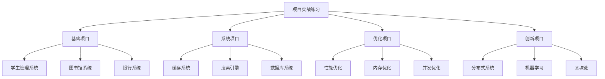

# 项目实战练习

## 📖 核心概念

**项目实战练习**是将数据结构知识应用到实际项目中的重要环节。通过完整的项目实现，可以深入理解数据结构的实际应用，提高系统设计能力。

### 🏗️ 项目分类



## 🔧 学生管理系统

### 系统设计

```cpp
#include <iostream>
#include <string>
#include <vector>
#include <map>
#include <algorithm>
using namespace std;

class Student {
private:
    int id;
    string name;
    int age;
    string major;
    double gpa;
    
public:
    Student(int i, const string& n, int a, const string& m, double g) 
        : id(i), name(n), age(a), major(m), gpa(g) {}
    
    // Getters
    int getId() const { return id; }
    string getName() const { return name; }
    int getAge() const { return age; }
    string getMajor() const { return major; }
    double getGpa() const { return gpa; }
    
    // Setters
    void setName(const string& n) { name = n; }
    void setAge(int a) { age = a; }
    void setMajor(const string& m) { major = m; }
    void setGpa(double g) { gpa = g; }
    
    void display() const {
        cout << "ID: " << id << ", Name: " << name 
             << ", Age: " << age << ", Major: " << major 
             << ", GPA: " << gpa << endl;
    }
};

class StudentManagementSystem {
private:
    map<int, Student> students;
    int nextId;
    
public:
    StudentManagementSystem() : nextId(1) {}
    
    // 添加学生
    void addStudent(const string& name, int age, const string& major, double gpa) {
        Student student(nextId++, name, age, major, gpa);
        students[student.getId()] = student;
        cout << "Student added successfully!" << endl;
    }
    
    // 删除学生
    bool removeStudent(int id) {
        auto it = students.find(id);
        if (it != students.end()) {
            students.erase(it);
            cout << "Student removed successfully!" << endl;
            return true;
        }
        cout << "Student not found!" << endl;
        return false;
    }
    
    // 查找学生
    Student* findStudent(int id) {
        auto it = students.find(id);
        if (it != students.end()) {
            return &it->second;
        }
        return nullptr;
    }
    
    // 更新学生信息
    bool updateStudent(int id, const string& name, int age, const string& major, double gpa) {
        auto it = students.find(id);
        if (it != students.end()) {
            it->second.setName(name);
            it->second.setAge(age);
            it->second.setMajor(major);
            it->second.setGpa(gpa);
            cout << "Student updated successfully!" << endl;
            return true;
        }
        cout << "Student not found!" << endl;
        return false;
    }
    
    // 显示所有学生
    void displayAllStudents() {
        if (students.empty()) {
            cout << "No students found!" << endl;
            return;
        }
        
        cout << "All Students:" << endl;
        for (const auto& pair : students) {
            pair.second.display();
        }
    }
    
    // 按GPA排序
    void displayStudentsByGpa() {
        vector<Student> studentList;
        for (const auto& pair : students) {
            studentList.push_back(pair.second);
        }
        
        sort(studentList.begin(), studentList.end(), 
             [](const Student& a, const Student& b) {
                 return a.getGpa() > b.getGpa();
             });
        
        cout << "Students sorted by GPA:" << endl;
        for (const Student& student : studentList) {
            student.display();
        }
    }
    
    // 按专业统计
    void displayMajorStatistics() {
        map<string, int> majorCount;
        map<string, double> majorGpaSum;
        
        for (const auto& pair : students) {
            string major = pair.second.getMajor();
            majorCount[major]++;
            majorGpaSum[major] += pair.second.getGpa();
        }
        
        cout << "Major Statistics:" << endl;
        for (const auto& pair : majorCount) {
            string major = pair.first;
            int count = pair.second;
            double avgGpa = majorGpaSum[major] / count;
            cout << major << ": " << count << " students, Average GPA: " 
                 << avgGpa << endl;
        }
    }
    
    // 获取系统统计
    void getSystemStatistics() {
        cout << "System Statistics:" << endl;
        cout << "Total students: " << students.size() << endl;
        
        if (!students.empty()) {
            double totalGpa = 0;
            int minAge = INT_MAX, maxAge = INT_MIN;
            
            for (const auto& pair : students) {
                totalGpa += pair.second.getGpa();
                minAge = min(minAge, pair.second.getAge());
                maxAge = max(maxAge, pair.second.getAge());
            }
            
            cout << "Average GPA: " << totalGpa / students.size() << endl;
            cout << "Age range: " << minAge << " - " << maxAge << endl;
        }
    }
};

// 测试函数
void testStudentManagementSystem() {
    cout << "Testing Student Management System..." << endl;
    
    StudentManagementSystem system;
    
    // 添加学生
    system.addStudent("Alice", 20, "Computer Science", 3.8);
    system.addStudent("Bob", 21, "Mathematics", 3.5);
    system.addStudent("Charlie", 19, "Computer Science", 3.9);
    system.addStudent("Diana", 22, "Physics", 3.7);
    
    cout << endl;
    
    // 显示所有学生
    system.displayAllStudents();
    cout << endl;
    
    // 按GPA排序
    system.displayStudentsByGpa();
    cout << endl;
    
    // 专业统计
    system.displayMajorStatistics();
    cout << endl;
    
    // 系统统计
    system.getSystemStatistics();
    cout << endl;
    
    // 查找学生
    Student* student = system.findStudent(2);
    if (student) {
        cout << "Found student: ";
        student->display();
    }
    
    cout << "Student Management System test completed!" << endl;
}
```

## 🎯 图书馆管理系统

### 系统实现

```cpp
class Book {
private:
    int id;
    string title;
    string author;
    string isbn;
    bool available;
    
public:
    Book(int i, const string& t, const string& a, const string& isbn) 
        : id(i), title(t), author(a), isbn(isbn), available(true) {}
    
    int getId() const { return id; }
    string getTitle() const { return title; }
    string getAuthor() const { return author; }
    string getIsbn() const { return isbn; }
    bool isAvailable() const { return available; }
    
    void setAvailable(bool avail) { available = avail; }
    
    void display() const {
        cout << "ID: " << id << ", Title: " << title 
             << ", Author: " << author << ", ISBN: " << isbn
             << ", Available: " << (available ? "Yes" : "No") << endl;
    }
};

class LibrarySystem {
private:
    map<int, Book> books;
    map<int, vector<int>> userBorrowedBooks;  // user_id -> book_ids
    int nextBookId;
    
public:
    LibrarySystem() : nextBookId(1) {}
    
    // 添加图书
    void addBook(const string& title, const string& author, const string& isbn) {
        Book book(nextBookId++, title, author, isbn);
        books[book.getId()] = book;
        cout << "Book added successfully!" << endl;
    }
    
    // 借书
    bool borrowBook(int userId, int bookId) {
        auto bookIt = books.find(bookId);
        if (bookIt != books.end() && bookIt->second.isAvailable()) {
            bookIt->second.setAvailable(false);
            userBorrowedBooks[userId].push_back(bookId);
            cout << "Book borrowed successfully!" << endl;
            return true;
        }
        cout << "Book not available!" << endl;
        return false;
    }
    
    // 还书
    bool returnBook(int userId, int bookId) {
        auto userIt = userBorrowedBooks.find(userId);
        if (userIt != userBorrowedBooks.end()) {
            auto bookIt = find(userIt->second.begin(), userIt->second.end(), bookId);
            if (bookIt != userIt->second.end()) {
                userIt->second.erase(bookIt);
                books[bookId].setAvailable(true);
                cout << "Book returned successfully!" << endl;
                return true;
            }
        }
        cout << "Book not found in user's borrowed list!" << endl;
        return false;
    }
    
    // 搜索图书
    vector<Book> searchBooks(const string& keyword) {
        vector<Book> results;
        
        for (const auto& pair : books) {
            const Book& book = pair.second;
            if (book.getTitle().find(keyword) != string::npos ||
                book.getAuthor().find(keyword) != string::npos ||
                book.getIsbn().find(keyword) != string::npos) {
                results.push_back(book);
            }
        }
        
        return results;
    }
    
    // 显示所有图书
    void displayAllBooks() {
        if (books.empty()) {
            cout << "No books found!" << endl;
            return;
        }
        
        cout << "All Books:" << endl;
        for (const auto& pair : books) {
            pair.second.display();
        }
    }
    
    // 显示用户借阅记录
    void displayUserBorrowedBooks(int userId) {
        auto it = userBorrowedBooks.find(userId);
        if (it != userBorrowedBooks.end() && !it->second.empty()) {
            cout << "User " << userId << " borrowed books:" << endl;
            for (int bookId : it->second) {
                books[bookId].display();
            }
        } else {
            cout << "User " << userId << " has no borrowed books." << endl;
        }
    }
    
    // 获取图书馆统计
    void getLibraryStatistics() {
        int totalBooks = books.size();
        int availableBooks = 0;
        int borrowedBooks = 0;
        
        for (const auto& pair : books) {
            if (pair.second.isAvailable()) {
                availableBooks++;
            } else {
                borrowedBooks++;
            }
        }
        
        cout << "Library Statistics:" << endl;
        cout << "Total books: " << totalBooks << endl;
        cout << "Available books: " << availableBooks << endl;
        cout << "Borrowed books: " << borrowedBooks << endl;
        cout << "Active borrowers: " << userBorrowedBooks.size() << endl;
    }
};

// 测试函数
void testLibrarySystem() {
    cout << "Testing Library System..." << endl;
    
    LibrarySystem library;
    
    // 添加图书
    library.addBook("The Great Gatsby", "F. Scott Fitzgerald", "978-0-7432-7356-5");
    library.addBook("To Kill a Mockingbird", "Harper Lee", "978-0-06-112008-4");
    library.addBook("1984", "George Orwell", "978-0-452-28423-4");
    
    cout << endl;
    
    // 显示所有图书
    library.displayAllBooks();
    cout << endl;
    
    // 借书
    library.borrowBook(1, 1);
    library.borrowBook(1, 2);
    library.borrowBook(2, 3);
    
    cout << endl;
    
    // 显示用户借阅记录
    library.displayUserBorrowedBooks(1);
    cout << endl;
    
    // 搜索图书
    vector<Book> results = library.searchBooks("Gatsby");
    cout << "Search results for 'Gatsby':" << endl;
    for (const Book& book : results) {
        book.display();
    }
    
    cout << endl;
    
    // 图书馆统计
    library.getLibraryStatistics();
    
    cout << "Library System test completed!" << endl;
}
```

## 📊 缓存系统项目

### 高性能缓存实现

```cpp
template<typename K, typename V>
class HighPerformanceCache {
private:
    struct CacheNode {
        K key;
        V value;
        time_t timestamp;
        int accessCount;
        CacheNode* prev;
        CacheNode* next;
        
        CacheNode(K k, V v) : key(k), value(v), timestamp(time(nullptr)), 
                             accessCount(1), prev(nullptr), next(nullptr) {}
    };
    
    unordered_map<K, CacheNode*> cache;
    CacheNode* head;
    CacheNode* tail;
    int capacity;
    int hitCount;
    int missCount;
    
    void addToHead(CacheNode* node) {
        node->prev = head;
        node->next = head->next;
        head->next->prev = node;
        head->next = node;
    }
    
    void removeNode(CacheNode* node) {
        node->prev->next = node->next;
        node->next->prev = node->prev;
    }
    
    void moveToHead(CacheNode* node) {
        removeNode(node);
        addToHead(node);
    }
    
    CacheNode* removeTail() {
        CacheNode* lastNode = tail->prev;
        removeNode(lastNode);
        return lastNode;
    }
    
public:
    HighPerformanceCache(int cap) : capacity(cap), hitCount(0), missCount(0) {
        head = new CacheNode(K{}, V{});
        tail = new CacheNode(K{}, V{});
        head->next = tail;
        tail->prev = head;
    }
    
    V get(K key) {
        if (cache.find(key) != cache.end()) {
            CacheNode* node = cache[key];
            node->accessCount++;
            node->timestamp = time(nullptr);
            moveToHead(node);
            hitCount++;
            return node->value;
        }
        missCount++;
        return V{};
    }
    
    void put(K key, V value) {
        if (cache.find(key) != cache.end()) {
            CacheNode* node = cache[key];
            node->value = value;
            node->accessCount++;
            node->timestamp = time(nullptr);
            moveToHead(node);
        } else {
            CacheNode* newNode = new CacheNode(key, value);
            
            if (cache.size() >= capacity) {
                CacheNode* tailNode = removeTail();
                cache.erase(tailNode->key);
                delete tailNode;
            }
            
            cache[key] = newNode;
            addToHead(newNode);
        }
    }
    
    void getCacheStatistics() {
        cout << "Cache Statistics:" << endl;
        cout << "Hit count: " << hitCount << endl;
        cout << "Miss count: " << missCount << endl;
        cout << "Hit rate: " << (double)hitCount / (hitCount + missCount) * 100 << "%" << endl;
        cout << "Cache size: " << cache.size() << "/" << capacity << endl;
    }
};
```

## 🔗 相关链接

- [[01-代码实现练习|代码实现练习]]
- [[02-算法挑战练习|算法挑战练习]]
- [[04-性能优化练习|性能优化练习]]

## 💡 项目实战要点

1. **系统设计**：合理的数据结构选择
2. **功能实现**：完整的业务逻辑
3. **性能优化**：高效的算法实现
4. **测试验证**：全面的功能测试

---

*📝 实战提示：通过项目实战深入理解数据结构的实际应用，提高系统设计能力*
