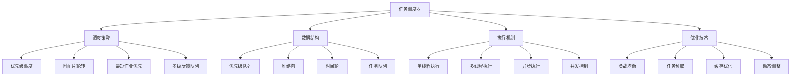

# 任务调度器

## 📖 核心概念

**任务调度器**是一个重要的系统组件，负责管理和执行各种任务。通过实现一个高效的任务调度器，可以深入理解优先级队列、堆数据结构、多线程编程等核心概念，掌握实际系统开发中的调度算法和优化技巧。

### 🏗️ 任务调度器分类



## 🔧 任务调度器实现

### 基础数据结构

```python
import heapq
import threading
import time
from datetime import datetime, timedelta
from enum import Enum
from typing import Callable, Any, Optional, List, Dict
import asyncio
from dataclasses import dataclass
from abc import ABC, abstractmethod

# 任务优先级枚举
class TaskPriority(Enum):
    LOW = 1
    NORMAL = 2
    HIGH = 3
    URGENT = 4

# 任务状态枚举
class TaskStatus(Enum):
    PENDING = "pending"
    RUNNING = "running"
    COMPLETED = "completed"
    FAILED = "failed"
    CANCELLED = "cancelled"

# 任务类
@dataclass
class Task:
    task_id: str
    name: str
    func: Callable
    args: tuple = ()
    kwargs: dict = None
    priority: TaskPriority = TaskPriority.NORMAL
    created_at: datetime = None
    scheduled_at: datetime = None
    started_at: datetime = None
    completed_at: datetime = None
    status: TaskStatus = TaskStatus.PENDING
    result: Any = None
    error: Exception = None
    retry_count: int = 0
    max_retries: int = 3
    timeout: Optional[float] = None
    
    def __post_init__(self):
        if self.kwargs is None:
            self.kwargs = {}
        if self.created_at is None:
            self.created_at = datetime.now()
        if self.scheduled_at is None:
            self.scheduled_at = self.created_at
    
    def __lt__(self, other):
        """用于优先级队列排序"""
        if self.priority.value != other.priority.value:
            return self.priority.value > other.priority.value
        return self.scheduled_at < other.scheduled_at
    
    def __str__(self):
        return f"Task({self.task_id}, {self.name}, {self.status.value})"

# 任务结果类
@dataclass
class TaskResult:
    task_id: str
    status: TaskStatus
    result: Any = None
    error: Exception = None
    execution_time: float = 0.0
    completed_at: datetime = None
    
    def __post_init__(self):
        if self.completed_at is None:
            self.completed_at = datetime.now()

# 任务调度器接口
class TaskScheduler(ABC):
    @abstractmethod
    def submit_task(self, task: Task) -> bool:
        """提交任务"""
        pass
    
    @abstractmethod
    def cancel_task(self, task_id: str) -> bool:
        """取消任务"""
        pass
    
    @abstractmethod
    def get_task_status(self, task_id: str) -> Optional[TaskStatus]:
        """获取任务状态"""
        pass
    
    @abstractmethod
    def get_task_result(self, task_id: str) -> Optional[TaskResult]:
        """获取任务结果"""
        pass
    
    @abstractmethod
    def shutdown(self, wait: bool = True):
        """关闭调度器"""
        pass
```

### 优先级队列调度器

```python
class PriorityQueueScheduler(TaskScheduler):
    def __init__(self, max_workers: int = 4):
        self.max_workers = max_workers
        self.task_queue = []
        self.task_results = {}
        self.running_tasks = {}
        self.worker_threads = []
        self.shutdown_flag = False
        self.lock = threading.Lock()
        self.condition = threading.Condition(self.lock)
        
        # 启动工作线程
        for i in range(max_workers):
            worker = threading.Thread(target=self._worker_loop, name=f"Worker-{i}")
            worker.daemon = True
            worker.start()
            self.worker_threads.append(worker)
    
    def submit_task(self, task: Task) -> bool:
        """提交任务到优先级队列"""
        with self.condition:
            if self.shutdown_flag:
                return False
            
            heapq.heappush(self.task_queue, task)
            self.task_results[task.task_id] = TaskResult(
                task_id=task.task_id,
                status=TaskStatus.PENDING
            )
            self.condition.notify()
            return True
    
    def cancel_task(self, task_id: str) -> bool:
        """取消任务"""
        with self.lock:
            if task_id in self.task_results:
                result = self.task_results[task_id]
                if result.status == TaskStatus.PENDING:
                    # 从队列中移除任务
                    new_queue = []
                    for task in self.task_queue:
                        if task.task_id != task_id:
                            new_queue.append(task)
                    heapq.heapify(new_queue)
                    self.task_queue = new_queue
                    
                    result.status = TaskStatus.CANCELLED
                    return True
                elif result.status == TaskStatus.RUNNING:
                    # 标记为取消，等待执行完成
                    result.status = TaskStatus.CANCELLED
                    return True
            return False
    
    def get_task_status(self, task_id: str) -> Optional[TaskStatus]:
        """获取任务状态"""
        with self.lock:
            if task_id in self.task_results:
                return self.task_results[task_id].status
            return None
    
    def get_task_result(self, task_id: str) -> Optional[TaskResult]:
        """获取任务结果"""
        with self.lock:
            return self.task_results.get(task_id)
    
    def _worker_loop(self):
        """工作线程主循环"""
        while not self.shutdown_flag:
            task = None
            
            with self.condition:
                # 等待任务或关闭信号
                while not self.task_queue and not self.shutdown_flag:
                    self.condition.wait(timeout=1.0)
                
                if self.shutdown_flag:
                    break
                
                if self.task_queue:
                    task = heapq.heappop(self.task_queue)
                    self.running_tasks[task.task_id] = task
            
            if task:
                self._execute_task(task)
    
    def _execute_task(self, task: Task):
        """执行任务"""
        task.status = TaskStatus.RUNNING
        task.started_at = datetime.now()
        
        result = self.task_results[task.task_id]
        result.status = TaskStatus.RUNNING
        
        try:
            # 执行任务函数
            if task.timeout:
                # 带超时的执行
                import signal
                
                def timeout_handler(signum, frame):
                    raise TimeoutError(f"Task {task.task_id} timed out")
                
                signal.signal(signal.SIGALRM, timeout_handler)
                signal.alarm(int(task.timeout))
                
                try:
                    task.result = task.func(*task.args, **task.kwargs)
                finally:
                    signal.alarm(0)
            else:
                task.result = task.func(*task.args, **task.kwargs)
            
            task.completed_at = datetime.now()
            task.status = TaskStatus.COMPLETED
            
            result.status = TaskStatus.COMPLETED
            result.result = task.result
            result.execution_time = (task.completed_at - task.started_at).total_seconds()
            result.completed_at = task.completed_at
            
        except Exception as e:
            task.error = e
            task.status = TaskStatus.FAILED
            
            result.status = TaskStatus.FAILED
            result.error = e
            result.execution_time = (datetime.now() - task.started_at).total_seconds()
            result.completed_at = datetime.now()
            
            # 重试逻辑
            if task.retry_count < task.max_retries:
                task.retry_count += 1
                task.status = TaskStatus.PENDING
                task.scheduled_at = datetime.now() + timedelta(seconds=2 ** task.retry_count)
                
                with self.condition:
                    heapq.heappush(self.task_queue, task)
                    self.condition.notify()
        
        finally:
            with self.lock:
                if task.task_id in self.running_tasks:
                    del self.running_tasks[task.task_id]
    
    def shutdown(self, wait: bool = True):
        """关闭调度器"""
        with self.condition:
            self.shutdown_flag = True
            self.condition.notify_all()
        
        if wait:
            for worker in self.worker_threads:
                worker.join()
    
    def get_queue_size(self) -> int:
        """获取队列大小"""
        with self.lock:
            return len(self.task_queue)
    
    def get_running_tasks_count(self) -> int:
        """获取正在运行的任务数量"""
        with self.lock:
            return len(self.running_tasks)
    
    def get_statistics(self) -> Dict[str, Any]:
        """获取调度器统计信息"""
        with self.lock:
            total_tasks = len(self.task_results)
            completed_tasks = sum(1 for r in self.task_results.values() 
                                if r.status == TaskStatus.COMPLETED)
            failed_tasks = sum(1 for r in self.task_results.values() 
                             if r.status == TaskStatus.FAILED)
            pending_tasks = len(self.task_queue)
            running_tasks = len(self.running_tasks)
            
            return {
                "total_tasks": total_tasks,
                "completed_tasks": completed_tasks,
                "failed_tasks": failed_tasks,
                "pending_tasks": pending_tasks,
                "running_tasks": running_tasks,
                "success_rate": completed_tasks / total_tasks if total_tasks > 0 else 0
            }
```

### 时间轮调度器

```python
class TimeWheelScheduler(TaskScheduler):
    def __init__(self, wheel_size: int = 60, tick_interval: float = 1.0):
        self.wheel_size = wheel_size
        self.tick_interval = tick_interval
        self.wheel = [[] for _ in range(wheel_size)]
        self.current_slot = 0
        self.task_results = {}
        self.running_tasks = {}
        self.shutdown_flag = False
        self.lock = threading.Lock()
        
        # 启动时间轮线程
        self.tick_thread = threading.Thread(target=self._tick_loop, name="TimeWheel")
        self.tick_thread.daemon = True
        self.tick_thread.start()
        
        # 启动执行线程
        self.executor_thread = threading.Thread(target=self._executor_loop, name="Executor")
        self.executor_thread.daemon = True
        self.executor_thread.start()
    
    def submit_task(self, task: Task) -> bool:
        """提交任务到时间轮"""
        with self.lock:
            if self.shutdown_flag:
                return False
            
            # 计算延迟时间
            delay = (task.scheduled_at - datetime.now()).total_seconds()
            if delay <= 0:
                delay = 0
            
            # 计算时间轮位置
            slots = int(delay / self.tick_interval)
            slot = (self.current_slot + slots) % self.wheel_size
            
            self.wheel[slot].append(task)
            self.task_results[task.task_id] = TaskResult(
                task_id=task.task_id,
                status=TaskStatus.PENDING
            )
            return True
    
    def cancel_task(self, task_id: str) -> bool:
        """取消任务"""
        with self.lock:
            if task_id in self.task_results:
                result = self.task_results[task_id]
                if result.status == TaskStatus.PENDING:
                    # 从时间轮中移除任务
                    for slot in self.wheel:
                        for i, task in enumerate(slot):
                            if task.task_id == task_id:
                                slot.pop(i)
                                result.status = TaskStatus.CANCELLED
                                return True
                elif result.status == TaskStatus.RUNNING:
                    result.status = TaskStatus.CANCELLED
                    return True
            return False
    
    def get_task_status(self, task_id: str) -> Optional[TaskStatus]:
        """获取任务状态"""
        with self.lock:
            if task_id in self.task_results:
                return self.task_results[task_id].status
            return None
    
    def get_task_result(self, task_id: str) -> Optional[TaskResult]:
        """获取任务结果"""
        with self.lock:
            return self.task_results.get(task_id)
    
    def _tick_loop(self):
        """时间轮主循环"""
        while not self.shutdown_flag:
            time.sleep(self.tick_interval)
            
            with self.lock:
                # 获取当前时间槽的任务
                current_tasks = self.wheel[self.current_slot]
                self.wheel[self.current_slot] = []
                
                # 将任务添加到执行队列
                for task in current_tasks:
                    if task.task_id in self.task_results:
                        result = self.task_results[task.task_id]
                        if result.status == TaskStatus.PENDING:
                            self.running_tasks[task.task_id] = task
            
            # 移动到下一个时间槽
            self.current_slot = (self.current_slot + 1) % self.wheel_size
    
    def _executor_loop(self):
        """执行器主循环"""
        while not self.shutdown_flag:
            task = None
            
            with self.lock:
                if self.running_tasks:
                    task_id, task = self.running_tasks.popitem()
            
            if task:
                self._execute_task(task)
            else:
                time.sleep(0.1)
    
    def _execute_task(self, task: Task):
        """执行任务"""
        task.status = TaskStatus.RUNNING
        task.started_at = datetime.now()
        
        result = self.task_results[task.task_id]
        result.status = TaskStatus.RUNNING
        
        try:
            task.result = task.func(*task.args, **task.kwargs)
            task.completed_at = datetime.now()
            task.status = TaskStatus.COMPLETED
            
            result.status = TaskStatus.COMPLETED
            result.result = task.result
            result.execution_time = (task.completed_at - task.started_at).total_seconds()
            result.completed_at = task.completed_at
            
        except Exception as e:
            task.error = e
            task.status = TaskStatus.FAILED
            
            result.status = TaskStatus.FAILED
            result.error = e
            result.execution_time = (datetime.now() - task.started_at).total_seconds()
            result.completed_at = datetime.now()
    
    def shutdown(self, wait: bool = True):
        """关闭调度器"""
        with self.lock:
            self.shutdown_flag = True
        
        if wait:
            self.tick_thread.join()
            self.executor_thread.join()
```

### 异步任务调度器

```python
class AsyncTaskScheduler(TaskScheduler):
    def __init__(self, max_concurrent: int = 10):
        self.max_concurrent = max_concurrent
        self.semaphore = asyncio.Semaphore(max_concurrent)
        self.task_results = {}
        self.running_tasks = {}
        self.shutdown_flag = False
        self.loop = None
        self.thread = None
        
        # 启动事件循环
        self.thread = threading.Thread(target=self._run_event_loop)
        self.thread.daemon = True
        self.thread.start()
        
        # 等待事件循环启动
        while self.loop is None:
            time.sleep(0.01)
    
    def _run_event_loop(self):
        """运行事件循环"""
        self.loop = asyncio.new_event_loop()
        asyncio.set_event_loop(self.loop)
        self.loop.run_forever()
    
    def submit_task(self, task: Task) -> bool:
        """提交异步任务"""
        if self.shutdown_flag:
            return False
        
        self.task_results[task.task_id] = TaskResult(
            task_id=task.task_id,
            status=TaskStatus.PENDING
        )
        
        # 提交到事件循环
        future = asyncio.run_coroutine_threadsafe(
            self._execute_async_task(task), self.loop
        )
        
        return True
    
    def cancel_task(self, task_id: str) -> bool:
        """取消异步任务"""
        if task_id in self.task_results:
            result = self.task_results[task_id]
            if result.status == TaskStatus.PENDING:
                result.status = TaskStatus.CANCELLED
                return True
            elif result.status == TaskStatus.RUNNING:
                result.status = TaskStatus.CANCELLED
                return True
        return False
    
    def get_task_status(self, task_id: str) -> Optional[TaskStatus]:
        """获取任务状态"""
        if task_id in self.task_results:
            return self.task_results[task_id].status
        return None
    
    def get_task_result(self, task_id: str) -> Optional[TaskResult]:
        """获取任务结果"""
        return self.task_results.get(task_id)
    
    async def _execute_async_task(self, task: Task):
        """执行异步任务"""
        async with self.semaphore:
            task.status = TaskStatus.RUNNING
            task.started_at = datetime.now()
            
            result = self.task_results[task.task_id]
            result.status = TaskStatus.RUNNING
            
            try:
                # 执行异步函数
                if asyncio.iscoroutinefunction(task.func):
                    task.result = await task.func(*task.args, **task.kwargs)
                else:
                    # 在线程池中执行同步函数
                    loop = asyncio.get_event_loop()
                    task.result = await loop.run_in_executor(
                        None, task.func, *task.args, **task.kwargs
                    )
                
                task.completed_at = datetime.now()
                task.status = TaskStatus.COMPLETED
                
                result.status = TaskStatus.COMPLETED
                result.result = task.result
                result.execution_time = (task.completed_at - task.started_at).total_seconds()
                result.completed_at = task.completed_at
                
            except Exception as e:
                task.error = e
                task.status = TaskStatus.FAILED
                
                result.status = TaskStatus.FAILED
                result.error = e
                result.execution_time = (datetime.now() - task.started_at).total_seconds()
                result.completed_at = datetime.now()
    
    def shutdown(self, wait: bool = True):
        """关闭调度器"""
        self.shutdown_flag = True
        
        if self.loop:
            self.loop.call_soon_threadsafe(self.loop.stop)
        
        if wait and self.thread:
            self.thread.join()
```

### 多级反馈队列调度器

```python
class MultiLevelFeedbackScheduler(TaskScheduler):
    def __init__(self, levels: int = 3, time_slices: List[float] = None):
        self.levels = levels
        self.time_slices = time_slices or [1.0, 2.0, 4.0]  # 时间片长度
        self.queues = [[] for _ in range(levels)]
        self.task_results = {}
        self.running_tasks = {}
        self.shutdown_flag = False
        self.lock = threading.Lock()
        self.condition = threading.Condition(self.lock)
        
        # 启动调度线程
        self.scheduler_thread = threading.Thread(target=self._scheduler_loop, name="Scheduler")
        self.scheduler_thread.daemon = True
        self.scheduler_thread.start()
    
    def submit_task(self, task: Task) -> bool:
        """提交任务到最高优先级队列"""
        with self.condition:
            if self.shutdown_flag:
                return False
            
            # 新任务进入最高优先级队列
            self.queues[0].append(task)
            self.task_results[task.task_id] = TaskResult(
                task_id=task.task_id,
                status=TaskStatus.PENDING
            )
            self.condition.notify()
            return True
    
    def cancel_task(self, task_id: str) -> bool:
        """取消任务"""
        with self.lock:
            if task_id in self.task_results:
                result = self.task_results[task_id]
                if result.status == TaskStatus.PENDING:
                    # 从所有队列中移除任务
                    for queue in self.queues:
                        for i, task in enumerate(queue):
                            if task.task_id == task_id:
                                queue.pop(i)
                                result.status = TaskStatus.CANCELLED
                                return True
                elif result.status == TaskStatus.RUNNING:
                    result.status = TaskStatus.CANCELLED
                    return True
            return False
    
    def get_task_status(self, task_id: str) -> Optional[TaskStatus]:
        """获取任务状态"""
        with self.lock:
            if task_id in self.task_results:
                return self.task_results[task_id].status
            return None
    
    def get_task_result(self, task_id: str) -> Optional[TaskResult]:
        """获取任务结果"""
        with self.lock:
            return self.task_results.get(task_id)
    
    def _scheduler_loop(self):
        """调度器主循环"""
        while not self.shutdown_flag:
            task = None
            
            with self.condition:
                # 等待任务或关闭信号
                while not any(self.queues) and not self.shutdown_flag:
                    self.condition.wait(timeout=1.0)
                
                if self.shutdown_flag:
                    break
                
                # 从最高优先级队列开始查找任务
                for level in range(self.levels):
                    if self.queues[level]:
                        task = self.queues[level].pop(0)
                        break
            
            if task:
                self._execute_task_with_time_slice(task)
    
    def _execute_task_with_time_slice(self, task: Task):
        """使用时间片执行任务"""
        task.status = TaskStatus.RUNNING
        task.started_at = datetime.now()
        
        result = self.task_results[task.task_id]
        result.status = TaskStatus.RUNNING
        
        try:
            # 模拟任务执行（实际应用中需要支持中断）
            start_time = time.time()
            time_slice = self.time_slices[min(task.retry_count, len(self.time_slices) - 1)]
            
            # 这里简化处理，实际需要支持任务中断和恢复
            task.result = task.func(*task.args, **task.kwargs)
            
            task.completed_at = datetime.now()
            task.status = TaskStatus.COMPLETED
            
            result.status = TaskStatus.COMPLETED
            result.result = task.result
            result.execution_time = (task.completed_at - task.started_at).total_seconds()
            result.completed_at = task.completed_at
            
        except Exception as e:
            task.error = e
            task.status = TaskStatus.FAILED
            
            result.status = TaskStatus.FAILED
            result.error = e
            result.execution_time = (datetime.now() - task.started_at).total_seconds()
            result.completed_at = datetime.now()
            
            # 重试逻辑：降级到下一级队列
            if task.retry_count < self.levels - 1:
                task.retry_count += 1
                task.status = TaskStatus.PENDING
                
                with self.condition:
                    self.queues[task.retry_count].append(task)
                    self.condition.notify()
    
    def shutdown(self, wait: bool = True):
        """关闭调度器"""
        with self.condition:
            self.shutdown_flag = True
            self.condition.notify_all()
        
        if wait:
            self.scheduler_thread.join()
    
    def get_queue_statistics(self) -> Dict[str, Any]:
        """获取队列统计信息"""
        with self.lock:
            stats = {}
            for i, queue in enumerate(self.queues):
                stats[f"level_{i}"] = len(queue)
            return stats
```

## 🎯 任务调度器应用

### 实际应用场景

```python
class TaskSchedulerApplications:
    @staticmethod
    def demonstrate_applications():
        print("任务调度器 Applications:")
        print("=====================")
        
        print("1. 系统调度:")
        print("   - 操作系统进程调度")
        print("   - 线程池管理")
        print("   - 资源分配")
        
        print("2. 任务管理:")
        print("   - 定时任务执行")
        print("   - 批处理作业")
        print("   - 异步任务处理")
        
        print("3. 性能优化:")
        print("   - 负载均衡")
        print("   - 优先级管理")
        print("   - 资源优化")
        
        print("4. 系统集成:")
        print("   - 微服务架构")
        print("   - 分布式系统")
        print("   - 消息队列")
    
    @staticmethod
    def analyze_performance():
        print("任务调度器 Performance Analysis:")
        print("==============================")
        
        print("1. 调度策略:")
        print("   - 优先级调度: 高优先级优先")
        print("   - 时间片轮转: 公平调度")
        print("   - 最短作业优先: 最小化等待时间")
        print("   - 多级反馈: 动态调整优先级")
        print()
        
        print("2. 数据结构:")
        print("   - 优先级队列: O(log n)")
        print("   - 时间轮: O(1)")
        print("   - 多级队列: O(1)")
        print("   - 堆结构: O(log n)")
        print()
        
        print("3. 性能指标:")
        print("   - 响应时间: 任务开始执行时间")
        print("   - 吞吐量: 单位时间完成任务数")
        print("   - 公平性: 任务等待时间分布")
        print("   - 效率: 资源利用率")
    
    @staticmethod
    def select_scheduler_strategy(task_characteristics, performance_requirements, system_constraints):
        print("Scheduler Strategy Selection:")
        print("============================")
        
        print(f"Task characteristics: {task_characteristics}")
        print(f"Performance requirements: {performance_requirements}")
        print(f"System constraints: {system_constraints}")
        
        print("Recommendation:")
        
        if task_characteristics == "priority_based" and performance_requirements == "high":
            print("Use PriorityQueueScheduler for high-priority task handling")
        elif task_characteristics == "time_based" and performance_requirements == "medium":
            print("Use TimeWheelScheduler for time-sensitive tasks")
        elif task_characteristics == "mixed" and performance_requirements == "balanced":
            print("Use MultiLevelFeedbackScheduler for balanced performance")
        elif system_constraints == "async":
            print("Use AsyncTaskScheduler for asynchronous processing")
        else:
            print("Use PriorityQueueScheduler as default choice")
```

## 📊 任务调度器分析

### 性能分析

```python
class TaskSchedulerAnalysis:
    @staticmethod
    def analyze_performance():
        print("任务调度器 Performance Analysis:")
        print("==============================")
        
        print("1. 时间复杂度:")
        print("   - 任务提交: O(log n)")
        print("   - 任务取消: O(log n)")
        print("   - 状态查询: O(1)")
        print("   - 任务执行: O(1)")
        print()
        
        print("2. 空间复杂度:")
        print("   - 任务存储: O(n)")
        print("   - 队列存储: O(n)")
        print("   - 结果存储: O(n)")
        print("   - 索引存储: O(n)")
        print()
        
        print("3. 调度效率:")
        print("   - 优先级队列: 高优先级优先")
        print("   - 时间轮: 精确时间控制")
        print("   - 多级反馈: 动态调整")
        print("   - 异步调度: 并发处理")
    
    @staticmethod
    def analyze_space_complexity():
        print("任务调度器 Space Complexity Analysis:")
        print("===================================")
        
        print("1. 内存使用:")
        print("   - 任务对象: O(n)")
        print("   - 队列结构: O(n)")
        print("   - 结果缓存: O(n)")
        print("   - 线程开销: O(m)")
        print()
        
        print("2. 存储优化:")
        print("   - 对象池: 减少创建开销")
        print("   - 内存复用: 提高效率")
        print("   - 压缩存储: 减少空间")
        print("   - 分页管理: 大数据处理")
        print()
        
        print("3. 扩展性:")
        print("   - 水平扩展: 分布式调度")
        print("   - 垂直扩展: 硬件升级")
        print("   - 负载均衡: 性能优化")
        print("   - 容错处理: 高可用性")
    
    @staticmethod
    def analyze_time_complexity():
        print("任务调度器 Time Complexity Analysis:")
        print("===================================")
        
        print("1. 操作复杂度:")
        print("   - 任务提交: O(log n)")
        print("   - 任务执行: O(1)")
        print("   - 状态查询: O(1)")
        print("   - 结果获取: O(1)")
        print()
        
        print("2. 调度算法:")
        print("   - 优先级调度: O(log n)")
        print("   - 时间片轮转: O(1)")
        print("   - 最短作业优先: O(n log n)")
        print("   - 多级反馈: O(1)")
        print()
        
        print("3. 优化策略:")
        print("   - 算法选择: 合适调度策略")
        print("   - 数据结构: 高效存储")
        print("   - 并发控制: 减少锁竞争")
        print("   - 缓存优化: 提高访问速度")
```

## 🎮 任务调度器测试

### 1. 基础功能测试

```python
def test_priority_queue_scheduler():
    print("Testing Priority Queue Scheduler:")
    print("===============================")
    
    scheduler = PriorityQueueScheduler(max_workers=2)
    
    # 创建测试任务
    def simple_task(name, duration=1):
        time.sleep(duration)
        return f"Task {name} completed"
    
    # 提交不同优先级的任务
    tasks = [
        Task("task1", "Low Priority", simple_task, ("Low", 0.5), priority=TaskPriority.LOW),
        Task("task2", "High Priority", simple_task, ("High", 0.5), priority=TaskPriority.HIGH),
        Task("task3", "Normal Priority", simple_task, ("Normal", 0.5), priority=TaskPriority.NORMAL),
        Task("task4", "Urgent Priority", simple_task, ("Urgent", 0.5), priority=TaskPriority.URGENT)
    ]
    
    # 提交任务
    for task in tasks:
        scheduler.submit_task(task)
    
    # 等待任务完成
    time.sleep(3)
    
    # 检查结果
    for task in tasks:
        result = scheduler.get_task_result(task.task_id)
        if result:
            print(f"Task {task.task_id}: {result.status.value}")
            if result.result:
                print(f"  Result: {result.result}")
    
    # 获取统计信息
    stats = scheduler.get_statistics()
    print(f"Statistics: {stats}")
    
    scheduler.shutdown()

def test_time_wheel_scheduler():
    print("\nTesting Time Wheel Scheduler:")
    print("===========================")
    
    scheduler = TimeWheelScheduler(wheel_size=10, tick_interval=0.5)
    
    def delayed_task(name):
        return f"Delayed task {name} executed"
    
    # 提交延迟任务
    now = datetime.now()
    tasks = [
        Task("delay1", "1 second delay", delayed_task, ("1s",), 
             scheduled_at=now + timedelta(seconds=1)),
        Task("delay2", "2 second delay", delayed_task, ("2s",), 
             scheduled_at=now + timedelta(seconds=2)),
        Task("delay3", "3 second delay", delayed_task, ("3s",), 
             scheduled_at=now + timedelta(seconds=3))
    ]
    
    for task in tasks:
        scheduler.submit_task(task)
    
    # 等待任务执行
    time.sleep(5)
    
    # 检查结果
    for task in tasks:
        result = scheduler.get_task_result(task.task_id)
        if result:
            print(f"Task {task.task_id}: {result.status.value}")
            if result.result:
                print(f"  Result: {result.result}")
    
    scheduler.shutdown()

def test_async_scheduler():
    print("\nTesting Async Scheduler:")
    print("=======================")
    
    scheduler = AsyncTaskScheduler(max_concurrent=3)
    
    async def async_task(name, duration=1):
        await asyncio.sleep(duration)
        return f"Async task {name} completed"
    
    def sync_task(name, duration=1):
        time.sleep(duration)
        return f"Sync task {name} completed"
    
    # 提交异步任务
    tasks = [
        Task("async1", "Async Task 1", async_task, ("Async1", 1)),
        Task("async2", "Async Task 2", async_task, ("Async2", 1)),
        Task("sync1", "Sync Task 1", sync_task, ("Sync1", 1)),
        Task("sync2", "Sync Task 2", sync_task, ("Sync2", 1))
    ]
    
    for task in tasks:
        scheduler.submit_task(task)
    
    # 等待任务完成
    time.sleep(3)
    
    # 检查结果
    for task in tasks:
        result = scheduler.get_task_result(task.task_id)
        if result:
            print(f"Task {task.task_id}: {result.status.value}")
            if result.result:
                print(f"  Result: {result.result}")
    
    scheduler.shutdown()

def test_multi_level_scheduler():
    print("\nTesting Multi-Level Feedback Scheduler:")
    print("=====================================")
    
    scheduler = MultiLevelFeedbackScheduler(levels=3, time_slices=[0.5, 1.0, 2.0])
    
    def long_running_task(name, duration=2):
        time.sleep(duration)
        return f"Long running task {name} completed"
    
    # 提交长时间运行的任务
    tasks = [
        Task("long1", "Long Task 1", long_running_task, ("Long1", 2)),
        Task("long2", "Long Task 2", long_running_task, ("Long2", 2)),
        Task("long3", "Long Task 3", long_running_task, ("Long3", 2))
    ]
    
    for task in tasks:
        scheduler.submit_task(task)
    
    # 等待任务完成
    time.sleep(5)
    
    # 检查结果
    for task in tasks:
        result = scheduler.get_task_result(task.task_id)
        if result:
            print(f"Task {task.task_id}: {result.status.value}")
            if result.result:
                print(f"  Result: {result.result}")
    
    # 获取队列统计
    queue_stats = scheduler.get_queue_statistics()
    print(f"Queue statistics: {queue_stats}")
    
    scheduler.shutdown()

def test_applications():
    print("Testing Applications:")
    print("==================")
    
    TaskSchedulerApplications.demonstrate_applications()
    TaskSchedulerApplications.analyze_performance()
    TaskSchedulerApplications.select_scheduler_strategy("priority_based", "high", "low")

def test_analysis():
    print("Testing Analysis:")
    print("===============")
    
    TaskSchedulerAnalysis.analyze_performance()
    TaskSchedulerAnalysis.analyze_space_complexity()
    TaskSchedulerAnalysis.analyze_time_complexity()

# 主测试函数
def main():
    test_priority_queue_scheduler()
    test_time_wheel_scheduler()
    test_async_scheduler()
    test_multi_level_scheduler()
    test_applications()
    test_analysis()

if __name__ == "__main__":
    main()
```

## 🔗 相关链接

- [[01-学生管理系统|学生管理系统]]
- [[02-搜索引擎实现|搜索引擎实现]]
- [[03-数据可视化平台|数据可视化平台]]

## 💡 任务调度器要点

1. **调度策略**: 根据应用场景选择合适的调度算法
2. **数据结构**: 使用高效的数据结构支持调度操作
3. **并发控制**: 正确处理多线程环境下的同步问题
4. **性能优化**: 平衡响应时间和吞吐量

---

*📝 任务调度器提示：任务调度器是系统设计的重要组成部分，需要综合考虑调度策略、性能要求和系统约束*
