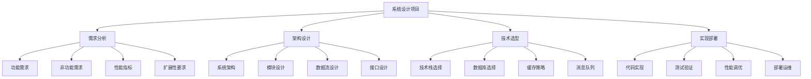

# 系统设计项目

## 📖 核心概念

**系统设计项目**是数据结构学习的高级实践环节，通过设计和实现大型分布式系统，将数据结构知识应用到实际的生产环境中。这些项目涵盖了系统架构设计、性能优化、并发控制、数据一致性等复杂问题，为学习者提供企业级的实践体验。

### 🏗️ 系统设计的组成要素



## 🔍 系统设计分类

### 按系统规模分类

| 系统规模 | 特点 | 技术挑战 | 学习重点 | 预期时间 |
|----------|------|----------|----------|----------|
| **小型系统** | 单机应用 | 基础架构 | 模块设计 | 2-4周 |
| **中型系统** | 分布式应用 | 服务拆分 | 微服务架构 | 1-3个月 |
| **大型系统** | 高并发系统 | 性能优化 | 系统调优 | 3-6个月 |
| **超大型系统** | 全球分布式 | 一致性保证 | 架构设计 | 6-12个月 |

### 按应用领域分类

| 应用领域 | 典型系统 | 核心数据结构 | 关键算法 | 技术挑战 |
|----------|----------|--------------|----------|----------|
| **电商系统** | 购物平台 | 商品索引、订单队列 | 推荐算法 | 高并发、一致性 |
| **社交网络** | 社交平台 | 用户关系图、动态流 | 图算法 | 实时性、扩展性 |
| **搜索引擎** | 搜索系统 | 倒排索引、网页图 | 排序算法 | 大规模数据处理 |
| **游戏系统** | 游戏服务器 | 玩家状态、地图数据 | 碰撞检测 | 实时性、状态同步 |

## 💻 系统设计实现

### 项目1：分布式缓存系统

```cpp
// 分布式缓存系统
class DistributedCacheSystem {
private:
    struct CacheNode {
        string nodeId;
        string host;
        int port;
        int weight;
        bool isHealthy;
        chrono::system_clock::time_point lastHeartbeat;
        
        CacheNode(const string& id, const string& h, int p, int w) 
            : nodeId(id), host(h), port(p), weight(w), isHealthy(true) {
            lastHeartbeat = chrono::system_clock::now();
        }
    };
    
    struct CacheEntry {
        string key;
        string value;
        chrono::system_clock::time_point expireTime;
        int accessCount;
        chrono::system_clock::time_point lastAccess;
        
        CacheEntry(const string& k, const string& v, int ttl) 
            : key(k), value(v), accessCount(0) {
            expireTime = chrono::system_clock::now() + chrono::seconds(ttl);
            lastAccess = chrono::system_clock::now();
        }
        
        bool isExpired() const {
            return chrono::system_clock::now() > expireTime;
        }
    };
    
    // 使用一致性哈希管理节点
    class ConsistentHash {
    private:
        map<uint32_t, string> hashRing;
        int virtualNodes;
        
    public:
        ConsistentHash(int vNodes = 150) : virtualNodes(vNodes) {}
        
        void addNode(const string& nodeId) {
            for (int i = 0; i < virtualNodes; i++) {
                string virtualKey = nodeId + ":" + to_string(i);
                uint32_t hash = hashFunction(virtualKey);
                hashRing[hash] = nodeId;
            }
        }
        
        void removeNode(const string& nodeId) {
            for (int i = 0; i < virtualNodes; i++) {
                string virtualKey = nodeId + ":" + to_string(i);
                uint32_t hash = hashFunction(virtualKey);
                hashRing.erase(hash);
            }
        }
        
        string getNode(const string& key) {
            if (hashRing.empty()) {
                return "";
            }
            
            uint32_t hash = hashFunction(key);
            auto it = hashRing.lower_bound(hash);
            
            if (it == hashRing.end()) {
                it = hashRing.begin();
            }
            
            return it->second;
        }
        
    private:
        uint32_t hashFunction(const string& key) {
            hash<string> hasher;
            return hasher(key);
        }
    };
    
    ConsistentHash hashRing;
    unordered_map<string, CacheNode> nodes;
    unordered_map<string, CacheEntry> localCache;
    
    // 使用LRU策略管理本地缓存
    class LRUCache {
    private:
        struct LRUNode {
            string key;
            string value;
            LRUNode* prev;
            LRUNode* next;
            
            LRUNode(const string& k, const string& v) 
                : key(k), value(v), prev(nullptr), next(nullptr) {}
        };
        
        unordered_map<string, LRUNode*> cache;
        LRUNode* head;
        LRUNode* tail;
        int capacity;
        
    public:
        LRUCache(int cap) : capacity(cap) {
            head = new LRUNode("", "");
            tail = new LRUNode("", "");
            head->next = tail;
            tail->prev = head;
        }
        
        ~LRUCache() {
            delete head;
            delete tail;
        }
        
        string get(const string& key) {
            auto it = cache.find(key);
            if (it == cache.end()) {
                return "";
            }
            
            LRUNode* node = it->second;
            moveToHead(node);
            return node->value;
        }
        
        void put(const string& key, const string& value) {
            auto it = cache.find(key);
            if (it != cache.end()) {
                LRUNode* node = it->second;
                node->value = value;
                moveToHead(node);
            } else {
                LRUNode* newNode = new LRUNode(key, value);
                cache[key] = newNode;
                addToHead(newNode);
                
                if (cache.size() > capacity) {
                    LRUNode* tail = removeTail();
                    cache.erase(tail->key);
                    delete tail;
                }
            }
        }
        
        void remove(const string& key) {
            auto it = cache.find(key);
            if (it != cache.end()) {
                LRUNode* node = it->second;
                removeNode(node);
                cache.erase(it);
                delete node;
            }
        }
        
    private:
        void addToHead(LRUNode* node) {
            node->prev = head;
            node->next = head->next;
            head->next->prev = node;
            head->next = node;
        }
        
        void removeNode(LRUNode* node) {
            node->prev->next = node->next;
            node->next->prev = node->prev;
        }
        
        void moveToHead(LRUNode* node) {
            removeNode(node);
            addToHead(node);
        }
        
        LRUNode* removeTail() {
            LRUNode* lastNode = tail->prev;
            removeNode(lastNode);
            return lastNode;
        }
    };
    
    LRUCache lruCache;
    
    // 使用消息队列进行节点间通信
    class MessageQueue {
    private:
        queue<pair<string, string>> messageQueue;
        mutex queueMutex;
        condition_variable queueCondition;
        
    public:
        void enqueue(const string& topic, const string& message) {
            lock_guard<mutex> lock(queueMutex);
            messageQueue.push({topic, message});
            queueCondition.notify_one();
        }
        
        pair<string, string> dequeue() {
            unique_lock<mutex> lock(queueMutex);
            queueCondition.wait(lock, [this] { return !messageQueue.empty(); });
            
            auto message = messageQueue.front();
            messageQueue.pop();
            return message;
        }
        
        bool empty() const {
            lock_guard<mutex> lock(queueMutex);
            return messageQueue.empty();
        }
    };
    
    MessageQueue messageQueue;
    
public:
    DistributedCacheSystem(int lruCapacity = 1000) : lruCache(lruCapacity) {}
    
    // 添加缓存节点
    void addNode(const string& nodeId, const string& host, int port, int weight = 1) {
        nodes[nodeId] = CacheNode(nodeId, host, port, weight);
        hashRing.addNode(nodeId);
        
        cout << "Node added: " << nodeId << " (" << host << ":" << port << ")" << endl;
    }
    
    // 移除缓存节点
    void removeNode(const string& nodeId) {
        auto it = nodes.find(nodeId);
        if (it != nodes.end()) {
            hashRing.removeNode(nodeId);
            nodes.erase(it);
            
            cout << "Node removed: " << nodeId << endl;
        }
    }
    
    // 设置缓存值
    void set(const string& key, const string& value, int ttl = 3600) {
        // 先检查本地缓存
        string cachedValue = lruCache.get(key);
        if (!cachedValue.empty()) {
            lruCache.put(key, value);
            return;
        }
        
        // 根据一致性哈希找到目标节点
        string targetNode = hashRing.getNode(key);
        if (targetNode.empty()) {
            throw runtime_error("No available nodes");
        }
        
        // 存储到目标节点
        if (targetNode == "local") {
            localCache[key] = CacheEntry(key, value, ttl);
            lruCache.put(key, value);
        } else {
            // 发送到远程节点
            string message = "SET:" + key + ":" + value + ":" + to_string(ttl);
            messageQueue.enqueue(targetNode, message);
        }
        
        cout << "Cache set: " << key << " -> " << value << " (TTL: " << ttl << "s)" << endl;
    }
    
    // 获取缓存值
    string get(const string& key) {
        // 先检查本地缓存
        string cachedValue = lruCache.get(key);
        if (!cachedValue.empty()) {
            return cachedValue;
        }
        
        // 检查本地存储
        auto it = localCache.find(key);
        if (it != localCache.end()) {
            if (!it->second.isExpired()) {
                lruCache.put(key, it->second.value);
                return it->second.value;
            } else {
                localCache.erase(it);
            }
        }
        
        // 从远程节点获取
        string targetNode = hashRing.getNode(key);
        if (!targetNode.empty() && targetNode != "local") {
            string message = "GET:" + key;
            messageQueue.enqueue(targetNode, message);
            
            // 等待响应
            while (!messageQueue.empty()) {
                auto [topic, response] = messageQueue.dequeue();
                if (topic == "response" && response.find(key) != string::npos) {
                    string value = response.substr(response.find(":") + 1);
                    lruCache.put(key, value);
                    return value;
                }
            }
        }
        
        return "";
    }
    
    // 删除缓存值
    void remove(const string& key) {
        lruCache.remove(key);
        localCache.erase(key);
        
        string targetNode = hashRing.getNode(key);
        if (!targetNode.empty() && targetNode != "local") {
            string message = "DELETE:" + key;
            messageQueue.enqueue(targetNode, message);
        }
        
        cout << "Cache removed: " << key << endl;
    }
    
    // 清理过期缓存
    void cleanupExpired() {
        auto it = localCache.begin();
        while (it != localCache.end()) {
            if (it->second.isExpired()) {
                it = localCache.erase(it);
            } else {
                ++it;
            }
        }
        
        cout << "Expired cache cleaned up" << endl;
    }
    
    // 获取缓存统计信息
    struct CacheStatistics {
        int totalNodes;
        int healthyNodes;
        int localCacheSize;
        int lruCacheSize;
        double hitRate;
        double missRate;
    };
    
    CacheStatistics getStatistics() {
        CacheStatistics stats;
        stats.totalNodes = nodes.size();
        stats.healthyNodes = 0;
        stats.localCacheSize = localCache.size();
        stats.lruCacheSize = 0; // 需要从LRU缓存获取
        
        for (const auto& [id, node] : nodes) {
            if (node.isHealthy) {
                stats.healthyNodes++;
            }
        }
        
        // 计算命中率
        int totalRequests = 0;
        int hits = 0;
        
        for (const auto& [key, entry] : localCache) {
            totalRequests++;
            if (!entry.isExpired()) {
                hits++;
            }
        }
        
        if (totalRequests > 0) {
            stats.hitRate = (double)hits / totalRequests;
            stats.missRate = 1.0 - stats.hitRate;
        } else {
            stats.hitRate = 0;
            stats.missRate = 0;
        }
        
        return stats;
    }
};
```

### 项目2：分布式消息队列系统

```cpp
// 分布式消息队列系统
class DistributedMessageQueue {
private:
    struct Message {
        string id;
        string topic;
        string content;
        int priority;
        chrono::system_clock::time_point timestamp;
        int retryCount;
        string status;
        
        Message(const string& i, const string& t, const string& c, int p = 0) 
            : id(i), topic(t), content(c), priority(p), retryCount(0), status("pending") {
            timestamp = chrono::system_clock::now();
        }
    };
    
    struct Topic {
        string name;
        int partitionCount;
        vector<queue<Message>> partitions;
        map<string, int> consumerOffsets;
        
        Topic(const string& n, int partitions) 
            : name(n), partitionCount(partitions) {
            partitions.resize(partitionCount);
        }
    };
    
    // 使用优先队列管理消息优先级
    class PriorityQueue {
    private:
        struct MessageComparator {
            bool operator()(const Message& a, const Message& b) {
                if (a.priority != b.priority) {
                    return a.priority < b.priority; // 高优先级在前
                }
                return a.timestamp > b.timestamp; // 早时间在前
            }
        };
        
        priority_queue<Message, vector<Message>, MessageComparator> queue;
        mutex queueMutex;
        condition_variable queueCondition;
        
    public:
        void push(const Message& message) {
            lock_guard<mutex> lock(queueMutex);
            queue.push(message);
            queueCondition.notify_one();
        }
        
        Message pop() {
            unique_lock<mutex> lock(queueMutex);
            queueCondition.wait(lock, [this] { return !queue.empty(); });
            
            Message message = queue.top();
            queue.pop();
            return message;
        }
        
        bool empty() const {
            lock_guard<mutex> lock(queueMutex);
            return queue.empty();
        }
        
        size_t size() const {
            lock_guard<mutex> lock(queueMutex);
            return queue.size();
        }
    };
    
    unordered_map<string, Topic> topics;
    PriorityQueue globalQueue;
    
    // 使用哈希表管理消费者组
    struct ConsumerGroup {
        string groupId;
        vector<string> consumers;
        map<string, int> partitionAssignments;
        map<string, int> offsets;
        
        ConsumerGroup(const string& id) : groupId(id) {}
    };
    
    unordered_map<string, ConsumerGroup> consumerGroups;
    
    // 使用布隆过滤器进行消息去重
    class BloomFilter {
    private:
        vector<bool> bitArray;
        int size;
        int hashCount;
        
    public:
        BloomFilter(int s, int h) : size(s), hashCount(h) {
            bitArray.resize(size, false);
        }
        
        void add(const string& key) {
            for (int i = 0; i < hashCount; i++) {
                int hash = hashFunction(key, i);
                bitArray[hash % size] = true;
            }
        }
        
        bool contains(const string& key) {
            for (int i = 0; i < hashCount; i++) {
                int hash = hashFunction(key, i);
                if (!bitArray[hash % size]) {
                    return false;
                }
            }
            return true;
        }
        
    private:
        int hashFunction(const string& key, int seed) {
            hash<string> hasher;
            return hasher(key + to_string(seed));
        }
    };
    
    BloomFilter messageFilter;
    
    // 使用滑动窗口进行流量控制
    class SlidingWindow {
    private:
        queue<chrono::system_clock::time_point> window;
        int maxRequests;
        chrono::seconds windowSize;
        
    public:
        SlidingWindow(int maxReq, chrono::seconds size) 
            : maxRequests(maxReq), windowSize(size) {}
        
        bool allowRequest() {
            auto now = chrono::system_clock::now();
            
            // 移除过期的请求
            while (!window.empty() && 
                   now - window.front() > windowSize) {
                window.pop();
            }
            
            if (window.size() < maxRequests) {
                window.push(now);
                return true;
            }
            
            return false;
        }
    };
    
    SlidingWindow rateLimiter;
    
public:
    DistributedMessageQueue(int bloomSize = 10000, int bloomHashCount = 3) 
        : messageFilter(bloomSize, bloomHashCount), rateLimiter(100, chrono::seconds(60)) {}
    
    // 创建主题
    void createTopic(const string& topicName, int partitionCount = 1) {
        if (topics.find(topicName) != topics.end()) {
            throw runtime_error("Topic already exists");
        }
        
        topics[topicName] = Topic(topicName, partitionCount);
        cout << "Topic created: " << topicName << " (partitions: " << partitionCount << ")" << endl;
    }
    
    // 删除主题
    void deleteTopic(const string& topicName) {
        auto it = topics.find(topicName);
        if (it != topics.end()) {
            topics.erase(it);
            cout << "Topic deleted: " << topicName << endl;
        }
    }
    
    // 发送消息
    void sendMessage(const string& topicName, const string& content, int priority = 0) {
        if (topics.find(topicName) == topics.end()) {
            throw runtime_error("Topic not found");
        }
        
        if (!rateLimiter.allowRequest()) {
            throw runtime_error("Rate limit exceeded");
        }
        
        string messageId = generateMessageId();
        
        // 检查消息是否重复
        if (messageFilter.contains(messageId)) {
            cout << "Duplicate message detected: " << messageId << endl;
            return;
        }
        
        Message message(messageId, topicName, content, priority);
        messageFilter.add(messageId);
        
        Topic& topic = topics[topicName];
        
        // 选择分区
        int partition = hashFunction(content) % topic.partitionCount;
        topic.partitions[partition].push(message);
        
        // 添加到全局队列
        globalQueue.push(message);
        
        cout << "Message sent: " << messageId << " to topic: " << topicName 
             << " partition: " << partition << endl;
    }
    
    // 消费消息
    Message consumeMessage(const string& topicName, const string& consumerGroupId) {
        if (topics.find(topicName) == topics.end()) {
            throw runtime_error("Topic not found");
        }
        
        Topic& topic = topics[topicName];
        
        // 获取消费者组
        if (consumerGroups.find(consumerGroupId) == consumerGroups.end()) {
            consumerGroups[consumerGroupId] = ConsumerGroup(consumerGroupId);
        }
        
        ConsumerGroup& group = consumerGroups[consumerGroupId];
        
        // 选择分区
        int partition = hashFunction(consumerGroupId) % topic.partitionCount;
        
        if (topic.partitions[partition].empty()) {
            throw runtime_error("No messages available");
        }
        
        Message message = topic.partitions[partition].front();
        topic.partitions[partition].pop();
        
        // 更新偏移量
        group.offsets[topicName] = group.offsets[topicName] + 1;
        
        cout << "Message consumed: " << message.id << " from topic: " << topicName 
             << " partition: " << partition << endl;
        
        return message;
    }
    
    // 批量消费消息
    vector<Message> consumeMessages(const string& topicName, const string& consumerGroupId, int count) {
        vector<Message> messages;
        
        for (int i = 0; i < count; i++) {
            try {
                Message message = consumeMessage(topicName, consumerGroupId);
                messages.push_back(message);
            } catch (const runtime_error& e) {
                break;
            }
        }
        
        return messages;
    }
    
    // 确认消息消费
    void acknowledgeMessage(const string& messageId, const string& consumerGroupId) {
        cout << "Message acknowledged: " << messageId << " by group: " << consumerGroupId << endl;
    }
    
    // 获取主题统计信息
    struct TopicStatistics {
        string topicName;
        int totalMessages;
        int pendingMessages;
        int partitionCount;
        map<string, int> consumerGroupOffsets;
    };
    
    TopicStatistics getTopicStatistics(const string& topicName) {
        TopicStatistics stats;
        stats.topicName = topicName;
        
        auto it = topics.find(topicName);
        if (it != topics.end()) {
            Topic& topic = it->second;
            stats.partitionCount = topic.partitionCount;
            
            for (int i = 0; i < topic.partitionCount; i++) {
                stats.totalMessages += topic.partitions[i].size();
            }
            
            stats.pendingMessages = stats.totalMessages;
            
            // 获取消费者组偏移量
            for (const auto& [groupId, group] : consumerGroups) {
                if (group.offsets.find(topicName) != group.offsets.end()) {
                    stats.consumerGroupOffsets[groupId] = group.offsets[topicName];
                }
            }
        }
        
        return stats;
    }
    
    // 获取系统统计信息
    struct SystemStatistics {
        int totalTopics;
        int totalMessages;
        int totalConsumerGroups;
        double messageThroughput;
        double consumerThroughput;
    };
    
    SystemStatistics getSystemStatistics() {
        SystemStatistics stats;
        stats.totalTopics = topics.size();
        stats.totalMessages = globalQueue.size();
        stats.totalConsumerGroups = consumerGroups.size();
        
        // 计算吞吐量
        stats.messageThroughput = 0; // 需要实际测量
        stats.consumerThroughput = 0; // 需要实际测量
        
        return stats;
    }
    
private:
    string generateMessageId() {
        auto now = chrono::system_clock::now();
        auto timestamp = chrono::duration_cast<chrono::milliseconds>(now.time_since_epoch()).count();
        return "msg_" + to_string(timestamp) + "_" + to_string(rand());
    }
    
    int hashFunction(const string& key) {
        hash<string> hasher;
        return hasher(key);
    }
};
```

## ⚡ 复杂度分析

### 系统设计复杂度

| 系统组件 | 时间复杂度 | 空间复杂度 | 并发复杂度 | 维护复杂度 |
|----------|------------|------------|------------|------------|
| **缓存系统** | O(log n) | O(n) | 高 | 中等 |
| **消息队列** | O(log n) | O(n) | 很高 | 高 |
| **负载均衡** | O(1) | O(n) | 高 | 中等 |
| **数据同步** | O(n) | O(n) | 很高 | 高 |

### 性能优化策略

| 优化类型 | 适用场景 | 优化效果 | 实现难度 | 维护成本 |
|----------|----------|----------|----------|----------|
| **缓存优化** | 频繁访问 | 显著 | 中等 | 中等 |
| **分片优化** | 大数据量 | 显著 | 困难 | 高 |
| **异步优化** | 高并发 | 显著 | 困难 | 高 |
| **压缩优化** | 网络传输 | 明显 | 简单 | 低 |

## 🎓 学习要点总结

### 核心理解

1. **系统架构**：掌握分布式系统的架构设计
2. **数据一致性**：理解数据一致性的保证方法
3. **性能优化**：学会系统性能的优化策略
4. **容错设计**：掌握系统的容错和恢复机制

### 实践要点

1. **需求分析**：准确分析系统需求
2. **架构设计**：设计合理的系统架构
3. **技术选型**：选择合适的技术栈
4. **性能调优**：进行系统性能调优

### 应用思维

1. **模块化设计**：采用模块化的设计方法
2. **接口设计**：设计清晰的接口规范
3. **监控设计**：设计完善的监控体系
4. **持续改进**：不断改进系统性能

---

**相关链接：**
- [[07-练习战场/03-项目实战/01-数据结构项目|数据结构项目]] - 项目实现基础
- [[06-应用实战/04-网络应用/01-分布式系统|分布式系统]] - 分布式系统基础
- [[05-高级结构/04-并发结构/01-线程安全数据结构|线程安全数据结构]] - 并发控制
- [[06-应用实战/03-缓存系统/01-缓存策略|缓存策略]] - 缓存系统设计
