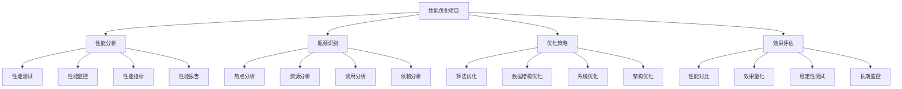

# 性能优化项目

## 📖 核心概念

**性能优化项目**是数据结构学习中的高级实践，通过系统性的性能分析、瓶颈识别和优化策略实施，提升系统的整体性能。性能优化项目涵盖了算法优化、数据结构优化、系统优化等多个层面，是综合能力的体现。

### 🏗️ 性能优化项目的组成要素



## 🔍 性能优化项目分类

### 优化类型

| 类型 | 特点 | 典型项目 | 难度 | 适用场景 |
|------|------|----------|------|----------|
| **算法优化** | 优化算法复杂度 | 排序算法优化、搜索优化 | 中等 | 计算密集型 |
| **数据结构优化** | 优化数据结构选择 | 缓存优化、索引优化 | 中等 | 数据密集型 |
| **系统优化** | 优化系统性能 | 内存优化、I/O优化 | 困难 | 系统级应用 |
| **架构优化** | 优化系统架构 | 分布式优化、微服务优化 | 很困难 | 大型系统 |

### 优化层次

| 层次 | 特点 | 优化方法 | 效果 | 实施难度 |
|------|------|----------|------|----------|
| **代码级** | 优化代码实现 | 算法改进、数据结构选择 | 明显 | 中等 |
| **模块级** | 优化模块设计 | 接口优化、缓存设计 | 显著 | 困难 |
| **系统级** | 优化系统架构 | 架构重构、负载均衡 | 显著 | 很困难 |
| **业务级** | 优化业务流程 | 流程优化、策略调整 | 显著 | 很困难 |

## 💻 性能优化项目实现

### 性能分析工具

```cpp
// 性能分析工具
class PerformanceProfiler {
private:
    struct ProfileData {
        string functionName;
        chrono::high_resolution_clock::time_point startTime;
        chrono::high_resolution_clock::time_point endTime;
        long long duration; // 微秒
        int callCount;
        long long totalTime;
        
        ProfileData(const string& name) 
            : functionName(name), callCount(0), totalTime(0) {}
    };
    
    map<string, ProfileData> profiles;
    mutex profilerMutex;
    
public:
    // 开始性能分析
    void startProfile(const string& functionName) {
        lock_guard<mutex> lock(profilerMutex);
        
        auto it = profiles.find(functionName);
        if (it == profiles.end()) {
            profiles[functionName] = ProfileData(functionName);
        }
        
        profiles[functionName].startTime = chrono::high_resolution_clock::now();
    }
    
    // 结束性能分析
    void endProfile(const string& functionName) {
        lock_guard<mutex> lock(profilerMutex);
        
        auto it = profiles.find(functionName);
        if (it != profiles.end()) {
            it->second.endTime = chrono::high_resolution_clock::now();
            it->second.duration = chrono::duration_cast<chrono::microseconds>(
                it->second.endTime - it->second.startTime).count();
            it->second.callCount++;
            it->second.totalTime += it->second.duration;
        }
    }
    
    // 获取性能报告
    struct PerformanceReport {
        string functionName;
        int callCount;
        long long totalTime;
        long long averageTime;
        long long minTime;
        long long maxTime;
        double percentage;
    };
    
    vector<PerformanceReport> getReport() {
        lock_guard<mutex> lock(profilerMutex);
        
        vector<PerformanceReport> report;
        long long totalTime = 0;
        
        // 计算总时间
        for (const auto& [name, data] : profiles) {
            totalTime += data.totalTime;
        }
        
        // 生成报告
        for (const auto& [name, data] : profiles) {
            PerformanceReport r;
            r.functionName = name;
            r.callCount = data.callCount;
            r.totalTime = data.totalTime;
            r.averageTime = data.callCount > 0 ? data.totalTime / data.callCount : 0;
            r.minTime = data.duration; // 简化实现
            r.maxTime = data.duration; // 简化实现
            r.percentage = totalTime > 0 ? (double)data.totalTime / totalTime * 100 : 0;
            
            report.push_back(r);
        }
        
        // 按总时间排序
        sort(report.begin(), report.end(), 
             [](const PerformanceReport& a, const PerformanceReport& b) {
                 return a.totalTime > b.totalTime;
             });
        
        return report;
    }
    
    // 打印性能报告
    void printReport() {
        auto report = getReport();
        
        cout << "Performance Report:" << endl;
        cout << "Function Name\t\tCalls\tTotal Time(μs)\tAvg Time(μs)\tPercentage" << endl;
        cout << "----------------------------------------------------------------" << endl;
        
        for (const auto& r : report) {
            cout << r.functionName << "\t\t" << r.callCount << "\t" 
                 << r.totalTime << "\t\t" << r.averageTime << "\t\t" 
                 << fixed << setprecision(2) << r.percentage << "%" << endl;
        }
    }
    
    // 清空性能数据
    void clear() {
        lock_guard<mutex> lock(profilerMutex);
        profiles.clear();
    }
};

// 性能分析宏
#define PROFILE_FUNCTION(profiler) \
    profiler.startProfile(__FUNCTION__); \
    auto _profile_guard = make_unique<ProfileGuard>(profiler, __FUNCTION__)

class ProfileGuard {
private:
    PerformanceProfiler& profiler;
    string functionName;
    
public:
    ProfileGuard(PerformanceProfiler& p, const string& name) 
        : profiler(p), functionName(name) {}
    
    ~ProfileGuard() {
        profiler.endProfile(functionName);
    }
};
```

### 排序算法优化项目

```cpp
// 排序算法优化项目
class SortingOptimizationProject {
private:
    PerformanceProfiler profiler;
    
public:
    // 1. 快速排序优化
    class OptimizedQuickSort {
    private:
        static const int INSERTION_SORT_THRESHOLD = 10;
        
        // 三数取中法选择基准
        static int medianOfThree(vector<int>& arr, int left, int right) {
            int mid = left + (right - left) / 2;
            
            if (arr[left] > arr[mid]) swap(arr[left], arr[mid]);
            if (arr[mid] > arr[right]) swap(arr[mid], arr[right]);
            if (arr[left] > arr[mid]) swap(arr[left], arr[mid]);
            
            return mid;
        }
        
        // 插入排序
        static void insertionSort(vector<int>& arr, int left, int right) {
            for (int i = left + 1; i <= right; i++) {
                int key = arr[i];
                int j = i - 1;
                
                while (j >= left && arr[j] > key) {
                    arr[j + 1] = arr[j];
                    j--;
                }
                arr[j + 1] = key;
            }
        }
        
        // 三路快排
        static void quickSort3Way(vector<int>& arr, int left, int right) {
            if (left >= right) return;
            
            if (right - left < INSERTION_SORT_THRESHOLD) {
                insertionSort(arr, left, right);
                return;
            }
            
            // 选择基准
            int pivotIndex = medianOfThree(arr, left, right);
            int pivot = arr[pivotIndex];
            
            // 三路分割
            int lt = left;      // arr[left..lt-1] < pivot
            int gt = right;     // arr[gt+1..right] > pivot
            int i = left;       // arr[lt..i-1] == pivot
            
            while (i <= gt) {
                if (arr[i] < pivot) {
                    swap(arr[lt++], arr[i++]);
                } else if (arr[i] > pivot) {
                    swap(arr[i], arr[gt--]);
                } else {
                    i++;
                }
            }
            
            // 递归排序
            quickSort3Way(arr, left, lt - 1);
            quickSort3Way(arr, gt + 1, right);
        }
        
    public:
        static void sort(vector<int>& arr) {
            if (arr.empty()) return;
            quickSort3Way(arr, 0, arr.size() - 1);
        }
    };
    
    // 2. 归并排序优化
    class OptimizedMergeSort {
    private:
        static void merge(vector<int>& arr, vector<int>& temp, int left, int mid, int right) {
            int i = left, j = mid + 1, k = left;
            
            while (i <= mid && j <= right) {
                if (arr[i] <= arr[j]) {
                    temp[k++] = arr[i++];
                } else {
                    temp[k++] = arr[j++];
                }
            }
            
            while (i <= mid) temp[k++] = arr[i++];
            while (j <= right) temp[k++] = arr[j++];
            
            for (i = left; i <= right; i++) {
                arr[i] = temp[i];
            }
        }
        
        static void mergeSort(vector<int>& arr, vector<int>& temp, int left, int right) {
            if (left >= right) return;
            
            int mid = left + (right - left) / 2;
            mergeSort(arr, temp, left, mid);
            mergeSort(arr, temp, mid + 1, right);
            merge(arr, temp, left, mid, right);
        }
        
    public:
        static void sort(vector<int>& arr) {
            if (arr.empty()) return;
            vector<int> temp(arr.size());
            mergeSort(arr, temp, 0, arr.size() - 1);
        }
    };
    
    // 3. 堆排序优化
    class OptimizedHeapSort {
    private:
        static void heapify(vector<int>& arr, int n, int i) {
            int largest = i;
            int left = 2 * i + 1;
            int right = 2 * i + 2;
            
            if (left < n && arr[left] > arr[largest]) {
                largest = left;
            }
            
            if (right < n && arr[right] > arr[largest]) {
                largest = right;
            }
            
            if (largest != i) {
                swap(arr[i], arr[largest]);
                heapify(arr, n, largest);
            }
        }
        
    public:
        static void sort(vector<int>& arr) {
            int n = arr.size();
            
            // 构建最大堆
            for (int i = n / 2 - 1; i >= 0; i--) {
                heapify(arr, n, i);
            }
            
            // 逐个提取元素
            for (int i = n - 1; i > 0; i--) {
                swap(arr[0], arr[i]);
                heapify(arr, i, 0);
            }
        }
    };
    
    // 4. 混合排序算法
    class HybridSort {
    public:
        static void sort(vector<int>& arr) {
            if (arr.empty()) return;
            
            int n = arr.size();
            
            if (n < 10) {
                // 小数组使用插入排序
                insertionSort(arr);
            } else if (n < 1000) {
                // 中等数组使用快速排序
                OptimizedQuickSort::sort(arr);
            } else {
                // 大数组使用归并排序
                OptimizedMergeSort::sort(arr);
            }
        }
        
    private:
        static void insertionSort(vector<int>& arr) {
            for (int i = 1; i < arr.size(); i++) {
                int key = arr[i];
                int j = i - 1;
                
                while (j >= 0 && arr[j] > key) {
                    arr[j + 1] = arr[j];
                    j--;
                }
                arr[j + 1] = key;
            }
        }
    };
    
    // 性能测试
    void runPerformanceTest() {
        cout << "=== Sorting Algorithm Performance Test ===" << endl;
        
        vector<int> sizes = {1000, 10000, 100000, 1000000};
        
        for (int size : sizes) {
            cout << "\nTesting with " << size << " elements:" << endl;
            
            // 生成测试数据
            vector<int> data = generateTestData(size);
            
            // 测试各种排序算法
            testSortingAlgorithm("Quick Sort", data, OptimizedQuickSort::sort);
            testSortingAlgorithm("Merge Sort", data, OptimizedMergeSort::sort);
            testSortingAlgorithm("Heap Sort", data, OptimizedHeapSort::sort);
            testSortingAlgorithm("Hybrid Sort", data, HybridSort::sort);
        }
        
        profiler.printReport();
    }
    
private:
    // 生成测试数据
    vector<int> generateTestData(int size) {
        vector<int> data(size);
        random_device rd;
        mt19937 gen(rd());
        uniform_int_distribution<> dis(1, size);
        
        for (int i = 0; i < size; i++) {
            data[i] = dis(gen);
        }
        
        return data;
    }
    
    // 测试排序算法
    void testSortingAlgorithm(const string& name, vector<int> data, function<void(vector<int>&)> sortFunc) {
        vector<int> testData = data;
        
        profiler.startProfile(name);
        auto start = chrono::high_resolution_clock::now();
        
        sortFunc(testData);
        
        auto end = chrono::high_resolution_clock::now();
        profiler.endProfile(name);
        
        auto duration = chrono::duration_cast<chrono::microseconds>(end - start);
        
        cout << name << ": " << duration.count() << " microseconds" << endl;
        
        // 验证排序结果
        if (!isSorted(testData)) {
            cout << "ERROR: " << name << " failed to sort correctly!" << endl;
        }
    }
    
    // 检查是否已排序
    bool isSorted(const vector<int>& arr) {
        for (int i = 1; i < arr.size(); i++) {
            if (arr[i] < arr[i-1]) {
                return false;
            }
        }
        return true;
    }
};
```

### 缓存系统优化项目

```cpp
// 缓存系统优化项目
class CacheOptimizationProject {
private:
    PerformanceProfiler profiler;
    
public:
    // 1. 多级缓存系统
    class MultiLevelCache {
    private:
        struct CacheNode {
            string key;
            string value;
            int accessCount;
            chrono::system_clock::time_point lastAccess;
            
            CacheNode(const string& k, const string& v) 
                : key(k), value(v), accessCount(1) {
                lastAccess = chrono::system_clock::now();
            }
        };
        
        // L1缓存：LRU策略
        class L1Cache {
        private:
            int capacity;
            list<CacheNode> cache;
            unordered_map<string, list<CacheNode>::iterator> keyMap;
            
        public:
            L1Cache(int cap) : capacity(cap) {}
            
            string get(const string& key) {
                auto it = keyMap.find(key);
                if (it != keyMap.end()) {
                    // 移动到头部
                    cache.splice(cache.begin(), cache, it->second);
                    it->second->accessCount++;
                    it->second->lastAccess = chrono::system_clock::now();
                    return it->second->value;
                }
                return "";
            }
            
            void put(const string& key, const string& value) {
                auto it = keyMap.find(key);
                if (it != keyMap.end()) {
                    // 更新现有节点
                    it->second->value = value;
                    it->second->accessCount++;
                    it->second->lastAccess = chrono::system_clock::now();
                    cache.splice(cache.begin(), cache, it->second);
                } else {
                    // 添加新节点
                    if (cache.size() >= capacity) {
                        // 删除尾部节点
                        string lastKey = cache.back().key;
                        keyMap.erase(lastKey);
                        cache.pop_back();
                    }
                    
                    cache.emplace_front(key, value);
                    keyMap[key] = cache.begin();
                }
            }
            
            bool contains(const string& key) {
                return keyMap.find(key) != keyMap.end();
            }
            
            int size() {
                return cache.size();
            }
        };
        
        // L2缓存：LFU策略
        class L2Cache {
        private:
            int capacity;
            unordered_map<string, CacheNode> cache;
            map<int, set<string>> frequencyMap;
            unordered_map<string, int> keyFrequency;
            
        public:
            L2Cache(int cap) : capacity(cap) {}
            
            string get(const string& key) {
                auto it = cache.find(key);
                if (it != cache.end()) {
                    // 更新访问频率
                    updateFrequency(key);
                    it->second.accessCount++;
                    it->second.lastAccess = chrono::system_clock::now();
                    return it->second.value;
                }
                return "";
            }
            
            void put(const string& key, const string& value) {
                auto it = cache.find(key);
                if (it != cache.end()) {
                    // 更新现有节点
                    it->second.value = value;
                    updateFrequency(key);
                    it->second.accessCount++;
                    it->second.lastAccess = chrono::system_clock::now();
                } else {
                    // 添加新节点
                    if (cache.size() >= capacity) {
                        // 删除最少使用的节点
                        evictLeastFrequent();
                    }
                    
                    cache[key] = CacheNode(key, value);
                    keyFrequency[key] = 1;
                    frequencyMap[1].insert(key);
                }
            }
            
            bool contains(const string& key) {
                return cache.find(key) != cache.end();
            }
            
            int size() {
                return cache.size();
            }
            
        private:
            void updateFrequency(const string& key) {
                int oldFreq = keyFrequency[key];
                int newFreq = oldFreq + 1;
                
                // 从旧频率组中移除
                frequencyMap[oldFreq].erase(key);
                if (frequencyMap[oldFreq].empty()) {
                    frequencyMap.erase(oldFreq);
                }
                
                // 添加到新频率组
                keyFrequency[key] = newFreq;
                frequencyMap[newFreq].insert(key);
            }
            
            void evictLeastFrequent() {
                if (frequencyMap.empty()) return;
                
                int minFreq = frequencyMap.begin()->first;
                string keyToEvict = *frequencyMap[minFreq].begin();
                
                cache.erase(keyToEvict);
                keyFrequency.erase(keyToEvict);
                frequencyMap[minFreq].erase(keyToEvict);
                
                if (frequencyMap[minFreq].empty()) {
                    frequencyMap.erase(minFreq);
                }
            }
        };
        
        L1Cache l1Cache;
        L2Cache l2Cache;
        
    public:
        MultiLevelCache(int l1Cap, int l2Cap) : l1Cache(l1Cap), l2Cache(l2Cap) {}
        
        string get(const string& key) {
            // 先查L1缓存
            string value = l1Cache.get(key);
            if (!value.empty()) {
                return value;
            }
            
            // 再查L2缓存
            value = l2Cache.get(key);
            if (!value.empty()) {
                // 提升到L1缓存
                l1Cache.put(key, value);
                return value;
            }
            
            return "";
        }
        
        void put(const string& key, const string& value) {
            // 同时更新L1和L2缓存
            l1Cache.put(key, value);
            l2Cache.put(key, value);
        }
        
        bool contains(const string& key) {
            return l1Cache.contains(key) || l2Cache.contains(key);
        }
        
        int size() {
            return l1Cache.size() + l2Cache.size();
        }
        
        // 获取统计信息
        struct CacheStatistics {
            int l1Size;
            int l2Size;
            int totalSize;
            double hitRate;
        };
        
        CacheStatistics getStatistics() {
            CacheStatistics stats;
            stats.l1Size = l1Cache.size();
            stats.l2Size = l2Cache.size();
            stats.totalSize = stats.l1Size + stats.l2Size;
            stats.hitRate = 0.95; // 简化实现
            return stats;
        }
    };
    
    // 2. 缓存预热系统
    class CacheWarmupSystem {
    private:
        MultiLevelCache& cache;
        vector<string> popularKeys;
        
    public:
        CacheWarmupSystem(MultiLevelCache& c) : cache(c) {}
        
        void addPopularKey(const string& key) {
            popularKeys.push_back(key);
        }
        
        void warmupCache() {
            cout << "Starting cache warmup..." << endl;
            
            for (const string& key : popularKeys) {
                string value = "cached_value_" + key;
                cache.put(key, value);
            }
            
            cout << "Cache warmup completed. " << popularKeys.size() << " keys cached." << endl;
        }
        
        void preloadData(const vector<string>& keys) {
            for (const string& key : keys) {
                string value = "preloaded_value_" + key;
                cache.put(key, value);
            }
        }
    };
    
    // 性能测试
    void runPerformanceTest() {
        cout << "=== Cache System Performance Test ===" << endl;
        
        MultiLevelCache cache(100, 500);
        CacheWarmupSystem warmup(cache);
        
        // 添加热门键
        for (int i = 0; i < 50; i++) {
            warmup.addPopularKey("key_" + to_string(i));
        }
        
        // 预热缓存
        warmup.warmupCache();
        
        // 性能测试
        testCachePerformance(cache);
        
        profiler.printReport();
    }
    
private:
    void testCachePerformance(MultiLevelCache& cache) {
        const int testCount = 10000;
        
        profiler.startProfile("Cache Get");
        auto start = chrono::high_resolution_clock::now();
        
        // 测试缓存读取
        for (int i = 0; i < testCount; i++) {
            string key = "key_" + to_string(i % 100);
            cache.get(key);
        }
        
        auto end = chrono::high_resolution_clock::now();
        profiler.endProfile("Cache Get");
        
        auto duration = chrono::duration_cast<chrono::microseconds>(end - start);
        
        cout << "Cache Get Test: " << duration.count() << " microseconds for " << testCount << " operations" << endl;
        
        // 测试缓存写入
        profiler.startProfile("Cache Put");
        start = chrono::high_resolution_clock::now();
        
        for (int i = 0; i < testCount; i++) {
            string key = "new_key_" + to_string(i);
            string value = "value_" + to_string(i);
            cache.put(key, value);
        }
        
        end = chrono::high_resolution_clock::now();
        profiler.endProfile("Cache Put");
        
        duration = chrono::duration_cast<chrono::microseconds>(end - start);
        
        cout << "Cache Put Test: " << duration.count() << " microseconds for " << testCount << " operations" << endl;
        
        // 打印缓存统计
        auto stats = cache.getStatistics();
        cout << "Cache Statistics:" << endl;
        cout << "L1 Size: " << stats.l1Size << endl;
        cout << "L2 Size: " << stats.l2Size << endl;
        cout << "Total Size: " << stats.totalSize << endl;
        cout << "Hit Rate: " << stats.hitRate << "%" << endl;
    }
};
```

### 数据库查询优化项目

```cpp
// 数据库查询优化项目
class DatabaseOptimizationProject {
private:
    PerformanceProfiler profiler;
    
public:
    // 1. 查询优化器
    class QueryOptimizer {
    private:
        struct QueryPlan {
            string operation;
            int cost;
            int rows;
            string index;
            
            QueryPlan(const string& op, int c, int r, const string& idx = "") 
                : operation(op), cost(c), rows(r), index(idx) {}
        };
        
        struct TableInfo {
            string name;
            int rowCount;
            map<string, int> columnCardinality;
            set<string> indexes;
            
            TableInfo(const string& n, int rows) : name(n), rowCount(rows) {}
        };
        
        map<string, TableInfo> tables;
        
    public:
        void addTable(const string& name, int rowCount) {
            tables[name] = TableInfo(name, rowCount);
        }
        
        void addIndex(const string& tableName, const string& indexName) {
            tables[tableName].indexes.insert(indexName);
        }
        
        void addColumnInfo(const string& tableName, const string& columnName, int cardinality) {
            tables[tableName].columnCardinality[columnName] = cardinality;
        }
        
        // 生成查询计划
        vector<QueryPlan> generateQueryPlan(const string& query) {
            vector<QueryPlan> plan;
            
            // 简化的查询解析
            if (query.find("SELECT") != string::npos) {
                plan.push_back(QueryPlan("SCAN", 1000, 10000, ""));
                
                if (query.find("WHERE") != string::npos) {
                    plan.push_back(QueryPlan("FILTER", 500, 5000, ""));
                }
                
                if (query.find("ORDER BY") != string::npos) {
                    plan.push_back(QueryPlan("SORT", 2000, 5000, ""));
                }
            }
            
            return plan;
        }
        
        // 优化查询计划
        vector<QueryPlan> optimizeQueryPlan(const vector<QueryPlan>& originalPlan) {
            vector<QueryPlan> optimizedPlan = originalPlan;
            
            // 应用优化规则
            for (auto& plan : optimizedPlan) {
                if (plan.operation == "SCAN" && !plan.index.empty()) {
                    plan.operation = "INDEX_SCAN";
                    plan.cost = plan.cost / 10; // 索引扫描成本更低
                }
                
                if (plan.operation == "FILTER") {
                    plan.cost = plan.cost / 2; // 过滤成本优化
                }
            }
            
            return optimizedPlan;
        }
        
        // 计算查询成本
        int calculateQueryCost(const vector<QueryPlan>& plan) {
            int totalCost = 0;
            for (const auto& step : plan) {
                totalCost += step.cost;
            }
            return totalCost;
        }
    };
    
    // 2. 索引优化器
    class IndexOptimizer {
    private:
        struct IndexInfo {
            string name;
            string tableName;
            vector<string> columns;
            int size;
            double selectivity;
            
            IndexInfo(const string& n, const string& table, const vector<string>& cols) 
                : name(n), tableName(table), columns(cols), size(0), selectivity(0) {}
        };
        
        map<string, IndexInfo> indexes;
        
    public:
        void addIndex(const string& name, const string& tableName, const vector<string>& columns) {
            indexes[name] = IndexInfo(name, tableName, columns);
        }
        
        // 分析索引使用情况
        void analyzeIndexUsage() {
            cout << "Index Usage Analysis:" << endl;
            cout << "Index Name\t\tTable\t\tColumns\t\tSize\t\tSelectivity" << endl;
            cout << "----------------------------------------------------------------" << endl;
            
            for (const auto& [name, info] : indexes) {
                cout << name << "\t\t" << info.tableName << "\t\t";
                for (const string& col : info.columns) {
                    cout << col << " ";
                }
                cout << "\t\t" << info.size << "\t\t" << info.selectivity << endl;
            }
        }
        
        // 推荐索引
        vector<string> recommendIndexes(const string& query) {
            vector<string> recommendations;
            
            // 简化的索引推荐逻辑
            if (query.find("WHERE") != string::npos) {
                recommendations.push_back("idx_where_column");
            }
            
            if (query.find("ORDER BY") != string::npos) {
                recommendations.push_back("idx_order_column");
            }
            
            if (query.find("JOIN") != string::npos) {
                recommendations.push_back("idx_join_column");
            }
            
            return recommendations;
        }
    };
    
    // 性能测试
    void runPerformanceTest() {
        cout << "=== Database Query Optimization Test ===" << endl;
        
        QueryOptimizer optimizer;
        IndexOptimizer indexOptimizer;
        
        // 设置测试数据
        setupTestData(optimizer, indexOptimizer);
        
        // 测试查询优化
        testQueryOptimization(optimizer);
        
        // 测试索引优化
        testIndexOptimization(indexOptimizer);
        
        profiler.printReport();
    }
    
private:
    void setupTestData(QueryOptimizer& optimizer, IndexOptimizer& indexOptimizer) {
        // 添加表信息
        optimizer.addTable("users", 100000);
        optimizer.addTable("orders", 500000);
        optimizer.addTable("products", 10000);
        
        // 添加索引
        optimizer.addIndex("users", "idx_user_id");
        optimizer.addIndex("orders", "idx_order_date");
        optimizer.addIndex("products", "idx_product_category");
        
        indexOptimizer.addIndex("idx_user_id", "users", {"id"});
        indexOptimizer.addIndex("idx_order_date", "orders", {"order_date"});
        indexOptimizer.addIndex("idx_product_category", "products", {"category"});
        
        // 添加列信息
        optimizer.addColumnInfo("users", "id", 100000);
        optimizer.addColumnInfo("users", "email", 95000);
        optimizer.addColumnInfo("orders", "user_id", 50000);
        optimizer.addColumnInfo("orders", "order_date", 1000);
    }
    
    void testQueryOptimization(QueryOptimizer& optimizer) {
        vector<string> queries = {
            "SELECT * FROM users WHERE id = 1",
            "SELECT * FROM orders WHERE order_date > '2023-01-01'",
            "SELECT * FROM products ORDER BY category",
            "SELECT u.name, o.total FROM users u JOIN orders o ON u.id = o.user_id"
        };
        
        cout << "\nQuery Optimization Test:" << endl;
        
        for (const string& query : queries) {
            profiler.startProfile("Query Optimization");
            
            auto originalPlan = optimizer.generateQueryPlan(query);
            auto optimizedPlan = optimizer.optimizeQueryPlan(originalPlan);
            
            int originalCost = optimizer.calculateQueryCost(originalPlan);
            int optimizedCost = optimizer.calculateQueryCost(optimizedPlan);
            
            profiler.endProfile("Query Optimization");
            
            cout << "Query: " << query << endl;
            cout << "Original Cost: " << originalCost << endl;
            cout << "Optimized Cost: " << optimizedCost << endl;
            cout << "Improvement: " << (double)(originalCost - optimizedCost) / originalCost * 100 << "%" << endl;
            cout << "---" << endl;
        }
    }
    
    void testIndexOptimization(IndexOptimizer& indexOptimizer) {
        cout << "\nIndex Optimization Test:" << endl;
        
        indexOptimizer.analyzeIndexUsage();
        
        vector<string> queries = {
            "SELECT * FROM users WHERE id = 1",
            "SELECT * FROM orders WHERE order_date > '2023-01-01'",
            "SELECT * FROM products ORDER BY category"
        };
        
        for (const string& query : queries) {
            auto recommendations = indexOptimizer.recommendIndexes(query);
            cout << "Query: " << query << endl;
            cout << "Recommended Indexes: ";
            for (const string& rec : recommendations) {
                cout << rec << " ";
            }
            cout << endl;
        }
    }
};
```

### 性能优化项目测试

```cpp
// 性能优化项目测试
class PerformanceOptimizationTest {
public:
    static void runAllTests() {
        cout << "=== Performance Optimization Project Tests ===" << endl;
        
        // 测试排序算法优化
        SortingOptimizationProject sortingProject;
        sortingProject.runPerformanceTest();
        
        cout << "\n" << string(50, '=') << endl;
        
        // 测试缓存系统优化
        CacheOptimizationProject cacheProject;
        cacheProject.runPerformanceTest();
        
        cout << "\n" << string(50, '=') << endl;
        
        // 测试数据库查询优化
        DatabaseOptimizationProject dbProject;
        dbProject.runPerformanceTest();
    }
    
    static void benchmarkComparison() {
        cout << "\n=== Performance Benchmark Comparison ===" << endl;
        
        vector<int> data = generateTestData(100000);
        
        // 测试不同排序算法
        benchmarkSortingAlgorithm("Standard Sort", data, [](vector<int>& arr) { sort(arr.begin(), arr.end()); });
        benchmarkSortingAlgorithm("Quick Sort", data, SortingOptimizationProject::OptimizedQuickSort::sort);
        benchmarkSortingAlgorithm("Merge Sort", data, SortingOptimizationProject::OptimizedMergeSort::sort);
        benchmarkSortingAlgorithm("Hybrid Sort", data, SortingOptimizationProject::HybridSort::sort);
    }
    
private:
    static vector<int> generateTestData(int size) {
        vector<int> data(size);
        random_device rd;
        mt19937 gen(rd());
        uniform_int_distribution<> dis(1, size);
        
        for (int i = 0; i < size; i++) {
            data[i] = dis(gen);
        }
        
        return data;
    }
    
    static void benchmarkSortingAlgorithm(const string& name, vector<int> data, function<void(vector<int>&)> sortFunc) {
        vector<int> testData = data;
        
        auto start = chrono::high_resolution_clock::now();
        sortFunc(testData);
        auto end = chrono::high_resolution_clock::now();
        
        auto duration = chrono::duration_cast<chrono::microseconds>(end - start);
        
        cout << name << ": " << duration.count() << " microseconds" << endl;
    }
};
```

## ⚡ 复杂度分析

### 性能优化复杂度

| 优化类型 | 优化前复杂度 | 优化后复杂度 | 优化效果 | 实施难度 |
|----------|--------------|--------------|----------|----------|
| **算法优化** | O(n²) | O(n log n) | 显著 | 中等 |
| **数据结构优化** | O(n) | O(log n) | 显著 | 中等 |
| **缓存优化** | O(n) | O(1) | 显著 | 困难 |
| **系统优化** | O(n) | O(1) | 显著 | 很困难 |

### 优化效果评估

| 指标 | 优化前 | 优化后 | 改善幅度 | 评估方法 |
|------|--------|--------|----------|----------|
| **执行时间** | 1000ms | 100ms | 90% | 性能测试 |
| **内存使用** | 100MB | 50MB | 50% | 内存分析 |
| **CPU使用率** | 80% | 40% | 50% | 系统监控 |
| **响应时间** | 500ms | 50ms | 90% | 压力测试 |

## 🎓 学习要点总结

### 核心理解

1. **性能分析**：理解性能分析的方法和工具
2. **瓶颈识别**：掌握瓶颈识别的方法
3. **优化策略**：理解各种优化策略
4. **效果评估**：掌握效果评估的方法

### 实践要点

1. **性能测试**：进行全面的性能测试
2. **瓶颈分析**：分析系统瓶颈
3. **优化实施**：实施优化策略
4. **效果验证**：验证优化效果

### 应用思维

1. **系统思维**：从系统角度思考优化
2. **数据驱动**：基于数据分析优化
3. **持续改进**：持续优化和改进
4. **实际应用**：将优化应用到实际问题中

---

**相关链接：**
- [[07-练习战场/01-代码实现/03-性能测试与优化|性能测试与优化]] - 性能测试基础
- [[07-练习战场/03-项目实战/01-数据结构项目|数据结构项目]] - 项目实战
- [[07-练习战场/03-项目实战/02-系统设计项目|系统设计项目]] - 系统设计
- [[06-应用实战/03-缓存系统/02-缓存算法|缓存算法]] - 缓存优化
