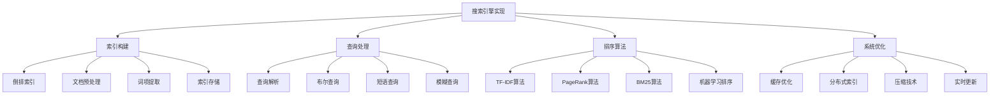

# 搜索引擎实现

## 📖 核心概念

**搜索引擎实现**是一个复杂的数据结构与算法实践项目，通过实现一个完整的搜索引擎系统，可以深入理解倒排索引、TF-IDF算法、PageRank算法、文本处理、哈希表、Trie树等核心概念，掌握实际系统开发中的搜索算法和优化技巧。

### 🏗️ 搜索引擎实现分类



## 🔧 搜索引擎实现

### 基础数据结构

```python
import re
import math
import json
import pickle
from collections import defaultdict, Counter
from typing import List, Dict, Set, Tuple, Optional, Any
from dataclasses import dataclass
from abc import ABC, abstractmethod
import heapq
import time

# 文档类
@dataclass
class Document:
    doc_id: str
    title: str
    content: str
    url: str
    timestamp: float
    word_count: int = 0
    tf_vector: Dict[str, float] = None
    
    def __post_init__(self):
        if self.tf_vector is None:
            self.tf_vector = {}
        self.word_count = len(self.content.split())

# 查询结果类
@dataclass
class SearchResult:
    doc_id: str
    title: str
    url: str
    score: float
    snippet: str
    highlights: List[str] = None
    
    def __post_init__(self):
        if self.highlights is None:
            self.highlights = []

# 倒排索引项
@dataclass
class Posting:
    doc_id: str
    tf: int
    positions: List[int]
    
    def __lt__(self, other):
        return self.doc_id < other.doc_id

# 词项信息
@dataclass
class TermInfo:
    term: str
    df: int  # 文档频率
    postings: List[Posting]
    idf: float = 0.0
    
    def __post_init__(self):
        if self.idf == 0.0 and self.df > 0:
            self.idf = math.log(1000 / self.df)  # 假设总文档数为1000

# 查询类
@dataclass
class Query:
    query_text: str
    query_type: str = "boolean"  # boolean, phrase, fuzzy
    filters: Dict[str, Any] = None
    
    def __post_init__(self):
        if self.filters is None:
            self.filters = {}
```

### 文本预处理模块

```python
class TextProcessor:
    def __init__(self):
        self.stop_words = self._load_stop_words()
        self.stemmer = self._create_stemmer()
    
    def _load_stop_words(self) -> Set[str]:
        """加载停用词表"""
        stop_words = {
            'a', 'an', 'and', 'are', 'as', 'at', 'be', 'by', 'for', 'from',
            'has', 'he', 'in', 'is', 'it', 'its', 'of', 'on', 'that', 'the',
            'to', 'was', 'will', 'with', 'the', 'this', 'but', 'they', 'have',
            'had', 'what', 'said', 'each', 'which', 'their', 'time', 'if',
            'up', 'out', 'many', 'then', 'them', 'can', 'only', 'other', 'new',
            'some', 'could', 'there', 'more', 'very', 'what', 'know', 'just',
            'first', 'also', 'after', 'back', 'well', 'way', 'even', 'much',
            'before', 'here', 'through', 'when', 'where', 'why', 'how', 'all',
            'any', 'both', 'each', 'few', 'more', 'most', 'other', 'some',
            'such', 'no', 'nor', 'not', 'only', 'own', 'same', 'so', 'than',
            'too', 'very', 's', 't', 'can', 'will', 'just', 'don', 'should',
            'now'
        }
        return stop_words
    
    def _create_stemmer(self):
        """创建词干提取器（简化版）"""
        class SimpleStemmer:
            def stem(self, word):
                # 简化的词干提取
                if len(word) <= 3:
                    return word
                
                # 移除常见后缀
                suffixes = ['ing', 'ed', 'er', 'est', 'ly', 's', 'es']
                for suffix in suffixes:
                    if word.endswith(suffix):
                        return word[:-len(suffix)]
                
                return word
        
        return SimpleStemmer()
    
    def tokenize(self, text: str) -> List[str]:
        """分词"""
        # 转换为小写并移除标点符号
        text = re.sub(r'[^\w\s]', ' ', text.lower())
        # 分割单词
        tokens = text.split()
        return tokens
    
    def remove_stop_words(self, tokens: List[str]) -> List[str]:
        """移除停用词"""
        return [token for token in tokens if token not in self.stop_words]
    
    def stem_tokens(self, tokens: List[str]) -> List[str]:
        """词干提取"""
        return [self.stemmer.stem(token) for token in tokens]
    
    def process_text(self, text: str) -> List[str]:
        """完整的文本处理流程"""
        tokens = self.tokenize(text)
        tokens = self.remove_stop_words(tokens)
        tokens = self.stem_tokens(tokens)
        return tokens
    
    def extract_ngrams(self, tokens: List[str], n: int = 2) -> List[str]:
        """提取n-gram"""
        ngrams = []
        for i in range(len(tokens) - n + 1):
            ngram = ' '.join(tokens[i:i+n])
            ngrams.append(ngram)
        return ngrams
```

### 倒排索引构建

```python
class InvertedIndex:
    def __init__(self):
        self.index: Dict[str, TermInfo] = {}
        self.documents: Dict[str, Document] = {}
        self.total_docs = 0
        self.text_processor = TextProcessor()
    
    def add_document(self, document: Document):
        """添加文档到索引"""
        self.documents[document.doc_id] = document
        self.total_docs += 1
        
        # 处理文档内容
        tokens = self.text_processor.process_text(document.content)
        title_tokens = self.text_processor.process_text(document.title)
        
        # 计算词频
        term_freq = Counter(tokens)
        title_term_freq = Counter(title_tokens)
        
        # 更新倒排索引
        for term, tf in term_freq.items():
            if term not in self.index:
                self.index[term] = TermInfo(term=term, df=0, postings=[])
            
            # 检查是否已存在该文档的posting
            existing_posting = None
            for posting in self.index[term].postings:
                if posting.doc_id == document.doc_id:
                    existing_posting = posting
                    break
            
            if existing_posting:
                existing_posting.tf += tf
            else:
                # 创建新的posting
                positions = [i for i, token in enumerate(tokens) if token == term]
                posting = Posting(doc_id=document.doc_id, tf=tf, positions=positions)
                self.index[term].postings.append(posting)
                self.index[term].df += 1
        
        # 处理标题中的词（给予更高权重）
        for term, tf in title_term_freq.items():
            if term not in self.index:
                self.index[term] = TermInfo(term=term, df=0, postings=[])
            
            # 查找现有posting
            existing_posting = None
            for posting in self.index[term].postings:
                if posting.doc_id == document.doc_id:
                    existing_posting = posting
                    break
            
            if existing_posting:
                existing_posting.tf += tf * 2  # 标题词权重加倍
            else:
                positions = [i for i, token in enumerate(title_tokens) if token == term]
                posting = Posting(doc_id=document.doc_id, tf=tf * 2, positions=positions)
                self.index[term].postings.append(posting)
                self.index[term].df += 1
        
        # 更新IDF
        for term_info in self.index.values():
            if term_info.df > 0:
                term_info.idf = math.log(self.total_docs / term_info.df)
    
    def remove_document(self, doc_id: str):
        """从索引中移除文档"""
        if doc_id not in self.documents:
            return
        
        del self.documents[doc_id]
        self.total_docs -= 1
        
        # 从倒排索引中移除该文档的posting
        terms_to_remove = []
        for term, term_info in self.index.items():
            term_info.postings = [p for p in term_info.postings if p.doc_id != doc_id]
            term_info.df = len(term_info.postings)
            
            if term_info.df == 0:
                terms_to_remove.append(term)
            else:
                term_info.idf = math.log(self.total_docs / term_info.df)
        
        # 移除没有posting的词项
        for term in terms_to_remove:
            del self.index[term]
    
    def get_term_info(self, term: str) -> Optional[TermInfo]:
        """获取词项信息"""
        return self.index.get(term)
    
    def get_document(self, doc_id: str) -> Optional[Document]:
        """获取文档"""
        return self.documents.get(doc_id)
    
    def get_all_terms(self) -> List[str]:
        """获取所有词项"""
        return list(self.index.keys())
    
    def get_index_statistics(self) -> Dict[str, Any]:
        """获取索引统计信息"""
        total_postings = sum(len(term_info.postings) for term_info in self.index.values())
        avg_postings_per_term = total_postings / len(self.index) if self.index else 0
        
        return {
            "total_documents": self.total_docs,
            "total_terms": len(self.index),
            "total_postings": total_postings,
            "avg_postings_per_term": avg_postings_per_term,
            "avg_terms_per_doc": total_postings / self.total_docs if self.total_docs > 0 else 0
        }
```

### 查询处理模块

```python
class QueryProcessor:
    def __init__(self, index: InvertedIndex):
        self.index = index
        self.text_processor = TextProcessor()
    
    def parse_query(self, query_text: str) -> Query:
        """解析查询"""
        query_text = query_text.strip()
        
        # 检测查询类型
        if query_text.startswith('"') and query_text.endswith('"'):
            return Query(query_text=query_text[1:-1], query_type="phrase")
        elif '*' in query_text or '?' in query_text:
            return Query(query_text=query_text, query_type="fuzzy")
        else:
            return Query(query_text=query_text, query_type="boolean")
    
    def boolean_query(self, query: Query) -> Set[str]:
        """布尔查询"""
        terms = self.text_processor.process_text(query.query_text)
        
        if not terms:
            return set()
        
        # 获取第一个词项的文档集合
        result_docs = set()
        first_term_info = self.index.get_term_info(terms[0])
        if first_term_info:
            result_docs = {posting.doc_id for posting in first_term_info.postings}
        
        # 与其他词项求交集
        for term in terms[1:]:
            term_info = self.index.get_term_info(term)
            if term_info:
                term_docs = {posting.doc_id for posting in term_info.postings}
                result_docs = result_docs.intersection(term_docs)
            else:
                result_docs = set()
                break
        
        return result_docs
    
    def phrase_query(self, query: Query) -> Set[str]:
        """短语查询"""
        terms = self.text_processor.process_text(query.query_text)
        
        if not terms:
            return set()
        
        # 获取包含所有词项的文档
        doc_sets = []
        for term in terms:
            term_info = self.index.get_term_info(term)
            if term_info:
                doc_sets.append({posting.doc_id for posting in term_info.postings})
            else:
                return set()
        
        # 求交集
        result_docs = doc_sets[0]
        for doc_set in doc_sets[1:]:
            result_docs = result_docs.intersection(doc_set)
        
        # 检查词序
        phrase_docs = set()
        for doc_id in result_docs:
            if self._check_phrase_order(doc_id, terms):
                phrase_docs.add(doc_id)
        
        return phrase_docs
    
    def _check_phrase_order(self, doc_id: str, terms: List[str]) -> bool:
        """检查词序"""
        if len(terms) < 2:
            return True
        
        # 获取第一个词的位置
        first_term_info = self.index.get_term_info(terms[0])
        if not first_term_info:
            return False
        
        first_posting = None
        for posting in first_term_info.postings:
            if posting.doc_id == doc_id:
                first_posting = posting
                break
        
        if not first_posting:
            return False
        
        # 检查后续词是否在正确位置
        for i, term in enumerate(terms[1:], 1):
            term_info = self.index.get_term_info(term)
            if not term_info:
                return False
            
            term_posting = None
            for posting in term_info.postings:
                if posting.doc_id == doc_id:
                    term_posting = posting
                    break
            
            if not term_posting:
                return False
            
            # 检查是否有位置比前一个词的位置大1
            found = False
            for pos in term_posting.positions:
                if any(pos == prev_pos + 1 for prev_pos in first_posting.positions):
                    found = True
                    break
            
            if not found:
                return False
        
        return True
    
    def fuzzy_query(self, query: Query) -> Set[str]:
        """模糊查询"""
        terms = self.text_processor.process_text(query.query_text)
        
        if not terms:
            return set()
        
        result_docs = set()
        
        for term in terms:
            # 处理通配符
            if '*' in term:
                pattern = term.replace('*', '.*')
                matching_terms = [t for t in self.index.get_all_terms() 
                                if re.match(pattern, t)]
            elif '?' in term:
                pattern = term.replace('?', '.')
                matching_terms = [t for t in self.index.get_all_terms() 
                                if re.match(pattern, t)]
            else:
                matching_terms = [term]
            
            # 收集匹配的文档
            for matching_term in matching_terms:
                term_info = self.index.get_term_info(matching_term)
                if term_info:
                    result_docs.update(posting.doc_id for posting in term_info.postings)
        
        return result_docs
    
    def process_query(self, query: Query) -> Set[str]:
        """处理查询"""
        if query.query_type == "boolean":
            return self.boolean_query(query)
        elif query.query_type == "phrase":
            return self.phrase_query(query)
        elif query.query_type == "fuzzy":
            return self.fuzzy_query(query)
        else:
            return set()
```

### 排序算法模块

```python
class RankingAlgorithm:
    def __init__(self, index: InvertedIndex):
        self.index = index
    
    def tf_idf_score(self, doc_id: str, terms: List[str]) -> float:
        """计算TF-IDF分数"""
        score = 0.0
        document = self.index.get_document(doc_id)
        
        if not document:
            return 0.0
        
        # 计算文档中每个词项的TF-IDF
        for term in terms:
            term_info = self.index.get_term_info(term)
            if not term_info:
                continue
            
            # 找到该文档的posting
            posting = None
            for p in term_info.postings:
                if p.doc_id == doc_id:
                    posting = p
                    break
            
            if posting:
                # 计算TF
                tf = posting.tf / document.word_count
                # 计算TF-IDF
                tf_idf = tf * term_info.idf
                score += tf_idf
        
        return score
    
    def bm25_score(self, doc_id: str, terms: List[str], k1: float = 1.2, b: float = 0.75) -> float:
        """计算BM25分数"""
        score = 0.0
        document = self.index.get_document(doc_id)
        
        if not document:
            return 0.0
        
        # 计算平均文档长度
        avg_doc_length = sum(doc.word_count for doc in self.index.documents.values()) / self.index.total_docs
        
        for term in terms:
            term_info = self.index.get_term_info(term)
            if not term_info:
                continue
            
            # 找到该文档的posting
            posting = None
            for p in term_info.postings:
                if p.doc_id == doc_id:
                    posting = p
                    break
            
            if posting:
                # 计算BM25组件
                tf = posting.tf
                idf = term_info.idf
                doc_length = document.word_count
                
                # BM25公式
                numerator = tf * (k1 + 1)
                denominator = tf + k1 * (1 - b + b * (doc_length / avg_doc_length))
                bm25_term = idf * (numerator / denominator)
                
                score += bm25_term
        
        return score
    
    def page_rank_score(self, doc_id: str) -> float:
        """计算PageRank分数（简化版）"""
        # 这里使用简化的PageRank计算
        # 实际应用中需要构建链接图和迭代计算
        
        # 基于文档长度和词频的简化PageRank
        document = self.index.get_document(doc_id)
        if not document:
            return 0.0
        
        # 简单的PageRank分数（实际应用中需要更复杂的计算）
        base_score = 1.0
        length_factor = min(document.word_count / 1000, 1.0)  # 文档长度因子
        recency_factor = 1.0 / (1.0 + (time.time() - document.timestamp) / 86400)  # 时间因子
        
        return base_score * length_factor * recency_factor
    
    def combined_score(self, doc_id: str, terms: List[str], weights: Dict[str, float] = None) -> float:
        """计算综合分数"""
        if weights is None:
            weights = {"tf_idf": 0.4, "bm25": 0.4, "page_rank": 0.2}
        
        tf_idf_score = self.tf_idf_score(doc_id, terms)
        bm25_score = self.bm25_score(doc_id, terms)
        page_rank_score = self.page_rank_score(doc_id)
        
        combined_score = (weights["tf_idf"] * tf_idf_score + 
                         weights["bm25"] * bm25_score + 
                         weights["page_rank"] * page_rank_score)
        
        return combined_score
    
    def rank_documents(self, doc_ids: Set[str], terms: List[str], 
                      algorithm: str = "combined") -> List[Tuple[str, float]]:
        """对文档进行排序"""
        scored_docs = []
        
        for doc_id in doc_ids:
            if algorithm == "tf_idf":
                score = self.tf_idf_score(doc_id, terms)
            elif algorithm == "bm25":
                score = self.bm25_score(doc_id, terms)
            elif algorithm == "page_rank":
                score = self.page_rank_score(doc_id)
            else:  # combined
                score = self.combined_score(doc_id, terms)
            
            scored_docs.append((doc_id, score))
        
        # 按分数降序排序
        scored_docs.sort(key=lambda x: x[1], reverse=True)
        
        return scored_docs
```

### 搜索引擎主类

```python
class SearchEngine:
    def __init__(self):
        self.index = InvertedIndex()
        self.query_processor = QueryProcessor(self.index)
        self.ranking_algorithm = RankingAlgorithm(self.index)
        self.cache = {}  # 查询缓存
        self.max_cache_size = 1000
    
    def add_document(self, document: Document):
        """添加文档"""
        self.index.add_document(document)
        # 清除缓存
        self.cache.clear()
    
    def remove_document(self, doc_id: str):
        """移除文档"""
        self.index.remove_document(doc_id)
        # 清除缓存
        self.cache.clear()
    
    def search(self, query_text: str, max_results: int = 10, 
              algorithm: str = "combined") -> List[SearchResult]:
        """搜索文档"""
        # 检查缓存
        cache_key = f"{query_text}_{algorithm}_{max_results}"
        if cache_key in self.cache:
            return self.cache[cache_key]
        
        # 解析查询
        query = self.query_processor.parse_query(query_text)
        
        # 处理查询
        doc_ids = self.query_processor.process_query(query)
        
        if not doc_ids:
            return []
        
        # 对文档进行排序
        terms = self.query_processor.text_processor.process_text(query.query_text)
        ranked_docs = self.ranking_algorithm.rank_documents(doc_ids, terms, algorithm)
        
        # 生成搜索结果
        results = []
        for doc_id, score in ranked_docs[:max_results]:
            document = self.index.get_document(doc_id)
            if document:
                snippet = self._generate_snippet(document, terms)
                highlights = self._generate_highlights(document, terms)
                
                result = SearchResult(
                    doc_id=doc_id,
                    title=document.title,
                    url=document.url,
                    score=score,
                    snippet=snippet,
                    highlights=highlights
                )
                results.append(result)
        
        # 缓存结果
        if len(self.cache) < self.max_cache_size:
            self.cache[cache_key] = results
        
        return results
    
    def _generate_snippet(self, document: Document, terms: List[str], 
                         max_length: int = 200) -> str:
        """生成摘要"""
        content = document.content
        terms_lower = [term.lower() for term in terms]
        
        # 找到包含查询词的位置
        positions = []
        words = content.lower().split()
        for i, word in enumerate(words):
            if word in terms_lower:
                positions.append(i)
        
        if not positions:
            # 如果没有找到查询词，返回开头
            return content[:max_length] + "..." if len(content) > max_length else content
        
        # 选择最佳位置
        best_pos = positions[0]
        for pos in positions:
            if abs(pos - len(words) // 2) < abs(best_pos - len(words) // 2):
                best_pos = pos
        
        # 生成摘要
        start = max(0, best_pos - 10)
        end = min(len(words), best_pos + 10)
        snippet_words = words[start:end]
        
        snippet = " ".join(snippet_words)
        if start > 0:
            snippet = "..." + snippet
        if end < len(words):
            snippet = snippet + "..."
        
        return snippet
    
    def _generate_highlights(self, document: Document, terms: List[str]) -> List[str]:
        """生成高亮"""
        highlights = []
        content = document.content.lower()
        terms_lower = [term.lower() for term in terms]
        
        for term in terms_lower:
            if term in content:
                # 找到包含该词的句子
                sentences = content.split('.')
                for sentence in sentences:
                    if term in sentence:
                        # 高亮显示
                        highlighted = sentence.replace(term, f"**{term}**")
                        highlights.append(highlighted.strip())
                        break
        
        return highlights[:3]  # 最多返回3个高亮
    
    def get_statistics(self) -> Dict[str, Any]:
        """获取搜索引擎统计信息"""
        index_stats = self.index.get_index_statistics()
        return {
            **index_stats,
            "cache_size": len(self.cache),
            "max_cache_size": self.max_cache_size
        }
    
    def clear_cache(self):
        """清除缓存"""
        self.cache.clear()
    
    def save_index(self, filename: str):
        """保存索引到文件"""
        data = {
            "index": self.index.index,
            "documents": self.index.documents,
            "total_docs": self.index.total_docs
        }
        
        with open(filename, 'wb') as f:
            pickle.dump(data, f)
    
    def load_index(self, filename: str):
        """从文件加载索引"""
        with open(filename, 'rb') as f:
            data = pickle.load(f)
        
        self.index.index = data["index"]
        self.index.documents = data["documents"]
        self.index.total_docs = data["total_docs"]
```

## 🎯 搜索引擎实现应用

### 实际应用场景

```python
class SearchEngineApplications:
    @staticmethod
    def demonstrate_applications():
        print("搜索引擎实现 Applications:")
        print("========================")
        
        print("1. 全文搜索:")
        print("   - 文档检索")
        print("   - 内容搜索")
        print("   - 知识管理")
        
        print("2. 信息检索:")
        print("   - 网页搜索")
        print("   - 学术论文搜索")
        print("   - 新闻搜索")
        
        print("3. 数据分析:")
        print("   - 文本挖掘")
        print("   - 趋势分析")
        print("   - 内容推荐")
        
        print("4. 系统集成:")
        print("   - 企业搜索")
        print("   - 日志分析")
        print("   - 监控系统")
    
    @staticmethod
    def analyze_performance():
        print("搜索引擎实现 Performance Analysis:")
        print("================================")
        
        print("1. 索引构建:")
        print("   - 倒排索引: O(n*m)")
        print("   - 文档预处理: O(n)")
        print("   - 词项提取: O(n)")
        print("   - 索引存储: O(n)")
        print()
        
        print("2. 查询处理:")
        print("   - 布尔查询: O(k)")
        print("   - 短语查询: O(k*m)")
        print("   - 模糊查询: O(k*n)")
        print("   - 排序算法: O(m*log(m))")
        print()
        
        print("3. 性能优化:")
        print("   - 索引压缩: 减少存储")
        print("   - 查询缓存: 提高速度")
        print("   - 分布式索引: 扩展性")
        print("   - 实时更新: 增量索引")
    
    @staticmethod
    def select_algorithm_strategy(query_type, performance_requirements, data_characteristics):
        print("Algorithm Strategy Selection:")
        print("===========================")
        
        print(f"Query type: {query_type}")
        print(f"Performance requirements: {performance_requirements}")
        print(f"Data characteristics: {data_characteristics}")
        
        print("Recommendation:")
        
        if query_type == "boolean" and performance_requirements == "high":
            print("Use boolean query with TF-IDF ranking")
        elif query_type == "phrase" and performance_requirements == "medium":
            print("Use phrase query with BM25 ranking")
        elif query_type == "fuzzy" and performance_requirements == "low":
            print("Use fuzzy query with combined ranking")
        elif data_characteristics == "large":
            print("Use distributed indexing with caching")
        else:
            print("Use combined ranking with caching")
```

## 📊 搜索引擎实现分析

### 性能分析

```python
class SearchEngineAnalysis:
    @staticmethod
    def analyze_performance():
        print("搜索引擎实现 Performance Analysis:")
        print("================================")
        
        print("1. 时间复杂度:")
        print("   - 索引构建: O(n*m)")
        print("   - 查询处理: O(k)")
        print("   - 文档排序: O(m*log(m))")
        print("   - 结果生成: O(m)")
        print()
        
        print("2. 空间复杂度:")
        print("   - 倒排索引: O(n*m)")
        print("   - 文档存储: O(n)")
        print("   - 查询缓存: O(k)")
        print("   - 临时存储: O(m)")
        print()
        
        print("3. 算法效率:")
        print("   - TF-IDF: 简单有效")
        print("   - BM25: 更好的相关性")
        print("   - PageRank: 权威性排序")
        print("   - 组合算法: 平衡性能")
    
    @staticmethod
    def analyze_space_complexity():
        print("搜索引擎实现 Space Complexity Analysis:")
        print("=====================================")
        
        print("1. 内存使用:")
        print("   - 倒排索引: O(n*m)")
        print("   - 文档缓存: O(n)")
        print("   - 查询缓存: O(k)")
        print("   - 临时数据: O(m)")
        print()
        
        print("2. 存储优化:")
        print("   - 索引压缩: 减少存储")
        print("   - 数据分片: 分布式存储")
        print("   - 缓存策略: 提高访问")
        print("   - 增量更新: 减少重建")
        print()
        
        print("3. 扩展性:")
        print("   - 水平扩展: 分布式索引")
        print("   - 垂直扩展: 硬件升级")
        print("   - 负载均衡: 性能优化")
        print("   - 容错处理: 高可用性")
    
    @staticmethod
    def analyze_time_complexity():
        print("搜索引擎实现 Time Complexity Analysis:")
        print("====================================")
        
        print("1. 操作复杂度:")
        print("   - 文档添加: O(m)")
        print("   - 查询处理: O(k)")
        print("   - 结果排序: O(m*log(m))")
        print("   - 缓存访问: O(1)")
        print()
        
        print("2. 算法选择:")
        print("   - TF-IDF: 简单快速")
        print("   - BM25: 更好的相关性")
        print("   - PageRank: 权威性排序")
        print("   - 组合算法: 平衡性能")
        print()
        
        print("3. 优化策略:")
        print("   - 索引优化: 提高查询速度")
        print("   - 缓存优化: 减少重复计算")
        print("   - 算法优化: 选择合适算法")
        print("   - 数据结构优化: 提高效率")
```

## 🎮 搜索引擎实现测试

### 1. 基础功能测试

```python
def test_search_engine():
    print("Testing Search Engine:")
    print("===================")
    
    # 创建搜索引擎
    engine = SearchEngine()
    
    # 添加测试文档
    documents = [
        Document(
            doc_id="doc1",
            title="Python Programming",
            content="Python is a high-level programming language. It is widely used for web development, data science, and artificial intelligence.",
            url="https://example.com/python",
            timestamp=time.time()
        ),
        Document(
            doc_id="doc2",
            title="Data Structures",
            content="Data structures are ways of organizing data in computer memory. Common data structures include arrays, linked lists, and trees.",
            url="https://example.com/datastructures",
            timestamp=time.time()
        ),
        Document(
            doc_id="doc3",
            title="Machine Learning",
            content="Machine learning is a subset of artificial intelligence. It involves algorithms that can learn from data.",
            url="https://example.com/ml",
            timestamp=time.time()
        ),
        Document(
            doc_id="doc4",
            title="Web Development",
            content="Web development involves creating websites and web applications. Popular technologies include HTML, CSS, and JavaScript.",
            url="https://example.com/webdev",
            timestamp=time.time()
        )
    ]
    
    # 添加文档到索引
    for doc in documents:
        engine.add_document(doc)
    
    # 测试搜索
    queries = [
        "Python programming",
        "data structures",
        "machine learning",
        "web development",
        "artificial intelligence"
    ]
    
    for query in queries:
        print(f"\nSearching for: '{query}'")
        results = engine.search(query, max_results=3)
        
        for i, result in enumerate(results, 1):
            print(f"{i}. {result.title} (Score: {result.score:.3f})")
            print(f"   URL: {result.url}")
            print(f"   Snippet: {result.snippet}")
            if result.highlights:
                print(f"   Highlights: {result.highlights}")
    
    # 获取统计信息
    stats = engine.get_statistics()
    print(f"\nSearch Engine Statistics:")
    print(f"Total documents: {stats['total_documents']}")
    print(f"Total terms: {stats['total_terms']}")
    print(f"Total postings: {stats['total_postings']}")
    print(f"Cache size: {stats['cache_size']}")

def test_query_processing():
    print("\nTesting Query Processing:")
    print("=======================")
    
    engine = SearchEngine()
    
    # 添加测试文档
    doc = Document(
        doc_id="test_doc",
        title="Test Document",
        content="This is a test document for query processing. It contains multiple words and phrases.",
        url="https://example.com/test",
        timestamp=time.time()
    )
    engine.add_document(doc)
    
    # 测试不同类型的查询
    queries = [
        ("boolean", "test document"),
        ("phrase", '"test document"'),
        ("fuzzy", "test*"),
        ("fuzzy", "doc?ment")
    ]
    
    for query_type, query_text in queries:
        print(f"\n{query_type.upper()} Query: '{query_text}'")
        results = engine.search(query_text, max_results=5)
        
        for result in results:
            print(f"  - {result.title} (Score: {result.score:.3f})")

def test_ranking_algorithms():
    print("\nTesting Ranking Algorithms:")
    print("==========================")
    
    engine = SearchEngine()
    
    # 添加测试文档
    documents = [
        Document(
            doc_id="doc1",
            title="Python Tutorial",
            content="Python is a programming language. Python is easy to learn. Python is powerful.",
            url="https://example.com/python",
            timestamp=time.time()
        ),
        Document(
            doc_id="doc2",
            title="Java Programming",
            content="Java is another programming language. Java is object-oriented. Java is platform-independent.",
            url="https://example.com/java",
            timestamp=time.time()
        )
    ]
    
    for doc in documents:
        engine.add_document(doc)
    
    # 测试不同排序算法
    algorithms = ["tf_idf", "bm25", "combined"]
    query = "Python programming"
    
    for algorithm in algorithms:
        print(f"\n{algorithm.upper()} Algorithm:")
        results = engine.search(query, max_results=5, algorithm=algorithm)
        
        for result in results:
            print(f"  - {result.title} (Score: {result.score:.3f})")

def test_applications():
    print("Testing Applications:")
    print("==================")
    
    SearchEngineApplications.demonstrate_applications()
    SearchEngineApplications.analyze_performance()
    SearchEngineApplications.select_algorithm_strategy("boolean", "high", "medium")

def test_analysis():
    print("Testing Analysis:")
    print("===============")
    
    SearchEngineAnalysis.analyze_performance()
    SearchEngineAnalysis.analyze_space_complexity()
    SearchEngineAnalysis.analyze_time_complexity()

# 主测试函数
def main():
    test_search_engine()
    test_query_processing()
    test_ranking_algorithms()
    test_applications()
    test_analysis()

if __name__ == "__main__":
    main()
```

## 🔗 相关链接

- [[01-学生管理系统|学生管理系统]]
- [[02-任务调度器|任务调度器]]
- [[03-数据可视化平台|数据可视化平台]]

## 💡 搜索引擎实现要点

1. **索引构建**: 高效构建倒排索引支持快速查询
2. **查询处理**: 支持多种查询类型和查询优化
3. **排序算法**: 使用合适的排序算法提高结果相关性
4. **性能优化**: 通过缓存和压缩技术提高系统性能

---

*📝 搜索引擎实现提示：搜索引擎是信息检索系统的核心，需要综合考虑索引效率、查询性能和结果质量*
