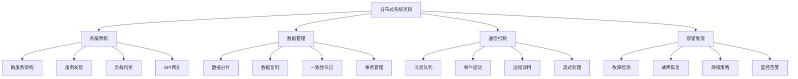

# 分布式系统项目

## 📖 核心概念

**分布式系统项目**是将分布式系统理论应用到实际项目中的实践。通过设计和实现分布式系统项目，可以深入理解分布式系统的架构设计、数据一致性、容错机制等核心概念，掌握分布式系统开发的实际技能。

### 🏗️ 分布式系统项目的组成要素



## 🔍 分布式系统项目分类

### 项目类型分类

| 项目类型 | 特点 | 技术栈 | 复杂度 | 适用场景 |
|----------|------|--------|--------|----------|
| **微服务项目** | 服务化架构 | Spring Cloud/Dubbo | 中等 | 企业应用 |
| **分布式存储** | 数据存储 | HDFS/Cassandra | 高 | 大数据 |
| **分布式计算** | 并行计算 | Spark/Flink | 高 | 数据处理 |
| **分布式缓存** | 缓存系统 | Redis/Memcached | 中等 | 性能优化 |

## 💻 分布式系统项目实现

### 微服务架构项目

```cpp
// 微服务架构项目
class MicroserviceProject {
private:
    struct Service {
        string serviceId;
        string serviceName;
        string host;
        int port;
        ServiceStatus status;
        map<string, string> metadata;
        
        Service(const string& id, const string& name, const string& h, int p) 
            : serviceId(id), serviceName(name), host(h), port(p), status(ServiceStatus::UNKNOWN) {}
        
        string getAddress() const {
            return host + ":" + to_string(port);
        }
    };
    
    enum class ServiceStatus {
        UNKNOWN,
        HEALTHY,
        UNHEALTHY,
        OFFLINE
    };
    
    struct ServiceRegistry {
        map<string, vector<Service>> services;
        mutex registryMutex;
        
        void registerService(const Service& service) {
            lock_guard<mutex> lock(registryMutex);
            services[service.serviceName].push_back(service);
        }
        
        void unregisterService(const string& serviceId) {
            lock_guard<mutex> lock(registryMutex);
            for (auto& [name, serviceList] : services) {
                serviceList.erase(
                    remove_if(serviceList.begin(), serviceList.end(),
                             [&serviceId](const Service& s) {
                                 return s.serviceId == serviceId;
                             }),
                    serviceList.end()
                );
            }
        }
        
        vector<Service> getServices(const string& serviceName) {
            lock_guard<mutex> lock(registryMutex);
            auto it = services.find(serviceName);
            if (it != services.end()) {
                return it->second;
            }
            return {};
        }
    };
    
    ServiceRegistry serviceRegistry;
    string currentServiceId;
    string currentServiceName;
    
public:
    MicroserviceProject(const string& serviceId, const string& serviceName) 
        : currentServiceId(serviceId), currentServiceName(serviceName) {}
    
    // 注册服务
    void registerService(const string& host, int port, const map<string, string>& metadata = {}) {
        Service service(currentServiceId, currentServiceName, host, port);
        service.metadata = metadata;
        service.status = ServiceStatus::HEALTHY;
        
        serviceRegistry.registerService(service);
        cout << "Service registered: " << currentServiceId << " at " << host << ":" << port << endl;
    }
    
    // 注销服务
    void unregisterService() {
        serviceRegistry.unregisterService(currentServiceId);
        cout << "Service unregistered: " << currentServiceId << endl;
    }
    
    // 发现服务
    vector<Service> discoverServices(const string& serviceName) {
        vector<Service> services = serviceRegistry.getServices(serviceName);
        cout << "Discovered " << services.size() << " services for " << serviceName << endl;
        return services;
    }
    
    // 服务调用
    string callService(const string& serviceName, const string& method, const string& params) {
        vector<Service> services = discoverServices(serviceName);
        if (services.empty()) {
            return "Service not found: " + serviceName;
        }
        
        // 选择服务实例（负载均衡）
        Service selectedService = selectService(services);
        
        // 模拟服务调用
        string result = "Response from " + selectedService.serviceId + ": " + method + "(" + params + ")";
        cout << "Service call: " << serviceName << "." << method << " -> " << selectedService.getAddress() << endl;
        
        return result;
    }
    
private:
    // 选择服务实例（简单的轮询负载均衡）
    Service selectService(const vector<Service>& services) {
        static int index = 0;
        return services[index++ % services.size()];
    }
    
public:
    // 健康检查
    void healthCheck() {
        cout << "Health check for service: " << currentServiceId << endl;
        // 实现健康检查逻辑
    }
    
    // 获取服务统计信息
    struct ServiceStatistics {
        int totalServices;
        int healthyServices;
        int unhealthyServices;
        double healthRate;
    };
    
    ServiceStatistics getStatistics() {
        ServiceStatistics stats;
        stats.totalServices = 0;
        stats.healthyServices = 0;
        stats.unhealthyServices = 0;
        stats.healthRate = 0;
        
        // 计算统计信息
        for (const auto& [name, services] : serviceRegistry.services) {
            for (const Service& service : services) {
                stats.totalServices++;
                if (service.status == ServiceStatus::HEALTHY) {
                    stats.healthyServices++;
                } else if (service.status == ServiceStatus::UNHEALTHY) {
                    stats.unhealthyServices++;
                }
            }
        }
        
        if (stats.totalServices > 0) {
            stats.healthRate = (double)stats.healthyServices / stats.totalServices;
        }
        
        return stats;
    }
};
```

### 分布式存储项目

```cpp
// 分布式存储项目
class DistributedStorageProject {
private:
    struct StorageNode {
        string nodeId;
        string host;
        int port;
        size_t totalSpace;
        size_t usedSpace;
        bool isActive;
        
        StorageNode(const string& id, const string& h, int p, size_t space) 
            : nodeId(id), host(h), port(p), totalSpace(space), usedSpace(0), isActive(true) {}
        
        double getUtilization() const {
            return totalSpace > 0 ? (double)usedSpace / totalSpace : 0;
        }
    };
    
    struct DataBlock {
        string blockId;
        string data;
        vector<string> replicaNodes;
        int replicationFactor;
        
        DataBlock(const string& id, const string& d, int factor) 
            : blockId(id), data(d), replicationFactor(factor) {}
    };
    
    map<string, StorageNode> storageNodes;
    map<string, DataBlock> dataBlocks;
    mutex storageMutex;
    
    int defaultReplicationFactor;
    
public:
    DistributedStorageProject(int replicationFactor = 3) 
        : defaultReplicationFactor(replicationFactor) {}
    
    // 添加存储节点
    void addStorageNode(const string& nodeId, const string& host, int port, size_t totalSpace) {
        lock_guard<mutex> lock(storageMutex);
        
        storageNodes[nodeId] = StorageNode(nodeId, host, port, totalSpace);
        cout << "Storage node added: " << nodeId << " at " << host << ":" << port << endl;
    }
    
    // 移除存储节点
    void removeStorageNode(const string& nodeId) {
        lock_guard<mutex> lock(storageMutex);
        
        auto it = storageNodes.find(nodeId);
        if (it != storageNodes.end()) {
            // 迁移数据到其他节点
            migrateData(nodeId);
            storageNodes.erase(it);
            cout << "Storage node removed: " << nodeId << endl;
        }
    }
    
    // 存储数据
    bool storeData(const string& key, const string& data) {
        lock_guard<mutex> lock(storageMutex);
        
        // 选择存储节点
        vector<string> selectedNodes = selectStorageNodes(defaultReplicationFactor);
        if (selectedNodes.empty()) {
            cout << "No available storage nodes" << endl;
            return false;
        }
        
        // 创建数据块
        string blockId = generateBlockId(key);
        DataBlock block(blockId, data, defaultReplicationFactor);
        block.replicaNodes = selectedNodes;
        
        dataBlocks[blockId] = block;
        
        // 更新节点使用空间
        for (const string& nodeId : selectedNodes) {
            auto it = storageNodes.find(nodeId);
            if (it != storageNodes.end()) {
                it->second.usedSpace += data.length();
            }
        }
        
        cout << "Data stored: " << key << " -> " << blockId << " on " << selectedNodes.size() << " nodes" << endl;
        return true;
    }
    
    // 读取数据
    string readData(const string& key) {
        lock_guard<mutex> lock(storageMutex);
        
        string blockId = generateBlockId(key);
        auto it = dataBlocks.find(blockId);
        if (it == dataBlocks.end()) {
            cout << "Data not found: " << key << endl;
            return "";
        }
        
        DataBlock& block = it->second;
        
        // 尝试从第一个可用节点读取
        for (const string& nodeId : block.replicaNodes) {
            auto nodeIt = storageNodes.find(nodeId);
            if (nodeIt != storageNodes.end() && nodeIt->second.isActive) {
                cout << "Data read: " << key << " from node " << nodeId << endl;
                return block.data;
            }
        }
        
        cout << "No available replica for: " << key << endl;
        return "";
    }
    
    // 删除数据
    bool deleteData(const string& key) {
        lock_guard<mutex> lock(storageMutex);
        
        string blockId = generateBlockId(key);
        auto it = dataBlocks.find(blockId);
        if (it == dataBlocks.end()) {
            cout << "Data not found: " << key << endl;
            return false;
        }
        
        DataBlock& block = it->second;
        
        // 从所有副本节点删除
        for (const string& nodeId : block.replicaNodes) {
            auto nodeIt = storageNodes.find(nodeId);
            if (nodeIt != storageNodes.end()) {
                nodeIt->second.usedSpace -= block.data.length();
            }
        }
        
        dataBlocks.erase(it);
        cout << "Data deleted: " << key << endl;
        return true;
    }
    
private:
    // 选择存储节点
    vector<string> selectStorageNodes(int count) {
        vector<string> availableNodes;
        
        for (const auto& [nodeId, node] : storageNodes) {
            if (node.isActive && node.getUtilization() < 0.9) {
                availableNodes.push_back(nodeId);
            }
        }
        
        if (availableNodes.size() < count) {
            return {};
        }
        
        // 简单的节点选择策略
        vector<string> selected;
        for (int i = 0; i < count; i++) {
            selected.push_back(availableNodes[i % availableNodes.size()]);
        }
        
        return selected;
    }
    
    // 迁移数据
    void migrateData(const string& nodeId) {
        for (auto& [blockId, block] : dataBlocks) {
            auto it = find(block.replicaNodes.begin(), block.replicaNodes.end(), nodeId);
            if (it != block.replicaNodes.end()) {
                // 选择新的存储节点
                vector<string> newNodes = selectStorageNodes(1);
                if (!newNodes.empty()) {
                    *it = newNodes[0];
                    cout << "Data migrated: " << blockId << " from " << nodeId << " to " << newNodes[0] << endl;
                }
            }
        }
    }
    
    // 生成块ID
    string generateBlockId(const string& key) {
        hash<string> hasher;
        return "block_" + to_string(hasher(key));
    }
    
public:
    // 获取存储统计信息
    struct StorageStatistics {
        int totalNodes;
        int activeNodes;
        int totalBlocks;
        size_t totalSpace;
        size_t usedSpace;
        double utilization;
    };
    
    StorageStatistics getStatistics() {
        lock_guard<mutex> lock(storageMutex);
        
        StorageStatistics stats;
        stats.totalNodes = storageNodes.size();
        stats.activeNodes = 0;
        stats.totalBlocks = dataBlocks.size();
        stats.totalSpace = 0;
        stats.usedSpace = 0;
        
        for (const auto& [nodeId, node] : storageNodes) {
            if (node.isActive) {
                stats.activeNodes++;
            }
            stats.totalSpace += node.totalSpace;
            stats.usedSpace += node.usedSpace;
        }
        
        if (stats.totalSpace > 0) {
            stats.utilization = (double)stats.usedSpace / stats.totalSpace;
        }
        
        return stats;
    }
};
```

### 分布式计算项目

```cpp
// 分布式计算项目
class DistributedComputingProject {
private:
    struct ComputeNode {
        string nodeId;
        string host;
        int port;
        int cores;
        int memory;
        bool isActive;
        int currentTasks;
        
        ComputeNode(const string& id, const string& h, int p, int c, int m) 
            : nodeId(id), host(h), port(p), cores(c), memory(m), isActive(true), currentTasks(0) {}
        
        double getLoad() const {
            return cores > 0 ? (double)currentTasks / cores : 0;
        }
    };
    
    struct ComputeTask {
        string taskId;
        string taskType;
        string inputData;
        string outputData;
        TaskStatus status;
        string assignedNode;
        chrono::system_clock::time_point startTime;
        
        ComputeTask(const string& id, const string& type, const string& input) 
            : taskId(id), taskType(type), inputData(input), status(TaskStatus::PENDING) {
            startTime = chrono::system_clock::now();
        }
    };
    
    enum class TaskStatus {
        PENDING,
        RUNNING,
        COMPLETED,
        FAILED
    };
    
    map<string, ComputeNode> computeNodes;
    queue<ComputeTask> taskQueue;
    map<string, ComputeTask> runningTasks;
    mutex computeMutex;
    
    thread taskScheduler;
    atomic<bool> isRunning;
    
public:
    DistributedComputingProject() : isRunning(false) {}
    
    ~DistributedComputingProject() {
        stop();
    }
    
    // 启动计算系统
    void start() {
        isRunning = true;
        taskScheduler = thread(&DistributedComputingProject::taskSchedulingLoop, this);
        cout << "Distributed computing system started" << endl;
    }
    
    // 停止计算系统
    void stop() {
        isRunning = false;
        if (taskScheduler.joinable()) {
            taskScheduler.join();
        }
        cout << "Distributed computing system stopped" << endl;
    }
    
    // 添加计算节点
    void addComputeNode(const string& nodeId, const string& host, int port, int cores, int memory) {
        lock_guard<mutex> lock(computeMutex);
        
        computeNodes[nodeId] = ComputeNode(nodeId, host, port, cores, memory);
        cout << "Compute node added: " << nodeId << " (" << cores << " cores, " << memory << " MB)" << endl;
    }
    
    // 移除计算节点
    void removeComputeNode(const string& nodeId) {
        lock_guard<mutex> lock(computeMutex);
        
        auto it = computeNodes.find(nodeId);
        if (it != computeNodes.end()) {
            // 迁移任务到其他节点
            migrateTasks(nodeId);
            computeNodes.erase(it);
            cout << "Compute node removed: " << nodeId << endl;
        }
    }
    
    // 提交计算任务
    string submitTask(const string& taskType, const string& inputData) {
        string taskId = generateTaskId();
        ComputeTask task(taskId, taskType, inputData);
        
        {
            lock_guard<mutex> lock(computeMutex);
            taskQueue.push(task);
        }
        
        cout << "Task submitted: " << taskId << " (" << taskType << ")" << endl;
        return taskId;
    }
    
    // 获取任务结果
    string getTaskResult(const string& taskId) {
        lock_guard<mutex> lock(computeMutex);
        
        auto it = runningTasks.find(taskId);
        if (it != runningTasks.end()) {
            if (it->second.status == TaskStatus::COMPLETED) {
                return it->second.outputData;
            } else if (it->second.status == TaskStatus::FAILED) {
                return "Task failed: " + taskId;
            }
        }
        
        return "Task not found or still running: " + taskId;
    }
    
private:
    // 任务调度循环
    void taskSchedulingLoop() {
        while (isRunning) {
            if (!taskQueue.empty()) {
                ComputeTask task = taskQueue.front();
                taskQueue.pop();
                
                // 选择计算节点
                string selectedNode = selectComputeNode();
                if (!selectedNode.empty()) {
                    // 分配任务
                    assignTask(task, selectedNode);
                } else {
                    // 没有可用节点，重新加入队列
                    taskQueue.push(task);
                }
            }
            
            // 检查运行中的任务
            checkRunningTasks();
            
            this_thread::sleep_for(chrono::milliseconds(100));
        }
    }
    
    // 选择计算节点
    string selectComputeNode() {
        lock_guard<mutex> lock(computeMutex);
        
        string selectedNode;
        double minLoad = 1.0;
        
        for (const auto& [nodeId, node] : computeNodes) {
            if (node.isActive && node.getLoad() < minLoad) {
                minLoad = node.getLoad();
                selectedNode = nodeId;
            }
        }
        
        return selectedNode;
    }
    
    // 分配任务
    void assignTask(ComputeTask& task, const string& nodeId) {
        lock_guard<mutex> lock(computeMutex);
        
        auto it = computeNodes.find(nodeId);
        if (it != computeNodes.end()) {
            task.status = TaskStatus::RUNNING;
            task.assignedNode = nodeId;
            it->second.currentTasks++;
            
            runningTasks[task.taskId] = task;
            
            cout << "Task assigned: " << task.taskId << " to node " << nodeId << endl;
            
            // 模拟任务执行
            thread([this, taskId = task.taskId]() {
                this_thread::sleep_for(chrono::seconds(2));
                completeTask(taskId);
            }).detach();
        }
    }
    
    // 完成任务
    void completeTask(const string& taskId) {
        lock_guard<mutex> lock(computeMutex);
        
        auto it = runningTasks.find(taskId);
        if (it != runningTasks.end()) {
            ComputeTask& task = it->second;
            task.status = TaskStatus::COMPLETED;
            task.outputData = "Result for " + task.taskId;
            
            // 释放节点资源
            auto nodeIt = computeNodes.find(task.assignedNode);
            if (nodeIt != computeNodes.end()) {
                nodeIt->second.currentTasks--;
            }
            
            cout << "Task completed: " << taskId << endl;
        }
    }
    
    // 检查运行中的任务
    void checkRunningTasks() {
        lock_guard<mutex> lock(computeMutex);
        
        auto it = runningTasks.begin();
        while (it != runningTasks.end()) {
            auto now = chrono::system_clock::now();
            auto duration = chrono::duration_cast<chrono::seconds>(now - it->second.startTime);
            
            if (duration.count() > 30) { // 超时
                it->second.status = TaskStatus::FAILED;
                cout << "Task timeout: " << it->first << endl;
            }
            
            it++;
        }
    }
    
    // 迁移任务
    void migrateTasks(const string& nodeId) {
        for (auto& [taskId, task] : runningTasks) {
            if (task.assignedNode == nodeId) {
                // 选择新的计算节点
                string newNode = selectComputeNode();
                if (!newNode.empty()) {
                    task.assignedNode = newNode;
                    cout << "Task migrated: " << taskId << " to node " << newNode << endl;
                }
            }
        }
    }
    
    // 生成任务ID
    string generateTaskId() {
        static int counter = 0;
        return "task_" + to_string(++counter);
    }
    
public:
    // 获取计算统计信息
    struct ComputeStatistics {
        int totalNodes;
        int activeNodes;
        int queuedTasks;
        int runningTasks;
        int completedTasks;
        double averageLoad;
    };
    
    ComputeStatistics getStatistics() {
        lock_guard<mutex> lock(computeMutex);
        
        ComputeStatistics stats;
        stats.totalNodes = computeNodes.size();
        stats.activeNodes = 0;
        stats.queuedTasks = taskQueue.size();
        stats.runningTasks = 0;
        stats.completedTasks = 0;
        stats.averageLoad = 0;
        
        double totalLoad = 0;
        
        for (const auto& [nodeId, node] : computeNodes) {
            if (node.isActive) {
                stats.activeNodes++;
                totalLoad += node.getLoad();
            }
        }
        
        for (const auto& [taskId, task] : runningTasks) {
            if (task.status == TaskStatus::RUNNING) {
                stats.runningTasks++;
            } else if (task.status == TaskStatus::COMPLETED) {
                stats.completedTasks++;
            }
        }
        
        if (stats.activeNodes > 0) {
            stats.averageLoad = totalLoad / stats.activeNodes;
        }
        
        return stats;
    }
};
```

### 分布式系统项目测试

```cpp
// 分布式系统项目测试
class DistributedSystemProjectTest {
public:
    static void runAllTests() {
        cout << "=== Distributed System Project Tests ===" << endl;
        
        // 测试微服务架构
        testMicroserviceArchitecture();
        
        cout << "\n" << string(50, '=') << endl;
        
        // 测试分布式存储
        testDistributedStorage();
        
        cout << "\n" << string(50, '=') << endl;
        
        // 测试分布式计算
        testDistributedComputing();
    }
    
private:
    static void testMicroserviceArchitecture() {
        cout << "=== Microservice Architecture Test ===" << endl;
        
        MicroserviceProject ms1("service1", "user-service");
        MicroserviceProject ms2("service2", "order-service");
        MicroserviceProject ms3("service3", "user-service");
        
        // 注册服务
        ms1.registerService("192.168.1.1", 8080);
        ms2.registerService("192.168.1.2", 8080);
        ms3.registerService("192.168.1.3", 8080);
        
        // 服务发现
        auto services = ms1.discoverServices("user-service");
        cout << "Discovered " << services.size() << " user services" << endl;
        
        // 服务调用
        string result = ms1.callService("user-service", "getUser", "123");
        cout << "Service call result: " << result << endl;
        
        // 获取统计信息
        auto stats = ms1.getStatistics();
        cout << "\nMicroservice statistics:" << endl;
        cout << "Total services: " << stats.totalServices << endl;
        cout << "Healthy services: " << stats.healthyServices << endl;
        cout << "Health rate: " << stats.healthRate << endl;
        
        cout << "Microservice architecture test completed" << endl;
    }
    
    static void testDistributedStorage() {
        cout << "=== Distributed Storage Test ===" << endl;
        
        DistributedStorageProject dsp;
        
        // 添加存储节点
        dsp.addStorageNode("node1", "192.168.1.1", 9000, 1024 * 1024 * 1024); // 1GB
        dsp.addStorageNode("node2", "192.168.1.2", 9000, 1024 * 1024 * 1024); // 1GB
        dsp.addStorageNode("node3", "192.168.1.3", 9000, 1024 * 1024 * 1024); // 1GB
        
        // 存储数据
        dsp.storeData("key1", "Hello, Distributed Storage!");
        dsp.storeData("key2", "This is a test message");
        
        // 读取数据
        string value1 = dsp.readData("key1");
        string value2 = dsp.readData("key2");
        
        cout << "Retrieved values: " << value1 << ", " << value2 << endl;
        
        // 删除数据
        dsp.deleteData("key1");
        
        // 获取统计信息
        auto stats = dsp.getStatistics();
        cout << "\nStorage statistics:" << endl;
        cout << "Total nodes: " << stats.totalNodes << endl;
        cout << "Active nodes: " << stats.activeNodes << endl;
        cout << "Total blocks: " << stats.totalBlocks << endl;
        cout << "Utilization: " << stats.utilization << endl;
        
        cout << "Distributed storage test completed" << endl;
    }
    
    static void testDistributedComputing() {
        cout << "=== Distributed Computing Test ===" << endl;
        
        DistributedComputingProject dcp;
        
        // 启动计算系统
        dcp.start();
        
        // 添加计算节点
        dcp.addComputeNode("node1", "192.168.1.1", 8000, 4, 8192); // 4 cores, 8GB
        dcp.addComputeNode("node2", "192.168.1.2", 8000, 8, 16384); // 8 cores, 16GB
        dcp.addComputeNode("node3", "192.168.1.3", 8000, 2, 4096); // 2 cores, 4GB
        
        // 提交任务
        string task1 = dcp.submitTask("map", "data1");
        string task2 = dcp.submitTask("reduce", "data2");
        string task3 = dcp.submitTask("filter", "data3");
        
        cout << "Tasks submitted: " << task1 << ", " << task2 << ", " << task3 << endl;
        
        // 等待任务完成
        this_thread::sleep_for(chrono::seconds(3));
        
        // 获取任务结果
        string result1 = dcp.getTaskResult(task1);
        string result2 = dcp.getTaskResult(task2);
        string result3 = dcp.getTaskResult(task3);
        
        cout << "Task results: " << result1 << ", " << result2 << ", " << result3 << endl;
        
        // 获取统计信息
        auto stats = dcp.getStatistics();
        cout << "\nCompute statistics:" << endl;
        cout << "Total nodes: " << stats.totalNodes << endl;
        cout << "Active nodes: " << stats.activeNodes << endl;
        cout << "Queued tasks: " << stats.queuedTasks << endl;
        cout << "Running tasks: " << stats.runningTasks << endl;
        cout << "Completed tasks: " << stats.completedTasks << endl;
        cout << "Average load: " << stats.averageLoad << endl;
        
        // 停止计算系统
        dcp.stop();
        
        cout << "Distributed computing test completed" << endl;
    }
};
```

## ⚡ 复杂度分析

### 分布式系统项目复杂度

| 项目类型 | 时间复杂度 | 空间复杂度 | 网络开销 | 适用场景 |
|----------|------------|------------|----------|----------|
| **微服务** | O(log n) | O(n) | 中 | 企业应用 |
| **分布式存储** | O(log n) | O(n) | 高 | 大数据存储 |
| **分布式计算** | O(n) | O(n) | 高 | 并行计算 |
| **分布式缓存** | O(1) | O(n) | 低 | 性能优化 |

## 🎓 学习要点总结

### 核心理解

1. **系统架构**：理解分布式系统的架构设计
2. **数据管理**：掌握分布式数据管理
3. **通信机制**：理解分布式通信机制
4. **容错处理**：掌握容错处理机制

### 实践要点

1. **系统设计**：设计分布式系统
2. **性能优化**：优化分布式系统性能
3. **故障处理**：处理分布式系统故障
4. **监控管理**：监控和管理分布式系统

### 应用思维

1. **系统思维**：从系统角度思考问题
2. **分布式思维**：理解分布式系统的特点
3. **一致性思维**：平衡一致性和性能
4. **实际应用**：将分布式技术应用到实际问题中

---

**相关链接：**
- [[06-应用实战/04-网络应用/04-分布式系统|分布式系统]] - 分布式系统基础
- [[06-应用实战/01-数据库王国/05-分布式数据库|分布式数据库]] - 分布式数据库技术
- [[06-应用实战/03-缓存系统/04-分布式缓存|分布式缓存]] - 分布式缓存技术
- [[07-练习战场/03-项目实战/05-高性能计算项目|高性能计算项目]] - 高性能计算项目实战
