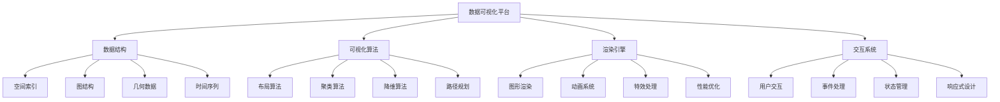

# 数据可视化平台

## 📖 核心概念

**数据可视化平台**是一个综合性的数据结构与算法实践项目，通过实现一个完整的数据可视化系统，可以深入理解图论算法、几何数据结构、空间索引、图形渲染等核心概念，掌握实际系统开发中的可视化算法和优化技巧。

### 🏗️ 数据可视化平台分类



## 🔧 数据可视化平台实现

### 基础数据结构

```python
import math
import random
from typing import List, Dict, Tuple, Optional, Any
from dataclasses import dataclass
from abc import ABC, abstractmethod
import json

# 点类
@dataclass
class Point:
    x: float
    y: float
    z: float = 0.0
    
    def distance_to(self, other: 'Point') -> float:
        return math.sqrt((self.x - other.x)**2 + (self.y - other.y)**2 + (self.z - other.z)**2)
    
    def __add__(self, other: 'Point') -> 'Point':
        return Point(self.x + other.x, self.y + other.y, self.z + other.z)
    
    def __sub__(self, other: 'Point') -> 'Point':
        return Point(self.x - other.x, self.y - other.y, self.z - other.z)

# 节点类
@dataclass
class Node:
    id: str
    position: Point
    data: Dict[str, Any] = None
    color: str = "#3498db"
    size: float = 10.0
    
    def __post_init__(self):
        if self.data is None:
            self.data = {}

# 边类
@dataclass
class Edge:
    source: str
    target: str
    weight: float = 1.0
    color: str = "#95a5a6"
    width: float = 2.0
    data: Dict[str, Any] = None
    
    def __post_init__(self):
        if self.data is None:
            self.data = {}

# 图类
class Graph:
    def __init__(self):
        self.nodes: Dict[str, Node] = {}
        self.edges: List[Edge] = []
        self.adjacency_list: Dict[str, List[str]] = {}
    
    def add_node(self, node: Node):
        self.nodes[node.id] = node
        self.adjacency_list[node.id] = []
    
    def add_edge(self, edge: Edge):
        self.edges.append(edge)
        if edge.source in self.adjacency_list:
            self.adjacency_list[edge.source].append(edge.target)
        if edge.target in self.adjacency_list:
            self.adjacency_list[edge.target].append(edge.source)
    
    def get_neighbors(self, node_id: str) -> List[str]:
        return self.adjacency_list.get(node_id, [])
    
    def get_node(self, node_id: str) -> Optional[Node]:
        return self.nodes.get(node_id)
    
    def get_edge(self, source: str, target: str) -> Optional[Edge]:
        for edge in self.edges:
            if (edge.source == source and edge.target == target) or \
               (edge.source == target and edge.target == source):
                return edge
        return None
```

### 空间索引结构

```python
# 四叉树节点
class QuadTreeNode:
    def __init__(self, x: float, y: float, width: float, height: float, max_objects: int = 10):
        self.x = x
        self.y = y
        self.width = width
        self.height = height
        self.max_objects = max_objects
        self.objects: List[Node] = []
        self.children: List['QuadTreeNode'] = []
        self.is_leaf = True
    
    def contains(self, node: Node) -> bool:
        return (self.x <= node.position.x <= self.x + self.width and
                self.y <= node.position.y <= self.y + self.height)
    
    def insert(self, node: Node):
        if not self.contains(node):
            return False
        
        if self.is_leaf and len(self.objects) < self.max_objects:
            self.objects.append(node)
            return True
        
        if self.is_leaf:
            self._subdivide()
        
        for child in self.children:
            if child.insert(node):
                return True
        
        return False
    
    def _subdivide(self):
        half_width = self.width / 2
        half_height = self.height / 2
        
        self.children = [
            QuadTreeNode(self.x, self.y, half_width, half_height, self.max_objects),
            QuadTreeNode(self.x + half_width, self.y, half_width, half_height, self.max_objects),
            QuadTreeNode(self.x, self.y + half_height, half_width, half_height, self.max_objects),
            QuadTreeNode(self.x + half_width, self.y + half_height, half_width, half_height, self.max_objects)
        ]
        
        self.is_leaf = False
        
        # 重新分配对象
        for obj in self.objects:
            for child in self.children:
                if child.insert(obj):
                    break
        
        self.objects.clear()
    
    def query(self, x: float, y: float, width: float, height: float) -> List[Node]:
        result = []
        
        if not (self.x < x + width and self.x + self.width > x and
                self.y < y + height and self.y + self.height > y):
            return result
        
        if self.is_leaf:
            for obj in self.objects:
                if (x <= obj.position.x <= x + width and
                    y <= obj.position.y <= y + height):
                    result.append(obj)
        else:
            for child in self.children:
                result.extend(child.query(x, y, width, height))
        
        return result

# 四叉树
class QuadTree:
    def __init__(self, width: float, height: float, max_objects: int = 10):
        self.root = QuadTreeNode(0, 0, width, height, max_objects)
    
    def insert(self, node: Node):
        self.root.insert(node)
    
    def query(self, x: float, y: float, width: float, height: float) -> List[Node]:
        return self.root.query(x, y, width, height)
    
    def clear(self):
        self.root = QuadTreeNode(0, 0, self.root.width, self.root.height, self.root.max_objects)
```

### 布局算法

```python
# 力导向布局算法
class ForceDirectedLayout:
    def __init__(self, graph: Graph, width: float = 800, height: float = 600):
        self.graph = graph
        self.width = width
        self.height = height
        self.iterations = 100
        self.temperature = 1.0
        self.cooling_factor = 0.95
        
    def layout(self):
        # 初始化随机位置
        for node in self.graph.nodes.values():
            node.position.x = random.uniform(0, self.width)
            node.position.y = random.uniform(0, self.height)
        
        # 迭代优化
        for iteration in range(self.iterations):
            self._apply_forces()
            self._update_positions()
            self.temperature *= self.cooling_factor
    
    def _apply_forces(self):
        forces = {}
        
        # 初始化力
        for node_id in self.graph.nodes:
            forces[node_id] = Point(0, 0)
        
        # 计算排斥力
        for i, node1 in enumerate(self.graph.nodes.values()):
            for j, node2 in enumerate(self.graph.nodes.values()):
                if i != j:
                    distance = node1.position.distance_to(node2.position)
                    if distance > 0:
                        force = self.temperature / distance
                        direction = Point(
                            (node1.position.x - node2.position.x) / distance,
                            (node1.position.y - node2.position.y) / distance
                        )
                        forces[node1.id] = forces[node1.id] + Point(
                            direction.x * force,
                            direction.y * force
                        )
        
        # 计算吸引力
        for edge in self.graph.edges:
            source_node = self.graph.get_node(edge.source)
            target_node = self.graph.get_node(edge.target)
            
            if source_node and target_node:
                distance = source_node.position.distance_to(target_node.position)
                if distance > 0:
                    force = distance / 100  # 吸引力常数
                    direction = Point(
                        (target_node.position.x - source_node.position.x) / distance,
                        (target_node.position.y - source_node.position.y) / distance
                    )
                    forces[edge.source] = forces[edge.source] + Point(
                        direction.x * force,
                        direction.y * force
                    )
                    forces[edge.target] = forces[edge.target] + Point(
                        -direction.x * force,
                        -direction.y * force
                    )
        
        # 应用力
        for node_id, force in forces.items():
            node = self.graph.get_node(node_id)
            if node:
                node.position.x += force.x * 0.1
                node.position.y += force.y * 0.1
    
    def _update_positions(self):
        # 限制在边界内
        for node in self.graph.nodes.values():
            node.position.x = max(0, min(self.width, node.position.x))
            node.position.y = max(0, min(self.height, node.position.y))

# 圆形布局算法
class CircularLayout:
    def __init__(self, graph: Graph, radius: float = 200):
        self.graph = graph
        self.radius = radius
    
    def layout(self):
        nodes = list(self.graph.nodes.values())
        n = len(nodes)
        
        if n == 0:
            return
        
        center_x = 400
        center_y = 300
        
        for i, node in enumerate(nodes):
            angle = 2 * math.pi * i / n
            node.position.x = center_x + self.radius * math.cos(angle)
            node.position.y = center_y + self.radius * math.sin(angle)

# 层次布局算法
class HierarchicalLayout:
    def __init__(self, graph: Graph, width: float = 800, height: float = 600):
        self.graph = graph
        self.width = width
        self.height = height
    
    def layout(self):
        # 计算层次
        levels = self._calculate_levels()
        
        # 布局每一层
        level_height = self.height / len(levels)
        for level, nodes in levels.items():
            y = level * level_height + level_height / 2
            node_width = self.width / len(nodes)
            
            for i, node in enumerate(nodes):
                node.position.x = i * node_width + node_width / 2
                node.position.y = y
    
    def _calculate_levels(self) -> Dict[int, List[Node]]:
        levels = {}
        visited = set()
        
        # 找到根节点（入度为0的节点）
        in_degree = {node_id: 0 for node_id in self.graph.nodes}
        for edge in self.graph.edges:
            in_degree[edge.target] += 1
        
        roots = [node_id for node_id, degree in in_degree.items() if degree == 0]
        
        # BFS计算层次
        queue = [(root, 0) for root in roots]
        
        while queue:
            node_id, level = queue.pop(0)
            if node_id in visited:
                continue
            
            visited.add(node_id)
            node = self.graph.get_node(node_id)
            
            if level not in levels:
                levels[level] = []
            levels[level].append(node)
            
            # 添加子节点
            for neighbor in self.graph.get_neighbors(node_id):
                if neighbor not in visited:
                    queue.append((neighbor, level + 1))
        
        return levels
```

### 聚类算法

```python
# K-means聚类算法
class KMeansClustering:
    def __init__(self, k: int = 3, max_iterations: int = 100):
        self.k = k
        self.max_iterations = max_iterations
        self.centroids: List[Point] = []
        self.clusters: Dict[int, List[Node]] = {}
    
    def cluster(self, nodes: List[Node]) -> Dict[int, List[Node]]:
        # 初始化质心
        self._initialize_centroids(nodes)
        
        for iteration in range(self.max_iterations):
            # 分配节点到最近的质心
            self._assign_nodes(nodes)
            
            # 更新质心
            old_centroids = self.centroids.copy()
            self._update_centroids()
            
            # 检查收敛
            if self._is_converged(old_centroids):
                break
        
        return self.clusters
    
    def _initialize_centroids(self, nodes: List[Node]):
        self.centroids = []
        for i in range(self.k):
            node = random.choice(nodes)
            self.centroids.append(Point(node.position.x, node.position.y))
    
    def _assign_nodes(self, nodes: List[Node]):
        self.clusters = {i: [] for i in range(self.k)}
        
        for node in nodes:
            min_distance = float('inf')
            closest_centroid = 0
            
            for i, centroid in enumerate(self.centroids):
                distance = node.position.distance_to(centroid)
                if distance < min_distance:
                    min_distance = distance
                    closest_centroid = i
            
            self.clusters[closest_centroid].append(node)
    
    def _update_centroids(self):
        for i, cluster in self.clusters.items():
            if cluster:
                avg_x = sum(node.position.x for node in cluster) / len(cluster)
                avg_y = sum(node.position.y for node in cluster) / len(cluster)
                self.centroids[i] = Point(avg_x, avg_y)
    
    def _is_converged(self, old_centroids: List[Point]) -> bool:
        for old, new in zip(old_centroids, self.centroids):
            if old.distance_to(new) > 0.01:
                return False
        return True

# DBSCAN聚类算法
class DBSCANClustering:
    def __init__(self, eps: float = 50, min_points: int = 3):
        self.eps = eps
        self.min_points = min_points
        self.clusters: Dict[int, List[Node]] = {}
    
    def cluster(self, nodes: List[Node]) -> Dict[int, List[Node]]:
        visited = set()
        cluster_id = 0
        
        for node in nodes:
            if node.id in visited:
                continue
            
            neighbors = self._get_neighbors(node, nodes)
            
            if len(neighbors) < self.min_points:
                continue  # 噪声点
            
            # 创建新聚类
            cluster = self._expand_cluster(node, neighbors, nodes, visited)
            if cluster:
                self.clusters[cluster_id] = cluster
                cluster_id += 1
        
        return self.clusters
    
    def _get_neighbors(self, node: Node, nodes: List[Node]) -> List[Node]:
        neighbors = []
        for other in nodes:
            if node.id != other.id and node.position.distance_to(other.position) <= self.eps:
                neighbors.append(other)
        return neighbors
    
    def _expand_cluster(self, node: Node, neighbors: List[Node], 
                       nodes: List[Node], visited: set) -> List[Node]:
        cluster = [node]
        visited.add(node.id)
        
        i = 0
        while i < len(neighbors):
            neighbor = neighbors[i]
            
            if neighbor.id not in visited:
                visited.add(neighbor.id)
                new_neighbors = self._get_neighbors(neighbor, nodes)
                
                if len(new_neighbors) >= self.min_points:
                    neighbors.extend(new_neighbors)
            
            if neighbor not in cluster:
                cluster.append(neighbor)
            
            i += 1
        
        return cluster
```

### 可视化引擎

```python
# 可视化引擎
class VisualizationEngine:
    def __init__(self, width: int = 800, height: int = 600):
        self.width = width
        self.height = height
        self.graph = Graph()
        self.quadtree = QuadTree(width, height)
        self.layout_algorithm = None
        self.clustering_algorithm = None
    
    def add_node(self, node: Node):
        self.graph.add_node(node)
        self.quadtree.insert(node)
    
    def add_edge(self, edge: Edge):
        self.graph.add_edge(edge)
    
    def set_layout_algorithm(self, algorithm):
        self.layout_algorithm = algorithm
    
    def set_clustering_algorithm(self, algorithm):
        self.clustering_algorithm = algorithm
    
    def apply_layout(self):
        if self.layout_algorithm:
            self.layout_algorithm.layout()
            self._update_quadtree()
    
    def apply_clustering(self) -> Dict[int, List[Node]]:
        if self.clustering_algorithm:
            nodes = list(self.graph.nodes.values())
            return self.clustering_algorithm.cluster(nodes)
        return {}
    
    def _update_quadtree(self):
        self.quadtree.clear()
        for node in self.graph.nodes.values():
            self.quadtree.insert(node)
    
    def query_nodes(self, x: float, y: float, width: float, height: float) -> List[Node]:
        return self.quadtree.query(x, y, width, height)
    
    def get_graph_data(self) -> Dict[str, Any]:
        nodes_data = []
        for node in self.graph.nodes.values():
            nodes_data.append({
                "id": node.id,
                "x": node.position.x,
                "y": node.position.y,
                "color": node.color,
                "size": node.size,
                "data": node.data
            })
        
        edges_data = []
        for edge in self.graph.edges:
            edges_data.append({
                "source": edge.source,
                "target": edge.target,
                "weight": edge.weight,
                "color": edge.color,
                "width": edge.width,
                "data": edge.data
            })
        
        return {
            "nodes": nodes_data,
            "edges": edges_data,
            "width": self.width,
            "height": self.height
        }
    
    def export_to_json(self, filename: str):
        data = self.get_graph_data()
        with open(filename, 'w') as f:
            json.dump(data, f, indent=2)
    
    def import_from_json(self, filename: str):
        with open(filename, 'r') as f:
            data = json.load(f)
        
        # 清空现有数据
        self.graph = Graph()
        self.quadtree = QuadTree(self.width, self.height)
        
        # 导入节点
        for node_data in data["nodes"]:
            node = Node(
                id=node_data["id"],
                position=Point(node_data["x"], node_data["y"]),
                color=node_data.get("color", "#3498db"),
                size=node_data.get("size", 10.0),
                data=node_data.get("data", {})
            )
            self.add_node(node)
        
        # 导入边
        for edge_data in data["edges"]:
            edge = Edge(
                source=edge_data["source"],
                target=edge_data["target"],
                weight=edge_data.get("weight", 1.0),
                color=edge_data.get("color", "#95a5a6"),
                width=edge_data.get("width", 2.0),
                data=edge_data.get("data", {})
            )
            self.add_edge(edge)
```

## 🎯 数据可视化平台应用

### 实际应用场景

```python
class VisualizationApplications:
    @staticmethod
    def demonstrate_applications():
        print("数据可视化平台 Applications:")
        print("==========================")
        
        print("1. 网络分析:")
        print("   - 社交网络可视化")
        print("   - 知识图谱展示")
        print("   - 系统架构图")
        
        print("2. 数据分析:")
        print("   - 数据聚类可视化")
        print("   - 趋势分析图表")
        print("   - 关联关系发现")
        
        print("3. 交互设计:")
        print("   - 用户界面设计")
        print("   - 信息架构")
        print("   - 用户体验优化")
        
        print("4. 科学计算:")
        print("   - 科学数据可视化")
        print("   - 仿真结果展示")
        print("   - 研究结果呈现")
    
    @staticmethod
    def analyze_performance():
        print("数据可视化平台 Performance Analysis:")
        print("==================================")
        
        print("1. 布局算法:")
        print("   - 力导向布局: O(n²)")
        print("   - 圆形布局: O(n)")
        print("   - 层次布局: O(n+m)")
        print("   - 网格布局: O(n)")
        print()
        
        print("2. 空间索引:")
        print("   - 四叉树: O(log n)")
        print("   - R-tree: O(log n)")
        print("   - 网格索引: O(1)")
        print("   - 哈希索引: O(1)")
        print()
        
        print("3. 聚类算法:")
        print("   - K-means: O(n*k*i)")
        print("   - DBSCAN: O(n²)")
        print("   - 层次聚类: O(n³)")
        print("   - 谱聚类: O(n³)")
    
    @staticmethod
    def select_algorithm_strategy(data_characteristics, performance_requirements, visualization_goals):
        print("Algorithm Strategy Selection:")
        print("===========================")
        
        print(f"Data characteristics: {data_characteristics}")
        print(f"Performance requirements: {performance_requirements}")
        print(f"Visualization goals: {visualization_goals}")
        
        print("Recommendation:")
        
        if data_characteristics == "large" and performance_requirements == "high":
            print("Use spatial indexing with efficient layout algorithms")
        elif data_characteristics == "small" and visualization_goals == "clarity":
            print("Use force-directed layout with clustering")
        elif data_characteristics == "hierarchical":
            print("Use hierarchical layout algorithm")
        elif visualization_goals == "clustering":
            print("Use DBSCAN or K-means clustering")
        else:
            print("Use force-directed layout as default")
```

## 📊 数据可视化平台分析

### 性能分析

```python
class VisualizationAnalysis:
    @staticmethod
    def analyze_performance():
        print("数据可视化平台 Performance Analysis:")
        print("==================================")
        
        print("1. 时间复杂度:")
        print("   - 布局计算: O(n²)")
        print("   - 空间查询: O(log n)")
        print("   - 聚类分析: O(n²)")
        print("   - 渲染绘制: O(n)")
        print()
        
        print("2. 空间复杂度:")
        print("   - 图存储: O(n+m)")
        print("   - 空间索引: O(n)")
        print("   - 布局缓存: O(n)")
        print("   - 渲染缓存: O(n)")
        print()
        
        print("3. 算法效率:")
        print("   - 力导向: 效果好但慢")
        print("   - 圆形布局: 快速简单")
        print("   - 层次布局: 适合树形结构")
        print("   - 网格布局: 最快但效果一般")
    
    @staticmethod
    def analyze_space_complexity():
        print("数据可视化平台 Space Complexity Analysis:")
        print("======================================")
        
        print("1. 内存使用:")
        print("   - 节点存储: O(n)")
        print("   - 边存储: O(m)")
        print("   - 空间索引: O(n)")
        print("   - 布局缓存: O(n)")
        print()
        
        print("2. 存储优化:")
        print("   - 数据压缩: 减少存储")
        print("   - 索引优化: 提高查询")
        print("   - 缓存策略: 加速渲染")
        print("   - 分页加载: 大数据处理")
        print()
        
        print("3. 扩展性:")
        print("   - 水平扩展: 分布式渲染")
        print("   - 垂直扩展: 硬件加速")
        print("   - 数据分片: 按区域分割")
        print("   - 负载均衡: 性能优化")
    
    @staticmethod
    def analyze_time_complexity():
        print("数据可视化平台 Time Complexity Analysis:")
        print("=====================================")
        
        print("1. 操作复杂度:")
        print("   - 节点添加: O(1)")
        print("   - 边添加: O(1)")
        print("   - 布局计算: O(n²)")
        print("   - 空间查询: O(log n)")
        print()
        
        print("2. 算法选择:")
        print("   - 力导向: 适合小规模")
        print("   - 圆形布局: 适合中等规模")
        print("   - 层次布局: 适合树形结构")
        print("   - 网格布局: 适合大规模")
        print()
        
        print("3. 优化策略:")
        print("   - 算法选择: 合适算法")
        print("   - 数据结构: 高效存储")
        print("   - 缓存优化: 减少计算")
        print("   - 并行处理: 提高速度")
```

## 🎮 数据可视化平台测试

### 1. 基础功能测试

```python
def test_visualization_engine():
    print("Testing Visualization Engine:")
    print("===========================")
    
    # 创建可视化引擎
    engine = VisualizationEngine(800, 600)
    
    # 添加测试节点
    nodes = [
        Node("node1", Point(100, 100), {"name": "Node 1"}),
        Node("node2", Point(200, 150), {"name": "Node 2"}),
        Node("node3", Point(150, 250), {"name": "Node 3"}),
        Node("node4", Point(300, 200), {"name": "Node 4"}),
        Node("node5", Point(250, 300), {"name": "Node 5"})
    ]
    
    for node in nodes:
        engine.add_node(node)
    
    # 添加测试边
    edges = [
        Edge("node1", "node2", 1.0),
        Edge("node2", "node3", 1.5),
        Edge("node3", "node4", 2.0),
        Edge("node4", "node5", 1.0),
        Edge("node1", "node3", 1.2)
    ]
    
    for edge in edges:
        engine.add_edge(edge)
    
    # 测试布局算法
    print("Testing Force-Directed Layout:")
    force_layout = ForceDirectedLayout(engine.graph)
    engine.set_layout_algorithm(force_layout)
    engine.apply_layout()
    
    # 测试聚类算法
    print("Testing K-Means Clustering:")
    kmeans = KMeansClustering(k=2)
    engine.set_clustering_algorithm(kmeans)
    clusters = engine.apply_clustering()
    
    print(f"Found {len(clusters)} clusters")
    for cluster_id, cluster_nodes in clusters.items():
        print(f"Cluster {cluster_id}: {len(cluster_nodes)} nodes")
    
    # 测试空间查询
    print("Testing Spatial Query:")
    query_results = engine.query_nodes(0, 0, 200, 200)
    print(f"Found {len(query_results)} nodes in query area")
    
    # 导出数据
    engine.export_to_json("test_graph.json")
    print("Graph exported to test_graph.json")

def test_layout_algorithms():
    print("\nTesting Layout Algorithms:")
    print("=========================")
    
    # 创建测试图
    graph = Graph()
    
    # 添加节点
    for i in range(10):
        node = Node(f"node{i}", Point(0, 0))
        graph.add_node(node)
    
    # 添加边
    for i in range(9):
        edge = Edge(f"node{i}", f"node{i+1}")
        graph.add_edge(edge)
    
    # 测试力导向布局
    print("Force-Directed Layout:")
    force_layout = ForceDirectedLayout(graph)
    force_layout.layout()
    
    for node in graph.nodes.values():
        print(f"  {node.id}: ({node.position.x:.1f}, {node.position.y:.1f})")
    
    # 测试圆形布局
    print("\nCircular Layout:")
    circular_layout = CircularLayout(graph)
    circular_layout.layout()
    
    for node in graph.nodes.values():
        print(f"  {node.id}: ({node.position.x:.1f}, {node.position.y:.1f})")
    
    # 测试层次布局
    print("\nHierarchical Layout:")
    hierarchical_layout = HierarchicalLayout(graph)
    hierarchical_layout.layout()
    
    for node in graph.nodes.values():
        print(f"  {node.id}: ({node.position.x:.1f}, {node.position.y:.1f})")

def test_clustering_algorithms():
    print("\nTesting Clustering Algorithms:")
    print("=============================")
    
    # 创建测试节点
    nodes = []
    for i in range(20):
        x = random.uniform(0, 400)
        y = random.uniform(0, 300)
        node = Node(f"node{i}", Point(x, y))
        nodes.append(node)
    
    # 测试K-means聚类
    print("K-Means Clustering:")
    kmeans = KMeansClustering(k=3)
    clusters = kmeans.cluster(nodes)
    
    for cluster_id, cluster_nodes in clusters.items():
        print(f"Cluster {cluster_id}: {len(cluster_nodes)} nodes")
        for node in cluster_nodes:
            print(f"  {node.id}: ({node.position.x:.1f}, {node.position.y:.1f})")
    
    # 测试DBSCAN聚类
    print("\nDBSCAN Clustering:")
    dbscan = DBSCANClustering(eps=50, min_points=3)
    clusters = dbscan.cluster(nodes)
    
    for cluster_id, cluster_nodes in clusters.items():
        print(f"Cluster {cluster_id}: {len(cluster_nodes)} nodes")
        for node in cluster_nodes:
            print(f"  {node.id}: ({node.position.x:.1f}, {node.position.y:.1f})")

def test_applications():
    print("Testing Applications:")
    print("==================")
    
    VisualizationApplications.demonstrate_applications()
    VisualizationApplications.analyze_performance()
    VisualizationApplications.select_algorithm_strategy("medium", "medium", "clarity")

def test_analysis():
    print("Testing Analysis:")
    print("===============")
    
    VisualizationAnalysis.analyze_performance()
    VisualizationAnalysis.analyze_space_complexity()
    VisualizationAnalysis.analyze_time_complexity()

# 主测试函数
def main():
    test_visualization_engine()
    test_layout_algorithms()
    test_clustering_algorithms()
    test_applications()
    test_analysis()

if __name__ == "__main__":
    main()
```

## 🔗 相关链接

- [[01-学生管理系统|学生管理系统]]
- [[02-任务调度器|任务调度器]]
- [[03-搜索引擎实现|搜索引擎实现]]

## 💡 数据可视化平台要点

1. **数据结构设计**: 合理选择数据结构存储图形数据
2. **布局算法**: 根据数据特点选择合适的布局算法
3. **空间索引**: 使用空间索引提高查询效率
4. **性能优化**: 平衡可视化效果和性能要求

---

*📝 数据可视化平台提示：数据可视化平台需要综合考虑数据结构、算法效率和用户体验，是数据结构与算法实践的重要项目*
