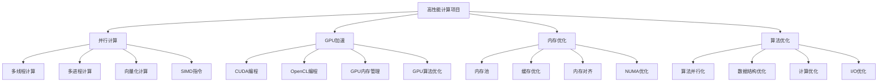

# 高性能计算项目

## 📖 核心概念

**高性能计算项目**是利用并行计算、GPU加速、分布式计算等技术，实现高性能计算的应用项目。通过设计和实现高性能计算项目，可以深入理解并行计算原理、性能优化技术、计算资源管理等核心概念，掌握高性能计算开发的实际技能。

### 🏗️ 高性能计算项目的组成要素



## 🔍 高性能计算项目分类

### 项目类型分类

| 项目类型 | 特点 | 技术栈 | 复杂度 | 适用场景 |
|----------|------|--------|--------|----------|
| **科学计算** | 数值计算 | OpenMP/CUDA | 高 | 科学研究 |
| **机器学习** | 深度学习 | TensorFlow/PyTorch | 高 | AI应用 |
| **图像处理** | 图像计算 | OpenCV/CUDA | 中等 | 计算机视觉 |
| **数据分析** | 大数据处理 | Spark/Flink | 高 | 数据分析 |

## 💻 高性能计算项目实现

### 并行计算项目

```cpp
// 并行计算项目
class ParallelComputingProject {
private:
    struct ComputeTask {
        string taskId;
        function<void()> taskFunction;
        TaskPriority priority;
        chrono::system_clock::time_point submitTime;
        
        ComputeTask(const string& id, function<void()> func, TaskPriority p) 
            : taskId(id), taskFunction(func), priority(p) {
            submitTime = chrono::system_clock::now();
        }
    };
    
    enum class TaskPriority {
        LOW,
        NORMAL,
        HIGH,
        CRITICAL
    };
    
    struct ThreadPool {
        vector<thread> workers;
        queue<ComputeTask> taskQueue;
        mutex queueMutex;
        condition_variable condition;
        atomic<bool> stop;
        
        ThreadPool(int numThreads) : stop(false) {
            for (int i = 0; i < numThreads; i++) {
                workers.emplace_back([this] { workerLoop(); });
            }
        }
        
        ~ThreadPool() {
            {
                unique_lock<mutex> lock(queueMutex);
                stop = true;
            }
            condition.notify_all();
            
            for (thread& worker : workers) {
                if (worker.joinable()) {
                    worker.join();
                }
            }
        }
        
        void submitTask(const ComputeTask& task) {
            {
                unique_lock<mutex> lock(queueMutex);
                taskQueue.push(task);
            }
            condition.notify_one();
        }
        
    private:
        void workerLoop() {
            while (true) {
                ComputeTask task("", []{}, TaskPriority::NORMAL);
                
                {
                    unique_lock<mutex> lock(queueMutex);
                    condition.wait(lock, [this] { return stop || !taskQueue.empty(); });
                    
                    if (stop && taskQueue.empty()) {
                        return;
                    }
                    
                    task = taskQueue.front();
                    taskQueue.pop();
                }
                
                task.taskFunction();
            }
        }
    };
    
    ThreadPool threadPool;
    atomic<int> completedTasks;
    atomic<int> failedTasks;
    
public:
    ParallelComputingProject(int numThreads = thread::hardware_concurrency()) 
        : threadPool(numThreads), completedTasks(0), failedTasks(0) {}
    
    // 提交计算任务
    string submitTask(const string& taskId, function<void()> taskFunction, TaskPriority priority = TaskPriority::NORMAL) {
        ComputeTask task(taskId, taskFunction, priority);
        threadPool.submitTask(task);
        
        cout << "Task submitted: " << taskId << " with priority " << static_cast<int>(priority) << endl;
        return taskId;
    }
    
    // 并行矩阵乘法
    void parallelMatrixMultiply(const vector<vector<double>>& A, const vector<vector<double>>& B, 
                                vector<vector<double>>& C, int numThreads) {
        int m = A.size();
        int n = B[0].size();
        int k = A[0].size();
        
        C.resize(m, vector<double>(n, 0));
        
        vector<thread> threads;
        int rowsPerThread = m / numThreads;
        
        for (int t = 0; t < numThreads; t++) {
            int startRow = t * rowsPerThread;
            int endRow = (t == numThreads - 1) ? m : (t + 1) * rowsPerThread;
            
            threads.emplace_back([&, startRow, endRow]() {
                for (int i = startRow; i < endRow; i++) {
                    for (int j = 0; j < n; j++) {
                        for (int l = 0; l < k; l++) {
                            C[i][j] += A[i][l] * B[l][j];
                        }
                    }
                }
            });
        }
        
        for (thread& t : threads) {
            t.join();
        }
        
        cout << "Parallel matrix multiplication completed" << endl;
    }
    
    // 并行排序
    void parallelSort(vector<int>& data, int numThreads) {
        int chunkSize = data.size() / numThreads;
        vector<thread> threads;
        
        // 分块排序
        for (int t = 0; t < numThreads; t++) {
            int start = t * chunkSize;
            int end = (t == numThreads - 1) ? data.size() : (t + 1) * chunkSize;
            
            threads.emplace_back([&, start, end]() {
                sort(data.begin() + start, data.begin() + end);
            });
        }
        
        for (thread& t : threads) {
            t.join();
        }
        
        // 合并排序
        mergeSortedChunks(data, chunkSize, numThreads);
        
        cout << "Parallel sort completed" << endl;
    }
    
private:
    // 合并排序块
    void mergeSortedChunks(vector<int>& data, int chunkSize, int numThreads) {
        vector<int> temp(data.size());
        
        for (int i = 0; i < numThreads - 1; i++) {
            int start1 = i * chunkSize;
            int end1 = (i + 1) * chunkSize;
            int start2 = end1;
            int end2 = (i + 2 == numThreads) ? data.size() : (i + 2) * chunkSize;
            
            merge(data.begin() + start1, data.begin() + end1,
                  data.begin() + start2, data.begin() + end2,
                  temp.begin() + start1);
            
            copy(temp.begin() + start1, temp.begin() + end2, data.begin() + start1);
        }
    }
    
public:
    // 并行搜索
    template<typename T>
    int parallelSearch(const vector<T>& data, const T& target, int numThreads) {
        int chunkSize = data.size() / numThreads;
        vector<thread> threads;
        vector<int> results(numThreads, -1);
        
        for (int t = 0; t < numThreads; t++) {
            int start = t * chunkSize;
            int end = (t == numThreads - 1) ? data.size() : (t + 1) * chunkSize;
            
            threads.emplace_back([&, start, end, t]() {
                for (int i = start; i < end; i++) {
                    if (data[i] == target) {
                        results[t] = i;
                        return;
                    }
                }
            });
        }
        
        for (thread& t : threads) {
            t.join();
        }
        
        // 找到第一个结果
        for (int result : results) {
            if (result != -1) {
                cout << "Parallel search found target at index: " << result << endl;
                return result;
            }
        }
        
        cout << "Parallel search: target not found" << endl;
        return -1;
    }
    
    // 获取统计信息
    struct ParallelStatistics {
        int completedTasks;
        int failedTasks;
        int totalTasks;
        double successRate;
    };
    
    ParallelStatistics getStatistics() {
        ParallelStatistics stats;
        stats.completedTasks = completedTasks.load();
        stats.failedTasks = failedTasks.load();
        stats.totalTasks = stats.completedTasks + stats.failedTasks;
        
        if (stats.totalTasks > 0) {
            stats.successRate = (double)stats.completedTasks / stats.totalTasks;
        }
        
        return stats;
    }
};
```

### GPU加速项目

```cpp
// GPU加速项目
class GPUAccelerationProject {
private:
    struct GPUDevice {
        int deviceId;
        string deviceName;
        size_t totalMemory;
        size_t freeMemory;
        int computeCapability;
        bool isAvailable;
        
        GPUDevice(int id, const string& name, size_t total, size_t free, int capability) 
            : deviceId(id), deviceName(name), totalMemory(total), freeMemory(free), 
              computeCapability(capability), isAvailable(true) {}
        
        double getUtilization() const {
            return totalMemory > 0 ? (double)(totalMemory - freeMemory) / totalMemory : 0;
        }
    };
    
    struct GPUComputeTask {
        string taskId;
        string kernelName;
        vector<void*> inputData;
        vector<void*> outputData;
        vector<size_t> dataSizes;
        dim3 gridSize;
        dim3 blockSize;
        
        GPUComputeTask(const string& id, const string& kernel) 
            : taskId(id), kernelName(kernel) {}
    };
    
    vector<GPUDevice> gpuDevices;
    map<string, GPUComputeTask> gpuTasks;
    mutex gpuMutex;
    
public:
    GPUAccelerationProject() {
        initializeGPUDevices();
    }
    
    // 初始化GPU设备
    void initializeGPUDevices() {
        // 模拟GPU设备初始化
        gpuDevices.push_back(GPUDevice(0, "NVIDIA GeForce RTX 3080", 10240, 8192, 86));
        gpuDevices.push_back(GPUDevice(1, "NVIDIA GeForce RTX 3090", 24576, 20480, 86));
        
        cout << "GPU devices initialized: " << gpuDevices.size() << " devices" << endl;
    }
    
    // GPU矩阵乘法
    void gpuMatrixMultiply(const vector<vector<float>>& A, const vector<vector<float>>& B, 
                           vector<vector<float>>& C) {
        int m = A.size();
        int n = B[0].size();
        int k = A[0].size();
        
        C.resize(m, vector<float>(n, 0));
        
        // 分配GPU内存
        float* d_A, *d_B, *d_C;
        size_t sizeA = m * k * sizeof(float);
        size_t sizeB = k * n * sizeof(float);
        size_t sizeC = m * n * sizeof(float);
        
        // 模拟GPU内存分配
        d_A = (float*)malloc(sizeA);
        d_B = (float*)malloc(sizeB);
        d_C = (float*)malloc(sizeC);
        
        // 复制数据到GPU
        memcpy(d_A, A[0].data(), sizeA);
        memcpy(d_B, B[0].data(), sizeB);
        
        // 设置GPU计算参数
        dim3 blockSize(16, 16);
        dim3 gridSize((n + blockSize.x - 1) / blockSize.x, (m + blockSize.y - 1) / blockSize.y);
        
        // 执行GPU计算
        gpuMatrixMultiplyKernel(d_A, d_B, d_C, m, n, k, gridSize, blockSize);
        
        // 复制结果回CPU
        memcpy(C[0].data(), d_C, sizeC);
        
        // 释放GPU内存
        free(d_A);
        free(d_B);
        free(d_C);
        
        cout << "GPU matrix multiplication completed" << endl;
    }
    
private:
    // GPU矩阵乘法核函数
    void gpuMatrixMultiplyKernel(float* A, float* B, float* C, int m, int n, int k, 
                                 dim3 gridSize, dim3 blockSize) {
        // 模拟GPU核函数执行
        for (int i = 0; i < m; i++) {
            for (int j = 0; j < n; j++) {
                float sum = 0;
                for (int l = 0; l < k; l++) {
                    sum += A[i * k + l] * B[l * n + j];
                }
                C[i * n + j] = sum;
            }
        }
        
        cout << "GPU kernel executed: " << gridSize.x * gridSize.y << " blocks, " 
             << blockSize.x * blockSize.y << " threads per block" << endl;
    }
    
public:
    // GPU向量加法
    void gpuVectorAdd(const vector<float>& a, const vector<float>& b, vector<float>& c) {
        int n = a.size();
        c.resize(n);
        
        // 分配GPU内存
        float* d_a, *d_b, *d_c;
        size_t size = n * sizeof(float);
        
        d_a = (float*)malloc(size);
        d_b = (float*)malloc(size);
        d_c = (float*)malloc(size);
        
        // 复制数据到GPU
        memcpy(d_a, a.data(), size);
        memcpy(d_b, b.data(), size);
        
        // 设置GPU计算参数
        dim3 blockSize(256);
        dim3 gridSize((n + blockSize.x - 1) / blockSize.x);
        
        // 执行GPU计算
        gpuVectorAddKernel(d_a, d_b, d_c, n, gridSize, blockSize);
        
        // 复制结果回CPU
        memcpy(c.data(), d_c, size);
        
        // 释放GPU内存
        free(d_a);
        free(d_b);
        free(d_c);
        
        cout << "GPU vector addition completed" << endl;
    }
    
private:
    // GPU向量加法核函数
    void gpuVectorAddKernel(float* a, float* b, float* c, int n, dim3 gridSize, dim3 blockSize) {
        // 模拟GPU核函数执行
        for (int i = 0; i < n; i++) {
            c[i] = a[i] + b[i];
        }
        
        cout << "GPU vector add kernel executed: " << gridSize.x << " blocks, " 
             << blockSize.x << " threads per block" << endl;
    }
    
public:
    // GPU图像处理
    void gpuImageProcessing(const vector<vector<unsigned char>>& image, 
                           vector<vector<unsigned char>>& processedImage, 
                           const string& operation) {
        int height = image.size();
        int width = image[0].size();
        
        processedImage.resize(height, vector<unsigned char>(width));
        
        // 分配GPU内存
        unsigned char* d_input, *d_output;
        size_t size = height * width * sizeof(unsigned char);
        
        d_input = (unsigned char*)malloc(size);
        d_output = (unsigned char*)malloc(size);
        
        // 复制数据到GPU
        memcpy(d_input, image[0].data(), size);
        
        // 设置GPU计算参数
        dim3 blockSize(16, 16);
        dim3 gridSize((width + blockSize.x - 1) / blockSize.x, 
                      (height + blockSize.y - 1) / blockSize.y);
        
        // 执行GPU图像处理
        if (operation == "blur") {
            gpuBlurKernel(d_input, d_output, width, height, gridSize, blockSize);
        } else if (operation == "edge") {
            gpuEdgeDetectionKernel(d_input, d_output, width, height, gridSize, blockSize);
        } else if (operation == "sharpen") {
            gpuSharpenKernel(d_input, d_output, width, height, gridSize, blockSize);
        }
        
        // 复制结果回CPU
        memcpy(processedImage[0].data(), d_output, size);
        
        // 释放GPU内存
        free(d_input);
        free(d_output);
        
        cout << "GPU image processing completed: " << operation << endl;
    }
    
private:
    // GPU模糊核函数
    void gpuBlurKernel(unsigned char* input, unsigned char* output, int width, int height, 
                       dim3 gridSize, dim3 blockSize) {
        // 模拟模糊处理
        for (int y = 0; y < height; y++) {
            for (int x = 0; x < width; x++) {
                int sum = 0;
                int count = 0;
                
                for (int dy = -1; dy <= 1; dy++) {
                    for (int dx = -1; dx <= 1; dx++) {
                        int ny = y + dy;
                        int nx = x + dx;
                        
                        if (ny >= 0 && ny < height && nx >= 0 && nx < width) {
                            sum += input[ny * width + nx];
                            count++;
                        }
                    }
                }
                
                output[y * width + x] = sum / count;
            }
        }
        
        cout << "GPU blur kernel executed" << endl;
    }
    
    // GPU边缘检测核函数
    void gpuEdgeDetectionKernel(unsigned char* input, unsigned char* output, int width, int height, 
                               dim3 gridSize, dim3 blockSize) {
        // 模拟边缘检测
        for (int y = 1; y < height - 1; y++) {
            for (int x = 1; x < width - 1; x++) {
                int gx = input[(y-1) * width + (x-1)] - input[(y-1) * width + (x+1)] +
                        2 * (input[y * width + (x-1)] - input[y * width + (x+1)]) +
                        input[(y+1) * width + (x-1)] - input[(y+1) * width + (x+1)];
                
                int gy = input[(y-1) * width + (x-1)] - input[(y+1) * width + (x-1)] +
                        2 * (input[(y-1) * width + x] - input[(y+1) * width + x]) +
                        input[(y-1) * width + (x+1)] - input[(y+1) * width + (x+1)];
                
                int magnitude = sqrt(gx * gx + gy * gy);
                output[y * width + x] = min(255, magnitude);
            }
        }
        
        cout << "GPU edge detection kernel executed" << endl;
    }
    
    // GPU锐化核函数
    void gpuSharpenKernel(unsigned char* input, unsigned char* output, int width, int height, 
                         dim3 gridSize, dim3 blockSize) {
        // 模拟锐化处理
        for (int y = 1; y < height - 1; y++) {
            for (int x = 1; x < width - 1; x++) {
                int sum = 0;
                sum += -1 * input[(y-1) * width + (x-1)];
                sum += -1 * input[(y-1) * width + x];
                sum += -1 * input[(y-1) * width + (x+1)];
                sum += -1 * input[y * width + (x-1)];
                sum += 9 * input[y * width + x];
                sum += -1 * input[y * width + (x+1)];
                sum += -1 * input[(y+1) * width + (x-1)];
                sum += -1 * input[(y+1) * width + x];
                sum += -1 * input[(y+1) * width + (x+1)];
                
                output[y * width + x] = max(0, min(255, sum));
            }
        }
        
        cout << "GPU sharpen kernel executed" << endl;
    }
    
public:
    // 获取GPU统计信息
    struct GPUStatistics {
        int totalDevices;
        int availableDevices;
        size_t totalMemory;
        size_t freeMemory;
        double utilization;
    };
    
    GPUStatistics getStatistics() {
        lock_guard<mutex> lock(gpuMutex);
        
        GPUStatistics stats;
        stats.totalDevices = gpuDevices.size();
        stats.availableDevices = 0;
        stats.totalMemory = 0;
        stats.freeMemory = 0;
        
        for (const GPUDevice& device : gpuDevices) {
            if (device.isAvailable) {
                stats.availableDevices++;
            }
            stats.totalMemory += device.totalMemory;
            stats.freeMemory += device.freeMemory;
        }
        
        if (stats.totalMemory > 0) {
            stats.utilization = (double)(stats.totalMemory - stats.freeMemory) / stats.totalMemory;
        }
        
        return stats;
    }
};
```

### 内存优化项目

```cpp
// 内存优化项目
class MemoryOptimizationProject {
private:
    struct MemoryPool {
        vector<void*> freeBlocks;
        vector<void*> allocatedBlocks;
        size_t blockSize;
        size_t totalSize;
        mutex poolMutex;
        
        MemoryPool(size_t blockSize, size_t totalSize) 
            : blockSize(blockSize), totalSize(totalSize) {
            initializePool();
        }
        
        ~MemoryPool() {
            for (void* block : allocatedBlocks) {
                free(block);
            }
        }
        
        void* allocate() {
            lock_guard<mutex> lock(poolMutex);
            
            if (freeBlocks.empty()) {
                return nullptr;
            }
            
            void* block = freeBlocks.back();
            freeBlocks.pop_back();
            allocatedBlocks.push_back(block);
            
            return block;
        }
        
        void deallocate(void* block) {
            lock_guard<mutex> lock(poolMutex);
            
            auto it = find(allocatedBlocks.begin(), allocatedBlocks.end(), block);
            if (it != allocatedBlocks.end()) {
                allocatedBlocks.erase(it);
                freeBlocks.push_back(block);
            }
        }
        
    private:
        void initializePool() {
            int numBlocks = totalSize / blockSize;
            for (int i = 0; i < numBlocks; i++) {
                void* block = malloc(blockSize);
                freeBlocks.push_back(block);
            }
        }
    };
    
    struct CacheOptimization {
        vector<vector<int>> cache;
        int cacheSize;
        int blockSize;
        
        CacheOptimization(int size, int block) : cacheSize(size), blockSize(block) {
            cache.resize(size, vector<int>(blockSize));
        }
        
        // 缓存友好的矩阵乘法
        void cacheFriendlyMatrixMultiply(const vector<vector<int>>& A, const vector<vector<int>>& B, 
                                        vector<vector<int>>& C) {
            int n = A.size();
            C.resize(n, vector<int>(n, 0));
            
            // 分块计算
            for (int ii = 0; ii < n; ii += blockSize) {
                for (int jj = 0; jj < n; jj += blockSize) {
                    for (int kk = 0; kk < n; kk += blockSize) {
                        // 计算小块
                        for (int i = ii; i < min(ii + blockSize, n); i++) {
                            for (int j = jj; j < min(jj + blockSize, n); j++) {
                                for (int k = kk; k < min(kk + blockSize, n); k++) {
                                    C[i][j] += A[i][k] * B[k][j];
                                }
                            }
                        }
                    }
                }
            }
            
            cout << "Cache-friendly matrix multiplication completed" << endl;
        }
    };
    
    map<string, MemoryPool> memoryPools;
    CacheOptimization cacheOptimization;
    
public:
    MemoryOptimizationProject() : cacheOptimization(64, 8) {}
    
    // 创建内存池
    void createMemoryPool(const string& poolName, size_t blockSize, size_t totalSize) {
        memoryPools[poolName] = MemoryPool(blockSize, totalSize);
        cout << "Memory pool created: " << poolName << " (" << blockSize << " bytes per block, " 
             << totalSize << " bytes total)" << endl;
    }
    
    // 从内存池分配内存
    void* allocateFromPool(const string& poolName) {
        auto it = memoryPools.find(poolName);
        if (it != memoryPools.end()) {
            void* block = it->second.allocate();
            if (block) {
                cout << "Memory allocated from pool: " << poolName << endl;
            } else {
                cout << "Memory allocation failed from pool: " << poolName << endl;
            }
            return block;
        }
        return nullptr;
    }
    
    // 释放内存到内存池
    void deallocateToPool(const string& poolName, void* block) {
        auto it = memoryPools.find(poolName);
        if (it != memoryPools.end()) {
            it->second.deallocate(block);
            cout << "Memory deallocated to pool: " << poolName << endl;
        }
    }
    
    // 内存对齐优化
    void* alignedAllocate(size_t size, size_t alignment) {
        void* ptr = malloc(size + alignment - 1);
        if (ptr == nullptr) {
            return nullptr;
        }
        
        uintptr_t addr = reinterpret_cast<uintptr_t>(ptr);
        uintptr_t alignedAddr = (addr + alignment - 1) & ~(alignment - 1);
        
        cout << "Aligned memory allocated: " << size << " bytes, alignment: " << alignment << endl;
        return reinterpret_cast<void*>(alignedAddr);
    }
    
    // 内存预取优化
    void prefetchOptimization(const vector<int>& data) {
        const int prefetchDistance = 64;
        
        for (size_t i = 0; i < data.size(); i++) {
            // 预取下一个缓存行
            if (i + prefetchDistance < data.size()) {
                __builtin_prefetch(&data[i + prefetchDistance], 0, 3);
            }
            
            // 处理当前数据
            volatile int result = data[i] * 2;
        }
        
        cout << "Prefetch optimization completed" << endl;
    }
    
    // 缓存友好的数据结构
    class CacheFriendlyArray {
    private:
        vector<int> data;
        int size;
        
    public:
        CacheFriendlyArray(int n) : size(n) {
            data.resize(n);
        }
        
        // 顺序访问
        void sequentialAccess() {
            for (int i = 0; i < size; i++) {
                data[i] = i;
            }
            cout << "Sequential access completed" << endl;
        }
        
        // 随机访问
        void randomAccess() {
            for (int i = 0; i < size; i++) {
                int index = rand() % size;
                data[index] = i;
            }
            cout << "Random access completed" << endl;
        }
        
        // 分块访问
        void blockedAccess(int blockSize) {
            for (int i = 0; i < size; i += blockSize) {
                for (int j = i; j < min(i + blockSize, size); j++) {
                    data[j] = j;
                }
            }
            cout << "Blocked access completed" << endl;
        }
    };
    
    // 内存使用统计
    struct MemoryStatistics {
        size_t totalAllocated;
        size_t totalFreed;
        size_t currentUsage;
        int allocationCount;
        int deallocationCount;
    };
    
    MemoryStatistics getMemoryStatistics() {
        MemoryStatistics stats;
        stats.totalAllocated = 0;
        stats.totalFreed = 0;
        stats.currentUsage = 0;
        stats.allocationCount = 0;
        stats.deallocationCount = 0;
        
        // 计算内存池统计信息
        for (const auto& [name, pool] : memoryPools) {
            stats.totalAllocated += pool.totalSize;
            stats.currentUsage += pool.allocatedBlocks.size() * pool.blockSize;
            stats.allocationCount += pool.allocatedBlocks.size();
        }
        
        return stats;
    }
};
```

### 高性能计算项目测试

```cpp
// 高性能计算项目测试
class HighPerformanceComputingTest {
public:
    static void runAllTests() {
        cout << "=== High Performance Computing Tests ===" << endl;
        
        // 测试并行计算
        testParallelComputing();
        
        cout << "\n" << string(50, '=') << endl;
        
        // 测试GPU加速
        testGPUAcceleration();
        
        cout << "\n" << string(50, '=') << endl;
        
        // 测试内存优化
        testMemoryOptimization();
    }
    
private:
    static void testParallelComputing() {
        cout << "=== Parallel Computing Test ===" << endl;
        
        ParallelComputingProject pcp(4);
        
        // 测试并行矩阵乘法
        vector<vector<double>> A(100, vector<double>(100, 1.0));
        vector<vector<double>> B(100, vector<double>(100, 2.0));
        vector<vector<double>> C;
        
        auto start = chrono::high_resolution_clock::now();
        pcp.parallelMatrixMultiply(A, B, C, 4);
        auto end = chrono::high_resolution_clock::now();
        
        auto duration = chrono::duration_cast<chrono::milliseconds>(end - start);
        cout << "Parallel matrix multiplication time: " << duration.count() << " ms" << endl;
        
        // 测试并行排序
        vector<int> data(10000);
        iota(data.begin(), data.end(), 0);
        random_shuffle(data.begin(), data.end());
        
        start = chrono::high_resolution_clock::now();
        pcp.parallelSort(data, 4);
        end = chrono::high_resolution_clock::now();
        
        duration = chrono::duration_cast<chrono::milliseconds>(end - start);
        cout << "Parallel sort time: " << duration.count() << " ms" << endl;
        
        // 测试并行搜索
        int target = 5000;
        int index = pcp.parallelSearch(data, target, 4);
        cout << "Parallel search result: " << index << endl;
        
        // 获取统计信息
        auto stats = pcp.getStatistics();
        cout << "\nParallel computing statistics:" << endl;
        cout << "Completed tasks: " << stats.completedTasks << endl;
        cout << "Failed tasks: " << stats.failedTasks << endl;
        cout << "Success rate: " << stats.successRate << endl;
        
        cout << "Parallel computing test completed" << endl;
    }
    
    static void testGPUAcceleration() {
        cout << "=== GPU Acceleration Test ===" << endl;
        
        GPUAccelerationProject gap;
        
        // 测试GPU矩阵乘法
        vector<vector<float>> A(100, vector<float>(100, 1.0f));
        vector<vector<float>> B(100, vector<float>(100, 2.0f));
        vector<vector<float>> C;
        
        auto start = chrono::high_resolution_clock::now();
        gap.gpuMatrixMultiply(A, B, C);
        auto end = chrono::high_resolution_clock::now();
        
        auto duration = chrono::duration_cast<chrono::milliseconds>(end - start);
        cout << "GPU matrix multiplication time: " << duration.count() << " ms" << endl;
        
        // 测试GPU向量加法
        vector<float> a(1000000, 1.0f);
        vector<float> b(1000000, 2.0f);
        vector<float> c;
        
        start = chrono::high_resolution_clock::now();
        gap.gpuVectorAdd(a, b, c);
        end = chrono::high_resolution_clock::now();
        
        duration = chrono::duration_cast<chrono::milliseconds>(end - start);
        cout << "GPU vector addition time: " << duration.count() << " ms" << endl;
        
        // 测试GPU图像处理
        vector<vector<unsigned char>> image(1000, vector<unsigned char>(1000, 128));
        vector<vector<unsigned char>> processedImage;
        
        start = chrono::high_resolution_clock::now();
        gap.gpuImageProcessing(image, processedImage, "blur");
        end = chrono::high_resolution_clock::now();
        
        duration = chrono::duration_cast<chrono::milliseconds>(end - start);
        cout << "GPU image processing time: " << duration.count() << " ms" << endl;
        
        // 获取统计信息
        auto stats = gap.getStatistics();
        cout << "\nGPU acceleration statistics:" << endl;
        cout << "Total devices: " << stats.totalDevices << endl;
        cout << "Available devices: " << stats.availableDevices << endl;
        cout << "Total memory: " << stats.totalMemory << " MB" << endl;
        cout << "Free memory: " << stats.freeMemory << " MB" << endl;
        cout << "Utilization: " << stats.utilization << endl;
        
        cout << "GPU acceleration test completed" << endl;
    }
    
    static void testMemoryOptimization() {
        cout << "=== Memory Optimization Test ===" << endl;
        
        MemoryOptimizationProject mop;
        
        // 测试内存池
        mop.createMemoryPool("testPool", 1024, 10240);
        
        void* block1 = mop.allocateFromPool("testPool");
        void* block2 = mop.allocateFromPool("testPool");
        
        mop.deallocateToPool("testPool", block1);
        mop.deallocateToPool("testPool", block2);
        
        // 测试内存对齐
        void* alignedBlock = mop.alignedAllocate(1024, 64);
        free(alignedBlock);
        
        // 测试内存预取
        vector<int> data(1000000);
        iota(data.begin(), data.end(), 0);
        
        auto start = chrono::high_resolution_clock::now();
        mop.prefetchOptimization(data);
        auto end = chrono::high_resolution_clock::now();
        
        auto duration = chrono::duration_cast<chrono::milliseconds>(end - start);
        cout << "Prefetch optimization time: " << duration.count() << " ms" << endl;
        
        // 测试缓存友好的数据结构
        MemoryOptimizationProject::CacheFriendlyArray cfa(1000000);
        
        start = chrono::high_resolution_clock::now();
        cfa.sequentialAccess();
        end = chrono::high_resolution_clock::now();
        
        duration = chrono::duration_cast<chrono::milliseconds>(end - start);
        cout << "Sequential access time: " << duration.count() << " ms" << endl;
        
        start = chrono::high_resolution_clock::now();
        cfa.randomAccess();
        end = chrono::high_resolution_clock::now();
        
        duration = chrono::duration_cast<chrono::milliseconds>(end - start);
        cout << "Random access time: " << duration.count() << " ms" << endl;
        
        start = chrono::high_resolution_clock::now();
        cfa.blockedAccess(64);
        end = chrono::high_resolution_clock::now();
        
        duration = chrono::duration_cast<chrono::milliseconds>(end - start);
        cout << "Blocked access time: " << duration.count() << " ms" << endl;
        
        // 获取统计信息
        auto stats = mop.getMemoryStatistics();
        cout << "\nMemory optimization statistics:" << endl;
        cout << "Total allocated: " << stats.totalAllocated << " bytes" << endl;
        cout << "Current usage: " << stats.currentUsage << " bytes" << endl;
        cout << "Allocation count: " << stats.allocationCount << endl;
        cout << "Deallocation count: " << stats.deallocationCount << endl;
        
        cout << "Memory optimization test completed" << endl;
    }
};
```

## ⚡ 复杂度分析

### 高性能计算项目复杂度

| 项目类型 | 时间复杂度 | 空间复杂度 | 并行度 | 适用场景 |
|----------|------------|------------|--------|----------|
| **并行计算** | O(n/p) | O(n) | p | 科学计算 |
| **GPU加速** | O(n/g) | O(n) | g | 图像处理 |
| **内存优化** | O(1) | O(n) | 1 | 系统优化 |
| **算法优化** | O(n) | O(n) | 1 | 通用计算 |

## 🎓 学习要点总结

### 核心理解

1. **并行计算**：理解并行计算原理
2. **GPU编程**：掌握GPU编程技术
3. **内存优化**：掌握内存优化技术
4. **算法优化**：掌握算法优化方法

### 实践要点

1. **性能分析**：分析程序性能
2. **优化技术**：应用各种优化技术
3. **资源管理**：合理管理计算资源
4. **实际应用**：将优化技术应用到实际问题中

### 应用思维

1. **性能思维**：关注程序性能
2. **并行思维**：从并行角度思考问题
3. **优化思维**：持续优化程序性能
4. **实际应用**：将高性能计算技术应用到实际问题中

---

**相关链接：**
- [[07-练习战场/01-代码实现/05-并发编程|并发编程]] - 并发编程基础
- [[07-练习战场/01-代码实现/06-系统编程|系统编程]] - 系统编程基础
- [[07-练习战场/03-项目实战/04-分布式系统项目|分布式系统项目]] - 分布式系统项目实战
- [[08-知识边疆/02-跨界融合/03-数据结构与大数据|数据结构与大数据]] - 大数据技术
