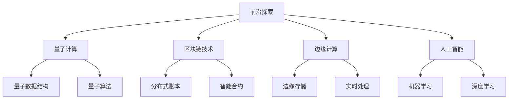

# 前沿探索

## 📖 核心概念

**前沿探索**是数据结构领域的最新发展趋势，包括新兴技术、创新应用和未来发展方向。了解前沿技术有助于把握技术发展趋势。

### 🏗️ 前沿领域



## 🔧 量子数据结构

### 量子位表示

```cpp
class QuantumBit {
private:
    complex<double> alpha;  // |0⟩ 的振幅
    complex<double> beta;   // |1⟩ 的振幅
    
public:
    QuantumBit() : alpha(1.0), beta(0.0) {}
    
    QuantumBit(complex<double> a, complex<double> b) : alpha(a), beta(b) {}
    
    // 测量量子位
    bool measure() {
        double prob0 = norm(alpha);
        double prob1 = norm(beta);
        
        random_device rd;
        mt19937 gen(rd());
        uniform_real_distribution<> dis(0.0, 1.0);
        
        double random = dis(gen);
        
        if (random < prob0) {
            alpha = 1.0;
            beta = 0.0;
            return false;  // 测量结果为 |0⟩
        } else {
            alpha = 0.0;
            beta = 1.0;
            return true;   // 测量结果为 |1⟩
        }
    }
    
    // 应用Hadamard门
    void hadamard() {
        complex<double> newAlpha = (alpha + beta) / sqrt(2.0);
        complex<double> newBeta = (alpha - beta) / sqrt(2.0);
        alpha = newAlpha;
        beta = newBeta;
    }
    
    // 应用Pauli-X门
    void pauliX() {
        swap(alpha, beta);
    }
    
    // 应用Pauli-Y门
    void pauliY() {
        complex<double> newAlpha = -beta * complex<double>(0, 1);
        complex<double> newBeta = alpha * complex<double>(0, 1);
        alpha = newAlpha;
        beta = newBeta;
    }
    
    // 应用Pauli-Z门
    void pauliZ() {
        beta = -beta;
    }
    
    // 获取状态
    pair<complex<double>, complex<double>> getState() {
        return {alpha, beta};
    }
    
    // 设置状态
    void setState(complex<double> a, complex<double> b) {
        alpha = a;
        beta = b;
    }
};
```

### 量子寄存器

```cpp
class QuantumRegister {
private:
    vector<QuantumBit> qubits;
    int size;
    
public:
    QuantumRegister(int n) : size(n) {
        qubits.resize(n);
    }
    
    // 初始化所有量子位为 |0⟩
    void initialize() {
        for (int i = 0; i < size; ++i) {
            qubits[i] = QuantumBit();
        }
    }
    
    // 应用Hadamard门到所有量子位
    void hadamardAll() {
        for (int i = 0; i < size; ++i) {
            qubits[i].hadamard();
        }
    }
    
    // 应用CNOT门
    void cnot(int control, int target) {
        if (control < 0 || control >= size || target < 0 || target >= size) {
            throw invalid_argument("Invalid qubit index");
        }
        
        // 简化的CNOT实现
        if (qubits[control].measure()) {
            qubits[target].pauliX();
        }
    }
    
    // 测量所有量子位
    vector<bool> measureAll() {
        vector<bool> results;
        for (int i = 0; i < size; ++i) {
            results.push_back(qubits[i].measure());
        }
        return results;
    }
    
    // 获取量子态
    vector<pair<complex<double>, complex<double>>> getState() {
        vector<pair<complex<double>, complex<double>>> state;
        for (int i = 0; i < size; ++i) {
            state.push_back(qubits[i].getState());
        }
        return state;
    }
    
    // 量子叠加态
    void createSuperposition() {
        hadamardAll();
    }
    
    // 量子纠缠
    void createEntanglement() {
        if (size >= 2) {
            qubits[0].hadamard();
            cnot(0, 1);
        }
    }
};
```

## 🎯 区块链数据结构

### 区块结构

```cpp
class Block {
private:
    string previousHash;
    string merkleRoot;
    long timestamp;
    int nonce;
    vector<string> transactions;
    
public:
    Block(const string& prevHash, const vector<string>& txs) 
        : previousHash(prevHash), transactions(txs), timestamp(time(nullptr)), nonce(0) {
        merkleRoot = calculateMerkleRoot();
    }
    
    // 计算Merkle根
    string calculateMerkleRoot() {
        if (transactions.empty()) return "";
        
        vector<string> currentLevel = transactions;
        
        while (currentLevel.size() > 1) {
            vector<string> nextLevel;
            
            for (size_t i = 0; i < currentLevel.size(); i += 2) {
                string left = currentLevel[i];
                string right = (i + 1 < currentLevel.size()) ? currentLevel[i + 1] : currentLevel[i];
                nextLevel.push_back(hash(left + right));
            }
            
            currentLevel = nextLevel;
        }
        
        return currentLevel[0];
    }
    
    // 简化的哈希函数
    string hash(const string& input) {
        hash<string> hasher;
        size_t hashValue = hasher(input);
        return to_string(hashValue);
    }
    
    // 挖矿（工作量证明）
    void mine(int difficulty) {
        string target = string(difficulty, '0');
        string blockHash = getHash();
        
        while (blockHash.substr(0, difficulty) != target) {
            nonce++;
            blockHash = getHash();
        }
        
        cout << "Block mined! Hash: " << blockHash << ", Nonce: " << nonce << endl;
    }
    
    // 获取区块哈希
    string getHash() {
        string data = previousHash + merkleRoot + to_string(timestamp) + to_string(nonce);
        return hash(data);
    }
    
    // 验证区块
    bool isValid() {
        return getHash().substr(0, 4) == "0000";  // 简化的验证
    }
    
    // 添加交易
    void addTransaction(const string& tx) {
        transactions.push_back(tx);
        merkleRoot = calculateMerkleRoot();
    }
    
    // 获取区块信息
    void display() {
        cout << "Block Information:" << endl;
        cout << "  Previous Hash: " << previousHash << endl;
        cout << "  Merkle Root: " << merkleRoot << endl;
        cout << "  Timestamp: " << timestamp << endl;
        cout << "  Nonce: " << nonce << endl;
        cout << "  Hash: " << getHash() << endl;
        cout << "  Transactions: " << transactions.size() << endl;
    }
};
```

### 区块链网络

```cpp
class Blockchain {
private:
    vector<Block> chain;
    int difficulty;
    
public:
    Blockchain() : difficulty(4) {
        // 创建创世区块
        vector<string> genesisTransactions = {"Genesis Block"};
        chain.push_back(Block("0", genesisTransactions));
    }
    
    // 添加新区块
    void addBlock(const vector<string>& transactions) {
        string previousHash = chain.back().getHash();
        Block newBlock(previousHash, transactions);
        newBlock.mine(difficulty);
        chain.push_back(newBlock);
    }
    
    // 验证区块链
    bool isValid() {
        for (size_t i = 1; i < chain.size(); ++i) {
            Block current = chain[i];
            Block previous = chain[i - 1];
            
            if (current.getHash() != current.getHash()) {
                return false;
            }
            
            if (current.getPreviousHash() != previous.getHash()) {
                return false;
            }
        }
        return true;
    }
    
    // 获取最新区块
    Block getLatestBlock() {
        return chain.back();
    }
    
    // 获取区块链长度
    int getLength() {
        return chain.size();
    }
    
    // 显示区块链
    void display() {
        cout << "Blockchain Information:" << endl;
        cout << "  Length: " << getLength() << endl;
        cout << "  Difficulty: " << difficulty << endl;
        cout << "  Valid: " << (isValid() ? "Yes" : "No") << endl;
        
        for (size_t i = 0; i < chain.size(); ++i) {
            cout << "\nBlock " << i << ":" << endl;
            chain[i].display();
        }
    }
    
    // 调整难度
    void adjustDifficulty() {
        if (chain.size() % 10 == 0) {
            difficulty++;
            cout << "Difficulty increased to " << difficulty << endl;
        }
    }
};
```

## 📊 边缘计算数据结构

### 边缘缓存

```cpp
class EdgeCache {
private:
    struct CacheNode {
        string key;
        string value;
        time_t timestamp;
        int accessCount;
        
        CacheNode(const string& k, const string& v) 
            : key(k), value(v), timestamp(time(nullptr)), accessCount(0) {}
    };
    
    unordered_map<string, CacheNode> cache;
    int maxSize;
    int currentSize;
    
public:
    EdgeCache(int size = 1000) : maxSize(size), currentSize(0) {}
    
    // 添加缓存项
    void put(const string& key, const string& value) {
        if (cache.find(key) != cache.end()) {
            cache[key].value = value;
            cache[key].timestamp = time(nullptr);
            cache[key].accessCount++;
        } else {
            if (currentSize >= maxSize) {
                evictLRU();
            }
            
            cache[key] = CacheNode(key, value);
            currentSize++;
        }
    }
    
    // 获取缓存项
    string get(const string& key) {
        auto it = cache.find(key);
        if (it != cache.end()) {
            it->second.accessCount++;
            it->second.timestamp = time(nullptr);
            return it->second.value;
        }
        return "";
    }
    
    // 删除缓存项
    void remove(const string& key) {
        auto it = cache.find(key);
        if (it != cache.end()) {
            cache.erase(it);
            currentSize--;
        }
    }
    
    // LRU淘汰策略
    void evictLRU() {
        string lruKey;
        time_t oldestTime = time(nullptr);
        int minAccess = INT_MAX;
        
        for (const auto& pair : cache) {
            if (pair.second.timestamp < oldestTime || 
                (pair.second.timestamp == oldestTime && pair.second.accessCount < minAccess)) {
                oldestTime = pair.second.timestamp;
                minAccess = pair.second.accessCount;
                lruKey = pair.first;
            }
        }
        
        if (!lruKey.empty()) {
            remove(lruKey);
        }
    }
    
    // 获取缓存统计
    void getStats() {
        cout << "Edge Cache Statistics:" << endl;
        cout << "  Current Size: " << currentSize << endl;
        cout << "  Max Size: " << maxSize << endl;
        cout << "  Hit Rate: " << calculateHitRate() << "%" << endl;
    }
    
    // 计算命中率
    double calculateHitRate() {
        int totalAccess = 0;
        int hits = 0;
        
        for (const auto& pair : cache) {
            totalAccess += pair.second.accessCount;
            if (pair.second.accessCount > 0) {
                hits += pair.second.accessCount - 1;  // 第一次访问不算命中
            }
        }
        
        return totalAccess > 0 ? (double)hits / totalAccess * 100 : 0;
    }
    
    // 清理过期缓存
    void cleanupExpired(int maxAge = 3600) {
        time_t currentTime = time(nullptr);
        vector<string> expiredKeys;
        
        for (const auto& pair : cache) {
            if (currentTime - pair.second.timestamp > maxAge) {
                expiredKeys.push_back(pair.first);
            }
        }
        
        for (const string& key : expiredKeys) {
            remove(key);
        }
        
        cout << "Cleaned up " << expiredKeys.size() << " expired items" << endl;
    }
};
```

### 实时数据流

```cpp
class RealTimeDataStream {
private:
    struct DataPoint {
        double value;
        time_t timestamp;
        string source;
        
        DataPoint(double v, const string& s) : value(v), timestamp(time(nullptr)), source(s) {}
    };
    
    deque<DataPoint> dataStream;
    int maxSize;
    double sum;
    double sumSquares;
    
public:
    RealTimeDataStream(int size = 1000) : maxSize(size), sum(0), sumSquares(0) {}
    
    // 添加数据点
    void addDataPoint(double value, const string& source = "default") {
        DataPoint point(value, source);
        
        if (dataStream.size() >= maxSize) {
            DataPoint oldPoint = dataStream.front();
            dataStream.pop_front();
            
            sum -= oldPoint.value;
            sumSquares -= oldPoint.value * oldPoint.value;
        }
        
        dataStream.push_back(point);
        sum += value;
        sumSquares += value * value;
    }
    
    // 计算移动平均
    double getMovingAverage() {
        return dataStream.empty() ? 0 : sum / dataStream.size();
    }
    
    // 计算标准差
    double getStandardDeviation() {
        if (dataStream.empty()) return 0;
        
        double mean = getMovingAverage();
        double variance = (sumSquares / dataStream.size()) - (mean * mean);
        return sqrt(variance);
    }
    
    // 获取最新值
    double getLatestValue() {
        return dataStream.empty() ? 0 : dataStream.back().value;
    }
    
    // 检测异常值
    vector<DataPoint> detectAnomalies(double threshold = 2.0) {
        vector<DataPoint> anomalies;
        double mean = getMovingAverage();
        double stdDev = getStandardDeviation();
        
        for (const DataPoint& point : dataStream) {
            double zScore = abs(point.value - mean) / stdDev;
            if (zScore > threshold) {
                anomalies.push_back(point);
            }
        }
        
        return anomalies;
    }
    
    // 获取趋势
    string getTrend() {
        if (dataStream.size() < 2) return "insufficient_data";
        
        double recent = 0, older = 0;
        int count = min(10, (int)dataStream.size());
        
        for (int i = 0; i < count; ++i) {
            recent += dataStream[dataStream.size() - 1 - i].value;
        }
        
        for (int i = count; i < min(20, (int)dataStream.size()); ++i) {
            older += dataStream[dataStream.size() - 1 - i].value;
        }
        
        double recentAvg = recent / count;
        double olderAvg = older / max(1, min(10, (int)dataStream.size() - count));
        
        if (recentAvg > olderAvg * 1.05) return "increasing";
        if (recentAvg < olderAvg * 0.95) return "decreasing";
        return "stable";
    }
    
    // 获取统计信息
    void getStatistics() {
        cout << "Real-time Data Stream Statistics:" << endl;
        cout << "  Data Points: " << dataStream.size() << endl;
        cout << "  Moving Average: " << getMovingAverage() << endl;
        cout << "  Standard Deviation: " << getStandardDeviation() << endl;
        cout << "  Latest Value: " << getLatestValue() << endl;
        cout << "  Trend: " << getTrend() << endl;
        
        vector<DataPoint> anomalies = detectAnomalies();
        cout << "  Anomalies: " << anomalies.size() << endl;
    }
};
```

## 🎮 前沿应用

### 1. 量子算法模拟

```cpp
class QuantumAlgorithmSimulator {
public:
    static void simulateDeutschAlgorithm() {
        cout << "=== Deutsch Algorithm Simulation ===" << endl;
        
        QuantumRegister reg(2);
        reg.initialize();
        
        // 应用Hadamard门
        reg.hadamardAll();
        
        // 应用Oracle（简化的实现）
        reg.cnot(0, 1);
        
        // 再次应用Hadamard门到第一个量子位
        reg.qubits[0].hadamard();
        
        // 测量结果
        vector<bool> result = reg.measureAll();
        
        cout << "Deutsch Algorithm Result: " << result[0] << endl;
        cout << "Function is " << (result[0] ? "balanced" : "constant") << endl;
    }
    
    static void simulateGroverAlgorithm() {
        cout << "=== Grover Algorithm Simulation ===" << endl;
        
        int n = 4;  // 4个量子位
        QuantumRegister reg(n);
        reg.initialize();
        
        // 创建均匀叠加态
        reg.hadamardAll();
        
        // Grover迭代（简化的实现）
        for (int i = 0; i < sqrt(pow(2, n)); ++i) {
            // Oracle操作
            reg.qubits[0].pauliX();
            reg.cnot(0, 1);
            reg.qubits[0].pauliX();
            
            // 扩散操作
            reg.hadamardAll();
            reg.qubits[0].pauliX();
            reg.qubits[1].pauliX();
            reg.cnot(0, 1);
            reg.qubits[0].pauliX();
            reg.qubits[1].pauliX();
            reg.hadamardAll();
        }
        
        // 测量结果
        vector<bool> result = reg.measureAll();
        
        cout << "Grover Algorithm Result: ";
        for (bool bit : result) {
            cout << bit;
        }
        cout << endl;
    }
};
```

### 2. 区块链应用

```cpp
class BlockchainApplication {
public:
    static void simulateCryptocurrency() {
        cout << "=== Cryptocurrency Simulation ===" << endl;
        
        Blockchain blockchain;
        
        // 添加一些交易
        vector<string> transactions1 = {
            "Alice sends 10 BTC to Bob",
            "Charlie sends 5 BTC to Alice"
        };
        blockchain.addBlock(transactions1);
        
        vector<string> transactions2 = {
            "Bob sends 3 BTC to David",
            "Alice sends 7 BTC to Charlie"
        };
        blockchain.addBlock(transactions2);
        
        // 显示区块链
        blockchain.display();
        
        // 验证区块链
        cout << "\nBlockchain is valid: " << (blockchain.isValid() ? "Yes" : "No") << endl;
    }
    
    static void simulateSmartContract() {
        cout << "=== Smart Contract Simulation ===" << endl;
        
        // 简化的智能合约
        class SimpleContract {
        private:
            int balance;
            string owner;
            
        public:
            SimpleContract(const string& o) : balance(0), owner(o) {}
            
            void deposit(int amount) {
                balance += amount;
                cout << "Deposited " << amount << " tokens. New balance: " << balance << endl;
            }
            
            bool withdraw(int amount) {
                if (amount <= balance) {
                    balance -= amount;
                    cout << "Withdrew " << amount << " tokens. New balance: " << balance << endl;
                    return true;
                }
                cout << "Insufficient balance!" << endl;
                return false;
            }
            
            int getBalance() {
                return balance;
            }
        };
        
        SimpleContract contract("Alice");
        contract.deposit(100);
        contract.withdraw(30);
        contract.withdraw(80);
        
        cout << "Final balance: " << contract.getBalance() << endl;
    }
};
```

### 3. 边缘计算应用

```cpp
class EdgeComputingApplication {
public:
    static void simulateIoTDataProcessing() {
        cout << "=== IoT Data Processing Simulation ===" << endl;
        
        EdgeCache cache(100);
        RealTimeDataStream stream(50);
        
        // 模拟IoT数据
        for (int i = 0; i < 100; ++i) {
            double temperature = 20 + sin(i * 0.1) * 5 + (rand() % 10 - 5) * 0.1;
            string data = "temp:" + to_string(temperature);
            
            cache.put("sensor_" + to_string(i % 10), data);
            stream.addDataPoint(temperature, "sensor_" + to_string(i % 10));
        }
        
        // 显示统计信息
        cache.getStats();
        cout << endl;
        stream.getStatistics();
        
        // 检测异常
        vector<RealTimeDataStream::DataPoint> anomalies = stream.detectAnomalies();
        cout << "\nDetected " << anomalies.size() << " anomalies" << endl;
    }
    
    static void simulateRealTimeAnalytics() {
        cout << "=== Real-time Analytics Simulation ===" << endl;
        
        RealTimeDataStream analytics(100);
        
        // 模拟实时数据
        for (int i = 0; i < 200; ++i) {
            double value = 50 + sin(i * 0.05) * 20 + (rand() % 20 - 10);
            analytics.addDataPoint(value, "user_activity");
            
            if (i % 50 == 0) {
                cout << "Step " << i << ": ";
                analytics.getStatistics();
                cout << endl;
            }
        }
    }
};
```

## 🔗 相关链接

- [[02-跨界融合|跨界融合]]
- [[03-学习资源|学习资源]]

## 💡 前沿探索要点

1. **量子计算**：量子数据结构是未来计算的重要方向
2. **区块链技术**：分布式数据结构的新应用
3. **边缘计算**：实时数据处理和缓存优化
4. **人工智能**：数据结构在AI中的应用

---

*📝 前沿提示：了解前沿技术有助于把握技术发展趋势，为未来学习做好准备*