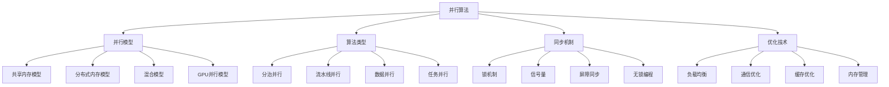

# 并行算法

## 📖 核心概念

**并行算法**是数据结构与算法的重要分支，通过利用多个处理单元同时执行计算任务，可以显著提高算法的执行效率。并行算法设计需要考虑任务分解、负载均衡、同步机制、通信开销等关键问题。

### 🏗️ 并行算法分类



## 🔧 并行算法实现

### 基础并行框架

```python
import threading
import multiprocessing
import queue
import time
from typing import List, Callable, Any, Optional
from dataclasses import dataclass
from abc import ABC, abstractmethod
import concurrent.futures
import numpy as np

# 并行任务类
@dataclass
class ParallelTask:
    task_id: int
    function: Callable
    args: tuple = ()
    kwargs: dict = None
    result: Any = None
    error: Exception = None
    
    def __post_init__(self):
        if self.kwargs is None:
            self.kwargs = {}

# 并行结果类
@dataclass
class ParallelResult:
    task_id: int
    result: Any = None
    error: Exception = None
    execution_time: float = 0.0

# 并行执行器接口
class ParallelExecutor(ABC):
    @abstractmethod
    def execute(self, tasks: List[ParallelTask]) -> List[ParallelResult]:
        pass
    
    @abstractmethod
    def shutdown(self):
        pass

# 线程池执行器
class ThreadPoolExecutor(ParallelExecutor):
    def __init__(self, max_workers: int = None):
        self.max_workers = max_workers or multiprocessing.cpu_count()
        self.executor = concurrent.futures.ThreadPoolExecutor(max_workers=self.max_workers)
    
    def execute(self, tasks: List[ParallelTask]) -> List[ParallelResult]:
        results = []
        
        # 提交任务
        future_to_task = {}
        for task in tasks:
            future = self.executor.submit(task.function, *task.args, **task.kwargs)
            future_to_task[future] = task
        
        # 收集结果
        for future in concurrent.futures.as_completed(future_to_task):
            task = future_to_task[future]
            start_time = time.time()
            
            try:
                result = future.result()
                execution_time = time.time() - start_time
                results.append(ParallelResult(
                    task_id=task.task_id,
                    result=result,
                    execution_time=execution_time
                ))
            except Exception as e:
                execution_time = time.time() - start_time
                results.append(ParallelResult(
                    task_id=task.task_id,
                    error=e,
                    execution_time=execution_time
                ))
        
        return results
    
    def shutdown(self):
        self.executor.shutdown(wait=True)

# 进程池执行器
class ProcessPoolExecutor(ParallelExecutor):
    def __init__(self, max_workers: int = None):
        self.max_workers = max_workers or multiprocessing.cpu_count()
        self.executor = concurrent.futures.ProcessPoolExecutor(max_workers=self.max_workers)
    
    def execute(self, tasks: List[ParallelTask]) -> List[ParallelResult]:
        results = []
        
        # 提交任务
        future_to_task = {}
        for task in tasks:
            future = self.executor.submit(task.function, *task.args, **task.kwargs)
            future_to_task[future] = task
        
        # 收集结果
        for future in concurrent.futures.as_completed(future_to_task):
            task = future_to_task[future]
            start_time = time.time()
            
            try:
                result = future.result()
                execution_time = time.time() - start_time
                results.append(ParallelResult(
                    task_id=task.task_id,
                    result=result,
                    execution_time=execution_time
                ))
            except Exception as e:
                execution_time = time.time() - start_time
                results.append(ParallelResult(
                    task_id=task.task_id,
                    error=e,
                    execution_time=execution_time
                ))
        
        return results
    
    def shutdown(self):
        self.executor.shutdown(wait=True)
```

### 分治并行算法

```python
# 并行归并排序
class ParallelMergeSort:
    def __init__(self, executor: ParallelExecutor):
        self.executor = executor
    
    def sort(self, arr: List[int]) -> List[int]:
        if len(arr) <= 1:
            return arr
        
        # 分割数组
        mid = len(arr) // 2
        left = arr[:mid]
        right = arr[mid:]
        
        # 并行排序
        tasks = [
            ParallelTask(0, self._sort_chunk, (left,)),
            ParallelTask(1, self._sort_chunk, (right,))
        ]
        
        results = self.executor.execute(tasks)
        
        # 合并结果
        sorted_left = results[0].result
        sorted_right = results[1].result
        
        return self._merge(sorted_left, sorted_right)
    
    def _sort_chunk(self, chunk: List[int]) -> List[int]:
        if len(chunk) <= 1:
            return chunk
        
        # 递归排序
        mid = len(chunk) // 2
        left = self._sort_chunk(chunk[:mid])
        right = self._sort_chunk(chunk[mid:])
        
        return self._merge(left, right)
    
    def _merge(self, left: List[int], right: List[int]) -> List[int]:
        result = []
        i = j = 0
        
        while i < len(left) and j < len(right):
            if left[i] <= right[j]:
                result.append(left[i])
                i += 1
            else:
                result.append(right[j])
                j += 1
        
        result.extend(left[i:])
        result.extend(right[j:])
        
        return result

# 并行快速排序
class ParallelQuickSort:
    def __init__(self, executor: ParallelExecutor):
        self.executor = executor
    
    def sort(self, arr: List[int]) -> List[int]:
        if len(arr) <= 1:
            return arr
        
        # 选择基准
        pivot = arr[len(arr) // 2]
        
        # 分割数组
        left = [x for x in arr if x < pivot]
        middle = [x for x in arr if x == pivot]
        right = [x for x in arr if x > pivot]
        
        # 并行排序左右两部分
        if len(left) > 1 and len(right) > 1:
            tasks = [
                ParallelTask(0, self._sort_chunk, (left,)),
                ParallelTask(1, self._sort_chunk, (right,))
            ]
            
            results = self.executor.execute(tasks)
            sorted_left = results[0].result
            sorted_right = results[1].result
        else:
            sorted_left = self._sort_chunk(left) if len(left) > 1 else left
            sorted_right = self._sort_chunk(right) if len(right) > 1 else right
        
        return sorted_left + middle + sorted_right
    
    def _sort_chunk(self, chunk: List[int]) -> List[int]:
        if len(chunk) <= 1:
            return chunk
        
        # 递归排序
        return self.sort(chunk)
```

### 数据并行算法

```python
# 并行矩阵乘法
class ParallelMatrixMultiplication:
    def __init__(self, executor: ParallelExecutor):
        self.executor = executor
    
    def multiply(self, A: np.ndarray, B: np.ndarray) -> np.ndarray:
        m, n = A.shape
        n2, p = B.shape
        
        if n != n2:
            raise ValueError("Matrix dimensions don't match")
        
        # 创建结果矩阵
        C = np.zeros((m, p))
        
        # 分割任务
        tasks = []
        chunk_size = m // self.executor.max_workers
        
        for i in range(0, m, chunk_size):
            end_i = min(i + chunk_size, m)
            task = ParallelTask(
                i // chunk_size,
                self._multiply_chunk,
                (A[i:end_i], B, C[i:end_i])
            )
            tasks.append(task)
        
        # 并行执行
        results = self.executor.execute(tasks)
        
        # 合并结果
        for result in results:
            if result.error:
                raise result.error
        
        return C
    
    def _multiply_chunk(self, A_chunk: np.ndarray, B: np.ndarray, C_chunk: np.ndarray) -> np.ndarray:
        return np.dot(A_chunk, B)

# 并行向量运算
class ParallelVectorOperations:
    def __init__(self, executor: ParallelExecutor):
        self.executor = executor
    
    def dot_product(self, a: List[float], b: List[float]) -> float:
        if len(a) != len(b):
            raise ValueError("Vector dimensions don't match")
        
        # 分割任务
        tasks = []
        chunk_size = len(a) // self.executor.max_workers
        
        for i in range(0, len(a), chunk_size):
            end_i = min(i + chunk_size, len(a))
            task = ParallelTask(
                i // chunk_size,
                self._dot_chunk,
                (a[i:end_i], b[i:end_i])
            )
            tasks.append(task)
        
        # 并行执行
        results = self.executor.execute(tasks)
        
        # 合并结果
        total = sum(result.result for result in results if not result.error)
        return total
    
    def _dot_chunk(self, a_chunk: List[float], b_chunk: List[float]) -> float:
        return sum(x * y for x, y in zip(a_chunk, b_chunk))
    
    def vector_add(self, a: List[float], b: List[float]) -> List[float]:
        if len(a) != len(b):
            raise ValueError("Vector dimensions don't match")
        
        # 分割任务
        tasks = []
        chunk_size = len(a) // self.executor.max_workers
        
        for i in range(0, len(a), chunk_size):
            end_i = min(i + chunk_size, len(a))
            task = ParallelTask(
                i // chunk_size,
                self._add_chunk,
                (a[i:end_i], b[i:end_i])
            )
            tasks.append(task)
        
        # 并行执行
        results = self.executor.execute(tasks)
        
        # 合并结果
        result = []
        for result_chunk in sorted(results, key=lambda x: x.task_id):
            if not result_chunk.error:
                result.extend(result_chunk.result)
        
        return result
    
    def _add_chunk(self, a_chunk: List[float], b_chunk: List[float]) -> List[float]:
        return [x + y for x, y in zip(a_chunk, b_chunk)]
```

### 流水线并行算法

```python
# 流水线处理器
class PipelineProcessor:
    def __init__(self, stages: List[Callable], buffer_size: int = 10):
        self.stages = stages
        self.buffer_size = buffer_size
        self.queues = [queue.Queue(maxsize=buffer_size) for _ in range(len(stages) + 1)]
        self.threads = []
        self.stop_flag = False
    
    def start(self):
        """启动流水线"""
        # 创建阶段线程
        for i, stage in enumerate(self.stages):
            thread = threading.Thread(
                target=self._stage_worker,
                args=(i, stage),
                name=f"Stage-{i}"
            )
            thread.daemon = True
            thread.start()
            self.threads.append(thread)
    
    def _stage_worker(self, stage_id: int, stage_func: Callable):
        """阶段工作线程"""
        input_queue = self.queues[stage_id]
        output_queue = self.queues[stage_id + 1]
        
        while not self.stop_flag:
            try:
                # 从输入队列获取数据
                data = input_queue.get(timeout=1)
                
                # 处理数据
                result = stage_func(data)
                
                # 将结果放入输出队列
                output_queue.put(result)
                
                input_queue.task_done()
            except queue.Empty:
                continue
            except Exception as e:
                print(f"Stage {stage_id} error: {e}")
                break
    
    def process(self, data: List[Any]) -> List[Any]:
        """处理数据"""
        # 将输入数据放入第一个队列
        for item in data:
            self.queues[0].put(item)
        
        # 从最后一个队列收集结果
        results = []
        for _ in range(len(data)):
            try:
                result = self.queues[-1].get(timeout=10)
                results.append(result)
                self.queues[-1].task_done()
            except queue.Empty:
                break
        
        return results
    
    def shutdown(self):
        """关闭流水线"""
        self.stop_flag = True
        for thread in self.threads:
            thread.join()

# 图像处理流水线
class ImageProcessingPipeline:
    def __init__(self):
        self.pipeline = PipelineProcessor([
            self._resize_stage,
            self._filter_stage,
            self._enhance_stage,
            self._compress_stage
        ])
    
    def process_images(self, images: List[Any]) -> List[Any]:
        """处理图像"""
        self.pipeline.start()
        results = self.pipeline.process(images)
        self.pipeline.shutdown()
        return results
    
    def _resize_stage(self, image):
        """调整大小阶段"""
        time.sleep(0.1)  # 模拟处理时间
        return f"resized_{image}"
    
    def _filter_stage(self, image):
        """滤波阶段"""
        time.sleep(0.1)
        return f"filtered_{image}"
    
    def _enhance_stage(self, image):
        """增强阶段"""
        time.sleep(0.1)
        return f"enhanced_{image}"
    
    def _compress_stage(self, image):
        """压缩阶段"""
        time.sleep(0.1)
        return f"compressed_{image}"
```

### 同步机制

```python
# 屏障同步
class Barrier:
    def __init__(self, count: int):
        self.count = count
        self.waiting = 0
        self.lock = threading.Lock()
        self.condition = threading.Condition(self.lock)
    
    def wait(self):
        """等待屏障"""
        with self.condition:
            self.waiting += 1
            
            if self.waiting == self.count:
                # 所有线程都到达，释放所有等待的线程
                self.condition.notify_all()
                self.waiting = 0
            else:
                # 等待其他线程
                self.condition.wait()

# 信号量
class Semaphore:
    def __init__(self, value: int = 1):
        self.value = value
        self.lock = threading.Lock()
        self.condition = threading.Condition(self.lock)
    
    def acquire(self):
        """获取信号量"""
        with self.condition:
            while self.value <= 0:
                self.condition.wait()
            self.value -= 1
    
    def release(self):
        """释放信号量"""
        with self.condition:
            self.value += 1
            self.condition.notify()

# 读写锁
class ReadWriteLock:
    def __init__(self):
        self.readers = 0
        self.writers = 0
        self.lock = threading.Lock()
        self.condition = threading.Condition(self.lock)
    
    def acquire_read(self):
        """获取读锁"""
        with self.condition:
            while self.writers > 0:
                self.condition.wait()
            self.readers += 1
    
    def release_read(self):
        """释放读锁"""
        with self.condition:
            self.readers -= 1
            if self.readers == 0:
                self.condition.notify_all()
    
    def acquire_write(self):
        """获取写锁"""
        with self.condition:
            while self.readers > 0 or self.writers > 0:
                self.condition.wait()
            self.writers += 1
    
    def release_write(self):
        """释放写锁"""
        with self.condition:
            self.writers -= 1
            self.condition.notify_all()
```

## 🎯 并行算法应用

### 实际应用场景

```python
class ParallelAlgorithmApplications:
    @staticmethod
    def demonstrate_applications():
        print("并行算法 Applications:")
        print("===================")
        
        print("1. 科学计算:")
        print("   - 数值模拟")
        print("   - 矩阵运算")
        print("   - 图像处理")
        
        print("2. 数据处理:")
        print("   - 大数据分析")
        print("   - 机器学习")
        print("   - 数据挖掘")
        
        print("3. 系统优化:")
        print("   - 负载均衡")
        print("   - 性能提升")
        print("   - 资源利用")
        
        print("4. 实时系统:")
        print("   - 实时处理")
        print("   - 流式计算")
        print("   - 事件驱动")
    
    @staticmethod
    def analyze_performance():
        print("并行算法 Performance Analysis:")
        print("============================")
        
        print("1. 加速比:")
        print("   - 理论加速比: S = T1 / Tp")
        print("   - 实际加速比: 考虑通信开销")
        print("   - 效率: E = S / P")
        print("   - 可扩展性: 性能随处理器数量变化")
        print()
        
        print("2. 并行开销:")
        print("   - 通信开销: 进程间通信")
        print("   - 同步开销: 等待同步")
        print("   - 负载不均衡: 任务分配不均")
        print("   - 串行部分: 无法并行的代码")
        print()
        
        print("3. 优化策略:")
        print("   - 负载均衡: 均匀分配任务")
        print("   - 通信优化: 减少通信次数")
        print("   - 缓存优化: 提高数据访问")
        print("   - 算法选择: 选择合适算法")
    
    @staticmethod
    def select_parallel_strategy(problem_characteristics, hardware_constraints, performance_requirements):
        print("Parallel Strategy Selection:")
        print("===========================")
        
        print(f"Problem characteristics: {problem_characteristics}")
        print(f"Hardware constraints: {hardware_constraints}")
        print(f"Performance requirements: {performance_requirements}")
        
        print("Recommendation:")
        
        if problem_characteristics == "embarrassingly_parallel":
            print("Use data parallelism with simple task distribution")
        elif problem_characteristics == "divide_and_conquer":
            print("Use divide-and-conquer parallelism")
        elif problem_characteristics == "pipeline":
            print("Use pipeline parallelism")
        elif hardware_constraints == "shared_memory":
            print("Use shared memory parallelism with threads")
        elif hardware_constraints == "distributed":
            print("Use distributed memory parallelism with processes")
        else:
            print("Use hybrid parallelism approach")
```

## 📊 并行算法分析

### 性能分析

```python
class ParallelAlgorithmAnalysis:
    @staticmethod
    def analyze_performance():
        print("并行算法 Performance Analysis:")
        print("============================")
        
        print("1. 时间复杂度:")
        print("   - 串行算法: O(n)")
        print("   - 并行算法: O(n/p)")
        print("   - 通信开销: O(log p)")
        print("   - 同步开销: O(p)")
        print()
        
        print("2. 空间复杂度:")
        print("   - 数据分布: O(n/p)")
        print("   - 通信缓冲区: O(n)")
        print("   - 同步结构: O(p)")
        print("   - 临时存储: O(n)")
        print()
        
        print("3. 算法效率:")
        print("   - 理想加速比: p")
        print("   - 实际加速比: < p")
        print("   - 效率: < 1")
        print("   - 可扩展性: 随p变化")
    
    @staticmethod
    def analyze_scalability():
        print("并行算法 Scalability Analysis:")
        print("============================")
        
        print("1. 强可扩展性:")
        print("   - 固定问题规模")
        print("   - 处理器数量增加")
        print("   - 执行时间减少")
        print("   - 效率保持")
        print()
        
        print("2. 弱可扩展性:")
        print("   - 固定每处理器问题规模")
        print("   - 总问题规模增加")
        print("   - 执行时间保持")
        print("   - 效率保持")
        print()
        
        print("3. 可扩展性限制:")
        print("   - 通信开销")
        print("   - 负载不均衡")
        print("   - 串行部分")
        print("   - 内存带宽")
    
    @staticmethod
    def analyze_efficiency():
        print("并行算法 Efficiency Analysis:")
        print("============================")
        
        print("1. 效率指标:")
        print("   - 加速比: S = T1 / Tp")
        print("   - 效率: E = S / P")
        print("   - 利用率: U = 有效时间 / 总时间")
        print("   - 吞吐量: 单位时间处理量")
        print()
        
        print("2. 效率影响因素:")
        print("   - 通信开销")
        print("   - 同步开销")
        print("   - 负载不均衡")
        print("   - 串行部分")
        print()
        
        print("3. 效率优化:")
        print("   - 减少通信")
        print("   - 负载均衡")
        print("   - 异步执行")
        print("   - 算法优化")
```

## 🎮 并行算法测试

### 1. 基础功能测试

```python
def test_parallel_executors():
    print("Testing Parallel Executors:")
    print("=========================")
    
    # 测试函数
    def compute_task(n):
        result = 0
        for i in range(n):
            result += i * i
        return result
    
    # 创建任务
    tasks = [
        ParallelTask(0, compute_task, (1000000,)),
        ParallelTask(1, compute_task, (2000000,)),
        ParallelTask(2, compute_task, (3000000,)),
        ParallelTask(3, compute_task, (4000000,))
    ]
    
    # 测试线程池
    print("Thread Pool Executor:")
    thread_executor = ThreadPoolExecutor(max_workers=2)
    start_time = time.time()
    results = thread_executor.execute(tasks)
    thread_time = time.time() - start_time
    
    for result in results:
        print(f"Task {result.task_id}: {result.result}, Time: {result.execution_time:.3f}s")
    
    print(f"Total time: {thread_time:.3f}s")
    thread_executor.shutdown()
    
    # 测试进程池
    print("\nProcess Pool Executor:")
    process_executor = ProcessPoolExecutor(max_workers=2)
    start_time = time.time()
    results = process_executor.execute(tasks)
    process_time = time.time() - start_time
    
    for result in results:
        print(f"Task {result.task_id}: {result.result}, Time: {result.execution_time:.3f}s")
    
    print(f"Total time: {process_time:.3f}s")
    process_executor.shutdown()

def test_parallel_sorting():
    print("\nTesting Parallel Sorting:")
    print("========================")
    
    # 创建测试数据
    data = [random.randint(1, 1000) for _ in range(10000)]
    
    # 测试并行归并排序
    print("Parallel Merge Sort:")
    executor = ThreadPoolExecutor(max_workers=4)
    merge_sorter = ParallelMergeSort(executor)
    
    start_time = time.time()
    sorted_data = merge_sorter.sort(data.copy())
    merge_time = time.time() - start_time
    
    print(f"Sorted {len(sorted_data)} elements in {merge_time:.3f}s")
    print(f"First 10 elements: {sorted_data[:10]}")
    
    # 测试并行快速排序
    print("\nParallel Quick Sort:")
    quick_sorter = ParallelQuickSort(executor)
    
    start_time = time.time()
    sorted_data = quick_sorter.sort(data.copy())
    quick_time = time.time() - start_time
    
    print(f"Sorted {len(sorted_data)} elements in {quick_time:.3f}s")
    print(f"First 10 elements: {sorted_data[:10]}")
    
    executor.shutdown()

def test_parallel_matrix():
    print("\nTesting Parallel Matrix Operations:")
    print("=================================")
    
    # 创建测试矩阵
    A = np.random.rand(100, 100)
    B = np.random.rand(100, 100)
    
    # 测试并行矩阵乘法
    print("Parallel Matrix Multiplication:")
    executor = ThreadPoolExecutor(max_workers=4)
    matrix_mult = ParallelMatrixMultiplication(executor)
    
    start_time = time.time()
    C = matrix_mult.multiply(A, B)
    parallel_time = time.time() - start_time
    
    print(f"Matrix multiplication completed in {parallel_time:.3f}s")
    print(f"Result shape: {C.shape}")
    
    # 测试并行向量运算
    print("\nParallel Vector Operations:")
    vector_ops = ParallelVectorOperations(executor)
    
    a = [random.random() for _ in range(10000)]
    b = [random.random() for _ in range(10000)]
    
    start_time = time.time()
    dot_product = vector_ops.dot_product(a, b)
    dot_time = time.time() - start_time
    
    print(f"Dot product: {dot_product:.6f}, Time: {dot_time:.3f}s")
    
    start_time = time.time()
    vector_sum = vector_ops.vector_add(a, b)
    add_time = time.time() - start_time
    
    print(f"Vector addition completed in {add_time:.3f}s")
    print(f"First 5 elements: {vector_sum[:5]}")
    
    executor.shutdown()

def test_pipeline_processing():
    print("\nTesting Pipeline Processing:")
    print("==========================")
    
    # 创建图像处理流水线
    pipeline = ImageProcessingPipeline()
    
    # 测试数据
    images = [f"image_{i}" for i in range(10)]
    
    start_time = time.time()
    processed_images = pipeline.process_images(images)
    pipeline_time = time.time() - start_time
    
    print(f"Processed {len(processed_images)} images in {pipeline_time:.3f}s")
    print(f"First 3 results: {processed_images[:3]}")

def test_synchronization():
    print("\nTesting Synchronization:")
    print("======================")
    
    # 测试屏障同步
    print("Barrier Synchronization:")
    barrier = Barrier(3)
    results = []
    
    def worker(worker_id):
        print(f"Worker {worker_id} starting")
        time.sleep(random.uniform(0.1, 0.5))
        print(f"Worker {worker_id} waiting at barrier")
        barrier.wait()
        print(f"Worker {worker_id} passed barrier")
        results.append(worker_id)
    
    threads = []
    for i in range(3):
        thread = threading.Thread(target=worker, args=(i,))
        threads.append(thread)
        thread.start()
    
    for thread in threads:
        thread.join()
    
    print(f"Results: {results}")
    
    # 测试信号量
    print("\nSemaphore Test:")
    semaphore = Semaphore(2)
    results = []
    
    def semaphore_worker(worker_id):
        print(f"Worker {worker_id} acquiring semaphore")
        semaphore.acquire()
        print(f"Worker {worker_id} got semaphore")
        time.sleep(1)
        print(f"Worker {worker_id} releasing semaphore")
        semaphore.release()
        results.append(worker_id)
    
    threads = []
    for i in range(4):
        thread = threading.Thread(target=semaphore_worker, args=(i,))
        threads.append(thread)
        thread.start()
    
    for thread in threads:
        thread.join()
    
    print(f"Results: {results}")

def test_applications():
    print("Testing Applications:")
    print("==================")
    
    ParallelAlgorithmApplications.demonstrate_applications()
    ParallelAlgorithmApplications.analyze_performance()
    ParallelAlgorithmApplications.select_parallel_strategy("embarrassingly_parallel", "shared_memory", "high")

def test_analysis():
    print("Testing Analysis:")
    print("===============")
    
    ParallelAlgorithmAnalysis.analyze_performance()
    ParallelAlgorithmAnalysis.analyze_scalability()
    ParallelAlgorithmAnalysis.analyze_efficiency()

# 主测试函数
def main():
    test_parallel_executors()
    test_parallel_sorting()
    test_parallel_matrix()
    test_pipeline_processing()
    test_synchronization()
    test_applications()
    test_analysis()

if __name__ == "__main__":
    main()
```

## 🔗 相关链接

- [[02-量子计算与算法|量子计算与算法]]
- [[03-机器学习算法|机器学习算法]]
- [[04-区块链数据结构|区块链数据结构]]

## 💡 并行算法要点

1. **任务分解**: 合理分解任务以实现并行执行
2. **负载均衡**: 确保各处理器负载均衡
3. **同步机制**: 正确处理并行执行中的同步问题
4. **通信优化**: 最小化进程间通信开销

---

*📝 并行算法提示：并行算法设计需要综合考虑问题特性、硬件约束和性能要求，是提高计算效率的重要技术*
